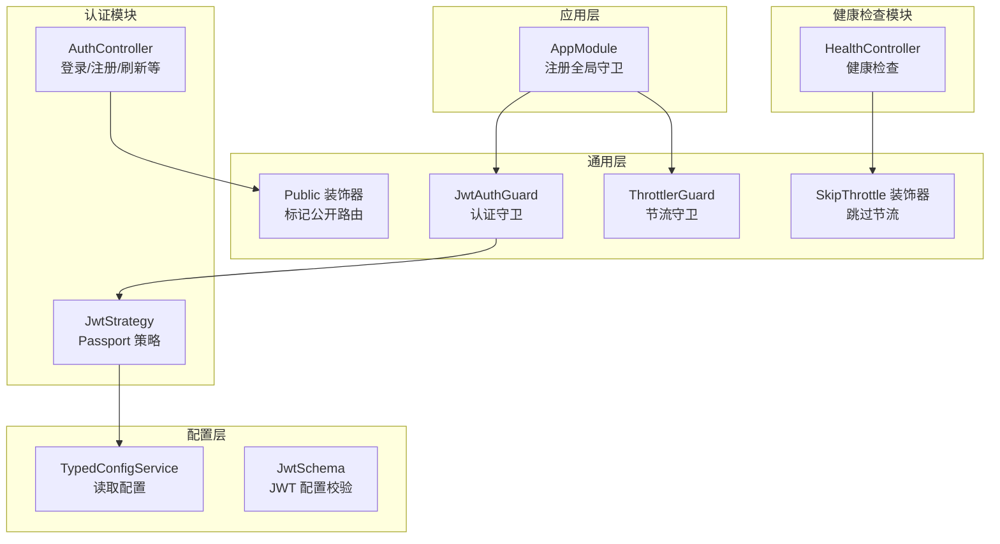
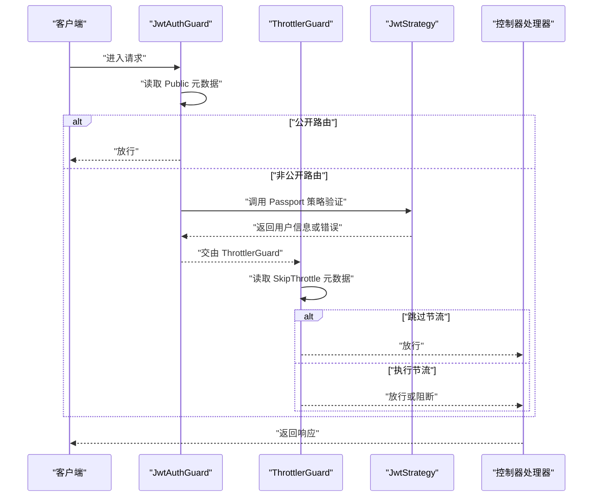
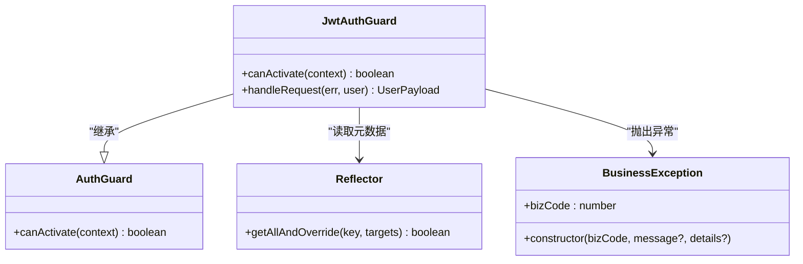
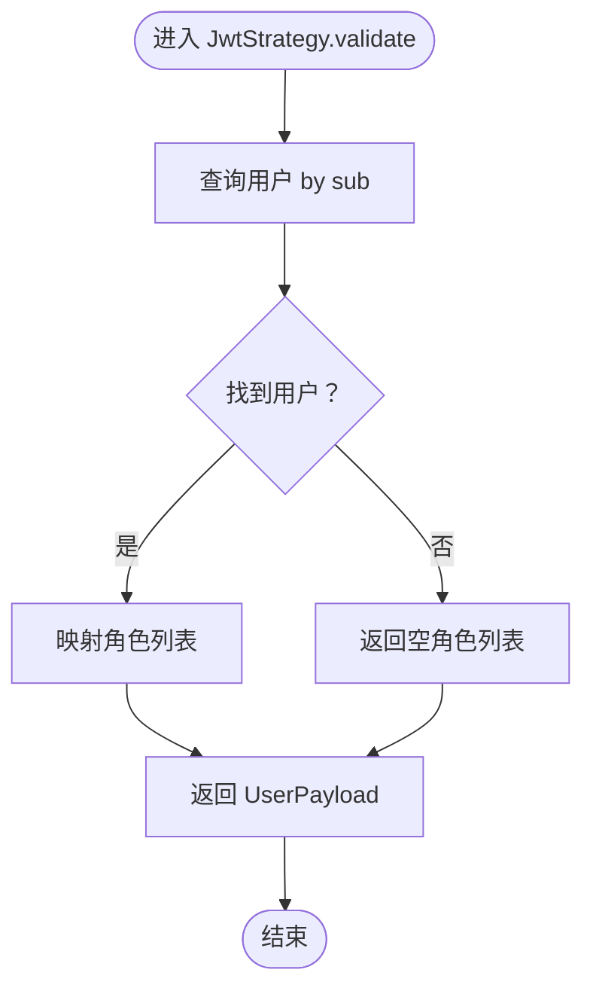
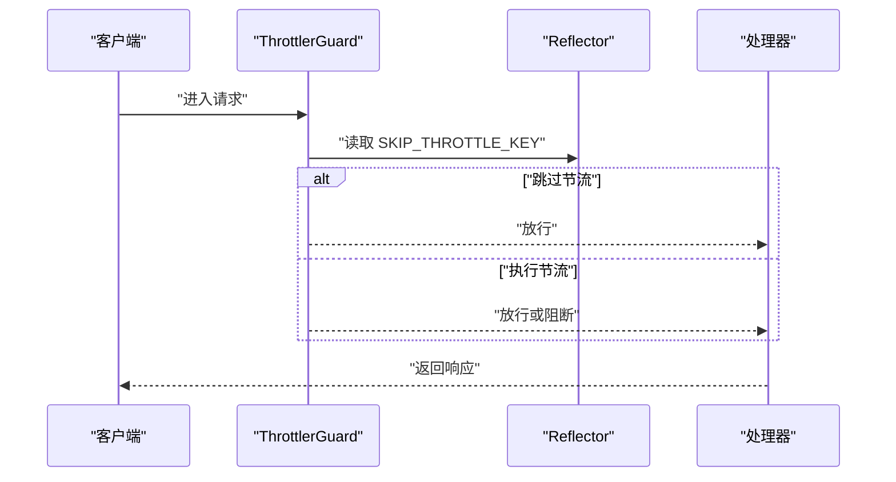
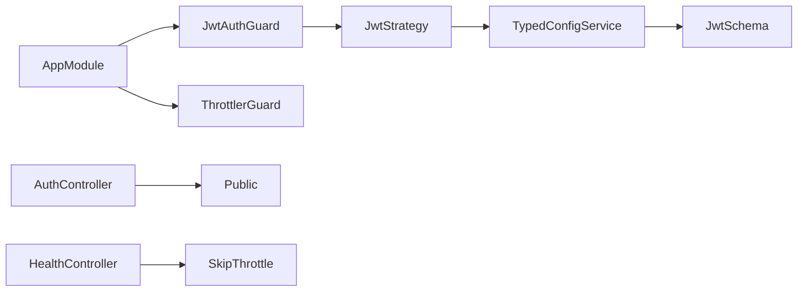

# 守卫机制

<cite>
**本文引用的文件**
- [src/common/guards/jwt-auth.guard.ts](file://src/common/guards/jwt-auth.guard.ts)
- [src/common/guards/throttler.guard.ts](file://src/common/guards/throttler.guard.ts)
- [src/modules/auth/strategies/jwt.strategy.ts](file://src/modules/auth/strategies/jwt.strategy.ts)
- [src/common/decorators/public.decorator.ts](file://src/common/decorators/public.decorator.ts)
- [src/common/decorators/skip-throttle.decorator.ts](file://src/common/decorators/skip-throttle.decorator.ts)
- [src/common/interfaces/user.interface.ts](file://src/common/interfaces/user.interface.ts)
- [src/common/interfaces/jwt.interface.ts](file://src/common/interfaces/jwt.interface.ts)
- [src/common/enums/biz-code.enum.ts](file://src/common/enums/biz-code.enum.ts)
- [src/common/exceptions/business.exception.ts](file://src/common/exceptions/business.exception.ts)
- [src/modules/auth/auth.controller.ts](file://src/modules/auth/auth.controller.ts)
- [src/modules/health/health.controller.ts](file://src/modules/health/health.controller.ts)
- [src/app.module.ts](file://src/app.module.ts)
- [src/config/schemas/jwt.schema.ts](file://src/config/schemas/jwt.schema.ts)
- [src/config/typed-config.service.ts](file://src/config/typed-config.service.ts)
</cite>

## 目录
1. [引言](#引言)
2. [项目结构](#项目结构)
3. [核心组件](#核心组件)
4. [架构总览](#架构总览)
5. [详细组件分析](#详细组件分析)
6. [依赖分析](#依赖分析)
7. [性能考虑](#性能考虑)
8. [故障排查指南](#故障排查指南)
9. [结论](#结论)
10. [附录](#附录)

## 引言
本文件系统性阐述本项目的守卫机制，重点覆盖以下方面：
- JWT 认证守卫的工作原理与实现细节：令牌提取、验证流程、用户身份解析、权限检查入口与错误处理。
- 节流守卫的限流算法与速率限制策略：全局阈值配置、分组策略、跳过规则与执行顺序。
- 守卫生命周期与执行顺序：如何与 NestJS 控制器、拦截器、过滤器协同工作。
- 自定义守卫的创建指南：接口实现、依赖注入、错误处理与最佳实践。
- 实际用例与配置：控制器装饰器、应用级守卫注册、配置项来源。

## 项目结构
本项目采用“按功能域划分”的模块化组织方式，守卫相关代码集中在通用层，认证策略位于认证模块，控制器通过装饰器声明式启用守卫能力。

图表来源
- [src/app.module.ts:18-61](file://src/app.module.ts#L18-L61)
- [src/common/guards/jwt-auth.guard.ts:17-46](file://src/common/guards/jwt-auth.guard.ts#L17-L46)
- [src/common/guards/throttler.guard.ts:10-33](file://src/common/guards/throttler.guard.ts#L10-L33)
- [src/modules/auth/strategies/jwt.strategy.ts:9-49](file://src/modules/auth/strategies/jwt.strategy.ts#L9-L49)
- [src/common/decorators/public.decorator.ts:1-5](file://src/common/decorators/public.decorator.ts#L1-L5)
- [src/common/decorators/skip-throttle.decorator.ts:1-12](file://src/common/decorators/skip-throttle.decorator.ts#L1-L12)
- [src/modules/auth/auth.controller.ts:36-129](file://src/modules/auth/auth.controller.ts#L36-L129)
- [src/modules/health/health.controller.ts:9-86](file://src/modules/health/health.controller.ts#L9-L86)
- [src/config/typed-config.service.ts:1-48](file://src/config/typed-config.service.ts#L1-L48)
- [src/config/schemas/jwt.schema.ts:1-11](file://src/config/schemas/jwt.schema.ts#L1-L11)

章节来源
- [src/app.module.ts:18-61](file://src/app.module.ts#L18-L61)
- [src/common/guards/jwt-auth.guard.ts:17-46](file://src/common/guards/jwt-auth.guard.ts#L17-L46)
- [src/common/guards/throttler.guard.ts:10-33](file://src/common/guards/throttler.guard.ts#L10-L33)
- [src/modules/auth/strategies/jwt.strategy.ts:9-49](file://src/modules/auth/strategies/jwt.strategy.ts#L9-L49)
- [src/common/decorators/public.decorator.ts:1-5](file://src/common/decorators/public.decorator.ts#L1-L5)
- [src/common/decorators/skip-throttle.decorator.ts:1-12](file://src/common/decorators/skip-throttle.decorator.ts#L1-L12)
- [src/modules/auth/auth.controller.ts:36-129](file://src/modules/auth/auth.controller.ts#L36-L129)
- [src/modules/health/health.controller.ts:9-86](file://src/modules/health/health.controller.ts#L9-L86)
- [src/config/typed-config.service.ts:1-48](file://src/config/typed-config.service.ts#L1-L48)
- [src/config/schemas/jwt.schema.ts:1-11](file://src/config/schemas/jwt.schema.ts#L1-L11)

## 核心组件
- 认证守卫（JwtAuthGuard）
  - 继承自 NestJS Passport 的 AuthGuard('jwt')，通过 Reflector 读取 Public 装饰器元数据决定是否放行。
  - handleRequest 中对认证失败或用户缺失进行统一业务异常抛出，便于上层过滤器转换为标准响应。
- 节流守卫（ThrottlerGuard）
  - 继承自 @nestjs/throttler 的 ThrottlerGuard，重写 canActivate，结合 SkipThrottle 元数据实现“跳过节流”。
  - 全局通过 ThrottlerModule.forRoot 注册多组阈值（short/medium/long），在控制器中以 @Throttle 或装饰器组合使用。
- 认证策略（JwtStrategy）
  - 基于 passport-jwt，从 Authorization 头部提取 Bearer 令牌，使用 TypedConfigService 读取密钥与过期策略。
  - validate 中根据 payload.sub 查询用户角色信息，构造 UserPayload 并注入到请求上下文。
- 公开路由装饰器（Public）
  - 使用 SetMetadata 标记路由为“公开”，JwtAuthGuard 在 canActivate 中优先放行。
- 跳过节流装饰器（SkipThrottle）
  - 使用 SetMetadata 标记路由“跳过节流”，ThrottlerGuard 在 canActivate 中优先放行。
- 业务异常与状态码（BizCode/BusinessException）
  - BusinessException 统一封装业务码、HTTP 状态码与消息，确保认证失败返回 401。

章节来源
- [src/common/guards/jwt-auth.guard.ts:17-46](file://src/common/guards/jwt-auth.guard.ts#L17-L46)
- [src/common/guards/throttler.guard.ts:10-33](file://src/common/guards/throttler.guard.ts#L10-L33)
- [src/modules/auth/strategies/jwt.strategy.ts:9-49](file://src/modules/auth/strategies/jwt.strategy.ts#L9-L49)
- [src/common/decorators/public.decorator.ts:1-5](file://src/common/decorators/public.decorator.ts#L1-L5)
- [src/common/decorators/skip-throttle.decorator.ts:1-12](file://src/common/decorators/skip-throttle.decorator.ts#L1-L12)
- [src/common/enums/biz-code.enum.ts:13-78](file://src/common/enums/biz-code.enum.ts#L13-L78)
- [src/common/exceptions/business.exception.ts:16-42](file://src/common/exceptions/business.exception.ts#L16-L42)

## 架构总览
下图展示守卫在请求生命周期中的位置与协作关系：应用级注册两个守卫，JwtAuthGuard 负责认证与用户注入，ThrottlerGuard 负责速率限制；控制器通过装饰器声明式启用公开路由或跳过节流。

图表来源
- [src/common/guards/jwt-auth.guard.ts:23-44](file://src/common/guards/jwt-auth.guard.ts#L23-L44)
- [src/common/guards/throttler.guard.ts:20-31](file://src/common/guards/throttler.guard.ts#L20-L31)
- [src/modules/auth/strategies/jwt.strategy.ts:22-47](file://src/modules/auth/strategies/jwt.strategy.ts#L22-L47)
- [src/app.module.ts:34-41](file://src/app.module.ts#L34-L41)

## 详细组件分析

### JWT 认证守卫（JwtAuthGuard）
- 设计要点
  - 继承自 AuthGuard('jwt')，复用 Passport 的令牌解析与验证流程。
  - 通过 Reflector 读取 IS_PUBLIC_KEY 元数据，若为 true 则直接放行，避免对公开接口重复鉴权。
  - handleRequest 中对 err 或 user 为空的情况统一抛出业务异常（401），便于全局过滤器转换为标准响应。
- 数据模型
  - UserPayload：包含用户标识与角色列表，供控制器读取。
  - JwtPayload：来自 JWT 的载荷，其中 sub 代表用户标识。
- 生命周期与执行顺序
  - 应用级注册后，所有路由均受 JwtAuthGuard 保护；控制器可通过 Public 装饰器声明例外。
- 错误处理
  - 未授权场景抛出 BusinessException，BizCode.UNAUTHORIZED 映射为 401。

图表来源
- [src/common/guards/jwt-auth.guard.ts:17-46](file://src/common/guards/jwt-auth.guard.ts#L17-L46)
- [src/common/enums/biz-code.enum.ts:22-23](file://src/common/enums/biz-code.enum.ts#L22-L23)
- [src/common/exceptions/business.exception.ts:16-42](file://src/common/exceptions/business.exception.ts#L16-L42)

章节来源
- [src/common/guards/jwt-auth.guard.ts:17-46](file://src/common/guards/jwt-auth.guard.ts#L17-L46)
- [src/common/interfaces/user.interface.ts:6-9](file://src/common/interfaces/user.interface.ts#L6-L9)
- [src/common/interfaces/jwt.interface.ts:5-10](file://src/common/interfaces/jwt.interface.ts#L5-L10)
- [src/common/enums/biz-code.enum.ts:22-23](file://src/common/enums/biz-code.enum.ts#L22-L23)
- [src/common/exceptions/business.exception.ts:16-42](file://src/common/exceptions/business.exception.ts#L16-L42)

### 认证策略（JwtStrategy）
- 设计要点
  - 基于 passport-jwt，从 Authorization 头部提取 Bearer 令牌。
  - 使用 TypedConfigService 读取 jwt.secret、ignoreExpiration 等配置。
  - validate 中根据 payload.sub 查询用户与角色，构造 UserPayload 注入请求上下文。
- 与守卫的关系
  - JwtAuthGuard 依赖 JwtStrategy 的验证结果；验证通过后用户信息被挂载到 RequestWithUser.user。
- 数据库交互
  - 通过 PrismaService 查询用户及其角色集合，若用户不存在则返回空角色列表。

图表来源
- [src/modules/auth/strategies/jwt.strategy.ts:22-47](file://src/modules/auth/strategies/jwt.strategy.ts#L22-L47)
- [src/prisma/prisma.service.ts](file://src/prisma/prisma.service.ts)

章节来源
- [src/modules/auth/strategies/jwt.strategy.ts:9-49](file://src/modules/auth/strategies/jwt.strategy.ts#L9-L49)
- [src/config/typed-config.service.ts:23-38](file://src/config/typed-config.service.ts#L23-L38)
- [src/config/schemas/jwt.schema.ts:3-8](file://src/config/schemas/jwt.schema.ts#L3-L8)

### 节流守卫（ThrottlerGuard）
- 设计要点
  - 继承自 @nestjs/throttler 的 ThrottlerGuard，重写 canActivate。
  - 通过 Reflector 读取 SKIP_THROTTLE_KEY 元数据，若为 true 则直接放行。
  - 全局通过 ThrottlerModule.forRoot 注册多组阈值（short/medium/long），在控制器中以 @Throttle 或装饰器组合使用。
- 与控制器的协作
  - HealthController 使用 @SkipThrottle 装饰器，避免健康检查接口被节流限制。
  - AuthController 的验证码/登录接口分别设置不同阈值，平衡安全与可用性。

图表来源
- [src/common/guards/throttler.guard.ts:20-31](file://src/common/guards/throttler.guard.ts#L20-L31)
- [src/common/decorators/skip-throttle.decorator.ts:3-11](file://src/common/decorators/skip-throttle.decorator.ts#L3-L11)
- [src/modules/health/health.controller.ts:10-11](file://src/modules/health/health.controller.ts#L10-L11)

章节来源
- [src/common/guards/throttler.guard.ts:10-33](file://src/common/guards/throttler.guard.ts#L10-L33)
- [src/common/decorators/skip-throttle.decorator.ts:1-12](file://src/common/decorators/skip-throttle.decorator.ts#L1-L12)
- [src/modules/health/health.controller.ts:9-86](file://src/modules/health/health.controller.ts#L9-L86)
- [src/app.module.ts:21-25](file://src/app.module.ts#L21-L25)

### 公开路由与跳过节流装饰器
- Public 装饰器
  - 通过 SetMetadata 设置 IS_PUBLIC_KEY 元数据，JwtAuthGuard 在 canActivate 中读取并决定放行。
- SkipThrottle 装饰器
  - 通过 SetMetadata 设置 SKIP_THROTTLE_KEY 元数据，ThrottlerGuard 在 canActivate 中读取并决定放行。

章节来源
- [src/common/decorators/public.decorator.ts:1-5](file://src/common/decorators/public.decorator.ts#L1-L5)
- [src/common/decorators/skip-throttle.decorator.ts:1-12](file://src/common/decorators/skip-throttle.decorator.ts#L1-L12)

### 控制器中的守卫使用示例
- 认证模块（AuthController）
  - 登录/注册/刷新接口使用 Public 装饰器，配合 JwtAuthGuard 实现“公开路由”。
  - 登录接口使用 @Throttle 设置短时间窗口内的最大请求数，验证码接口使用长窗口阈值。
- 健康检查模块（HealthController）
  - 使用 @SkipThrottle 装饰器，避免健康检查被节流限制。

章节来源
- [src/modules/auth/auth.controller.ts:44-86](file://src/modules/auth/auth.controller.ts#L44-L86)
- [src/modules/health/health.controller.ts:10-11](file://src/modules/health/health.controller.ts#L10-L11)

## 依赖分析
- 守卫注册
  - AppModule 通过 APP_GUARD 提供 JwtAuthGuard 与 ThrottlerGuard，形成全局生效的保护层。
- 配置依赖
  - JwtStrategy 依赖 TypedConfigService 读取 jwt.secret 等配置；JwtSchema 对配置进行校验。
- 控制器协作
  - 控制器通过装饰器声明式启用守卫能力，减少样板代码，提升可维护性。

图表来源
- [src/app.module.ts:34-41](file://src/app.module.ts#L34-L41)
- [src/modules/auth/strategies/jwt.strategy.ts:11-19](file://src/modules/auth/strategies/jwt.strategy.ts#L11-L19)
- [src/config/typed-config.service.ts:11-18](file://src/config/typed-config.service.ts#L11-L18)
- [src/config/schemas/jwt.schema.ts:3-8](file://src/config/schemas/jwt.schema.ts#L3-L8)
- [src/modules/auth/auth.controller.ts:44-86](file://src/modules/auth/auth.controller.ts#L44-L86)
- [src/modules/health/health.controller.ts:10-11](file://src/modules/health/health.controller.ts#L10-L11)

章节来源
- [src/app.module.ts:18-61](file://src/app.module.ts#L18-L61)
- [src/modules/auth/strategies/jwt.strategy.ts:9-49](file://src/modules/auth/strategies/jwt.strategy.ts#L9-L49)
- [src/config/typed-config.service.ts:1-48](file://src/config/typed-config.service.ts#L1-L48)
- [src/config/schemas/jwt.schema.ts:1-11](file://src/config/schemas/jwt.schema.ts#L1-L11)
- [src/modules/auth/auth.controller.ts:36-129](file://src/modules/auth/auth.controller.ts#L36-L129)
- [src/modules/health/health.controller.ts:9-86](file://src/modules/health/health.controller.ts#L9-L86)

## 性能考虑
- 令牌验证成本
  - JwtStrategy 仅进行数据库轻量查询（按用户主键查找），建议在数据库侧建立合适索引以降低延迟。
- 节流策略
  - 全局配置了 short/medium/long 三档阈值，建议根据接口特性选择合适的组别，避免过度限制。
- 公开路由优化
  - Public 装饰器可显著减少非敏感接口的鉴权开销，建议尽可能将健康检查、登录页等接口标记为公开。
- 缓存与存储
  - 节流存储默认基于内存，生产环境建议替换为持久化存储以支持多实例部署。

## 故障排查指南
- 401 未授权
  - 可能原因：令牌缺失、格式错误、签名无效、过期、用户不存在。
  - 排查步骤：确认 Authorization 头是否为 Bearer 令牌；核对 jwt.secret 是否正确；检查用户是否存在。
- 429 速率超限
  - 可能原因：请求过于频繁，超过 short/medium/long 组阈值。
  - 排查步骤：检查控制器上的 @Throttle 配置；确认是否误用了 @SkipThrottle。
- 公开路由仍被拦截
  - 可能原因：元数据未正确设置或反射读取失败。
  - 排查步骤：确认控制器方法或类上是否正确使用 Public 装饰器。
- 业务异常与状态码
  - BusinessException 统一返回 BizCode 与 HTTP 状态码映射，便于前端一致处理。

章节来源
- [src/common/guards/jwt-auth.guard.ts:36-44](file://src/common/guards/jwt-auth.guard.ts#L36-L44)
- [src/common/enums/biz-code.enum.ts:127-166](file://src/common/enums/biz-code.enum.ts#L127-L166)
- [src/common/exceptions/business.exception.ts:16-42](file://src/common/exceptions/business.exception.ts#L16-L42)

## 结论
本项目的守卫机制通过“应用级全局守卫 + 控制器装饰器”的组合，实现了认证与限流的解耦与可配置化。JwtAuthGuard 负责认证与用户注入，ThrottlerGuard 负责速率限制，二者配合 TypedConfigService 与装饰器元数据，既保证了安全性，又兼顾了灵活性与可维护性。建议在生产环境中进一步完善节流存储、日志监控与异常上报体系。

## 附录
- 自定义守卫最佳实践
  - 明确职责边界：认证守卫只负责认证与用户注入，权限检查建议在拦截器或自定义装饰器中完成。
  - 依赖注入：优先使用构造函数注入，避免在守卫中硬编码配置。
  - 错误处理：统一抛出 BusinessException，便于全局过滤器转换为标准响应。
  - 测试：为守卫编写单元测试，覆盖 Public 与非 Public 场景、跳过节流场景等。