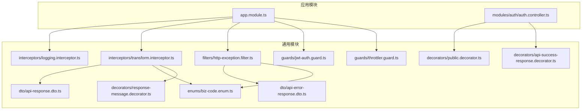
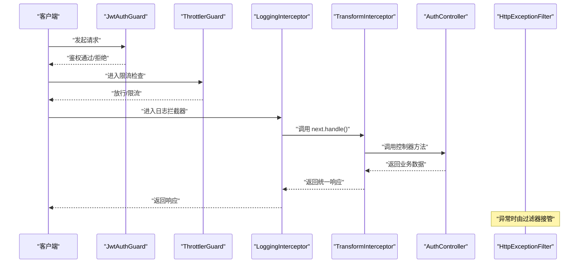
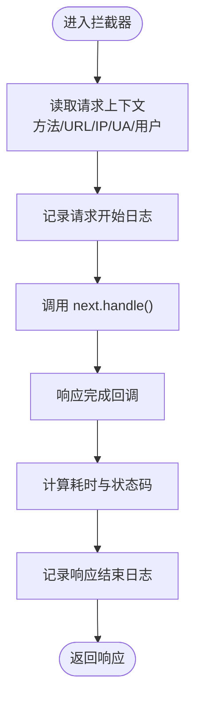
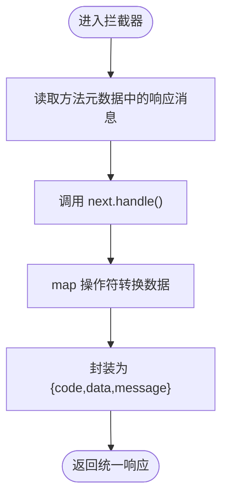
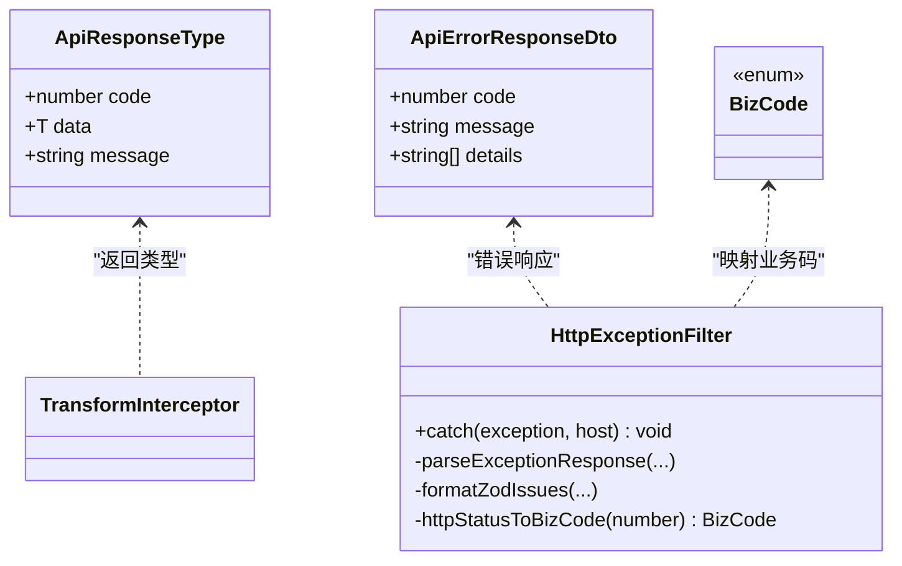
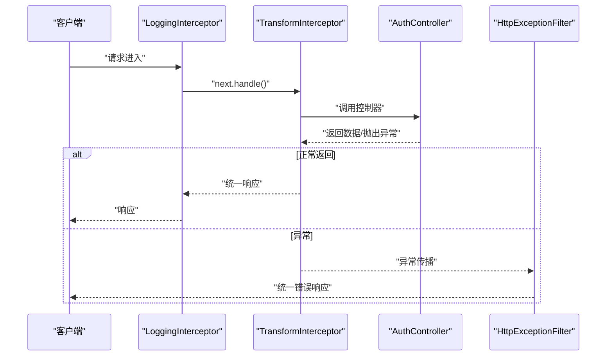
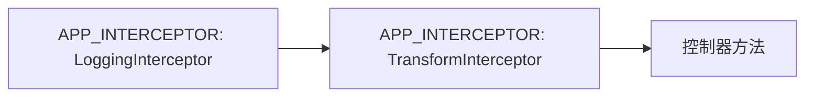
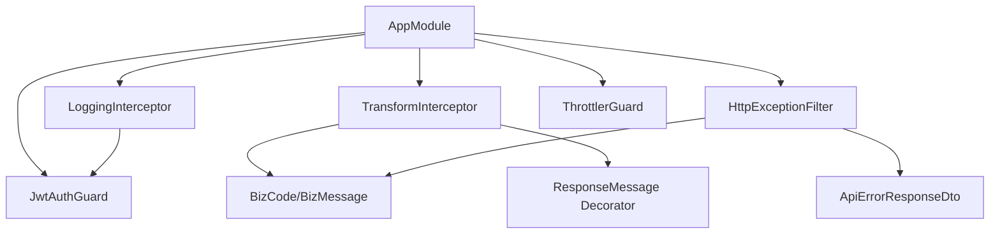

# 拦截器实现

<cite>
**本文引用的文件**
- [logging.interceptor.ts](file://src/common/interceptors/logging.interceptor.ts)
- [transform.interceptor.ts](file://src/common/interceptors/transform.interceptor.ts)
- [transform.interceptor.spec.ts](file://src/common/interceptors/transform.interceptor.spec.ts)
- [api-response.dto.ts](file://src/common/dto/api-response.dto.ts)
- [api-error-response.dto.ts](file://src/common/dto/api-error-response.dto.ts)
- [biz-code.enum.ts](file://src/common/enums/biz-code.enum.ts)
- [response-message.decorator.ts](file://src/common/decorators/response-message.decorator.ts)
- [jwt-auth.guard.ts](file://src/common/guards/jwt-auth.guard.ts)
- [app.module.ts](file://src/app.module.ts)
- [auth.controller.ts](file://src/modules/auth/auth.controller.ts)
- [api-success-response.decorator.ts](file://src/common/decorators/api-success-response.decorator.ts)
- [http-exception.filter.ts](file://src/common/filters/http-exception.filter.ts)
- [public.decorator.ts](file://src/common/decorators/public.decorator.ts)
- [throttler.guard.ts](file://src/common/guards/throttler.guard.ts)
</cite>

## 目录

1. [简介](#简介)
2. [项目结构](#项目结构)
3. [核心组件](#核心组件)
4. [架构总览](#架构总览)
5. [详细组件分析](#详细组件分析)
6. [依赖关系分析](#依赖关系分析)
7. [性能考量](#性能考量)
8. [故障排查指南](#故障排查指南)
9. [结论](#结论)
10. [附录](#附录)

## 简介

本文件系统性阐述该项目中拦截器的架构与实现，重点覆盖以下方面：

- 日志拦截器：请求/响应日志记录、性能监控与调试信息输出
- 数据转换拦截器：统一响应格式、数据序列化与错误包装
- 执行时机、上下文传递与异常传播机制
- 拦截器链组合使用与优先级管理
- 自定义拦截器开发与性能优化建议

## 项目结构

拦截器位于通用模块的 interceptors 目录，配合 DTO、枚举、装饰器、守卫与全局模块进行集成。

图表来源

- [app.module.ts:18-61](file://src/app.module.ts#L18-L61)
- [logging.interceptor.ts:12-40](file://src/common/interceptors/logging.interceptor.ts#L12-L40)
- [transform.interceptor.ts:14-41](file://src/common/interceptors/transform.interceptor.ts#L14-L41)
- [api-response.dto.ts:1-40](file://src/common/dto/api-response.dto.ts#L1-L40)
- [api-error-response.dto.ts:1-14](file://src/common/dto/api-error-response.dto.ts#L1-L14)
- [biz-code.enum.ts:1-171](file://src/common/enums/biz-code.enum.ts#L1-L171)
- [response-message.decorator.ts:1-6](file://src/common/decorators/response-message.decorator.ts#L1-L6)
- [api-success-response.decorator.ts:1-172](file://src/common/decorators/api-success-response.decorator.ts#L1-L172)
- [jwt-auth.guard.ts:17-46](file://src/common/guards/jwt-auth.guard.ts#L17-L46)
- [http-exception.filter.ts:24-173](file://src/common/filters/http-exception.filter.ts#L24-L173)
- [auth.controller.ts:35-129](file://src/modules/auth/auth.controller.ts#L35-L129)

章节来源

- [app.module.ts:18-61](file://src/app.module.ts#L18-L61)

## 核心组件

- 日志拦截器：记录请求开始与结束时的关键信息，包含方法、URL、用户标识、IP、UA、耗时与状态码等，便于性能监控与问题定位。
- 数据转换拦截器：将控制器返回的数据统一包装为统一响应格式，包含业务码、消息与数据体；支持通过装饰器覆盖默认消息。
- 业务码与消息：集中定义业务码与默认消息映射，以及 HTTP 状态码映射逻辑，确保错误与响应的一致性。
- 异常过滤器：将各类异常映射为统一错误响应格式，保留字段级校验细节。
- 控制器装饰器：Swagger 文档与响应消息装饰器，保证接口文档与响应结构一致性。

章节来源

- [logging.interceptor.ts:12-40](file://src/common/interceptors/logging.interceptor.ts#L12-L40)
- [transform.interceptor.ts:14-41](file://src/common/interceptors/transform.interceptor.ts#L14-L41)
- [api-response.dto.ts:1-40](file://src/common/dto/api-response.dto.ts#L1-L40)
- [api-error-response.dto.ts:1-14](file://src/common/dto/api-error-response.dto.ts#L1-L14)
- [biz-code.enum.ts:1-171](file://src/common/enums/biz-code.enum.ts#L1-L171)
- [api-success-response.decorator.ts:1-172](file://src/common/decorators/api-success-response.decorator.ts#L1-L172)
- [http-exception.filter.ts:24-173](file://src/common/filters/http-exception.filter.ts#L24-L173)

## 架构总览

拦截器在全局模块中注册为应用级拦截器，形成“日志拦截器 → 数据转换拦截器”的执行链。异常过滤器与守卫共同协作，确保请求生命周期内从鉴权、限流、日志、转换到异常处理的完整闭环。

图表来源

- [app.module.ts:33-57](file://src/app.module.ts#L33-L57)
- [jwt-auth.guard.ts:23-44](file://src/common/guards/jwt-auth.guard.ts#L23-L44)
- [throttler.guard.ts:20-31](file://src/common/guards/throttler.guard.ts#L20-L31)
- [logging.interceptor.ts:16-38](file://src/common/interceptors/logging.interceptor.ts#L16-L38)
- [transform.interceptor.ts:21-39](file://src/common/interceptors/transform.interceptor.ts#L21-L39)
- [auth.controller.ts:38-127](file://src/modules/auth/auth.controller.ts#L38-L127)
- [http-exception.filter.ts:28-78](file://src/common/filters/http-exception.filter.ts#L28-L78)

## 详细组件分析

### 日志拦截器

- 功能要点
  - 在请求进入时记录方法、URL、用户 ID、IP、UA 等信息
  - 在响应完成时计算耗时与状态码，输出统一日志
  - 使用 Nest Logger 输出，便于日志聚合与级别控制
- 关键实现点
  - 获取请求与响应上下文，读取用户信息与 UA
  - 使用时间戳计算耗时，结合响应状态码输出
  - 通过 RxJS 的 tap 操作符在 next.handle() 完成后执行日志输出
- 性能影响
  - 日志输出为 O(1)，对吞吐影响极小
  - 建议在高并发场景下合理配置日志级别与采样策略

图表来源

- [logging.interceptor.ts:16-38](file://src/common/interceptors/logging.interceptor.ts#L16-L38)

章节来源

- [logging.interceptor.ts:12-40](file://src/common/interceptors/logging.interceptor.ts#L12-L40)

### 数据转换拦截器

- 功能要点
  - 将控制器返回的数据统一包装为 { code, data, message }
  - 默认成功码为 0，消息来自装饰器或默认映射
  - 支持空数据（null）与 undefined 的统一处理
- 关键实现点
  - 使用 Reflector 读取方法级元数据中的响应消息
  - 通过 map 操作符在 next.handle() 流程中转换数据
  - 泛型约束 ApiResponseType<T>，确保类型安全
- 单元测试验证
  - 覆盖了有数据、空数据与未定义数据的三种场景
  - 验证统一响应结构与默认消息行为

图表来源

- [transform.interceptor.ts:21-39](file://src/common/interceptors/transform.interceptor.ts#L21-L39)
- [response-message.decorator.ts:3-6](file://src/common/decorators/response-message.decorator.ts#L3-L6)
- [api-response.dto.ts:35-40](file://src/common/dto/api-response.dto.ts#L35-L40)

章节来源

- [transform.interceptor.ts:14-41](file://src/common/interceptors/transform.interceptor.ts#L14-L41)
- [transform.interceptor.spec.ts:22-107](file://src/common/interceptors/transform.interceptor.spec.ts#L22-L107)

### 统一响应与错误包装

- 统一响应结构
  - 成功响应：包含业务码、数据体与消息
  - 错误响应：包含业务码、消息与可选的错误详情
- 业务码与消息映射
  - 集中定义业务码与默认消息，提供 HTTP 状态码映射
- 异常过滤器
  - 将 HttpException 映射为统一错误响应
  - 特殊处理 Zod 校验异常与 class-validator 校验错误，提取字段级详情
  - 记录警告日志，便于审计与追踪

图表来源

- [api-response.dto.ts:35-40](file://src/common/dto/api-response.dto.ts#L35-L40)
- [api-error-response.dto.ts:1-14](file://src/common/dto/api-error-response.dto.ts#L1-L14)
- [biz-code.enum.ts:13-171](file://src/common/enums/biz-code.enum.ts#L13-L171)
- [http-exception.filter.ts:24-173](file://src/common/filters/http-exception.filter.ts#L24-L173)

章节来源

- [api-response.dto.ts:1-40](file://src/common/dto/api-response.dto.ts#L1-L40)
- [api-error-response.dto.ts:1-14](file://src/common/dto/api-error-response.dto.ts#L1-L14)
- [biz-code.enum.ts:1-171](file://src/common/enums/biz-code.enum.ts#L1-L171)
- [http-exception.filter.ts:24-173](file://src/common/filters/http-exception.filter.ts#L24-L173)

### 执行时机、上下文传递与异常传播

- 执行顺序
  - 全局注册顺序决定拦截器链顺序：日志拦截器先于数据转换拦截器
  - 控制器方法在拦截器链之间被调用
- 上下文传递
  - ExecutionContext 提供请求/响应上下文，拦截器可读取用户信息与请求头
  - Reflector 用于读取方法级元数据（如响应消息）
- 异常传播
  - 控制器抛出的异常由 HttpExceptionFilter 捕获并统一输出
  - 业务异常 BusinessException 直接携带业务码与消息

图表来源

- [app.module.ts:43-53](file://src/app.module.ts#L43-L53)
- [logging.interceptor.ts:16-38](file://src/common/interceptors/logging.interceptor.ts#L16-L38)
- [transform.interceptor.ts:21-39](file://src/common/interceptors/transform.interceptor.ts#L21-L39)
- [http-exception.filter.ts:28-78](file://src/common/filters/http-exception.filter.ts#L28-L78)

章节来源

- [app.module.ts:33-57](file://src/app.module.ts#L33-L57)
- [jwt-auth.guard.ts:23-44](file://src/common/guards/jwt-auth.guard.ts#L23-L44)
- [throttler.guard.ts:20-31](file://src/common/guards/throttler.guard.ts#L20-L31)
- [logging.interceptor.ts:16-38](file://src/common/interceptors/logging.interceptor.ts#L16-L38)
- [transform.interceptor.ts:21-39](file://src/common/interceptors/transform.interceptor.ts#L21-L39)
- [http-exception.filter.ts:28-78](file://src/common/filters/http-exception.filter.ts#L28-L78)

### 拦截器链组合与优先级管理

- 注册方式
  - 在全局模块中以 APP_INTERCEPTOR 提供者注册两个拦截器
  - 顺序即为链式执行顺序：日志拦截器 → 数据转换拦截器
- 优先级建议
  - 日志拦截器通常放在首位，以便捕获完整的请求生命周期
  - 数据转换拦截器紧随其后，确保统一响应格式
- 控制器级覆盖
  - 通过装饰器（如 ApiSuccessNoDataResponse）设置响应消息
  - Swagger 文档与响应结构保持一致

图表来源

- [app.module.ts:43-53](file://src/app.module.ts#L43-L53)
- [api-success-response.decorator.ts:110-128](file://src/common/decorators/api-success-response.decorator.ts#L110-L128)

章节来源

- [app.module.ts:43-53](file://src/app.module.ts#L43-L53)
- [api-success-response.decorator.ts:110-128](file://src/common/decorators/api-success-response.decorator.ts#L110-L128)

### 自定义拦截器开发教程

- 设计原则
  - 明确职责边界：日志、转换、鉴权、限流等职责分离
  - 保持无副作用：拦截器只做横切关注，不改变业务逻辑
  - 类型安全：利用泛型与 DTO 确保输入输出结构
- 开发步骤
  - 实现 NestInterceptor 接口，定义 intercept 方法
  - 使用 ExecutionContext 获取请求/响应上下文
  - 使用 CallHandler.handle() 获取上游结果流
  - 使用 RxJS 操作符（tap、map、catchError）处理数据与异常
  - 通过 Reflector 读取元数据，实现灵活配置
- 最佳实践
  - 仅在必要时进行昂贵操作（如 IO、序列化）
  - 合理使用缓存与采样，避免成为性能瓶颈
  - 保持日志简洁且可检索，避免泄露敏感信息
  - 与异常过滤器配合，确保错误路径清晰可控

章节来源

- [logging.interceptor.ts:12-40](file://src/common/interceptors/logging.interceptor.ts#L12-L40)
- [transform.interceptor.ts:14-41](file://src/common/interceptors/transform.interceptor.ts#L14-L41)
- [api-response.dto.ts:1-40](file://src/common/dto/api-response.dto.ts#L1-L40)
- [biz-code.enum.ts:1-171](file://src/common/enums/biz-code.enum.ts#L1-L171)

## 依赖关系分析

- 模块依赖
  - AppModule 将拦截器、守卫、过滤器、管道统一注册为全局服务
  - 控制器通过装饰器与元数据参与响应结构与文档生成
- 组件耦合
  - 数据转换拦截器依赖业务码枚举与响应消息装饰器
  - 异常过滤器依赖业务码枚举与错误 DTO
  - 日志拦截器依赖守卫提供的用户上下文

图表来源

- [app.module.ts:33-57](file://src/app.module.ts#L33-L57)
- [transform.interceptor.ts:19-39](file://src/common/interceptors/transform.interceptor.ts#L19-L39)
- [biz-code.enum.ts:83-122](file://src/common/enums/biz-code.enum.ts#L83-L122)
- [response-message.decorator.ts:3-6](file://src/common/decorators/response-message.decorator.ts#L3-L6)
- [api-error-response.dto.ts:1-14](file://src/common/dto/api-error-response.dto.ts#L1-L14)
- [jwt-auth.guard.ts:17-46](file://src/common/guards/jwt-auth.guard.ts#L17-L46)

章节来源

- [app.module.ts:18-61](file://src/app.module.ts#L18-L61)
- [auth.controller.ts:38-127](file://src/modules/auth/auth.controller.ts#L38-L127)

## 性能考量

- 日志开销
  - 建议在生产环境降低日志级别或启用采样，避免高频请求造成 I/O 压力
- 数据转换
  - map 操作为纯函数式转换，成本低；避免在拦截器中进行深度序列化或大对象处理
- 异常处理
  - 过滤器仅在异常发生时介入，正常路径零开销
- 链路优化
  - 保持拦截器链短而精，避免重复计算与多次 IO
  - 对热点接口可考虑局部禁用某些拦截器（通过装饰器或路由级配置）

## 故障排查指南

- 常见问题
  - 统一响应未生效：检查是否正确注册了数据转换拦截器，确认控制器返回值类型与装饰器使用
  - 日志缺失：确认日志拦截器注册顺序与日志级别配置
  - 错误响应不符合预期：检查异常过滤器对不同异常类型的映射逻辑
- 排查步骤
  - 查看拦截器链执行顺序与上下文信息
  - 检查业务码与消息映射是否正确
  - 核对 Swagger 文档与实际响应结构一致性
  - 关注异常过滤器的日志输出，定位错误来源

章节来源

- [http-exception.filter.ts:28-78](file://src/common/filters/http-exception.filter.ts#L28-L78)
- [api-success-response.decorator.ts:18-68](file://src/common/decorators/api-success-response.decorator.ts#L18-L68)

## 结论

本项目通过全局注册的日志与数据转换拦截器，构建了清晰、一致且可扩展的横切能力。结合业务码体系、异常过滤器与装饰器，实现了从请求到响应的全链路可观测与规范化输出。遵循本文的开发与优化建议，可在保证功能完整性的同时，兼顾性能与可维护性。

## 附录

- 控制器示例
  - 认证模块控制器展示了如何使用装饰器标注成功响应与无数据响应，确保接口文档与响应结构一致
- 元数据与装饰器
  - 响应消息装饰器与 Swagger 成功响应装饰器协同工作，提升接口文档质量与一致性

章节来源

- [auth.controller.ts:44-127](file://src/modules/auth/auth.controller.ts#L44-L127)
- [api-success-response.decorator.ts:70-128](file://src/common/decorators/api-success-response.decorator.ts#L70-L128)
- [response-message.decorator.ts:3-6](file://src/common/decorators/response-message.decorator.ts#L3-L6)
