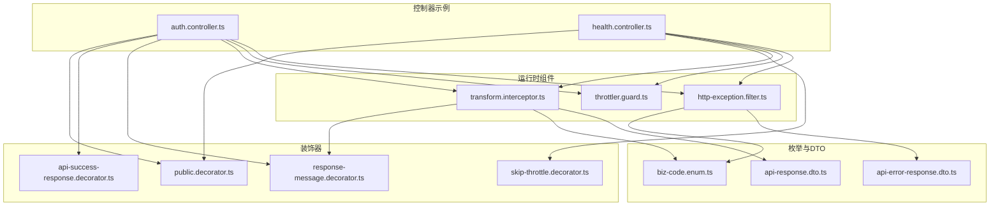
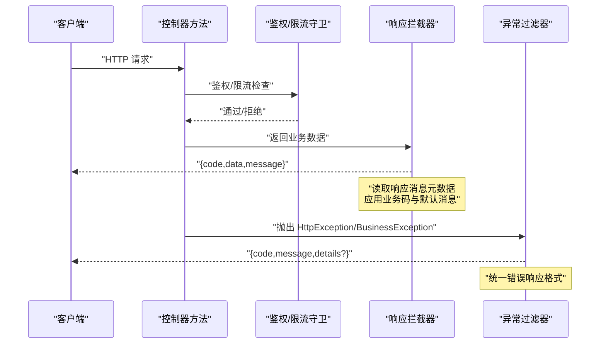
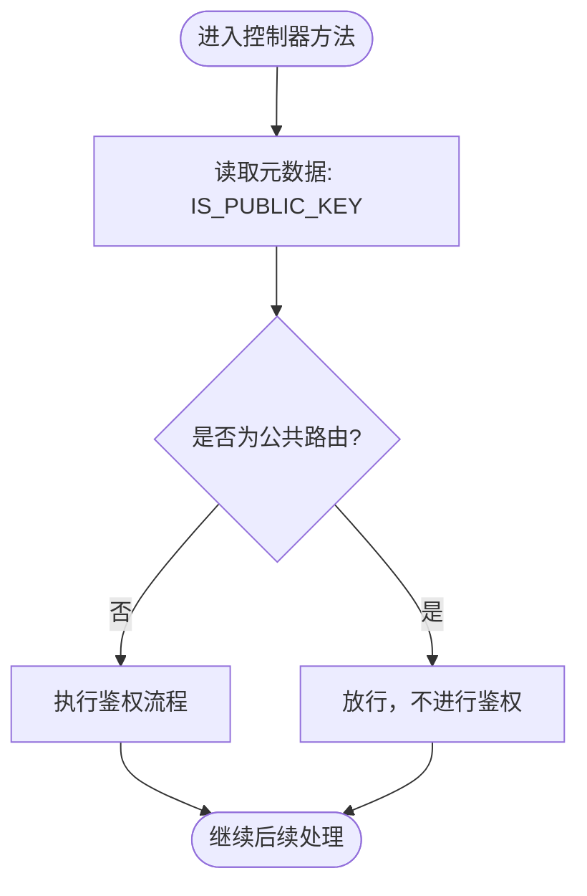
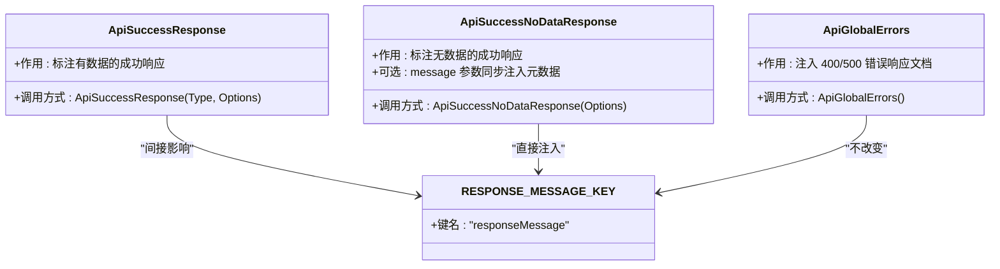
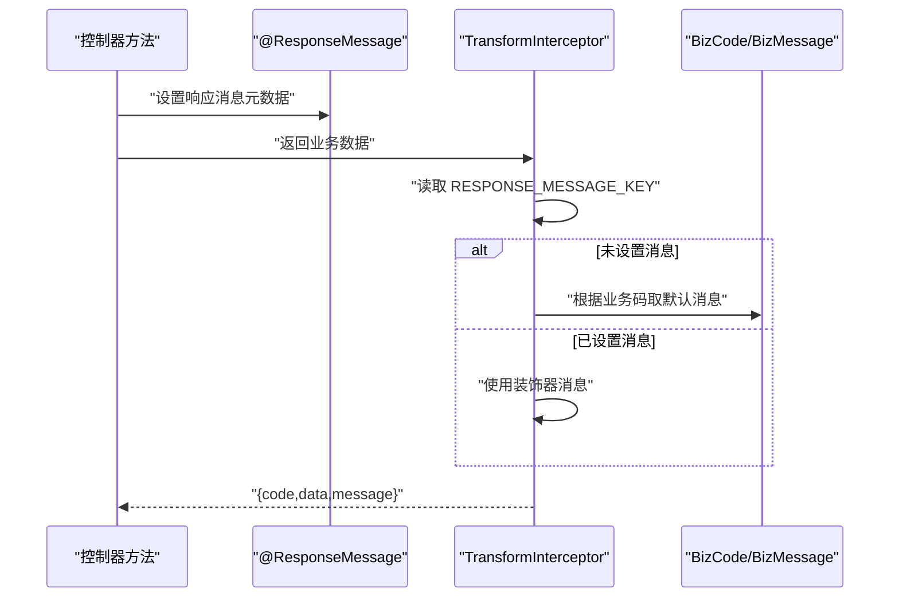
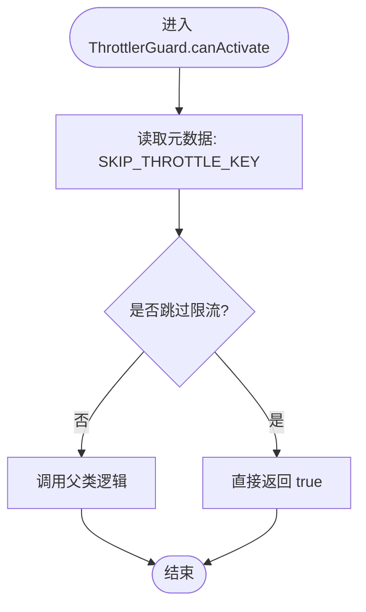
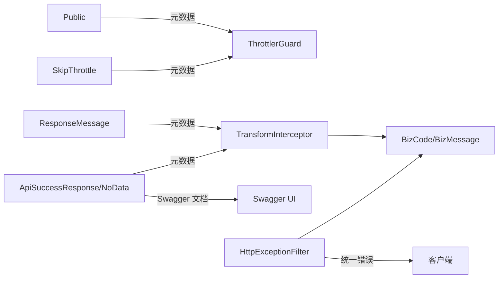

# 装饰器和工具类

<cite>
**本文引用的文件**
- [public.decorator.ts](file://src/common/decorators/public.decorator.ts)
- [api-success-response.decorator.ts](file://src/common/decorators/api-success-response.decorator.ts)
- [response-message.decorator.ts](file://src/common/decorators/response-message.decorator.ts)
- [skip-throttle.decorator.ts](file://src/common/decorators/skip-throttle.decorator.ts)
- [transform.interceptor.ts](file://src/common/interceptors/transform.interceptor.ts)
- [throttler.guard.ts](file://src/common/guards/throttler.guard.ts)
- [http-exception.filter.ts](file://src/common/filters/http-exception.filter.ts)
- [auth.controller.ts](file://src/modules/auth/auth.controller.ts)
- [health.controller.ts](file://src/modules/health/health.controller.ts)
- [biz-code.enum.ts](file://src/common/enums/biz-code.enum.ts)
- [api-response.dto.ts](file://src/common/dto/api-response.dto.ts)
- [api-error-response.dto.ts](file://src/common/dto/api-error-response.dto.ts)
</cite>

## 目录

1. [简介](#简介)
2. [项目结构](#项目结构)
3. [核心组件](#核心组件)
4. [架构总览](#架构总览)
5. [详细组件分析](#详细组件分析)
6. [依赖关系分析](#依赖关系分析)
7. [性能考虑](#性能考虑)
8. [故障排除指南](#故障排除指南)
9. [结论](#结论)

## 简介

本文件系统性梳理并深入解析本项目的装饰器与工具类体系，重点覆盖以下主题：

- 公共路由装饰器：匿名访问控制与安全边界设置
- API 成功响应装饰器：响应格式标准化与元数据注入
- 响应消息装饰器：动态消息定制与国际化支持
- 跳过限流装饰器：特定路由的例外处理与配置灵活性
- 自定义装饰器开发指南：参数装饰器、方法装饰器与类装饰器的实现模式

通过结合控制器中的实际使用案例与拦截器、守卫、过滤器的协作机制，帮助读者快速理解并正确应用这些装饰器。

## 项目结构

装饰器与相关组件主要位于 `src/common/decorators` 目录，并与拦截器、守卫、过滤器以及 DTO 在运行时协同工作，形成统一的响应格式与安全边界控制。

图表来源

- [public.decorator.ts:1-5](file://src/common/decorators/public.decorator.ts#L1-L5)
- [api-success-response.decorator.ts:1-172](file://src/common/decorators/api-success-response.decorator.ts#L1-L172)
- [response-message.decorator.ts:1-6](file://src/common/decorators/response-message.decorator.ts#L1-L6)
- [skip-throttle.decorator.ts:1-12](file://src/common/decorators/skip-throttle.decorator.ts#L1-L12)
- [transform.interceptor.ts:1-41](file://src/common/interceptors/transform.interceptor.ts#L1-L41)
- [throttler.guard.ts:1-33](file://src/common/guards/throttler.guard.ts#L1-L33)
- [http-exception.filter.ts:1-173](file://src/common/filters/http-exception.filter.ts#L1-L173)
- [auth.controller.ts:1-129](file://src/modules/auth/auth.controller.ts#L1-L129)
- [health.controller.ts:1-86](file://src/modules/health/health.controller.ts#L1-L86)
- [biz-code.enum.ts:1-171](file://src/common/enums/biz-code.enum.ts#L1-L171)
- [api-response.dto.ts:1-40](file://src/common/dto/api-response.dto.ts#L1-L40)
- [api-error-response.dto.ts:1-14](file://src/common/dto/api-error-response.dto.ts#L1-L14)

章节来源

- [public.decorator.ts:1-5](file://src/common/decorators/public.decorator.ts#L1-L5)
- [api-success-response.decorator.ts:1-172](file://src/common/decorators/api-success-response.decorator.ts#L1-L172)
- [response-message.decorator.ts:1-6](file://src/common/decorators/response-message.decorator.ts#L1-L6)
- [skip-throttle.decorator.ts:1-12](file://src/common/decorators/skip-throttle.decorator.ts#L1-L12)
- [transform.interceptor.ts:1-41](file://src/common/interceptors/transform.interceptor.ts#L1-L41)
- [throttler.guard.ts:1-33](file://src/common/guards/throttler.guard.ts#L1-L33)
- [http-exception.filter.ts:1-173](file://src/common/filters/http-exception.filter.ts#L1-L173)
- [auth.controller.ts:1-129](file://src/modules/auth/auth.controller.ts#L1-L129)
- [health.controller.ts:1-86](file://src/modules/health/health.controller.ts#L1-L86)
- [biz-code.enum.ts:1-171](file://src/common/enums/biz-code.enum.ts#L1-L171)
- [api-response.dto.ts:1-40](file://src/common/dto/api-response.dto.ts#L1-L40)
- [api-error-response.dto.ts:1-14](file://src/common/dto/api-error-response.dto.ts#L1-L14)

## 核心组件

- 公共路由装饰器：用于标记匿名可访问的路由，绕过鉴权流程，常与 JWT 守卫配合使用。
- API 成功响应装饰器：统一 Swagger 文档中成功响应的结构，支持有数据与无数据两种形态，并可注入响应消息元数据。
- 响应消息装饰器：为响应注入自定义消息，供拦截器读取并写入最终响应。
- 跳过限流装饰器：标记特定路由跳过速率限制，适用于高频但低风险的端点。

章节来源

- [public.decorator.ts:1-5](file://src/common/decorators/public.decorator.ts#L1-L5)
- [api-success-response.decorator.ts:70-128](file://src/common/decorators/api-success-response.decorator.ts#L70-L128)
- [response-message.decorator.ts:1-6](file://src/common/decorators/response-message.decorator.ts#L1-L6)
- [skip-throttle.decorator.ts:1-12](file://src/common/decorators/skip-throttle.decorator.ts#L1-L12)

## 架构总览

装饰器与运行时组件的协作关系如下：

图表来源

- [auth.controller.ts:44-127](file://src/modules/auth/auth.controller.ts#L44-L127)
- [health.controller.ts:14-84](file://src/modules/health/health.controller.ts#L14-L84)
- [throttler.guard.ts:20-31](file://src/common/guards/throttler.guard.ts#L20-L31)
- [transform.interceptor.ts:21-39](file://src/common/interceptors/transform.interceptor.ts#L21-L39)
- [http-exception.filter.ts:28-78](file://src/common/filters/http-exception.filter.ts#L28-L78)

## 详细组件分析

### 公共路由装饰器（匿名访问控制）

- 设计目标：标记匿名可访问的路由，使这些端点无需 JWT 认证即可访问。
- 实现要点：
  - 使用 `SetMetadata` 注入键值对，键名为 `IS_PUBLIC_KEY`，值为布尔常量。
  - 控制器或方法上标注后，需配合鉴权守卫读取该元数据以决定是否放行。
- 典型用法：
  - 登录、注册、验证码等公开接口。
  - 与限流装饰器组合，控制访问频率。

图表来源

- [public.decorator.ts:3-4](file://src/common/decorators/public.decorator.ts#L3-L4)
- [auth.controller.ts:44-86](file://src/modules/auth/auth.controller.ts#L44-L86)

章节来源

- [public.decorator.ts:1-5](file://src/common/decorators/public.decorator.ts#L1-L5)
- [auth.controller.ts:44-86](file://src/modules/auth/auth.controller.ts#L44-L86)

### API 成功响应装饰器（响应格式标准化）

- 设计目标：统一 Swagger 文档中成功响应的结构，确保前后端一致的契约。
- 功能特性：
  - 支持“有数据”和“无数据”两种成功响应形态。
  - 自动注入 Swagger 文档模型与示例。
  - “无数据”形态可同步注入响应消息元数据，避免重复装饰。
  - 提供全局错误响应装饰器，统一 400/500 错误文档。
- 关键实现：
  - 使用 `applyDecorators` 组合多个装饰器。
  - 通过 `ApiExtraModels` 和 `ApiResponse` 注入响应 Schema。
  - 通过 `buildSuccessSchema`/`buildSuccessNoDataSchema` 构建响应结构。
  - 与 `RESPONSE_MESSAGE_KEY` 协作，向拦截器传递消息。

图表来源

- [api-success-response.decorator.ts:88-128](file://src/common/decorators/api-success-response.decorator.ts#L88-L128)
- [api-success-response.decorator.ts:138-171](file://src/common/decorators/api-success-response.decorator.ts#L138-L171)
- [response-message.decorator.ts:3-5](file://src/common/decorators/response-message.decorator.ts#L3-L5)

章节来源

- [api-success-response.decorator.ts:70-171](file://src/common/decorators/api-success-response.decorator.ts#L70-L171)
- [response-message.decorator.ts:1-6](file://src/common/decorators/response-message.decorator.ts#L1-L6)

### 响应消息装饰器（动态消息定制与国际化支持）

- 设计目标：为响应注入自定义消息，拦截器读取该消息并写入最终响应。
- 实现要点：
  - 使用 `SetMetadata` 注入键值对，键名为 `RESPONSE_MESSAGE_KEY`。
  - 拦截器通过 `Reflector` 读取消息，若未设置则回退到业务码对应的消息。
- 国际化支持：
  - 业务码与默认消息映射集中于枚举文件，便于扩展多语言版本。
  - 建议在拦截器中根据请求上下文选择语言，再从映射表取对应消息。

图表来源

- [response-message.decorator.ts:3-5](file://src/common/decorators/response-message.decorator.ts#L3-L5)
- [transform.interceptor.ts:27-36](file://src/common/interceptors/transform.interceptor.ts#L27-L36)
- [biz-code.enum.ts:83-122](file://src/common/enums/biz-code.enum.ts#L83-L122)

章节来源

- [response-message.decorator.ts:1-6](file://src/common/decorators/response-message.decorator.ts#L1-L6)
- [transform.interceptor.ts:14-40](file://src/common/interceptors/transform.interceptor.ts#L14-L40)
- [biz-code.enum.ts:80-122](file://src/common/enums/biz-code.enum.ts#L80-L122)

### 跳过限流装饰器（特定路由例外处理）

- 设计目标：允许某些高频但低风险的端点跳过速率限制。
- 实现要点：
  - 使用 `SetMetadata` 注入键值对，键名为 `SKIP_THROTTLE_KEY`。
  - 自定义守卫重写 `canActivate`，优先检查该元数据，若为真则直接放行。
- 典型场景：
  - 健康检查、Ping 接口等监控端点。

图表来源

- [skip-throttle.decorator.ts:3-11](file://src/common/decorators/skip-throttle.decorator.ts#L3-L11)
- [throttler.guard.ts:20-31](file://src/common/guards/throttler.guard.ts#L20-L31)

章节来源

- [skip-throttle.decorator.ts:1-12](file://src/common/decorators/skip-throttle.decorator.ts#L1-L12)
- [throttler.guard.ts:10-33](file://src/common/guards/throttler.guard.ts#L10-L33)
- [health.controller.ts:10-63](file://src/modules/health/health.controller.ts#L10-L63)

### 自定义装饰器开发指南

- 参数装饰器：用于提取请求上下文中的特定信息（如用户身份），通常与拦截器或守卫配合使用。
- 方法装饰器：用于标注路由行为（如公共访问、成功响应、限流例外），通过元数据驱动运行时行为。
- 类装饰器：用于批量配置控制器范围的行为（如全局跳过限流）。
- 实现模式建议：
  - 使用 `SetMetadata` 注入元数据，配合 `Reflector` 读取。
  - 通过 `applyDecorators` 组合多个装饰器，提升复用性。
  - 明确职责边界：装饰器只负责元数据注入，具体逻辑由拦截器/守卫/过滤器实现。

章节来源

- [public.decorator.ts:3-4](file://src/common/decorators/public.decorator.ts#L3-L4)
- [api-success-response.decorator.ts:94-101](file://src/common/decorators/api-success-response.decorator.ts#L94-L101)
- [skip-throttle.decorator.ts:3-11](file://src/common/decorators/skip-throttle.decorator.ts#L3-L11)
- [health.controller.ts:9-11](file://src/modules/health/health.controller.ts#L9-L11)

## 依赖关系分析

装饰器与运行时组件之间的依赖关系如下：

图表来源

- [public.decorator.ts:3-4](file://src/common/decorators/public.decorator.ts#L3-L4)
- [skip-throttle.decorator.ts:3-11](file://src/common/decorators/skip-throttle.decorator.ts#L3-L11)
- [response-message.decorator.ts:3-5](file://src/common/decorators/response-message.decorator.ts#L3-L5)
- [api-success-response.decorator.ts:94-128](file://src/common/decorators/api-success-response.decorator.ts#L94-L128)
- [throttler.guard.ts:20-31](file://src/common/guards/throttler.guard.ts#L20-L31)
- [transform.interceptor.ts:27-36](file://src/common/interceptors/transform.interceptor.ts#L27-L36)
- [http-exception.filter.ts:28-78](file://src/common/filters/http-exception.filter.ts#L28-L78)
- [biz-code.enum.ts:83-122](file://src/common/enums/biz-code.enum.ts#L83-L122)

章节来源

- [throttler.guard.ts:10-33](file://src/common/guards/throttler.guard.ts#L10-L33)
- [transform.interceptor.ts:14-40](file://src/common/interceptors/transform.interceptor.ts#L14-L40)
- [http-exception.filter.ts:1-173](file://src/common/filters/http-exception.filter.ts#L1-L173)

## 性能考虑

- 元数据读取成本极低：装饰器仅注入键值对，运行时通过反射读取，开销可忽略。
- 拦截器与守卫的顺序：拦截器在守卫之后执行，确保响应消息与业务码在最终输出前完成注入。
- Swagger 文档生成：成功响应装饰器在编译期生成 Schema，不会影响运行时性能。
- 限流策略：对高频端点使用“跳过限流”装饰器，避免不必要的存储与计算。

## 故障排除指南

- 响应消息未生效
  - 检查是否正确使用了响应消息装饰器。
  - 确认拦截器已注入并能读取到元数据。
  - 参考路径：[response-message.decorator.ts:1-6](file://src/common/decorators/response-message.decorator.ts#L1-L6)，[transform.interceptor.ts:14-40](file://src/common/interceptors/transform.interceptor.ts#L14-L40)
- 公共路由仍受鉴权限制
  - 确认控制器或方法上已标注公共装饰器。
  - 检查鉴权守卫是否正确读取元数据。
  - 参考路径：[public.decorator.ts:1-5](file://src/common/decorators/public.decorator.ts#L1-L5)，[auth.controller.ts:44-86](file://src/modules/auth/auth.controller.ts#L44-L86)
- 限流未生效或误触发
  - 检查是否对高频端点使用了跳过限流装饰器。
  - 确认自定义守卫已覆盖父类逻辑。
  - 参考路径：[skip-throttle.decorator.ts:1-12](file://src/common/decorators/skip-throttle.decorator.ts#L1-L12)，[throttler.guard.ts:10-33](file://src/common/guards/throttler.guard.ts#L10-L33)，[health.controller.ts:10-63](file://src/modules/health/health.controller.ts#L10-L63)
- 错误响应格式不一致
  - 确保异常过滤器已捕获并按统一格式输出。
  - 参考路径：[http-exception.filter.ts:24-78](file://src/common/filters/http-exception.filter.ts#L24-L78)，[api-error-response.dto.ts:1-14](file://src/common/dto/api-error-response.dto.ts#L1-L14)

章节来源

- [response-message.decorator.ts:1-6](file://src/common/decorators/response-message.decorator.ts#L1-L6)
- [transform.interceptor.ts:14-40](file://src/common/interceptors/transform.interceptor.ts#L14-L40)
- [public.decorator.ts:1-5](file://src/common/decorators/public.decorator.ts#L1-L5)
- [auth.controller.ts:44-86](file://src/modules/auth/auth.controller.ts#L44-L86)
- [skip-throttle.decorator.ts:1-12](file://src/common/decorators/skip-throttle.decorator.ts#L1-L12)
- [throttler.guard.ts:10-33](file://src/common/guards/throttler.guard.ts#L10-L33)
- [health.controller.ts:10-63](file://src/modules/health/health.controller.ts#L10-L63)
- [http-exception.filter.ts:24-78](file://src/common/filters/http-exception.filter.ts#L24-L78)
- [api-error-response.dto.ts:1-14](file://src/common/dto/api-error-response.dto.ts#L1-L14)

## 结论

本项目的装饰器体系通过“元数据注入 + 运行时读取”的模式，实现了安全边界、响应格式与限流策略的统一管理。公共路由装饰器、API 成功响应装饰器、响应消息装饰器与跳过限流装饰器相互配合，既保证了开发效率，又确保了系统的可维护性与一致性。建议在新增功能时遵循现有模式，优先使用装饰器声明行为，再由拦截器/守卫/过滤器实现具体逻辑，从而保持代码清晰与职责分离。
