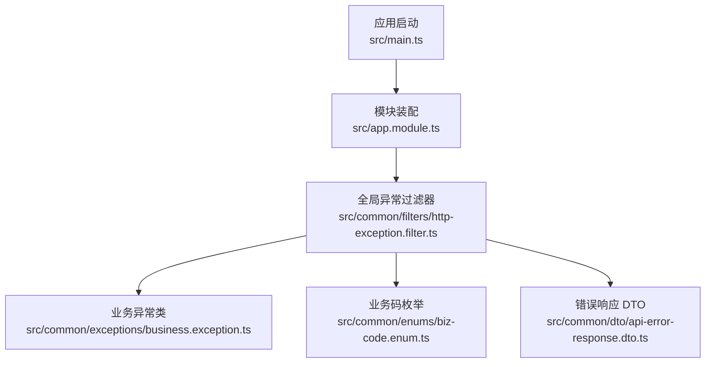
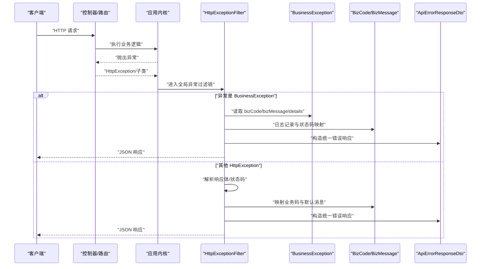
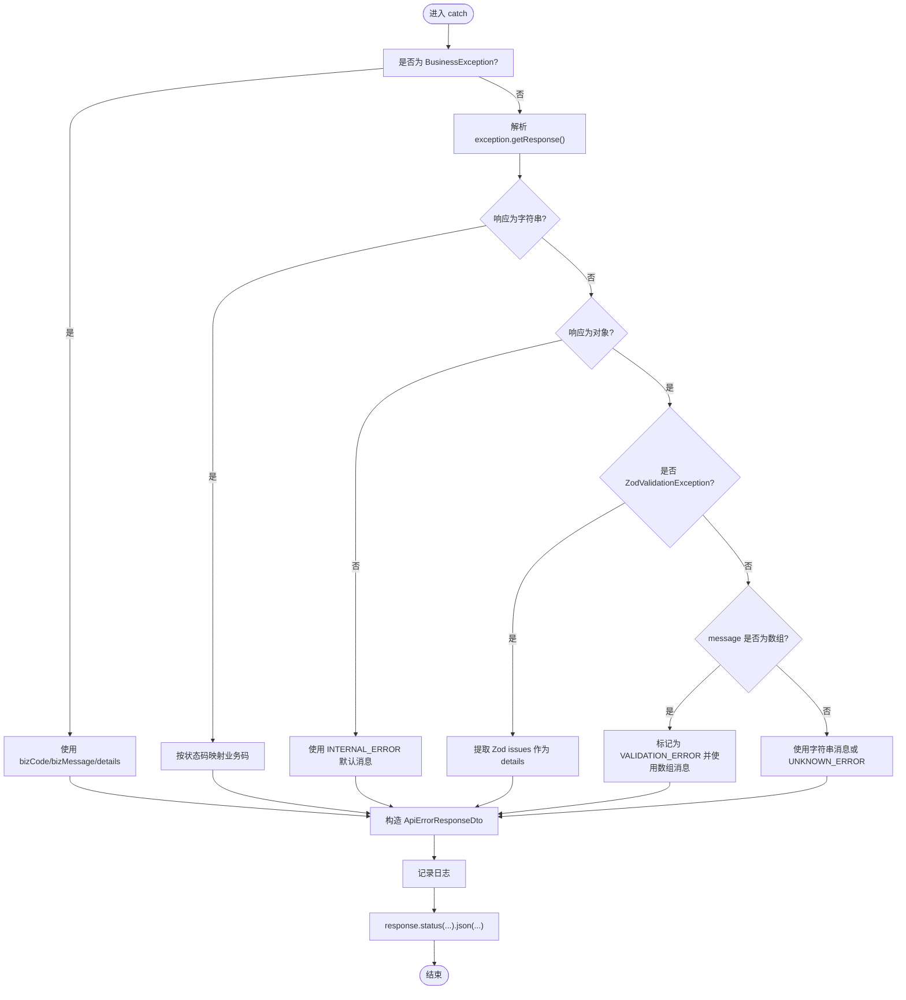
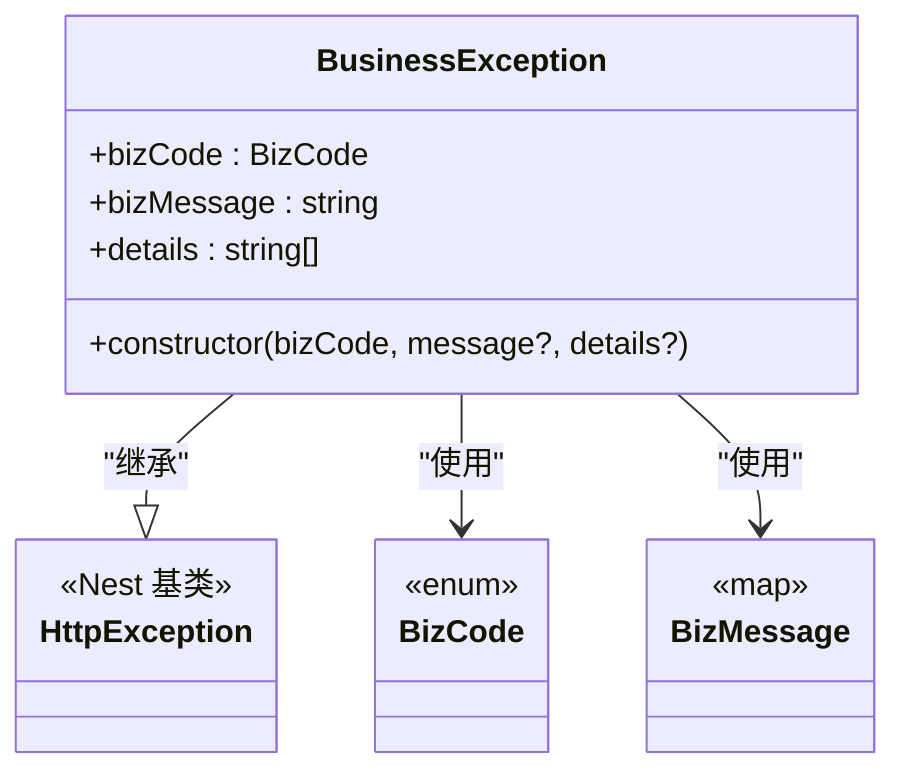
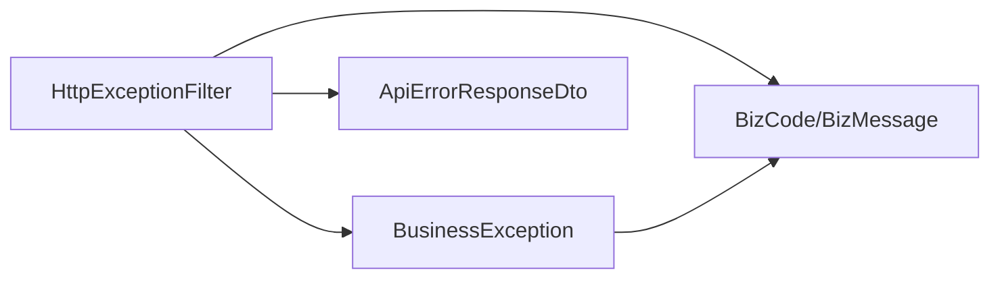

# 过滤器配置

<cite>
**本文引用的文件**
- [src/common/filters/http-exception.filter.ts](file://src/common/filters/http-exception.filter.ts)
- [src/common/exceptions/business.exception.ts](file://src/common/exceptions/business.exception.ts)
- [src/common/dto/api-error-response.dto.ts](file://src/common/dto/api-error-response.dto.ts)
- [src/common/enums/biz-code.enum.ts](file://src/common/enums/biz-code.enum.ts)
- [src/app.module.ts](file://src/app.module.ts)
- [src/main.ts](file://src/main.ts)
- [src/common/filters/http-exception.filter.spec.ts](file://src/common/filters/http-exception.filter.spec.ts)
</cite>

## 目录
1. [简介](#简介)
2. [项目结构](#项目结构)
3. [核心组件](#核心组件)
4. [架构总览](#架构总览)
5. [详细组件分析](#详细组件分析)
6. [依赖分析](#依赖分析)
7. [性能考虑](#性能考虑)
8. [故障排查指南](#故障排查指南)
9. [结论](#结论)
10. [附录](#附录)

## 简介
本文件系统性阐述本项目的异常过滤与业务异常处理机制，重点覆盖：
- 全局 HTTP 异常过滤器的实现与行为
- 错误码与响应格式的标准化
- 业务异常的定义、分类与最佳实践
- 过滤器优先级、匹配规则与继承关系
- 敏感信息过滤、日志记录与用户体验优化
- 自定义过滤器的开发指南与调试技巧

## 项目结构
围绕“过滤器配置”的关键目录与文件如下：
- 过滤器：src/common/filters/http-exception.filter.ts
- 业务异常：src/common/exceptions/business.exception.ts
- 错误响应模型：src/common/dto/api-error-response.dto.ts
- 业务码与消息：src/common/enums/biz-code.enum.ts
- 全局注册：src/app.module.ts
- 启动与日志：src/main.ts
- 单元测试：src/common/filters/http-exception.filter.spec.ts

图表来源
- [src/main.ts:1-50](file://src/main.ts#L1-L50)
- [src/app.module.ts:18-61](file://src/app.module.ts#L18-L61)
- [src/common/filters/http-exception.filter.ts:24-78](file://src/common/filters/http-exception.filter.ts#L24-L78)
- [src/common/exceptions/business.exception.ts:16-41](file://src/common/exceptions/business.exception.ts#L16-L41)
- [src/common/enums/biz-code.enum.ts:13-171](file://src/common/enums/biz-code.enum.ts#L13-L171)
- [src/common/dto/api-error-response.dto.ts:4-14](file://src/common/dto/api-error-response.dto.ts#L4-L14)

章节来源
- [src/main.ts:1-50](file://src/main.ts#L1-L50)
- [src/app.module.ts:18-61](file://src/app.module.ts#L18-L61)

## 核心组件
- 全局 HTTP 异常过滤器：统一捕获 HTTP 异常，进行业务码映射、消息标准化与响应输出；对业务异常与第三方校验异常做专门处理。
- 业务异常类：封装业务码、业务消息与可选的错误详情，自动推导 HTTP 状态码。
- 业务码与消息：集中定义业务码、默认消息与 HTTP 状态码映射。
- 错误响应 DTO：约束统一的错误响应结构，支持可选的错误详情数组。

章节来源
- [src/common/filters/http-exception.filter.ts:24-78](file://src/common/filters/http-exception.filter.ts#L24-L78)
- [src/common/exceptions/business.exception.ts:16-41](file://src/common/exceptions/business.exception.ts#L16-L41)
- [src/common/enums/biz-code.enum.ts:13-171](file://src/common/enums/biz-code.enum.ts#L13-L171)
- [src/common/dto/api-error-response.dto.ts:4-14](file://src/common/dto/api-error-response.dto.ts#L4-L14)

## 架构总览
全局异常过滤器通过依赖注入注册为应用层的唯一 HTTP 异常处理器，拦截所有未被控制器或路由层处理的 HttpException 及其子类异常。业务异常由业务层主动抛出，过滤器直接复用其携带的业务码与消息；其他异常则根据响应体内容与状态码进行映射与格式化。

图表来源
- [src/common/filters/http-exception.filter.ts:28-78](file://src/common/filters/http-exception.filter.ts#L28-L78)
- [src/common/exceptions/business.exception.ts:24-41](file://src/common/exceptions/business.exception.ts#L24-L41)
- [src/common/enums/biz-code.enum.ts:83-171](file://src/common/enums/biz-code.enum.ts#L83-L171)
- [src/common/dto/api-error-response.dto.ts:4-14](file://src/common/dto/api-error-response.dto.ts#L4-L14)

## 详细组件分析

### 全局 HTTP 异常过滤器
- 匹配规则：仅捕获 HttpException 类型及其子类；通过装饰器声明作用域为 HTTP 上下文。
- 处理流程：
  - 若为业务异常：直接使用其携带的业务码与消息，按需附加错误详情；日志记录包含业务码与请求方法/路径。
  - 其他异常：解析响应体对象或字符串，区分 Zod 校验异常与 class-validator 校验异常；其余按状态码映射到通用业务码与默认消息。
  - 统一输出：构造错误响应 DTO 并以原状态码返回。
- 关键点：
  - 解析策略：优先识别数组形式的消息（class-validator），其次识别 Zod 校验异常，最后回退到字符串或未知错误。
  - 映射策略：HTTP 状态码到业务码的映射集中在私有方法中，便于集中维护。
  - 日志策略：统一使用警告级别记录业务码、消息与请求上下文，便于审计与追踪。

图表来源
- [src/common/filters/http-exception.filter.ts:28-171](file://src/common/filters/http-exception.filter.ts#L28-L171)

章节来源
- [src/common/filters/http-exception.filter.ts:24-78](file://src/common/filters/http-exception.filter.ts#L24-L78)
- [src/common/filters/http-exception.filter.ts:80-134](file://src/common/filters/http-exception.filter.ts#L80-L134)
- [src/common/filters/http-exception.filter.ts:136-151](file://src/common/filters/http-exception.filter.ts#L136-L151)
- [src/common/filters/http-exception.filter.ts:156-171](file://src/common/filters/http-exception.filter.ts#L156-L171)

### 业务异常类
- 设计目标：替代内置 HttpException，统一携带业务码、业务消息与可选详情，自动推导 HTTP 状态码。
- 关键属性：业务码、业务消息、可选详情数组。
- 构造逻辑：若未提供消息，则从业务码默认消息表中取值；HTTP 状态码由业务码映射函数决定。

图表来源
- [src/common/exceptions/business.exception.ts:16-41](file://src/common/exceptions/business.exception.ts#L16-L41)
- [src/common/enums/biz-code.enum.ts:13-122](file://src/common/enums/biz-code.enum.ts#L13-L122)

章节来源
- [src/common/exceptions/business.exception.ts:16-41](file://src/common/exceptions/business.exception.ts#L16-L41)

### 业务码与消息、HTTP 状态码映射
- 业务码分层：成功、通用错误、认证、用户、菜单、角色、字典等模块化编号。
- 默认消息：集中于 BizMessage 映射表，便于后续国际化扩展。
- HTTP 状态码映射：通过 getHttpStatus 或状态码直译到业务码，确保对外一致的语义化错误码。

章节来源
- [src/common/enums/biz-code.enum.ts:13-171](file://src/common/enums/biz-code.enum.ts#L13-L171)

### 错误响应 DTO
- 结构：包含业务错误码、错误消息与可选的错误详情数组。
- 校验：基于 Zod Schema，确保输出结构的一致性与可验证性。

章节来源
- [src/common/dto/api-error-response.dto.ts:4-14](file://src/common/dto/api-error-response.dto.ts#L4-L14)

### 全局注册与控制流
- 全局注册：在应用模块中通过 APP_FILTER 提供者注册全局异常过滤器，确保所有路由均受控。
- 启动日志：应用启动时设置全局前缀、CORS、Swagger 等，异常过滤器在请求生命周期内生效。

章节来源
- [src/app.module.ts:54-57](file://src/app.module.ts#L54-L57)
- [src/main.ts:14-33](file://src/main.ts#L14-L33)

### 测试用例要点
- 业务异常：正确映射业务码与消息，状态码与业务异常一致。
- 校验异常：class-validator 数组消息与 Zod 校验异常均能生成 details。
- 通用异常：字符串消息与常见状态码（如 401、404）能正确映射。

章节来源
- [src/common/filters/http-exception.filter.spec.ts:48-133](file://src/common/filters/http-exception.filter.spec.ts#L48-L133)

## 依赖分析
- 组件耦合：
  - 过滤器依赖业务异常类、业务码枚举与错误响应 DTO。
  - 业务异常类依赖业务码枚举（消息与状态码映射）。
- 外部依赖：
  - NestJS 异常体系与 Express 响应对象。
  - Zod 校验异常类型（nestjs-zod）。
- 可能的循环依赖：当前结构清晰，无循环导入迹象。

图表来源
- [src/common/filters/http-exception.filter.ts:10-12](file://src/common/filters/http-exception.filter.ts#L10-L12)
- [src/common/exceptions/business.exception.ts:1-2](file://src/common/exceptions/business.exception.ts#L1-L2)
- [src/common/enums/biz-code.enum.ts:13-171](file://src/common/enums/biz-code.enum.ts#L13-L171)
- [src/common/dto/api-error-response.dto.ts:4-14](file://src/common/dto/api-error-response.dto.ts#L4-L14)

章节来源
- [src/common/filters/http-exception.filter.ts:10-12](file://src/common/filters/http-exception.filter.ts#L10-L12)
- [src/common/exceptions/business.exception.ts:1-2](file://src/common/exceptions/business.exception.ts#L1-L2)
- [src/common/enums/biz-code.enum.ts:13-171](file://src/common/enums/biz-code.enum.ts#L13-L171)
- [src/common/dto/api-error-response.dto.ts:4-14](file://src/common/dto/api-error-response.dto.ts#L4-L14)

## 性能考虑
- 过滤器为同步处理，避免额外异步开销；日志记录为轻量级结构化输出。
- 建议：
  - 控制错误详情数组规模，避免过长的 details 导致响应体过大。
  - 在高并发场景下，保持日志级别合理，避免过多警告级别日志影响吞吐。
  - 对频繁出现的业务异常，可在上游服务层进行快速失败与缓存，减少重复异常抛出。

## 故障排查指南
- 症状：统一返回未知错误或默认消息
  - 排查：确认异常是否为 HttpException 子类；检查响应体结构是否符合预期。
  - 参考：解析分支与状态码映射逻辑。
- 症状：校验错误未显示字段级详情
  - 排查：class-validator 返回的 message 应为字符串数组；Zod 校验异常需由对应类型触发。
  - 参考：数组消息与 Zod issues 的提取逻辑。
- 症状：业务异常状态码与预期不符
  - 排查：确认业务码到 HTTP 状态码的映射是否符合预期；必要时调整映射表。
- 症状：响应结构不一致
  - 排查：确认错误响应 DTO 的结构与 Zod 校验是否通过；检查过滤器是否正确构造响应对象。

章节来源
- [src/common/filters/http-exception.filter.ts:80-134](file://src/common/filters/http-exception.filter.ts#L80-L134)
- [src/common/filters/http-exception.filter.ts:136-151](file://src/common/filters/http-exception.filter.ts#L136-L151)
- [src/common/filters/http-exception.filter.ts:156-171](file://src/common/filters/http-exception.filter.ts#L156-L171)
- [src/common/dto/api-error-response.dto.ts:4-14](file://src/common/dto/api-error-response.dto.ts#L4-L14)

## 结论
本项目的异常处理机制通过全局过滤器实现了统一的错误码与响应格式，结合业务异常类与业务码枚举，形成了清晰、可维护且可扩展的异常体系。建议在后续迭代中：
- 引入国际化能力，将 BizMessage 的默认消息替换为 i18n 实现；
- 对敏感信息进行统一脱敏策略，避免在错误响应中泄露；
- 增加异常统计与告警，辅助运维与容量规划。

## 附录

### 异常处理最佳实践
- 统一使用业务异常类承载业务语义，避免直接抛出底层异常。
- 对输入校验错误，优先使用 Zod/class-validator 并保留字段级详情。
- 对外部依赖失败，转换为明确的业务码并记录上下文信息。
- 对生产环境，避免输出堆栈与内部实现细节，仅保留必要的业务提示。

### 自定义过滤器开发指南
- 选择合适的捕获范围：@Catch(HttpException) 或更窄的异常类型。
- 严格遵循统一响应结构：参考 ApiErrorResponseDto 的字段设计。
- 明确映射策略：优先使用业务码，其次按状态码映射，最后回退默认值。
- 保持幂等与可测试性：提供单元测试覆盖主要分支。

### 调试技巧
- 使用测试工具模拟 ArgumentsHost，分别构造业务异常、校验异常与通用异常场景。
- 在本地启用更详细的日志级别，观察过滤器日志中的业务码与请求上下文。
- 对 Zod 校验异常，打印原始 issues 以便定位问题字段。

章节来源
- [src/common/filters/http-exception.filter.spec.ts:27-133](file://src/common/filters/http-exception.filter.spec.ts#L27-L133)
- [src/common/filters/http-exception.filter.ts:28-78](file://src/common/filters/http-exception.filter.ts#L28-L78)