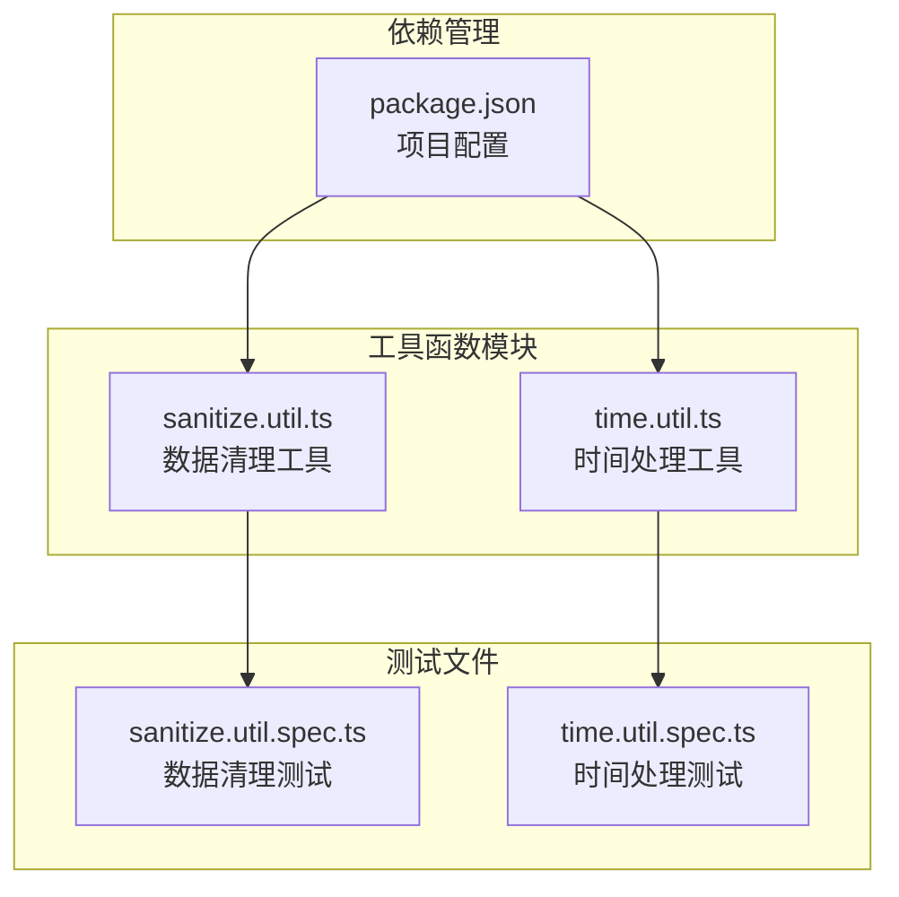
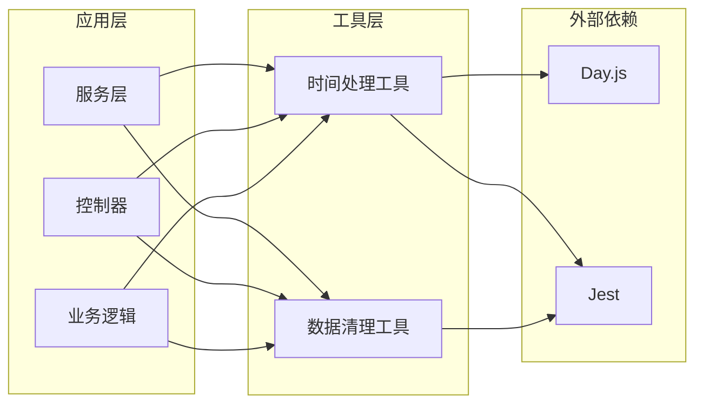
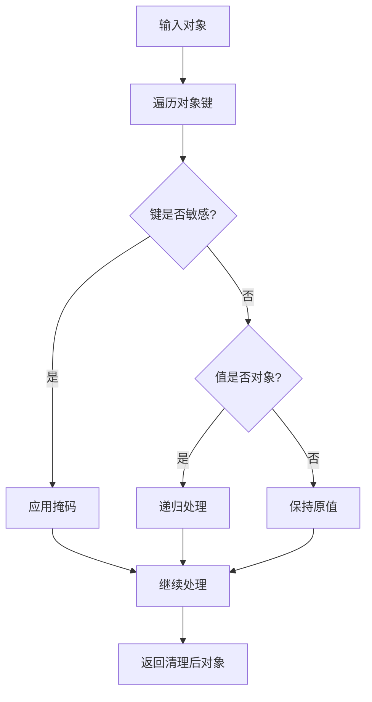
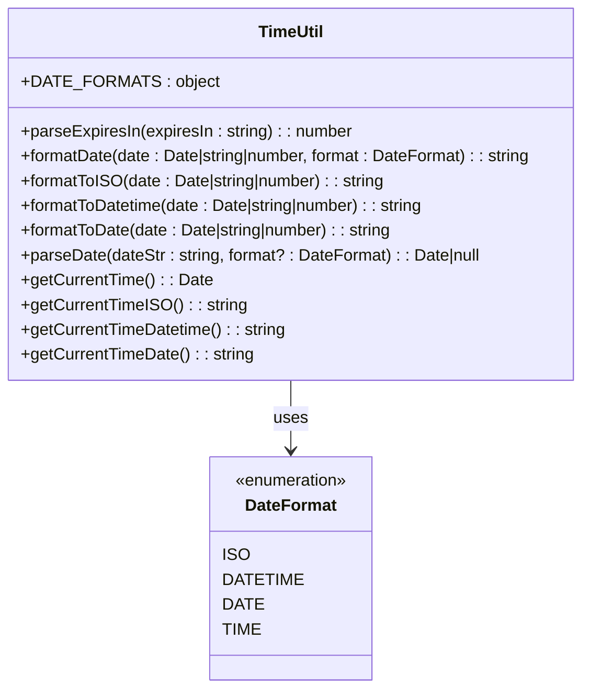
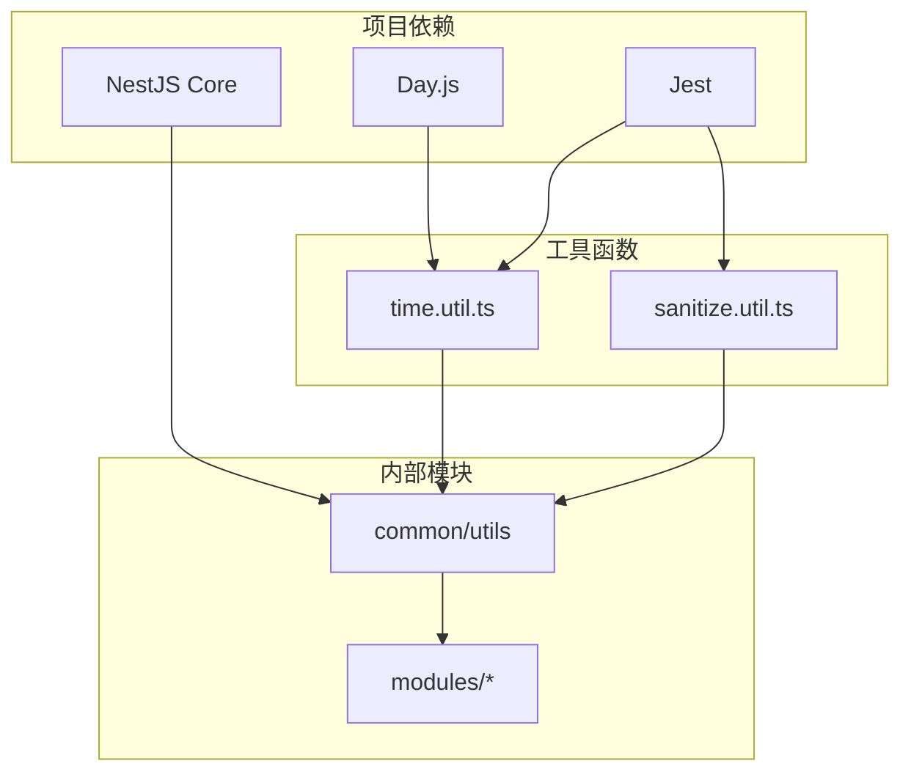
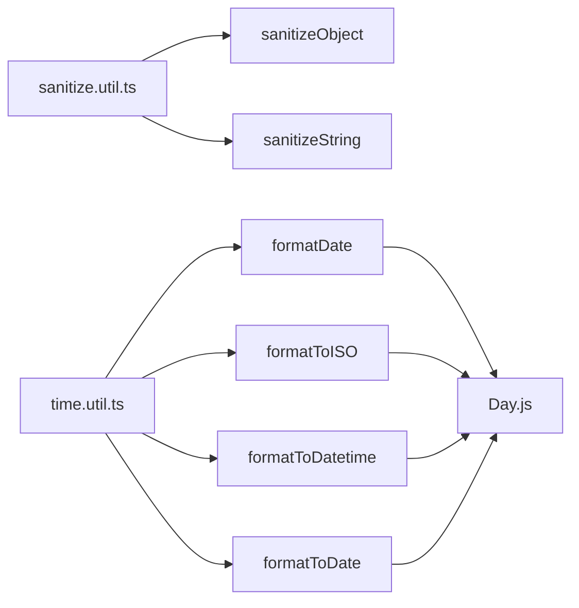

# 实用工具函数

<cite>
**本文档引用的文件**
- [sanitize.util.ts](file://src/common/utils/sanitize.util.ts)
- [sanitize.util.spec.ts](file://src/common/utils/sanitize.util.spec.ts)
- [time.util.ts](file://src/common/utils/time.util.ts)
- [time.util.spec.ts](file://src/common/utils/time.util.spec.ts)
- [package.json](file://package.json)
</cite>

## 目录

1. [简介](#简介)
2. [项目结构](#项目结构)
3. [核心组件](#核心组件)
4. [架构概览](#架构概览)
5. [详细组件分析](#详细组件分析)
6. [依赖分析](#依赖分析)
7. [性能考虑](#性能考虑)
8. [故障排除指南](#故障排除指南)
9. [结论](#结论)

## 简介

本文件详细介绍NestJS项目中的实用工具函数，重点涵盖数据清理工具和时间处理工具的实现细节和使用方法。这些工具函数是项目中重要的基础设施组件，为数据安全和时间处理提供了标准化的解决方案。

项目采用TypeScript编写，使用Jest进行单元测试，确保代码质量和可靠性。工具函数设计遵循单一职责原则，提供清晰的接口和完善的错误处理机制。

## 项目结构

实用工具函数位于`src/common/utils/`目录下，包含两个主要模块：

**图表来源**

- [sanitize.util.ts:1-44](file://src/common/utils/sanitize.util.ts#L1-L44)
- [time.util.ts:1-72](file://src/common/utils/time.util.ts#L1-L72)

**章节来源**

- [sanitize.util.ts:1-44](file://src/common/utils/sanitize.util.ts#L1-L44)
- [time.util.ts:1-72](file://src/common/utils/time.util.ts#L1-L72)

## 核心组件

### 数据清理工具 (sanitize.util.ts)

数据清理工具提供敏感信息保护功能，通过识别和屏蔽敏感字段来确保数据安全。

**主要功能：**

- 敏感字段识别和屏蔽
- 嵌套对象递归处理
- 自定义掩码支持
- 字符串内容敏感信息检测

**章节来源**

- [sanitize.util.ts:18-43](file://src/common/utils/sanitize.util.ts#L18-L43)

### 时间处理工具 (time.util.ts)

时间处理工具基于Day.js库，提供统一的时间格式化和解析功能。

**主要功能：**

- 多种时间格式支持
- 过期时间解析
- 日期字符串解析
- 当前时间获取
- 格式化便捷函数

**章节来源**

- [time.util.ts:12-71](file://src/common/utils/time.util.ts#L12-L71)

## 架构概览

**图表来源**

- [sanitize.util.ts:1-44](file://src/common/utils/sanitize.util.ts#L1-L44)
- [time.util.ts:1-72](file://src/common/utils/time.util.ts#L1-L72)

## 详细组件分析

### 数据清理工具详细分析

#### 敏感字段识别系统

数据清理工具通过预定义的敏感字段列表来识别需要保护的数据：

**图表来源**

- [sanitize.util.ts:18-34](file://src/common/utils/sanitize.util.ts#L18-L34)

#### 敏感字段列表

工具识别以下类型的敏感字段：

- 密码相关：password
- 认证令牌：token、authorization、refreshToken、accessToken
- 金融信息：creditCard
- 身份信息：ssn、secret
- Cookie信息：cookie

**章节来源**

- [sanitize.util.ts:1-12](file://src/common/utils/sanitize.util.ts#L1-L12)

#### 核心函数详解

##### sanitizeObject 函数

**功能：** 清理对象中的敏感字段

**参数：**

- `obj`: 输入对象，泛型类型T
- `mask`: 掩码字符串，默认为"\*\*\*"

**返回值：** 返回清理后的对象副本

**实现特点：**

- 使用深度复制避免修改原始对象
- 支持嵌套对象递归处理
- 对敏感字段应用自定义掩码
- 保持非敏感字段不变

**章节来源**

- [sanitize.util.ts:18-34](file://src/common/utils/sanitize.util.ts#L18-L34)

##### sanitizeString 函数

**功能：** 清理字符串中的敏感信息

**参数：**

- `text`: 输入文本字符串
- `mask`: 掩码字符串，默认为"\*\*\*"

**返回值：** 返回清理后的字符串

**实现特点：**

- 使用正则表达式匹配敏感字段模式
- 支持多种分隔符（=、:、空格、引号）
- 递归替换所有敏感值
- 保持非敏感内容不变

**章节来源**

- [sanitize.util.ts:36-43](file://src/common/utils/sanitize.util.ts#L36-L43)

### 时间处理工具详细分析

#### 时间格式化系统

时间处理工具提供统一的格式化接口，基于Day.js库实现：

**图表来源**

- [time.util.ts:3-10](file://src/common/utils/time.util.ts#L3-L10)
- [time.util.ts:12-71](file://src/common/utils/time.util.ts#L12-L71)

#### 格式化常量定义

工具定义了四种标准时间格式：

| 格式名称 | 格式字符串               | 示例输出                 |
| -------- | ------------------------ | ------------------------ |
| ISO      | YYYY-MM-DDTHH:mm:ss.SSSZ | 2024-01-01T12:30:45.000Z |
| DATETIME | YYYY-MM-DD HH:mm:ss      | 2024-01-01 12:30:45      |
| DATE     | YYYY-MM-DD               | 2024-01-01               |
| TIME     | HH:mm:ss                 | 12:30:45                 |

**章节来源**

- [time.util.ts:3-8](file://src/common/utils/time.util.ts#L3-L8)

#### 核心函数详解

##### parseExpiresIn 函数

**功能：** 解析过期时间字符串

**参数：**

- `expiresIn`: 过期时间字符串，格式为数字+单位

**返回值：** 返回对应的秒数

**支持的单位：**

- s: 秒
- m: 分钟
- h: 小时
- d: 天

**默认行为：** 无效格式返回7天（604800秒）

**章节来源**

- [time.util.ts:12-31](file://src/common/utils/time.util.ts#L12-L31)

##### formatDate 函数

**功能：** 统一格式化日期

**参数：**

- `date`: 日期输入（Date对象、字符串或数字）
- `format`: 格式类型，默认ISO格式

**返回值：** 格式化后的字符串

**章节来源**

- [time.util.ts:33-38](file://src/common/utils/time.util.ts#L33-L38)

##### parseDate 函数

**功能：** 解析日期字符串

**参数：**

- `dateStr`: 日期字符串
- `format`: 可选的格式类型

**返回值：** Date对象或null

**错误处理：** 无效日期返回null

**章节来源**

- [time.util.ts:52-55](file://src/common/utils/time.util.ts#L52-L55)

##### 当前时间函数组

提供多种当前时间获取方式：

- `getCurrentTime()`: 获取Date对象
- `getCurrentTimeISO()`: 获取ISO格式字符串
- `getCurrentTimeDatetime()`: 获取DATETIME格式字符串
- `getCurrentTimeDate()`: 获取DATE格式字符串

**章节来源**

- [time.util.ts:57-71](file://src/common/utils/time.util.ts#L57-L71)

## 依赖分析

### 外部依赖关系

**图表来源**

- [package.json:26-54](file://package.json#L26-L54)
- [sanitize.util.ts:1-44](file://src/common/utils/sanitize.util.ts#L1-L44)
- [time.util.ts:1-72](file://src/common/utils/time.util.ts#L1-L72)

### 内部依赖关系

工具函数之间存在以下依赖关系：

**图表来源**

- [sanitize.util.ts:18-43](file://src/common/utils/sanitize.util.ts#L18-L43)
- [time.util.ts:33-50](file://src/common/utils/time.util.ts#L33-L50)

**章节来源**

- [package.json:26-54](file://package.json#L26-L54)

## 性能考虑

### 数据清理工具性能优化

1. **算法复杂度**
   - sanitizeObject: O(n\*m)，其中n为对象键数量，m为嵌套层级深度
   - sanitizeString: O(k)，k为敏感字段匹配次数

2. **内存优化策略**
   - 使用浅拷贝创建对象副本，避免深度克隆
   - 正则表达式编译一次，重复使用
   - 递归处理时避免无限循环

3. **性能建议**
   - 对于大型对象，考虑分批处理
   - 缓存敏感字段检查结果
   - 避免在热路径中频繁调用

### 时间处理工具性能优化

1. **Day.js优势**
   - 轻量级替代方案
   - 不可变性保证
   - 模块化加载

2. **缓存策略**
   - 缓存常用格式化结果
   - 避免重复解析相同格式
   - 批量处理日期操作

3. **性能监控**
   - 监控高频调用函数
   - 识别性能瓶颈
   - 优化热点代码路径

## 故障排除指南

### 数据清理工具常见问题

#### 敏感字段识别不准确

**问题描述：** 某些敏感字段未被正确识别

**解决方案：**

1. 检查敏感字段列表是否包含目标字段
2. 验证字段名大小写处理
3. 调整掩码字符串长度

**章节来源**

- [sanitize.util.spec.ts:5-85](file://src/common/utils/sanitize.util.spec.ts#L5-L85)

#### 嵌套对象处理异常

**问题描述：** 嵌套对象中的敏感字段未被处理

**解决方案：**

1. 确认对象结构正确
2. 检查递归边界条件
3. 验证对象引用关系

**章节来源**

- [sanitize.util.spec.ts:21-40](file://src/common/utils/sanitize.util.spec.ts#L21-L40)

### 时间处理工具常见问题

#### 日期解析失败

**问题描述：** parseDate函数返回null

**解决方案：**

1. 验证输入日期字符串格式
2. 检查时区设置
3. 确认格式参数正确

**章节来源**

- [time.util.spec.ts:102-121](file://src/common/utils/time.util.spec.ts#L102-L121)

#### 格式化结果不符合预期

**问题描述：** 时间格式化输出与期望不符

**解决方案：**

1. 检查使用的格式常量
2. 验证输入日期对象
3. 确认时区配置

**章节来源**

- [time.util.spec.ts:46-73](file://src/common/utils/time.util.spec.ts#L46-L73)

### 错误处理策略

#### 数据清理工具错误处理

1. **输入验证**
   - 检查输入是否为对象
   - 验证掩码参数类型
   - 处理null和undefined值

2. **递归安全**
   - 防止无限递归
   - 处理循环引用
   - 限制递归深度

#### 时间处理工具错误处理

1. **格式解析**
   - 验证格式字符串
   - 处理无效日期
   - 标准化输入格式

2. **时区处理**
   - 明确时区转换规则
   - 处理夏令时变化
   - 统一时区表示

**章节来源**

- [sanitize.util.ts:18-43](file://src/common/utils/sanitize.util.ts#L18-L43)
- [time.util.ts:12-71](file://src/common/utils/time.util.ts#L12-L71)

## 结论

实用工具函数模块为NestJS项目提供了可靠的数据清理和时间处理能力。通过精心设计的API接口和完善的测试覆盖，这些工具确保了：

1. **安全性保障**：敏感信息的有效保护，防止数据泄露
2. **一致性保证**：统一的时间格式化和解析标准
3. **性能优化**：高效的算法实现和合理的资源使用
4. **可维护性**：清晰的代码结构和完整的文档说明

推荐在项目中：

- 在数据传输前使用数据清理工具
- 统一使用时间处理工具进行日期操作
- 根据具体需求选择合适的格式化选项
- 定期更新敏感字段列表以适应新的安全要求

这些工具函数为构建健壮的企业级应用奠定了坚实的基础。
