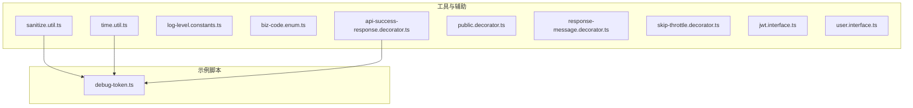
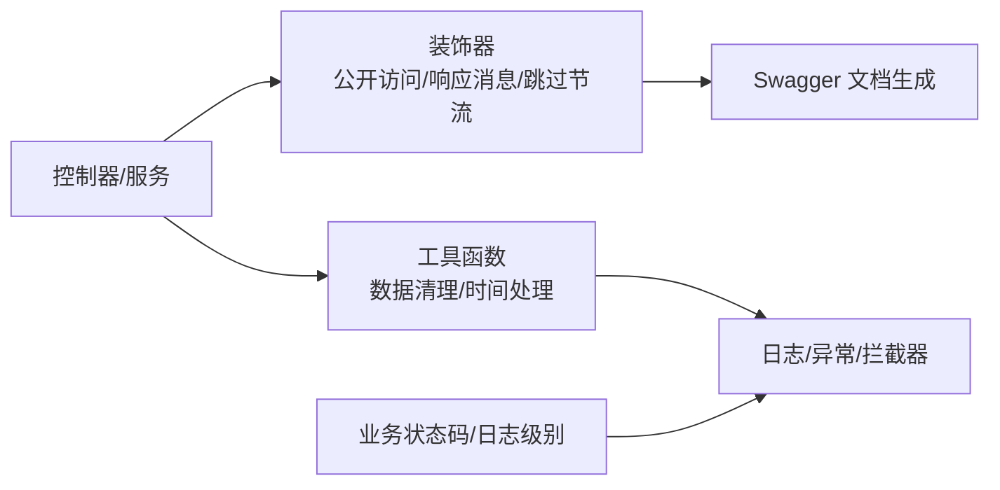
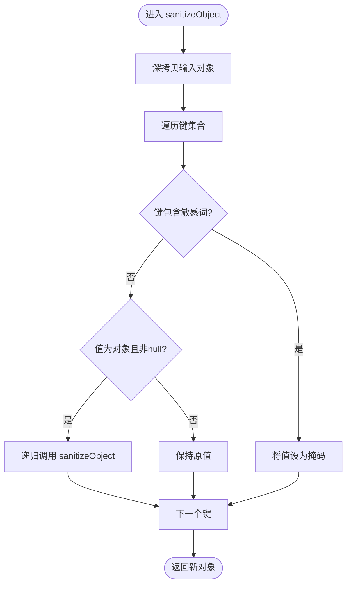
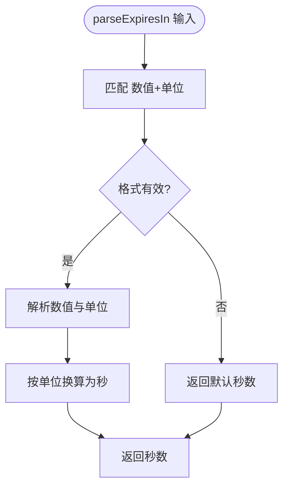
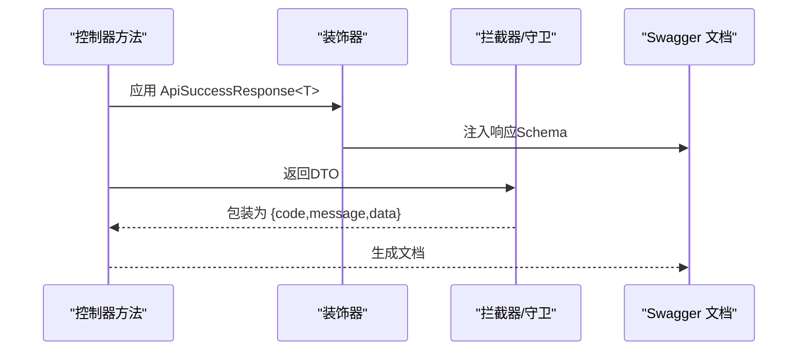
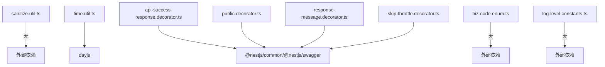

# 工具类和辅助函数

<cite>
**本文引用的文件**
- [sanitize.util.ts](file://src/common/utils/sanitize.util.ts)
- [sanitize.util.spec.ts](file://src/common/utils/sanitize.util.spec.ts)
- [time.util.ts](file://src/common/utils/time.util.ts)
- [time.util.spec.ts](file://src/common/utils/time.util.spec.ts)
- [log-level.constants.ts](file://src/common/constants/log-level.constants.ts)
- [biz-code.enum.ts](file://src/common/enums/biz-code.enum.ts)
- [api-success-response.decorator.ts](file://src/common/decorators/api-success-response.decorator.ts)
- [public.decorator.ts](file://src/common/decorators/public.decorator.ts)
- [response-message.decorator.ts](file://src/common/decorators/response-message.decorator.ts)
- [skip-throttle.decorator.ts](file://src/common/decorators/skip-throttle.decorator.ts)
- [jwt.interface.ts](file://src/common/interfaces/jwt.interface.ts)
- [user.interface.ts](file://src/common/interfaces/user.interface.ts)
- [debug-token.ts](file://scripts/debug-token.ts)
</cite>

## 目录
1. [简介](#简介)
2. [项目结构](#项目结构)
3. [核心组件](#核心组件)
4. [架构总览](#架构总览)
5. [详细组件分析](#详细组件分析)
6. [依赖分析](#依赖分析)
7. [性能考虑](#性能考虑)
8. [故障排查指南](#故障排查指南)
9. [结论](#结论)
10. [附录](#附录)

## 简介
本文件系统化梳理并解释本项目的工具类与辅助函数，重点覆盖以下方面：
- 数据清理工具：敏感信息掩码策略、递归处理与字符串替换机制
- 时间处理工具：日期解析、格式化与当前时间获取
- 常量与枚举：日志级别、业务状态码与HTTP映射
- 自定义装饰器：公开访问、响应消息、跳过节流与统一Swagger成功/错误响应
- 设计理念与最佳实践：可复用性、安全性、性能与可维护性

## 项目结构
工具与辅助功能主要分布在以下目录：
- 数据清理与时间处理：src/common/utils
- 常量与枚举：src/common/constants 与 src/common/enums
- 装饰器：src/common/decorators
- 接口类型：src/common/interfaces
- 示例脚本：scripts/debug-token.ts

**图表来源**
- [sanitize.util.ts:1-44](file://src/common/utils/sanitize.util.ts#L1-L44)
- [time.util.ts:1-72](file://src/common/utils/time.util.ts#L1-L72)
- [log-level.constants.ts:1-10](file://src/common/constants/log-level.constants.ts#L1-L10)
- [biz-code.enum.ts:1-171](file://src/common/enums/biz-code.enum.ts#L1-L171)
- [api-success-response.decorator.ts:1-172](file://src/common/decorators/api-success-response.decorator.ts#L1-L172)
- [public.decorator.ts:1-5](file://src/common/decorators/public.decorator.ts#L1-L5)
- [response-message.decorator.ts:1-6](file://src/common/decorators/response-message.decorator.ts#L1-L6)
- [skip-throttle.decorator.ts:1-12](file://src/common/decorators/skip-throttle.decorator.ts#L1-L12)
- [jwt.interface.ts:1-11](file://src/common/interfaces/jwt.interface.ts#L1-L11)
- [user.interface.ts:1-10](file://src/common/interfaces/user.interface.ts#L1-L10)
- [debug-token.ts:1-60](file://scripts/debug-token.ts#L1-L60)

**章节来源**
- [sanitize.util.ts:1-44](file://src/common/utils/sanitize.util.ts#L1-L44)
- [time.util.ts:1-72](file://src/common/utils/time.util.ts#L1-L72)
- [log-level.constants.ts:1-10](file://src/common/constants/log-level.constants.ts#L1-L10)
- [biz-code.enum.ts:1-171](file://src/common/enums/biz-code.enum.ts#L1-L171)
- [api-success-response.decorator.ts:1-172](file://src/common/decorators/api-success-response.decorator.ts#L1-L172)
- [public.decorator.ts:1-5](file://src/common/decorators/public.decorator.ts#L1-L5)
- [response-message.decorator.ts:1-6](file://src/common/decorators/response-message.decorator.ts#L1-L6)
- [skip-throttle.decorator.ts:1-12](file://src/common/decorators/skip-throttle.decorator.ts#L1-L12)
- [jwt.interface.ts:1-11](file://src/common/interfaces/jwt.interface.ts#L1-L11)
- [user.interface.ts:1-10](file://src/common/interfaces/user.interface.ts#L1-L10)
- [debug-token.ts:1-60](file://scripts/debug-token.ts#L1-L60)

## 核心组件
- 数据清理工具
  - 敏感键集合与匹配逻辑
  - 对象递归掩码与字符串正则掩码
- 时间处理工具
  - 多格式常量与解析/格式化函数
  - 当前时间便捷函数
- 常量与枚举
  - 日志级别常量
  - 业务状态码与HTTP映射
- 自定义装饰器
  - 公开访问、响应消息、跳过节流
  - Swagger统一成功/错误响应装饰器

**章节来源**
- [sanitize.util.ts:1-44](file://src/common/utils/sanitize.util.ts#L1-L44)
- [time.util.ts:1-72](file://src/common/utils/time.util.ts#L1-L72)
- [log-level.constants.ts:1-10](file://src/common/constants/log-level.constants.ts#L1-L10)
- [biz-code.enum.ts:1-171](file://src/common/enums/biz-code.enum.ts#L1-L171)
- [api-success-response.decorator.ts:1-172](file://src/common/decorators/api-success-response.decorator.ts#L1-L172)
- [public.decorator.ts:1-5](file://src/common/decorators/public.decorator.ts#L1-L5)
- [response-message.decorator.ts:1-6](file://src/common/decorators/response-message.decorator.ts#L1-L6)
- [skip-throttle.decorator.ts:1-12](file://src/common/decorators/skip-throttle.decorator.ts#L1-L12)

## 架构总览
工具与装饰器在系统中的协作关系如下：

**图表来源**
- [api-success-response.decorator.ts:1-172](file://src/common/decorators/api-success-response.decorator.ts#L1-L172)
- [public.decorator.ts:1-5](file://src/common/decorators/public.decorator.ts#L1-L5)
- [response-message.decorator.ts:1-6](file://src/common/decorators/response-message.decorator.ts#L1-L6)
- [skip-throttle.decorator.ts:1-12](file://src/common/decorators/skip-throttle.decorator.ts#L1-L12)
- [sanitize.util.ts:1-44](file://src/common/utils/sanitize.util.ts#L1-L44)
- [time.util.ts:1-72](file://src/common/utils/time.util.ts#L1-L72)
- [biz-code.enum.ts:1-171](file://src/common/enums/biz-code.enum.ts#L1-L171)
- [log-level.constants.ts:1-10](file://src/common/constants/log-level.constants.ts#L1-L10)

## 详细组件分析

### 数据清理工具
- 设计理念
  - 通过预定义敏感键集合进行匹配，支持对象递归与字符串正则替换
  - 默认掩码值可自定义，兼顾安全与可读性
- 关键函数
  - sanitizeObject(obj, mask='***')：深拷贝并递归掩码敏感键
  - sanitizeString(text, mask='***')：基于正则替换敏感键后的值
- 参数与返回
  - sanitizeObject<T extends Record<string, unknown>>(obj, mask?): 返回同类型的新对象
  - sanitizeString(text, mask?): 返回字符串
- 使用示例路径
  - 对象掩码：[sanitize.util.spec.ts:5-84](file://src/common/utils/sanitize.util.spec.ts#L5-L84)
  - 字符串掩码：[sanitize.util.spec.ts:87-128](file://src/common/utils/sanitize.util.spec.ts#L87-L128)
- 性能与复杂度
  - 对象递归：时间复杂度 O(n)，空间复杂度 O(n)（深拷贝）
  - 字符串正则：对每个敏感键执行一次替换，整体 O(k·m)，k为敏感键数，m为文本长度
- 最佳实践
  - 在日志、响应体与审计记录前统一调用
  - 自定义掩码时避免泄露上下文信息

**图表来源**
- [sanitize.util.ts:18-34](file://src/common/utils/sanitize.util.ts#L18-L34)

**章节来源**
- [sanitize.util.ts:1-44](file://src/common/utils/sanitize.util.ts#L1-L44)
- [sanitize.util.spec.ts:1-130](file://src/common/utils/sanitize.util.spec.ts#L1-L130)

### 时间处理工具
- 设计理念
  - 以常量形式集中管理常用日期格式，提供解析与格式化能力
  - 支持字符串/数字/Date输入，统一输出字符串或Date
- 关键函数
  - parseExpiresIn(expiresIn): 解析带单位的时间字符串
  - formatDate/date/formatToISO/formatToDatetime/formatToDate: 格式化
  - parseDate(str, format?): 解析字符串为Date
  - getCurrentTime/ISO/Datetime/Date: 获取当前时间的便捷函数
- 参数与返回
  - parseExpiresIn(expiresIn: string): number（秒）
  - formatDate(date, format?): string
  - parseDate(str, format?): Date | null
  - getCurrentTime*(): Date | string
- 使用示例路径
  - 单元测试覆盖：[time.util.spec.ts:1-162](file://src/common/utils/time.util.spec.ts#L1-L162)
  - 脚本调试：[debug-token.ts:1-60](file://scripts/debug-token.ts#L1-L60)
- 性能与复杂度
  - 基于dayjs，格式化/解析为O(m)（m为格式或字符串长度），解析单位转换为O(1)
- 最佳实践
  - 统一使用常量格式，避免魔法字符串
  - 需要跨时区场景时优先使用ISO格式

**图表来源**
- [time.util.ts:12-31](file://src/common/utils/time.util.ts#L12-L31)

**章节来源**
- [time.util.ts:1-72](file://src/common/utils/time.util.ts#L1-L72)
- [time.util.spec.ts:1-162](file://src/common/utils/time.util.spec.ts#L1-L162)
- [debug-token.ts:1-60](file://scripts/debug-token.ts#L1-L60)

### 常量与枚举
- 日志级别常量
  - LogLevel：包含Error/Warn/Info/Debug/Verbose
- 业务状态码与HTTP映射
  - BizCode：按模块分段的业务码
  - BizMessage：业务码到默认消息的映射
  - getHttpStatus(bizCode)：业务码到HTTP状态码的映射
- 使用建议
  - 统一使用BizCode作为业务返回码
  - 结合日志级别控制输出粒度

**章节来源**
- [log-level.constants.ts:1-10](file://src/common/constants/log-level.constants.ts#L1-L10)
- [biz-code.enum.ts:1-171](file://src/common/enums/biz-code.enum.ts#L1-L171)

### 自定义装饰器
- 公开访问装饰器
  - Public：标记接口无需鉴权
  - 使用：在控制器或路由上标注
- 响应消息装饰器
  - ResponseMessage：设置响应消息元数据
  - 与ApiSuccessNoDataResponse配合，自动同步消息
- 跳过节流装饰器
  - SkipThrottle：标记接口不受速率限制
  - 适用于健康检查等高频端点
- Swagger统一响应装饰器
  - ApiSuccessResponse<T>(type, options)：自动构建成功响应Schema
  - ApiSuccessNoDataResponse(options)：无数据成功响应
  - ApiGlobalErrors()：统一400/500错误响应文档
- 设计要点
  - 使用SetMetadata注入元数据，供守卫/拦截器/过滤器读取
  - 与TransformInterceptor、HttpExceptionFilter协同工作
- 使用示例路径
  - 公开访问：[public.decorator.ts:1-5](file://src/common/decorators/public.decorator.ts#L1-L5)
  - 响应消息：[response-message.decorator.ts:1-6](file://src/common/decorators/response-message.decorator.ts#L1-L6)
  - 跳过节流：[skip-throttle.decorator.ts:1-12](file://src/common/decorators/skip-throttle.decorator.ts#L1-L12)
  - Swagger装饰器：[api-success-response.decorator.ts:1-172](file://src/common/decorators/api-success-response.decorator.ts#L1-L172)

**图表来源**
- [api-success-response.decorator.ts:72-128](file://src/common/decorators/api-success-response.decorator.ts#L72-L128)

**章节来源**
- [public.decorator.ts:1-5](file://src/common/decorators/public.decorator.ts#L1-L5)
- [response-message.decorator.ts:1-6](file://src/common/decorators/response-message.decorator.ts#L1-L6)
- [skip-throttle.decorator.ts:1-12](file://src/common/decorators/skip-throttle.decorator.ts#L1-L12)
- [api-success-response.decorator.ts:1-172](file://src/common/decorators/api-success-response.decorator.ts#L1-L172)

### 接口类型
- JwtPayload：JWT载荷，包含sub（用户ID）
- UserPayload：用户角色信息，包含id与roles数组
- 用途
  - Token生成阶段的类型约束
  - 控制器/服务中用户上下文的数据结构

**章节来源**
- [jwt.interface.ts:1-11](file://src/common/interfaces/jwt.interface.ts#L1-L11)
- [user.interface.ts:1-10](file://src/common/interfaces/user.interface.ts#L1-L10)

## 依赖分析
- 内部依赖
  - sanitize.util.ts 与 time.util.ts 为纯函数工具，无外部依赖
  - 装饰器依赖@nestjs/common与@nestjs/swagger
  - biz-code.enum.ts 与 log-level.constants.ts 为纯常量/枚举
- 外部依赖
  - dayjs：时间处理工具
- 耦合与内聚
  - 工具函数高内聚、低耦合，便于复用
  - 装饰器通过元数据与框架组件解耦

**图表来源**
- [time.util.ts:1-1](file://src/common/utils/time.util.ts#L1-L1)
- [api-success-response.decorator.ts:1-8](file://src/common/decorators/api-success-response.decorator.ts#L1-L8)
- [public.decorator.ts:1-1](file://src/common/decorators/public.decorator.ts#L1-L1)
- [response-message.decorator.ts:1-1](file://src/common/decorators/response-message.decorator.ts#L1-L1)
- [skip-throttle.decorator.ts:1-1](file://src/common/decorators/skip-throttle.decorator.ts#L1-L1)
- [biz-code.enum.ts:1-171](file://src/common/enums/biz-code.enum.ts#L1-L171)
- [log-level.constants.ts:1-10](file://src/common/constants/log-level.constants.ts#L1-L10)

**章节来源**
- [time.util.ts:1-1](file://src/common/utils/time.util.ts#L1-L1)
- [api-success-response.decorator.ts:1-8](file://src/common/decorators/api-success-response.decorator.ts#L1-L8)
- [public.decorator.ts:1-1](file://src/common/decorators/public.decorator.ts#L1-L1)
- [response-message.decorator.ts:1-1](file://src/common/decorators/response-message.decorator.ts#L1-L1)
- [skip-throttle.decorator.ts:1-1](file://src/common/decorators/skip-throttle.decorator.ts#L1-L1)
- [biz-code.enum.ts:1-171](file://src/common/enums/biz-code.enum.ts#L1-L171)
- [log-level.constants.ts:1-10](file://src/common/constants/log-level.constants.ts#L1-L10)

## 性能考虑
- 数据清理
  - 对象递归掩码：避免在热路径频繁调用大对象；必要时采用惰性处理
  - 字符串正则：敏感键数量有限，整体开销可控；可考虑缓存正则表达式
- 时间处理
  - dayjs为不可变库，频繁格式化时可复用实例或批量处理
  - parseExpiresIn为O(1)短流程，影响极小
- 装饰器
  - 元数据注入为常量时间；Schema构建在编译期完成，运行时开销低

## 故障排查指南
- 数据清理未生效
  - 检查敏感键是否被正确包含（大小写不敏感）
  - 确认对象层级是否正确递归
- 时间解析失败
  - 确认输入格式与单位符合约定（s/m/h/d）
  - 使用parseDate时提供明确格式
- Swagger文档不一致
  - 确保ApiSuccessResponse<T>的泛型与实际返回类型一致
  - 检查TransformInterceptor与HttpExceptionFilter的配置

**章节来源**
- [sanitize.util.spec.ts:1-130](file://src/common/utils/sanitize.util.spec.ts#L1-L130)
- [time.util.spec.ts:1-162](file://src/common/utils/time.util.spec.ts#L1-L162)
- [api-success-response.decorator.ts:1-172](file://src/common/decorators/api-success-response.decorator.ts#L1-L172)

## 结论
本项目的工具与辅助函数围绕“安全、统一、可维护”展开：数据清理确保敏感信息不出域；时间处理提供一致的格式与解析；装饰器将横切关注点（鉴权、限流、文档）与业务解耦。遵循本文的最佳实践，可在保证性能的同时提升系统的可读性与可扩展性。

## 附录
- 扩展自定义装饰器指南
  - 元数据注入：使用SetMetadata定义键名与值
  - 元数据读取：在守卫/拦截器/过滤器中通过Reflector读取
  - 文档生成：结合Swagger装饰器或动态Schema构建
  - 示例参考：[public.decorator.ts:1-5](file://src/common/decorators/public.decorator.ts#L1-L5)、[response-message.decorator.ts:1-6](file://src/common/decorators/response-message.decorator.ts#L1-L6)、[skip-throttle.decorator.ts:1-12](file://src/common/decorators/skip-throttle.decorator.ts#L1-L12)、[api-success-response.decorator.ts:1-172](file://src/common/decorators/api-success-response.decorator.ts#L1-L172)