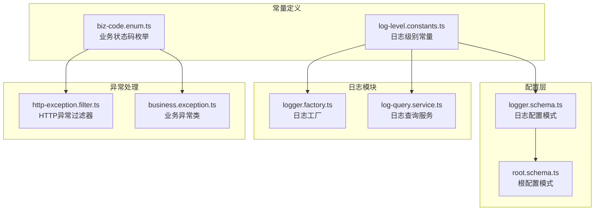
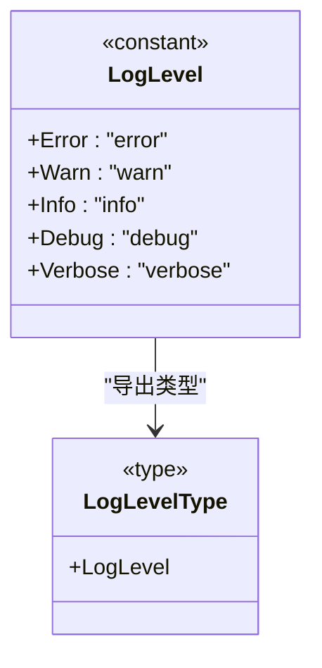
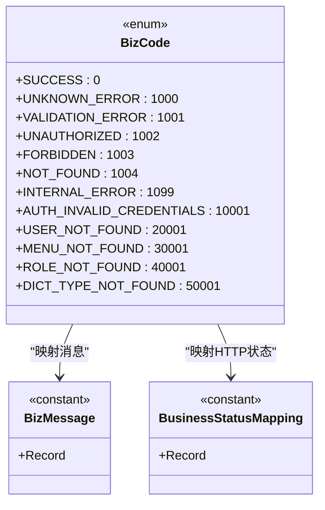
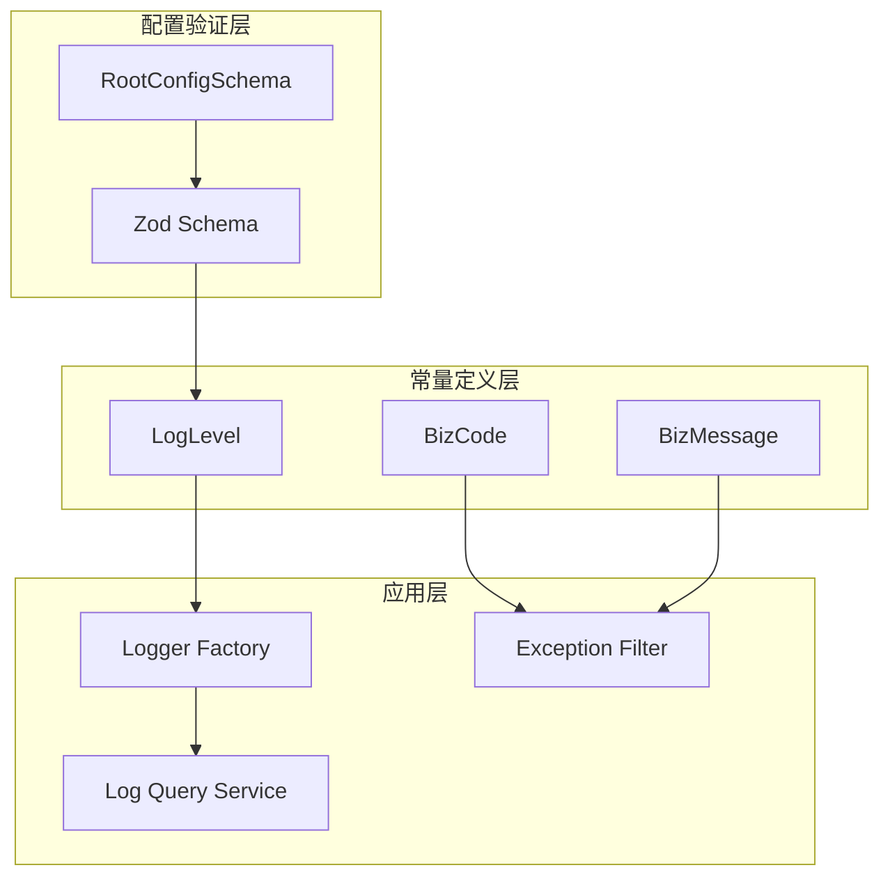
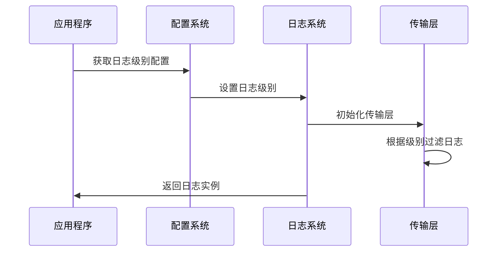
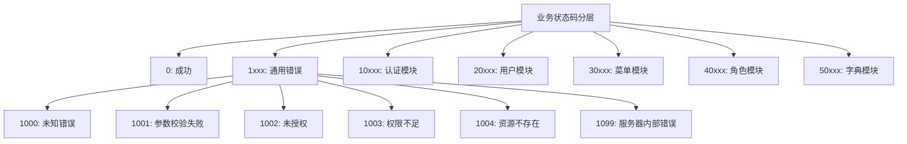
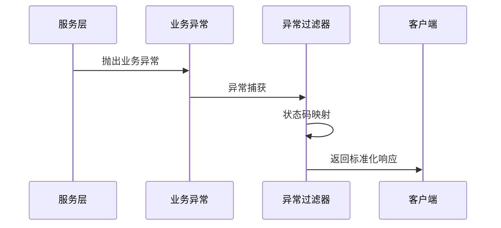
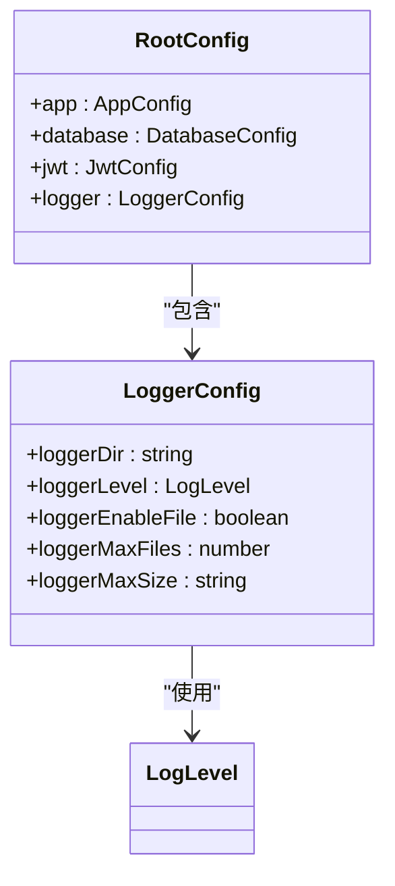
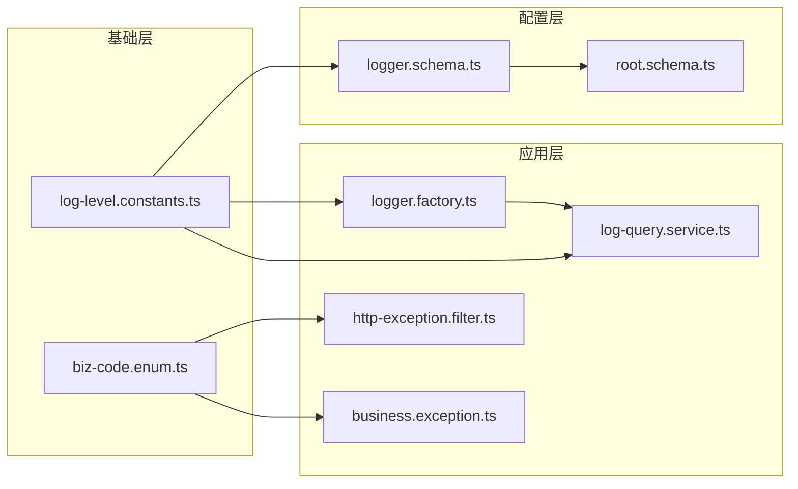

# 常量定义

<cite>
**本文档引用的文件**
- [log-level.constants.ts](file://src/common/constants/log-level.constants.ts)
- [biz-code.enum.ts](file://src/common/enums/biz-code.enum.ts)
- [logger.schema.ts](file://src/config/schemas/logger.schema.ts)
- [logger.factory.ts](file://src/modules/logger/logger.factory.ts)
- [log-query.service.ts](file://src/modules/logger/log-query.service.ts)
- [http-exception.filter.ts](file://src/common/filters/http-exception.filter.ts)
- [business.exception.ts](file://src/common/exceptions/business.exception.ts)
- [root.schema.ts](file://src/config/schemas/root.schema.ts)
</cite>

## 目录
1. [简介](#简介)
2. [项目结构](#项目结构)
3. [核心组件](#核心组件)
4. [架构概览](#架构概览)
5. [详细组件分析](#详细组件分析)
6. [依赖关系分析](#依赖关系分析)
7. [性能考虑](#性能考虑)
8. [故障排除指南](#故障排除指南)
9. [结论](#结论)

## 简介

本文件详细阐述了项目中的常量定义和枚举体系，重点关注日志级别常量的设计与应用。项目采用统一的常量管理策略，通过类型安全的方式确保配置的一致性和可维护性。

## 项目结构

项目中的常量定义主要分布在以下位置：

**图表来源**
- [log-level.constants.ts:1-10](file://src/common/constants/log-level.constants.ts#L1-L10)
- [logger.schema.ts:1-12](file://src/config/schemas/logger.schema.ts#L1-L12)
- [logger.factory.ts:114-155](file://src/modules/logger/logger.factory.ts#L114-L155)

**章节来源**
- [log-level.constants.ts:1-10](file://src/common/constants/log-level.constants.ts#L1-L10)
- [biz-code.enum.ts:1-171](file://src/common/enums/biz-code.enum.ts#L1-L171)

## 核心组件

### 日志级别常量

项目定义了完整的日志级别常量体系，采用只读对象和类型推断相结合的方式：

**图表来源**
- [log-level.constants.ts:1-10](file://src/common/constants/log-level.constants.ts#L1-L10)

### 业务状态码枚举

业务状态码采用分层设计，按照模块划分不同的数值区间：

**图表来源**
- [biz-code.enum.ts:13-78](file://src/common/enums/biz-code.enum.ts#L13-L78)
- [biz-code.enum.ts:83-122](file://src/common/enums/biz-code.enum.ts#L83-L122)
- [biz-code.enum.ts:127-166](file://src/common/enums/biz-code.enum.ts#L127-L166)

**章节来源**
- [log-level.constants.ts:1-10](file://src/common/constants/log-level.constants.ts#L1-L10)
- [biz-code.enum.ts:13-171](file://src/common/enums/biz-code.enum.ts#L13-L171)

## 架构概览

项目采用分层架构管理常量定义，确保类型安全和配置一致性：

**图表来源**
- [logger.schema.ts:1-12](file://src/config/schemas/logger.schema.ts#L1-L12)
- [root.schema.ts:10-20](file://src/config/schemas/root.schema.ts#L10-L20)
- [logger.factory.ts:114-155](file://src/modules/logger/logger.factory.ts#L114-L155)

## 详细组件分析

### 日志级别常量详解

#### 常量定义规范

日志级别常量采用标准化的命名规范：
- 使用全大写命名（ERROR、WARN、INFO等）
- 采用语义化字符串值
- 支持类型推断和编译时检查

#### 取值范围分析

| 级别 | 数值优先级 | 适用场景 | 输出内容 |
|------|------------|----------|----------|
| Error | 1 | 错误信息、异常处理 | ❌ 错误级别输出 |
| Warn | 2 | 警告信息、潜在问题 | ⚠️ 警告级别输出 |
| Info | 3 | 一般信息、流程记录 | ℹ️ 信息级别输出 |
| Debug | 4 | 调试信息、详细日志 | 🔍 调试级别输出 |
| Verbose | 5 | 详细调试信息 | 📝 详细级别输出 |

#### 使用场景分析

**图表来源**
- [logger.factory.ts:114-155](file://src/modules/logger/logger.factory.ts#L114-L155)
- [logger.schema.ts:6](file://src/config/schemas/logger.schema.ts#L6)

### 业务状态码常量体系

#### 分层设计原则

业务状态码采用模块化分层设计，每个模块占据特定的数值区间：

**图表来源**
- [biz-code.enum.ts:4-12](file://src/common/enums/biz-code.enum.ts#L4-L12)

#### 常量使用示例

**图表来源**
- [business.exception.ts:24-41](file://src/common/exceptions/business.exception.ts#L24-L41)
- [http-exception.filter.ts:37-78](file://src/common/filters/http-exception.filter.ts#L37-L78)

**章节来源**
- [logger.factory.ts:114-155](file://src/modules/logger/logger.factory.ts#L114-L155)
- [http-exception.filter.ts:24-172](file://src/common/filters/http-exception.filter.ts#L24-L172)
- [business.exception.ts:16-41](file://src/common/exceptions/business.exception.ts#L16-L41)

### 配置集成机制

#### 类型安全的配置验证

**图表来源**
- [logger.schema.ts:4-10](file://src/config/schemas/logger.schema.ts#L4-L10)
- [root.schema.ts:10-20](file://src/config/schemas/root.schema.ts#L10-L20)

**章节来源**
- [logger.schema.ts:1-12](file://src/config/schemas/logger.schema.ts#L1-L12)
- [root.schema.ts:1-20](file://src/config/schemas/root.schema.ts#L1-L20)

## 依赖关系分析

项目中的常量依赖关系呈现清晰的层次结构：

**图表来源**
- [log-level.constants.ts:1-10](file://src/common/constants/log-level.constants.ts#L1-L10)
- [biz-code.enum.ts:1-171](file://src/common/enums/biz-code.enum.ts#L1-L171)
- [logger.schema.ts:1-12](file://src/config/schemas/logger.schema.ts#L1-L12)

**章节来源**
- [log-level.constants.ts:1-10](file://src/common/constants/log-level.constants.ts#L1-L10)
- [biz-code.enum.ts:1-171](file://src/common/enums/biz-code.enum.ts#L1-L171)

## 性能考虑

### 日志级别性能优化

1. **级别过滤优化**：通过配置日志级别，避免不必要的日志格式化开销
2. **文件轮转策略**：合理设置最大文件大小和保留天数，平衡存储空间和查询效率
3. **异步写入机制**：使用每日轮转文件传输，减少主线程阻塞

### 常量访问性能

1. **编译时优化**：使用 `as const` 确保常量在编译时被完全优化
2. **类型推断**：利用 TypeScript 的类型推断减少运行时检查
3. **模块化导入**：按需导入常量，避免全局命名空间污染

## 故障排除指南

### 常见问题及解决方案

#### 日志级别配置问题

**问题**：日志级别设置不生效
**原因**：配置验证失败或类型不匹配
**解决方案**：
1. 检查配置文件中的日志级别值
2. 确认使用正确的常量值而非硬编码字符串
3. 验证配置加载顺序

#### 业务状态码映射错误

**问题**：HTTP状态码与业务状态码映射不一致
**原因**：状态码定义冲突或映射表缺失
**解决方案**：
1. 检查业务状态码的唯一性
2. 验证状态码到HTTP状态码的映射关系
3. 确保新增状态码包含相应的消息定义

**章节来源**
- [logger.factory.ts:114-155](file://src/modules/logger/logger.factory.ts#L114-L155)
- [http-exception.filter.ts:153-171](file://src/common/filters/http-exception.filter.ts#L153-L171)

## 结论

项目建立了完善的常量定义体系，通过以下关键特性确保系统的稳定性和可维护性：

1. **类型安全**：所有常量均提供完整的TypeScript类型定义
2. **配置验证**：使用Zod进行运行时配置验证
3. **模块化设计**：常量按功能模块组织，便于维护
4. **最佳实践**：遵循命名规范和设计原则

建议在后续开发中：
- 保持常量定义的版本兼容性
- 定期审查和优化常量使用模式
- 扩展测试覆盖以确保常量行为的正确性
- 文档化常量的业务含义和使用场景