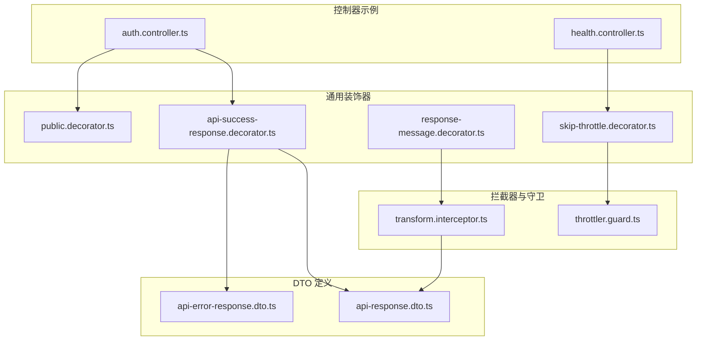
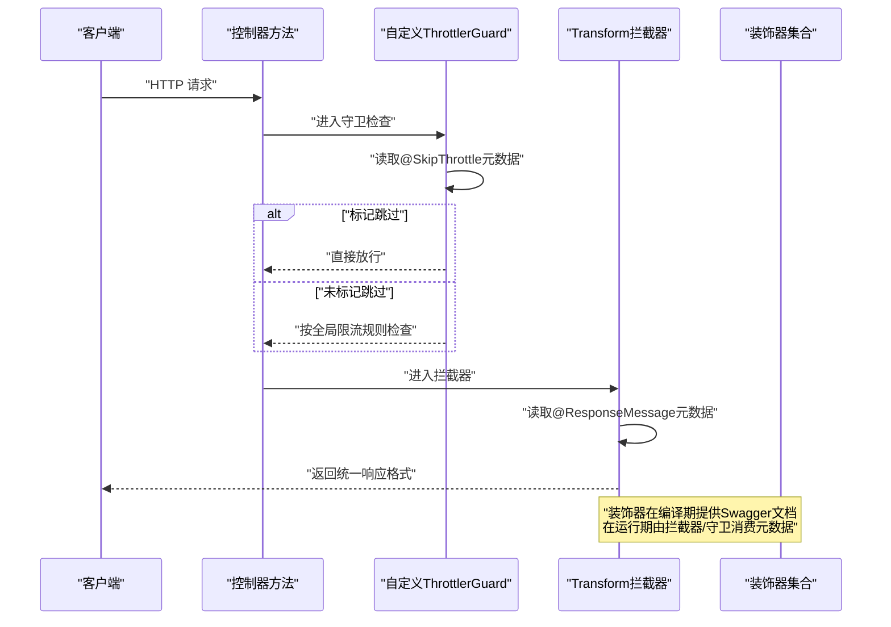
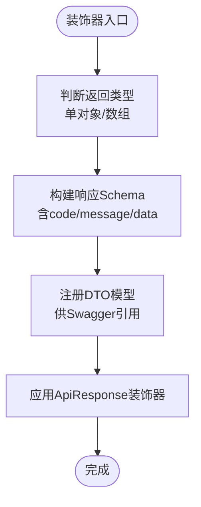
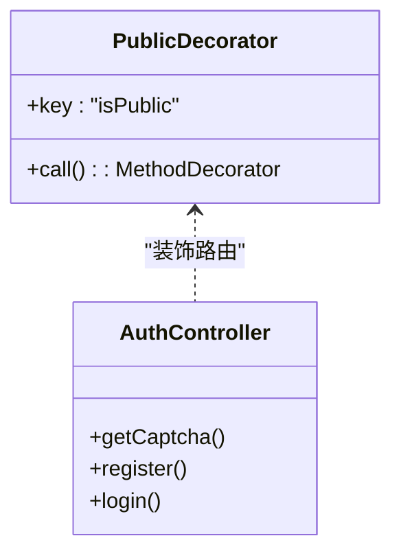
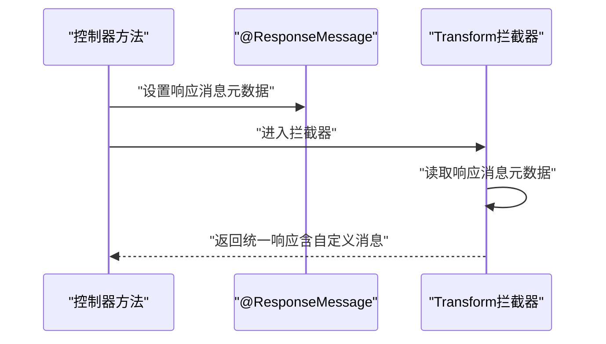
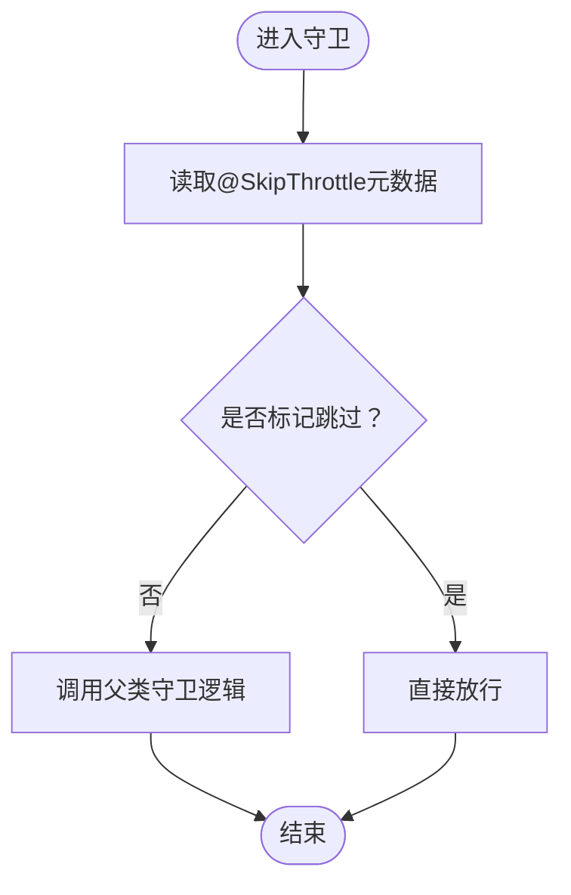
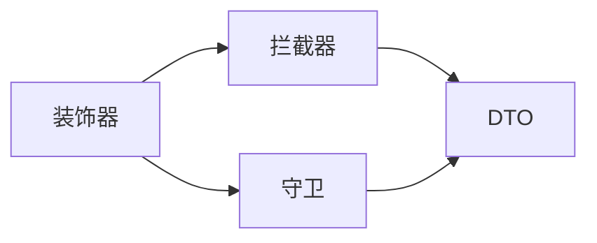

# 自定义装饰器

<cite>
**本文引用的文件**
- [api-success-response.decorator.ts](file://src/common/decorators/api-success-response.decorator.ts)
- [public.decorator.ts](file://src/common/decorators/public.decorator.ts)
- [response-message.decorator.ts](file://src/common/decorators/response-message.decorator.ts)
- [skip-throttle.decorator.ts](file://src/common/decorators/skip-throttle.decorator.ts)
- [api-response.dto.ts](file://src/common/dto/api-response.dto.ts)
- [api-error-response.dto.ts](file://src/common/dto/api-error-response.dto.ts)
- [transform.interceptor.ts](file://src/common/interceptors/transform.interceptor.ts)
- [throttler.guard.ts](file://src/common/guards/throttler.guard.ts)
- [auth.controller.ts](file://src/modules/auth/auth.controller.ts)
- [health.controller.ts](file://src/modules/health/health.controller.ts)
</cite>

## 目录

1. [简介](#简介)
2. [项目结构](#项目结构)
3. [核心组件](#核心组件)
4. [架构总览](#架构总览)
5. [详细组件分析](#详细组件分析)
6. [依赖分析](#依赖分析)
7. [性能考虑](#性能考虑)
8. [故障排查指南](#故障排查指南)
9. [结论](#结论)
10. [附录](#附录)

## 简介

本文件系统性梳理并讲解项目中的自定义装饰器体系，重点覆盖以下四个装饰器：

- 成功响应装饰器：统一 API 成功响应格式，并在 Swagger 文档中自动呈现
- 公共接口装饰器：标记无需鉴权的公开接口
- 响应消息装饰器：自定义统一响应的消息文本
- 跳过速率限制装饰器：允许特定接口绕过全局速率限制

文档将阐述各装饰器的实现原理、参数配置、使用示例与最佳实践，并给出装饰器组合使用的建议，帮助读者快速创建满足横切关注点的自定义装饰器。

## 项目结构

装饰器集中位于通用模块的 decorators 目录，配合拦截器与守卫共同完成横切逻辑；DTO 文件定义了统一响应的数据结构，供拦截器与装饰器协作使用。

图表来源

- [api-success-response.decorator.ts:1-172](file://src/common/decorators/api-success-response.decorator.ts#L1-L172)
- [public.decorator.ts:1-5](file://src/common/decorators/public.decorator.ts#L1-L5)
- [response-message.decorator.ts:1-6](file://src/common/decorators/response-message.decorator.ts#L1-L6)
- [skip-throttle.decorator.ts:1-12](file://src/common/decorators/skip-throttle.decorator.ts#L1-L12)
- [api-response.dto.ts:1-40](file://src/common/dto/api-response.dto.ts#L1-L40)
- [api-error-response.dto.ts:1-14](file://src/common/dto/api-error-response.dto.ts#L1-L14)
- [transform.interceptor.ts:1-41](file://src/common/interceptors/transform.interceptor.ts#L1-L41)
- [throttler.guard.ts:1-33](file://src/common/guards/throttler.guard.ts#L1-L33)
- [auth.controller.ts:1-129](file://src/modules/auth/auth.controller.ts#L1-L129)
- [health.controller.ts](file://src/modules/health/health.controller.ts)

章节来源

- [api-success-response.decorator.ts:1-172](file://src/common/decorators/api-success-response.decorator.ts#L1-L172)
- [public.decorator.ts:1-5](file://src/common/decorators/public.decorator.ts#L1-L5)
- [response-message.decorator.ts:1-6](file://src/common/decorators/response-message.decorator.ts#L1-L6)
- [skip-throttle.decorator.ts:1-12](file://src/common/decorators/skip-throttle.decorator.ts#L1-L12)
- [api-response.dto.ts:1-40](file://src/common/dto/api-response.dto.ts#L1-L40)
- [api-error-response.dto.ts:1-14](file://src/common/dto/api-error-response.dto.ts#L1-L14)
- [transform.interceptor.ts:1-41](file://src/common/interceptors/transform.interceptor.ts#L1-L41)
- [throttler.guard.ts:1-33](file://src/common/guards/throttler.guard.ts#L1-L33)
- [auth.controller.ts:1-129](file://src/modules/auth/auth.controller.ts#L1-L129)
- [health.controller.ts](file://src/modules/health/health.controller.ts)

## 核心组件

- 成功响应装饰器：负责在 Swagger 文档中声明统一的成功响应结构，并支持单对象与数组两种返回形态
- 公共接口装饰器：标记接口无需 JWT 鉴权，常与鉴权守卫配合使用
- 响应消息装饰器：为统一响应设置自定义消息文本，拦截器读取该元数据并注入最终响应
- 跳过速率限制装饰器：标记接口绕过全局速率限制，由自定义 ThrottlerGuard 读取元数据决定是否放行

章节来源

- [api-success-response.decorator.ts:70-128](file://src/common/decorators/api-success-response.decorator.ts#L70-L128)
- [public.decorator.ts:1-5](file://src/common/decorators/public.decorator.ts#L1-L5)
- [response-message.decorator.ts:1-6](file://src/common/decorators/response-message.decorator.ts#L1-L6)
- [skip-throttle.decorator.ts:1-12](file://src/common/decorators/skip-throttle.decorator.ts#L1-L12)

## 架构总览

下图展示了装饰器与拦截器、守卫之间的协作关系，以及它们如何共同保证统一的响应格式与访问控制策略。

图表来源

- [throttler.guard.ts:20-31](file://src/common/guards/throttler.guard.ts#L20-L31)
- [transform.interceptor.ts:21-39](file://src/common/interceptors/transform.interceptor.ts#L21-L39)
- [response-message.decorator.ts:1-6](file://src/common/decorators/response-message.decorator.ts#L1-L6)
- [api-success-response.decorator.ts:1-172](file://src/common/decorators/api-success-response.decorator.ts#L1-L172)

## 详细组件分析

### 成功响应装饰器（ApiSuccessResponse 系列）

- 功能概述
  - 在 Swagger 文档中声明统一的成功响应结构，包含业务状态码、消息与数据体
  - 支持单对象与数组两种返回形态，自动构建对应 Schema
  - 提供“无数据”成功响应装饰器，便于删除、退出等场景
  - 提供全局错误响应装饰器，统一 400/500 错误文档
- 关键实现要点
  - 使用 Swagger 的 ApiExtraModels 与 getSchemaPath 注册并引用 DTO
  - 通过 buildDataSchema/buildSuccessSchema/buildSuccessNoDataSchema 构建不同形态的响应 Schema
  - 与拦截器协同：拦截器读取响应消息元数据，填充统一响应的消息字段
- 参数与行为
  - ApiSuccessResponse(type, options): type 指定数据类型；options 支持 status、description、isArray
  - ApiSuccessNoDataResponse(options): 无数据形态；当提供 message 时，会同步设置响应消息元数据
  - ApiGlobalErrors(): 一次性注入 400/500 错误响应文档
- 使用示例（参考控制器）
  - 获取验证码：使用 ApiSuccessResponse(CaptchaResponseDto)
  - 用户注册：使用 ApiSuccessResponse(TokenResponseDto, { status: 201 })
  - 退出登录：使用 ApiSuccessNoDataResponse({ message: "退出成功" })

图表来源

- [api-success-response.decorator.ts:33-102](file://src/common/decorators/api-success-response.decorator.ts#L33-L102)
- [api-response.dto.ts:9-14](file://src/common/dto/api-response.dto.ts#L9-L14)

章节来源

- [api-success-response.decorator.ts:70-172](file://src/common/decorators/api-success-response.decorator.ts#L70-L172)
- [api-response.dto.ts:1-40](file://src/common/dto/api-response.dto.ts#L1-L40)
- [auth.controller.ts:44-127](file://src/modules/auth/auth.controller.ts#L44-L127)

### 公共接口装饰器（Public）

- 功能概述
  - 标记接口为公开，无需 JWT 鉴权即可访问
  - 常与鉴权守卫配合，通过元数据判断是否放行
- 实现要点
  - 使用 SetMetadata 写入固定键名的布尔值
  - 控制器或路由处理器可通过反射读取该元数据
- 使用示例（参考控制器）
  - 登录、注册、获取验证码等接口均标注 @Public()

图表来源

- [public.decorator.ts:1-5](file://src/common/decorators/public.decorator.ts#L1-L5)
- [auth.controller.ts:44-86](file://src/modules/auth/auth.controller.ts#L44-L86)

章节来源

- [public.decorator.ts:1-5](file://src/common/decorators/public.decorator.ts#L1-L5)
- [auth.controller.ts:44-86](file://src/modules/auth/auth.controller.ts#L44-L86)

### 响应消息装饰器（ResponseMessage）

- 功能概述
  - 为统一响应设置自定义消息文本
  - 拦截器读取该元数据，优先使用装饰器提供的消息
- 实现要点
  - 使用 SetMetadata 写入固定键名与消息字符串
  - 拦截器在响应组装阶段读取该元数据并注入最终响应
- 使用示例（参考控制器）
  - 退出登录：@ApiSuccessNoDataResponse({ message: "退出成功" }) 会同步设置响应消息元数据

图表来源

- [response-message.decorator.ts:1-6](file://src/common/decorators/response-message.decorator.ts#L1-L6)
- [transform.interceptor.ts:27-36](file://src/common/interceptors/transform.interceptor.ts#L27-L36)
- [api-success-response.decorator.ts:115-127](file://src/common/decorators/api-success-response.decorator.ts#L115-L127)

章节来源

- [response-message.decorator.ts:1-6](file://src/common/decorators/response-message.decorator.ts#L1-L6)
- [transform.interceptor.ts:1-41](file://src/common/interceptors/transform.interceptor.ts#L1-L41)
- [api-success-response.decorator.ts:104-128](file://src/common/decorators/api-success-response.decorator.ts#L104-L128)

### 跳过速率限制装饰器（SkipThrottle）

- 功能概述
  - 标记接口绕过全局速率限制，适用于健康检查等高频但无安全风险的端点
  - 自定义 ThrottlerGuard 读取元数据，若存在则直接放行
- 实现要点
  - 使用 SetMetadata 写入固定键名的布尔值
  - 自定义守卫重写 canActivate，优先检查元数据再调用父类逻辑
- 使用示例（参考控制器）
  - 健康检查接口：@SkipThrottle() 与 @Public() 组合使用

图表来源

- [skip-throttle.decorator.ts:1-12](file://src/common/decorators/skip-throttle.decorator.ts#L1-L12)
- [throttler.guard.ts:20-31](file://src/common/guards/throttler.guard.ts#L20-L31)
- [health.controller.ts:1-10](file://src/modules/health/health.controller.ts#L1-L10)

章节来源

- [skip-throttle.decorator.ts:1-12](file://src/common/decorators/skip-throttle.decorator.ts#L1-L12)
- [throttler.guard.ts:1-33](file://src/common/guards/throttler.guard.ts#L1-L33)
- [health.controller.ts:1-10](file://src/modules/health/health.controller.ts#L1-L10)

## 依赖分析

- 装饰器与拦截器/守卫的耦合
  - 成功响应装饰器与拦截器：装饰器在编译期提供文档，拦截器在运行期消费元数据
  - 公共接口装饰器与鉴权守卫：通过元数据决定是否放行
  - 跳过速率限制装饰器与自定义 ThrottlerGuard：通过元数据决定是否绕过限流
- 外部依赖
  - Swagger 装饰器用于生成 API 文档
  - NestJS 反射机制用于读取元数据
  - DTO 定义统一响应结构，保证前后端一致性

图表来源

- [api-success-response.decorator.ts:1-172](file://src/common/decorators/api-success-response.decorator.ts#L1-L172)
- [transform.interceptor.ts:1-41](file://src/common/interceptors/transform.interceptor.ts#L1-L41)
- [throttler.guard.ts:1-33](file://src/common/guards/throttler.guard.ts#L1-L33)
- [api-response.dto.ts:1-40](file://src/common/dto/api-response.dto.ts#L1-L40)

章节来源

- [api-success-response.decorator.ts:1-172](file://src/common/decorators/api-success-response.decorator.ts#L1-L172)
- [transform.interceptor.ts:1-41](file://src/common/interceptors/transform.interceptor.ts#L1-L41)
- [throttler.guard.ts:1-33](file://src/common/guards/throttler.guard.ts#L1-L33)
- [api-response.dto.ts:1-40](file://src/common/dto/api-response.dto.ts#L1-L40)

## 性能考虑

- 元数据读取开销
  - 反射读取元数据发生在每次请求的拦截与守卫阶段，属于轻量级操作，对整体性能影响可忽略
- Swagger Schema 构建
  - 装饰器在编译期构建 Schema，运行时不参与计算，不会带来额外运行时开销
- 建议
  - 将装饰器用于声明式文档与横切逻辑，避免在运行期进行复杂计算
  - 对高频接口谨慎使用复杂装饰器链，必要时进行基准测试

## 故障排查指南

- 统一响应消息未生效
  - 检查是否正确使用 @ResponseMessage 或 @ApiSuccessNoDataResponse(message)
  - 确认拦截器已启用且未被其他拦截器覆盖
  - 参考路径：[transform.interceptor.ts:27-36](file://src/common/interceptors/transform.interceptor.ts#L27-L36)
- 速率限制未生效或误放行
  - 检查是否错误地添加了 @SkipThrottle
  - 确认自定义 ThrottlerGuard 已注册并生效
  - 参考路径：[throttler.guard.ts:20-31](file://src/common/guards/throttler.guard.ts#L20-L31)
- Swagger 文档缺失或不准确
  - 确认使用了 ApiSuccessResponse/ApiGlobalErrors 等装饰器
  - 检查 DTO 是否已通过 ApiExtraModels 注册
  - 参考路径：[api-success-response.decorator.ts:94-101](file://src/common/decorators/api-success-response.decorator.ts#L94-L101)

章节来源

- [transform.interceptor.ts:1-41](file://src/common/interceptors/transform.interceptor.ts#L1-L41)
- [throttler.guard.ts:1-33](file://src/common/guards/throttler.guard.ts#L1-L33)
- [api-success-response.decorator.ts:138-171](file://src/common/decorators/api-success-response.decorator.ts#L138-L171)

## 结论

本装饰器体系通过“声明式文档 + 运行时拦截/守卫”的方式，实现了统一响应格式、公开接口标记与速率限制控制等横切关注点。其设计兼顾了开发体验（自动文档生成）与运行效率（轻量元数据读取），适合在中大型 NestJS 项目中推广使用。建议在团队内规范装饰器组合使用方式，并结合 DTO 与拦截器形成稳定的响应契约。

## 附录

- 装饰器组合最佳实践
  - 公共接口：@Public() 与鉴权守卫配合，确保无需鉴权的端点明确可见
  - 统一响应：@ApiSuccessResponse/@ApiSuccessNoDataResponse 与 @ResponseMessage 组合，保证消息一致
  - 速率限制：@SkipThrottle 仅用于明确的高频无风险端点，其余接口遵循全局限流
  - 错误文档：统一使用 @ApiGlobalErrors，减少手写 Schema 的维护成本
- 如何创建自定义装饰器
  - 明确横切关注点与元数据键名
  - 在装饰器中使用 SetMetadata 写入元数据
  - 在拦截器或守卫中通过 Reflector 读取元数据并执行相应逻辑
  - 在编译期通过 Swagger 装饰器完善文档
