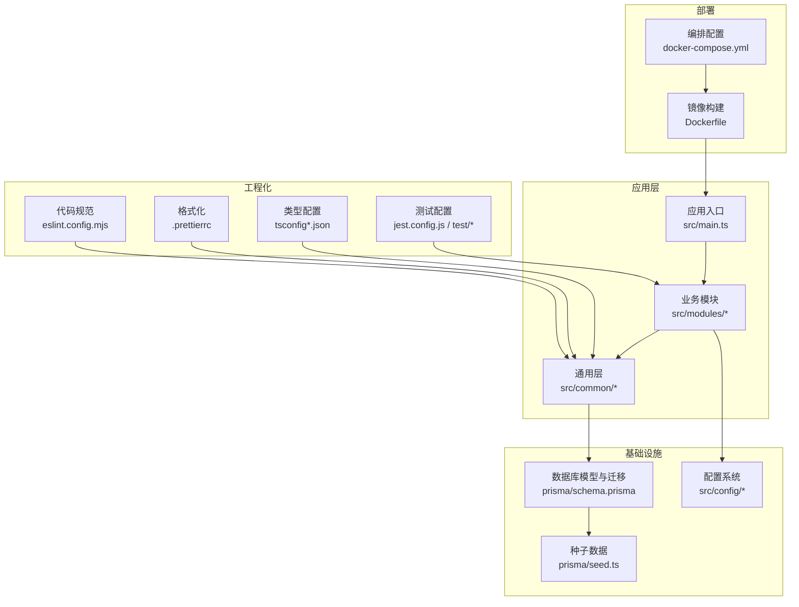
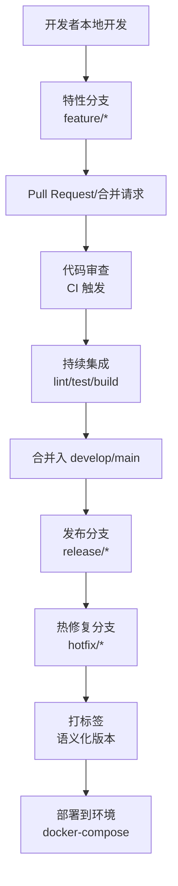
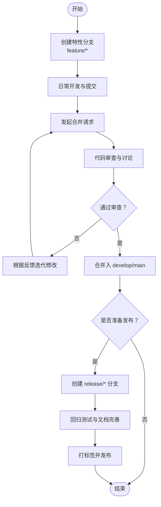
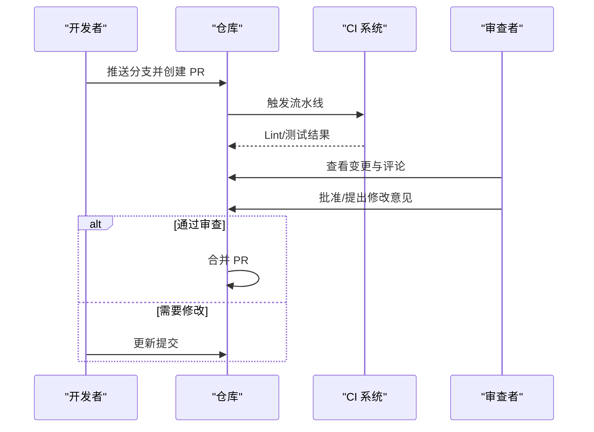
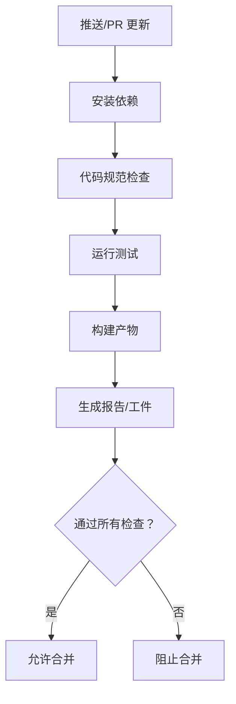
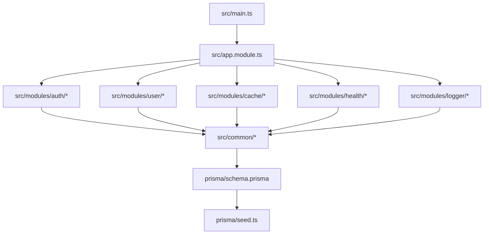

# Git 工作流程

<cite>
**本文档引用的文件**
- [README.md](file://README.md)
- [package.json](file://package.json)
- [pnpm-workspace.yaml](file://pnpm-workspace.yaml)
- [docker-compose.yml](file://docker-compose.yml)
- [Dockerfile](file://Dockerfile)
- [.gitignore](file://.gitignore)
- [.prettierrc](file://.prettierrc)
- [eslint.config.mjs](file://eslint.config.mjs)
- [jest.config.js](file://jest.config.js)
- [tsconfig.json](file://tsconfig.json)
- [tsconfig.build.json](file://tsconfig.build.json)
- [tsconfig.test.json](file://tsconfig.test.json)
- [src/main.ts](file://src/main.ts)
- [src/app.module.ts](file://src/app.module.ts)
- [prisma/schema.prisma](file://prisma/schema.prisma)
- [prisma/seed.ts](file://prisma/seed.ts)
- [scripts/debug-token.ts](file://scripts/debug-token.ts)
- [test/setup.ts](file://test/setup.ts)
- [test/jest-e2e.json](file://test/jest-e2e.json)
- [src/common/constants/log-level.constants.ts](file://src/common/constants/log-level.constants.ts)
- [src/common/decorators/public.decorator.ts](file://src/common/decorators/public.decorator.ts)
- [src/common/exceptions/business.exception.ts](file://src/common/exceptions/business.exception.ts)
- [src/common/guards/jwt-auth.guard.ts](file://src/common/guards/jwt-auth.guard.ts)
- [src/modules/auth/auth.module.ts](file://src/modules/auth/auth.module.ts)
- [src/modules/auth/auth.controller.ts](file://src/modules/auth/auth.controller.ts)
- [src/modules/auth/auth.service.ts](file://src/modules/auth/auth.service.ts)
- [src/modules/user/user.module.ts](file://src/modules/user/user.module.ts)
- [src/modules/user/user.controller.ts](file://src/modules/user/user.controller.ts)
- [src/modules/user/user.service.ts](file://src/modules/user/user.service.ts)
- [src/modules/cache/cache.module.ts](file://src/modules/cache/cache.module.ts)
- [src/modules/health/health.module.ts](file://src/modules/health/health.module.ts)
- [src/modules/logger/logger.module.ts](file://src/modules/logger/logger.module.ts)
</cite>

## 目录

1. [简介](#简介)
2. [项目结构](#项目结构)
3. [核心组件](#核心组件)
4. [架构总览](#架构总览)
5. [详细组件分析](#详细组件分析)
6. [依赖关系分析](#依赖关系分析)
7. [性能考虑](#性能考虑)
8. [故障排除指南](#故障排除指南)
9. [结论](#结论)
10. [附录](#附录)

## 简介

本指南面向使用 Git 的开发团队，结合本项目的实际技术栈与工程化配置，制定一套可落地的 Git 工作流程：包括分支策略（GitHub Flow 为主，辅以发布分支支持）、提交信息规范、代码审查流程、冲突解决策略、持续集成配置建议以及团队协作最佳实践。目标是提升协作效率、保证代码质量与发布稳定性。

## 项目结构

本项目为基于 NestJS 的后端服务，采用 Monorepo 风格的工作区组织方式，使用 pnpm 管理包与工作区。项目包含以下关键特性：

- 多模块架构：认证、用户、缓存、健康检查、日志等模块清晰分离
- ORM 使用 Prisma，具备数据库迁移与种子数据能力
- 测试框架 Jest，支持端到端测试与单元测试
- 容器化部署：Dockerfile 与 docker-compose.yml 提供容器化支持
- 工程化工具：ESLint、Prettier、TypeScript 编译配置

**图表来源**

- [src/main.ts](file://src/main.ts)
- [src/app.module.ts](file://src/app.module.ts)
- [prisma/schema.prisma](file://prisma/schema.prisma)
- [prisma/seed.ts](file://prisma/seed.ts)
- [eslint.config.mjs](file://eslint.config.mjs)
- [.prettierrc](file://.prettierrc)
- [tsconfig.json](file://tsconfig.json)
- [jest.config.js](file://jest.config.js)
- [docker-compose.yml](file://docker-compose.yml)
- [Dockerfile](file://Dockerfile)

**章节来源**

- [README.md](file://README.md)
- [package.json](file://package.json)
- [pnpm-workspace.yaml](file://pnpm-workspace.yaml)

## 核心组件

- 应用入口与模块装配：应用启动与模块注册位于应用入口文件中，模块按职责划分，便于独立演进与测试。
- 通用层：装饰器、守卫、拦截器、异常处理、DTO、枚举等在通用层统一管理，降低重复与耦合。
- 数据库与迁移：Prisma 模型定义与迁移脚本集中管理，支持种子数据初始化。
- 工程化工具：ESLint、Prettier、Jest、TypeScript 配置确保代码风格一致与质量保障。
- 部署与编排：Dockerfile 与 docker-compose.yml 提供容器化与编排能力。

**章节来源**

- [src/main.ts](file://src/main.ts)
- [src/app.module.ts](file://src/app.module.ts)
- [prisma/schema.prisma](file://prisma/schema.prisma)
- [prisma/seed.ts](file://prisma/seed.ts)
- [eslint.config.mjs](file://eslint.config.mjs)
- [.prettierrc](file://.prettierrc)
- [jest.config.js](file://jest.config.js)
- [tsconfig.json](file://tsconfig.json)
- [docker-compose.yml](file://docker-compose.yml)
- [Dockerfile](file://Dockerfile)

## 架构总览

本项目采用分层与模块化架构，结合工程化工具链形成完整的开发—测试—构建—部署闭环。下图展示从代码提交到容器部署的关键路径。

[此图为概念性工作流示意，不直接映射具体源码文件，故无图表来源]

## 详细组件分析

### 分支策略（GitHub Flow 为主，辅以发布分支）

- 主分支保护：主分支仅允许通过受控的合并请求进入，避免直接推送。
- 特性分支：feature/\* 用于新功能开发，命名建议使用动词短语，例如 feature/add-user-login。
- 发布分支：release/\* 用于准备发布的稳定版本，进行最后的回归测试与文档完善。
- 热修复分支：hotfix/\* 用于紧急修复线上问题，修复后同时合并回 develop 与 main。
- 合并策略：优先使用快进合并或小型变基，避免产生不必要的合并提交；大型变更建议交互式变基整理提交历史。

[此图为概念性流程示意，不直接映射具体源码文件，故无图表来源]

### 提交信息规范与语义化版本控制

- 提交信息格式模板（建议）：
  - 类型: 动词短语（简洁描述）
  - 范围: 可选，模块或文件范围
  - 描述: 一句话说明变更内容
  - 关联: 可选，关联 Issue 或 PR 编号
- 示例模板路径参考：
  - [提交信息模板示例](file://README.md)
- 语义化版本控制实践：
  - 主版本：破坏性变更
  - 次版本：向后兼容的功能新增
  - 修订版本：向后兼容的问题修复
  - 标签命名：v1.2.3
  - 变更日志：每次版本更新维护 CHANGELOG（建议）

**章节来源**

- [README.md](file://README.md)

### 代码审查流程

- 审查清单（建议）：
  - 是否符合提交信息规范？
  - 是否有必要的单元测试与端到端测试覆盖？
  - 是否遵循 ESLint/Prettier 规范？
  - 是否存在安全与性能隐患？
  - 是否影响到下游模块或公共接口？
  - 是否需要更新文档或变更日志？
- 审查触发：PR 创建时自动触发 CI，审查通过后方可合并。

[此图为概念性流程示意，不直接映射具体源码文件，故无图表来源]

### 冲突解决策略

- 频繁同步：定期从主分支 rebase 或 merge 最新变更，减少冲突规模。
- 小步提交：保持提交粒度小且聚焦，降低冲突概率。
- 明确职责：冲突集中在特定模块或文件时，明确负责人协调。
- 回滚与重放：必要时使用交互式变基整理提交历史，避免产生“合并噪音”。

[本节为通用策略说明，不直接分析具体文件，故无章节来源]

### 持续集成配置（建议）

- 触发条件：PR 更新、push 到 feature/release/hotfix 分支
- 步骤建议：
  - 安装依赖（使用 pnpm）
  - 代码格式检查与静态分析
  - 单元测试与端到端测试
  - 构建产物生成
  - 容器镜像构建（可选）
- 产物与报告：测试覆盖率、构建日志、工件归档

[此图为概念性流程示意，不直接映射具体源码文件，故无图表来源]

### 团队协作最佳实践

- 统一工具链：ESLint、Prettier、Jest、TypeScript 配置在团队内保持一致。
- 文档与规范：README 中记录工作流程与规范，新成员入职必读。
- 安全与权限：最小权限原则，敏感操作需多人审查。
- 变更追踪：PR 描述清晰说明背景、方案与风险评估。

**章节来源**

- [README.md](file://README.md)
- [eslint.config.mjs](file://eslint.config.mjs)
- [.prettierrc](file://.prettierrc)
- [jest.config.js](file://jest.config.js)
- [tsconfig.json](file://tsconfig.json)

## 依赖关系分析

- 模块间依赖：业务模块通过通用层解耦，避免循环依赖。
- 外部依赖：NestJS、Prisma、Jest、Docker 等。
- 开发依赖：ESLint、Prettier、TypeScript、Jest 等。

**图表来源**

- [src/main.ts](file://src/main.ts)
- [src/app.module.ts](file://src/app.module.ts)
- [src/modules/auth/auth.module.ts](file://src/modules/auth/auth.module.ts)
- [src/modules/user/user.module.ts](file://src/modules/user/user.module.ts)
- [src/modules/cache/cache.module.ts](file://src/modules/cache/cache.module.ts)
- [src/modules/health/health.module.ts](file://src/modules/health/health.module.ts)
- [src/modules/logger/logger.module.ts](file://src/modules/logger/logger.module.ts)
- [prisma/schema.prisma](file://prisma/schema.prisma)
- [prisma/seed.ts](file://prisma/seed.ts)

**章节来源**

- [src/app.module.ts](file://src/app.module.ts)
- [src/modules/auth/auth.module.ts](file://src/modules/auth/auth.module.ts)
- [src/modules/user/user.module.ts](file://src/modules/user/user.module.ts)
- [src/modules/cache/cache.module.ts](file://src/modules/cache/cache.module.ts)
- [src/modules/health/health.module.ts](file://src/modules/health/health.module.ts)
- [src/modules/logger/logger.module.ts](file://src/modules/logger/logger.module.ts)

## 性能考虑

- 代码体积与构建时间：合理拆分模块，避免一次性引入过多依赖。
- 测试执行：区分单元测试与端到端测试，CI 中按需运行。
- 容器镜像：多阶段构建，精简运行时镜像大小。
- 数据库迁移：在发布前完成迁移与验证，避免线上停机窗口过大。

[本节提供通用指导，不直接分析具体文件，故无章节来源]

## 故障排除指南

- 提交被拒绝：检查提交信息是否符合规范，确保通过本地 lint 与测试。
- CI 失败：查看日志定位问题，优先修复语法错误与测试失败。
- 冲突无法解决：暂时切出当前分支，从主分支新建特性分支并重新实现。
- 本地与远端差异：先 fetch 并 rebase，再 push --force-with-lease（谨慎使用）。

[本节为通用指导，不直接分析具体文件，故无章节来源]

## 结论

通过采用 GitHub Flow 为主的分支策略、严格的提交信息规范与代码审查流程、完善的持续集成配置以及团队协作最佳实践，可以显著提升本项目的开发效率与发布质量。建议在团队内固化上述流程，并结合项目实际持续优化。

[本节为总结性内容，不直接分析具体文件，故无章节来源]

## 附录

### 提交信息规范模板（建议）

- 类型: 动词短语（简洁描述）
- 范围: 可选，模块或文件范围
- 描述: 一句话说明变更内容
- 关联: 可选，关联 Issue 或 PR 编号

**章节来源**

- [README.md](file://README.md)

### 代码审查检查清单（建议）

- 是否符合提交信息规范？
- 是否有必要的单元测试与端到端测试覆盖？
- 是否遵循 ESLint/Prettier 规范？
- 是否存在安全与性能隐患？
- 是否影响到下游模块或公共接口？
- 是否需要更新文档或变更日志？

**章节来源**

- [eslint.config.mjs](file://eslint.config.mjs)
- [.prettierrc](file://.prettierrc)
- [jest.config.js](file://jest.config.js)

### 持续集成配置要点（建议）

- 触发条件：PR 更新、push 到 feature/release/hotfix 分支
- 步骤建议：安装依赖 → 代码规范检查 → 运行测试 → 构建产物 → 生成报告/工件
- 产物与报告：测试覆盖率、构建日志、工件归档

**章节来源**

- [package.json](file://package.json)
- [pnpm-workspace.yaml](file://pnpm-workspace.yaml)
- [jest.config.js](file://jest.config.js)

### 部署与容器化要点

- 镜像构建：使用 Dockerfile 进行多阶段构建
- 编排：使用 docker-compose.yml 管理服务依赖
- 环境变量：通过 compose 文件注入配置

**章节来源**

- [Dockerfile](file://Dockerfile)
- [docker-compose.yml](file://docker-compose.yml)
