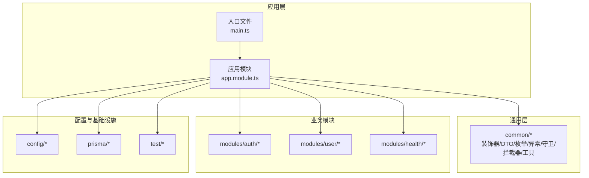
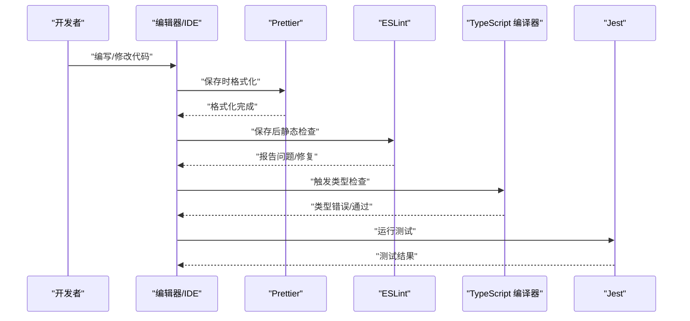
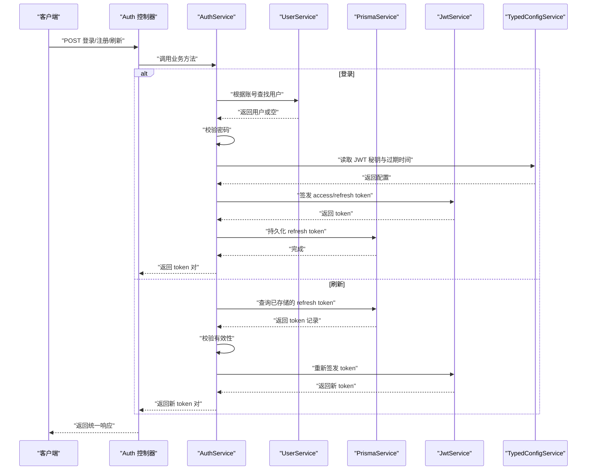
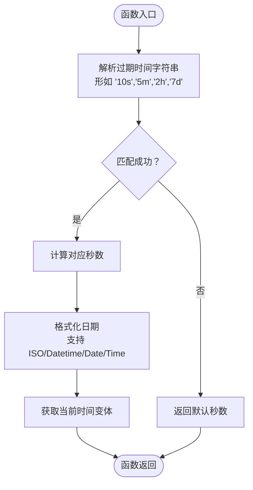
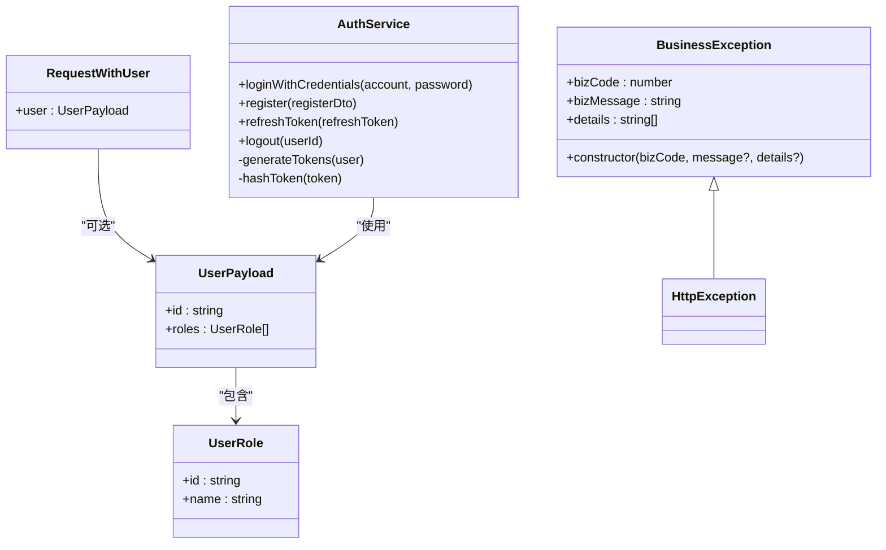
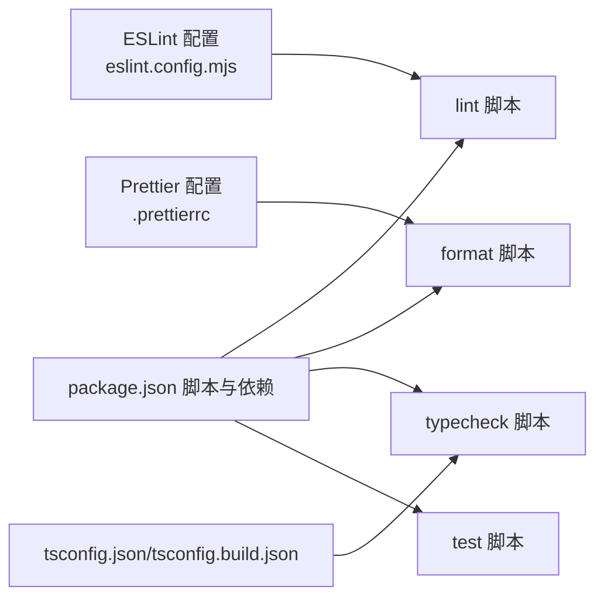

# 代码规范标准

<cite>
**本文引用的文件**
- [eslint.config.mjs](file://eslint.config.mjs)
- [.prettierrc](file://.prettierrc)
- [tsconfig.json](file://tsconfig.json)
- [tsconfig.build.json](file://tsconfig.build.json)
- [package.json](file://package.json)
- [src/common/utils/time.util.ts](file://src/common/utils/time.util.ts)
- [src/common/decorators/api-success-response.decorator.ts](file://src/common/decorators/api-success-response.decorator.ts)
- [src/common/interfaces/user.interface.ts](file://src/common/interfaces/user.interface.ts)
- [src/modules/auth/auth.service.ts](file://src/modules/auth/auth.service.ts)
- [src/common/dto/api-response.dto.ts](file://src/common/dto/api-response.dto.ts)
- [src/common/enums/biz-code.enum.ts](file://src/common/enums/biz-code.enum.ts)
- [src/common/exceptions/business.exception.ts](file://src/common/exceptions/business.exception.ts)
- [src/common/guards/jwt-auth.guard.ts](file://src/common/guards/jwt-auth.guard.ts)
- [src/common/interceptors/logging.interceptor.ts](file://src/common/interceptors/logging.interceptor.ts)
</cite>

## 目录
1. [引言](#引言)
2. [项目结构](#项目结构)
3. [核心组件](#核心组件)
4. [架构总览](#架构总览)
5. [详细组件分析](#详细组件分析)
6. [依赖分析](#依赖分析)
7. [性能考虑](#性能考虑)
8. [故障排查指南](#故障排查指南)
9. [结论](#结论)
10. [附录](#附录)

## 引言
本文件旨在建立一套系统化的 TypeScript 代码规范标准，覆盖命名约定、代码组织、注释规范、导入导出规则、tsconfig 编译选项与类型检查策略，并结合本项目的 ESLint 与 Prettier 配置，提供可执行的自动化格式化与静态检查流程。文档同时给出 IDE 推荐配置与插件清单，帮助团队在开发过程中保持一致性与高质量。

## 项目结构
本项目采用 NestJS 结构化分层组织，核心目录与职责如下：
- src/common：通用能力（装饰器、DTO、枚举、异常、守卫、拦截器、工具等）
- src/modules：按功能域划分的业务模块（如 auth、user、health 等）
- src/config：配置加载与类型化配置服务
- prisma：数据库模式与种子脚本
- test：端到端测试与 Jest 配置
- 根目录配置：tsconfig、ESLint、Prettier、包管理与脚本

**章节来源**
- [tsconfig.json:1-36](file://tsconfig.json#L1-L36)
- [package.json:8-25](file://package.json#L8-L25)

## 核心组件
本节从“规范即配置”的角度，总结本项目中与代码质量直接相关的配置与约定。

- ESLint 配置
  - 使用推荐配置与 TypeScript ESLint 类型检查配置，启用 Prettier 推荐集成，关闭部分严格规则以平衡工程可用性。
  - 关键规则：禁用显式 any；对浮点 Promise、不安全调用进行警告；Prettier 自动修复并自动检测换行符。
  - 语言环境：Node 与 Jest 全局。
  - 解析器：基于 tsconfig 的项目服务解析，确保类型感知。

- Prettier 配置
  - 单引号、尾随逗号（所有场景）。

- tsconfig 编译选项
  - 模块与解析：NodeNext 模块与解析，支持包导出解析。
  - 类型严格性：严格模式开启，严格空值检查、严格绑定、严格调用、switch 完整性、禁止隐式 any。
  - 输出与增量：声明文件、移除注释、装饰器元数据、合成默认导入、SourceMap、增量编译、跳过库检查。
  - 路径映射：@/*、@modules/*、@common/*、@config/*。
  - 类型声明：内置 Node 与 Jest 类型。

- 构建配置
  - 继承根 tsconfig，仅包含 src，排除测试与生成物。

- 脚本与自动化
  - lint：ESLint 扫描并自动修复。
  - format：Prettier 批量格式化。
  - typecheck：tsc 仅类型检查，不生成输出。
  - 测试：Jest 生态，支持 watch、覆盖率、e2e。

**章节来源**
- [eslint.config.mjs:1-42](file://eslint.config.mjs#L1-L42)
- [.prettierrc:1-5](file://.prettierrc#L1-L5)
- [tsconfig.json:1-36](file://tsconfig.json#L1-L36)
- [tsconfig.build.json:1-6](file://tsconfig.build.json#L1-L6)
- [package.json:8-25](file://package.json#L8-L25)

## 架构总览
下图展示了代码规范在开发流程中的作用：编辑器保存触发 Prettier 格式化，随后 ESLint 进行静态检查，最终通过类型检查与测试保障质量。

## 详细组件分析

### 命名约定
- 变量与函数
  - 使用小驼峰命名法，语义清晰，避免缩写。
  - 示例：时间格式常量、日期解析与格式化函数、当前时间获取等。
  - 参考路径：[src/common/utils/time.util.ts:1-72](file://src/common/utils/time.util.ts#L1-L72)

- 类与接口
  - 类名使用大驼峰，接口名使用名词或抽象概念，必要时加 I 前缀或以 er/able 结尾（视团队习惯）。
  - 示例：业务异常类、用户载荷接口、请求扩展接口等。
  - 参考路径：
    - [src/common/exceptions/business.exception.ts:16-42](file://src/common/exceptions/business.exception.ts#L16-L42)
    - [src/common/interfaces/user.interface.ts:1-10](file://src/common/interfaces/user.interface.ts#L1-L10)
    - [src/common/guards/jwt-auth.guard.ts:13-15](file://src/common/guards/jwt-auth.guard.ts#L13-L15)

- 枚举与常量
  - 枚举全大写下划线命名，配合分组注释；常量使用全大写+下划线，配合只读约束。
  - 示例：业务状态码枚举与消息映射、默认 HTTP 状态映射。
  - 参考路径：
    - [src/common/enums/biz-code.enum.ts:13-78](file://src/common/enums/biz-code.enum.ts#L13-L78)
    - [src/common/enums/biz-code.enum.ts:83-122](file://src/common/enums/biz-code.enum.ts#L83-L122)
    - [src/common/enums/biz-code.enum.ts:127-170](file://src/common/enums/biz-code.enum.ts#L127-L170)

- DTO 与响应模型
  - DTO 使用名词短语 + 后缀（如 dto），响应模型使用 Schema 或 Type 后缀，保持语义一致。
  - 示例：通用响应 Schema、错误响应 Schema、ApiResponseType 类型别名。
  - 参考路径：
    - [src/common/dto/api-response.dto.ts:9-14](file://src/common/dto/api-response.dto.ts#L9-L14)
    - [src/common/dto/api-response.dto.ts:21-28](file://src/common/dto/api-response.dto.ts#L21-L28)
    - [src/common/dto/api-response.dto.ts:35-40](file://src/common/dto/api-response.dto.ts#L35-L40)

- 装饰器与元数据
  - 装饰器函数以 Api 前缀命名，返回方法装饰器或类装饰器；元数据键使用全大写常量。
  - 示例：成功响应装饰器、全局错误响应装饰器、响应消息元数据键。
  - 参考路径：
    - [src/common/decorators/api-success-response.decorator.ts:88-102](file://src/common/decorators/api-success-response.decorator.ts#L88-L102)
    - [src/common/decorators/api-success-response.decorator.ts:110-128](file://src/common/decorators/api-success-response.decorator.ts#L110-L128)
    - [src/common/decorators/api-success-response.decorator.ts:138-171](file://src/common/decorators/api-success-response.decorator.ts#L138-L171)

### 代码组织结构
- 分层与职责
  - common：跨模块复用的基础设施（装饰器、DTO、枚举、异常、守卫、拦截器、工具）。
  - modules：按领域拆分的业务模块，每个模块内包含 controller/service/dto 等。
  - config：配置加载与类型化访问，便于在各层安全地读取配置。
  - prisma：数据库模式与客户端，统一数据访问。
  - test：端到端测试与 Jest 配置。

- 导入导出规则
  - 优先使用路径映射别名（@/*、@modules/*、@common/*、@config/*）提升可维护性。
  - 从 common 抽象出可复用能力，避免重复实现。
  - 示例：AuthService 通过别名导入模块内服务、DTO、枚举、异常与工具。
  - 参考路径：
    - [src/modules/auth/auth.service.ts:1-13](file://src/modules/auth/auth.service.ts#L1-L13)

- 注释规范
  - 文件顶部添加简要说明与用途；复杂函数添加 JSDoc 注释，明确参数、返回值与异常。
  - 示例：AuthService 中多处 JSDoc 注释，清晰描述登录、注册、刷新 token 等流程。
  - 参考路径：
    - [src/modules/auth/auth.service.ts:23-43](file://src/modules/auth/auth.service.ts#L23-L43)
    - [src/modules/auth/auth.service.ts:45-65](file://src/modules/auth/auth.service.ts#L45-L65)
    - [src/modules/auth/auth.service.ts:67-96](file://src/modules/auth/auth.service.ts#L67-L96)

### 处理逻辑与数据流

#### 认证服务处理流程（登录/注册/刷新）

**图表来源**
- [src/modules/auth/auth.service.ts:14-162](file://src/modules/auth/auth.service.ts#L14-L162)
- [src/common/enums/biz-code.enum.ts:13-78](file://src/common/enums/biz-code.enum.ts#L13-L78)
- [src/common/exceptions/business.exception.ts:16-42](file://src/common/exceptions/business.exception.ts#L16-L42)

**章节来源**
- [src/modules/auth/auth.service.ts:14-162](file://src/modules/auth/auth.service.ts#L14-L162)

### 复杂逻辑组件（时间工具）

#### 时间格式化与解析流程

**图表来源**
- [src/common/utils/time.util.ts:12-31](file://src/common/utils/time.util.ts#L12-L31)
- [src/common/utils/time.util.ts:33-55](file://src/common/utils/time.util.ts#L33-L55)
- [src/common/utils/time.util.ts:57-72](file://src/common/utils/time.util.ts#L57-L72)

**章节来源**
- [src/common/utils/time.util.ts:1-72](file://src/common/utils/time.util.ts#L1-L72)

### 类与接口关系

**图表来源**
- [src/common/exceptions/business.exception.ts:16-42](file://src/common/exceptions/business.exception.ts#L16-L42)
- [src/common/interfaces/user.interface.ts:1-10](file://src/common/interfaces/user.interface.ts#L1-10)
- [src/common/guards/jwt-auth.guard.ts:13-15](file://src/common/guards/jwt-auth.guard.ts#L13-L15)
- [src/modules/auth/auth.service.ts:14-162](file://src/modules/auth/auth.service.ts#L14-L162)

**章节来源**
- [src/common/exceptions/business.exception.ts:16-42](file://src/common/exceptions/business.exception.ts#L16-L42)
- [src/common/interfaces/user.interface.ts:1-10](file://src/common/interfaces/user.interface.ts#L1-L10)
- [src/common/guards/jwt-auth.guard.ts:13-15](file://src/common/guards/jwt-auth.guard.ts#L13-L15)
- [src/modules/auth/auth.service.ts:14-162](file://src/modules/auth/auth.service.ts#L14-L162)

## 依赖分析
- 配置耦合
  - ESLint 与 Prettier 通过共享配置文件耦合，保证格式与风格一致。
  - tsconfig 与构建脚本（lint/format/typecheck/test）形成闭环，确保从格式到类型再到测试的质量链路。
- 外部依赖
  - NestJS 生态（Common/Config/JWT/Swagger/Throttler 等）
  - Prisma 与 Zod
  - Jest 与 Supertest（测试生态）
  - Day.js（时间处理）

**图表来源**
- [eslint.config.mjs:1-42](file://eslint.config.mjs#L1-L42)
- [.prettierrc:1-5](file://.prettierrc#L1-L5)
- [tsconfig.json:1-36](file://tsconfig.json#L1-L36)
- [tsconfig.build.json:1-6](file://tsconfig.build.json#L1-L6)
- [package.json:8-25](file://package.json#L8-L25)

**章节来源**
- [eslint.config.mjs:1-42](file://eslint.config.mjs#L1-L42)
- [.prettierrc:1-5](file://.prettierrc#L1-L5)
- [tsconfig.json:1-36](file://tsconfig.json#L1-L36)
- [tsconfig.build.json:1-6](file://tsconfig.build.json#L1-L6)
- [package.json:8-25](file://package.json#L8-L25)

## 性能考虑
- 类型检查优化
  - 开启严格模式与严格空值检查，有助于提前发现潜在问题，但会增加编译时间。
  - 使用增量编译与跳过库检查，缩短二次构建时间。
- 运行时性能
  - 使用拦截器记录请求耗时与状态码，便于定位慢请求。
  - 守卫与过滤器应尽量轻量化，避免阻塞主流程。
- 测试与 CI
  - 在 CI 中并行运行测试与类型检查，减少整体流水线时间。

## 故障排查指南
- ESLint 报错
  - 若出现类型相关报错，确认 tsconfig 项目服务解析是否生效；检查语言环境与解析器配置。
  - 对于浮点 Promise/不安全调用警告，按需修复或在特定场景下接受。
  - 参考路径：[eslint.config.mjs:33-40](file://eslint.config.mjs#L33-L40)

- Prettier 格式冲突
  - 确认 .prettierrc 配置与编辑器扩展一致；保存时自动格式化。
  - 参考路径：[.prettierrc:1-5](file://.prettierrc#L1-L5)

- 类型检查失败
  - 检查 tsconfig 严格选项与路径映射；确认 include/exclude 范围。
  - 参考路径：[tsconfig.json:26-31](file://tsconfig.json#L26-L31)

- 运行时异常
  - 统一使用 BusinessException 抛出业务错误，确保响应结构一致。
  - 参考路径：
    - [src/common/exceptions/business.exception.ts:16-42](file://src/common/exceptions/business.exception.ts#L16-L42)
    - [src/common/enums/biz-code.enum.ts:13-78](file://src/common/enums/biz-code.enum.ts#L13-L78)

**章节来源**
- [eslint.config.mjs:33-40](file://eslint.config.mjs#L33-L40)
- [.prettierrc:1-5](file://.prettierrc#L1-L5)
- [tsconfig.json:26-31](file://tsconfig.json#L26-L31)
- [src/common/exceptions/business.exception.ts:16-42](file://src/common/exceptions/business.exception.ts#L16-L42)
- [src/common/enums/biz-code.enum.ts:13-78](file://src/common/enums/biz-code.enum.ts#L13-L78)

## 结论
本规范以配置为纲，将 ESLint、Prettier、tsconfig 与脚本整合为统一的质量保障体系。通过明确的命名与组织约定、严格的类型检查、以及可执行的自动化流程，确保代码在可读性、一致性与稳定性方面达到工程化标准。

## 附录

### IDE 配置与插件建议
- VS Code
  - 插件：ESLint、Prettier、TypeScript Importer、Path Intellisense、Bracket Pair Colorizer
  - 设置：保存时自动格式化、ESLint 自动修复、TypeScript 项目服务解析
- WebStorm/IntelliJ
  - 启用 ESLint 与 Prettier 集成，使用 tsconfig 项目服务
- 共享设置
  - 使用 .editorconfig（如存在）与上述配置保持一致

### 自动化与工作流
- 保存即格式化：编辑器保存时触发 Prettier
- 提交前检查：执行 lint 与 typecheck
- CI 集成：在流水线中运行 lint、typecheck、test

**章节来源**
- [package.json:8-25](file://package.json#L8-L25)