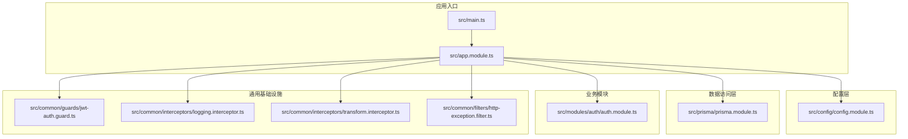
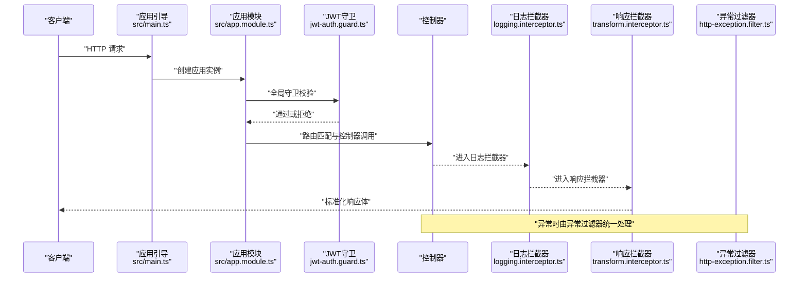
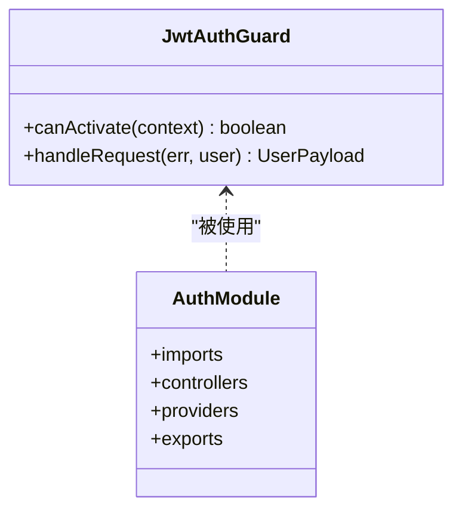
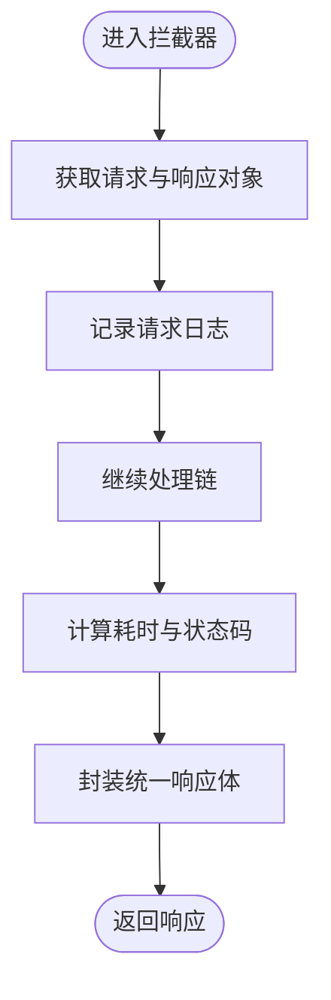
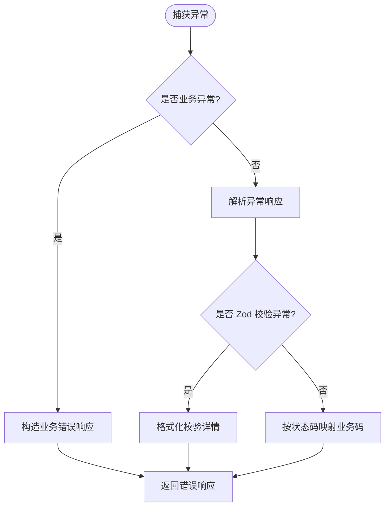
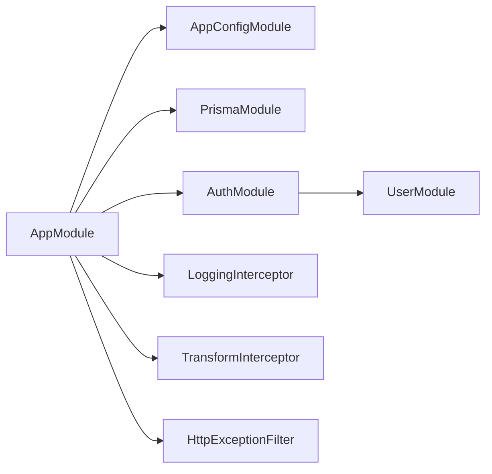

# 团队协作规范

<cite>
**本文引用的文件**
- [README.md](file://README.md)
- [package.json](file://package.json)
- [eslint.config.mjs](file://eslint.config.mjs)
- [jest.config.js](file://jest.config.js)
- [nest-cli.json](file://nest-cli.json)
- [src/app.module.ts](file://src/app.module.ts)
- [src/main.ts](file://src/main.ts)
- [src/config/config.module.ts](file://src/config/config.module.ts)
- [src/prisma/prisma.module.ts](file://src/prisma/prisma.module.ts)
- [src/modules/auth/auth.module.ts](file://src/modules/auth/auth.module.ts)
- [src/common/guards/jwt-auth.guard.ts](file://src/common/guards/jwt-auth.guard.ts)
- [src/common/interceptors/logging.interceptor.ts](file://src/common/interceptors/logging.interceptor.ts)
- [src/common/interceptors/transform.interceptor.ts](file://src/common/interceptors/transform.interceptor.ts)
- [src/common/filters/http-exception.filter.ts](file://src/common/filters/http-exception.filter.ts)
- [src/common/utils/time.util.ts](file://src/common/utils/time.util.ts)
</cite>

## 目录
1. [引言](#引言)
2. [项目结构](#项目结构)
3. [核心组件](#核心组件)
4. [架构总览](#架构总览)
5. [详细组件分析](#详细组件分析)
6. [依赖分析](#依赖分析)
7. [性能考虑](#性能考虑)
8. [故障排查指南](#故障排查指南)
9. [结论](#结论)
10. [附录](#附录)

## 引言
本规范旨在统一团队在 NestJS 项目中的开发流程、质量标准与协作方式，覆盖代码审查、文档编写、技术决策、项目管理、沟通渠道、问题跟踪与进度汇报、新成员入职与技能提升、贡献指南与社区参与等维度。结合仓库现有配置与实现，形成可执行、可落地的团队协作标准。

## 项目结构
项目采用 NestJS 官方推荐的分层与功能模块化组织方式，核心目录与职责如下：
- src/common：通用装饰器、拦截器、守卫、过滤器、工具类与DTO/枚举等横切能力
- src/config：集中式配置加载与类型化配置服务
- src/prisma：数据库访问层模块与服务
- src/modules：按业务域划分的功能模块（如认证、用户、健康检查、缓存、日志）
- test：端到端测试与测试环境配置
- 配置与脚本：包管理、ESLint、Jest、Nest CLI、Docker 等

图表来源
- [src/main.ts:1-50](file://src/main.ts#L1-L50)
- [src/app.module.ts:1-61](file://src/app.module.ts#L1-L61)
- [src/config/config.module.ts:1-20](file://src/config/config.module.ts#L1-L20)
- [src/prisma/prisma.module.ts:1-10](file://src/prisma/prisma.module.ts#L1-L10)
- [src/modules/auth/auth.module.ts:1-34](file://src/modules/auth/auth.module.ts#L1-L34)
- [src/common/guards/jwt-auth.guard.ts:1-46](file://src/common/guards/jwt-auth.guard.ts#L1-L46)
- [src/common/interceptors/logging.interceptor.ts:1-40](file://src/common/interceptors/logging.interceptor.ts#L1-L40)
- [src/common/interceptors/transform.interceptor.ts:1-41](file://src/common/interceptors/transform.interceptor.ts#L1-L41)
- [src/common/filters/http-exception.filter.ts:1-173](file://src/common/filters/http-exception.filter.ts#L1-L173)

章节来源
- [README.md:24-99](file://README.md#L24-L99)
- [nest-cli.json:1-9](file://nest-cli.json#L1-L9)

## 核心组件
- 应用引导与全局配置：应用启动时初始化配置、CORS、Swagger、全局前缀与日志；注册全局守卫、拦截器、验证管道与异常过滤器
- 配置模块：集中式配置加载与类型化访问，支持命名空间读取
- 数据访问模块：全局导出 Prisma 服务，供各业务模块使用
- 认证模块：基于 JWT 的认证流程，集成 Passport 与策略
- 通用中间件：统一日志记录、响应体包装与异常过滤

章节来源
- [src/main.ts:8-47](file://src/main.ts#L8-L47)
- [src/app.module.ts:18-60](file://src/app.module.ts#L18-L60)
- [src/config/config.module.ts:6-19](file://src/config/config.module.ts#L6-L19)
- [src/prisma/prisma.module.ts:4-9](file://src/prisma/prisma.module.ts#L4-L9)
- [src/modules/auth/auth.module.ts:11-33](file://src/modules/auth/auth.module.ts#L11-L33)

## 架构总览
下图展示从请求进入应用到响应返回的关键处理链路，以及全局中间件与模块间的交互关系。

图表来源
- [src/main.ts:8-47](file://src/main.ts#L8-L47)
- [src/app.module.ts:33-57](file://src/app.module.ts#L33-L57)
- [src/common/guards/jwt-auth.guard.ts:17-45](file://src/common/guards/jwt-auth.guard.ts#L17-L45)
- [src/common/interceptors/logging.interceptor.ts:12-39](file://src/common/interceptors/logging.interceptor.ts#L12-L39)
- [src/common/interceptors/transform.interceptor.ts:14-40](file://src/common/interceptors/transform.interceptor.ts#L14-L40)
- [src/common/filters/http-exception.filter.ts:24-78](file://src/common/filters/http-exception.filter.ts#L24-L78)

## 详细组件分析

### 认证与授权组件
- 组件职责：提供 JWT 认证流程、公共接口豁免控制、用户上下文注入
- 关键点：通过反射判断是否为公开接口；统一业务异常抛出；JWT 策略与配置解耦

图表来源
- [src/common/guards/jwt-auth.guard.ts:17-45](file://src/common/guards/jwt-auth.guard.ts#L17-L45)
- [src/modules/auth/auth.module.ts:11-33](file://src/modules/auth/auth.module.ts#L11-L33)

章节来源
- [src/common/guards/jwt-auth.guard.ts:17-45](file://src/common/guards/jwt-auth.guard.ts#L17-L45)
- [src/modules/auth/auth.module.ts:11-33](file://src/modules/auth/auth.module.ts#L11-L33)

### 日志与响应拦截器
- 日志拦截器：记录请求方法、URL、用户标识、IP、UA 与耗时
- 响应拦截器：统一包装响应体，注入业务码与消息，支持控制器级自定义消息键

图表来源
- [src/common/interceptors/logging.interceptor.ts:16-38](file://src/common/interceptors/logging.interceptor.ts#L16-L38)
- [src/common/interceptors/transform.interceptor.ts:21-39](file://src/common/interceptors/transform.interceptor.ts#L21-L39)

章节来源
- [src/common/interceptors/logging.interceptor.ts:12-39](file://src/common/interceptors/logging.interceptor.ts#L12-L39)
- [src/common/interceptors/transform.interceptor.ts:14-40](file://src/common/interceptors/transform.interceptor.ts#L14-L40)

### 异常过滤与错误码映射
- 统一异常处理：区分业务异常与通用 HTTP 异常；对 Zod 校验异常进行格式化输出
- 错误码映射：根据 HTTP 状态码映射到通用业务码，保证对外一致的错误语义

图表来源
- [src/common/filters/http-exception.filter.ts:24-78](file://src/common/filters/http-exception.filter.ts#L24-L78)
- [src/common/filters/http-exception.filter.ts:80-134](file://src/common/filters/http-exception.filter.ts#L80-L134)
- [src/common/filters/http-exception.filter.ts:136-171](file://src/common/filters/http-exception.filter.ts#L136-L171)

章节来源
- [src/common/filters/http-exception.filter.ts:24-172](file://src/common/filters/http-exception.filter.ts#L24-L172)

### 配置与时间工具
- 配置模块：全局注册配置模块，支持命名空间读取与环境文件忽略策略
- 时间工具：提供日期格式化、解析与单位换算，统一时间处理逻辑

章节来源
- [src/config/config.module.ts:6-19](file://src/config/config.module.ts#L6-L19)
- [src/common/utils/time.util.ts:3-72](file://src/common/utils/time.util.ts#L3-L72)

## 依赖分析
- 依赖关系：应用模块聚合配置、缓存、数据库、认证、用户、健康检查与日志模块；通用中间件在应用层面统一注册
- 耦合度：模块间通过接口与服务解耦；认证模块依赖用户模块与配置模块；拦截器与过滤器对上层透明

图表来源
- [src/app.module.ts:18-60](file://src/app.module.ts#L18-L60)
- [src/modules/auth/auth.module.ts:11-33](file://src/modules/auth/auth.module.ts#L11-L33)

章节来源
- [src/app.module.ts:18-60](file://src/app.module.ts#L18-L60)
- [src/modules/auth/auth.module.ts:11-33](file://src/modules/auth/auth.module.ts#L11-L33)

## 性能考虑
- 启用 CORS 与全局前缀：减少跨域与路径歧义带来的额外开销
- 全局拦截器与过滤器：统一处理日志与响应包装，避免重复逻辑；注意拦截器链路的顺序与性能影响
- Swagger 可控开启：生产环境建议关闭以降低资源占用
- 测试覆盖率阈值：通过 Jest 配置设置覆盖率门槛，确保关键路径得到验证

章节来源
- [src/main.ts:19-33](file://src/main.ts#L19-L33)
- [jest.config.js:17-24](file://jest.config.js#L17-L24)

## 故障排查指南
- 启动与部署
  - 确认应用端口、CORS 与 Swagger 开关配置正确
  - 生产环境忽略 .env 文件，确保配置加载安全
- 认证与授权
  - 公共接口需显式标注豁免；否则会触发 JWT 校验
  - 用户上下文缺失时抛出业务异常，检查令牌有效性与策略配置
- 日志与监控
  - 日志拦截器记录请求与响应状态，便于定位慢请求与异常
  - 异常过滤器统一输出业务码与消息，便于前端与监控系统消费
- 测试与质量
  - 使用 ESLint 与 Prettier 规范代码风格；Jest 覆盖率阈值保障质量
  - 单测与 E2E 测试配合，确保模块边界清晰、行为稳定

章节来源
- [src/main.ts:13-46](file://src/main.ts#L13-L46)
- [src/common/guards/jwt-auth.guard.ts:23-44](file://src/common/guards/jwt-auth.guard.ts#L23-L44)
- [src/common/interceptors/logging.interceptor.ts:16-38](file://src/common/interceptors/logging.interceptor.ts#L16-L38)
- [src/common/filters/http-exception.filter.ts:36-78](file://src/common/filters/http-exception.filter.ts#L36-L78)
- [eslint.config.mjs:33-40](file://eslint.config.mjs#L33-L40)
- [jest.config.js:17-24](file://jest.config.js#L17-L24)

## 结论
本规范以现有代码结构为基础，明确了团队协作的关键流程与质量标准。建议在后续实践中持续完善文档与流程，确保新成员快速融入、老成员高效协作，并保持代码质量与交付效率的双提升。

## 附录

### 团队协作规范要点清单
- 开发流程
  - 分支策略：主分支保护、特性分支开发、合并请求（MR）评审
  - 提交规范：约定提交信息格式，结合 ESLint/Prettier 自动化
  - 代码审查：至少一名同行评审，关注安全性、可维护性与一致性
- 知识分享机制
  - 技术分享：定期组织分享会，沉淀最佳实践
  - 文档更新：需求、设计、接口与运维文档同步更新
- 技能提升计划
  - 新人培训：基础工具链、项目结构与开发规范
  - 进阶课程：架构演进、性能优化与安全加固
- 技术决策流程
  - 决策记录：重大变更通过决策记录表，明确背景、方案与风险
  - 评估矩阵：从兼容性、成本、收益与风险四个维度评估
- 项目管理方法
  - 迭代规划：按周/双周迭代，明确目标与验收标准
  - 进度跟踪：看板可视化，每日站会同步阻塞项
- 沟通渠道与问题跟踪
  - 沟通渠道：即时通讯群组、会议纪要与问题追踪系统
  - 问题分类：缺陷、需求、技术债与优化，分级处理与升级机制
- 新成员入职指导
  - 环境搭建：工具链安装、IDE 配置与调试脚本
  - 上手任务：最小可行任务，熟悉模块与测试用例
- 贡献指南与社区参与
  - 贡献流程：Fork、分支、提交、PR 与回归测试
  - 社区互动：Issue 回复、版本发布与生态建设

### 代码审查标准
- 正确性：边界条件、异常路径与并发安全
- 可读性：命名规范、注释与模块拆分
- 性能：避免热点路径阻塞、合理使用缓存与异步
- 安全性：输入校验、权限控制与敏感信息处理
- 可测试性：依赖注入、接口隔离与单元测试覆盖

### 文档编写规范
- 结构化：标题层级清晰、段落分明、图表配套
- 一致性：术语统一、示例风格一致、版本标记明确
- 可维护性：文档与代码同步更新，链接有效、示例可运行

### 技术决策流程
- 问题识别 → 方案征集 → 评估与权衡 → 决策记录 → 实施与回溯

### 项目管理方法
- 目标分解：史诗 → 功能 → 任务，明确负责人与截止时间
- 风险管理：识别技术与人员风险，制定应对预案
- 质量门禁：代码审查、测试通过与文档齐备作为上线前提

### 沟通渠道与问题跟踪
- 渠道：即时通讯、视频会议、文档与工单系统
- 工单：缺陷、需求与优化三类，分级响应与闭环管理

### 新成员入职指导
- 第一周：环境搭建、基础命令与最小任务
- 第二周：模块走读、常见问题与代码规范
- 第三周：独立任务、代码审查与知识分享

### 技能培训计划
- 基础：工具链、语言与框架入门
- 进阶：架构模式、性能优化与安全基线
- 专家：技术选型、复杂场景与团队领导力

### 知识传承策略
- 文档化：流程、经验与教训
- 师徒制：老带新、结对编程与定期回顾
- 复盘机制：迭代后复盘，沉淀改进项