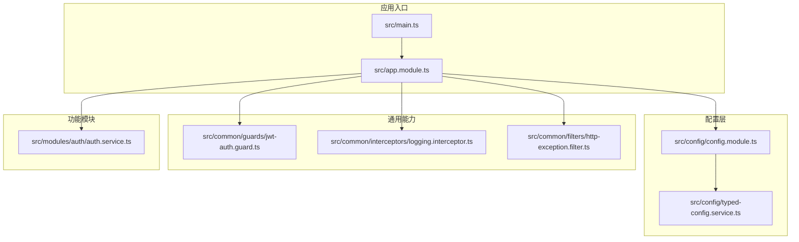
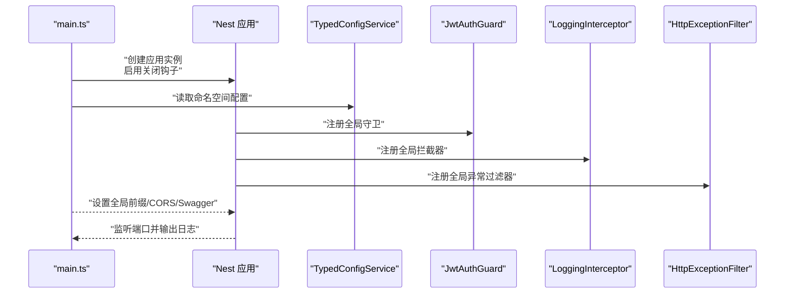
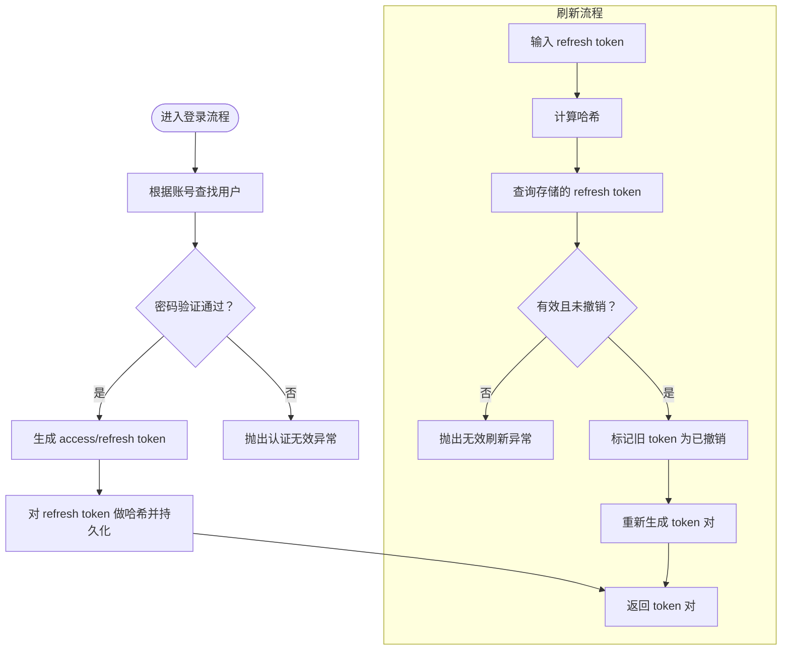
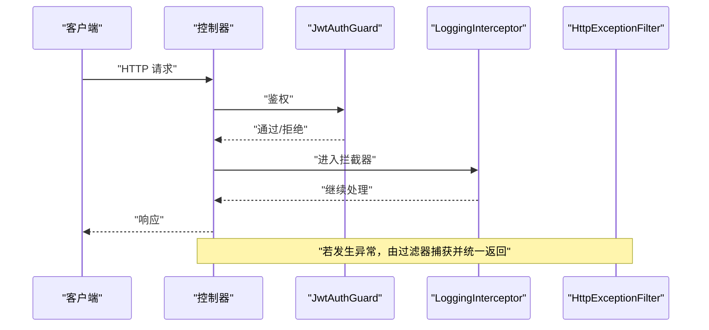
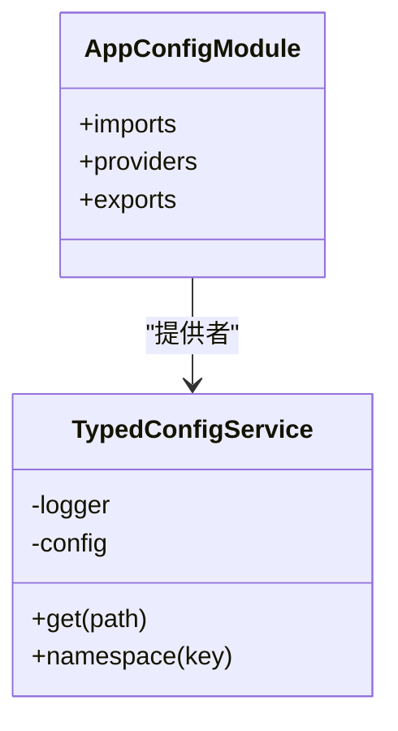

# 开发最佳实践

<cite>
**本文引用的文件**
- [package.json](file://package.json)
- [eslint.config.mjs](file://eslint.config.mjs)
- [.prettierrc](file://.prettierrc)
- [jest.config.js](file://jest.config.js)
- [tsconfig.json](file://tsconfig.json)
- [nest-cli.json](file://nest-cli.json)
- [README.md](file://README.md)
- [.gitignore](file://.gitignore)
- [src/app.module.ts](file://src/app.module.ts)
- [src/main.ts](file://src/main.ts)
- [src/config/config.module.ts](file://src/config/config.module.ts)
- [src/config/typed-config.service.ts](file://src/config/typed-config.service.ts)
- [src/common/guards/jwt-auth.guard.ts](file://src/common/guards/jwt-auth.guard.ts)
- [src/common/interceptors/logging.interceptor.ts](file://src/common/interceptors/logging.interceptor.ts)
- [src/common/filters/http-exception.filter.ts](file://src/common/filters/http-exception.filter.ts)
- [src/modules/auth/auth.service.ts](file://src/modules/auth/auth.service.ts)
</cite>

## 目录
1. [引言](#引言)
2. [项目结构](#项目结构)
3. [核心组件](#核心组件)
4. [架构总览](#架构总览)
5. [详细组件分析](#详细组件分析)
6. [依赖分析](#依赖分析)
7. [性能考虑](#性能考虑)
8. [故障排查指南](#故障排查指南)
9. [结论](#结论)
10. [附录](#附录)

## 引言
本指南面向团队与个人开发者，系统性总结本项目的开发最佳实践，覆盖以下方面：
- TypeScript 编码规范与类型安全
- ESLint 与 Prettier 配置及代码质量检查
- Git 工作流、分支策略与提交消息规范
- 代码审查流程与持续集成实践
- 性能优化、内存管理、并发处理与错误处理
- 团队协作、知识分享与技能提升建议

本指南以仓库现有配置与实现为依据，结合可落地的建议，帮助团队统一风格、提升质量与效率。

## 项目结构
本项目采用 NestJS 标准目录组织方式，按功能模块划分，配合配置、通用能力与测试分层：
- 配置层：集中式配置加载与类型化访问
- 通用能力：守卫、拦截器、过滤器、DTO、枚举、异常等
- 功能模块：认证、用户、健康检查、缓存、日志等
- 测试：单元测试、端到端测试与覆盖率配置
- 构建与工具：TypeScript、ESLint、Prettier、Jest、Nest CLI

图示来源
- [src/main.ts:1-50](file://src/main.ts#L1-L50)
- [src/app.module.ts:1-61](file://src/app.module.ts#L1-L61)
- [src/config/config.module.ts:1-20](file://src/config/config.module.ts#L1-L20)
- [src/config/typed-config.service.ts:1-48](file://src/config/typed-config.service.ts#L1-L48)
- [src/common/guards/jwt-auth.guard.ts:1-46](file://src/common/guards/jwt-auth.guard.ts#L1-L46)
- [src/common/interceptors/logging.interceptor.ts:1-40](file://src/common/interceptors/logging.interceptor.ts#L1-L40)
- [src/common/filters/http-exception.filter.ts:1-173](file://src/common/filters/http-exception.filter.ts#L1-L173)
- [src/modules/auth/auth.service.ts:1-162](file://src/modules/auth/auth.service.ts#L1-L162)

章节来源
- [README.md:24-99](file://README.md#L24-L99)
- [nest-cli.json:1-9](file://nest-cli.json#L1-L9)

## 核心组件
- 应用引导与全局配置
  - 启动时启用关闭钩子、设置全局前缀、跨域与 Swagger 文档开关
  - 通过类型化配置服务读取命名空间配置，集中管理环境变量
- 安全与限流
  - 全局注册 JWT 守卫与自定义限流守卫，统一鉴权与速率控制
- 日志与异常
  - 全局日志拦截器记录请求与响应上下文；全局异常过滤器统一封装业务与校验错误
- 数据校验
  - 全局注册 Zod 校验管道，结合 DTO 与 Zod Schema 实现运行时校验

章节来源
- [src/main.ts:8-47](file://src/main.ts#L8-L47)
- [src/app.module.ts:18-59](file://src/app.module.ts#L18-L59)
- [src/config/typed-config.service.ts:20-47](file://src/config/typed-config.service.ts#L20-L47)
- [src/common/guards/jwt-auth.guard.ts:17-45](file://src/common/guards/jwt-auth.guard.ts#L17-L45)
- [src/common/interceptors/logging.interceptor.ts:12-39](file://src/common/interceptors/logging.interceptor.ts#L12-L39)
- [src/common/filters/http-exception.filter.ts:24-78](file://src/common/filters/http-exception.filter.ts#L24-L78)

## 架构总览
下图展示启动流程与关键组件交互：

图示来源
- [src/main.ts:8-47](file://src/main.ts#L8-L47)
- [src/app.module.ts:33-59](file://src/app.module.ts#L33-L59)
- [src/config/typed-config.service.ts:6-18](file://src/config/typed-config.service.ts#L6-L18)
- [src/common/guards/jwt-auth.guard.ts:17-34](file://src/common/guards/jwt-auth.guard.ts#L17-L34)
- [src/common/interceptors/logging.interceptor.ts:12-39](file://src/common/interceptors/logging.interceptor.ts#L12-L39)
- [src/common/filters/http-exception.filter.ts:24-78](file://src/common/filters/http-exception.filter.ts#L24-L78)

## 详细组件分析

### TypeScript 编码规范与类型安全
- 严格编译选项
  - 启用严格模式、严格空检查、禁止隐式 any、强制一致大小写
  - 启用装饰器与实验性装饰器元数据，便于 DI 与反射
- 路径别名
  - 通过路径映射简化导入，统一 @/、@modules/、@common/、@config/
- 类型化配置
  - 通过命名空间读取配置，避免魔法字符串与运行时错误

章节来源
- [tsconfig.json:2-25](file://tsconfig.json#L2-L25)
- [tsconfig.json:26-31](file://tsconfig.json#L26-L31)
- [src/config/typed-config.service.ts:20-47](file://src/config/typed-config.service.ts#L20-L47)

### ESLint 与 Prettier 配置
- ESLint
  - 使用推荐规则集与 TypeScript 类型检查规则
  - 启用 Prettier 推荐集成，自动修复格式问题
  - 关闭部分高风险规则以平衡开发体验与安全性
- Prettier
  - 单引号与尾随逗号策略统一，减少差异与冲突

章节来源
- [eslint.config.mjs:7-41](file://eslint.config.mjs#L7-L41)
- [.prettierrc:1-5](file://.prettierrc#L1-L5)

### 代码质量检查与测试
- Jest 配置
  - TS-Jest 转换、测试文件匹配、覆盖率阈值、模块名映射
  - 收集覆盖率时排除 spec/e2e/main 与生成代码
- 覆盖率门槛
  - 全局分支、函数、行、语句均要求 80%
- 命令脚本
  - 提供 lint、format、typecheck、test、test:cov、test:e2e 等常用命令

章节来源
- [jest.config.js:1-34](file://jest.config.js#L1-L34)
- [package.json:8-25](file://package.json#L8-L25)

### 安全与鉴权
- JWT 守卫
  - 结合反射判断是否公开接口；鉴权失败抛出业务异常
- 登录/注册/刷新/登出
  - 统一返回 token 对；刷新时对 refresh token 做哈希存储与过期校验
  - 登出撤销当前用户的所有 refresh token

图示来源
- [src/common/guards/jwt-auth.guard.ts:17-45](file://src/common/guards/jwt-auth.guard.ts#L17-L45)
- [src/modules/auth/auth.service.ts:29-43](file://src/modules/auth/auth.service.ts#L29-L43)
- [src/modules/auth/auth.service.ts:50-65](file://src/modules/auth/auth.service.ts#L50-L65)
- [src/modules/auth/auth.service.ts:72-96](file://src/modules/auth/auth.service.ts#L72-L96)
- [src/modules/auth/auth.service.ts:102-110](file://src/modules/auth/auth.service.ts#L102-L110)
- [src/modules/auth/auth.service.ts:117-153](file://src/modules/auth/auth.service.ts#L117-L153)

章节来源
- [src/common/guards/jwt-auth.guard.ts:17-45](file://src/common/guards/jwt-auth.guard.ts#L17-L45)
- [src/modules/auth/auth.service.ts:14-21](file://src/modules/auth/auth.service.ts#L14-L21)
- [src/modules/auth/auth.service.ts:29-43](file://src/modules/auth/auth.service.ts#L29-L43)
- [src/modules/auth/auth.service.ts:50-65](file://src/modules/auth/auth.service.ts#L50-L65)
- [src/modules/auth/auth.service.ts:72-96](file://src/modules/auth/auth.service.ts#L72-L96)
- [src/modules/auth/auth.service.ts:102-110](file://src/modules/auth/auth.service.ts#L102-L110)
- [src/modules/auth/auth.service.ts:117-153](file://src/modules/auth/auth.service.ts#L117-L153)

### 日志与异常处理
- 日志拦截器
  - 记录请求方法、URL、用户标识、IP、UA 与耗时
- 异常过滤器
  - 统一将业务异常、Zod 校验异常与通用 HttpException 映射为统一响应结构
  - 将状态码映射为业务码，保留细节信息以便前端定位

图示来源
- [src/common/interceptors/logging.interceptor.ts:12-39](file://src/common/interceptors/logging.interceptor.ts#L12-L39)
- [src/common/filters/http-exception.filter.ts:24-78](file://src/common/filters/http-exception.filter.ts#L24-L78)
- [src/common/guards/jwt-auth.guard.ts:23-34](file://src/common/guards/jwt-auth.guard.ts#L23-L34)

章节来源
- [src/common/interceptors/logging.interceptor.ts:12-39](file://src/common/interceptors/logging.interceptor.ts#L12-L39)
- [src/common/filters/http-exception.filter.ts:24-78](file://src/common/filters/http-exception.filter.ts#L24-L78)

### 配置加载与类型化访问
- 全局注册配置模块，支持从配置文件加载根对象
- TypedConfigService 提供命名空间读取与点语法路径访问，缺失时立即终止进程

图示来源
- [src/config/config.module.ts:6-19](file://src/config/config.module.ts#L6-L19)
- [src/config/typed-config.service.ts:6-18](file://src/config/typed-config.service.ts#L6-L18)
- [src/config/typed-config.service.ts:20-47](file://src/config/typed-config.service.ts#L20-L47)

章节来源
- [src/config/config.module.ts:6-19](file://src/config/config.module.ts#L6-L19)
- [src/config/typed-config.service.ts:6-18](file://src/config/typed-config.service.ts#L6-L18)
- [src/config/typed-config.service.ts:20-47](file://src/config/typed-config.service.ts#L20-L47)

## 依赖分析
- 构建与工具链
  - Nest CLI、TypeScript、Jest、ESLint、Prettier、tsconfig-paths
- 运行时框架与扩展
  - @nestjs/* 核心模块、Prisma、Winston、Swagger、Passport、Zod
- 开发依赖
  - Jest、ESLint 插件、Prettier 插件、ts-jest、supertest、ts-node 等

章节来源
- [package.json:26-86](file://package.json#L26-L86)

## 性能考虑
- 并发与异步
  - 在需要同时生成多个令牌时使用并发执行，减少等待时间
- 内存管理
  - 避免在请求上下文中累积大对象；及时释放临时资源
- I/O 与数据库
  - 批量操作与事务使用一次性提交；合理使用连接池与索引
- 缓存与限流
  - 启用全局限流与缓存模块，降低重复计算与数据库压力
- 日志与监控
  - 使用拦截器记录耗时与状态码，辅助定位慢请求与异常

章节来源
- [src/modules/auth/auth.service.ts:127-136](file://src/modules/auth/auth.service.ts#L127-L136)
- [src/common/interceptors/logging.interceptor.ts:16-37](file://src/common/interceptors/logging.interceptor.ts#L16-L37)
- [src/app.module.ts:21-25](file://src/app.module.ts#L21-L25)

## 故障排查指南
- 启动失败
  - 检查配置模块是否成功加载根配置；缺失配置会直接退出进程
- 鉴权失败
  - 确认 JWT 守卫是否正确传递用户信息；非公开路由需通过鉴权
- 异常未统一
  - 确认全局异常过滤器是否生效；检查是否抛出了未捕获的异常
- 测试失败或覆盖率低
  - 按照 Jest 配置排除规则调整测试文件；确保覆盖率阈值达标

章节来源
- [src/config/typed-config.service.ts:14-18](file://src/config/typed-config.service.ts#L14-L18)
- [src/common/guards/jwt-auth.guard.ts:36-44](file://src/common/guards/jwt-auth.guard.ts#L36-L44)
- [src/common/filters/http-exception.filter.ts:24-78](file://src/common/filters/http-exception.filter.ts#L24-L78)
- [jest.config.js:9-24](file://jest.config.js#L9-L24)

## 结论
本项目在工程化与质量保障方面具备良好基础：严格的 TypeScript 配置、统一的 ESLint/Prettier 规范、完善的测试与覆盖率策略、全局化的安全与日志拦截器、以及类型化配置体系。建议在后续实践中进一步完善 Git 工作流与 CI/CD 流程，并持续优化性能与可维护性。

## 附录

### Git 工作流与分支策略
- 分支模型
  - 主分支：仅合并已审核的特性分支
  - 特性分支：基于主分支创建，完成后合并并删除
  - 预发布分支：版本临近发布时创建，仅修复紧急缺陷
- 提交消息规范
  - 类型：feat、fix、docs、style、refactor、perf、test、chore、revert
  - 格式：type(scope): subject
  - 示例：feat(auth): 添加 JWT 登录流程
- 代码审查
  - 至少一名同行评审；关注安全性、可读性与性能
  - 通过自动化检查（lint、format、test、typecheck）后再审
- 持续集成
  - 触发条件：推送至特性分支与主分支
  - 步骤：安装依赖 → Lint/Format/Typecheck → 测试与覆盖率 → 构建产物

章节来源
- [package.json:8-25](file://package.json#L8-L25)
- [eslint.config.mjs:33-40](file://eslint.config.mjs#L33-L40)
- [jest.config.js:1-34](file://jest.config.js#L1-L34)
- [.gitignore:1-66](file://.gitignore#L1-L66)