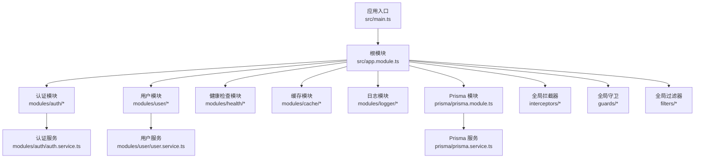
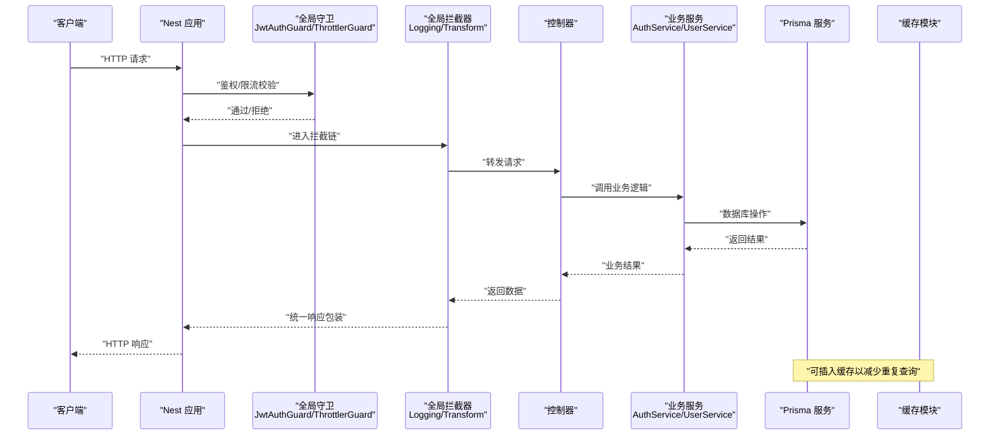
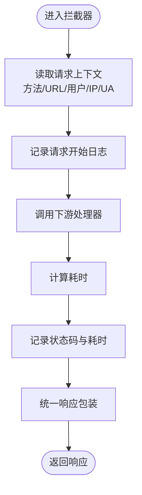
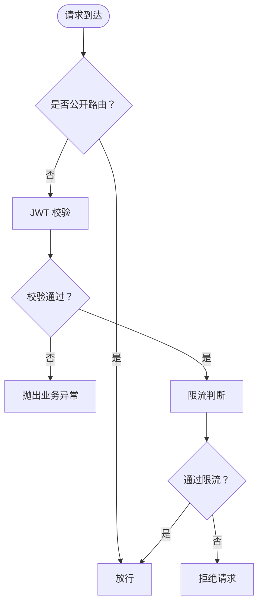
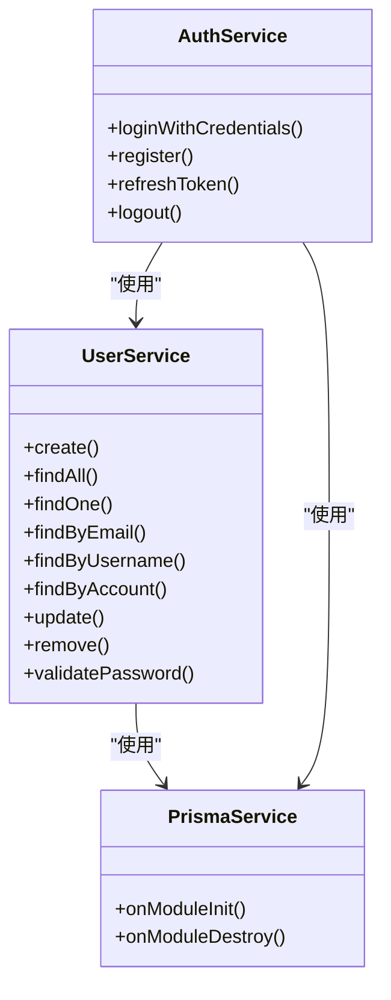
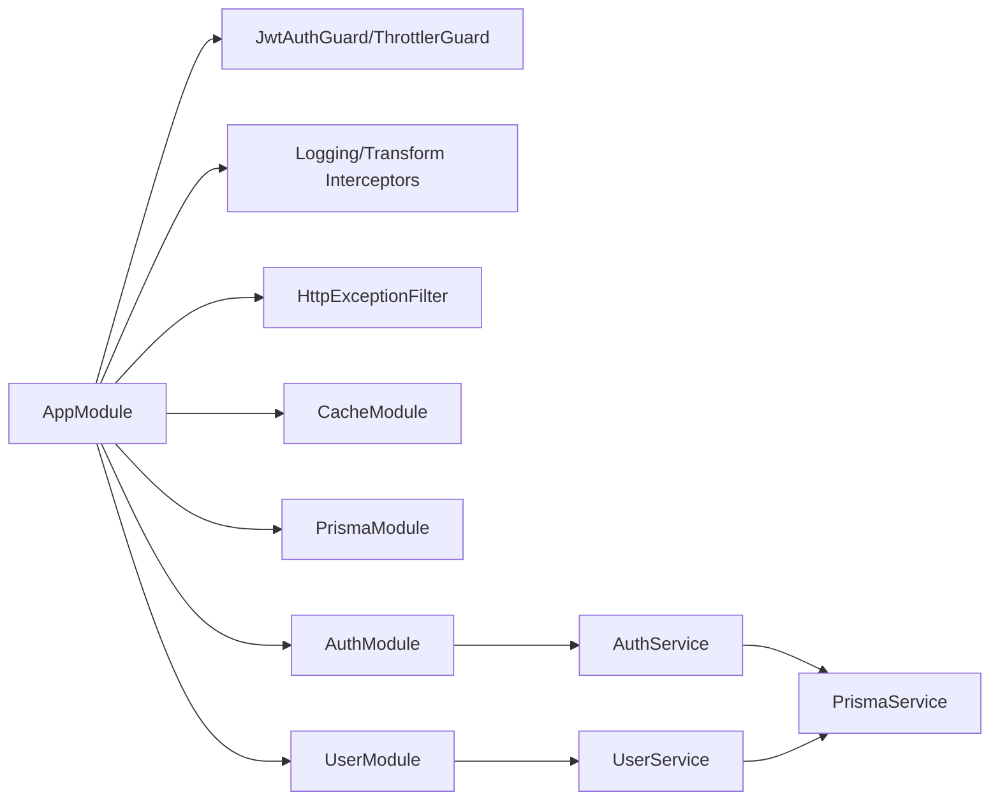

# 性能优化实践

<cite>
**本文引用的文件**
- [src/main.ts](file://src/main.ts)
- [src/app.module.ts](file://src/app.module.ts)
- [src/prisma/prisma.service.ts](file://src/prisma/prisma.service.ts)
- [src/common/interceptors/logging.interceptor.ts](file://src/common/interceptors/logging.interceptor.ts)
- [src/common/interceptors/transform.interceptor.ts](file://src/common/interceptors/transform.interceptor.ts)
- [src/common/guards/jwt-auth.guard.ts](file://src/common/guards/jwt-auth.guard.ts)
- [src/common/guards/throttler.guard.ts](file://src/common/guards/throttler.guard.ts)
- [src/modules/cache/cache.module.ts](file://src/modules/cache/cache.module.ts)
- [src/common/filters/http-exception.filter.ts](file://src/common/filters/http-exception.filter.ts)
- [src/modules/auth/auth.service.ts](file://src/modules/auth/auth.service.ts)
- [src/modules/user/user.service.ts](file://src/modules/user/user.service.ts)
- [src/modules/logger/log-query.service.ts](file://src/modules/logger/log-query.service.ts)
- [src/config/typed-config.service.ts](file://src/config/typed-config.service.ts)
- [package.json](file://package.json)
- [Dockerfile](file://Dockerfile)
- [docker-compose.yml](file://docker-compose.yml)
</cite>

## 目录

1. [简介](#简介)
2. [项目结构](#项目结构)
3. [核心组件](#核心组件)
4. [架构总览](#架构总览)
5. [详细组件分析](#详细组件分析)
6. [依赖关系分析](#依赖关系分析)
7. [性能考量与优化策略](#性能考量与优化策略)
8. [故障排查指南](#故障排查指南)
9. [结论](#结论)
10. [附录](#附录)

## 简介

本指南面向 NestJS 应用的性能优化实践，结合仓库中的实际实现，系统阐述内存管理、垃圾回收、数据库查询、缓存策略、拦截器与守卫的性能影响、请求处理优化、并发处理最佳实践，并提供性能监控指标、基准测试方法与瓶颈识别技巧。同时给出生产环境调优建议、资源限制配置与错误处理优化要点。

## 项目结构

该项目采用模块化分层组织，核心入口在应用引导阶段完成日志、CORS、全局前缀与可选 Swagger 文档注册；全局注册了验证管道、拦截器、过滤器与守卫；数据库访问通过 Prisma 客户端封装；认证模块包含 JWT 登录、注册、刷新与登出流程；用户模块提供用户 CRUD 与密码校验；缓存模块基于 NestJS Cache Manager 提供内存级缓存；日志模块提供日志查询服务。

图表来源

- [src/main.ts:1-50](file://src/main.ts#L1-L50)
- [src/app.module.ts:1-61](file://src/app.module.ts#L1-L61)
- [src/prisma/prisma.service.ts:1-44](file://src/prisma/prisma.service.ts#L1-L44)
- [src/modules/auth/auth.service.ts:1-162](file://src/modules/auth/auth.service.ts#L1-L162)
- [src/modules/user/user.service.ts:1-125](file://src/modules/user/user.service.ts#L1-L125)

章节来源

- [src/main.ts:1-50](file://src/main.ts#L1-L50)
- [src/app.module.ts:1-61](file://src/app.module.ts#L1-L61)

## 核心组件

- 应用引导与中间件：设置全局前缀、CORS、Swagger、日志与优雅关停钩子。
- 全局管道与拦截器：统一响应格式与日志记录。
- 全局守卫：JWT 认证与速率限制。
- 数据访问：Prisma 客户端连接与断开生命周期管理。
- 缓存：内存级缓存配置。
- 错误处理：统一异常过滤与业务码映射。
- 配置：类型化配置服务，支持命名空间读取与点语法路径访问。

章节来源

- [src/main.ts:8-47](file://src/main.ts#L8-L47)
- [src/app.module.ts:18-59](file://src/app.module.ts#L18-L59)
- [src/prisma/prisma.service.ts:36-42](file://src/prisma/prisma.service.ts#L36-L42)
- [src/modules/cache/cache.module.ts:6-10](file://src/modules/cache/cache.module.ts#L6-L10)
- [src/common/filters/http-exception.filter.ts:24-78](file://src/common/filters/http-exception.filter.ts#L24-L78)
- [src/config/typed-config.service.ts:23-46](file://src/config/typed-config.service.ts#L23-L46)

## 架构总览

下图展示从请求进入至响应返回的关键路径，以及与数据库、缓存、认证与日志的关系。

图表来源

- [src/app.module.ts:33-57](file://src/app.module.ts#L33-L57)
- [src/common/guards/jwt-auth.guard.ts:23-34](file://src/common/guards/jwt-auth.guard.ts#L23-L34)
- [src/common/guards/throttler.guard.ts:20-31](file://src/common/guards/throttler.guard.ts#L20-L31)
- [src/common/interceptors/logging.interceptor.ts:16-38](file://src/common/interceptors/logging.interceptor.ts#L16-L38)
- [src/common/interceptors/transform.interceptor.ts:21-39](file://src/common/interceptors/transform.interceptor.ts#L21-L39)
- [src/modules/auth/auth.service.ts:29-43](file://src/modules/auth/auth.service.ts#L29-L43)
- [src/modules/user/user.service.ts:17-37](file://src/modules/user/user.service.ts#L17-L37)
- [src/prisma/prisma.service.ts:36-42](file://src/prisma/prisma.service.ts#L36-L42)
- [src/modules/cache/cache.module.ts:6-10](file://src/modules/cache/cache.module.ts#L6-L10)

## 详细组件分析

### 拦截器与日志记录

- 日志拦截器：记录请求方法、URL、用户标识、IP、UA 与耗时，便于定位慢请求与异常路径。
- 响应转换拦截器：统一包装响应结构，减少控制器重复逻辑，提升一致性与可维护性。

图表来源

- [src/common/interceptors/logging.interceptor.ts:16-38](file://src/common/interceptors/logging.interceptor.ts#L16-L38)
- [src/common/interceptors/transform.interceptor.ts:21-39](file://src/common/interceptors/transform.interceptor.ts#L21-L39)

章节来源

- [src/common/interceptors/logging.interceptor.ts:1-40](file://src/common/interceptors/logging.interceptor.ts#L1-L40)
- [src/common/interceptors/transform.interceptor.ts:1-41](file://src/common/interceptors/transform.interceptor.ts#L1-L41)

### 守卫：认证与限流

- JWT 守卫：支持公开路由跳过、统一错误映射为业务异常。
- 速率限制守卫：支持按路由跳过限流，避免对特定接口过度限制。

图表来源

- [src/common/guards/jwt-auth.guard.ts:23-44](file://src/common/guards/jwt-auth.guard.ts#L23-L44)
- [src/common/guards/throttler.guard.ts:20-31](file://src/common/guards/throttler.guard.ts#L20-L31)

章节来源

- [src/common/guards/jwt-auth.guard.ts:1-46](file://src/common/guards/jwt-auth.guard.ts#L1-L46)
- [src/common/guards/throttler.guard.ts:1-33](file://src/common/guards/throttler.guard.ts#L1-L33)

### 数据库访问与查询优化

- Prisma 生命周期：在模块初始化时连接，在销毁时断开，避免连接泄漏。
- 用户服务：使用精确字段选择与条件查询，避免不必要的字段加载；提供按账号查询的复合条件。
- 认证服务：使用哈希与并发签名，减少同步阻塞；刷新令牌涉及唯一性查询与更新。

图表来源

- [src/prisma/prisma.service.ts:11-44](file://src/prisma/prisma.service.ts#L11-L44)
- [src/modules/user/user.service.ts:14-125](file://src/modules/user/user.service.ts#L14-L125)
- [src/modules/auth/auth.service.ts:14-162](file://src/modules/auth/auth.service.ts#L14-L162)

章节来源

- [src/prisma/prisma.service.ts:18-42](file://src/prisma/prisma.service.ts#L18-L42)
- [src/modules/user/user.service.ts:17-83](file://src/modules/user/user.service.ts#L17-L83)
- [src/modules/auth/auth.service.ts:29-96](file://src/modules/auth/auth.service.ts#L29-L96)

### 缓存策略

- 内存缓存：默认 TTL 与最大项数配置，适合短期热点数据与轻量共享状态。
- 建议：对高频读取且变更不频繁的数据（如字典、配置片段、用户基本信息）启用缓存；注意键空间设计与失效策略。

章节来源

- [src/modules/cache/cache.module.ts:6-10](file://src/modules/cache/cache.module.ts#L6-L10)

### 错误处理与统一响应

- 异常过滤器：将业务异常与 HTTP 异常映射为统一业务码与消息，支持 Zod 校验细节输出与通用状态码映射。
- 响应拦截器：统一包装响应体，减少重复样板代码。

章节来源

- [src/common/filters/http-exception.filter.ts:24-78](file://src/common/filters/http-exception.filter.ts#L24-L78)
- [src/common/interceptors/transform.interceptor.ts:21-39](file://src/common/interceptors/transform.interceptor.ts#L21-L39)

### 配置与运行时参数

- 类型化配置服务：支持点语法路径读取与命名空间访问，便于集中管理应用、数据库、JWT、日志等配置。
- Docker 与 Compose：多阶段构建、生产镜像、端口暴露与数据库连接配置。

章节来源

- [src/config/typed-config.service.ts:23-46](file://src/config/typed-config.service.ts#L23-L46)
- [Dockerfile:1-20](file://Dockerfile#L1-L20)
- [docker-compose.yml:1-37](file://docker-compose.yml#L1-L37)

## 依赖关系分析

- 组件耦合：业务服务依赖 Prisma 服务；认证服务依赖用户服务与 JWT；全局拦截器/守卫/过滤器贯穿请求管线。
- 外部依赖：Prisma、Passport/JWT、Throttler、Winston、Zod 等。
- 并发与资源：Node 22 运行时、多核容器部署、PostgreSQL 数据库。

图表来源

- [src/app.module.ts:18-59](file://src/app.module.ts#L18-L59)
- [src/modules/auth/auth.service.ts:14-21](file://src/modules/auth/auth.service.ts#L14-L21)
- [src/modules/user/user.service.ts:14-15](file://src/modules/user/user.service.ts#L14-L15)
- [src/prisma/prisma.service.ts:11-14](file://src/prisma/prisma.service.ts#L11-L14)

章节来源

- [package.json:26-54](file://package.json#L26-L54)

## 性能考量与优化策略

### 内存管理与垃圾回收

- 减少对象分配：拦截器与守卫中避免在热路径创建临时对象；复用字符串与常量。
- 控制日志级别与频率：生产环境降低细粒度日志，必要时仅记录慢请求与错误。
- 避免内存泄漏：确保 Prisma 在模块销毁时断开连接；避免在全局单例中持有长生命周期引用。
- 资源限制：容器层面设置内存上限与 OOM 处理策略，防止突发流量导致崩溃。

章节来源

- [src/prisma/prisma.service.ts:36-42](file://src/prisma/prisma.service.ts#L36-L42)
- [docker-compose.yml:7-14](file://docker-compose.yml#L7-L14)

### 垃圾回收优化

- 降低 GC 压力：避免在请求处理中进行大数组拼接与深拷贝；使用流式处理与分页。
- 合理使用缓存：利用内存缓存减少重复计算与对象重建。
- 事件循环友好：避免 CPU 密集型任务长时间占用事件循环，必要时拆分为微任务或外部进程。

章节来源

- [src/modules/cache/cache.module.ts:6-10](file://src/modules/cache/cache.module.ts#L6-L10)

### 数据库查询优化

- 精准字段选择：用户服务已使用 select 精简字段，避免 SELECT \*。
- 复合条件查询：账号查询使用 OR 条件，建议在数据库侧建立合适索引。
- 批量与并发：令牌刷新与签名使用 Promise.all 并发，减少等待时间。
- 连接管理：确保连接池大小与数据库性能匹配，避免连接争用。

章节来源

- [src/modules/user/user.service.ts:115-123](file://src/modules/user/user.service.ts#L115-L123)
- [src/modules/auth/auth.service.ts:127-136](file://src/modules/auth/auth.service.ts#L127-L136)

### 缓存策略

- 短期热点：验证码、登录态摘要、配置片段。
- 失效策略：基于 TTL 与最大项数，结合业务场景设置合理过期时间。
- 缓存穿透与击穿：对空值与热点键设置短 TTL 或互斥锁。
- 缓存一致性：写后失效或延迟双删策略，避免脏读。

章节来源

- [src/modules/cache/cache.module.ts:6-10](file://src/modules/cache/cache.module.ts#L6-L10)

### 拦截器与守卫的性能影响

- 日志拦截器：记录耗时与状态码，便于定位慢请求；生产环境建议降低日志级别或采样。
- 响应拦截器：统一包装，减少控制器样板代码，对性能影响极小。
- JWT 守卫：认证成本主要来自解码与校验，建议缩短密钥长度与合理超时。
- 限流守卫：避免对高 QPS 接口过度限制，必要时使用 SKIP 装饰器。

章节来源

- [src/common/interceptors/logging.interceptor.ts:16-38](file://src/common/interceptors/logging.interceptor.ts#L16-L38)
- [src/common/interceptors/transform.interceptor.ts:21-39](file://src/common/interceptors/transform.interceptor.ts#L21-L39)
- [src/common/guards/jwt-auth.guard.ts:23-34](file://src/common/guards/jwt-auth.guard.ts#L23-L34)
- [src/common/guards/throttler.guard.ts:20-31](file://src/common/guards/throttler.guard.ts#L20-L31)

### 请求处理优化

- 管道与拦截器链路：尽量保持短而精的链路，避免在热路径做昂贵操作。
- 流式与分页：对大数据量返回使用分页或流式输出。
- 压缩与编码：开启响应压缩（由平台或网关负责），减少传输体积。

章节来源

- [src/app.module.ts:33-57](file://src/app.module.ts#L33-L57)

### 并发处理最佳实践

- 并发签名与令牌持久化：使用 Promise.all 并发执行，减少总等待时间。
- 数据库事务：对需要一致性的写入使用事务，避免多次往返。
- 限流与熔断：对外部依赖与数据库设置合理的限流与熔断策略。

章节来源

- [src/modules/auth/auth.service.ts:127-147](file://src/modules/auth/auth.service.ts#L127-L147)

### 性能监控指标

- 请求级：P50/P90/P95 延迟、吞吐、错误率、慢查询比例。
- 资源级：CPU 使用率、内存占用、GC 次数与暂停时间、文件描述符。
- 应用级：数据库连接数、缓存命中率、队列长度、重试与超时次数。
- 日志级：错误日志量、慢请求日志、关键路径耗时分布。

章节来源

- [src/common/interceptors/logging.interceptor.ts:30-36](file://src/common/interceptors/logging.interceptor.ts#L30-L36)

### 基准测试方法

- 工具：Artillery、k6、wrk、Jest 性能测试。
- 场景：冷启动、并发连接、峰值流量、数据库压力、缓存命中率测试。
- 关键指标：RPS、延迟分布、错误率、资源占用曲线。

章节来源

- [package.json:8-24](file://package.json#L8-L24)

### 性能瓶颈识别技巧

- 分布式追踪：为关键链路打点，定位慢查询与慢拦截器。
- 日志采样：对高频接口进行日志采样，聚焦异常与慢请求。
- 数据库分析：开启慢查询日志，分析索引与查询计划。
- 缓存审计：统计命中率与未命中原因，优化键设计与过期策略。

章节来源

- [src/modules/logger/log-query.service.ts:31-90](file://src/modules/logger/log-query.service.ts#L31-L90)

## 故障排查指南

- 统一异常过滤：将业务异常与 HTTP 异常映射为统一业务码，便于前端与监控系统消费。
- 日志查询：提供日志检索服务，支持关键词、时间范围、模块筛选与最近日志查看。
- 配置校验：类型化配置在缺失根配置时直接退出，避免静默失败。

章节来源

- [src/common/filters/http-exception.filter.ts:24-78](file://src/common/filters/http-exception.filter.ts#L24-L78)
- [src/modules/logger/log-query.service.ts:31-127](file://src/modules/logger/log-query.service.ts#L31-L127)
- [src/config/typed-config.service.ts:14-18](file://src/config/typed-config.service.ts#L14-L18)

## 结论

通过在应用引导阶段统一配置、在全局层面对请求进行认证与限流、在服务层优化数据库查询与并发处理、在拦截器与过滤器中统一响应与错误处理，并结合缓存与日志监控，可以显著提升 NestJS 应用的稳定性与性能。生产环境中应配合容器资源限制、数据库索引与连接池优化、分布式追踪与监控体系，持续迭代与回归测试，确保系统在高并发下的可靠运行。

## 附录

- 生产环境建议
  - 设置容器内存上限与重启策略，启用健康检查。
  - 数据库使用连接池与只读副本，开启慢查询分析。
  - 使用 CDN 与反向代理，开启 Gzip/Br 压缩。
  - 对关键接口启用采样日志与分布式追踪。
- 资源限制配置
  - Docker Compose 中设置环境变量控制数据库连接与 JWT 过期时间。
  - Node 运行时参数：合理设置 max_old_space_size，避免 OOM。
- 错误处理优化
  - 业务异常与 HTTP 异常统一映射，保留校验细节。
  - 对敏感信息脱敏，避免日志泄露。

章节来源

- [docker-compose.yml:7-14](file://docker-compose.yml#L7-L14)
- [Dockerfile:18-19](file://Dockerfile#L18-L19)
- [src/common/filters/http-exception.filter.ts:107-134](file://src/common/filters/http-exception.filter.ts#L107-L134)
