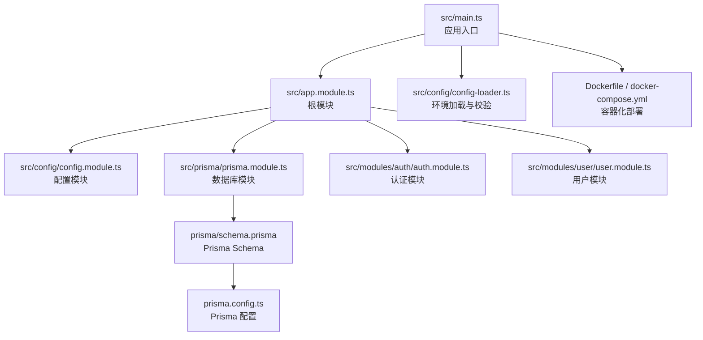
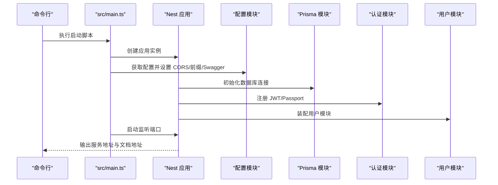
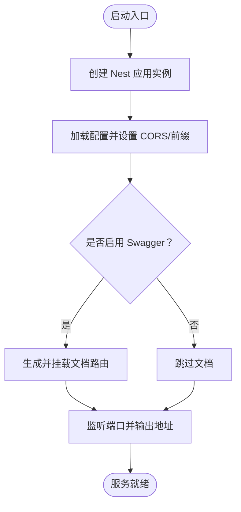
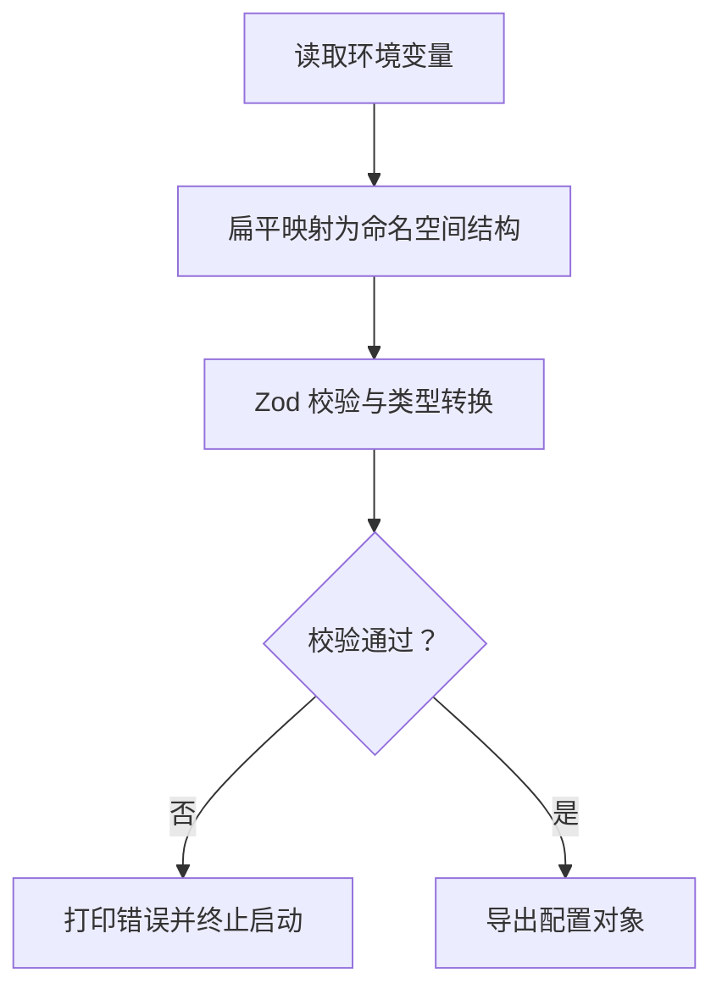
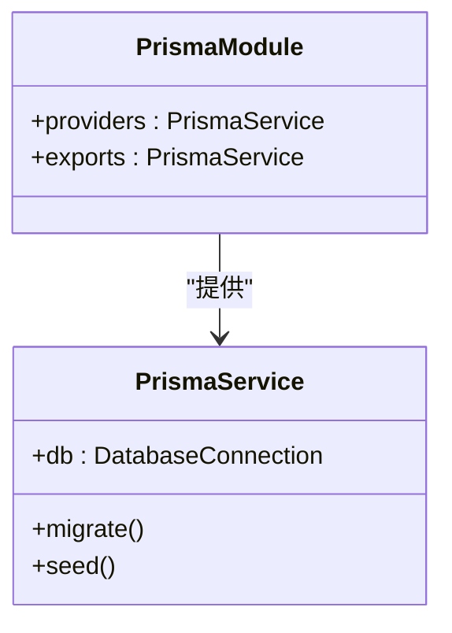
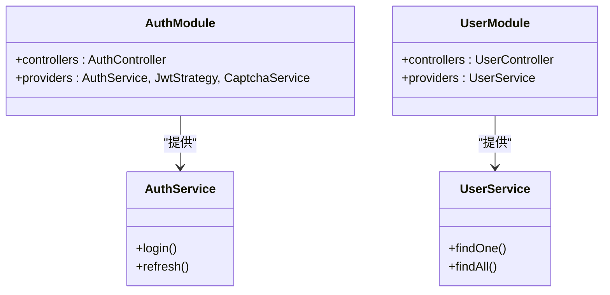
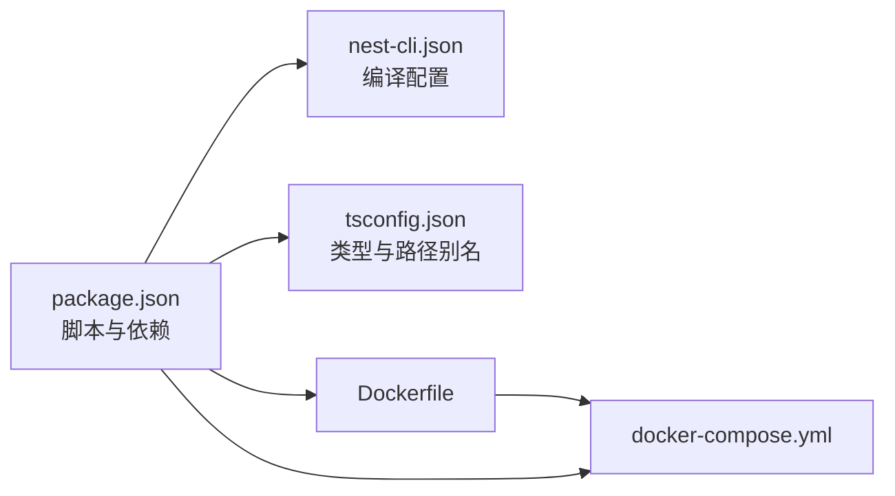

# 快速开始

<cite>
**本文引用的文件**
- [package.json](file://package.json)
- [README.md](file://README.md)
- [nest-cli.json](file://nest-cli.json)
- [Dockerfile](file://Dockerfile)
- [docker-compose.yml](file://docker-compose.yml)
- [tsconfig.json](file://tsconfig.json)
- [src/main.ts](file://src/main.ts)
- [src/app.module.ts](file://src/app.module.ts)
- [src/config/config.module.ts](file://src/config/config.module.ts)
- [src/config/config-loader.ts](file://src/config/config-loader.ts)
- [src/prisma/prisma.module.ts](file://src/prisma/prisma.module.ts)
- [prisma/schema.prisma](file://prisma/schema.prisma)
- [prisma.config.ts](file://prisma.config.ts)
- [src/modules/auth/auth.module.ts](file://src/modules/auth/auth.module.ts)
- [src/modules/user/user.module.ts](file://src/modules/user/user.module.ts)
</cite>

## 目录
1. [简介](#简介)
2. [项目结构](#项目结构)
3. [核心组件](#核心组件)
4. [架构总览](#架构总览)
5. [详细组件分析](#详细组件分析)
6. [依赖分析](#依赖分析)
7. [性能考虑](#性能考虑)
8. [故障排查指南](#故障排查指南)
9. [结论](#结论)
10. [附录](#附录)

## 简介
本指南面向首次接触该项目的开发者，帮助你在最短时间内完成环境准备、依赖安装、本地开发与生产部署，并理解项目启动流程与基本结构。你将学会：
- 如何安装与配置 Node.js、pnpm 与数据库
- 如何安装依赖、编译与运行项目
- 如何在开发、watch 与生产模式下启动服务
- 如何通过 Docker Compose 快速拉起应用与数据库
- 常见初始化问题与解决方案

## 项目结构
该项目采用 NestJS 标准目录结构，结合 Prisma ORM 与配置模块化设计，具备良好的可扩展性与可维护性。

图表来源
- [src/main.ts:1-50](file://src/main.ts#L1-L50)
- [src/app.module.ts:1-61](file://src/app.module.ts#L1-L61)
- [src/config/config.module.ts:1-20](file://src/config/config.module.ts#L1-L20)
- [src/config/config-loader.ts:1-53](file://src/config/config-loader.ts#L1-L53)
- [src/prisma/prisma.module.ts:1-10](file://src/prisma/prisma.module.ts#L1-L10)
- [src/modules/auth/auth.module.ts:1-34](file://src/modules/auth/auth.module.ts#L1-L34)
- [src/modules/user/user.module.ts:1-11](file://src/modules/user/user.module.ts#L1-L11)
- [prisma/schema.prisma:1-13](file://prisma/schema.prisma#L1-L13)
- [prisma.config.ts:1-14](file://prisma.config.ts#L1-L14)
- [Dockerfile:1-20](file://Dockerfile#L1-L20)
- [docker-compose.yml:1-37](file://docker-compose.yml#L1-L37)

章节来源
- [src/main.ts:1-50](file://src/main.ts#L1-L50)
- [src/app.module.ts:1-61](file://src/app.module.ts#L1-L61)
- [src/config/config.module.ts:1-20](file://src/config/config.module.ts#L1-L20)
- [src/prisma/prisma.module.ts:1-10](file://src/prisma/prisma.module.ts#L1-L10)
- [prisma/schema.prisma:1-13](file://prisma/schema.prisma#L1-L13)
- [prisma.config.ts:1-14](file://prisma.config.ts#L1-L14)
- [Dockerfile:1-20](file://Dockerfile#L1-L20)
- [docker-compose.yml:1-37](file://docker-compose.yml#L1-L37)

## 核心组件
- 应用入口与引导
  - 入口文件负责创建 Nest 应用实例、启用关闭钩子、设置全局前缀、CORS、Swagger 文档以及监听端口。
  - 参考路径：[src/main.ts:1-50](file://src/main.ts#L1-L50)
- 根模块与全局配置
  - 根模块集中导入配置、缓存、Prisma、健康检查、日志、认证与用户模块，并注册全局守卫、拦截器、管道与过滤器。
  - 参考路径：[src/app.module.ts:1-61](file://src/app.module.ts#L1-L61)
- 配置系统
  - 通过全局配置模块加载与校验环境变量，支持命名空间访问与类型安全读取。
  - 参考路径：[src/config/config.module.ts:1-20](file://src/config/config.module.ts#L1-L20)、[src/config/config-loader.ts:1-53](file://src/config/config-loader.ts#L1-L53)
- 数据库模块（Prisma）
  - 全局提供 PrismaService，统一数据库访问能力。
  - 参考路径：[src/prisma/prisma.module.ts:1-10](file://src/prisma/prisma.module.ts#L1-L10)
- 认证与用户模块
  - 认证模块集成 Passport/JWT，提供策略与控制器；用户模块提供用户相关服务与控制器。
  - 参考路径：[src/modules/auth/auth.module.ts:1-34](file://src/modules/auth/auth.module.ts#L1-L34)、[src/modules/user/user.module.ts:1-11](file://src/modules/user/user.module.ts#L1-L11)

章节来源
- [src/main.ts:1-50](file://src/main.ts#L1-L50)
- [src/app.module.ts:1-61](file://src/app.module.ts#L1-L61)
- [src/config/config.module.ts:1-20](file://src/config/config.module.ts#L1-L20)
- [src/config/config-loader.ts:1-53](file://src/config/config-loader.ts#L1-L53)
- [src/prisma/prisma.module.ts:1-10](file://src/prisma/prisma.module.ts#L1-L10)
- [src/modules/auth/auth.module.ts:1-34](file://src/modules/auth/auth.module.ts#L1-L34)
- [src/modules/user/user.module.ts:1-11](file://src/modules/user/user.module.ts#L1-L11)

## 架构总览
下图展示了从启动到服务可用的关键流程，包括配置加载、模块装配、中间件与文档生成等。

图表来源
- [src/main.ts:1-50](file://src/main.ts#L1-L50)
- [src/app.module.ts:1-61](file://src/app.module.ts#L1-L61)
- [src/config/config.module.ts:1-20](file://src/config/config.module.ts#L1-L20)
- [src/prisma/prisma.module.ts:1-10](file://src/prisma/prisma.module.ts#L1-L10)
- [src/modules/auth/auth.module.ts:1-34](file://src/modules/auth/auth.module.ts#L1-L34)
- [src/modules/user/user.module.ts:1-11](file://src/modules/user/user.module.ts#L1-L11)

## 详细组件分析

### 启动流程与控制流
- 入口文件负责创建应用、设置日志、CORS、全局前缀与 Swagger，并监听端口输出运行信息。
- 控制流简洁清晰，便于定位问题与扩展功能。

图表来源
- [src/main.ts:1-50](file://src/main.ts#L1-L50)

章节来源
- [src/main.ts:1-50](file://src/main.ts#L1-L50)

### 配置加载与校验
- 配置模块以“命名空间”形式组织环境变量，使用 Zod 在运行时进行严格校验与类型转换。
- 若校验失败，会打印详细错误并阻止应用启动，确保运行时稳定性。

图表来源
- [src/config/config-loader.ts:1-53](file://src/config/config-loader.ts#L1-L53)
- [src/config/config.module.ts:1-20](file://src/config/config.module.ts#L1-L20)

章节来源
- [src/config/config-loader.ts:1-53](file://src/config/config-loader.ts#L1-L53)
- [src/config/config.module.ts:1-20](file://src/config/config.module.ts#L1-L20)

### 数据库与 Prisma 集成
- Prisma 模块全局提供 PrismaService，支持迁移、种子与客户端生成。
- 项目默认使用 SQLite（可在 Prisma Schema 中调整）。

图表来源
- [src/prisma/prisma.module.ts:1-10](file://src/prisma/prisma.module.ts#L1-L10)
- [prisma/schema.prisma:1-13](file://prisma/schema.prisma#L1-L13)
- [prisma.config.ts:1-14](file://prisma.config.ts#L1-L14)

章节来源
- [src/prisma/prisma.module.ts:1-10](file://src/prisma/prisma.module.ts#L1-L10)
- [prisma/schema.prisma:1-13](file://prisma/schema.prisma#L1-L13)
- [prisma.config.ts:1-14](file://prisma.config.ts#L1-L14)

### 认证与用户模块
- 认证模块基于 Passport/JWT，动态从配置中读取密钥与过期时间，提供登录、令牌刷新与验证码等能力。
- 用户模块提供用户资源的增删改查接口与业务逻辑。

图表来源
- [src/modules/auth/auth.module.ts:1-34](file://src/modules/auth/auth.module.ts#L1-L34)
- [src/modules/user/user.module.ts:1-11](file://src/modules/user/user.module.ts#L1-L11)

章节来源
- [src/modules/auth/auth.module.ts:1-34](file://src/modules/auth/auth.module.ts#L1-L34)
- [src/modules/user/user.module.ts:1-11](file://src/modules/user/user.module.ts#L1-L11)

## 依赖分析
- 包管理与构建
  - 使用 pnpm 管理依赖，Nest CLI 提供编译与启动脚本。
  - 参考路径：[package.json:1-88](file://package.json#L1-L88)、[nest-cli.json:1-9](file://nest-cli.json#L1-L9)
- 类型与工具链
  - TypeScript 配置启用严格模式与路径别名，便于模块化开发。
  - 参考路径：[tsconfig.json:1-36](file://tsconfig.json#L1-L36)
- 容器化与部署
  - Dockerfile 分阶段构建，先安装依赖与编译，再复制产物至运行时镜像；docker-compose 提供应用与数据库服务编排。
  - 参考路径：[Dockerfile:1-20](file://Dockerfile#L1-L20)、[docker-compose.yml:1-37](file://docker-compose.yml#L1-L37)

图表来源
- [package.json:1-88](file://package.json#L1-L88)
- [nest-cli.json:1-9](file://nest-cli.json#L1-L9)
- [tsconfig.json:1-36](file://tsconfig.json#L1-L36)
- [Dockerfile:1-20](file://Dockerfile#L1-L20)
- [docker-compose.yml:1-37](file://docker-compose.yml#L1-L37)

章节来源
- [package.json:1-88](file://package.json#L1-L88)
- [nest-cli.json:1-9](file://nest-cli.json#L1-L9)
- [tsconfig.json:1-36](file://tsconfig.json#L1-L36)
- [Dockerfile:1-20](file://Dockerfile#L1-L20)
- [docker-compose.yml:1-37](file://docker-compose.yml#L1-L37)

## 性能考虑
- 开发模式建议使用 watch 模式以提升迭代效率。
- 生产环境建议使用预编译后的 dist 目录与只读依赖，减少启动时间与内存占用。
- 合理设置限流策略与日志级别，避免在高并发场景下产生性能瓶颈。
- 使用 Docker 多阶段构建，减小镜像体积并提升部署效率。

## 故障排查指南
- 环境变量校验失败导致启动中断
  - 症状：启动时报错并终止。
  - 排查：检查配置加载逻辑与命名空间字段，确认所有必需项已正确设置。
  - 参考路径：[src/config/config-loader.ts:1-53](file://src/config/config-loader.ts#L1-L53)
- 数据库连接异常
  - 症状：应用启动后无法连接数据库或迁移失败。
  - 排查：确认 Prisma Schema 的 provider 与 DATABASE_URL，必要时切换为 PostgreSQL 并更新 docker-compose。
  - 参考路径：[prisma/schema.prisma:1-13](file://prisma/schema.prisma#L1-L13)、[docker-compose.yml:1-37](file://docker-compose.yml#L1-L37)
- Swagger 文档不可用
  - 症状：访问文档路由返回 404 或无内容。
  - 排查：确认启用 Swagger 的环境变量与全局前缀设置一致。
  - 参考路径：[src/main.ts:1-50](file://src/main.ts#L1-L50)
- 端口被占用
  - 症状：启动监听失败。
  - 排查：修改端口或释放占用端口。
  - 参考路径：[src/main.ts:1-50](file://src/main.ts#L1-L50)
- Docker 构建失败
  - 症状：构建阶段安装依赖或编译失败。
  - 排查：确认网络连通性、pnpm 锁文件与 Node 版本匹配。
  - 参考路径：[Dockerfile:1-20](file://Dockerfile#L1-L20)

章节来源
- [src/config/config-loader.ts:1-53](file://src/config/config-loader.ts#L1-L53)
- [prisma/schema.prisma:1-13](file://prisma/schema.prisma#L1-L13)
- [docker-compose.yml:1-37](file://docker-compose.yml#L1-L37)
- [src/main.ts:1-50](file://src/main.ts#L1-L50)
- [Dockerfile:1-20](file://Dockerfile#L1-L20)

## 结论
通过本指南，你可以：
- 在本地快速安装并运行项目，掌握开发、watch 与生产三种启动模式
- 理解配置加载、模块装配与数据库集成的工作原理
- 使用 Docker Compose 一键拉起应用与数据库
- 面对常见问题时具备定位与解决能力

## 附录

### 环境要求
- Node.js 与 pnpm
  - 使用 pnpm 作为包管理器，确保版本兼容。
  - 参考路径：[package.json:1-88](file://package.json#L1-L88)
- 数据库
  - 默认使用 SQLite，可在 Prisma Schema 中切换为 PostgreSQL。
  - 参考路径：[prisma/schema.prisma:1-13](file://prisma/schema.prisma#L1-L13)

### 依赖安装
- 安装依赖
  - 使用 pnpm 安装项目依赖。
  - 参考路径：[README.md:28-34](file://README.md#L28-L34)、[package.json:1-88](file://package.json#L1-L88)

### 本地开发环境配置
- 环境变量
  - 在开发环境中，配置模块默认忽略 .env 文件，建议通过进程环境变量传入。
  - 参考路径：[src/config/config.module.ts:1-20](file://src/config/config.module.ts#L1-L20)
- TypeScript 路径别名
  - 通过 tsconfig.json 设置路径别名，便于模块导入。
  - 参考路径：[tsconfig.json:1-36](file://tsconfig.json#L1-L36)

### 项目启动步骤
- 开发模式
  - 启动应用并在代码变更时自动重启。
  - 参考路径：[README.md:34-45](file://README.md#L34-L45)、[package.json:1-88](file://package.json#L1-L88)
- Watch 模式
  - 同开发模式，但更强调增量编译与热重载体验。
  - 参考路径：[README.md:34-45](file://README.md#L34-L45)、[package.json:1-88](file://package.json#L1-L88)
- 生产模式
  - 编译后运行 dist/main，适用于生产部署。
  - 参考路径：[README.md:34-45](file://README.md#L34-L45)、[package.json:1-88](file://package.json#L1-L88)

### 基本使用示例
- 访问 Swagger 文档
  - 启用 Swagger 后，访问全局前缀下的文档路由查看接口说明。
  - 参考路径：[src/main.ts:1-50](file://src/main.ts#L1-L50)
- 认证与用户接口
  - 认证模块提供登录与令牌刷新；用户模块提供用户资源接口。
  - 参考路径：[src/modules/auth/auth.module.ts:1-34](file://src/modules/auth/auth.module.ts#L1-L34)、[src/modules/user/user.module.ts:1-11](file://src/modules/user/user.module.ts#L1-L11)

### 常见初始配置问题与解决方案
- 环境变量缺失或格式不正确
  - 症状：启动时报错并终止。
  - 解决：根据配置加载逻辑补齐必填项，确保类型与命名空间一致。
  - 参考路径：[src/config/config-loader.ts:1-53](file://src/config/config-loader.ts#L1-L53)
- 数据库未初始化
  - 症状：应用启动后出现数据库相关错误。
  - 解决：执行 Prisma 迁移与种子脚本，或在 docker-compose 中启用数据库服务。
  - 参考路径：[prisma/schema.prisma:1-13](file://prisma/schema.prisma#L1-L13)、[prisma.config.ts:1-14](file://prisma.config.ts#L1-L14)、[docker-compose.yml:1-37](file://docker-compose.yml#L1-L37)
- 端口冲突
  - 症状：监听端口失败。
  - 解决：修改端口或释放占用端口。
  - 参考路径：[src/main.ts:1-50](file://src/main.ts#L1-L50)