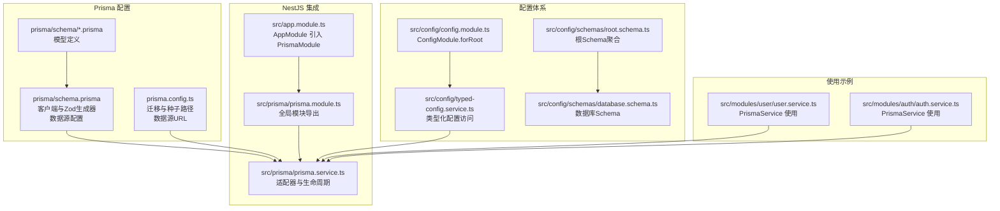
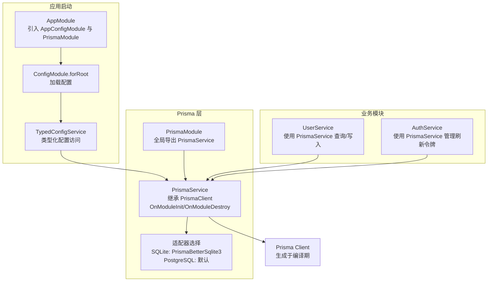
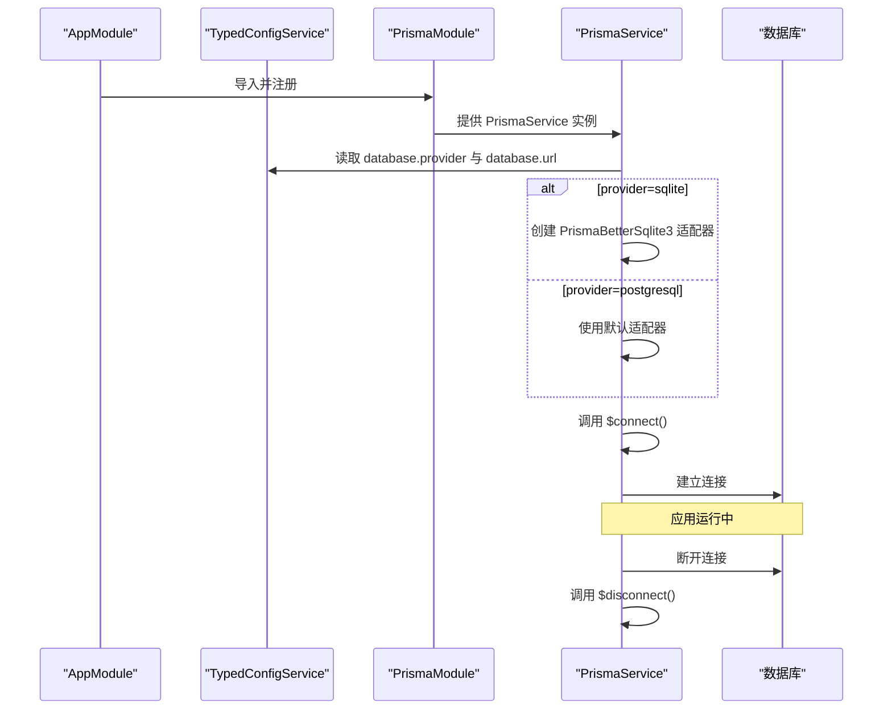
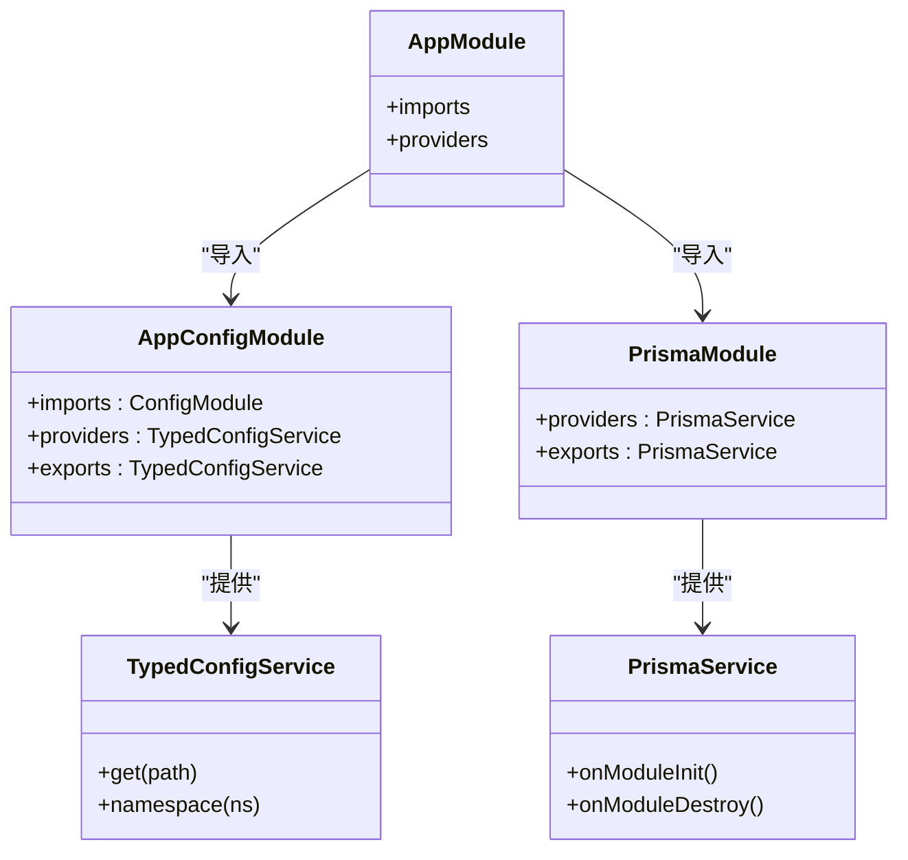
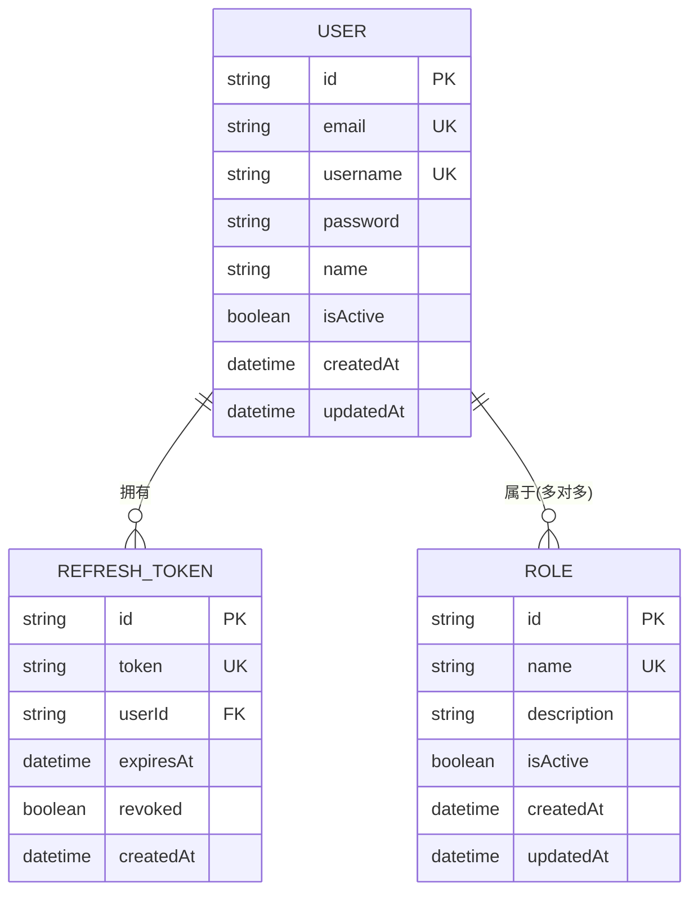
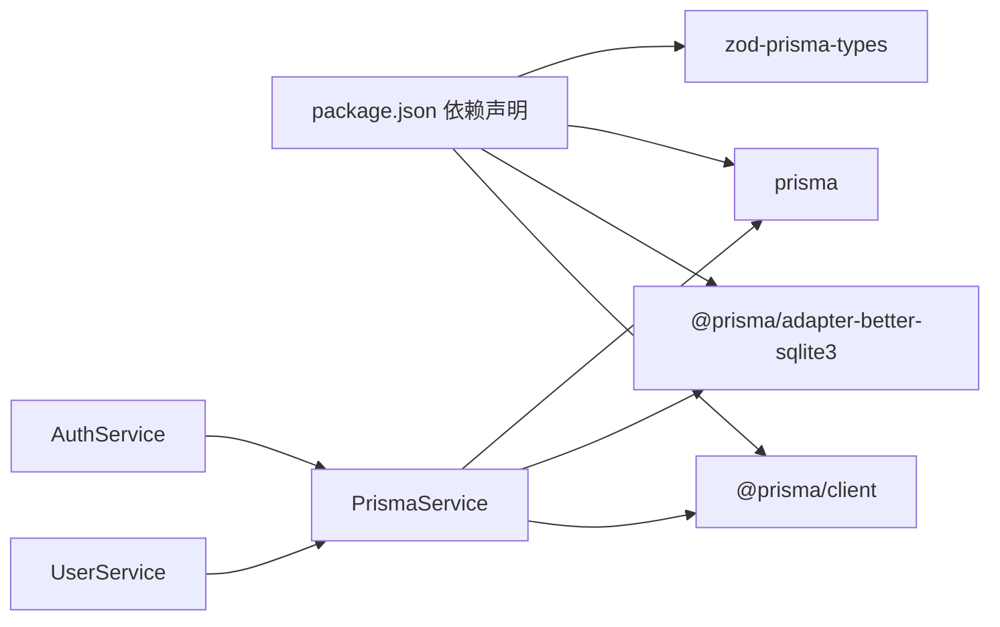

# Prisma ORM 配置

<cite>
**本文引用的文件**
- [prisma/schema.prisma](file://prisma/schema.prisma)
- [prisma.config.ts](file://prisma.config.ts)
- [src/prisma/prisma.service.ts](file://src/prisma/prisma.service.ts)
- [src/prisma/prisma.module.ts](file://src/prisma/prisma.module.ts)
- [src/config/config.module.ts](file://src/config/config.module.ts)
- [src/config/typed-config.service.ts](file://src/config/typed-config.service.ts)
- [src/config/schemas/database.schema.ts](file://src/config/schemas/database.schema.ts)
- [src/config/schemas/root.schema.ts](file://src/config/schemas/root.schema.ts)
- [src/app.module.ts](file://src/app.module.ts)
- [src/modules/user/user.service.ts](file://src/modules/user/user.service.ts)
- [src/modules/auth/auth.service.ts](file://src/modules/auth/auth.service.ts)
- [prisma/schema/User.prisma](file://prisma/schema/User.prisma)
- [prisma/schema/Role.prisma](file://prisma/schema/Role.prisma)
- [prisma/schema/RefreshToken.prisma](file://prisma/schema/RefreshToken.prisma)
- [prisma/seed.ts](file://prisma/seed.ts)
- [package.json](file://package.json)
</cite>

## 目录
1. [简介](#简介)
2. [项目结构](#项目结构)
3. [核心组件](#核心组件)
4. [架构总览](#架构总览)
5. [详细组件分析](#详细组件分析)
6. [依赖关系分析](#依赖关系分析)
7. [性能考虑](#性能考虑)
8. [故障排查指南](#故障排查指南)
9. [结论](#结论)
10. [附录](#附录)

## 简介
本文件系统性梳理了本项目中 Prisma ORM 的配置与集成方式，涵盖以下主题：
- Prisma 客户端生成器与 Zod 类型生成器配置
- 数据源配置与适配器选择（SQLite 与 PostgreSQL）
- Prisma 服务初始化流程、连接管理与依赖注入
- SQLite 数据库配置、连接池与性能优化参数
- Prisma 客户端在业务模块中的使用示例与最佳实践
- Prisma 与 NestJS 框架的模块化集成与依赖注入

## 项目结构
围绕 Prisma 的关键文件分布如下：
- Prisma 配置与模式：prisma/schema.prisma、prisma.config.ts、prisma/schema/*.prisma
- NestJS 集成：src/prisma/prisma.module.ts、src/prisma/prisma.service.ts
- 配置体系：src/config/config.module.ts、src/config/typed-config.service.ts、src/config/schemas/*.schema.ts
- 使用示例：src/modules/user/user.service.ts、src/modules/auth/auth.service.ts
- 种子数据：prisma/seed.ts
- 依赖声明：package.json

图表来源
- [prisma/schema.prisma:1-13](file://prisma/schema.prisma#L1-L13)
- [prisma.config.ts:1-14](file://prisma.config.ts#L1-L14)
- [src/prisma/prisma.module.ts:1-10](file://src/prisma/prisma.module.ts#L1-L10)
- [src/prisma/prisma.service.ts:1-44](file://src/prisma/prisma.service.ts#L1-L44)
- [src/config/config.module.ts:1-20](file://src/config/config.module.ts#L1-L20)
- [src/config/typed-config.service.ts:1-48](file://src/config/typed-config.service.ts#L1-L48)
- [src/config/schemas/root.schema.ts:1-21](file://src/config/schemas/root.schema.ts#L1-L21)
- [src/config/schemas/database.schema.ts:1-11](file://src/config/schemas/database.schema.ts#L1-L11)
- [src/app.module.ts:1-61](file://src/app.module.ts#L1-L61)
- [src/modules/user/user.service.ts:1-125](file://src/modules/user/user.service.ts#L1-L125)
- [src/modules/auth/auth.service.ts:1-162](file://src/modules/auth/auth.service.ts#L1-L162)

章节来源
- [prisma/schema.prisma:1-13](file://prisma/schema.prisma#L1-L13)
- [prisma.config.ts:1-14](file://prisma.config.ts#L1-L14)
- [src/prisma/prisma.module.ts:1-10](file://src/prisma/prisma.module.ts#L1-L10)
- [src/prisma/prisma.service.ts:1-44](file://src/prisma/prisma.service.ts#L1-L44)
- [src/config/config.module.ts:1-20](file://src/config/config.module.ts#L1-L20)
- [src/config/typed-config.service.ts:1-48](file://src/config/typed-config.service.ts#L1-L48)
- [src/config/schemas/root.schema.ts:1-21](file://src/config/schemas/root.schema.ts#L1-L21)
- [src/config/schemas/database.schema.ts:1-11](file://src/config/schemas/database.schema.ts#L1-L11)
- [src/app.module.ts:1-61](file://src/app.module.ts#L1-L61)

## 核心组件
- 生成器配置
  - 客户端生成器：用于生成 Prisma 客户端代码，供应用层调用。
  - Zod 类型生成器：用于生成与 Prisma 模型对应的 Zod 校验类型，便于 DTO 层校验与序列化。
- 数据源配置
  - 数据源提供者：当前默认为 sqlite；通过环境变量 DATABASE_URL 动态指定数据源 URL。
- 适配器与运行时选择
  - SQLite：使用 @prisma/adapter-better-sqlite3，支持本地开发与测试场景。
  - PostgreSQL：通过 prisma.config.ts 的 datasource.url 从环境变量读取，无需在代码中显式传入 datasources。
- 生命周期与连接管理
  - 在模块初始化阶段建立连接，在模块销毁阶段断开连接，确保资源释放。

章节来源
- [prisma/schema.prisma:1-13](file://prisma/schema.prisma#L1-L13)
- [prisma.config.ts:1-14](file://prisma.config.ts#L1-L14)
- [src/prisma/prisma.service.ts:1-44](file://src/prisma/prisma.service.ts#L1-L44)

## 架构总览
下图展示了 Prisma 在 NestJS 中的集成架构与数据流：

图表来源
- [src/app.module.ts:1-61](file://src/app.module.ts#L1-L61)
- [src/config/config.module.ts:1-20](file://src/config/config.module.ts#L1-L20)
- [src/config/typed-config.service.ts:1-48](file://src/config/typed-config.service.ts#L1-L48)
- [src/prisma/prisma.module.ts:1-10](file://src/prisma/prisma.module.ts#L1-L10)
- [src/prisma/prisma.service.ts:1-44](file://src/prisma/prisma.service.ts#L1-L44)
- [src/modules/user/user.service.ts:1-125](file://src/modules/user/user.service.ts#L1-L125)
- [src/modules/auth/auth.service.ts:1-162](file://src/modules/auth/auth.service.ts#L1-L162)

## 详细组件分析

### 生成器与数据源配置
- 客户端生成器
  - 作用：生成 TypeScript 客户端 API，提供类型安全的查询与变更能力。
  - 配置位置：prisma/schema.prisma 的 generator client。
- Zod 类型生成器
  - 作用：基于 Prisma 模型生成 Zod 校验类型，便于在 DTO 层进行输入输出校验。
  - 输出目录：src/generated/zod（由生成器配置指定）。
- 数据源配置
  - 提供者：sqlite 或 postgresql（通过环境变量切换）。
  - URL 来源：优先使用环境变量 DATABASE_URL；若为空则使用默认 SQLite 文件路径。

章节来源
- [prisma/schema.prisma:1-13](file://prisma/schema.prisma#L1-L13)
- [prisma.config.ts:1-14](file://prisma.config.ts#L1-L14)

### Prisma 服务初始化与连接管理
- 初始化流程
  - 读取配置：通过 TypedConfigService 获取 database.provider 与 database.url。
  - 适配器选择：当 provider 为 sqlite 时，使用 PrismaBetterSqlite3 并传入 url；否则使用默认适配器。
  - 生命周期钩子：实现 OnModuleInit 与 OnModuleDestroy，分别在模块初始化时连接数据库、销毁时断开连接。
- 连接管理
  - $connect 与 $disconnect：确保连接在应用生命周期内正确建立与释放。
  - 日志记录：构造函数中记录当前数据库提供者，便于诊断。

图表来源
- [src/app.module.ts:1-61](file://src/app.module.ts#L1-L61)
- [src/config/typed-config.service.ts:1-48](file://src/config/typed-config.service.ts#L1-L48)
- [src/prisma/prisma.module.ts:1-10](file://src/prisma/prisma.module.ts#L1-L10)
- [src/prisma/prisma.service.ts:1-44](file://src/prisma/prisma.service.ts#L1-L44)

章节来源
- [src/prisma/prisma.service.ts:1-44](file://src/prisma/prisma.service.ts#L1-L44)
- [src/config/typed-config.service.ts:1-48](file://src/config/typed-config.service.ts#L1-L48)

### 依赖注入与模块化架构
- 全局模块
  - PrismaModule 使用 @Global() 全局注册，导出 PrismaService，使任意模块可直接注入使用。
- 配置模块
  - AppConfigModule 以全局方式导入 @nestjs/config，并通过 loadConfig 加载配置。
  - TypedConfigService 提供类型化的配置访问方法，支持点语法路径访问与命名空间对象获取。
- AppModule 集成
  - AppModule 引入 AppConfigModule 与 PrismaModule，统一装配应用所需的服务与模块。

图表来源
- [src/app.module.ts:1-61](file://src/app.module.ts#L1-L61)
- [src/config/config.module.ts:1-20](file://src/config/config.module.ts#L1-L20)
- [src/config/typed-config.service.ts:1-48](file://src/config/typed-config.service.ts#L1-L48)
- [src/prisma/prisma.module.ts:1-10](file://src/prisma/prisma.module.ts#L1-L10)
- [src/prisma/prisma.service.ts:1-44](file://src/prisma/prisma.service.ts#L1-L44)

章节来源
- [src/app.module.ts:1-61](file://src/app.module.ts#L1-L61)
- [src/config/config.module.ts:1-20](file://src/config/config.module.ts#L1-L20)
- [src/prisma/prisma.module.ts:1-10](file://src/prisma/prisma.module.ts#L1-L10)

### SQLite 数据库配置、连接池与性能优化
- 数据库提供者与 URL
  - 提供者：sqlite
  - URL：优先从环境变量 DATABASE_URL 读取；若未设置，则使用默认 SQLite 文件路径。
- 连接池与性能参数
  - 当前实现使用 PrismaBetterSqlite3 适配器，默认连接池参数由适配器决定。
  - 可通过环境变量 DATABASE_URL 传入 SQLite 特定参数（如只读、内存数据库等），以满足不同场景需求。
- 最佳实践
  - 开发环境建议使用文件数据库，便于持久化与调试。
  - 生产环境建议切换至 PostgreSQL，并通过 prisma.config.ts 的 datasource.url 统一管理。

章节来源
- [prisma/schema.prisma:10-12](file://prisma/schema.prisma#L10-L12)
- [prisma.config.ts:10-12](file://prisma.config.ts#L10-L12)
- [src/prisma/prisma.service.ts:18-34](file://src/prisma/prisma.service.ts#L18-L34)

### Prisma 客户端使用示例与最佳实践
- 基础 CRUD 示例
  - 用户模块：UserService 展示了查询、创建、更新、删除等操作，均通过 PrismaService 访问数据库。
  - 关注点分离：业务逻辑集中在服务层，数据访问集中在 PrismaService。
- 刷新令牌管理
  - AuthService 展示了如何使用 PrismaService 管理刷新令牌的创建、查询与撤销，体现事务性与一致性要求。
- 最佳实践
  - 明确的查询范围：使用 select 精简字段，减少网络传输与序列化开销。
  - 错误处理：结合业务异常与 DTO 校验，确保错误信息一致且可追踪。
  - 事务与并发：在需要强一致性的场景，结合 Prisma 的事务能力与连接池参数进行优化。

章节来源
- [src/modules/user/user.service.ts:1-125](file://src/modules/user/user.service.ts#L1-L125)
- [src/modules/auth/auth.service.ts:1-162](file://src/modules/auth/auth.service.ts#L1-L162)

### 模型与关系映射
- 用户与角色多对多关系
  - User 与 Role 通过中间关系名进行关联，映射到实际表结构。
- 刷新令牌模型
  - RefreshToken 与 User 一对一关联，包含过期时间与撤销状态，支持安全的令牌管理。

图表来源
- [prisma/schema/User.prisma:1-15](file://prisma/schema/User.prisma#L1-L15)
- [prisma/schema/Role.prisma:1-13](file://prisma/schema/Role.prisma#L1-L13)
- [prisma/schema/RefreshToken.prisma:1-12](file://prisma/schema/RefreshToken.prisma#L1-L12)

章节来源
- [prisma/schema/User.prisma:1-15](file://prisma/schema/User.prisma#L1-L15)
- [prisma/schema/Role.prisma:1-13](file://prisma/schema/Role.prisma#L1-L13)
- [prisma/schema/RefreshToken.prisma:1-12](file://prisma/schema/RefreshToken.prisma#L1-L12)

## 依赖关系分析
- 外部依赖
  - @prisma/client：Prisma 客户端
  - @prisma/adapter-better-sqlite3：SQLite 适配器
  - prisma：Prisma CLI 与配置工具
  - zod-prisma-types：Zod 类型生成器
- 内部依赖
  - PrismaService 依赖 TypedConfigService 获取数据库配置
  - 业务服务（UserService、AuthService）依赖 PrismaService 执行数据操作

图表来源
- [package.json:26-86](file://package.json#L26-L86)
- [src/prisma/prisma.service.ts:1-44](file://src/prisma/prisma.service.ts#L1-L44)
- [src/modules/user/user.service.ts:1-125](file://src/modules/user/user.service.ts#L1-L125)
- [src/modules/auth/auth.service.ts:1-162](file://src/modules/auth/auth.service.ts#L1-L162)

章节来源
- [package.json:26-86](file://package.json#L26-L86)
- [src/prisma/prisma.service.ts:1-44](file://src/prisma/prisma.service.ts#L1-L44)

## 性能考虑
- 连接池参数
  - SQLite：当前通过适配器默认行为管理连接；可通过调整 DATABASE_URL 参数或在更高层进行连接复用策略优化。
  - PostgreSQL：通过 prisma.config.ts 的 datasource.url 统一管理，可在生产环境配合数据库侧连接池参数进行调优。
- 查询优化
  - 使用 select 精简字段，避免一次性返回大对象。
  - 合理使用索引与唯一约束，降低查询成本。
- 缓存与日志
  - 可结合应用缓存模块与日志模块，对高频查询结果进行缓存与审计。

## 故障排查指南
- 配置缺失
  - 若根配置缺失，TypedConfigService 将记录错误并终止进程，需检查配置加载是否正确。
- 数据库连接失败
  - 检查 DATABASE_URL 是否有效；SQLite 场景下确认文件路径存在且具备读写权限。
- 生成器未生效
  - 确认已执行 Prisma 命令生成客户端与 Zod 类型，并检查输出目录是否存在。
- 迁移与种子
  - prisma.config.ts 已配置迁移与种子脚本，确保执行迁移命令后数据库结构与初始数据可用。

章节来源
- [src/config/typed-config.service.ts:14-18](file://src/config/typed-config.service.ts#L14-L18)
- [prisma.config.ts:6-12](file://prisma.config.ts#L6-L12)
- [prisma/seed.ts:1-41](file://prisma/seed.ts#L1-L41)

## 结论
本项目采用 Prisma 作为 ORM，结合 NestJS 的模块化与依赖注入机制，实现了：
- 清晰的生成器与数据源配置
- 类型安全的客户端与 Zod 校验类型
- 可扩展的适配器与生命周期管理
- 与业务模块的解耦与高内聚
在 SQLite 与 PostgreSQL 之间灵活切换，并通过配置与适配器实现稳定的连接管理与性能优化。

## 附录
- 配置 Schema
  - 根 Schema 聚合了 app、database、jwt、logger 等命名空间，便于集中管理。
  - DatabaseSchema 定义了 provider、url、maxConnections、logging 等关键参数。
- 种子数据
  - seed.ts 使用与应用相同的适配器与 URL，演示了如何在开发环境中快速初始化数据。

章节来源
- [src/config/schemas/root.schema.ts:1-21](file://src/config/schemas/root.schema.ts#L1-L21)
- [src/config/schemas/database.schema.ts:1-11](file://src/config/schemas/database.schema.ts#L1-L11)
- [prisma/seed.ts:1-41](file://prisma/seed.ts#L1-L41)