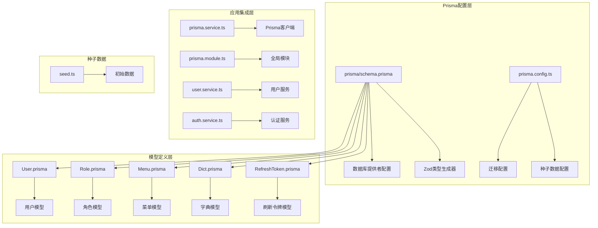
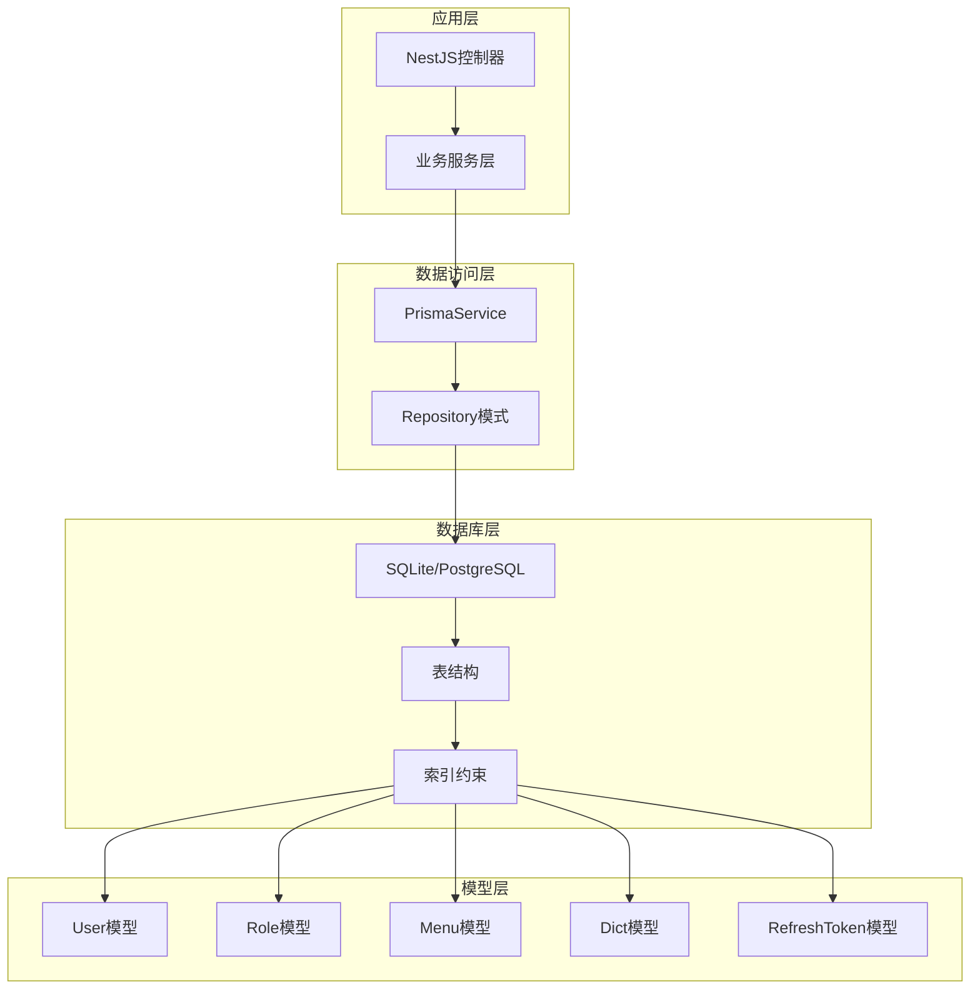
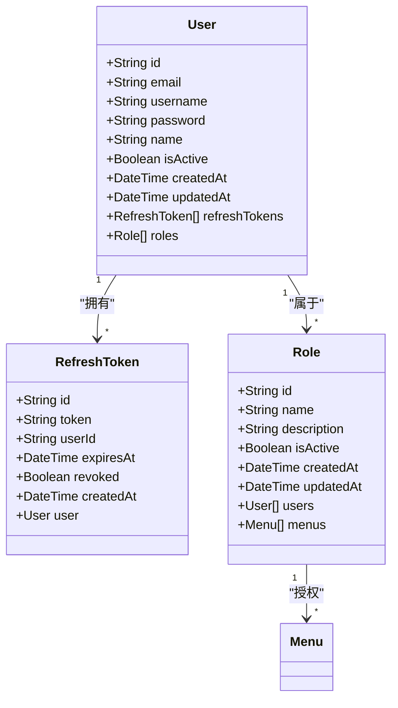
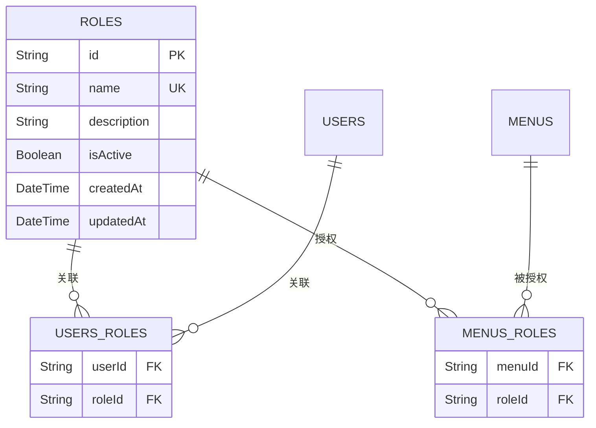
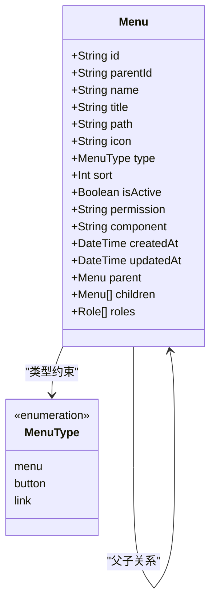
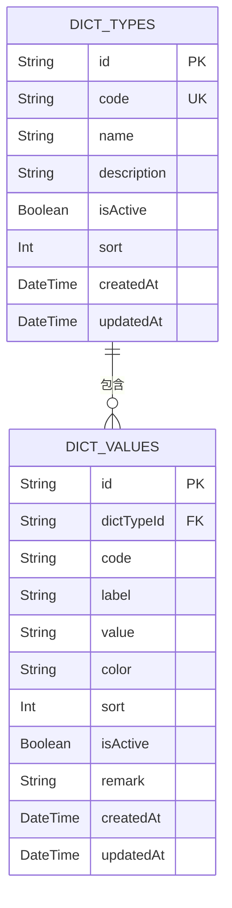
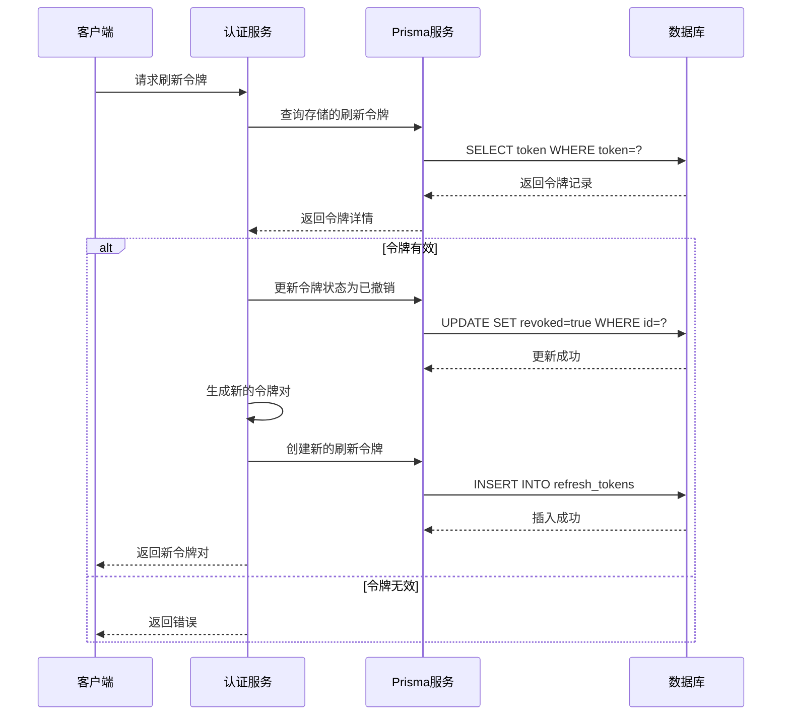
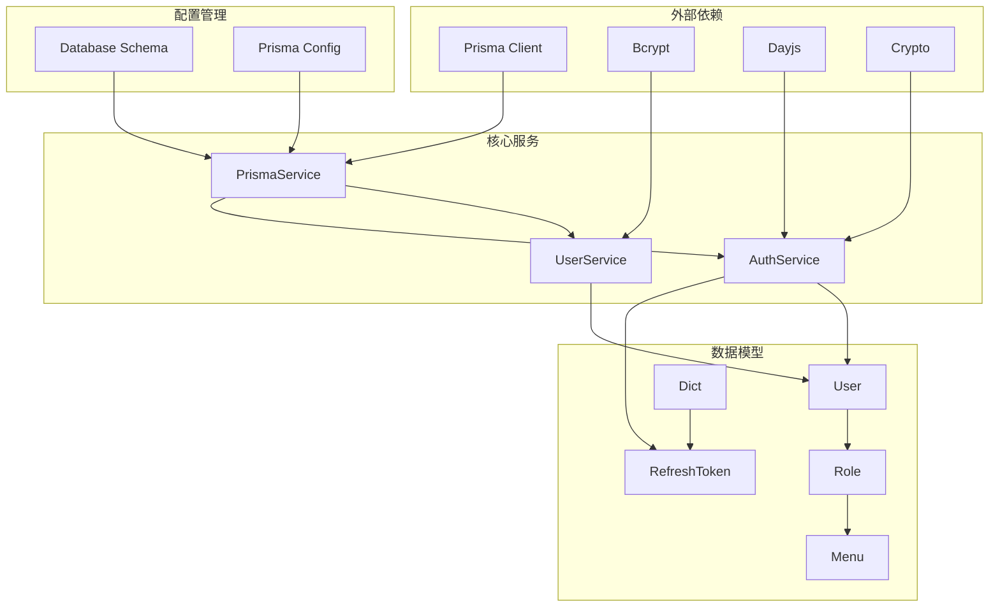

# 数据库架构

<cite>
**本文档引用的文件**
- [prisma/schema.prisma](file://prisma/schema.prisma)
- [prisma/schema/User.prisma](file://prisma/schema/User.prisma)
- [prisma/schema/Role.prisma](file://prisma/schema/Role.prisma)
- [prisma/schema/Menu.prisma](file://prisma/schema/Menu.prisma)
- [prisma/schema/Dict.prisma](file://prisma/schema/Dict.prisma)
- [prisma/schema/RefreshToken.prisma](file://prisma/schema/RefreshToken.prisma)
- [prisma/seed.ts](file://prisma/seed.ts)
- [prisma.config.ts](file://prisma.config.ts)
- [src/prisma/prisma.service.ts](file://src/prisma/prisma.service.ts)
- [src/prisma/prisma.module.ts](file://src/prisma/prisma.module.ts)
- [src/modules/user/user.service.ts](file://src/modules/user/user.service.ts)
- [src/modules/auth/auth.service.ts](file://src/modules/auth/auth.service.ts)
- [src/config/schemas/database.schema.ts](file://src/config/schemas/database.schema.ts)
</cite>

## 目录
1. [简介](#简介)
2. [项目结构](#项目结构)
3. [核心组件](#核心组件)
4. [架构概览](#架构概览)
5. [详细组件分析](#详细组件分析)
6. [依赖关系分析](#依赖关系分析)
7. [性能考虑](#性能考虑)
8. [故障排除指南](#故障排除指南)
9. [结论](#结论)

## 简介

本项目采用Prisma ORM框架构建数据库层，基于SQLite作为默认数据库提供者，支持PostgreSQL作为可选的生产环境数据库。系统实现了完整的用户认证授权体系，包含用户管理、角色权限控制、菜单管理和字典数据管理等核心功能模块。

数据库架构采用现代化的设计模式，通过Prisma的强类型ORM特性确保数据访问的安全性和可靠性。系统支持多种数据库提供者，具备良好的扩展性和可维护性。

## 项目结构

项目的数据库相关文件主要分布在以下目录结构中：

**图表来源**
- [prisma/schema.prisma:1-13](file://prisma/schema.prisma#L1-L13)
- [prisma.config.ts:1-14](file://prisma.config.ts#L1-L14)
- [prisma/seed.ts:1-41](file://prisma/seed.ts#L1-L41)

**章节来源**
- [prisma/schema.prisma:1-13](file://prisma/schema.prisma#L1-L13)
- [prisma.config.ts:1-14](file://prisma.config.ts#L1-L14)

## 核心组件

### 数据库提供者配置

系统支持两种数据库提供者：
- **SQLite**: 默认开发环境，使用better-sqlite3适配器
- **PostgreSQL**: 生产环境推荐，通过环境变量配置

### Prisma客户端配置

Prisma客户端通过全局模块注入，支持动态数据库提供者选择和连接管理。

**章节来源**
- [src/prisma/prisma.service.ts:1-44](file://src/prisma/prisma.service.ts#L1-L44)
- [src/prisma/prisma.module.ts:1-10](file://src/prisma/prisma.module.ts#L1-L10)
- [src/config/schemas/database.schema.ts:1-11](file://src/config/schemas/database.schema.ts#L1-L11)

## 架构概览

系统采用分层架构设计，数据库层通过Prisma ORM提供统一的数据访问接口：

**图表来源**
- [src/prisma/prisma.service.ts:11-34](file://src/prisma/prisma.service.ts#L11-L34)
- [src/modules/user/user.service.ts:1-125](file://src/modules/user/user.service.ts#L1-L125)
- [src/modules/auth/auth.service.ts:1-162](file://src/modules/auth/auth.service.ts#L1-L162)

## 详细组件分析

### 用户模型 (User)

用户模型是系统的核心实体，负责存储用户基本信息和认证凭据：

**图表来源**
- [prisma/schema/User.prisma:1-15](file://prisma/schema/User.prisma#L1-L15)
- [prisma/schema/RefreshToken.prisma:1-12](file://prisma/schema/RefreshToken.prisma#L1-L12)
- [prisma/schema/Role.prisma:1-13](file://prisma/schema/Role.prisma#L1-L13)

用户模型的关键特性：
- **唯一标识**: 使用UUID作为主键
- **唯一约束**: email和username字段具有唯一性约束
- **状态管理**: isActive字段控制用户启用状态
- **时间戳**: 自动管理创建和更新时间
- **关系映射**: 支持多对多关系到Role模型

**章节来源**
- [prisma/schema/User.prisma:1-15](file://prisma/schema/User.prisma#L1-L15)

### 角色模型 (Role)

角色模型实现基于角色的访问控制(RBAC)机制：

**图表来源**
- [prisma/schema/Role.prisma:1-13](file://prisma/schema/Role.prisma#L1-L13)
- [prisma/schema/Menu.prisma:1-28](file://prisma/schema/Menu.prisma#L1-L28)

角色模型的实现特点：
- **多对多关系**: 与User和Menu模型建立多对多关联
- **权限控制**: 通过角色-菜单关联实现细粒度权限控制
- **激活状态**: 支持角色的启用/禁用管理

**章节来源**
- [prisma/schema/Role.prisma:1-13](file://prisma/schema/Role.prisma#L1-L13)

### 菜单模型 (Menu)

菜单模型支持复杂的层级结构和权限控制：

**图表来源**
- [prisma/schema/Menu.prisma:1-28](file://prisma/schema/Menu.prisma#L1-L28)

菜单模型的复杂特性：
- **自关联**: 通过parentId实现树形层级结构
- **类型枚举**: 支持菜单、按钮、链接三种类型
- **权限标识**: permission字段支持细粒度权限控制
- **索引优化**: 为parentId字段建立索引提升查询性能

**章节来源**
- [prisma/schema/Menu.prisma:1-28](file://prisma/schema/Menu.prisma#L1-L28)

### 字典模型 (Dict)

字典模型提供灵活的数据字典管理功能：

**图表来源**
- [prisma/schema/Dict.prisma:1-34](file://prisma/schema/Dict.prisma#L1-L34)

字典模型的设计优势：
- **父子关系**: 类型-值的层次化组织
- **唯一约束**: dictTypeId+code的复合唯一性
- **排序支持**: 支持字典项的排序显示
- **颜色标记**: 支持视觉化的颜色标识

**章节来源**
- [prisma/schema/Dict.prisma:1-34](file://prisma/schema/Dict.prisma#L1-L34)

### 刷新令牌模型 (RefreshToken)

刷新令牌模型实现安全的令牌管理机制：

**图表来源**
- [src/modules/auth/auth.service.ts:72-96](file://src/modules/auth/auth.service.ts#L72-L96)
- [prisma/schema/RefreshToken.prisma:1-12](file://prisma/schema/RefreshToken.prisma#L1-L12)

**章节来源**
- [prisma/schema/RefreshToken.prisma:1-12](file://prisma/schema/RefreshToken.prisma#L1-L12)
- [src/modules/auth/auth.service.ts:72-96](file://src/modules/auth/auth.service.ts#L72-L96)

## 依赖关系分析

系统中的数据库依赖关系呈现清晰的层次结构：

**图表来源**
- [src/prisma/prisma.service.ts:1-44](file://src/prisma/prisma.service.ts#L1-L44)
- [src/modules/user/user.service.ts:1-125](file://src/modules/user/user.service.ts#L1-L125)
- [src/modules/auth/auth.service.ts:1-162](file://src/modules/auth/auth.service.ts#L1-L162)
- [src/config/schemas/database.schema.ts:1-11](file://src/config/schemas/database.schema.ts#L1-L11)

### 关系映射分析

系统实现了以下主要关系映射：

1. **一对一关系**: User-RefreshToken (一个用户对应多个刷新令牌)
2. **一对多关系**: 
   - User-Role (一个用户可以有多个角色)
   - Role-Menu (一个角色可以授权多个菜单)
   - DictType-DictValue (一个字典类型包含多个值)
3. **多对多关系**: 
   - User-Role (用户和角色的多对多关系)
   - Role-Menu (角色和菜单的多对多关系)

**章节来源**
- [prisma/schema/User.prisma:10-11](file://prisma/schema/User.prisma#L10-L11)
- [prisma/schema/Role.prisma:8-9](file://prisma/schema/Role.prisma#L8-L9)
- [prisma/schema/Menu.prisma:23-23](file://prisma/schema/Menu.prisma#L23-L23)

## 性能考虑

### 索引策略

系统在关键字段上建立了适当的索引以优化查询性能：

1. **唯一索引**:
   - User.email: 加速用户邮箱查询
   - User.username: 加速用户名查询
   - RefreshToken.token: 加速令牌查找

2. **普通索引**:
   - Menu.parentId: 支持树形结构查询
   - DictType.code: 加速字典类型查找
   - DictValue.dictTypeId: 支持字典值分组查询
   - RefreshToken.userId: 支持用户级令牌管理

3. **复合索引**:
   - DictValue(dictTypeId, code): 确保字典值的唯一性

### 查询优化策略

1. **选择性查询**: 使用select参数只返回必要字段，减少数据传输
2. **批量操作**: 支持批量插入和更新操作
3. **事务管理**: 在需要一致性的场景下使用事务
4. **缓存策略**: 结合Redis缓存热点数据

### 数据完整性保证

1. **外键约束**: 所有关系字段都建立了外键约束
2. **唯一约束**: 关键字段具有唯一性约束
3. **非空约束**: 必要字段设置为非空
4. **默认值**: 合理设置默认值确保数据完整性

## 故障排除指南

### 常见问题及解决方案

1. **数据库连接失败**
   - 检查DATABASE_URL环境变量配置
   - 验证数据库服务是否正常运行
   - 确认网络连接和防火墙设置

2. **迁移执行失败**
   - 检查Prisma版本兼容性
   - 验证数据库权限设置
   - 查看详细的错误日志信息

3. **数据一致性问题**
   - 检查外键约束冲突
   - 验证唯一性约束
   - 确认事务边界设置

4. **性能问题**
   - 分析慢查询日志
   - 检查索引使用情况
   - 优化查询语句和数据模型

### 调试工具

1. **Prisma Studio**: 提供图形化数据库管理界面
2. **查询日志**: 启用数据库查询日志输出
3. **性能监控**: 使用数据库性能分析工具

**章节来源**
- [src/prisma/prisma.service.ts:36-42](file://src/prisma/prisma.service.ts#L36-L42)
- [src/config/schemas/database.schema.ts:1-11](file://src/config/schemas/database.schema.ts#L1-L11)

## 结论

本数据库架构设计体现了现代Web应用的最佳实践，通过Prisma ORM提供了强大的数据访问能力。系统采用分层架构设计，各组件职责明确，耦合度低，便于维护和扩展。

主要优势包括：
- **类型安全**: 通过Zod类型生成器确保编译时类型检查
- **灵活性**: 支持多种数据库提供者，适应不同部署环境
- **安全性**: 实现了完善的认证授权机制和数据保护措施
- **可扩展性**: 模块化设计支持功能的平滑扩展

建议在生产环境中进一步完善：
- 添加数据库备份策略
- 实施更严格的访问控制
- 优化查询性能监控
- 建立完整的数据迁移管理流程