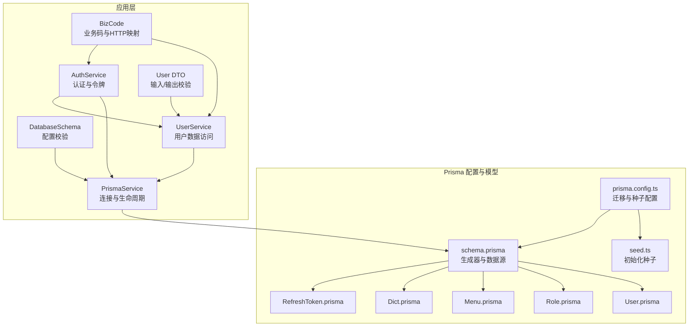
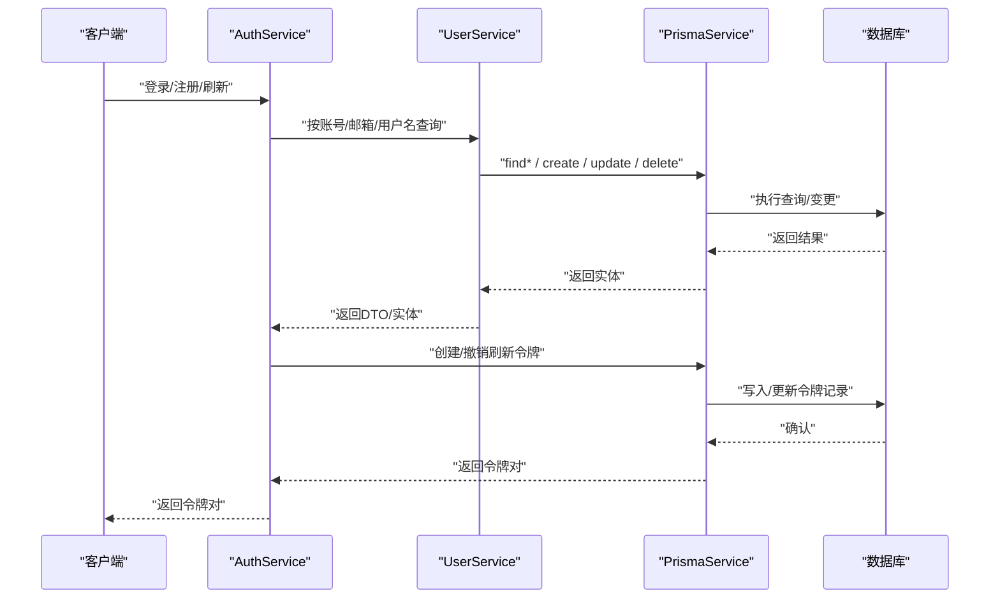
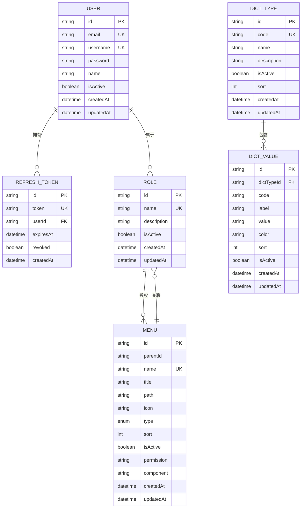
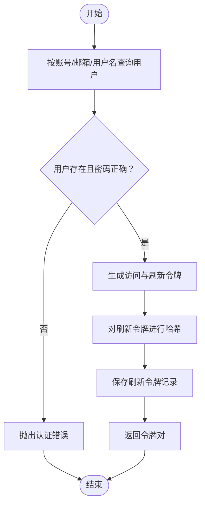
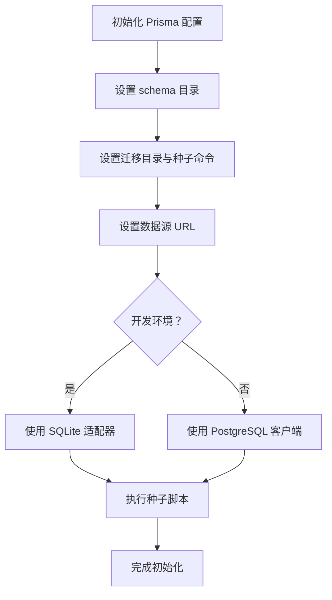
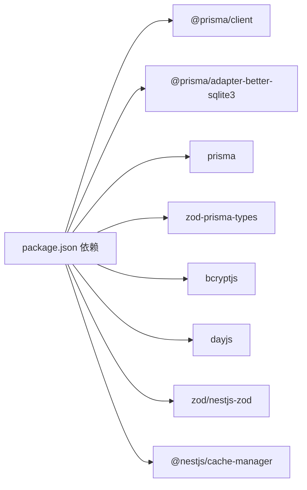

# 数据库设计

<cite>
**本文引用的文件**
- [prisma/schema.prisma](file://prisma/schema.prisma)
- [prisma/schema/User.prisma](file://prisma/schema/User.prisma)
- [prisma/schema/Role.prisma](file://prisma/schema/Role.prisma)
- [prisma/schema/Menu.prisma](file://prisma/schema/Menu.prisma)
- [prisma/schema/Dict.prisma](file://prisma/schema/Dict.prisma)
- [prisma/schema/RefreshToken.prisma](file://prisma/schema/RefreshToken.prisma)
- [prisma.config.ts](file://prisma.config.ts)
- [prisma/seed.ts](file://prisma/seed.ts)
- [src/prisma/prisma.service.ts](file://src/prisma/prisma.service.ts)
- [src/config/schemas/database.schema.ts](file://src/config/schemas/database.schema.ts)
- [src/modules/user/user.service.ts](file://src/modules/user/user.service.ts)
- [src/modules/auth/auth.service.ts](file://src/modules/auth/auth.service.ts)
- [src/modules/user/dto/user.dto.ts](file://src/modules/user/dto/user.dto.ts)
- [src/common/enums/biz-code.enum.ts](file://src/common/enums/biz-code.enum.ts)
- [package.json](file://package.json)
</cite>

## 目录

1. [简介](#简介)
2. [项目结构](#项目结构)
3. [核心组件](#核心组件)
4. [架构总览](#架构总览)
5. [详细组件分析](#详细组件分析)
6. [依赖分析](#依赖分析)
7. [性能考虑](#性能考虑)
8. [故障排查指南](#故障排查指南)
9. [结论](#结论)
10. [附录](#附录)

## 简介

本文件面向数据库设计与实现，围绕 Prisma ORM 的配置、数据模型、迁移与种子脚本、数据访问模式、缓存策略与性能考量进行系统化梳理。内容覆盖实体关系设计、字段定义、索引与约束、数据生命周期与保留策略、安全与隐私、访问控制以及迁移路径与版本管理策略。

## 项目结构

数据库相关的核心位置集中在 prisma 目录与 src/prisma 模块：

- Prisma 配置与生成器：prisma/schema.prisma
- 数据模型：User、Role、Menu、Dict、RefreshToken
- 迁移与种子：prisma.config.ts、prisma/seed.ts
- 应用侧数据库服务：src/prisma/prisma.service.ts
- 配置与验证：src/config/schemas/database.schema.ts
- 业务访问层：src/modules/user/user.service.ts、src/modules/auth/auth.service.ts
- DTO 与校验：src/modules/user/dto/user.dto.ts
- 业务码与异常：src/common/enums/biz-code.enum.ts
- 依赖与工具：package.json

图表来源

- [prisma/schema.prisma:1-13](file://prisma/schema.prisma#L1-L13)
- [prisma.config.ts:1-14](file://prisma.config.ts#L1-L14)
- [prisma/seed.ts:1-41](file://prisma/seed.ts#L1-L41)
- [src/prisma/prisma.service.ts:1-44](file://src/prisma/prisma.service.ts#L1-L44)
- [src/config/schemas/database.schema.ts:1-11](file://src/config/schemas/database.schema.ts#L1-L11)
- [src/modules/user/user.service.ts:1-125](file://src/modules/user/user.service.ts#L1-L125)
- [src/modules/auth/auth.service.ts:1-162](file://src/modules/auth/auth.service.ts#L1-L162)
- [src/modules/user/dto/user.dto.ts:1-40](file://src/modules/user/dto/user.dto.ts#L1-L40)
- [src/common/enums/biz-code.enum.ts:1-171](file://src/common/enums/biz-code.enum.ts#L1-L171)

章节来源

- [prisma/schema.prisma:1-13](file://prisma/schema.prisma#L1-L13)
- [prisma.config.ts:1-14](file://prisma.config.ts#L1-L14)
- [prisma/seed.ts:1-41](file://prisma/seed.ts#L1-L41)
- [src/prisma/prisma.service.ts:1-44](file://src/prisma/prisma.service.ts#L1-L44)
- [src/config/schemas/database.schema.ts:1-11](file://src/config/schemas/database.schema.ts#L1-L11)

## 核心组件

- Prisma 客户端与适配器：通过 PrismaService 统一管理连接与断开，开发环境使用 SQLite 适配器，生产环境可切换至 PostgreSQL。
- 数据模型：用户、角色、菜单、字典类型/值、刷新令牌，均采用 UUID 主键与时间戳字段。
- 迁移与种子：prisma.config.ts 统一管理迁移目录与种子命令；seed.ts 提供初始管理员账户。
- 数据访问层：UserService 提供用户 CRUD 与查询；AuthService 处理登录、注册、刷新令牌与登出。
- 配置与校验：DatabaseSchema 校验数据库提供方与连接串；BizCode 统一错误码与 HTTP 映射。

章节来源

- [src/prisma/prisma.service.ts:1-44](file://src/prisma/prisma.service.ts#L1-L44)
- [src/config/schemas/database.schema.ts:1-11](file://src/config/schemas/database.schema.ts#L1-L11)
- [src/modules/user/user.service.ts:1-125](file://src/modules/user/user.service.ts#L1-L125)
- [src/modules/auth/auth.service.ts:1-162](file://src/modules/auth/auth.service.ts#L1-L162)
- [prisma/seed.ts:1-41](file://prisma/seed.ts#L1-L41)

## 架构总览

下图展示从应用到数据库的调用链路与数据流：

图表来源

- [src/modules/auth/auth.service.ts:1-162](file://src/modules/auth/auth.service.ts#L1-L162)
- [src/modules/user/user.service.ts:1-125](file://src/modules/user/user.service.ts#L1-L125)
- [src/prisma/prisma.service.ts:1-44](file://src/prisma/prisma.service.ts#L1-L44)

## 详细组件分析

### 数据模型与实体关系

- User（用户）
  - 主键：String（UUID）
  - 唯一索引：email、username
  - 默认值：isActive=true、createdAt=now()、updatedAt=now()
  - 关系：一对多（refreshTokens）、多对多（roles）
  - 表映射：users
- Role（角色）
  - 主键：String（UUID）
  - 唯一索引：name
  - 默认值：isActive=true、createdAt=now()、updatedAt=now()
  - 关系：多对多（users、menus）
  - 表映射：roles
- Menu（菜单）
  - 主键：String（UUID）
  - 唯一索引：name
  - 索引：parentId
  - 默认值：type=menu、sort=0、isActive=true、createdAt=now()、updatedAt=now()
  - 关系：自引用（父子层级）、多对多（roles）
  - 表映射：menus
- DictType（字典类型）
  - 主键：String（UUID）
  - 唯一索引：code
  - 索引：code
  - 默认值：isActive=true、sort=0、createdAt=now()、updatedAt=now()
  - 关系：一对多（dict_values）
  - 表映射：dict_types
- DictValue（字典值）
  - 主键：String（UUID）
  - 唯一索引：(dictTypeId, code)
  - 索引：dictTypeId
  - 默认值：isActive=true、sort=0、createdAt=now()、updatedAt=now()
  - 关系：多对一（dict_type）
  - 表映射：dict_values
- RefreshToken（刷新令牌）
  - 主键：String（UUID）
  - 唯一索引：token
  - 索引：userId
  - 字段：expiresAt、revoked、createdAt
  - 关系：多对一（user）
  - 表映射：refresh_tokens

图表来源

- [prisma/schema/User.prisma:1-15](file://prisma/schema/User.prisma#L1-L15)
- [prisma/schema/Role.prisma:1-13](file://prisma/schema/Role.prisma#L1-L13)
- [prisma/schema/Menu.prisma:1-28](file://prisma/schema/Menu.prisma#L1-L28)
- [prisma/schema/Dict.prisma:1-34](file://prisma/schema/Dict.prisma#L1-L34)
- [prisma/schema/RefreshToken.prisma:1-12](file://prisma/schema/RefreshToken.prisma#L1-L12)

章节来源

- [prisma/schema/User.prisma:1-15](file://prisma/schema/User.prisma#L1-L15)
- [prisma/schema/Role.prisma:1-13](file://prisma/schema/Role.prisma#L1-L13)
- [prisma/schema/Menu.prisma:1-28](file://prisma/schema/Menu.prisma#L1-L28)
- [prisma/schema/Dict.prisma:1-34](file://prisma/schema/Dict.prisma#L1-L34)
- [prisma/schema/RefreshToken.prisma:1-12](file://prisma/schema/RefreshToken.prisma#L1-L12)

### 字段定义与约束

- 主键：全部模型使用 String 类型的 UUID 主键，确保分布式与跨环境一致性。
- 唯一约束：用户邮箱、用户名、角色名、菜单名、字典类型编码、刷新令牌 token。
- 索引：菜单 parentId、字典类型 code、字典值 dictTypeId、刷新令牌 userId。
- 默认值：isActive、sort、type、createdAt、updatedAt。
- 时间戳：普遍包含 createdAt、updatedAt，部分模型使用 @updatedAt 自动更新。
- 外键：通过 relation 与 fields/references 显式声明，Cascade 删除策略用于父子菜单与字典值。

章节来源

- [prisma/schema/Menu.prisma:10-11](file://prisma/schema/Menu.prisma#L10-L11)
- [prisma/schema/Dict.prisma:30-31](file://prisma/schema/Dict.prisma#L30-L31)
- [prisma/schema/RefreshToken.prisma:10-11](file://prisma/schema/RefreshToken.prisma#L10-L11)

### 数据访问模式

- UserService
  - 创建：检查邮箱唯一性，哈希密码后创建，仅返回必要字段。
  - 查询：支持按 id、email、username、账号（邮箱或用户名）查询。
  - 更新/删除：先校验存在性，再执行变更。
  - 密码校验：使用 bcrypt 比较明文与哈希。
- AuthService
  - 登录：按账号查找用户并校验密码，生成访问与刷新令牌。
  - 注册：双重唯一性校验（邮箱、用户名），创建用户并生成令牌。
  - 刷新：对传入刷新令牌进行哈希比对，校验有效期与撤销状态，撤销旧令牌并发放新令牌。
  - 登出：批量撤销指定用户的未撤销刷新令牌。

图表来源

- [src/modules/auth/auth.service.ts:29-96](file://src/modules/auth/auth.service.ts#L29-L96)
- [src/modules/user/user.service.ts:17-37](file://src/modules/user/user.service.ts#L17-L37)

章节来源

- [src/modules/user/user.service.ts:1-125](file://src/modules/user/user.service.ts#L1-L125)
- [src/modules/auth/auth.service.ts:1-162](file://src/modules/auth/auth.service.ts#L1-L162)

### 缓存策略与性能考虑

- 缓存中间件：应用依赖 @nestjs/cache-manager 与 cache-manager，可用于会话、令牌、菜单树等热点数据的缓存。
- 查询优化：合理使用 select 投影减少传输与序列化开销；对高频查询建立索引（如 email、username、token、parentId 等）。
- 并发与连接：通过配置项限制最大连接数；SQLite 在多实例/高并发场景受限，建议生产使用 PostgreSQL。
- 日志与可观测性：PrismaService 可结合日志模块记录慢查询与错误，便于定位性能瓶颈。

章节来源

- [package.json:26-55](file://package.json#L26-L55)
- [src/config/schemas/database.schema.ts:6-7](file://src/config/schemas/database.schema.ts#L6-L7)

### 数据生命周期、保留策略与归档

- 刷新令牌：按配置的有效期到期后由客户端重新登录或刷新；服务端撤销过期或已使用令牌。
- 用户与角色：软删除通过 isActive 字段控制；实际删除需谨慎评估外键依赖。
- 字典：通过 isActive 控制启用状态；历史变更可通过审计日志或独立审计表追踪（当前模型未内置审计列）。
- 归档建议：对历史日志与审计数据可定期归档至离线存储，数据库保留近期活跃数据以保证查询性能。

章节来源

- [src/modules/auth/auth.service.ts:72-110](file://src/modules/auth/auth.service.ts#L72-L110)
- [prisma/schema/RefreshToken.prisma:6-7](file://prisma/schema/RefreshToken.prisma#L6-L7)

### 数据安全、隐私与访问控制

- 密码安全：注册与登录时使用 bcrypt 哈希，避免明文存储。
- 令牌安全：刷新令牌入库前进行哈希存储，登录流程同时生成访问与刷新令牌，并设置过期时间。
- 输入校验：使用 Zod DTO 对用户输入进行严格校验，降低注入与异常输入风险。
- 错误码与消息：统一的 BizCode 体系，明确区分认证、用户、菜单、角色、字典等模块错误，便于前端与监控系统处理。

章节来源

- [src/modules/auth/auth.service.ts:117-153](file://src/modules/auth/auth.service.ts#L117-L153)
- [src/modules/user/dto/user.dto.ts:5-19](file://src/modules/user/dto/user.dto.ts#L5-L19)
- [src/common/enums/biz-code.enum.ts:31-78](file://src/common/enums/biz-code.enum.ts#L31-L78)

### 迁移路径与版本管理

- 迁移目录：prisma/migrations
- 种子脚本：ts-node prisma/seed.ts
- 数据源 URL：从环境变量 DATABASE_URL 注入
- 开发/生产切换：通过 prisma.config.ts 与 PrismaService 的 provider 配置实现 SQLite 与 PostgreSQL 的动态选择

图表来源

- [prisma.config.ts:4-13](file://prisma.config.ts#L4-L13)
- [prisma/seed.ts:1-41](file://prisma/seed.ts#L1-L41)
- [src/prisma/prisma.service.ts:18-34](file://src/prisma/prisma.service.ts#L18-L34)

章节来源

- [prisma.config.ts:1-14](file://prisma.config.ts#L1-L14)
- [prisma/seed.ts:1-41](file://prisma/seed.ts#L1-L41)
- [src/prisma/prisma.service.ts:1-44](file://src/prisma/prisma.service.ts#L1-L44)

## 依赖分析

- Prisma 客户端与适配器：@prisma/client、@prisma/adapter-better-sqlite3
- 生成器：prisma、zod-prisma-types
- 应用集成：NestJS 模块、配置服务、JWT、缓存、日志
- 工具链：bcryptjs、dayjs、zod、nestjs-zod

图表来源

- [package.json:26-85](file://package.json#L26-L85)

章节来源

- [package.json:26-85](file://package.json#L26-L85)

## 性能考虑

- 索引与查询：为高频过滤字段建立索引；避免 N+1 查询，使用 include/select 精准投影。
- 连接池与并发：限制最大连接数，避免过度并发导致锁竞争。
- 缓存：对读多写少的数据（如菜单树、字典）进行缓存，降低数据库压力。
- 分页与分批：大数据量导出/统计使用分页或游标分批处理。
- 存储引擎：SQLite 适合开发测试，生产建议 PostgreSQL 以获得更好的并发与稳定性。

## 故障排查指南

- 认证错误
  - 凭证无效：检查账号是否存在、密码是否匹配。
  - 刷新令牌无效或过期：确认令牌哈希一致、未被撤销、未超时。
- 用户相关
  - 邮箱/用户名重复：注册时二次校验，避免并发冲突。
  - 用户不存在：查询前先校验存在性。
- 数据库连接
  - 连接失败：检查 DATABASE_URL、provider 与适配器配置。
  - 迁移失败：确认迁移目录与种子命令配置正确，数据库可写。

章节来源

- [src/common/enums/biz-code.enum.ts:31-78](file://src/common/enums/biz-code.enum.ts#L31-L78)
- [src/modules/auth/auth.service.ts:33-96](file://src/modules/auth/auth.service.ts#L33-L96)
- [src/modules/user/user.service.ts:18-24](file://src/modules/user/user.service.ts#L18-L24)

## 结论

本项目基于 Prisma 实现了清晰的数据模型与访问层，具备良好的扩展性与安全性。通过合理的索引、约束与 DTO 校验，提升了数据一致性与易维护性。建议在生产环境采用 PostgreSQL，并结合缓存与监控进一步提升性能与可观测性。

## 附录

- 示例数据（种子）
  - 初始化管理员用户：邮箱、用户名、哈希密码、显示名、启用状态
- 配置要点
  - DATABASE_URL：数据库连接串
  - database.provider：sqlite 或 postgresql
  - database.maxConnections：最大连接数
  - database.logging：是否开启日志

章节来源

- [prisma/seed.ts:11-31](file://prisma/seed.ts#L11-L31)
- [src/config/schemas/database.schema.ts:3-8](file://src/config/schemas/database.schema.ts#L3-L8)
