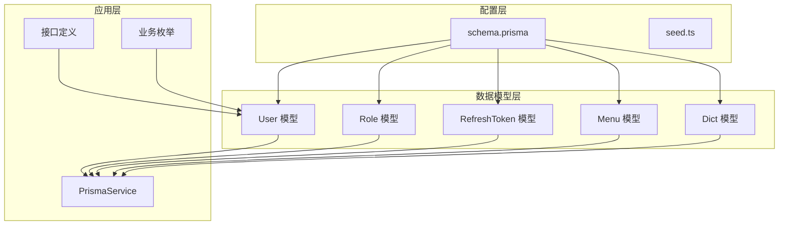
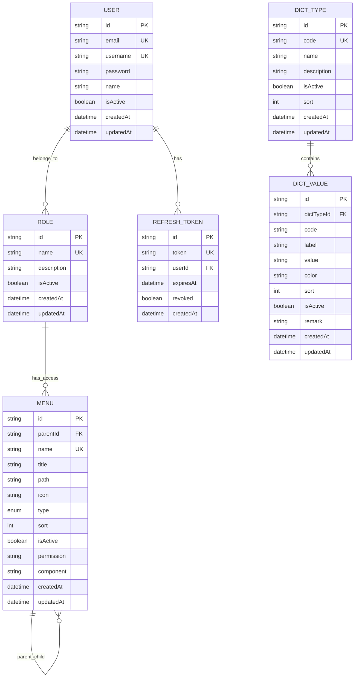
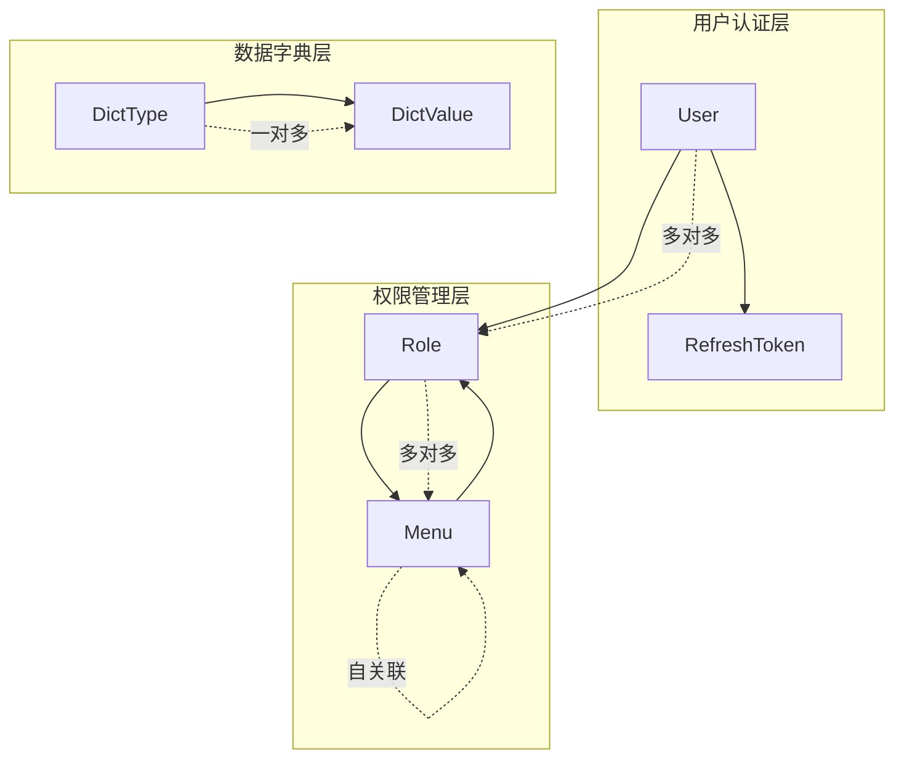
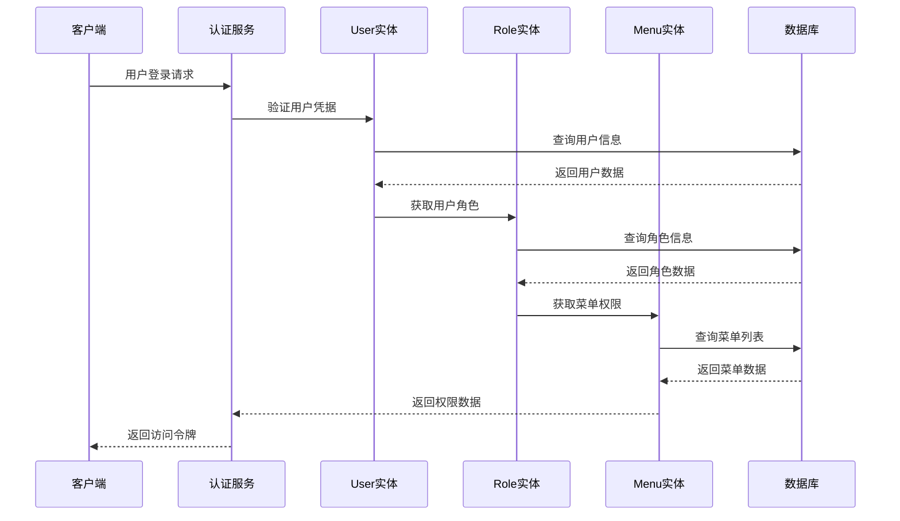
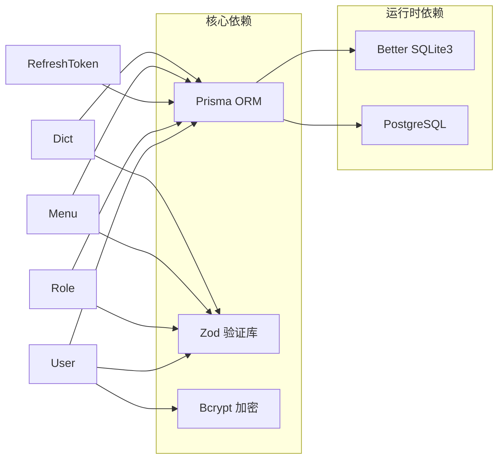

# 数据模型定义

<cite>
**本文档引用的文件**
- [User.prisma](file://prisma/schema/User.prisma)
- [Role.prisma](file://prisma/schema/Role.prisma)
- [RefreshToken.prisma](file://prisma/schema/RefreshToken.prisma)
- [Menu.prisma](file://prisma/schema/Menu.prisma)
- [Dict.prisma](file://prisma/schema/Dict.prisma)
- [schema.prisma](file://prisma/schema.prisma)
- [seed.ts](file://prisma/seed.ts)
- [user.interface.ts](file://src/common/interfaces/user.interface.ts)
- [biz-code.enum.ts](file://src/common/enums/biz-code.enum.ts)
- [auth.dto.ts](file://src/modules/auth/dto/auth.dto.ts)
- [user.dto.ts](file://src/modules/user/dto/user.dto.ts)
- [prisma.service.ts](file://src/prisma/prisma.service.ts)
</cite>

## 目录
1. [简介](#简介)
2. [项目结构](#项目结构)
3. [核心组件](#核心组件)
4. [架构概览](#架构概览)
5. [详细组件分析](#详细组件分析)
6. [依赖分析](#依赖分析)
7. [性能考虑](#性能考虑)
8. [故障排除指南](#故障排除指南)
9. [结论](#结论)

## 简介

本文件提供了该NestJS项目的完整数据模型定义文档。该项目采用Prisma ORM进行数据库建模，实现了用户认证、权限管理、菜单系统和字典管理等核心功能。数据模型设计遵循以下原则：

- 使用UUID作为主键，确保分布式环境下的唯一性
- 实现软删除和激活状态管理
- 建立清晰的实体关系和约束条件
- 支持多对多关系和层级结构
- 提供完整的索引优化策略

## 项目结构

项目采用分层架构，数据模型位于`prisma/schema/`目录下，每个实体都有独立的Prisma模式文件：

**图表来源**
- [schema.prisma:1-13](file://prisma/schema.prisma#L1-L13)
- [User.prisma:1-15](file://prisma/schema/User.prisma#L1-L15)
- [Role.prisma:1-13](file://prisma/schema/Role.prisma#L1-L13)
- [RefreshToken.prisma:1-12](file://prisma/schema/RefreshToken.prisma#L1-L12)
- [Menu.prisma:1-28](file://prisma/schema/Menu.prisma#L1-L28)
- [Dict.prisma:1-34](file://prisma/schema/Dict.prisma#L1-L34)

**章节来源**
- [schema.prisma:1-13](file://prisma/schema.prisma#L1-L13)
- [prisma.service.ts:1-44](file://src/prisma/prisma.service.ts#L1-L44)

## 核心组件

### 数据库配置

项目使用SQLite作为开发数据库，通过Prisma Better SQLite3适配器进行连接管理。数据库提供程序和URL通过配置服务动态注入。

**章节来源**
- [schema.prisma:10-12](file://prisma/schema.prisma#L10-L12)
- [prisma.service.ts:18-34](file://src/prisma/prisma.service.ts#L18-L34)

### 数据生成器配置

项目配置了两个数据生成器：
- Prisma客户端：用于TypeScript数据库访问
- Zod类型生成器：自动生成强类型的Zod验证模式

**章节来源**
- [schema.prisma:1-8](file://prisma/schema.prisma#L1-L8)

## 架构概览

系统采用三层架构设计，数据模型层、业务逻辑层和表现层分离：

**图表来源**
- [User.prisma:1-15](file://prisma/schema/User.prisma#L1-L15)
- [Role.prisma:1-13](file://prisma/schema/Role.prisma#L1-L13)
- [RefreshToken.prisma:1-12](file://prisma/schema/RefreshToken.prisma#L1-L12)
- [Menu.prisma:1-28](file://prisma/schema/Menu.prisma#L1-L28)
- [Dict.prisma:1-34](file://prisma/schema/Dict.prisma#L1-L34)

## 详细组件分析

### User 实体模型

User实体是系统的核心身份认证实体，负责用户基本信息管理和认证相关功能。

#### 字段定义

| 字段名 | 类型 | 约束条件 | 默认值 | 描述 |
|--------|------|----------|--------|------|
| id | String | @id, @default(uuid()) | 自动生成 | 用户唯一标识符（UUID） |
| email | String | @unique | - | 用户邮箱地址，唯一约束 |
| username | String | @unique | - | 用户名，唯一约束 |
| password | String | - | - | 用户密码（加密存储） |
| name | String? | - | null | 用户显示名称 |
| isActive | Boolean | - | true | 用户激活状态 |
| createdAt | DateTime | @default(now()) | 当前时间 | 创建时间戳 |
| updatedAt | DateTime | @updatedAt | 自动更新 | 最后更新时间戳 |

#### 关系映射

- 一对多关系：User → RefreshToken（一个用户可拥有多个刷新令牌）
- 多对多关系：User ↔ Role（用户可拥有多个角色）

#### 索引配置

- 主键：id（UUID）
- 唯一索引：email, username
- 时间戳索引：createdAt, updatedAt

**章节来源**
- [User.prisma:1-15](file://prisma/schema/User.prisma#L1-L15)

### Role 实体模型

Role实体实现基于角色的访问控制（RBAC）系统，为用户分配权限和功能访问权。

#### 字段定义

| 字段名 | 类型 | 约束条件 | 默认值 | 描述 |
|--------|------|----------|--------|------|
| id | String | @id, @default(uuid()) | 自动生成 | 角色唯一标识符（UUID） |
| name | String | @unique | - | 角色名称，唯一约束 |
| description | String? | - | null | 角色描述信息 |
| isActive | Boolean | - | true | 角色激活状态 |
| createdAt | DateTime | @default(now()) | 当前时间 | 创建时间戳 |
| updatedAt | DateTime | @updatedAt | 自动更新 | 最后更新时间戳 |

#### 关系映射

- 多对多关系：Role ↔ User（角色可分配给多个用户）
- 多对多关系：Role ↔ Menu（角色可访问多个菜单）

#### 索引配置

- 主键：id（UUID）
- 唯一索引：name
- 时间戳索引：createdAt, updatedAt

**章节来源**
- [Role.prisma:1-13](file://prisma/schema/Role.prisma#L1-L13)

### RefreshToken 实体模型

RefreshToken实体管理用户的刷新令牌，支持安全的令牌轮换机制。

#### 字段定义

| 字段名 | 类型 | 约束条件 | 默认值 | 描述 |
|--------|------|----------|--------|------|
| id | String | @id, @default(uuid()) | 自动生成 | 令牌唯一标识符（UUID） |
| token | String | @unique | - | 刷新令牌值，唯一约束 |
| userId | String | - | - | 关联用户ID |
| expiresAt | DateTime | - | - | 令牌过期时间 |
| revoked | Boolean | @default(false) | false | 令牌撤销状态 |
| createdAt | DateTime | @default(now()) | 当前时间 | 创建时间戳 |

#### 关系映射

- 多对一关系：RefreshToken → User（一个令牌属于一个用户）
- 外键约束：onDelete: Cascade（用户删除时级联删除令牌）

#### 索引配置

- 主键：id（UUID）
- 唯一索引：token
- 普通索引：userId（提升查询性能）

**章节来源**
- [RefreshToken.prisma:1-12](file://prisma/schema/RefreshToken.prisma#L1-L12)

### Menu 实体模型

Menu实体实现层级化的菜单系统，支持菜单树形结构和权限控制。

#### 字段定义

| 字段名 | 类型 | 约束条件 | 默认值 | 描述 |
|--------|------|----------|--------|------|
| id | String | @id, @default(uuid()) | 自动生成 | 菜单唯一标识符（UUID） |
| parentId | String? | - | null | 父菜单ID，支持NULL表示根节点 |
| name | String | @unique | - | 菜单名称，唯一约束 |
| title | String | - | - | 菜单显示标题 |
| path | String? | - | null | 路由路径 |
| icon | String? | - | null | 图标类名 |
| type | MenuType | @default(menu) | menu | 菜单类型枚举 |
| sort | Int | @default(0) | 0 | 排序权重 |
| isActive | Boolean | @default(true) | true | 菜单激活状态 |
| permission | String? | - | null | 权限标识符 |
| component | String? | - | null | 组件路径 |
| createdAt | DateTime | @default(now()) | 当前时间 | 创建时间戳 |
| updatedAt | DateTime | @updatedAt | 自动更新 | 最后更新时间戳 |

#### 枚举类型

MenuType枚举定义了菜单的不同类型：
- menu：页面菜单
- button：按钮权限
- link：外部链接

#### 关系映射

- 自关联关系：Menu → Menu（父子菜单层级）
- 多对多关系：Menu ↔ Role（菜单可被多个角色访问）

#### 索引配置

- 主键：id（UUID）
- 唯一索引：name
- 普通索引：parentId（支持层级查询）

**章节来源**
- [Menu.prisma:1-28](file://prisma/schema/Menu.prisma#L1-L28)

### Dict 实体模型

Dict实体实现字典管理系统，支持类型化和层级化的数据字典。

#### 字典类型（DictType）

| 字段名 | 类型 | 约束条件 | 默认值 | 描述 |
|--------|------|----------|--------|------|
| id | String | @id, @default(uuid()) | 自动生成 | 字典类型唯一标识符（UUID） |
| code | String | @unique | - | 字典类型编码，唯一约束 |
| name | String | - | - | 字典类型名称 |
| description | String? | - | null | 描述信息 |
| isActive | Boolean | @default(true) | true | 类型激活状态 |
| sort | Int | @default(0) | 0 | 排序权重 |
| createdAt | DateTime | @default(now()) | 当前时间 | 创建时间戳 |
| updatedAt | DateTime | @updatedAt | 自动更新 | 最后更新时间戳 |

#### 字典值（DictValue）

| 字段名 | 类型 | 约束条件 | 默认值 | 描述 |
|--------|------|----------|--------|------|
| id | String | @id, @default(uuid()) | 自动生成 | 字典值唯一标识符（UUID） |
| dictTypeId | String | - | - | 关联字典类型ID |
| code | String | - | - | 字典值编码 |
| label | String | - | - | 显示标签 |
| value | String | - | - | 实际值 |
| color | String? | - | null | 颜色标识 |
| sort | Int | @default(0) | 0 | 排序权重 |
| isActive | Boolean | @default(true) | true | 值激活状态 |
| remark | String? | - | null | 备注信息 |
| createdAt | DateTime | @default(now()) | 当前时间 | 创建时间戳 |
| updatedAt | DateTime | @updatedAt | 自动更新 | 最后更新时间戳 |

#### 关系映射

- 一对多关系：DictType → DictValue（一个类型包含多个值）
- 外键约束：onDelete: Cascade（类型删除时级联删除值）

#### 索引配置

- 主键：id（UUID）
- 唯一索引：code（字典类型）
- 复合唯一索引：dictTypeId, code（字典值）
- 普通索引：dictTypeId（提升查询性能）

**章节来源**
- [Dict.prisma:1-34](file://prisma/schema/Dict.prisma#L1-L34)

## 依赖分析

### 实体关系图

**图表来源**
- [User.prisma:10-11](file://prisma/schema/User.prisma#L10-L11)
- [Role.prisma:8-9](file://prisma/schema/Role.prisma#L8-L9)
- [RefreshToken.prisma:4-5](file://prisma/schema/RefreshToken.prisma#L4-L5)
- [Menu.prisma:10-11](file://prisma/schema/Menu.prisma#L10-L11)
- [Dict.prisma:19](file://prisma/schema/Dict.prisma#L19)

### 数据流分析

**图表来源**
- [auth.dto.ts:50-55](file://src/modules/auth/dto/auth.dto.ts#L50-L55)
- [User.prisma:10-11](file://prisma/schema/User.prisma#L10-L11)
- [Role.prisma:8-9](file://prisma/schema/Role.prisma#L8-L9)
- [Menu.prisma:23](file://prisma/schema/Menu.prisma#L23)

### 外部依赖关系

**图表来源**
- [schema.prisma:1-8](file://prisma/schema.prisma#L1-L8)
- [prisma.service.ts:22-31](file://src/prisma/prisma.service.ts#L22-L31)
- [seed.ts:12](file://prisma/seed.ts#L12)

## 性能考虑

### 索引优化策略

1. **主键索引**：所有实体的UUID主键自动建立索引
2. **唯一索引**：关键字段如email、username、token、name等建立唯一索引
3. **复合索引**：字典值的(dictTypeId, code)组合索引提升查询效率
4. **层级索引**：菜单的parentId索引支持高效的树形查询

### 查询优化建议

- 使用`include`和`select`精确控制查询字段
- 对频繁查询的字段建立适当的索引
- 避免N+1查询问题，使用预加载关联数据
- 实施分页查询处理大量数据

### 缓存策略

- 用户权限信息可以缓存以减少数据库查询
- 配置合理的缓存失效策略
- 考虑使用Redis等内存数据库存储热点数据

## 故障排除指南

### 常见数据模型问题

#### 唯一约束冲突
当尝试插入重复的email、username、token或name时，会触发唯一约束冲突。解决方案：
- 检查输入数据的唯一性
- 实施数据验证和去重逻辑
- 提供友好的错误提示信息

#### 外键约束错误
删除有子菜单的父菜单或删除正在使用的用户会导致外键约束错误。解决方案：
- 实施级联删除或限制删除策略
- 在删除前检查依赖关系
- 提供适当的错误处理和回滚机制

#### 数据验证失败
Zod验证器会阻止不符合规则的数据进入数据库。常见问题：
- 邮箱格式不正确
- 密码长度不足
- 用户名长度不够

**章节来源**
- [biz-code.enum.ts:32-45](file://src/common/enums/biz-code.enum.ts#L32-L45)
- [auth.dto.ts:14-36](file://src/modules/auth/dto/auth.dto.ts#L14-L36)
- [user.dto.ts:5-19](file://src/modules/user/dto/user.dto.ts#L5-L19)

### 数据迁移和版本控制

- 使用Prisma Migrate管理数据库结构变更
- 保持迁移文件的版本控制和审查流程
- 实施备份策略防止数据丢失
- 测试环境和生产环境的差异管理

## 结论

该数据模型设计体现了现代Web应用的最佳实践：

### 设计优势

1. **一致性**：统一的UUID主键策略确保跨系统的数据一致性
2. **可扩展性**：清晰的实体关系为未来的功能扩展奠定基础
3. **安全性**：完善的权限控制和令牌管理机制
4. **性能**：合理的索引策略和查询优化
5. **可维护性**：模块化的数据模型便于维护和升级

### 未来演进规划

1. **数据库迁移**：从SQLite迁移到PostgreSQL以支持生产环境
2. **缓存集成**：实施Redis缓存提升系统性能
3. **审计日志**：添加数据变更审计功能
4. **数据同步**：支持多租户和数据同步需求
5. **监控指标**：集成数据库性能监控和告警机制

该数据模型为构建企业级应用提供了坚实的基础，通过持续的优化和扩展，能够满足不断增长的业务需求。