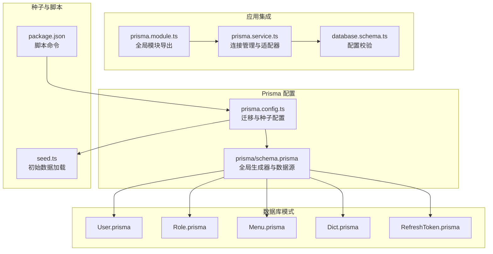
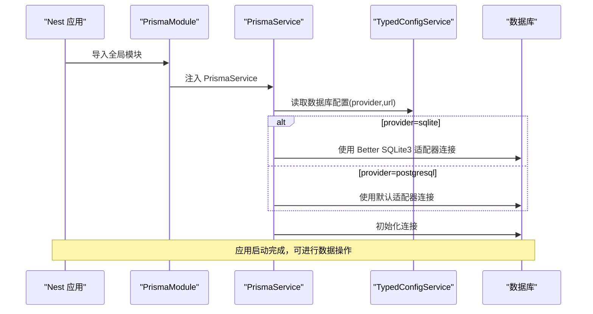
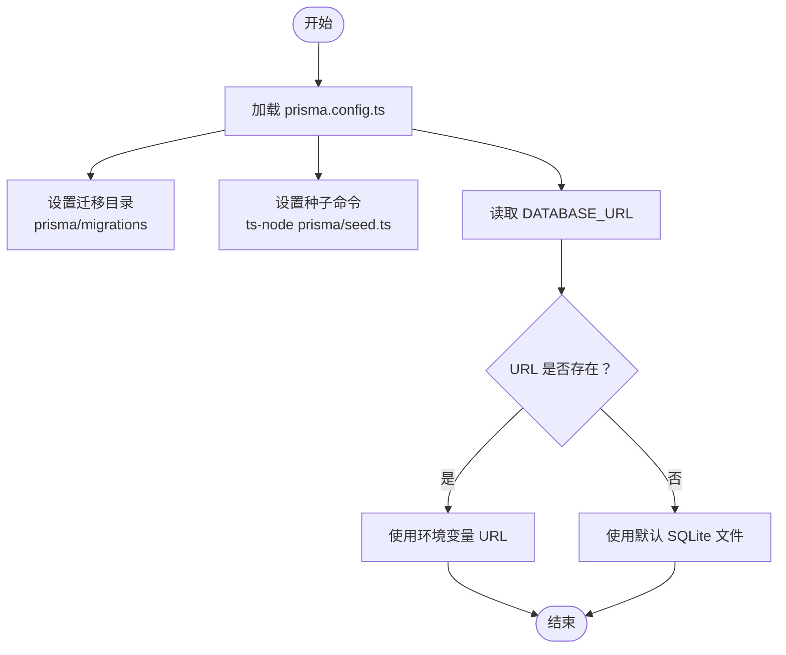
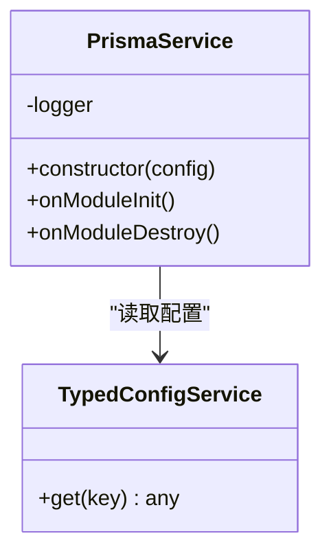
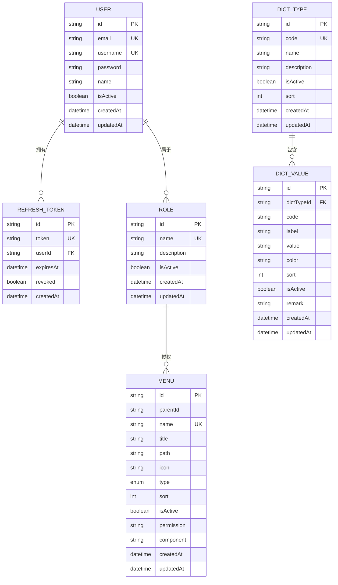
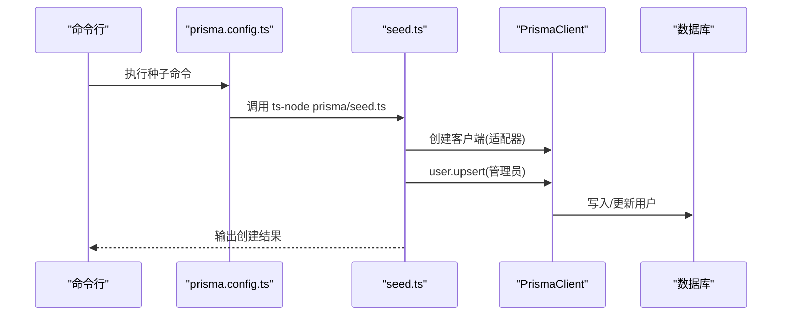
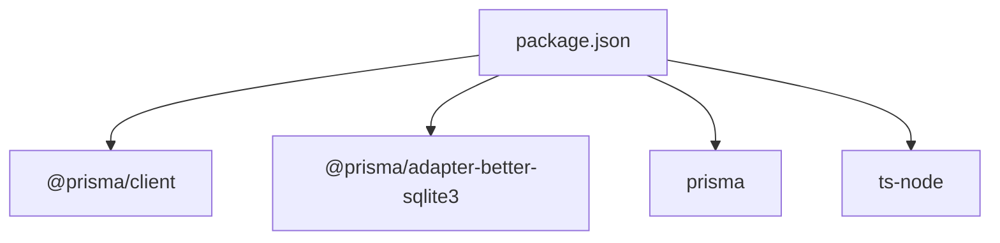

# 数据迁移管理

<cite>
**本文档引用的文件**
- [prisma/schema.prisma](file://prisma/schema.prisma)
- [prisma.config.ts](file://prisma.config.ts)
- [prisma/seed.ts](file://prisma/seed.ts)
- [src/prisma/prisma.service.ts](file://src/prisma/prisma.service.ts)
- [src/prisma/prisma.module.ts](file://src/prisma/prisma.module.ts)
- [src/config/schemas/database.schema.ts](file://src/config/schemas/database.schema.ts)
- [prisma/schema/User.prisma](file://prisma/schema/User.prisma)
- [prisma/schema/Role.prisma](file://prisma/schema/Role.prisma)
- [prisma/schema/Menu.prisma](file://prisma/schema/Menu.prisma)
- [prisma/schema/Dict.prisma](file://prisma/schema/Dict.prisma)
- [prisma/schema/RefreshToken.prisma](file://prisma/schema/RefreshToken.prisma)
- [package.json](file://package.json)
</cite>

## 目录
1. [简介](#简介)
2. [项目结构](#项目结构)
3. [核心组件](#核心组件)
4. [架构概览](#架构概览)
5. [详细组件分析](#详细组件分析)
6. [依赖关系分析](#依赖关系分析)
7. [性能考虑](#性能考虑)
8. [故障排除指南](#故障排除指南)
9. [结论](#结论)
10. [附录](#附录)

## 简介
本文件为该 NestJS 项目的数据迁移管理综合文档，重点围绕 Prisma Migrate 的使用方法、迁移文件的创建与管理、数据库版本控制策略、迁移回滚机制以及生产环境部署流程进行系统化阐述。同时涵盖数据种子（Seed）管理、初始数据加载与测试数据准备的最佳实践，并提供开发、测试与生产环境迁移策略的差异说明及常见问题解决方案。

## 项目结构
该项目采用 Prisma 作为 ORM 和数据库迁移工具，核心迁移配置集中在 prisma.config.ts 中，数据库模式定义分布在多个 .prisma 文件中，应用通过 PrismaService 提供统一的数据访问层。

**图表来源**
- [prisma.config.ts:1-14](file://prisma.config.ts#L1-L14)
- [prisma/schema.prisma:1-13](file://prisma/schema.prisma#L1-L13)
- [src/prisma/prisma.module.ts:1-10](file://src/prisma/prisma.module.ts#L1-L10)
- [src/prisma/prisma.service.ts:1-44](file://src/prisma/prisma.service.ts#L1-L44)
- [src/config/schemas/database.schema.ts:1-11](file://src/config/schemas/database.schema.ts#L1-L11)
- [prisma/seed.ts:1-41](file://prisma/seed.ts#L1-L41)
- [package.json:1-88](file://package.json#L1-L88)

**章节来源**
- [prisma.config.ts:1-14](file://prisma.config.ts#L1-L14)
- [prisma/schema.prisma:1-13](file://prisma/schema.prisma#L1-L13)
- [src/prisma/prisma.module.ts:1-10](file://src/prisma/prisma.module.ts#L1-L10)
- [src/prisma/prisma.service.ts:1-44](file://src/prisma/prisma.service.ts#L1-L44)
- [src/config/schemas/database.schema.ts:1-11](file://src/config/schemas/database.schema.ts#L1-L11)
- [prisma/seed.ts:1-41](file://prisma/seed.ts#L1-L41)
- [package.json:1-88](file://package.json#L1-L88)

## 核心组件
- 迁移配置：prisma.config.ts 定义了迁移目录、种子执行命令以及数据源 URL，确保迁移与种子在不同环境的一致性。
- 模式文件：各领域模型（用户、角色、菜单、字典、刷新令牌）的 Prisma 模式文件，描述表结构、索引、关系与映射。
- 应用服务：PrismaService 基于配置动态选择 SQLite 或 PostgreSQL 适配器，实现跨环境连接管理。
- 种子脚本：seed.ts 使用 Better SQLite3 适配器加载初始数据，支持开发环境快速初始化。
- 配置校验：database.schema.ts 对数据库配置进行类型校验，保证运行时参数正确性。

**章节来源**
- [prisma.config.ts:1-14](file://prisma.config.ts#L1-L14)
- [prisma/schema/User.prisma:1-15](file://prisma/schema/User.prisma#L1-L15)
- [prisma/schema/Role.prisma:1-13](file://prisma/schema/Role.prisma#L1-L13)
- [prisma/schema/Menu.prisma:1-28](file://prisma/schema/Menu.prisma#L1-L28)
- [prisma/schema/Dict.prisma:1-34](file://prisma/schema/Dict.prisma#L1-L34)
- [prisma/schema/RefreshToken.prisma:1-12](file://prisma/schema/RefreshToken.prisma#L1-L12)
- [src/prisma/prisma.service.ts:1-44](file://src/prisma/prisma.service.ts#L1-L44)
- [prisma/seed.ts:1-41](file://prisma/seed.ts#L1-L41)
- [src/config/schemas/database.schema.ts:1-11](file://src/config/schemas/database.schema.ts#L1-L11)

## 架构概览
下图展示了从应用启动到数据库连接、迁移与种子执行的整体流程：

**图表来源**
- [src/prisma/prisma.module.ts:1-10](file://src/prisma/prisma.module.ts#L1-L10)
- [src/prisma/prisma.service.ts:1-44](file://src/prisma/prisma.service.ts#L1-L44)
- [src/config/schemas/database.schema.ts:1-11](file://src/config/schemas/database.schema.ts#L1-L11)

## 详细组件分析

### 迁移配置与种子管理
- 迁移路径：prisma.config.ts 将迁移目录设置为 prisma/migrations，便于版本化管理。
- 种子执行：通过 seed 字段指定种子脚本命令，支持 TypeScript 脚本执行。
- 数据源 URL：通过环境变量 DATABASE_URL 动态注入，确保不同环境隔离。

**图表来源**
- [prisma.config.ts:1-14](file://prisma.config.ts#L1-L14)

**章节来源**
- [prisma.config.ts:1-14](file://prisma.config.ts#L1-L14)

### 数据库连接与适配器
- SQLite 场景：当配置 provider 为 sqlite 时，PrismaService 使用 Better SQLite3 适配器，自动根据 DATABASE_URL 或默认文件建立连接。
- PostgreSQL 场景：当配置 provider 为 postgresql 时，使用默认适配器，连接由 Prisma 配置管理。
- 生命周期：OnModuleInit 与 OnModuleDestroy 确保连接与断开的生命周期管理。

**图表来源**
- [src/prisma/prisma.service.ts:1-44](file://src/prisma/prisma.service.ts#L1-L44)

**章节来源**
- [src/prisma/prisma.service.ts:1-44](file://src/prisma/prisma.service.ts#L1-L44)
- [src/config/schemas/database.schema.ts:1-11](file://src/config/schemas/database.schema.ts#L1-L11)

### 数据模型与关系
- 用户模型：包含邮箱、用户名唯一约束、密码、状态与时间戳，关联刷新令牌与角色多对多关系。
- 角色模型：名称唯一、描述、状态与时间戳，关联用户与菜单的多对多关系。
- 菜单模型：支持父子层级、类型枚举、权限标识、排序与状态，与角色多对多关联。
- 字典模型：字典类型与值的层级关系，支持颜色、排序与状态。
- 刷新令牌模型：与用户一对一关联，记录过期时间与撤销状态。

**图表来源**
- [prisma/schema/User.prisma:1-15](file://prisma/schema/User.prisma#L1-L15)
- [prisma/schema/Role.prisma:1-13](file://prisma/schema/Role.prisma#L1-L13)
- [prisma/schema/Menu.prisma:1-28](file://prisma/schema/Menu.prisma#L1-L28)
- [prisma/schema/Dict.prisma:1-34](file://prisma/schema/Dict.prisma#L1-L34)
- [prisma/schema/RefreshToken.prisma:1-12](file://prisma/schema/RefreshToken.prisma#L1-L12)

**章节来源**
- [prisma/schema/User.prisma:1-15](file://prisma/schema/User.prisma#L1-L15)
- [prisma/schema/Role.prisma:1-13](file://prisma/schema/Role.prisma#L1-L13)
- [prisma/schema/Menu.prisma:1-28](file://prisma/schema/Menu.prisma#L1-L28)
- [prisma/schema/Dict.prisma:1-34](file://prisma/schema/Dict.prisma#L1-L34)
- [prisma/schema/RefreshToken.prisma:1-12](file://prisma/schema/RefreshToken.prisma#L1-L12)

### 种子脚本与初始数据加载
- 执行方式：通过 prisma.config.ts 的 seed 字段配置种子命令，使用 ts-node 直接执行 seed.ts。
- 数据内容：seed.ts 使用 Better SQLite3 适配器连接数据库，对管理员用户进行 upsert 操作，确保初始数据一致性。
- 输出信息：成功创建后输出用户基本信息，便于验证。

**图表来源**
- [prisma.config.ts:1-14](file://prisma.config.ts#L1-L14)
- [prisma/seed.ts:1-41](file://prisma/seed.ts#L1-L41)

**章节来源**
- [prisma.config.ts:1-14](file://prisma.config.ts#L1-L14)
- [prisma/seed.ts:1-41](file://prisma/seed.ts#L1-L41)

## 依赖关系分析
- 运行时依赖：@prisma/client、@prisma/adapter-better-sqlite3、prisma 等，确保 ORM 与适配器可用。
- 开发依赖：ts-node、tsconfig-paths 等，支持种子脚本与 TypeScript 编译。
- 脚本命令：package.json 中包含构建、启动、测试等常用命令，便于本地开发与 CI/CD 集成。

**图表来源**
- [package.json:1-88](file://package.json#L1-L88)

**章节来源**
- [package.json:1-88](file://package.json#L1-L88)

## 性能考虑
- SQLite 适配器：适用于开发与小型测试场景，注意并发写入限制；生产环境建议使用 PostgreSQL。
- 连接池与日志：数据库配置支持最大连接数与日志开关，可根据环境调整以平衡性能与可观测性。
- 种子执行：避免在生产环境频繁执行种子脚本，建议通过迁移或受控的初始化流程管理初始数据。

## 故障排除指南
- 数据库 URL 未设置：检查 DATABASE_URL 环境变量是否正确配置，SQLite 默认文件路径需可写。
- 迁移冲突：确保团队成员使用相同 Prisma 版本，迁移文件仅允许追加，禁止修改已提交的迁移。
- 连接失败：确认数据库服务可达，SQLite 文件路径存在且具备读写权限。
- 种子失败：检查 seed.ts 中的 upsert 条件与字段映射，确保无唯一键冲突。
- 类型校验错误：核对 database.schema.ts 中的 provider 与 url 配置，确保符合预期。

**章节来源**
- [src/config/schemas/database.schema.ts:1-11](file://src/config/schemas/database.schema.ts#L1-L11)
- [prisma/seed.ts:1-41](file://prisma/seed.ts#L1-L41)

## 结论
本项目基于 Prisma 实现了可移植的数据库迁移与种子管理方案，通过配置驱动的方式支持 SQLite 与 PostgreSQL，并在应用层提供统一的连接管理。遵循本文档的迁移策略与最佳实践，可在开发、测试与生产环境中实现一致、可控且可追溯的数据演进。

## 附录

### 开发、测试与生产环境迁移策略差异
- 开发环境
  - 使用 SQLite 与 Better SQLite3 适配器，便于本地快速迭代。
  - 通过 prisma migrate dev 创建与应用迁移，配合 seed 快速初始化。
- 测试环境
  - 可复用开发迁移，使用独立数据库实例或临时文件，确保测试隔离。
  - 种子用于准备测试数据，建议在测试前清理或重置。
- 生产环境
  - 使用 PostgreSQL，通过 prisma migrate deploy 应用迁移，避免交互式确认。
  - 初始数据通过受控的迁移或种子脚本执行，严格审计变更。

### 迁移回滚机制
- 开发阶段：prisma migrate dev 支持回滚至上一个迁移点，适合快速修复。
- 生产阶段：prisma migrate deploy 不支持回滚，应通过新增迁移修正问题，确保数据一致性。

### 数据种子最佳实践
- 将种子逻辑与业务解耦，避免硬编码敏感信息，使用环境变量或安全存储。
- 种子脚本幂等，使用 upsert 确保重复执行的安全性。
- 分离测试数据与生产数据，测试环境使用独立的种子策略。