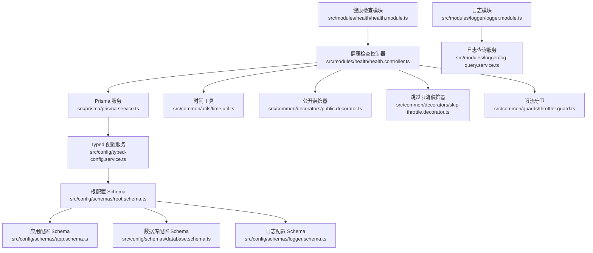
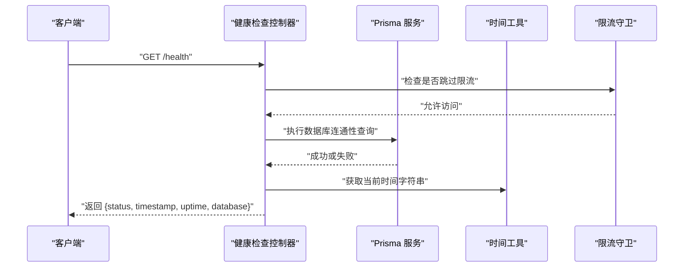
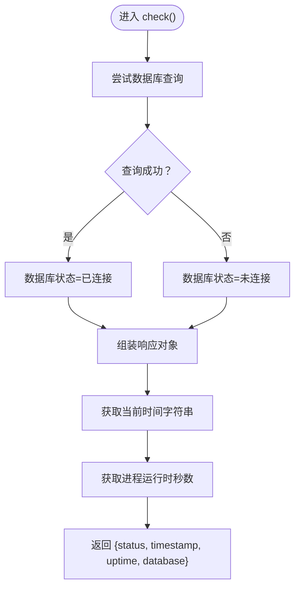
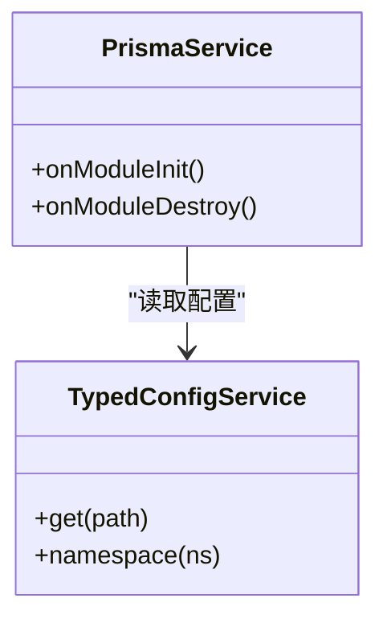
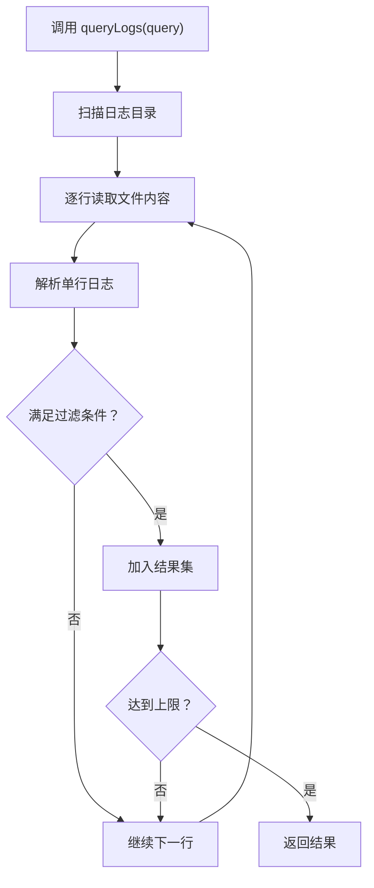
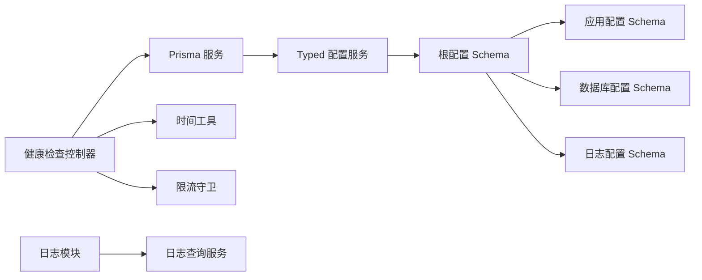

# 健康检查和监控

<cite>
**本文引用的文件**
- [health.controller.ts](file://src/modules/health/health.controller.ts)
- [health.module.ts](file://src/modules/health/health.module.ts)
- [prisma.service.ts](file://src/prisma/prisma.service.ts)
- [time.util.ts](file://src/common/utils/time.util.ts)
- [public.decorator.ts](file://src/common/decorators/public.decorator.ts)
- [skip-throttle.decorator.ts](file://src/common/decorators/skip-throttle.decorator.ts)
- [throttler.guard.ts](file://src/common/guards/throttler.guard.ts)
- [typed-config.service.ts](file://src/config/typed-config.service.ts)
- [root.schema.ts](file://src/config/schemas/root.schema.ts)
- [app.schema.ts](file://src/config/schemas/app.schema.ts)
- [database.schema.ts](file://src/config/schemas/database.schema.ts)
- [logger.schema.ts](file://src/config/schemas/logger.schema.ts)
- [log-query.service.ts](file://src/modules/logger/log-query.service.ts)
- [logger.module.ts](file://src/modules/logger/logger.module.ts)
- [http-exception.filter.ts](file://src/common/filters/http-exception.filter.ts)
- [package.json](file://package.json)
</cite>

## 目录

1. [简介](#简介)
2. [项目结构](#项目结构)
3. [核心组件](#核心组件)
4. [架构总览](#架构总览)
5. [详细组件分析](#详细组件分析)
6. [依赖关系分析](#依赖关系分析)
7. [性能考量](#性能考量)
8. [故障排查指南](#故障排查指南)
9. [结论](#结论)
10. [附录](#附录)

## 简介

本文件面向健康检查与监控系统，聚焦以下目标：

- 解释健康检查端点的实现方式与返回结构
- 说明系统状态监控与性能指标采集现状与扩展路径
- 梳理健康检查控制器的监控维度（数据库连接、时间戳与运行时信息）
- 给出配置项、自定义监控指标建议、告警阈值设定思路与可视化展示建议
- 提供监控最佳实践与常见问题排查步骤

当前仓库实现了基础健康检查与 Ping 端点，以及日志查询能力；数据库连接检查通过 Prisma 客户端执行简单查询完成。其余维度（如内存、磁盘、外部服务）暂未在代码中实现，将在“扩展建议”中给出落地方案。

## 项目结构

与健康检查和监控相关的关键模块与文件如下：

- 健康检查模块：包含控制器与模块装配
- 数据库访问：通过 Prisma 服务连接数据库
- 时间工具：统一格式化当前时间
- 访问控制与限流：公开端点与跳过限流策略
- 配置体系：根配置聚合、应用、数据库、日志等 Schema
- 日志查询：按条件检索本地日志文件
- 异常过滤：统一错误响应格式

**图表来源**

- [health.controller.ts:1-86](file://src/modules/health/health.controller.ts#L1-L86)
- [health.module.ts:1-10](file://src/modules/health/health.module.ts#L1-L10)
- [prisma.service.ts:1-44](file://src/prisma/prisma.service.ts#L1-L44)
- [time.util.ts:1-72](file://src/common/utils/time.util.ts#L1-L72)
- [public.decorator.ts:1-5](file://src/common/decorators/public.decorator.ts#L1-L5)
- [skip-throttle.decorator.ts:1-12](file://src/common/decorators/skip-throttle.decorator.ts#L1-L12)
- [throttler.guard.ts:1-33](file://src/common/guards/throttler.guard.ts#L1-L33)
- [typed-config.service.ts:1-48](file://src/config/typed-config.service.ts#L1-L48)
- [root.schema.ts:1-21](file://src/config/schemas/root.schema.ts#L1-L21)
- [app.schema.ts:1-12](file://src/config/schemas/app.schema.ts#L1-L12)
- [database.schema.ts:1-11](file://src/config/schemas/database.schema.ts#L1-L11)
- [logger.schema.ts:1-13](file://src/config/schemas/logger.schema.ts#L1-L13)
- [log-query.service.ts:1-129](file://src/modules/logger/log-query.service.ts#L1-L129)
- [logger.module.ts:1-9](file://src/modules/logger/logger.module.ts#L1-L9)

**章节来源**

- [health.controller.ts:1-86](file://src/modules/health/health.controller.ts#L1-L86)
- [health.module.ts:1-10](file://src/modules/health/health.module.ts#L1-L10)
- [prisma.service.ts:1-44](file://src/prisma/prisma.service.ts#L1-L44)
- [time.util.ts:1-72](file://src/common/utils/time.util.ts#L1-L72)
- [typed-config.service.ts:1-48](file://src/config/typed-config.service.ts#L1-L48)
- [root.schema.ts:1-21](file://src/config/schemas/root.schema.ts#L1-L21)
- [app.schema.ts:1-12](file://src/config/schemas/app.schema.ts#L1-L12)
- [database.schema.ts:1-11](file://src/config/schemas/database.schema.ts#L1-L11)
- [logger.schema.ts:1-13](file://src/config/schemas/logger.schema.ts#L1-L13)
- [log-query.service.ts:1-129](file://src/modules/logger/log-query.service.ts#L1-L129)
- [logger.module.ts:1-9](file://src/modules/logger/logger.module.ts#L1-L9)

## 核心组件

- 健康检查控制器
  - 提供 GET /health（健康检查）与 GET /health/ping（心跳）两个端点
  - 健康检查返回状态、时间戳、运行时长、数据库连接状态
  - Ping 端点返回固定字符串，用于探测服务可达性
- 数据库连接检查
  - 通过 Prisma 执行一次轻量查询，捕获异常以判断连接状态
- 时间与运行时信息
  - 使用时间工具函数生成当前时间字符串
  - 使用进程运行时秒数表示服务运行时长
- 公开与限流策略
  - 健康检查端点标记为公开且跳过限流，避免被限流策略阻断
- 配置体系
  - 根配置聚合应用、数据库、JWT、日志等命名空间
  - TypedConfigService 支持点语法读取配置
- 日志查询
  - 支持按级别、关键词、时间范围、模块过滤，读取本地日志文件

**章节来源**

- [health.controller.ts:14-84](file://src/modules/health/health.controller.ts#L14-L84)
- [prisma.service.ts:36-42](file://src/prisma/prisma.service.ts#L36-L42)
- [time.util.ts:65-67](file://src/common/utils/time.util.ts#L65-L67)
- [public.decorator.ts:1-5](file://src/common/decorators/public.decorator.ts#L1-L5)
- [skip-throttle.decorator.ts:1-12](file://src/common/decorators/skip-throttle.decorator.ts#L1-L12)
- [throttler.guard.ts:20-31](file://src/common/guards/throttler.guard.ts#L20-L31)
- [typed-config.service.ts:23-46](file://src/config/typed-config.service.ts#L23-L46)
- [root.schema.ts:10-21](file://src/config/schemas/root.schema.ts#L10-L21)
- [log-query.service.ts:31-90](file://src/modules/logger/log-query.service.ts#L31-L90)

## 架构总览

健康检查与监控的端到端流程如下：

**图表来源**

- [health.controller.ts:48-63](file://src/modules/health/health.controller.ts#L48-L63)
- [prisma.service.ts:36-42](file://src/prisma/prisma.service.ts#L36-L42)
- [time.util.ts:65-67](file://src/common/utils/time.util.ts#L65-L67)
- [throttler.guard.ts:20-31](file://src/common/guards/throttler.guard.ts#L20-L31)

## 详细组件分析

### 健康检查控制器

- 端点设计
  - GET /health：返回服务整体健康状态与数据库连接状态
  - GET /health/ping：返回固定字符串，用于存活探测
- 健康状态判定
  - 数据库连通性：通过一次查询尝试判断；成功则状态为 ok，否则 degraded
  - 时间戳与运行时：使用时间工具与进程运行时
- 访问控制
  - 使用公开装饰器与跳过限流装饰器，确保健康检查高可用
- Swagger 文档
  - 通过注解声明请求与响应结构，便于集成平台自动发现

**图表来源**

- [health.controller.ts:48-63](file://src/modules/health/health.controller.ts#L48-L63)
- [time.util.ts:65-67](file://src/common/utils/time.util.ts#L65-L67)

**章节来源**

- [health.controller.ts:14-84](file://src/modules/health/health.controller.ts#L14-L84)
- [public.decorator.ts:1-5](file://src/common/decorators/public.decorator.ts#L1-L5)
- [skip-throttle.decorator.ts:1-12](file://src/common/decorators/skip-throttle.decorator.ts#L1-L12)

### 数据库连接检查

- 实现方式
  - 在模块初始化阶段建立连接，在销毁阶段断开
  - 健康检查时执行一次轻量查询，捕获异常以判断连接可用性
- 配置来源
  - 通过 TypedConfigService 读取数据库提供方与连接地址
  - SQLite 使用 Better SQLite3 适配器，PostgreSQL 由 Prisma 配置管理

**图表来源**

- [prisma.service.ts:18-42](file://src/prisma/prisma.service.ts#L18-L42)
- [typed-config.service.ts:23-46](file://src/config/typed-config.service.ts#L23-L46)

**章节来源**

- [prisma.service.ts:1-44](file://src/prisma/prisma.service.ts#L1-L44)
- [typed-config.service.ts:1-48](file://src/config/typed-config.service.ts#L1-L48)
- [database.schema.ts:1-11](file://src/config/schemas/database.schema.ts#L1-L11)

### 时间与运行时信息

- 当前时间字符串：用于记录健康检查执行时刻
- 进程运行时：用于展示服务持续运行时长

**章节来源**

- [time.util.ts:65-67](file://src/common/utils/time.util.ts#L65-L67)

### 公开与限流策略

- 公开端点：健康检查不需鉴权
- 跳过限流：健康检查端点绕过限流守卫，避免误伤
- 限流守卫：基于反射读取元数据决定是否放行

**章节来源**

- [public.decorator.ts:1-5](file://src/common/decorators/public.decorator.ts#L1-L5)
- [skip-throttle.decorator.ts:1-12](file://src/common/decorators/skip-throttle.decorator.ts#L1-L12)
- [throttler.guard.ts:20-31](file://src/common/guards/throttler.guard.ts#L20-L31)

### 日志查询服务

- 功能概述
  - 读取指定目录下的日志文件，按级别、关键词、时间范围、模块过滤
  - 支持获取最近日志与错误日志
- 文件解析
  - 解析每行日志，提取时间、级别、模块与消息
- 性能注意
  - 默认限制扫描文件数量与结果条数，避免大体量日志带来的 IO 压力

**图表来源**

- [log-query.service.ts:31-90](file://src/modules/logger/log-query.service.ts#L31-L90)
- [log-query.service.ts:105-119](file://src/modules/logger/log-query.service.ts#L105-L119)

**章节来源**

- [log-query.service.ts:1-129](file://src/modules/logger/log-query.service.ts#L1-L129)
- [logger.schema.ts:1-13](file://src/config/schemas/logger.schema.ts#L1-L13)

## 依赖关系分析

- 控制器依赖 Prisma 服务进行数据库连通性检查
- 控制器依赖时间工具生成时间戳
- 控制器依赖装饰器与守卫实现公开与限流策略
- Prisma 服务依赖 TypedConfigService 读取数据库配置
- 配置体系通过根 Schema 聚合各子配置，提供类型安全的读取能力
- 日志模块提供日志查询能力，供监控与排障使用

**图表来源**

- [health.controller.ts:1-86](file://src/modules/health/health.controller.ts#L1-L86)
- [prisma.service.ts:1-44](file://src/prisma/prisma.service.ts#L1-L44)
- [typed-config.service.ts:1-48](file://src/config/typed-config.service.ts#L1-L48)
- [root.schema.ts:10-21](file://src/config/schemas/root.schema.ts#L10-L21)
- [logger.module.ts:1-9](file://src/modules/logger/logger.module.ts#L1-L9)
- [log-query.service.ts:1-129](file://src/modules/logger/log-query.service.ts#L1-L129)

**章节来源**

- [health.controller.ts:1-86](file://src/modules/health/health.controller.ts#L1-L86)
- [prisma.service.ts:1-44](file://src/prisma/prisma.service.ts#L1-L44)
- [typed-config.service.ts:1-48](file://src/config/typed-config.service.ts#L1-L48)
- [root.schema.ts:1-21](file://src/config/schemas/root.schema.ts#L1-L21)
- [logger.module.ts:1-9](file://src/modules/logger/logger.module.ts#L1-L9)
- [log-query.service.ts:1-129](file://src/modules/logger/log-query.service.ts#L1-L129)

## 性能考量

- 健康检查端点
  - 查询极轻量，异常捕获成本低，适合高频探测
  - 已通过装饰器与守卫确保不受速率限制影响
- 日志查询
  - 默认限制扫描文件数量与结果条数，避免高负载
  - 建议仅在排障场景使用，生产环境谨慎开启大范围日志检索
- 数据库连接
  - 初始化与销毁阶段进行连接/断开，避免在热路径重复连接
- 时间与运行时
  - 本地计算，开销可忽略

[本节为通用指导，无需列出具体文件来源]

## 故障排查指南

- 健康检查返回 degraded
  - 检查数据库连接配置与网络连通性
  - 查看 Prisma 初始化日志与连接状态
  - 使用 Ping 端点确认服务可达性
- 日志查询无结果
  - 确认日志目录配置正确
  - 检查过滤条件（级别、关键词、时间范围、模块）是否过于严格
  - 确认日志文件存在且未被清理
- 错误响应格式
  - 系统通过统一异常过滤器输出业务码与消息，便于监控平台识别与告警
- 限流导致健康检查失败
  - 确认健康检查端点已标记为公开并跳过限流

**章节来源**

- [health.controller.ts:48-84](file://src/modules/health/health.controller.ts#L48-L84)
- [log-query.service.ts:31-90](file://src/modules/logger/log-query.service.ts#L31-L90)
- [http-exception.filter.ts:28-78](file://src/common/filters/http-exception.filter.ts#L28-L78)
- [throttler.guard.ts:20-31](file://src/common/guards/throttler.guard.ts#L20-L31)

## 结论

本项目提供了简洁可靠的健康检查与 Ping 端点，并通过配置驱动与日志查询能力支撑日常运维。当前实现聚焦数据库连通性与基本运行时信息。若需进一步完善监控体系，可在现有基础上扩展内存、磁盘、外部服务等多维指标采集，并结合可视化与告警机制形成闭环。

[本节为总结性内容，无需列出具体文件来源]

## 附录

### 健康检查端点定义

- GET /health
  - 返回字段：status、timestamp、uptime、database
  - 状态说明：ok 表示正常，degraded 表示降级
- GET /health/ping
  - 返回字段：message（固定值）

**章节来源**

- [health.controller.ts:17-47](file://src/modules/health/health.controller.ts#L17-L47)
- [health.controller.ts:67-81](file://src/modules/health/health.controller.ts#L67-L81)

### 配置选项与默认值

- 应用配置
  - nodeEnv：开发/生产/测试，默认 development
  - port：端口，默认 3000
  - apiPrefix：API 前缀，默认 api/v1
  - corsOrigin：跨域来源，默认 \*
  - enableSwagger：是否启用 Swagger，默认 true
- 数据库配置
  - provider：sqlite/postgresql，默认 sqlite
  - url：数据库连接地址（必填）
  - maxConnections：最大连接数，默认 10
  - logging：是否打印 SQL，默认 false
- 日志配置
  - loggerDir：日志目录，默认 logs
  - loggerLevel：日志级别，默认 info
  - loggerEnableFile：是否启用文件输出，默认 false
  - loggerMaxFiles：保留日志文件数量，默认 7
  - loggerMaxSize：单文件最大大小，默认 20m

**章节来源**

- [app.schema.ts:3-9](file://src/config/schemas/app.schema.ts#L3-L9)
- [database.schema.ts:3-8](file://src/config/schemas/database.schema.ts#L3-L8)
- [logger.schema.ts:4-10](file://src/config/schemas/logger.schema.ts#L4-L10)

### 自定义监控指标建议

- 内存使用
  - 可通过 Node.js 进程 API 获取堆与外部内存统计，定期上报
- 磁盘空间
  - 读取文件系统使用情况，设置阈值告警
- 外部服务可用性
  - 对关键上游/下游服务发起探测请求，记录成功率与延迟
- 请求指标
  - 统计请求总量、错误率、P95/P99 延迟、并发数
- 建议采集频率
  - 健康检查：每 10–30 秒
  - 指标采集：每 1–5 分钟（视粒度而定）

[本节为扩展建议，无需列出具体文件来源]

### 告警阈值设置思路

- 数据库连接
  - 连续失败次数阈值（例如 3 次），或失败比例阈值（例如 5 分钟内 >10%）
- 健康检查状态
  - degraded 持续超过阈值（例如 2 分钟）触发告警
- 运行时长
  - 与基线对比，异常重启或长时间运行需关注
- 外部服务
  - 延迟超过 P95 阈值或错误率超阈值触发

[本节为通用指导，无需列出具体文件来源]

### 监控数据可视化建议

- 面板维度
  - 服务状态趋势、数据库连接状态、错误日志趋势、外部服务可用性
- 图表类型
  - 折线图（趋势）、状态指示器（实时状态）、热力图（错误分布）
- 平台对接
  - Prometheus + Grafana 或云监控平台均可接入现有指标与日志

[本节为通用指导，无需列出具体文件来源]

### 依赖与版本参考

- 关键依赖
  - @nestjs/throttler：速率限制与守卫
  - @prisma/client、@prisma/adapter-better-sqlite3：数据库 ORM 与适配器
  - winston、winston-daily-rotate-file：日志记录与轮转
  - swagger-ui-express、@nestjs/swagger：接口文档
  - nestjs-zod、zod：配置与输入校验

**章节来源**

- [package.json:26-54](file://package.json#L26-L54)
