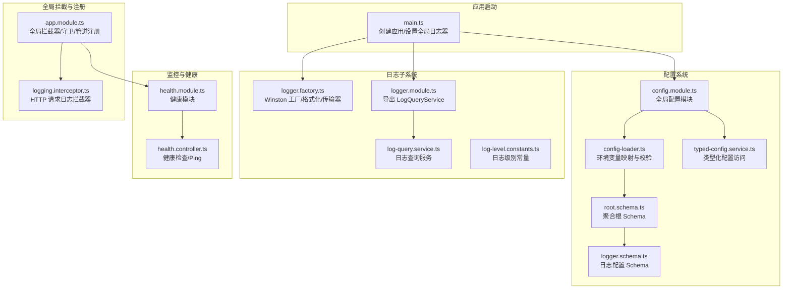
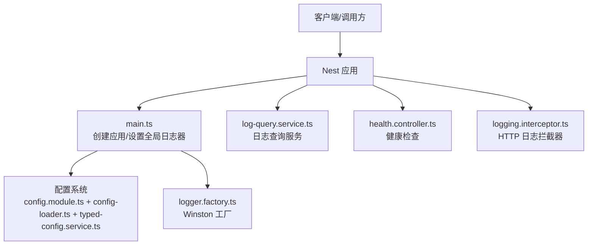
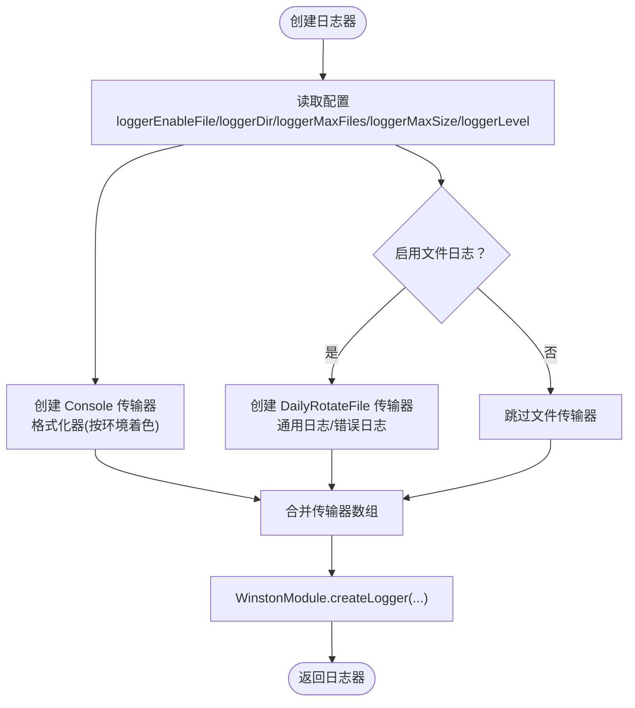
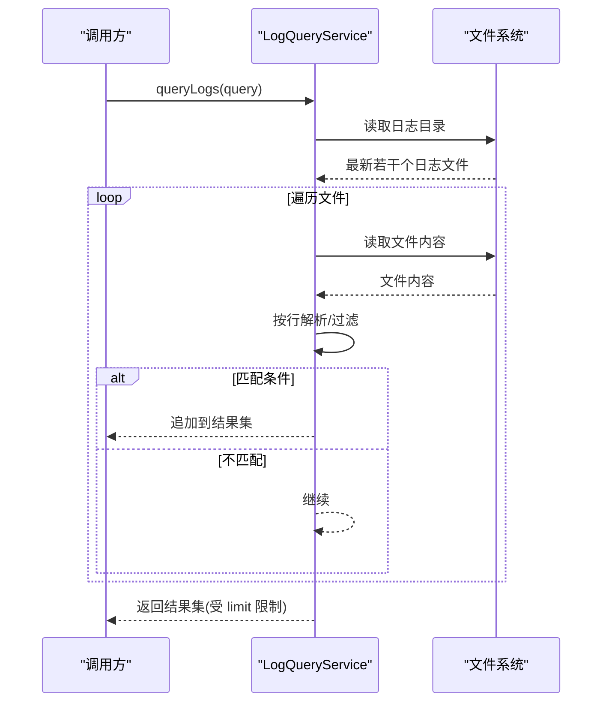
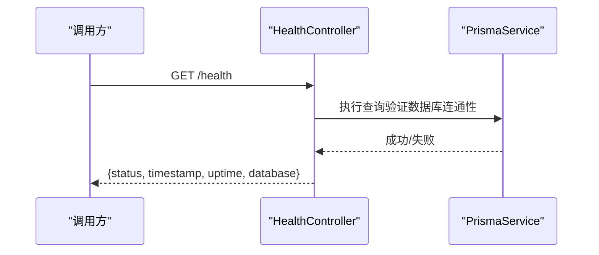
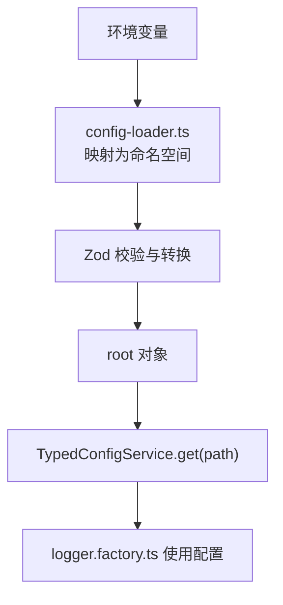
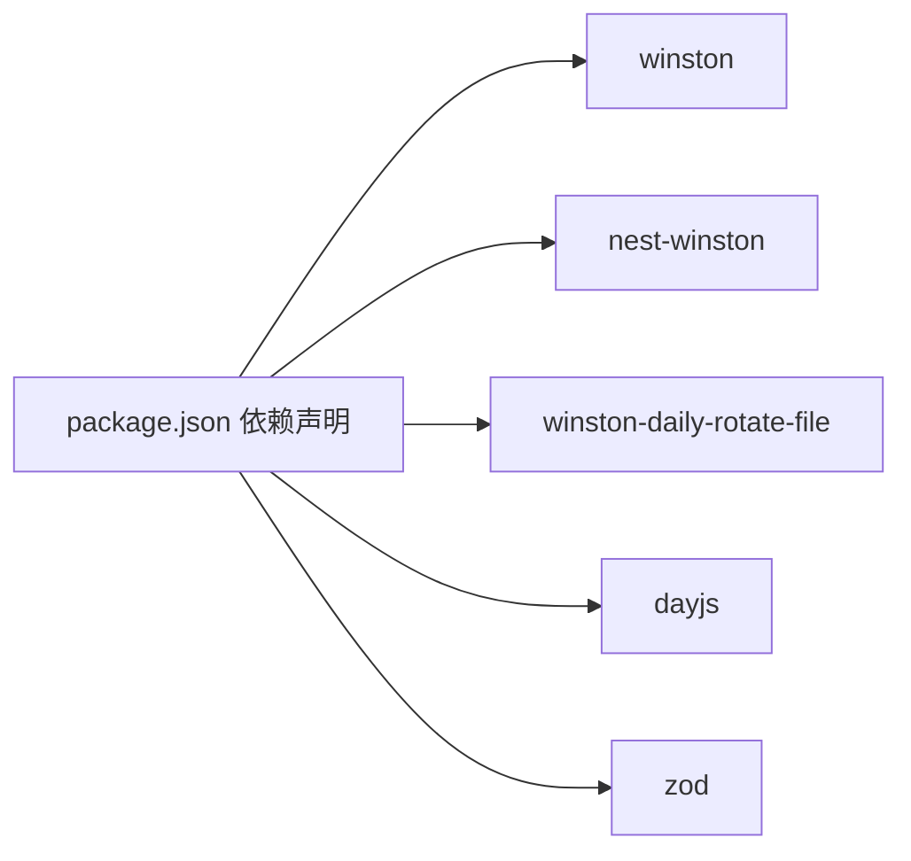

# 日志和监控系统

<cite>
**本文引用的文件**
- [src/modules/logger/logger.module.ts](file://src/modules/logger/logger.module.ts)
- [src/modules/logger/logger.factory.ts](file://src/modules/logger/logger.factory.ts)
- [src/modules/logger/log-query.service.ts](file://src/modules/logger/log-query.service.ts)
- [src/common/constants/log-level.constants.ts](file://src/common/constants/log-level.constants.ts)
- [src/modules/health/health.module.ts](file://src/modules/health/health.module.ts)
- [src/modules/health/health.controller.ts](file://src/modules/health/health.controller.ts)
- [src/common/interceptors/logging.interceptor.ts](file://src/common/interceptors/logging.interceptor.ts)
- [src/config/schemas/logger.schema.ts](file://src/config/schemas/logger.schema.ts)
- [src/config/typed-config.service.ts](file://src/config/typed-config.service.ts)
- [src/config/config.module.ts](file://src/config/config.module.ts)
- [src/config/schemas/root.schema.ts](file://src/config/schemas/root.schema.ts)
- [src/config/config-loader.ts](file://src/config/config-loader.ts)
- [src/app.module.ts](file://src/app.module.ts)
- [src/main.ts](file://src/main.ts)
- [package.json](file://package.json)
</cite>

## 目录

1. [简介](#简介)
2. [项目结构](#项目结构)
3. [核心组件](#核心组件)
4. [架构总览](#架构总览)
5. [详细组件分析](#详细组件分析)
6. [依赖关系分析](#依赖关系分析)
7. [性能与可维护性考量](#性能与可维护性考量)
8. [故障排查指南](#故障排查指南)
9. [结论](#结论)
10. [附录](#附录)

## 简介

本文件系统性梳理并说明本项目的日志与监控体系，覆盖以下主题：

- 日志配置与工厂模式：Winston 集成、nest-winston 配置、日志格式化与着色、敏感字段脱敏、控制台与文件传输器、按日轮转与大小限制。
- 结构化日志记录：统一的日志格式、元数据清洗、上下文标识、耗时统计。
- 日志查询服务：基于文件的检索接口，支持关键词、时间范围、级别与模块过滤。
- 健康检查实现：数据库连通性检测、服务运行时长与时间戳输出、公开可用的 Ping 接口。
- 监控最佳实践：性能监控、错误追踪、系统健康状态检查、日志轮转与存储策略、安全与合规。

## 项目结构

围绕日志与监控的关键目录与文件如下：

- 日志模块：logger.factory.ts（工厂）、logger.module.ts（模块导出）、log-query.service.ts（查询服务）
- 健康检查：health.controller.ts（控制器）、health.module.ts（模块）
- 配置系统：config-loader.ts（环境变量映射与校验）、config.module.ts（全局配置模块）、typed-config.service.ts（类型化配置访问）、logger.schema.ts（日志配置 Schema）、root.schema.ts（聚合根 Schema）
- 应用入口：main.ts（创建应用、设置全局日志器、启用 CORS、Swagger）
- 全局拦截器：logging.interceptor.ts（HTTP 请求日志）
- 常量：log-level.constants.ts（日志级别枚举）

图表来源

- [src/main.ts:1-50](file://src/main.ts#L1-L50)
- [src/config/config.module.ts:1-20](file://src/config/config.module.ts#L1-L20)
- [src/config/config-loader.ts:1-53](file://src/config/config-loader.ts#L1-L53)
- [src/config/schemas/root.schema.ts:1-21](file://src/config/schemas/root.schema.ts#L1-L21)
- [src/config/schemas/logger.schema.ts:1-13](file://src/config/schemas/logger.schema.ts#L1-L13)
- [src/modules/logger/logger.factory.ts:1-156](file://src/modules/logger/logger.factory.ts#L1-L156)
- [src/modules/logger/logger.module.ts:1-9](file://src/modules/logger/logger.module.ts#L1-L9)
- [src/modules/logger/log-query.service.ts:1-129](file://src/modules/logger/log-query.service.ts#L1-L129)
- [src/common/constants/log-level.constants.ts:1-10](file://src/common/constants/log-level.constants.ts#L1-L10)
- [src/modules/health/health.controller.ts:1-86](file://src/modules/health/health.controller.ts#L1-L86)
- [src/modules/health/health.module.ts:1-10](file://src/modules/health/health.module.ts#L1-L10)
- [src/common/interceptors/logging.interceptor.ts:1-40](file://src/common/interceptors/logging.interceptor.ts#L1-L40)
- [src/app.module.ts:1-61](file://src/app.module.ts#L1-L61)

章节来源

- [src/main.ts:1-50](file://src/main.ts#L1-L50)
- [src/config/config.module.ts:1-20](file://src/config/config.module.ts#L1-L20)
- [src/config/config-loader.ts:1-53](file://src/config/config-loader.ts#L1-L53)
- [src/config/schemas/root.schema.ts:1-21](file://src/config/schemas/root.schema.ts#L1-L21)
- [src/config/schemas/logger.schema.ts:1-13](file://src/config/schemas/logger.schema.ts#L1-L13)
- [src/modules/logger/logger.factory.ts:1-156](file://src/modules/logger/logger.factory.ts#L1-L156)
- [src/modules/logger/logger.module.ts:1-9](file://src/modules/logger/logger.module.ts#L1-L9)
- [src/modules/logger/log-query.service.ts:1-129](file://src/modules/logger/log-query.service.ts#L1-L129)
- [src/common/constants/log-level.constants.ts:1-10](file://src/common/constants/log-level.constants.ts#L1-L10)
- [src/modules/health/health.controller.ts:1-86](file://src/modules/health/health.controller.ts#L1-L86)
- [src/modules/health/health.module.ts:1-10](file://src/modules/health/health.module.ts#L1-L10)
- [src/common/interceptors/logging.interceptor.ts:1-40](file://src/common/interceptors/logging.interceptor.ts#L1-L40)
- [src/app.module.ts:1-61](file://src/app.module.ts#L1-L61)

## 核心组件

- Winston 日志工厂与格式化
  - 工厂函数根据配置动态创建日志器，支持开发/生产差异化着色与无色格式。
  - 控制台传输器与文件传输器（按日轮转），分别用于通用日志与错误日志。
  - 自定义格式化器包含时间戳、级别、上下文、消息、耗时与元数据，同时对敏感字段进行脱敏处理。
- 日志查询服务
  - 提供最近日志、错误日志与带条件的查询能力，支持关键字、时间范围、模块与级别过滤。
  - 从日志目录读取最新若干个日志文件，逐行解析并构建结构化条目。
- 健康检查控制器
  - 提供健康状态与 Ping 接口，包含服务状态、时间戳、运行时长与数据库连通性。
- 全局 HTTP 日志拦截器
  - 记录请求开始与结束的上下文信息（方法、URL、用户、IP、UA、状态码、耗时）。
- 类型化配置系统
  - 使用 Zod 对环境变量进行严格校验与转换，暴露类型安全的配置访问接口。

章节来源

- [src/modules/logger/logger.factory.ts:114-156](file://src/modules/logger/logger.factory.ts#L114-L156)
- [src/modules/logger/log-query.service.ts:31-90](file://src/modules/logger/log-query.service.ts#L31-L90)
- [src/modules/health/health.controller.ts:48-63](file://src/modules/health/health.controller.ts#L48-L63)
- [src/common/interceptors/logging.interceptor.ts:16-38](file://src/common/interceptors/logging.interceptor.ts#L16-L38)
- [src/config/typed-config.service.ts:23-38](file://src/config/typed-config.service.ts#L23-L38)

## 架构总览

下图展示日志与监控在系统中的位置与交互：

图表来源

- [src/main.ts:1-50](file://src/main.ts#L1-L50)
- [src/config/config.module.ts:1-20](file://src/config/config.module.ts#L1-L20)
- [src/config/config-loader.ts:1-53](file://src/config/config-loader.ts#L1-L53)
- [src/config/typed-config.service.ts:1-48](file://src/config/typed-config.service.ts#L1-L48)
- [src/modules/logger/logger.factory.ts:1-156](file://src/modules/logger/logger.factory.ts#L1-L156)
- [src/modules/logger/log-query.service.ts:1-129](file://src/modules/logger/log-query.service.ts#L1-L129)
- [src/modules/health/health.controller.ts:1-86](file://src/modules/health/health.controller.ts#L1-L86)
- [src/common/interceptors/logging.interceptor.ts:1-40](file://src/common/interceptors/logging.interceptor.ts#L1-L40)

## 详细组件分析

### 日志工厂与 Winston 集成

- 功能要点
  - 依据环境变量决定是否启用文件日志、日志目录、最大文件数与最大尺寸。
  - 控制台传输器在开发环境启用颜色，在生产环境禁用颜色。
  - 文件传输器使用按日轮转策略，分别生成通用日志与错误日志文件。
  - 自定义格式化器包含时间戳、级别、上下文、消息、耗时与元数据；对敏感字段进行递归脱敏。
- 关键路径
  - 工厂函数与传输器创建：[src/modules/logger/logger.factory.ts:114-156](file://src/modules/logger/logger.factory.ts#L114-L156)
  - 敏感字段列表与脱敏逻辑：[src/modules/logger/logger.factory.ts:14-38](file://src/modules/logger/logger.factory.ts#L14-L38)
  - 格式化器组合与渲染：[src/modules/logger/logger.factory.ts:40-112](file://src/modules/logger/logger.factory.ts#L40-L112)

图表来源

- [src/modules/logger/logger.factory.ts:114-156](file://src/modules/logger/logger.factory.ts#L114-L156)

章节来源

- [src/modules/logger/logger.factory.ts:14-38](file://src/modules/logger/logger.factory.ts#L14-L38)
- [src/modules/logger/logger.factory.ts:40-112](file://src/modules/logger/logger.factory.ts#L40-L112)
- [src/modules/logger/logger.factory.ts:114-156](file://src/modules/logger/logger.factory.ts#L114-L156)

### 日志查询服务

- 功能要点
  - 支持最近日志、错误日志与带条件的查询，包括级别、关键词、模块、时间范围与数量上限。
  - 从日志目录读取最新若干个日志文件，逐行解析并构建结构化条目。
  - 解析正则匹配时间戳、级别、模块与消息，保留原始行以支持全文检索。
- 关键路径
  - 查询入口与过滤逻辑：[src/modules/logger/log-query.service.ts:31-90](file://src/modules/logger/log-query.service.ts#L31-L90)
  - 文件扫描与排序：[src/modules/logger/log-query.service.ts:92-103](file://src/modules/logger/log-query.service.ts#L92-L103)
  - 行解析与结构化输出：[src/modules/logger/log-query.service.ts:105-119](file://src/modules/logger/log-query.service.ts#L105-L119)

图表来源

- [src/modules/logger/log-query.service.ts:31-90](file://src/modules/logger/log-query.service.ts#L31-L90)
- [src/modules/logger/log-query.service.ts:92-103](file://src/modules/logger/log-query.service.ts#L92-L103)
- [src/modules/logger/log-query.service.ts:105-119](file://src/modules/logger/log-query.service.ts#L105-L119)

章节来源

- [src/modules/logger/log-query.service.ts:31-90](file://src/modules/logger/log-query.service.ts#L31-L90)
- [src/modules/logger/log-query.service.ts:92-103](file://src/modules/logger/log-query.service.ts#L92-L103)
- [src/modules/logger/log-query.service.ts:105-119](file://src/modules/logger/log-query.service.ts#L105-L119)

### 健康检查控制器

- 功能要点
  - 健康检查接口：执行数据库连通性测试，返回服务状态、时间戳、运行时长与数据库状态。
  - Ping 接口：简单响应“pong”，便于外部探活。
  - 公开访问与限流豁免装饰器确保健康检查不受限流影响。
- 关键路径
  - 健康检查逻辑：[src/modules/health/health.controller.ts:48-63](file://src/modules/health/health.controller.ts#L48-L63)
  - Ping 接口：[src/modules/health/health.controller.ts:82-84](file://src/modules/health/health.controller.ts#L82-L84)

图表来源

- [src/modules/health/health.controller.ts:48-63](file://src/modules/health/health.controller.ts#L48-L63)

章节来源

- [src/modules/health/health.controller.ts:48-63](file://src/modules/health/health.controller.ts#L48-L63)
- [src/modules/health/health.controller.ts:82-84](file://src/modules/health/health.controller.ts#L82-L84)

### 全局 HTTP 日志拦截器

- 功能要点
  - 在请求进入与响应完成时记录上下文信息，包括方法、URL、用户 ID、IP、UA、状态码与耗时。
  - 使用专用 Logger 名称“HTTP”以便与其他日志区分。
- 关键路径
  - 拦截器实现：[src/common/interceptors/logging.interceptor.ts:16-38](file://src/common/interceptors/logging.interceptor.ts#L16-L38)

章节来源

- [src/common/interceptors/logging.interceptor.ts:16-38](file://src/common/interceptors/logging.interceptor.ts#L16-L38)

### 配置系统与类型化访问

- 功能要点
  - 环境变量映射为分层命名空间，使用 Zod 进行严格校验与类型转换。
  - TypedConfigService 提供点语法访问与命名空间对象获取，保证配置读取的安全性与可维护性。
  - 日志配置 Schema 定义了日志目录、级别、开关、最大文件数与最大尺寸等关键参数。
- 关键路径
  - 配置加载与校验：[src/config/config-loader.ts:5-52](file://src/config/config-loader.ts#L5-L52)
  - 类型化访问接口：[src/config/typed-config.service.ts:23-38](file://src/config/typed-config.service.ts#L23-L38)
  - 日志配置 Schema：[src/config/schemas/logger.schema.ts:4-10](file://src/config/schemas/logger.schema.ts#L4-L10)
  - 根 Schema 聚合：[src/config/schemas/root.schema.ts:10-15](file://src/config/schemas/root.schema.ts#L10-L15)

图表来源

- [src/config/config-loader.ts:5-52](file://src/config/config-loader.ts#L5-L52)
- [src/config/typed-config.service.ts:23-38](file://src/config/typed-config.service.ts#L23-L38)
- [src/config/schemas/logger.schema.ts:4-10](file://src/config/schemas/logger.schema.ts#L4-L10)
- [src/modules/logger/logger.factory.ts:114-156](file://src/modules/logger/logger.factory.ts#L114-L156)

章节来源

- [src/config/config-loader.ts:5-52](file://src/config/config-loader.ts#L5-L52)
- [src/config/typed-config.service.ts:23-38](file://src/config/typed-config.service.ts#L23-L38)
- [src/config/schemas/logger.schema.ts:4-10](file://src/config/schemas/logger.schema.ts#L4-L10)
- [src/config/schemas/root.schema.ts:10-15](file://src/config/schemas/root.schema.ts#L10-L15)

### 应用入口与全局注册

- 功能要点
  - 创建应用实例、启用关闭钩子、设置全局前缀与 CORS。
  - 通过 TypedConfigService 读取配置并创建全局日志器，随后设置为 Nest 日志器。
  - 可选启用 Swagger 文档。
- 关键路径
  - 启动流程与全局日志器设置：[src/main.ts:8-47](file://src/main.ts#L8-L47)
  - 全局拦截器与守卫注册：[src/app.module.ts:33-58](file://src/app.module.ts#L33-L58)

章节来源

- [src/main.ts:8-47](file://src/main.ts#L8-L47)
- [src/app.module.ts:33-58](file://src/app.module.ts#L33-L58)

## 依赖关系分析

- 外部依赖
  - Winston 与 nest-winston：日志核心与 Nest 集成。
  - winston-daily-rotate-file：按日轮转文件传输器。
  - dayjs：时间格式化。
  - Zod：配置校验与类型推断。
- 内部耦合
  - main.ts 依赖 TypedConfigService 与 logger.factory.ts。
  - logger.factory.ts 依赖 TypedConfigService 与配置 Schema。
  - log-query.service.ts 依赖 TypedConfigService 与文件系统。
  - health.controller.ts 依赖 PrismaService。
  - app.module.ts 注册全局拦截器与健康模块。

图表来源

- [package.json:26-54](file://package.json#L26-L54)

章节来源

- [package.json:26-54](file://package.json#L26-L54)

## 性能与可维护性考量

- 日志性能
  - 控制台输出在开发环境启用颜色，生产环境禁用颜色，减少不必要的字符处理。
  - 文件传输器采用按日轮转与大小限制，避免单文件过大导致 IO 压力。
  - 日志查询服务限制每次扫描的文件数量与结果集上限，防止高负载。
- 可维护性
  - 类型化配置系统确保配置变更时的编译期检查与自动补全。
  - 日志格式统一且包含上下文与耗时，便于问题定位与性能分析。
  - 健康检查接口简洁明确，便于集成到外部监控系统。
- 安全与合规
  - 敏感字段脱敏策略覆盖嵌套对象，降低日志泄露风险。
  - 健康检查接口公开但不包含敏感信息，遵循最小暴露原则。

## 故障排查指南

- 启动阶段
  - 配置校验失败：检查环境变量是否符合 Zod Schema，关注错误输出并修正。
  - 根配置缺失：确保配置模块正确加载并返回 root 对象。
- 运行阶段
  - 日志未落盘：确认 loggerEnableFile 开关与日志目录权限。
  - 日志查询为空：确认日志目录存在且包含目标日期的日志文件；检查过滤条件是否过于严格。
  - 健康检查失败：检查数据库连接字符串与网络连通性；观察 Prisma 查询是否抛错。
- 建议
  - 在生产环境开启文件日志并设置合理的轮转策略。
  - 使用日志查询服务进行快速检索，结合时间范围与关键字缩小排查范围。
  - 将健康检查接口纳入外部监控与告警系统，设置阈值与通知策略。

章节来源

- [src/config/config-loader.ts:39-46](file://src/config/config-loader.ts#L39-L46)
- [src/config/typed-config.service.ts:14-18](file://src/config/typed-config.service.ts#L14-L18)
- [src/modules/logger/log-query.service.ts:92-103](file://src/modules/logger/log-query.service.ts#L92-L103)
- [src/modules/health/health.controller.ts:48-63](file://src/modules/health/health.controller.ts#L48-L63)

## 结论

本项目的日志与监控体系以类型化配置为基础，结合 Winston 与 nest-winston 实现高性能、可维护的日志记录与查询能力；通过健康检查接口提供系统健康状态的公开视图。建议在生产环境中启用文件日志与轮转策略，配合外部监控与告警系统，持续优化日志格式与查询效率，保障系统的可观测性与稳定性。

## 附录

- 配置项一览（来自日志配置 Schema）
  - loggerDir：日志目录，默认值见 Schema。
  - loggerLevel：日志级别枚举，默认值见 Schema。
  - loggerEnableFile：是否启用文件日志，默认值见 Schema。
  - loggerMaxFiles：保留文件的最大数量，默认值见 Schema。
  - loggerMaxSize：单文件最大大小，默认值见 Schema。
- 日志级别常量
  - 包含 error、warn、info、debug、verbose 等级别，用于统一约束日志输出。

章节来源

- [src/config/schemas/logger.schema.ts:4-10](file://src/config/schemas/logger.schema.ts#L4-L10)
- [src/common/constants/log-level.constants.ts:1-10](file://src/common/constants/log-level.constants.ts#L1-L10)
