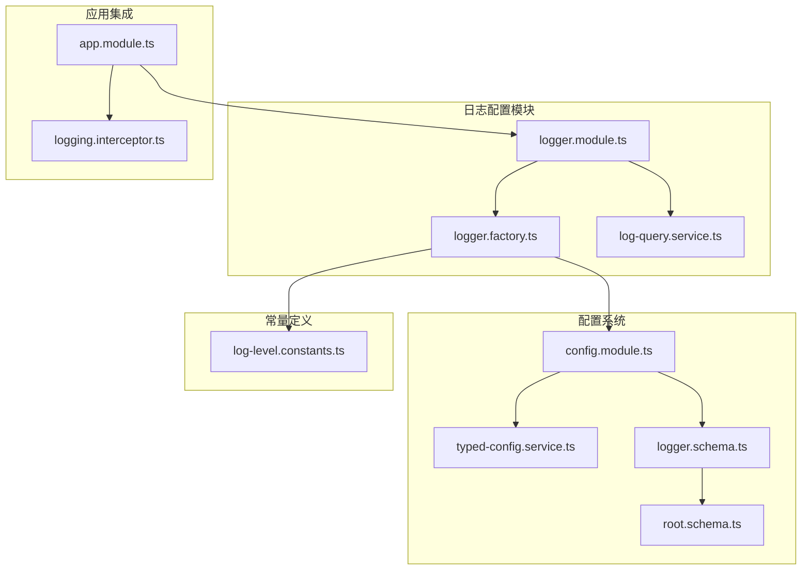
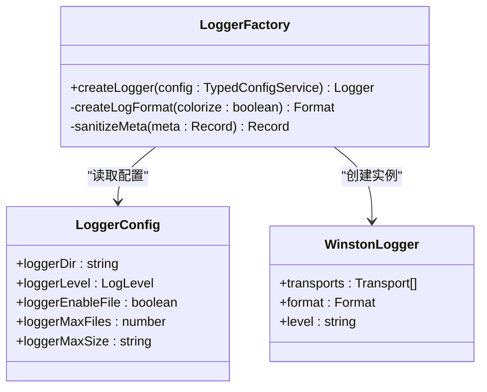
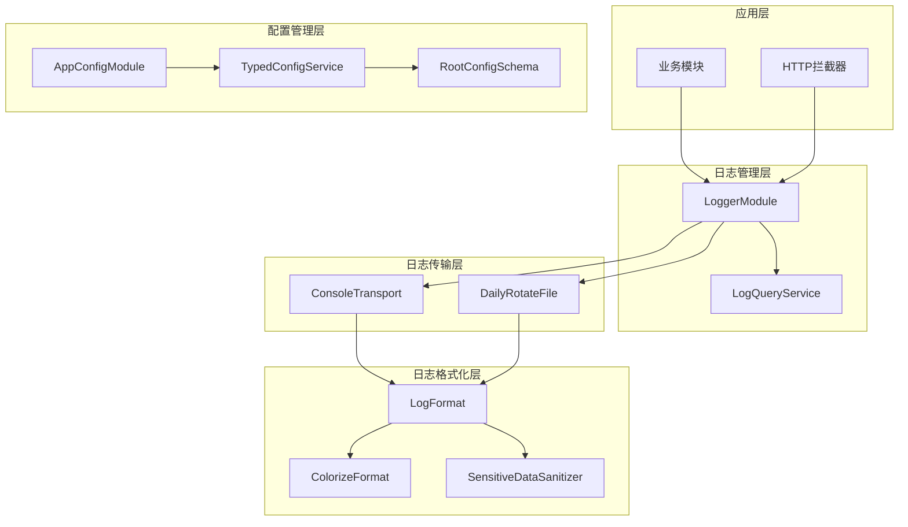
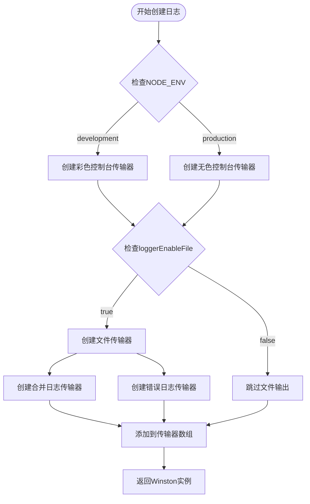
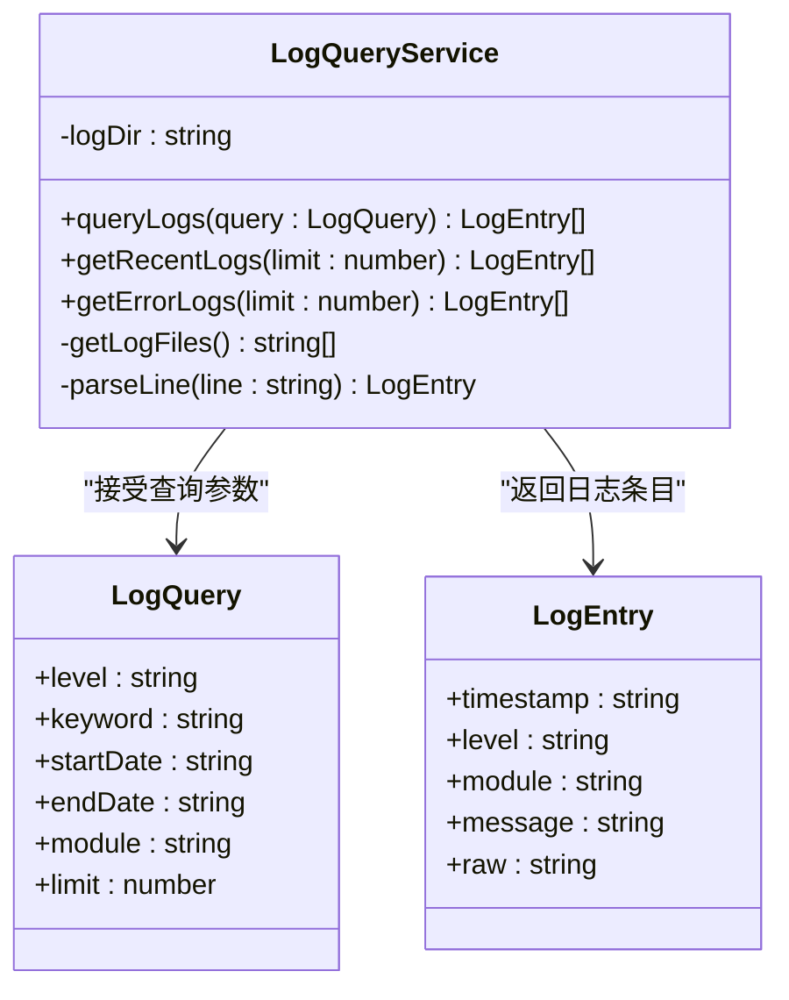
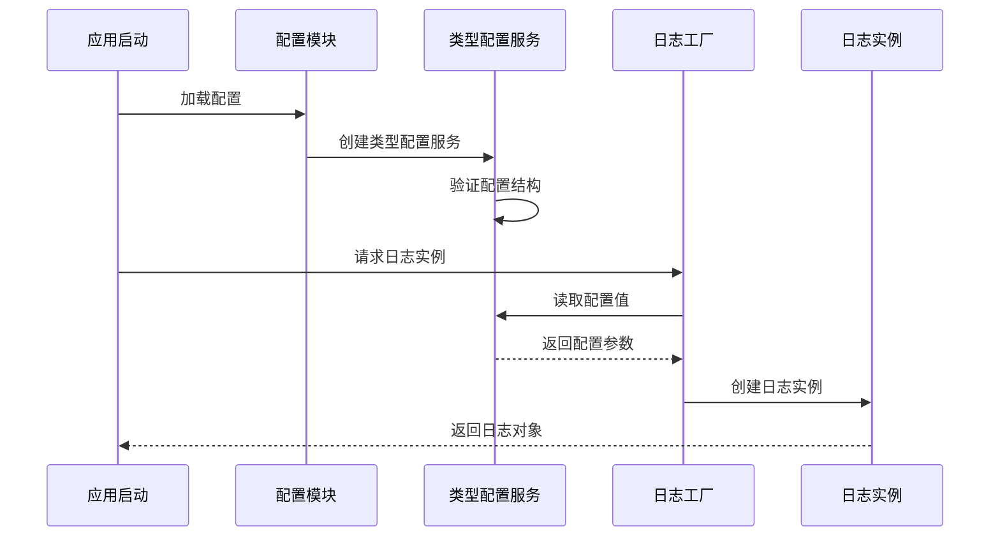
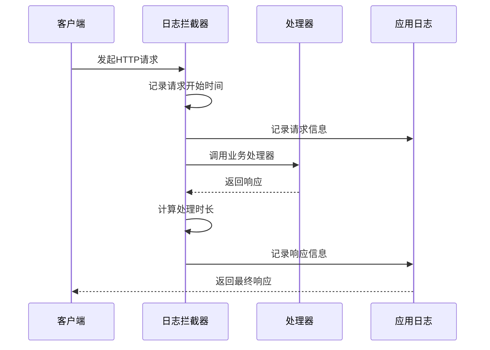
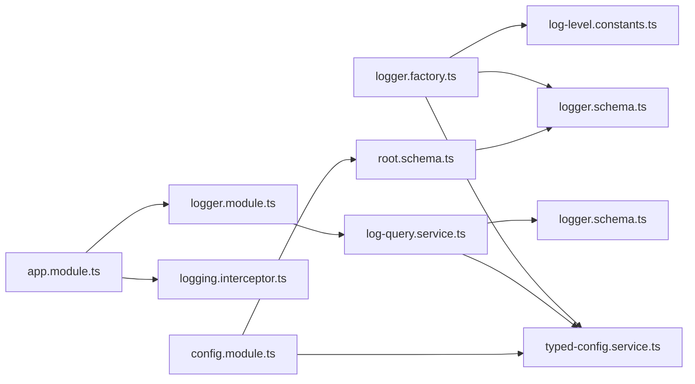
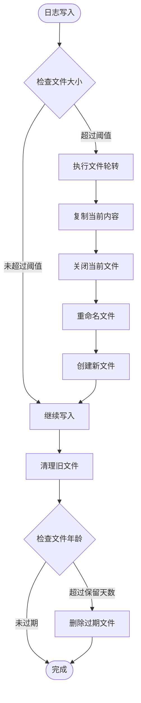

# 日志配置管理

<cite>
**本文档引用的文件**
- [log-level.constants.ts](file://src/common/constants/log-level.constants.ts)
- [logger.factory.ts](file://src/modules/logger/logger.factory.ts)
- [logger.module.ts](file://src/modules/logger/logger.module.ts)
- [log-query.service.ts](file://src/modules/logger/log-query.service.ts)
- [logger.schema.ts](file://src/config/schemas/logger.schema.ts)
- [typed-config.service.ts](file://src/config/typed-config.service.ts)
- [config.module.ts](file://src/config/config.module.ts)
- [logging.interceptor.ts](file://src/common/interceptors/logging.interceptor.ts)
- [root.schema.ts](file://src/config/schemas/root.schema.ts)
- [app.module.ts](file://src/app.module.ts)
- [package.json](file://package.json)
</cite>

## 目录
1. [简介](#简介)
2. [项目结构](#项目结构)
3. [核心组件](#核心组件)
4. [架构概览](#架构概览)
5. [详细组件分析](#详细组件分析)
6. [依赖关系分析](#依赖关系分析)
7. [性能考虑](#性能考虑)
8. [故障排除指南](#故障排除指南)
9. [结论](#结论)

## 简介

本项目采用基于工厂模式的日志系统设计，集成了Winston日志库，提供了灵活的日志配置管理能力。系统通过类型安全的配置服务、可扩展的日志格式化器和多目标输出机制，支持开发、测试和生产环境的不同需求。

该日志系统的核心特性包括：
- 工厂模式的日志实例创建
- 多级日志级别支持（错误、警告、信息、调试、详细）
- 控制台和文件双重输出目标
- 敏感数据自动脱敏处理
- 按日期轮转的日志文件管理
- 基于拦截器的HTTP请求日志记录

## 项目结构

日志相关代码分布在以下关键目录中：

**图表来源**
- [logger.module.ts:1-9](file://src/modules/logger/logger.module.ts#L1-L9)
- [logger.factory.ts:1-156](file://src/modules/logger/logger.factory.ts#L1-L156)
- [config.module.ts:1-20](file://src/config/config.module.ts#L1-L20)

**章节来源**
- [logger.module.ts:1-9](file://src/modules/logger/logger.module.ts#L1-L9)
- [logger.factory.ts:1-156](file://src/modules/logger/logger.factory.ts#L1-L156)
- [config.module.ts:1-20](file://src/config/config.module.ts#L1-L20)

## 核心组件

### 日志级别常量定义

系统定义了标准的五级日志级别，确保跨模块的一致性：

| 级别 | 描述 | 使用场景 |
|------|------|----------|
| Error | 错误级别 | 系统异常、业务逻辑错误、致命问题 |
| Warn | 警告级别 | 可能的问题、不推荐的操作、潜在风险 |
| Info | 信息级别 | 正常业务流程、系统状态变化、功能执行 |
| Debug | 调试级别 | 开发调试信息、详细执行过程、参数检查 |
| Verbose | 详细级别 | 最详细的调试信息、内部系统状态 |

### 日志工厂模式实现

日志工厂采用工厂模式设计，提供统一的日志实例创建接口：

**图表来源**
- [logger.factory.ts:114-156](file://src/modules/logger/logger.factory.ts#L114-L156)
- [logger.schema.ts:4-10](file://src/config/schemas/logger.schema.ts#L4-L10)

**章节来源**
- [log-level.constants.ts:1-10](file://src/common/constants/log-level.constants.ts#L1-L10)
- [logger.factory.ts:114-156](file://src/modules/logger/logger.factory.ts#L114-L156)

## 架构概览

系统采用分层架构设计，实现了配置驱动的日志管理：

**图表来源**
- [app.module.ts:18-61](file://src/app.module.ts#L18-L61)
- [logger.factory.ts:122-156](file://src/modules/logger/logger.factory.ts#L122-L156)
- [config.module.ts:6-20](file://src/config/config.module.ts#L6-L20)

## 详细组件分析

### 日志工厂实现

日志工厂是整个日志系统的核心，负责根据配置动态创建日志实例：

#### 配置驱动的传输器创建

工厂根据配置动态决定是否启用文件输出，并创建相应的传输器：

**图表来源**
- [logger.factory.ts:114-156](file://src/modules/logger/logger.factory.ts#L114-L156)

#### 敏感数据脱敏机制

系统内置敏感数据自动脱敏功能，保护用户隐私：

| 敏感字段类别 | 匹配关键词 | 脱敏处理 |
|-------------|-----------|----------|
| 密码类 | password, secret, passwd | 星号替换 |
| 认证令牌 | token, authorization, cookie | 星号替换 |
| 访问令牌 | accessToken, refreshToken | 星号替换 |

**章节来源**
- [logger.factory.ts:14-38](file://src/modules/logger/logger.factory.ts#L14-L38)
- [logger.factory.ts:114-156](file://src/modules/logger/logger.factory.ts#L114-L156)

### 日志查询服务

日志查询服务提供了强大的日志检索功能：

**图表来源**
- [log-query.service.ts:24-129](file://src/modules/logger/log-query.service.ts#L24-L129)

#### 查询过滤机制

查询服务支持多种过滤条件：

| 过滤类型 | 条件匹配 | 实现方式 |
|---------|---------|----------|
| 级别过滤 | level | 字符串包含匹配 |
| 关键词搜索 | keyword | 大小写不敏感搜索 |
| 时间范围 | startDate/endDate | 日期比较 |
| 模块过滤 | module | 模块名包含匹配 |
| 数量限制 | limit | 结果集截断 |

**章节来源**
- [log-query.service.ts:31-90](file://src/modules/logger/log-query.service.ts#L31-L90)

### 配置系统集成

系统采用Zod验证的类型安全配置方案：

**图表来源**
- [config.module.ts:9-14](file://src/config/config.module.ts#L9-L14)
- [typed-config.service.ts:23-38](file://src/config/typed-config.service.ts#L23-L38)

**章节来源**
- [logger.schema.ts:4-10](file://src/config/schemas/logger.schema.ts#L4-L10)
- [typed-config.service.ts:23-38](file://src/config/typed-config.service.ts#L23-L38)

### HTTP请求日志拦截器

系统通过拦截器自动记录HTTP请求日志：

**图表来源**
- [logging.interceptor.ts:16-38](file://src/common/interceptors/logging.interceptor.ts#L16-L38)

**章节来源**
- [logging.interceptor.ts:16-38](file://src/common/interceptors/logging.interceptor.ts#L16-L38)

## 依赖关系分析

### 外部依赖

系统使用以下关键外部依赖：

| 依赖包 | 版本 | 用途 |
|-------|------|------|
| winston | ^3.19.0 | 核心日志框架 |
| nest-winston | ^1.10.2 | NestJS集成 |
| winston-daily-rotate-file | ^5.0.0 | 日志轮转 |
| dayjs | ^1.11.21 | 时间格式化 |
| zod | ^4.4.3 | 配置验证 |

### 内部依赖关系

**图表来源**
- [logger.factory.ts:1-6](file://src/modules/logger/logger.factory.ts#L1-L6)
- [logger.module.ts:2](file://src/modules/logger/logger.module.ts#L2)
- [app.module.ts:10](file://src/app.module.ts#L10)

**章节来源**
- [package.json:26-55](file://package.json#L26-L55)
- [logger.factory.ts:1-6](file://src/modules/logger/logger.factory.ts#L1-L6)

## 性能考虑

### 异步日志写入

系统采用Winston的异步写入机制，避免阻塞主线程：

- **非阻塞写入**：文件传输器默认异步写入
- **缓冲机制**：批量写入减少磁盘I/O操作
- **内存优化**：合理设置日志级别避免产生大量日志

### 日志轮转策略

**图表来源**
- [logger.factory.ts:129-149](file://src/modules/logger/logger.factory.ts#L129-L149)

### 内存使用优化

- **日志级别过滤**：在传输器层面进行级别过滤
- **元数据清理**：移除不必要的元数据字段
- **字符串化优化**：智能JSON序列化避免循环引用

## 故障排除指南

### 常见问题诊断

#### 日志文件无法创建

**症状**：应用启动时报错，无法创建日志文件

**可能原因**：
1. 日志目录权限不足
2. 配置路径错误
3. 磁盘空间不足

**解决方案**：
1. 检查日志目录存在性和权限
2. 验证配置项 `logger.loggerDir`
3. 确保磁盘有足够的可用空间

#### 日志级别不生效

**症状**：设置的日志级别没有按预期工作

**可能原因**：
1. 配置加载失败
2. 类型转换错误
3. 缓存配置未更新

**解决方案**：
1. 检查配置文件格式
2. 验证Zod schema校验
3. 重启应用使配置生效

#### 敏感数据泄露

**症状**：日志中出现敏感信息

**可能原因**：
1. 新增敏感字段未加入脱敏列表
2. 配置错误导致脱敏失效

**解决方案**：
1. 更新敏感字段列表
2. 检查脱敏函数逻辑
3. 测试敏感数据处理

**章节来源**
- [logger.factory.ts:24-38](file://src/modules/logger/logger.factory.ts#L24-L38)
- [logger.schema.ts:4-10](file://src/config/schemas/logger.schema.ts#L4-L10)

### 性能监控指标

建议监控以下关键指标来评估日志系统性能：

| 指标类型 | 监控方法 | 告警阈值 |
|---------|---------|---------|
| 日志写入延迟 | 监控日志写入耗时 | >100ms |
| 磁盘使用率 | 监控日志目录空间 | >80% |
| 文件数量 | 统计日志文件数量 | >100个 |
| 内存占用 | 监控进程内存使用 | >500MB |
| 错误日志比例 | 统计错误级别日志占比 | >5% |

## 结论

本项目的日志配置管理系统采用了现代化的设计理念，通过工厂模式、类型安全配置和多目标输出机制，提供了强大而灵活的日志管理能力。

### 主要优势

1. **类型安全**：完整的Zod配置验证和TypeScript类型推导
2. **可扩展性**：模块化的组件设计支持自定义扩展
3. **性能优化**：异步写入和智能缓存机制
4. **安全性**：内置敏感数据脱敏和访问控制
5. **易用性**：简化的配置接口和丰富的使用场景

### 最佳实践建议

1. **开发环境**：启用详细日志级别，开启彩色输出
2. **测试环境**：使用文件输出便于调试，设置合理的保留策略
3. **生产环境**：严格控制日志级别，定期清理过期文件
4. **监控集成**：结合外部监控系统实现实时告警
5. **合规要求**：定期审计日志内容，确保符合数据保护法规

该系统为不同规模的应用提供了完整的日志解决方案，既满足了开发调试的需求，又保证了生产环境的稳定性和安全性。