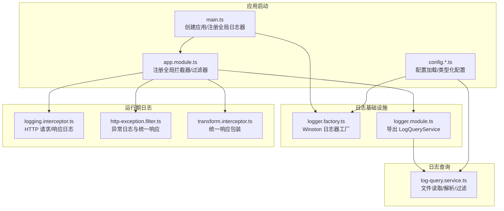
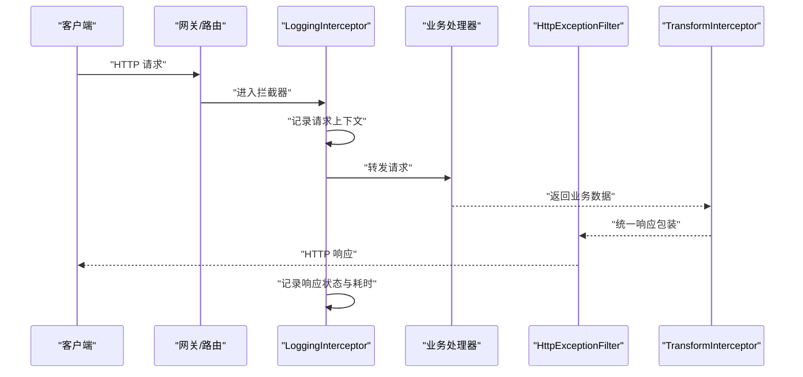
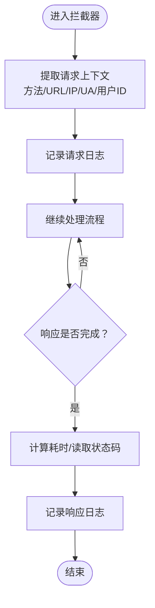
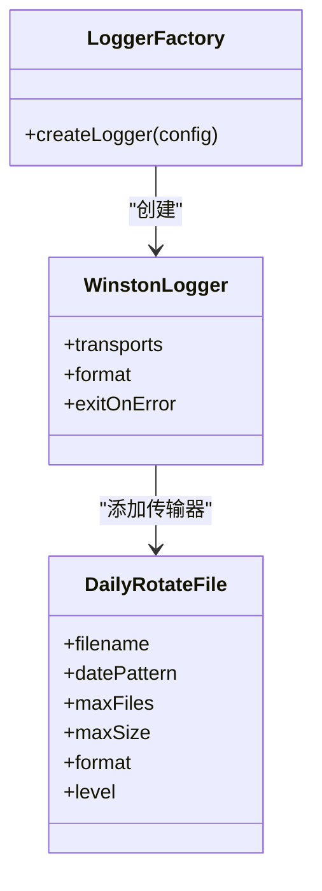
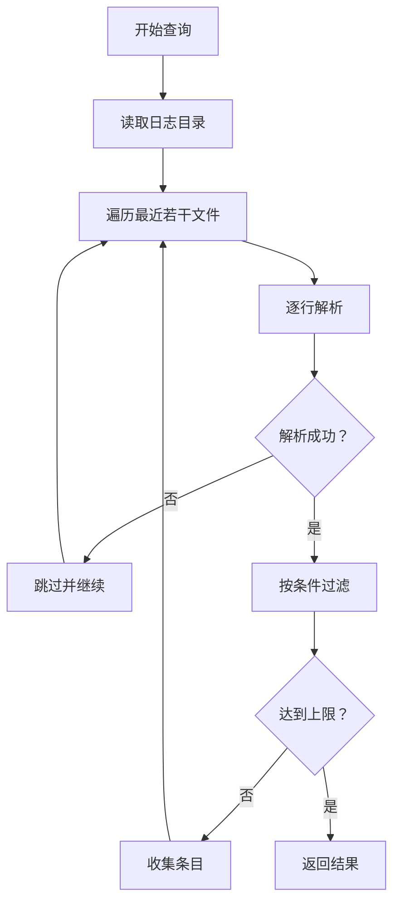
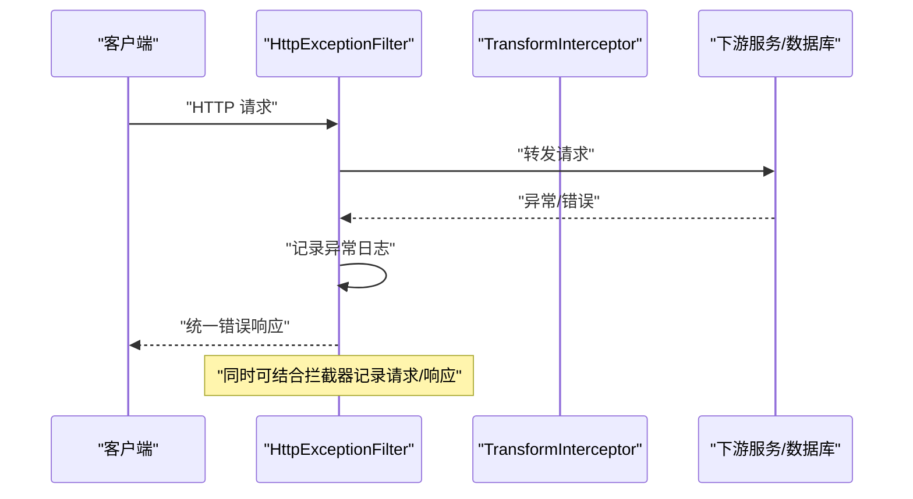
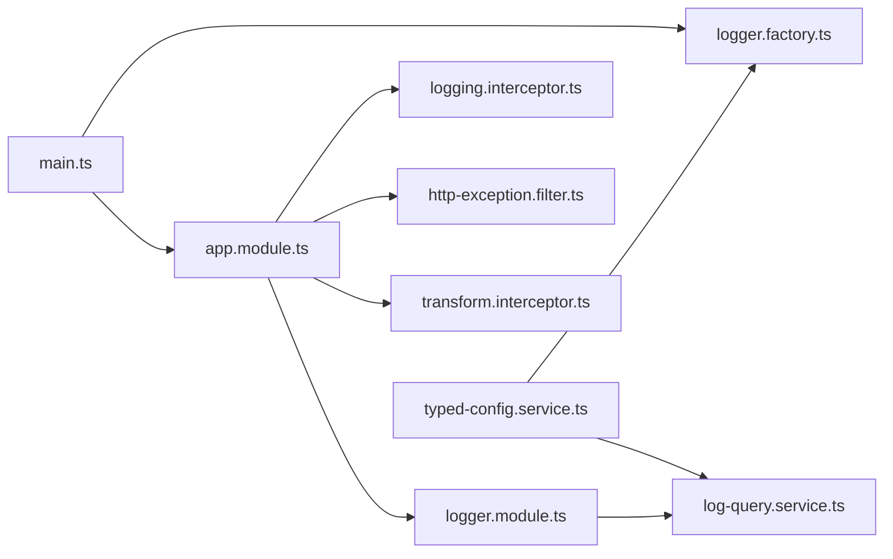

# 结构化日志记录

<cite>
**本文引用的文件**
- [src/common/interceptors/logging.interceptor.ts](file://src/common/interceptors/logging.interceptor.ts)
- [src/modules/logger/logger.factory.ts](file://src/modules/logger/logger.factory.ts)
- [src/modules/logger/log-query.service.ts](file://src/modules/logger/log-query.service.ts)
- [src/modules/logger/logger.module.ts](file://src/modules/logger/logger.module.ts)
- [src/app.module.ts](file://src/app.module.ts)
- [src/main.ts](file://src/main.ts)
- [src/config/schemas/logger.schema.ts](file://src/config/schemas/logger.schema.ts)
- [src/common/constants/log-level.constants.ts](file://src/common/constants/log-level.constants.ts)
- [src/common/filters/http-exception.filter.ts](file://src/common/filters/http-exception.filter.ts)
- [src/common/interceptors/transform.interceptor.ts](file://src/common/interceptors/transform.interceptor.ts)
- [src/common/dto/api-response.dto.ts](file://src/common/dto/api-response.dto.ts)
- [src/common/exceptions/business.exception.ts](file://src/common/exceptions/business.exception.ts)
- [src/config/config.module.ts](file://src/config/config.module.ts)
- [src/config/typed-config.service.ts](file://src/config/typed-config.service.ts)
- [src/config/schemas/root.schema.ts](file://src/config/schemas/root.schema.ts)
</cite>

## 目录

1. [简介](#简介)
2. [项目结构](#项目结构)
3. [核心组件](#核心组件)
4. [架构总览](#架构总览)
5. [组件详解](#组件详解)
6. [依赖关系分析](#依赖关系分析)
7. [性能考量](#性能考量)
8. [故障排查指南](#故障排查指南)
9. [结论](#结论)
10. [附录](#附录)

## 简介

本文件系统性阐述该 NestJS 项目中的结构化日志记录方案，覆盖以下主题：

- 日志拦截器的工作原理与请求/响应阶段的日志采集
- 上下文信息（用户ID、请求ID、时间戳、性能指标）的注入与呈现
- 错误堆栈与调试信息的捕获与输出
- 日志查询服务的实现、检索与过滤能力
- 日志格式标准化与敏感信息脱敏策略
- 常见业务场景下的日志设计模式与查询实践

## 项目结构

围绕日志记录的关键目录与文件如下：

- 应用入口与全局配置：main.ts、app.module.ts、config.\*.ts
- 日志工厂与格式化：logger.factory.ts
- 请求拦截器：logging.interceptor.ts
- 日志查询服务：log-query.service.ts、logger.module.ts
- 异常与响应拦截：http-exception.filter.ts、transform.interceptor.ts
- 配置Schema与常量：logger.schema.ts、log-level.constants.ts

图表来源

- [src/main.ts:1-50](file://src/main.ts#L1-L50)
- [src/app.module.ts:1-61](file://src/app.module.ts#L1-L61)
- [src/modules/logger/logger.factory.ts:114-156](file://src/modules/logger/logger.factory.ts#L114-L156)
- [src/common/interceptors/logging.interceptor.ts:12-40](file://src/common/interceptors/logging.interceptor.ts#L12-L40)
- [src/common/filters/http-exception.filter.ts:24-78](file://src/common/filters/http-exception.filter.ts#L24-L78)
- [src/common/interceptors/transform.interceptor.ts:14-41](file://src/common/interceptors/transform.interceptor.ts#L14-L41)
- [src/modules/logger/logger.module.ts:1-9](file://src/modules/logger/logger.module.ts#L1-L9)
- [src/modules/logger/log-query.service.ts:23-129](file://src/modules/logger/log-query.service.ts#L23-L129)

章节来源

- [src/main.ts:1-50](file://src/main.ts#L1-L50)
- [src/app.module.ts:18-61](file://src/app.module.ts#L18-L61)
- [src/config/config.module.ts:1-20](file://src/config/config.module.ts#L1-L20)
- [src/config/typed-config.service.ts:1-48](file://src/config/typed-config.service.ts#L1-L48)

## 核心组件

- 日志拦截器：在请求进入与完成时分别记录方法、URL、用户ID、IP、UA、状态码、耗时等信息，形成“请求-响应”闭环日志。
- 日志工厂：基于 Winston 构建日志器，支持控制台彩色输出与按日期轮转的文件输出，内置敏感字段脱敏与元数据打印。
- 日志查询服务：扫描日志目录、解析日志行、支持按级别、关键词、模块、时间范围过滤，并限制返回条数。
- 异常过滤器：对业务异常与通用 HTTP 异常进行统一日志与响应封装，便于问题定位与审计。
- 统一响应拦截器：将业务返回体包装为统一结构，配合日志可实现“请求-响应-结果”的完整链路。

章节来源

- [src/common/interceptors/logging.interceptor.ts:12-40](file://src/common/interceptors/logging.interceptor.ts#L12-L40)
- [src/modules/logger/logger.factory.ts:114-156](file://src/modules/logger/logger.factory.ts#L114-L156)
- [src/modules/logger/log-query.service.ts:23-129](file://src/modules/logger/log-query.service.ts#L23-L129)
- [src/common/filters/http-exception.filter.ts:24-78](file://src/common/filters/http-exception.filter.ts#L24-L78)
- [src/common/interceptors/transform.interceptor.ts:14-41](file://src/common/interceptors/transform.interceptor.ts#L14-L41)

## 架构总览

整体日志架构分为“运行期日志生成”和“离线日志查询”两部分：

- 运行期：通过拦截器与过滤器在请求生命周期内产生结构化日志；日志器负责格式化、输出与归档。
- 查询侧：通过日志查询服务从磁盘读取日志文件，解析并按条件过滤，返回结构化的日志条目。

图表来源

- [src/common/interceptors/logging.interceptor.ts:16-38](file://src/common/interceptors/logging.interceptor.ts#L16-L38)
- [src/common/interceptors/transform.interceptor.ts:21-38](file://src/common/interceptors/transform.interceptor.ts#L21-L38)
- [src/common/filters/http-exception.filter.ts:28-78](file://src/common/filters/http-exception.filter.ts#L28-L78)

## 组件详解

### 日志拦截器（请求/响应阶段）

- 触发时机：每个 HTTP 请求进入与完成时。
- 记录内容：
  - 请求阶段：方法、URL、用户ID（匿名）、客户端IP、User-Agent。
  - 响应阶段：状态码、耗时（毫秒）、用户ID。
- 性能指标：通过时间戳差计算单次请求耗时，便于性能监控与慢调用识别。
- 上下文扩展：可在拦截器内部扩展注入请求ID、租户ID等，当前实现已具备扩展点。

图表来源

- [src/common/interceptors/logging.interceptor.ts:16-38](file://src/common/interceptors/logging.interceptor.ts#L16-L38)

章节来源

- [src/common/interceptors/logging.interceptor.ts:12-40](file://src/common/interceptors/logging.interceptor.ts#L12-L40)

### 日志工厂与格式化

- 日志器构建：根据环境选择日志级别、是否启用文件输出、日志目录、最大文件数与大小。
- 控制台输出：开发环境支持彩色输出，生产环境关闭彩色。
- 文件输出：按日期轮转，分离普通日志与错误日志，避免混合检索困难。
- 敏感信息脱敏：对包含特定关键字的元数据键进行脱敏处理，递归处理嵌套对象。
- 元数据打印：除标准字段外，其余键值对以结构化 JSON 形式打印，便于后续检索与可视化。

图表来源

- [src/modules/logger/logger.factory.ts:114-156](file://src/modules/logger/logger.factory.ts#L114-L156)

章节来源

- [src/modules/logger/logger.factory.ts:14-38](file://src/modules/logger/logger.factory.ts#L14-L38)
- [src/modules/logger/logger.factory.ts:114-156](file://src/modules/logger/logger.factory.ts#L114-L156)
- [src/config/schemas/logger.schema.ts:4-10](file://src/config/schemas/logger.schema.ts#L4-L10)
- [src/common/constants/log-level.constants.ts:1-10](file://src/common/constants/log-level.constants.ts#L1-L10)

### 日志查询服务

- 功能概述：读取日志目录下最近若干个日志文件，逐行解析，按条件过滤并返回结构化日志条目。
- 支持的查询条件：
  - 级别：按日志级别过滤（不区分大小写包含匹配）。
  - 关键词：按原始日志行包含关键词过滤（不区分大小写）。
  - 模块：按模块名过滤（若日志行包含模块上下文）。
  - 时间范围：按时间戳与起止时间比较过滤。
  - 限制数量：默认限制返回条数，避免一次性输出过大。
- 解析规则：基于正则解析标准格式的行，提取时间戳、级别、模块、消息与原始行。
- 安全与健壮性：对不存在目录或空行进行容错处理；仅读取普通日志文件，排除错误日志文件。

图表来源

- [src/modules/logger/log-query.service.ts:31-90](file://src/modules/logger/log-query.service.ts#L31-L90)
- [src/modules/logger/log-query.service.ts:105-119](file://src/modules/logger/log-query.service.ts#L105-L119)

章节来源

- [src/modules/logger/log-query.service.ts:23-129](file://src/modules/logger/log-query.service.ts#L23-L129)

### 异常过滤器与统一响应

- 异常过滤器：对业务异常与通用 HTTP 异常进行统一日志与响应封装，便于问题定位与对外输出一致。
- 统一响应拦截器：将业务返回体包装为统一结构，结合日志可实现“请求-响应-结果”的完整链路。
- 与日志联动：异常过滤器在记录警告级别日志的同时，输出结构化错误响应，便于前端与监控系统消费。

图表来源

- [src/common/filters/http-exception.filter.ts:28-78](file://src/common/filters/http-exception.filter.ts#L28-L78)
- [src/common/interceptors/transform.interceptor.ts:21-38](file://src/common/interceptors/transform.interceptor.ts#L21-L38)
- [src/common/dto/api-response.dto.ts:9-28](file://src/common/dto/api-response.dto.ts#L9-L28)
- [src/common/exceptions/business.exception.ts:16-41](file://src/common/exceptions/business.exception.ts#L16-L41)

章节来源

- [src/common/filters/http-exception.filter.ts:24-173](file://src/common/filters/http-exception.filter.ts#L24-L173)
- [src/common/interceptors/transform.interceptor.ts:14-41](file://src/common/interceptors/transform.interceptor.ts#L14-L41)
- [src/common/dto/api-response.dto.ts:1-40](file://src/common/dto/api-response.dto.ts#L1-L40)
- [src/common/exceptions/business.exception.ts:1-42](file://src/common/exceptions/business.exception.ts#L1-L42)

## 依赖关系分析

- 应用启动阶段：main.ts 创建应用后，使用 logger.factory.ts 构建的日志器替换默认日志器，确保全局日志格式与输出策略一致。
- 全局注册：app.module.ts 将拦截器、过滤器、管道等注册为全局，保证所有请求均受日志与异常处理影响。
- 配置驱动：logger.schema.ts 与 typed-config.service.ts 提供类型安全的配置访问，支持动态调整日志行为（级别、目录、文件策略）。
- 查询模块：logger.module.ts 导出 LogQueryService，供上层管理端或运维工具使用。

图表来源

- [src/main.ts:8-17](file://src/main.ts#L8-L17)
- [src/app.module.ts:33-57](file://src/app.module.ts#L33-L57)
- [src/modules/logger/logger.module.ts:1-9](file://src/modules/logger/logger.module.ts#L1-L9)
- [src/modules/logger/log-query.service.ts:23-29](file://src/modules/logger/log-query.service.ts#L23-L29)
- [src/config/typed-config.service.ts:23-38](file://src/config/typed-config.service.ts#L23-L38)

章节来源

- [src/main.ts:1-50](file://src/main.ts#L1-L50)
- [src/app.module.ts:18-61](file://src/app.module.ts#L18-L61)
- [src/config/typed-config.service.ts:1-48](file://src/config/typed-config.service.ts#L1-L48)

## 性能考量

- 日志输出频率：HTTP 请求/响应各一次，属于轻量 I/O；建议在高并发场景下合理设置日志级别与文件轮转策略。
- 文件轮转：按日期轮转可避免单文件过大；通过最大文件数与大小限制控制磁盘占用。
- 解析成本：日志查询服务按文件数量与行数线性扫描，建议限制每次查询的文件数量与返回条数。
- 脱敏开销：递归脱敏对深层嵌套对象有一定成本，建议在必要字段上使用脱敏，避免过度脱敏。

## 故障排查指南

- 启动失败：检查配置项是否存在且类型正确；typed-config.service.ts 在根配置缺失时会终止进程。
- 日志未输出：确认 logger.factory.ts 是否启用文件输出，以及日志目录是否存在且可写。
- 查询无结果：确认日志目录路径与文件命名符合预期；注意错误日志文件与普通日志文件的区分。
- 格式异常：检查日志行是否符合解析正则；若自定义了日志格式，需同步更新解析逻辑。
- 敏感信息泄露：确认敏感字段关键字是否覆盖全面；必要时扩展脱敏规则。

章节来源

- [src/config/typed-config.service.ts:14-18](file://src/config/typed-config.service.ts#L14-L18)
- [src/modules/logger/logger.factory.ts:129-149](file://src/modules/logger/logger.factory.ts#L129-L149)
- [src/modules/logger/log-query.service.ts:92-103](file://src/modules/logger/log-query.service.ts#L92-L103)
- [src/modules/logger/log-query.service.ts:105-119](file://src/modules/logger/log-query.service.ts#L105-L119)

## 结论

该日志体系以拦截器与过滤器为核心，结合结构化的日志工厂与查询服务，实现了从“请求-响应-异常-统一响应”的全链路可观测性。通过标准化日志格式、敏感信息脱敏与文件轮转策略，既满足日常运维与审计需求，也为后续引入集中式日志平台提供了良好基础。

## 附录

### 日志格式标准化

- 标准字段：时间戳、级别、模块上下文、消息、耗时（ms）、其他元数据。
- 元数据键值：除保留字段外，其余键值以结构化 JSON 输出，便于检索与可视化。
- 脱敏策略：对包含敏感关键字的键进行脱敏处理，递归处理嵌套对象。

章节来源

- [src/modules/logger/logger.factory.ts:40-112](file://src/modules/logger/logger.factory.ts#L40-L112)

### 常见业务场景日志设计模式

- 登录鉴权：记录用户ID、IP、UA、状态码、耗时；异常时记录业务码与消息。
- 数据增删改查：记录操作类型、资源标识、输入参数摘要（脱敏）、响应状态与耗时。
- 批量导入/导出：记录任务ID、文件名、行数、耗时、错误明细。
- 权限校验失败：记录用户ID、资源、权限点、拒绝原因。

### 实际日志记录示例（路径指引）

- 请求阶段日志：参见拦截器记录请求上下文的实现位置。
  - [src/common/interceptors/logging.interceptor.ts:25-27](file://src/common/interceptors/logging.interceptor.ts#L25-L27)
- 响应阶段日志：参见拦截器记录响应状态与耗时的实现位置。
  - [src/common/interceptors/logging.interceptor.ts:33-35](file://src/common/interceptors/logging.interceptor.ts#L33-L35)
- 异常日志：参见异常过滤器记录业务异常与通用异常的实现位置。
  - [src/common/filters/http-exception.filter.ts:40-42](file://src/common/filters/http-exception.filter.ts#L40-L42)
  - [src/common/filters/http-exception.filter.ts:65-67](file://src/common/filters/http-exception.filter.ts#L65-L67)

### 日志查询模式（路径指引）

- 按级别查询：传入 level 参数。
  - [src/modules/logger/log-query.service.ts:52-54](file://src/modules/logger/log-query.service.ts#L52-L54)
- 按关键词查询：传入 keyword 参数。
  - [src/modules/logger/log-query.service.ts:56-61](file://src/modules/logger/log-query.service.ts#L56-L61)
- 按模块查询：传入 module 参数。
  - [src/modules/logger/log-query.service.ts:63-69](file://src/modules/logger/log-query.service.ts#L63-L69)
- 按时间范围查询：传入 startDate/endDate 参数。
  - [src/modules/logger/log-query.service.ts:71-79](file://src/modules/logger/log-query.service.ts#L71-L79)
- 限制返回条数：传入 limit 参数或使用默认值。
  - [src/modules/logger/log-query.service.ts:32](file://src/modules/logger/log-query.service.ts#L32)
