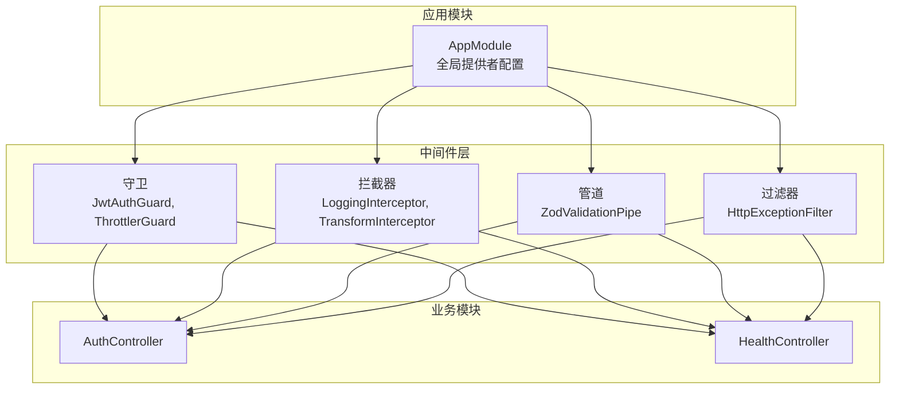
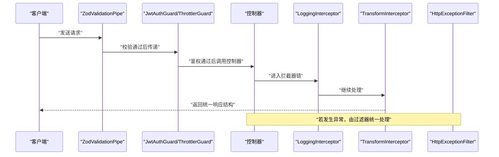
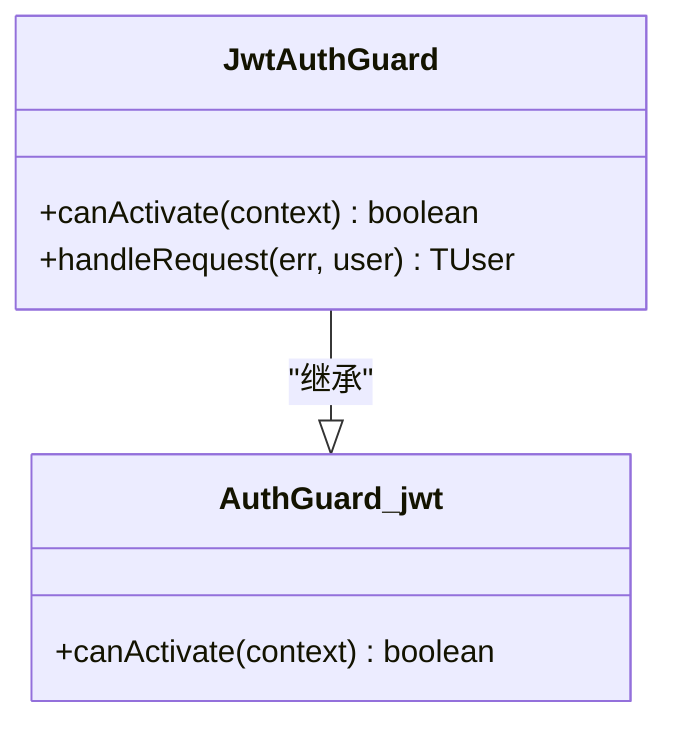
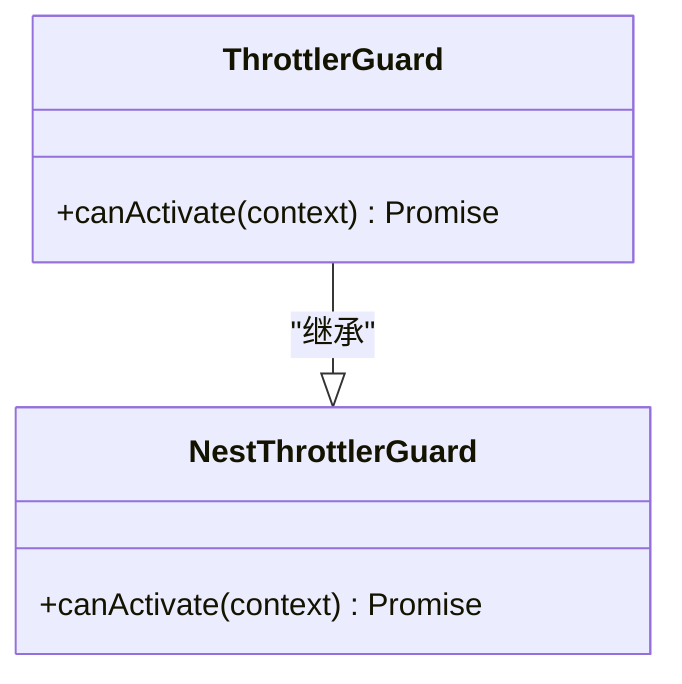
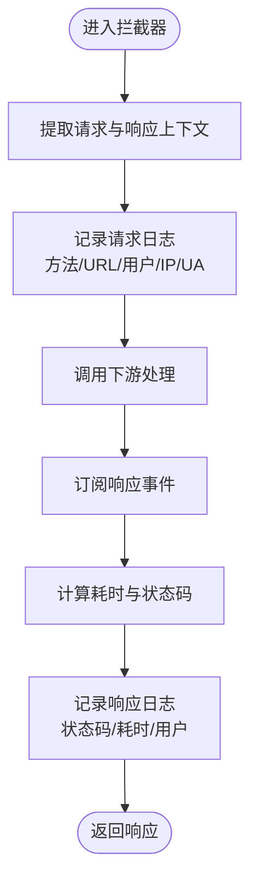
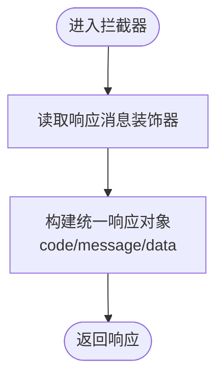
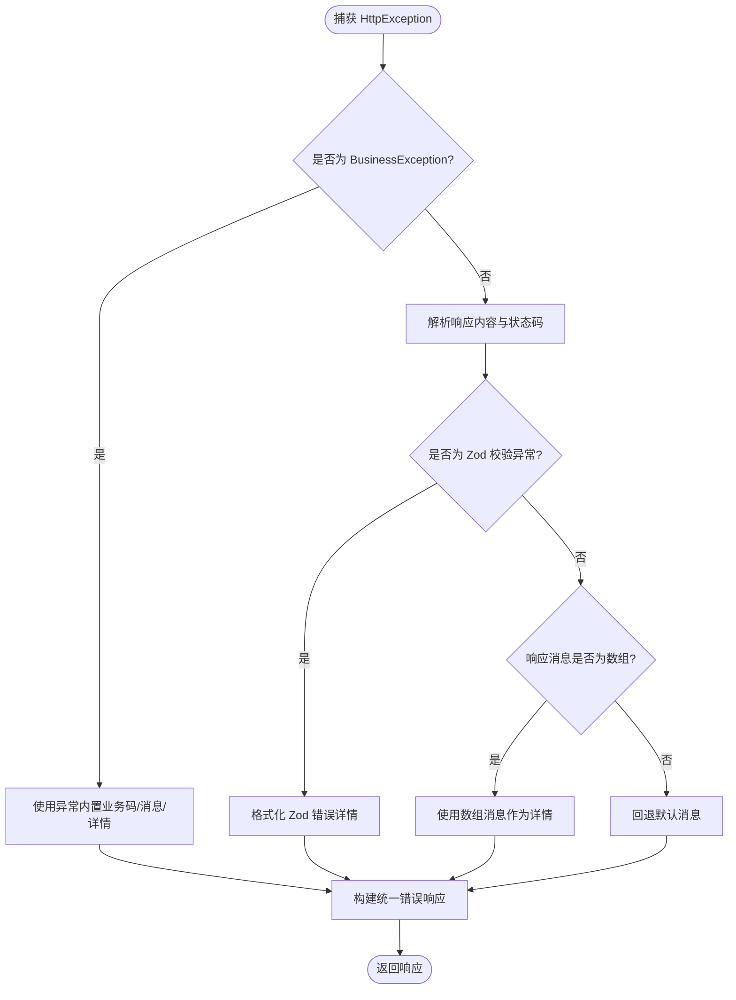
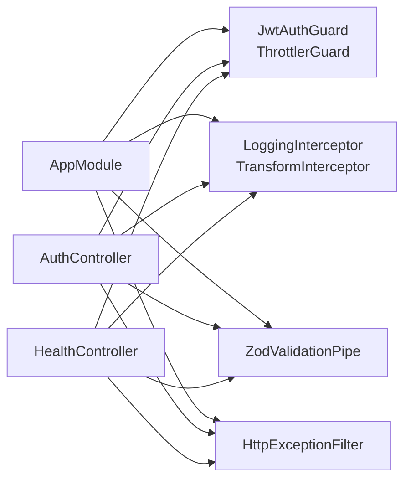
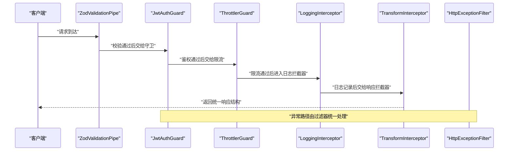

# 中间件和拦截器系统

<cite>
**本文档引用的文件**
- [src/app.module.ts](file://src/app.module.ts)
- [src/common/guards/jwt-auth.guard.ts](file://src/common/guards/jwt-auth.guard.ts)
- [src/common/guards/throttler.guard.ts](file://src/common/guards/throttler.guard.ts)
- [src/common/interceptors/logging.interceptor.ts](file://src/common/interceptors/logging.interceptor.ts)
- [src/common/interceptors/transform.interceptor.ts](file://src/common/interceptors/transform.interceptor.ts)
- [src/common/filters/http-exception.filter.ts](file://src/common/filters/http-exception.filter.ts)
- [src/common/decorators/public.decorator.ts](file://src/common/decorators/public.decorator.ts)
- [src/common/decorators/skip-throttle.decorator.ts](file://src/common/decorators/skip-throttle.decorator.ts)
- [src/common/decorators/response-message.decorator.ts](file://src/common/decorators/response-message.decorator.ts)
- [src/common/enums/biz-code.enum.ts](file://src/common/enums/biz-code.enum.ts)
- [src/common/interfaces/user.interface.ts](file://src/common/interfaces/user.interface.ts)
- [src/modules/auth/auth.controller.ts](file://src/modules/auth/auth.controller.ts)
- [src/modules/health/health.controller.ts](file://src/modules/health/health.controller.ts)
- [src/common/guards/jwt-auth.guard.spec.ts](file://src/common/guards/jwt-auth.guard.spec.ts)
- [src/common/interceptors/transform.interceptor.spec.ts](file://src/common/interceptors/transform.interceptor.spec.ts)
- [src/common/filters/http-exception.filter.spec.ts](file://src/common/filters/http-exception.filter.spec.ts)
</cite>

## 目录
1. [简介](#简介)
2. [项目结构](#项目结构)
3. [核心组件](#核心组件)
4. [架构总览](#架构总览)
5. [详细组件分析](#详细组件分析)
6. [依赖关系分析](#依赖关系分析)
7. [性能考虑](#性能考虑)
8. [故障排查指南](#故障排查指南)
9. [结论](#结论)
10. [附录](#附录)

## 简介
本文件系统性梳理并解释 NestJS 中间件与拦截器体系在本项目中的实现与应用，涵盖守卫（Guards）、拦截器（Interceptors）、管道（Pipes）与过滤器（Filters）的职责边界、执行顺序、生命周期与错误处理机制。重点解析以下组件：
- 守卫：JWT 认证守卫、限流守卫
- 拦截器：日志拦截器、数据转换拦截器
- 过滤器：HTTP 异常过滤器
- 管道：Zod 校验管道
同时给出中间件链执行流程图、自定义中间件开发指南与常见问题排查建议。

## 项目结构
本项目采用模块化组织，核心中间件通过全局提供者注入到应用层，形成统一的横切关注点处理链。主要目录与文件如下：
- 守卫：src/common/guards/
- 拦截器：src/common/interceptors/
- 过滤器：src/common/filters/
- 装饰器：src/common/decorators/
- 枚举与接口：src/common/enums/, src/common/interfaces/
- 应用入口：src/app.module.ts
- 控制器示例：src/modules/auth/auth.controller.ts, src/modules/health/health.controller.ts

图表来源
- [src/app.module.ts:18-61](file://src/app.module.ts#L18-L61)
- [src/modules/auth/auth.controller.ts:36-129](file://src/modules/auth/auth.controller.ts#L36-L129)
- [src/modules/health/health.controller.ts:9-86](file://src/modules/health/health.controller.ts#L9-L86)

章节来源
- [src/app.module.ts:18-61](file://src/app.module.ts#L18-L61)

## 核心组件
本节概述各中间件组件的核心职责与典型使用场景：
- 守卫（Guards）
  - JwtAuthGuard：基于 JWT 的认证守卫，支持通过装饰器标记“公开路由”跳过认证；认证失败时抛出业务异常。
  - ThrottlerGuard：基于 @nestjs/throttler 的限流守卫，支持通过装饰器标记“跳过限流”的高频接口（如健康检查）。
- 拦截器（Interceptors）
  - LoggingInterceptor：记录请求开始与结束的日志，包含方法、URL、用户ID、IP、UA、耗时与状态码。
  - TransformInterceptor：统一响应结构，封装 code、message、data 字段，支持通过装饰器设置自定义响应消息。
- 过滤器（Filters）
  - HttpExceptionFilter：捕获 HttpException，将其映射为统一的业务码与消息结构，支持 BusinessException、Zod 校验异常与标准验证异常的差异化处理。
- 管道（Pipes）
  - ZodValidationPipe：统一的请求体校验管道，结合装饰器进行输入校验。

章节来源
- [src/common/guards/jwt-auth.guard.ts:17-46](file://src/common/guards/jwt-auth.guard.ts#L17-L46)
- [src/common/guards/throttler.guard.ts:10-33](file://src/common/guards/throttler.guard.ts#L10-L33)
- [src/common/interceptors/logging.interceptor.ts:12-40](file://src/common/interceptors/logging.interceptor.ts#L12-L40)
- [src/common/interceptors/transform.interceptor.ts:14-41](file://src/common/interceptors/transform.interceptor.ts#L14-L41)
- [src/common/filters/http-exception.filter.ts:24-173](file://src/common/filters/http-exception.filter.ts#L24-L173)
- [src/app.module.ts:33-57](file://src/app.module.ts#L33-L57)

## 架构总览
全局中间件链在应用启动时注册，形成如下执行顺序与职责分工：
- 管道（Pipes）：最先执行，负责请求体校验与转换。
- 守卫（Guards）：随后执行，负责鉴权与访问控制。
- 拦截器（Interceptors）：在控制器执行前后分别处理，前者负责日志与上下文准备，后者负责统一响应包装。
- 过滤器（Filters）：最后兜底，统一异常处理与响应格式。

图表来源
- [src/app.module.ts:33-57](file://src/app.module.ts#L33-L57)
- [src/common/interceptors/logging.interceptor.ts:16-38](file://src/common/interceptors/logging.interceptor.ts#L16-L38)
- [src/common/interceptors/transform.interceptor.ts:21-39](file://src/common/interceptors/transform.interceptor.ts#L21-L39)
- [src/common/guards/jwt-auth.guard.ts:23-34](file://src/common/guards/jwt-auth.guard.ts#L23-L34)
- [src/common/guards/throttler.guard.ts:20-31](file://src/common/guards/throttler.guard.ts#L20-L31)
- [src/common/filters/http-exception.filter.ts:28-78](file://src/common/filters/http-exception.filter.ts#L28-L78)

## 详细组件分析

### 守卫：JWT 认证守卫（JwtAuthGuard）
- 设计要点
  - 继承自 @nestjs/passport 的 AuthGuard('jwt')，复用 JWT 策略完成认证。
  - 通过 Reflector 读取控制器/处理器上的元数据，支持“公开路由”装饰器标记，使特定接口无需认证即可访问。
  - handleRequest 在认证失败或用户缺失时抛出业务异常，确保统一错误语义。
- 关键行为
  - 公开路由：直接放行。
  - 非公开路由：委托父类完成认证流程。
  - 认证失败：抛出业务异常，交由异常过滤器统一处理。
- 使用场景
  - 需要鉴权保护的接口（如获取用户资料、登出）。
  - 通过装饰器标记公开接口（如验证码、登录）。

图表来源
- [src/common/guards/jwt-auth.guard.ts:17-46](file://src/common/guards/jwt-auth.guard.ts#L17-L46)

章节来源
- [src/common/guards/jwt-auth.guard.ts:17-46](file://src/common/guards/jwt-auth.guard.ts#L17-L46)
- [src/common/decorators/public.decorator.ts:1-5](file://src/common/decorators/public.decorator.ts#L1-L5)
- [src/common/enums/biz-code.enum.ts:13-78](file://src/common/enums/biz-code.enum.ts#L13-L78)
- [src/common/interfaces/user.interface.ts:6-9](file://src/common/interfaces/user.interface.ts#L6-L9)

### 守卫：限流守卫（ThrottlerGuard）
- 设计要点
  - 继承自 @nestjs/throttler 的 ThrottlerGuard，扩展对“跳过限流”装饰器的支持。
  - 通过 Reflector 读取元数据，若标记为跳过则直接放行，否则按配置进行限流判断。
- 关键行为
  - 跳过限流：直接返回 true。
  - 执行限流：委托父类逻辑进行配额与时间窗口判断。
- 使用场景
  - 健康检查、验证码等高频但低风险接口。

图表来源
- [src/common/guards/throttler.guard.ts:10-33](file://src/common/guards/throttler.guard.ts#L10-L33)

章节来源
- [src/common/guards/throttler.guard.ts:10-33](file://src/common/guards/throttler.guard.ts#L10-L33)
- [src/common/decorators/skip-throttle.decorator.ts:1-12](file://src/common/decorators/skip-throttle.decorator.ts#L1-L12)
- [src/modules/health/health.controller.ts:9-11](file://src/modules/health/health.controller.ts#L9-L11)

### 拦截器：日志拦截器（LoggingInterceptor）
- 设计要点
  - 在请求进入与响应返回两个阶段分别记录日志，包含方法、URL、用户ID、IP、UA、耗时与状态码。
  - 从请求上下文中提取用户信息，匿名用户以占位标识显示。
- 关键行为
  - 请求阶段：记录基础信息与开始时间。
  - 响应阶段：计算耗时，输出状态码与用户信息。
- 使用场景
  - 全局审计与性能监控。

图表来源
- [src/common/interceptors/logging.interceptor.ts:16-38](file://src/common/interceptors/logging.interceptor.ts#L16-L38)

章节来源
- [src/common/interceptors/logging.interceptor.ts:12-40](file://src/common/interceptors/logging.interceptor.ts#L12-L40)

### 拦截器：数据转换拦截器（TransformInterceptor）
- 设计要点
  - 统一响应结构，封装 code、message、data 字段。
  - 通过反射读取处理器上的响应消息装饰器，动态设置响应消息；未设置时使用默认消息。
  - 对空数据进行安全转换（null），保证前端契约稳定。
- 关键行为
  - 映射成功状态码与默认消息。
  - 支持自定义响应消息覆盖默认值。
- 使用场景
  - 所有控制器响应的标准化输出。

图表来源
- [src/common/interceptors/transform.interceptor.ts:21-39](file://src/common/interceptors/transform.interceptor.ts#L21-L39)
- [src/common/decorators/response-message.decorator.ts:1-6](file://src/common/decorators/response-message.decorator.ts#L1-L6)
- [src/common/enums/biz-code.enum.ts:83-122](file://src/common/enums/biz-code.enum.ts#L83-L122)

章节来源
- [src/common/interceptors/transform.interceptor.ts:14-41](file://src/common/interceptors/transform.interceptor.ts#L14-L41)
- [src/common/decorators/response-message.decorator.ts:1-6](file://src/common/decorators/response-message.decorator.ts#L1-L6)
- [src/common/enums/biz-code.enum.ts:83-122](file://src/common/enums/biz-code.enum.ts#L83-L122)

### 过滤器：HTTP 异常过滤器（HttpExceptionFilter）
- 设计要点
  - 捕获 HttpException 并映射为统一业务码与消息结构。
  - 区分 BusinessException（业务异常）、Zod 校验异常与标准验证异常，分别输出不同细节字段。
  - 将 HTTP 状态码映射为业务码，便于前端统一处理。
- 关键行为
  - 业务异常：保留异常中携带的业务码与消息，必要时追加详情。
  - 校验异常：解析 Zod 或 class-validator 的错误数组，输出结构化详情。
  - 其他异常：根据响应内容与状态码推断业务码与消息。
- 使用场景
  - 全局异常兜底，保证错误响应的一致性与可读性。

图表来源
- [src/common/filters/http-exception.filter.ts:28-78](file://src/common/filters/http-exception.filter.ts#L28-L78)
- [src/common/filters/http-exception.filter.ts:80-134](file://src/common/filters/http-exception.filter.ts#L80-L134)
- [src/common/filters/http-exception.filter.ts:136-171](file://src/common/filters/http-exception.filter.ts#L136-L171)

章节来源
- [src/common/filters/http-exception.filter.ts:24-173](file://src/common/filters/http-exception.filter.ts#L24-L173)
- [src/common/enums/biz-code.enum.ts:127-170](file://src/common/enums/biz-code.enum.ts#L127-L170)

### 管道：Zod 校验管道（ZodValidationPipe）
- 设计要点
  - 作为全局管道，负责请求体的结构化校验与转换。
  - 与装饰器配合，实现声明式校验策略。
- 使用场景
  - 所有控制器输入参数的统一校验。

章节来源
- [src/app.module.ts:47-49](file://src/app.module.ts#L47-L49)

## 依赖关系分析
- 全局提供者注册
  - AppModule 通过 APP_GUARD、APP_INTERCEPTOR、APP_PIPE、APP_FILTER 注册全局中间件，形成跨模块一致的横切处理链。
- 控制器装饰器与中间件联动
  - 公开路由装饰器与跳过限流装饰器在控制器上生效，影响守卫与限流守卫的决策。
- 业务模块集成
  - 认证模块与健康模块均受益于统一的中间件链，确保一致性与可维护性。

图表来源
- [src/app.module.ts:33-57](file://src/app.module.ts#L33-L57)
- [src/modules/auth/auth.controller.ts:36-129](file://src/modules/auth/auth.controller.ts#L36-L129)
- [src/modules/health/health.controller.ts:9-86](file://src/modules/health/health.controller.ts#L9-L86)

章节来源
- [src/app.module.ts:18-61](file://src/app.module.ts#L18-L61)
- [src/modules/auth/auth.controller.ts:36-129](file://src/modules/auth/auth.controller.ts#L36-L129)
- [src/modules/health/health.controller.ts:9-86](file://src/modules/health/health.controller.ts#L9-L86)

## 性能考虑
- 日志开销
  - LoggingInterceptor 在每个请求上产生日志写入，建议在高并发场景下合理配置日志级别与采样率，避免磁盘 IO 抖动。
- 响应转换
  - TransformInterceptor 仅做轻量映射与数据转换，性能开销极小，适合全链路启用。
- 认证与限流
  - JwtAuthGuard 依赖外部认证策略，建议优化令牌签发与缓存策略；ThrottlerGuard 使用存储服务进行配额统计，需确保存储性能与持久化策略满足峰值需求。
- 异常过滤
  - HttpExceptionFilter 仅在异常路径触发，对正常路径无性能影响。

## 故障排查指南
- 认证失败
  - 现象：返回统一的未授权业务码。
  - 排查：确认令牌有效性、签名算法、过期时间；检查 JwtAuthGuard 的 handleRequest 是否被调用。
  - 参考
    - [src/common/guards/jwt-auth.guard.ts:36-44](file://src/common/guards/jwt-auth.guard.ts#L36-L44)
    - [src/common/enums/biz-code.enum.ts:22-29](file://src/common/enums/biz-code.enum.ts#L22-L29)
- 未授权访问
  - 现象：业务异常被 HttpExceptionFilter 捕获并返回统一结构。
  - 排查：查看 BusinessException 的业务码与消息；确认控制器是否正确标注公开路由。
  - 参考
    - [src/common/filters/http-exception.filter.ts:37-54](file://src/common/filters/http-exception.filter.ts#L37-L54)
    - [src/common/decorators/public.decorator.ts:1-5](file://src/common/decorators/public.decorator.ts#L1-L5)
- 参数校验失败
  - 现象：返回统一的校验错误业务码与详情。
  - 排查：检查 Zod 校验装饰器与 class-validator 的错误数组；确认 HttpExceptionFilter 的解析逻辑。
  - 参考
    - [src/common/filters/http-exception.filter.ts:107-134](file://src/common/filters/http-exception.filter.ts#L107-L134)
- 高频接口被限流
  - 现象：请求被拒绝或返回限流相关错误。
  - 排查：确认 ThrottlerGuard 的配置与装饰器标记；检查限流存储服务可用性。
  - 参考
    - [src/common/guards/throttler.guard.ts:20-31](file://src/common/guards/throttler.guard.ts#L20-L31)
    - [src/common/decorators/skip-throttle.decorator.ts:1-12](file://src/common/decorators/skip-throttle.decorator.ts#L1-L12)
    - [src/modules/health/health.controller.ts:9-11](file://src/modules/health/health.controller.ts#L9-L11)

章节来源
- [src/common/guards/jwt-auth.guard.ts:36-44](file://src/common/guards/jwt-auth.guard.ts#L36-L44)
- [src/common/filters/http-exception.filter.ts:37-54](file://src/common/filters/http-exception.filter.ts#L37-L54)
- [src/common/decorators/public.decorator.ts:1-5](file://src/common/decorators/public.decorator.ts#L1-L5)
- [src/common/guards/throttler.guard.ts:20-31](file://src/common/guards/throttler.guard.ts#L20-L31)
- [src/common/decorators/skip-throttle.decorator.ts:1-12](file://src/common/decorators/skip-throttle.decorator.ts#L1-L12)
- [src/modules/health/health.controller.ts:9-11](file://src/modules/health/health.controller.ts#L9-L11)

## 结论
本项目通过全局中间件链实现了统一的认证、限流、日志、响应转换与异常处理能力。守卫负责访问控制，拦截器负责横切关注点，过滤器负责异常统一，管道负责输入校验。配合装饰器标记，可在控制器层面灵活地定制中间件行为，既保证了安全性与可观测性，又提升了开发效率与维护性。

## 附录

### 中间件链执行流程图（代码级）

图表来源
- [src/app.module.ts:33-57](file://src/app.module.ts#L33-L57)
- [src/common/interceptors/logging.interceptor.ts:16-38](file://src/common/interceptors/logging.interceptor.ts#L16-L38)
- [src/common/interceptors/transform.interceptor.ts:21-39](file://src/common/interceptors/transform.interceptor.ts#L21-L39)
- [src/common/guards/jwt-auth.guard.ts:23-34](file://src/common/guards/jwt-auth.guard.ts#L23-L34)
- [src/common/guards/throttler.guard.ts:20-31](file://src/common/guards/throttler.guard.ts#L20-L31)
- [src/common/filters/http-exception.filter.ts:28-78](file://src/common/filters/http-exception.filter.ts#L28-L78)

### 自定义中间件开发指南
- 守卫（Guard）
  - 实现 canActivate 方法，结合 Reflector 读取元数据，决定是否放行。
  - 在 handleRequest 中处理认证失败场景，抛出业务异常或返回用户信息。
  - 示例参考
    - [src/common/guards/jwt-auth.guard.ts:17-46](file://src/common/guards/jwt-auth.guard.ts#L17-L46)
- 拦截器（Interceptor）
  - 实现 intercept 方法，使用 CallHandler.handle() 获取下游结果，通过 RxJS 管道进行日志或转换。
  - 注意在 tap 中读取响应状态码与耗时，避免阻塞主流程。
  - 示例参考
    - [src/common/interceptors/logging.interceptor.ts:12-40](file://src/common/interceptors/logging.interceptor.ts#L12-L40)
    - [src/common/interceptors/transform.interceptor.ts:14-41](file://src/common/interceptors/transform.interceptor.ts#L14-L41)
- 过滤器（Filter）
  - 实现 catch 方法，捕获特定异常类型，统一输出业务码与消息。
  - 对 Zod 与 class-validator 的错误进行结构化处理，提升前端可读性。
  - 示例参考
    - [src/common/filters/http-exception.filter.ts:24-173](file://src/common/filters/http-exception.filter.ts#L24-L173)
- 管道（Pipe）
  - 实现 transform 方法，对输入进行校验与转换。
  - 与装饰器配合，实现声明式校验策略。
  - 示例参考
    - [src/app.module.ts:47-49](file://src/app.module.ts#L47-L49)

### 使用示例与最佳实践
- 公开路由
  - 在控制器或处理器上使用公开装饰器，使接口无需认证即可访问。
  - 示例参考
    - [src/modules/auth/auth.controller.ts:44-55](file://src/modules/auth/auth.controller.ts#L44-L55)
    - [src/common/decorators/public.decorator.ts:1-5](file://src/common/decorators/public.decorator.ts#L1-L5)
- 跳过限流
  - 对高频但低风险接口使用跳过限流装饰器，避免误伤。
  - 示例参考
    - [src/modules/health/health.controller.ts:9-11](file://src/modules/health/health.controller.ts#L9-L11)
    - [src/common/decorators/skip-throttle.decorator.ts:1-12](file://src/common/decorators/skip-throttle.decorator.ts#L1-L12)
- 自定义响应消息
  - 通过响应消息装饰器为特定接口设置友好提示，增强用户体验。
  - 示例参考
    - [src/common/decorators/response-message.decorator.ts:1-6](file://src/common/decorators/response-message.decorator.ts#L1-L6)
    - [src/common/interceptors/transform.interceptor.ts:27-36](file://src/common/interceptors/transform.interceptor.ts#L27-L36)

章节来源
- [src/common/guards/jwt-auth.guard.spec.ts:17-97](file://src/common/guards/jwt-auth.guard.spec.ts#L17-L97)
- [src/common/interceptors/transform.interceptor.spec.ts:6-109](file://src/common/interceptors/transform.interceptor.spec.ts#L6-L109)
- [src/common/filters/http-exception.filter.spec.ts:12-136](file://src/common/filters/http-exception.filter.spec.ts#L12-L136)