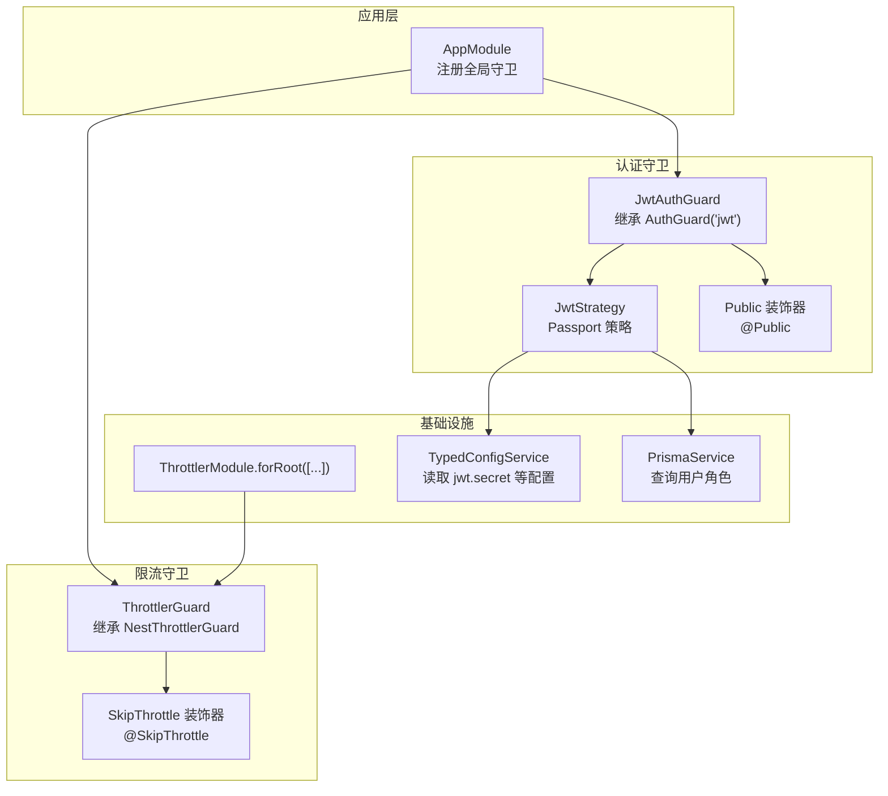
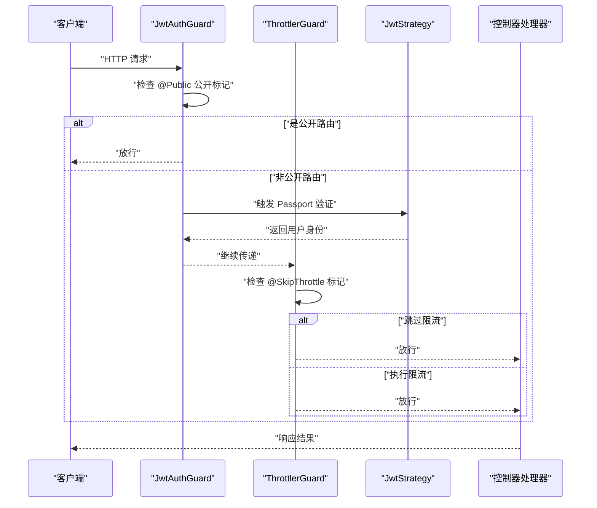
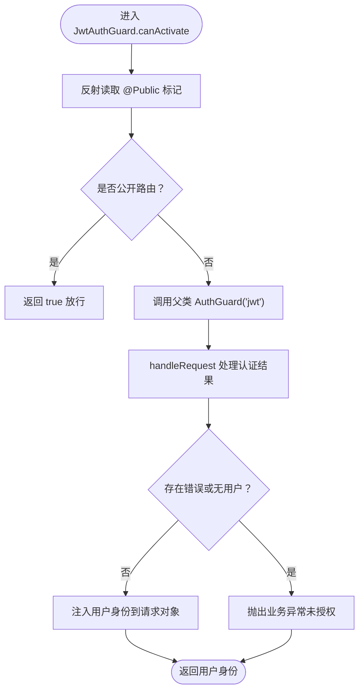
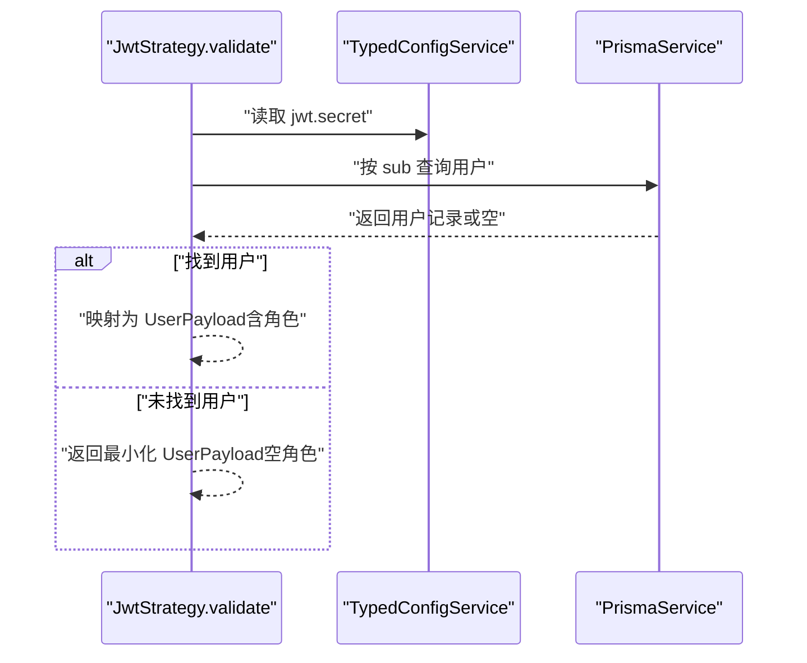
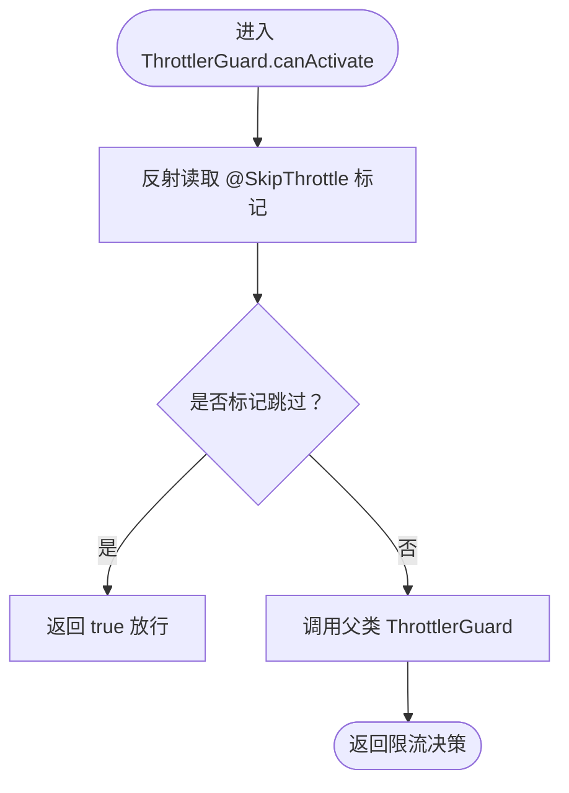
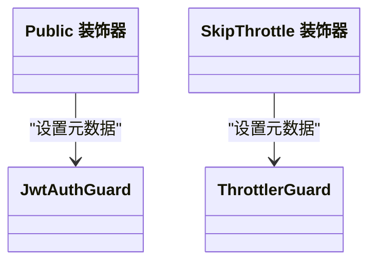
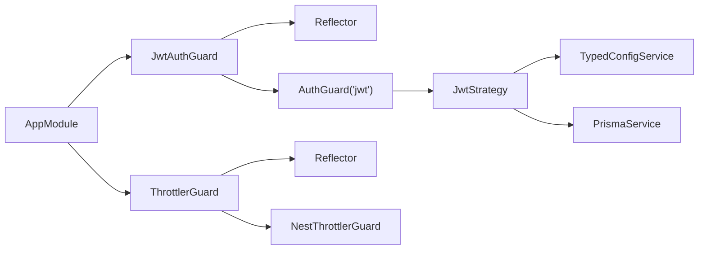

# 守卫系统

<cite>
**本文引用的文件**
- [src/common/guards/jwt-auth.guard.ts](file://src/common/guards/jwt-auth.guard.ts)
- [src/common/guards/throttler.guard.ts](file://src/common/guards/throttler.guard.ts)
- [src/modules/auth/strategies/jwt.strategy.ts](file://src/modules/auth/strategies/jwt.strategy.ts)
- [src/common/decorators/public.decorator.ts](file://src/common/decorators/public.decorator.ts)
- [src/common/decorators/skip-throttle.decorator.ts](file://src/common/decorators/skip-throttle.decorator.ts)
- [src/common/interfaces/user.interface.ts](file://src/common/interfaces/user.interface.ts)
- [src/common/interfaces/jwt.interface.ts](file://src/common/interfaces/jwt.interface.ts)
- [src/common/enums/biz-code.enum.ts](file://src/common/enums/biz-code.enum.ts)
- [src/common/exceptions/business.exception.ts](file://src/common/exceptions/business.exception.ts)
- [src/app.module.ts](file://src/app.module.ts)
- [src/modules/health/health.controller.ts](file://src/modules/health/health.controller.ts)
</cite>

## 目录
1. [引言](#引言)
2. [项目结构](#项目结构)
3. [核心组件](#核心组件)
4. [架构总览](#架构总览)
5. [详细组件分析](#详细组件分析)
6. [依赖分析](#依赖分析)
7. [性能考虑](#性能考虑)
8. [故障排查指南](#故障排查指南)
9. [结论](#结论)
10. [附录](#附录)

## 引言
本文件系统化阐述本项目的守卫体系，重点覆盖以下方面：
- 守卫工作原理与执行时机
- JWT 认证守卫的实现机制：令牌验证、用户身份解析、权限检查流程
- 限流守卫的实现：速率限制算法、IP 识别与缓存策略
- 守卫配置选项、自定义守卫开发指南与最佳实践
- 在路由保护中的使用示例与常见问题解决方案

## 项目结构
守卫系统位于公共模块中，围绕认证与限流两大职责展开，并通过全局提供者在应用启动时注入到框架生命周期中。

**图表来源**
- [src/app.module.ts:18-60](file://src/app.module.ts#L18-L60)
- [src/common/guards/jwt-auth.guard.ts:17-45](file://src/common/guards/jwt-auth.guard.ts#L17-L45)
- [src/common/guards/throttler.guard.ts:10-32](file://src/common/guards/throttler.guard.ts#L10-L32)
- [src/modules/auth/strategies/jwt.strategy.ts:9-48](file://src/modules/auth/strategies/jwt.strategy.ts#L9-L48)
- [src/common/decorators/public.decorator.ts:1-5](file://src/common/decorators/public.decorator.ts#L1-L5)
- [src/common/decorators/skip-throttle.decorator.ts:1-12](file://src/common/decorators/skip-throttle.decorator.ts#L1-L12)

**章节来源**
- [src/app.module.ts:18-60](file://src/app.module.ts#L18-L60)

## 核心组件
- JwtAuthGuard：负责 JWT 认证拦截与用户身份注入，支持“公开路由”豁免。
- ThrottlerGuard：基于 @nestjs/throttler 的扩展守卫，支持“跳过限流”的路由豁免。
- JwtStrategy：Passport 策略，完成令牌提取、签名验证与用户身份解析。
- Public 装饰器：标记公开路由，使 JwtAuthGuard 直接放行。
- SkipThrottle 装饰器：标记无需限流的路由，使 ThrottlerGuard 直接放行。

**章节来源**
- [src/common/guards/jwt-auth.guard.ts:17-45](file://src/common/guards/jwt-auth.guard.ts#L17-L45)
- [src/common/guards/throttler.guard.ts:10-32](file://src/common/guards/throttler.guard.ts#L10-L32)
- [src/modules/auth/strategies/jwt.strategy.ts:9-48](file://src/modules/auth/strategies/jwt.strategy.ts#L9-L48)
- [src/common/decorators/public.decorator.ts:1-5](file://src/common/decorators/public.decorator.ts#L1-L5)
- [src/common/decorators/skip-throttle.decorator.ts:1-12](file://src/common/decorators/skip-throttle.decorator.ts#L1-L12)

## 架构总览
守卫在请求进入控制器之前执行，遵循“全局守卫 → 控制器守卫 → 方法守卫”的叠加顺序。本项目通过全局注册 JwtAuthGuard 和 ThrottlerGuard，实现全站统一的认证与限流控制。

**图表来源**
- [src/common/guards/jwt-auth.guard.ts:23-44](file://src/common/guards/jwt-auth.guard.ts#L23-L44)
- [src/common/guards/throttler.guard.ts:20-31](file://src/common/guards/throttler.guard.ts#L20-L31)
- [src/modules/auth/strategies/jwt.strategy.ts:22-47](file://src/modules/auth/strategies/jwt.strategy.ts#L22-L47)

## 详细组件分析

### JWT 认证守卫（JwtAuthGuard）
- 执行时机：请求进入控制器前，作为全局守卫之一参与认证流程。
- 关键行为：
  - 通过反射读取控制器/方法上的 @Public 标记，若为公开路由则直接放行。
  - 否则委托底层 AuthGuard('jwt') 完成令牌校验。
  - handleRequest 中对认证失败进行统一业务异常转换。
- 用户身份注入：认证成功后，用户信息被注入到请求对象的 user 字段，供后续控制器使用。

**图表来源**
- [src/common/guards/jwt-auth.guard.ts:23-44](file://src/common/guards/jwt-auth.guard.ts#L23-L44)
- [src/common/enums/biz-code.enum.ts:13-78](file://src/common/enums/biz-code.enum.ts#L13-L78)
- [src/common/exceptions/business.exception.ts:16-41](file://src/common/exceptions/business.exception.ts#L16-L41)

**章节来源**
- [src/common/guards/jwt-auth.guard.ts:17-45](file://src/common/guards/jwt-auth.guard.ts#L17-L45)
- [src/common/decorators/public.decorator.ts:1-5](file://src/common/decorators/public.decorator.ts#L1-L5)
- [src/common/enums/biz-code.enum.ts:13-78](file://src/common/enums/biz-code.enum.ts#L13-L78)
- [src/common/exceptions/business.exception.ts:16-41](file://src/common/exceptions/business.exception.ts#L16-L41)

### JWT 策略（JwtStrategy）
- 令牌提取：从 Authorization 头部的 Bearer Token 中提取 JWT。
- 签名验证：使用配置中心提供的密钥进行验签，且不允许过期。
- 用户解析：根据 payload.sub 查询用户信息，返回包含用户 ID 与角色列表的用户载荷；若用户不存在，返回空角色列表的最小化用户对象。

**图表来源**
- [src/modules/auth/strategies/jwt.strategy.ts:15-47](file://src/modules/auth/strategies/jwt.strategy.ts#L15-L47)
- [src/common/interfaces/user.interface.ts:6-9](file://src/common/interfaces/user.interface.ts#L6-L9)
- [src/common/interfaces/jwt.interface.ts:5-10](file://src/common/interfaces/jwt.interface.ts#L5-L10)

**章节来源**
- [src/modules/auth/strategies/jwt.strategy.ts:9-48](file://src/modules/auth/strategies/jwt.strategy.ts#L9-L48)
- [src/common/interfaces/user.interface.ts:1-10](file://src/common/interfaces/user.interface.ts#L1-L10)
- [src/common/interfaces/jwt.interface.ts:1-11](file://src/common/interfaces/jwt.interface.ts#L1-L11)

### 限流守卫（ThrottlerGuard）
- 执行时机：请求进入控制器前，作为全局守卫之一参与限流判断。
- 关键行为：
  - 通过反射读取控制器/方法上的 @SkipThrottle 标记，若标记存在则直接放行。
  - 否则委托 @nestjs/throttler 的守卫执行限流逻辑。
- 速率限制配置：在应用模块中通过 ThrottlerModule.forRoot 注册多个窗口与配额组合（例如 short、medium、long），以满足不同场景的限流需求。

**图表来源**
- [src/common/guards/throttler.guard.ts:20-31](file://src/common/guards/throttler.guard.ts#L20-L31)
- [src/common/decorators/skip-throttle.decorator.ts:1-12](file://src/common/decorators/skip-throttle.decorator.ts#L1-L12)

**章节来源**
- [src/common/guards/throttler.guard.ts:10-32](file://src/common/guards/throttler.guard.ts#L10-L32)
- [src/app.module.ts:21-25](file://src/app.module.ts#L21-L25)
- [src/common/decorators/skip-throttle.decorator.ts:1-12](file://src/common/decorators/skip-throttle.decorator.ts#L1-L12)

### 公开路由与跳过限流装饰器
- @Public：标记路由为公开，JwtAuthGuard 将直接放行，不强制要求有效 JWT。
- @SkipThrottle：标记路由跳过限流，ThrottlerGuard 将直接放行，不进行速率限制判断。

**图表来源**
- [src/common/decorators/public.decorator.ts:1-5](file://src/common/decorators/public.decorator.ts#L1-L5)
- [src/common/decorators/skip-throttle.decorator.ts:1-12](file://src/common/decorators/skip-throttle.decorator.ts#L1-L12)
- [src/common/guards/jwt-auth.guard.ts:23-34](file://src/common/guards/jwt-auth.guard.ts#L23-L34)
- [src/common/guards/throttler.guard.ts:20-31](file://src/common/guards/throttler.guard.ts#L20-L31)

**章节来源**
- [src/common/decorators/public.decorator.ts:1-5](file://src/common/decorators/public.decorator.ts#L1-L5)
- [src/common/decorators/skip-throttle.decorator.ts:1-12](file://src/common/decorators/skip-throttle.decorator.ts#L1-L12)

## 依赖分析
- 全局注册：AppModule 将 JwtAuthGuard 与 ThrottlerGuard 作为全局守卫提供，确保所有路由均受控。
- 认证链路：JwtAuthGuard 依赖 Reflector 读取元数据，依赖底层 AuthGuard('jwt') 完成令牌校验；JwtStrategy 依赖 TypedConfigService 获取密钥、依赖 PrismaService 查询用户。
- 限流链路：ThrottlerGuard 依赖 @nestjs/throttler 提供的存储与配置，通过 Reflector 读取 @SkipThrottle 元数据决定是否放行。

**图表来源**
- [src/app.module.ts:18-60](file://src/app.module.ts#L18-L60)
- [src/common/guards/jwt-auth.guard.ts:17-45](file://src/common/guards/jwt-auth.guard.ts#L17-L45)
- [src/common/guards/throttler.guard.ts:10-32](file://src/common/guards/throttler.guard.ts#L10-L32)
- [src/modules/auth/strategies/jwt.strategy.ts:9-48](file://src/modules/auth/strategies/jwt.strategy.ts#L9-L48)

**章节来源**
- [src/app.module.ts:18-60](file://src/app.module.ts#L18-L60)

## 性能考虑
- 令牌验证成本：JwtStrategy 对 payload.sub 的数据库查询为 O(1) 选择性读取，建议在用户表为主键索引上建立高效查询。
- 限流命中成本：ThrottlerGuard 默认使用内存存储，适合单实例部署；在多实例场景建议替换为分布式缓存存储以保证限流一致性。
- 公开路由优化：@Public 标记可避免不必要的认证流程，降低整体延迟。
- 跳过限流优化：对健康检查等高频端点使用 @SkipThrottle，避免限流带来的额外判断开销。

## 故障排查指南
- 未授权错误（401）：
  - 确认请求头中包含有效的 Bearer 令牌。
  - 检查 JwtStrategy 的密钥配置与签名是否匹配。
  - 若为公开路由，确认 @Public 装饰器正确设置。
- 权限不足（403）：
  - 当前实现未做细粒度权限检查，若出现 403，需结合业务层的权限守卫或拦截器处理。
- 限流触发（429）：
  - 检查 @SkipThrottle 是否被错误地应用于高风险端点。
  - 调整 ThrottlerModule 的窗口与配额配置，或在路由上使用 @SkipThrottle。
- 业务异常统一：
  - JwtAuthGuard 在认证失败时抛出业务异常，业务码对应 401 未授权，便于前端统一处理。

**章节来源**
- [src/common/guards/jwt-auth.guard.ts:36-44](file://src/common/guards/jwt-auth.guard.ts#L36-L44)
- [src/common/enums/biz-code.enum.ts:127-166](file://src/common/enums/biz-code.enum.ts#L127-L166)
- [src/common/exceptions/business.exception.ts:16-41](file://src/common/exceptions/business.exception.ts#L16-L41)

## 结论
本守卫系统通过全局 JwtAuthGuard 与 ThrottlerGuard 实现了统一的认证与限流控制，配合 @Public 与 @SkipThrottle 装饰器提供了灵活的路由豁免能力。JwtStrategy 将令牌解析与用户身份注入解耦，限流策略可通过配置与装饰器进行精细化控制。建议在生产环境中结合分布式缓存优化限流存储，并在需要时扩展权限检查逻辑。

## 附录

### 使用示例与最佳实践
- 公开路由示例：健康检查接口通常标记为公开并跳过限流，参考健康控制器的装饰器使用方式。
- 最佳实践：
  - 对登录、鉴权相关接口使用 JwtAuthGuard，默认开启认证。
  - 对监控、心跳等高频接口使用 @SkipThrottle，必要时也使用 @Public。
  - 为不同场景配置多组限流策略（短/中/长窗口），并通过装饰器选择性启用。
  - 在业务层补充细粒度权限守卫，以实现基于角色或资源的访问控制。

**章节来源**
- [src/modules/health/health.controller.ts:9-86](file://src/modules/health/health.controller.ts#L9-L86)