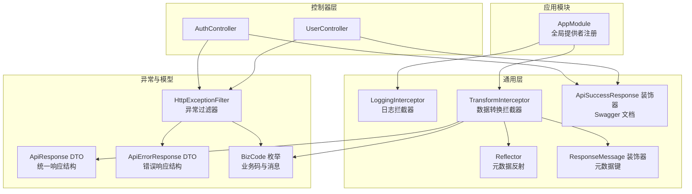
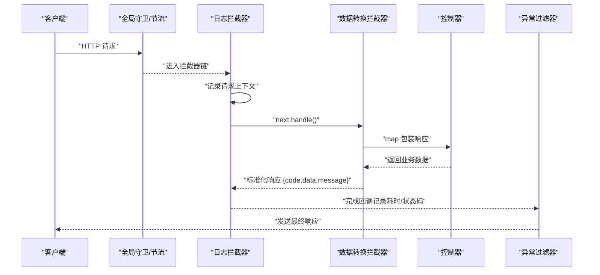
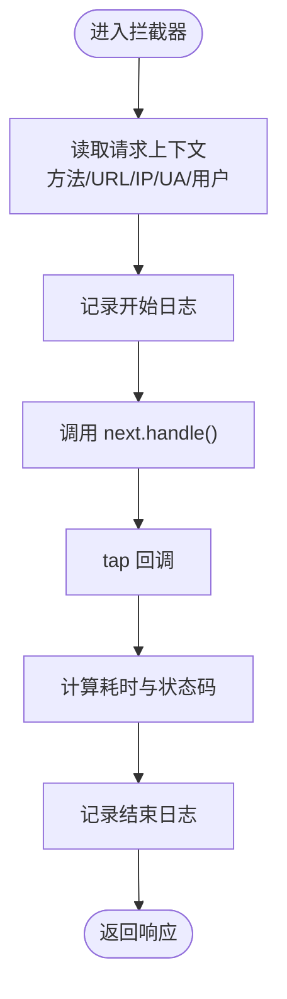
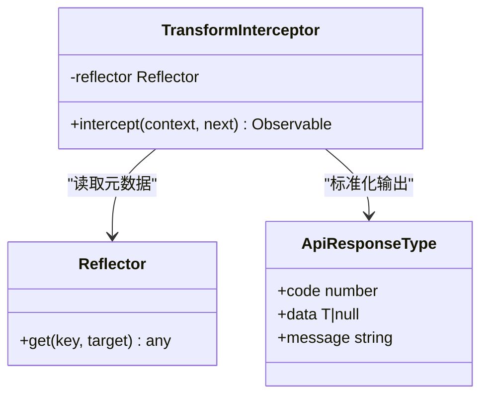
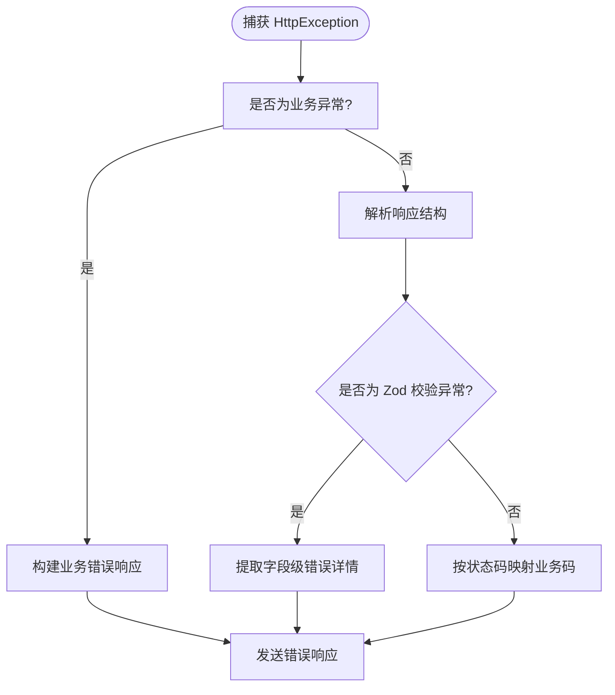
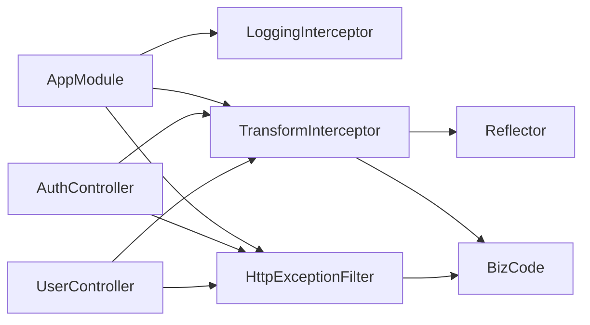

# 拦截器系统

<cite>
**本文引用的文件**
- [src/common/interceptors/logging.interceptor.ts](file://src/common/interceptors/logging.interceptor.ts)
- [src/common/interceptors/transform.interceptor.ts](file://src/common/interceptors/transform.interceptor.ts)
- [src/common/interceptors/transform.interceptor.spec.ts](file://src/common/interceptors/transform.interceptor.spec.ts)
- [src/common/dto/api-response.dto.ts](file://src/common/dto/api-response.dto.ts)
- [src/common/dto/api-error-response.dto.ts](file://src/common/dto/api-error-response.dto.ts)
- [src/common/enums/biz-code.enum.ts](file://src/common/enums/biz-code.enum.ts)
- [src/common/decorators/response-message.decorator.ts](file://src/common/decorators/response-message.decorator.ts)
- [src/common/decorators/api-success-response.decorator.ts](file://src/common/decorators/api-success-response.decorator.ts)
- [src/common/filters/http-exception.filter.ts](file://src/common/filters/http-exception.filter.ts)
- [src/app.module.ts](file://src/app.module.ts)
- [src/modules/auth/auth.controller.ts](file://src/modules/auth/auth.controller.ts)
- [src/modules/user/user.controller.ts](file://src/modules/user/user.controller.ts)
</cite>

## 目录

1. [简介](#简介)
2. [项目结构](#项目结构)
3. [核心组件](#核心组件)
4. [架构总览](#架构总览)
5. [详细组件分析](#详细组件分析)
6. [依赖分析](#依赖分析)
7. [性能考虑](#性能考虑)
8. [故障排查指南](#故障排查指南)
9. [结论](#结论)
10. [附录](#附录)

## 简介

本文件系统性梳理并说明本项目的拦截器体系，重点覆盖以下方面：

- 拦截器的执行机制与生命周期：如何在请求进入控制器前后进行处理，以及链式调用顺序。
- 日志拦截器：如何统一记录请求与响应，实现可追踪的日志能力。
- 数据转换拦截器：如何将控制器返回的数据标准化为统一的业务响应结构，包括数据格式化、错误包装与响应标准化。
- 性能优化策略：如何在保证功能的前提下降低拦截器带来的开销。
- 自定义拦截器开发指南：从设计原则到实现步骤，帮助开发者快速扩展。
- API 层应用示例与调试技巧：结合控制器与装饰器，展示拦截器在真实场景中的行为与调试方法。

## 项目结构

拦截器位于通用模块中，通过全局提供者注册到应用模块，对所有请求生效。其与控制器、装饰器、异常过滤器共同构成统一的请求处理与响应标准化体系。

图表来源

- [src/app.module.ts:18-61](file://src/app.module.ts#L18-L61)
- [src/common/interceptors/logging.interceptor.ts:12-39](file://src/common/interceptors/logging.interceptor.ts#L12-L39)
- [src/common/interceptors/transform.interceptor.ts:14-40](file://src/common/interceptors/transform.interceptor.ts#L14-L40)
- [src/common/decorators/response-message.decorator.ts:1-6](file://src/common/decorators/response-message.decorator.ts#L1-L6)
- [src/common/decorators/api-success-response.decorator.ts:1-172](file://src/common/decorators/api-success-response.decorator.ts#L1-L172)
- [src/common/filters/http-exception.filter.ts:24-78](file://src/common/filters/http-exception.filter.ts#L24-L78)
- [src/common/dto/api-response.dto.ts:1-27](file://src/common/dto/api-response.dto.ts#L1-L27)
- [src/common/dto/api-error-response.dto.ts:1-14](file://src/common/dto/api-error-response.dto.ts#L1-L14)
- [src/common/enums/biz-code.enum.ts:13-171](file://src/common/enums/biz-code.enum.ts#L13-L171)
- [src/modules/auth/auth.controller.ts:35-129](file://src/modules/auth/auth.controller.ts#L35-L129)
- [src/modules/user/user.controller.ts:25-88](file://src/modules/user/user.controller.ts#L25-L88)

章节来源

- [src/app.module.ts:18-61](file://src/app.module.ts#L18-L61)

## 核心组件

- 日志拦截器：在请求进入与完成时分别记录上下文信息，包含方法、URL、用户标识、IP、UA、耗时与状态码等，便于统一追踪。
- 数据转换拦截器：将控制器返回的原始数据标准化为统一的业务响应结构，自动填充业务码、消息与空数据处理；支持通过装饰器覆盖默认消息。
- 异常过滤器：捕获 HTTP 异常，将其映射为统一的业务错误响应结构，包含业务码、消息与可选的错误详情。
- 业务码与消息：集中管理业务码、默认消息与 HTTP 状态码映射，确保响应一致性。
- Swagger 装饰器：为接口生成统一的成功响应文档结构，与拦截器输出保持一致。

章节来源

- [src/common/interceptors/logging.interceptor.ts:12-39](file://src/common/interceptors/logging.interceptor.ts#L12-L39)
- [src/common/interceptors/transform.interceptor.ts:14-40](file://src/common/interceptors/transform.interceptor.ts#L14-L40)
- [src/common/filters/http-exception.filter.ts:24-78](file://src/common/filters/http-exception.filter.ts#L24-L78)
- [src/common/enums/biz-code.enum.ts:13-171](file://src/common/enums/biz-code.enum.ts#L13-L171)
- [src/common/decorators/api-success-response.decorator.ts:18-128](file://src/common/decorators/api-success-response.decorator.ts#L18-L128)

## 架构总览

拦截器在请求生命周期中的位置如下：请求进入 -> 全局守卫/节流 -> 拦截器链 -> 控制器 -> 异常过滤器 -> 客户端。

图表来源

- [src/app.module.ts:33-57](file://src/app.module.ts#L33-L57)
- [src/common/interceptors/logging.interceptor.ts:16-38](file://src/common/interceptors/logging.interceptor.ts#L16-L38)
- [src/common/interceptors/transform.interceptor.ts:21-39](file://src/common/interceptors/transform.interceptor.ts#L21-L39)
- [src/common/filters/http-exception.filter.ts:28-78](file://src/common/filters/http-exception.filter.ts#L28-L78)

## 详细组件分析

### 日志拦截器（LoggingInterceptor）

- 执行机制
  - 请求进入时读取请求上下文（方法、URL、IP、UA、用户标识），记录开始日志。
  - 通过管道在响应完成后计算耗时与状态码，记录结束日志。
- 生命周期
  - 开始阶段：记录请求基本信息。
  - 结束阶段：记录耗时与状态码，形成完整的请求轨迹。
- 关键点
  - 使用 RxJS 的 tap 在 next.handle() 完成后执行副作用。
  - 通过 Logger 输出，标签为 HTTP，便于日志聚合与检索。

图表来源

- [src/common/interceptors/logging.interceptor.ts:16-38](file://src/common/interceptors/logging.interceptor.ts#L16-L38)

章节来源

- [src/common/interceptors/logging.interceptor.ts:12-39](file://src/common/interceptors/logging.interceptor.ts#L12-L39)

### 数据转换拦截器（TransformInterceptor）

- 执行机制
  - 通过 Reflector 读取控制器处理器上的元数据，确定响应消息。
  - 使用 map 操作符将原始数据标准化为统一响应结构，空数据统一为 null。
  - 默认业务码为成功码，消息来自枚举或元数据。
- 生命周期
  - 在控制器返回数据后、异常过滤器之前执行，确保所有成功路径都被标准化。
- 关键点
  - 泛型约束确保响应结构与数据类型一致。
  - 与 ApiResponse DTO 保持结构一致，便于前端统一处理。

图表来源

- [src/common/interceptors/transform.interceptor.ts:14-40](file://src/common/interceptors/transform.interceptor.ts#L14-L40)
- [src/common/dto/api-response.dto.ts:22-27](file://src/common/dto/api-response.dto.ts#L22-L27)
- [src/common/decorators/response-message.decorator.ts:1-6](file://src/common/decorators/response-message.decorator.ts#L1-L6)

章节来源

- [src/common/interceptors/transform.interceptor.ts:14-40](file://src/common/interceptors/transform.interceptor.ts#L14-L40)
- [src/common/interceptors/transform.interceptor.spec.ts:22-107](file://src/common/interceptors/transform.interceptor.spec.ts#L22-L107)
- [src/common/dto/api-response.dto.ts:1-27](file://src/common/dto/api-response.dto.ts#L1-L27)
- [src/common/enums/biz-code.enum.ts:13-171](file://src/common/enums/biz-code.enum.ts#L13-L171)

### 异常过滤器（HttpExceptionFilter）

- 执行机制
  - 捕获 HttpException，区分业务异常与通用异常。
  - 将异常映射为统一的错误响应结构，包含业务码、消息与可选详情。
  - 对 Zod 校验异常提取字段级错误详情。
- 生命周期
  - 在拦截器之后、响应发送前执行，确保异常也被标准化。
- 关键点
  - 与业务码枚举联动，保证错误语义一致。
  - 与 Swagger 文档中的全局错误响应保持一致。

图表来源

- [src/common/filters/http-exception.filter.ts:24-78](file://src/common/filters/http-exception.filter.ts#L24-L78)
- [src/common/enums/biz-code.enum.ts:127-170](file://src/common/enums/biz-code.enum.ts#L127-L170)
- [src/common/dto/api-error-response.dto.ts:1-14](file://src/common/dto/api-error-response.dto.ts#L1-L14)

章节来源

- [src/common/filters/http-exception.filter.ts:24-173](file://src/common/filters/http-exception.filter.ts#L24-L173)
- [src/common/enums/biz-code.enum.ts:13-171](file://src/common/enums/biz-code.enum.ts#L13-L171)
- [src/common/dto/api-error-response.dto.ts:1-14](file://src/common/dto/api-error-response.dto.ts#L1-L14)

### 业务码与消息（BizCode）

- 设计要点
  - 分层业务码（成功、通用、模块级），便于前端与监控侧统一识别。
  - 默认消息与 HTTP 状态码映射，保证错误语义与状态码一致。
- 应用方式
  - 数据转换拦截器使用成功码与默认消息。
  - 异常过滤器将 HTTP 状态码映射为业务码。

章节来源

- [src/common/enums/biz-code.enum.ts:13-171](file://src/common/enums/biz-code.enum.ts#L13-L171)

### Swagger 装饰器与统一响应

- 设计要点
  - ApiSuccessResponse 与 ApiSuccessNoDataResponse 生成统一的成功响应文档结构。
  - ApiSuccessNoDataResponse 可同步设置响应消息元数据，供拦截器使用。
- 应用方式
  - 控制器方法上使用装饰器标注成功响应结构，拦截器输出与文档保持一致。

章节来源

- [src/common/decorators/api-success-response.decorator.ts:18-128](file://src/common/decorators/api-success-response.decorator.ts#L18-L128)
- [src/common/decorators/response-message.decorator.ts:1-6](file://src/common/decorators/response-message.decorator.ts#L1-L6)

## 依赖分析

- 全局注册
  - AppModule 通过 APP_INTERCEPTOR 提供日志与数据转换拦截器，确保所有请求均经过拦截。
  - 通过 APP_FILTER 提供异常过滤器，统一处理异常。
- 组件耦合
  - 数据转换拦截器依赖 Reflector 与业务码枚举，耦合度低，易于扩展。
  - 日志拦截器与控制器解耦，仅依赖请求/响应上下文。
  - 异常过滤器与业务码枚举耦合，保证错误语义一致。
- 链式调用顺序
  - 守卫/节流 -> 日志拦截器 -> 数据转换拦截器 -> 控制器 -> 异常过滤器。

图表来源

- [src/app.module.ts:33-57](file://src/app.module.ts#L33-L57)
- [src/common/interceptors/transform.interceptor.ts:19](file://src/common/interceptors/transform.interceptor.ts#L19)
- [src/common/enums/biz-code.enum.ts:13-171](file://src/common/enums/biz-code.enum.ts#L13-L171)
- [src/common/filters/http-exception.filter.ts:24-78](file://src/common/filters/http-exception.filter.ts#L24-L78)
- [src/modules/auth/auth.controller.ts:35-129](file://src/modules/auth/auth.controller.ts#L35-L129)
- [src/modules/user/user.controller.ts:25-88](file://src/modules/user/user.controller.ts#L25-L88)

章节来源

- [src/app.module.ts:18-61](file://src/app.module.ts#L18-L61)

## 性能考虑

- 拦截器链路开销
  - 日志拦截器仅在请求进入与完成时记录，开销极小。
  - 数据转换拦截器为纯函数式映射，RxJS 管道开销可控。
- 建议
  - 避免在拦截器中进行重 IO 操作（如数据库查询、外部网络请求）。
  - 对于高并发场景，建议将日志写入异步通道或批量缓冲。
  - 合理使用元数据反射，避免在热路径上频繁读取复杂元数据。
  - 控制器返回数据尽量轻量，减少序列化成本。

## 故障排查指南

- 常见问题
  - 响应未标准化：检查是否正确使用 ApiSuccessResponse 装饰器与数据转换拦截器。
  - 消息未按预期：确认是否通过 ApiSuccessNoDataResponse 的 message 参数设置元数据。
  - 异常未统一：检查异常过滤器是否生效，以及业务异常是否正确抛出。
  - 日志缺失：确认日志拦截器已注册为全局拦截器，且 Logger 标签为 HTTP。
- 调试技巧
  - 在本地启用更详细的日志级别，观察请求开始与结束日志。
  - 使用单元测试验证数据转换拦截器的行为，参考现有测试用例。
  - 对异常场景构造最小复现，验证异常过滤器映射逻辑。

章节来源

- [src/common/interceptors/transform.interceptor.spec.ts:22-107](file://src/common/interceptors/transform.interceptor.spec.ts#L22-L107)
- [src/common/filters/http-exception.filter.ts:28-78](file://src/common/filters/http-exception.filter.ts#L28-L78)
- [src/common/interceptors/logging.interceptor.ts:16-38](file://src/common/interceptors/logging.interceptor.ts#L16-L38)

## 结论

本拦截器系统通过“日志拦截器 + 数据转换拦截器 + 异常过滤器”的组合，实现了请求的统一追踪、响应的标准化与异常的规范化处理。配合业务码枚举与 Swagger 装饰器，确保了前后端一致的契约与可观测性。在性能方面，拦截器以轻量为主，适合在生产环境大规模使用；同时提供了清晰的扩展点，便于后续自定义拦截器的接入。

## 附录

### API 层应用示例与调试

- 示例一：统一响应结构
  - 控制器方法返回数据后，由数据转换拦截器自动包装为统一结构，消息来自装饰器或默认业务码消息。
  - 参考：[src/modules/auth/auth.controller.ts:57-86](file://src/modules/auth/auth.controller.ts#L57-L86)、[src/common/interceptors/transform.interceptor.ts:21-39](file://src/common/interceptors/transform.interceptor.ts#L21-L39)
- 示例二：无数据响应与消息定制
  - 使用 ApiSuccessNoDataResponse 并传入 message，拦截器会读取元数据覆盖默认消息。
  - 参考：[src/common/decorators/api-success-response.decorator.ts:110-128](file://src/common/decorators/api-success-response.decorator.ts#L110-L128)、[src/common/decorators/response-message.decorator.ts:1-6](file://src/common/decorators/response-message.decorator.ts#L1-L6)
- 示例三：异常统一处理
  - 抛出业务异常或通用异常，均由异常过滤器映射为统一错误响应结构。
  - 参考：[src/common/filters/http-exception.filter.ts:28-78](file://src/common/filters/http-exception.filter.ts#L28-L78)、[src/common/enums/biz-code.enum.ts:127-170](file://src/common/enums/biz-code.enum.ts#L127-L170)
