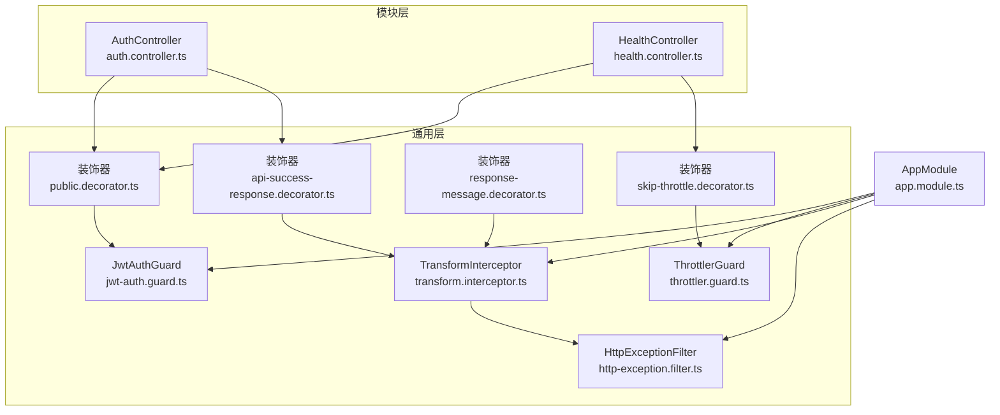
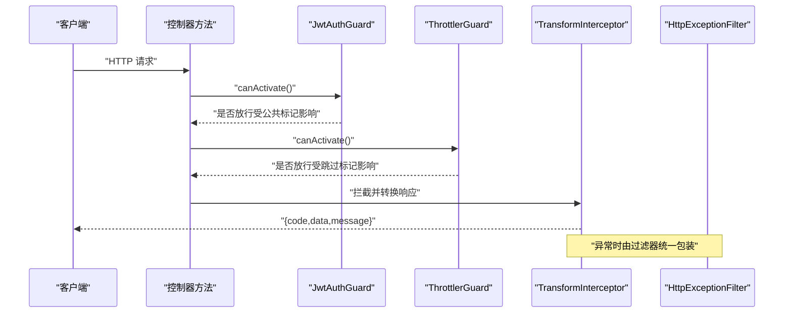
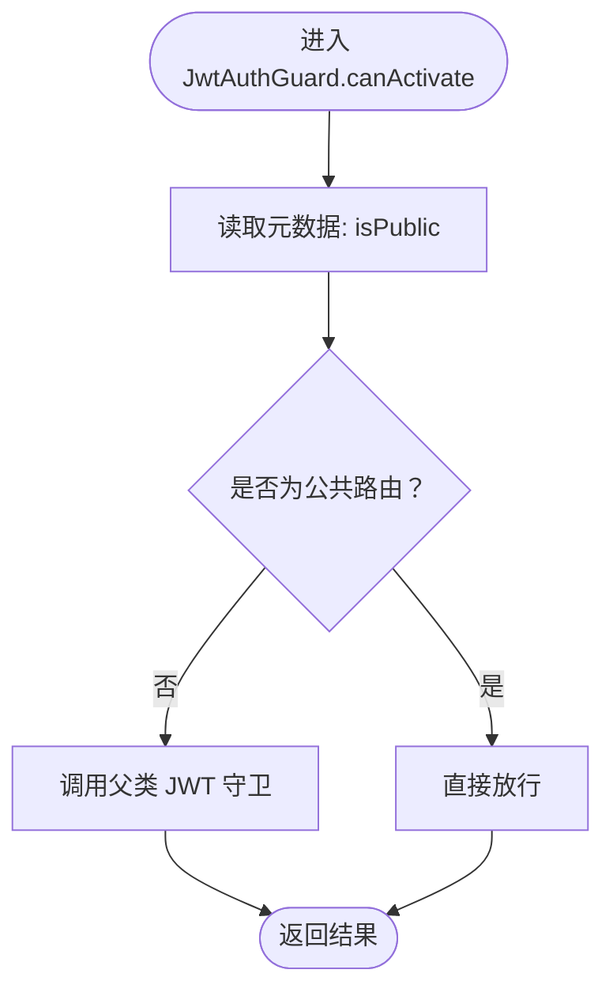
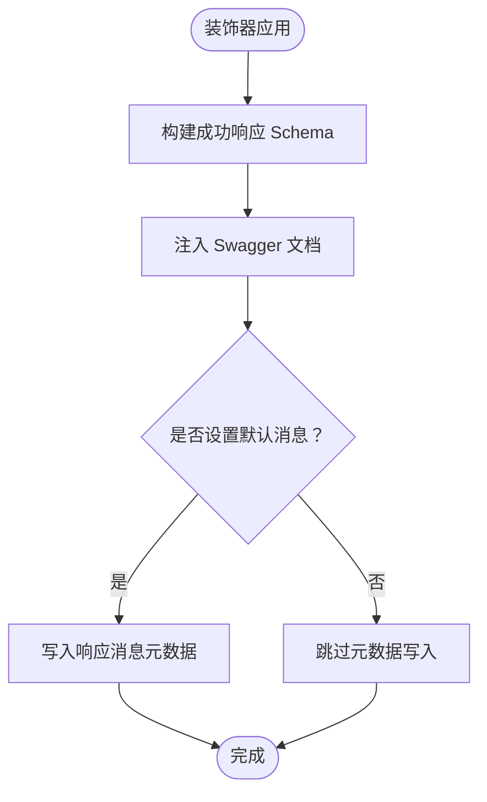
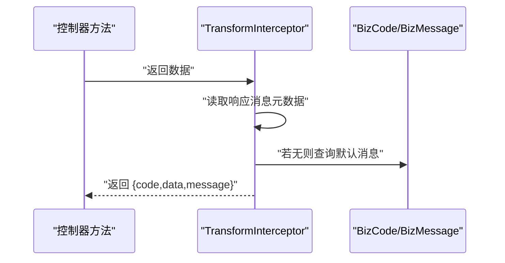
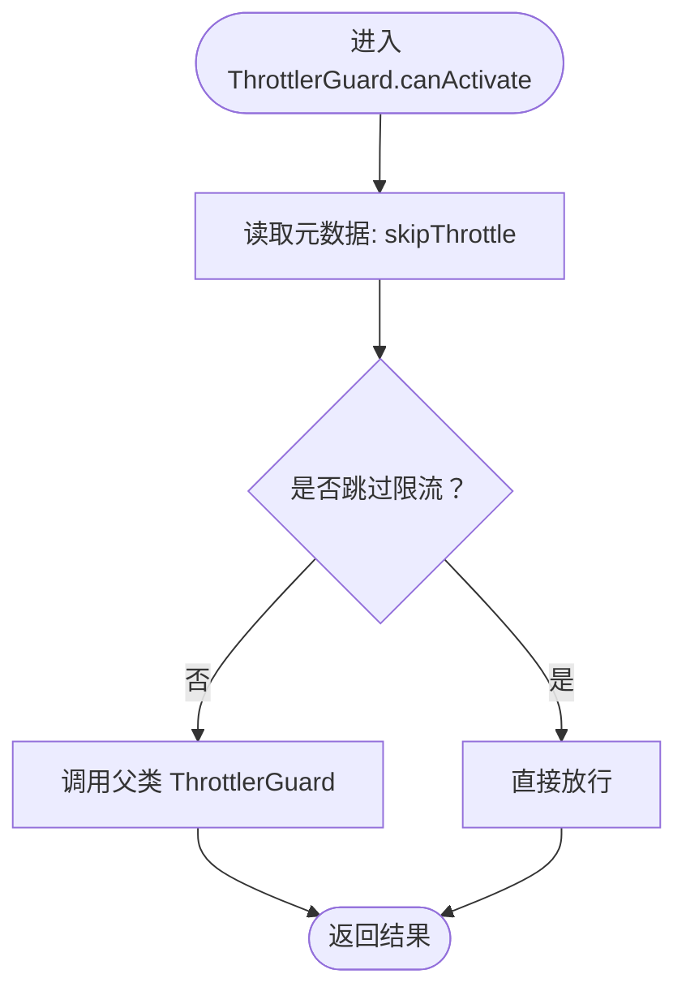
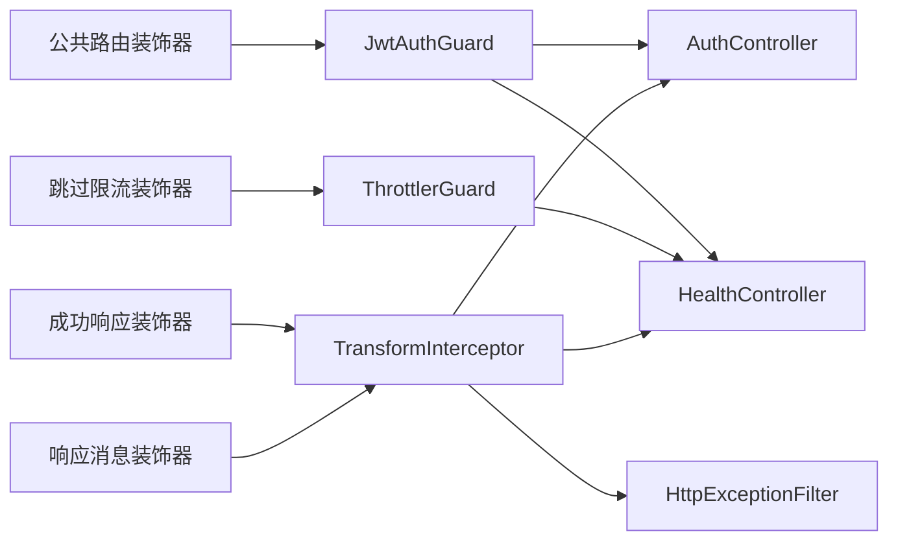

# 装饰器系统

<cite>
**本文引用的文件**
- [public.decorator.ts](file://src/common/decorators/public.decorator.ts)
- [api-success-response.decorator.ts](file://src/common/decorators/api-success-response.decorator.ts)
- [response-message.decorator.ts](file://src/common/decorators/response-message.decorator.ts)
- [skip-throttle.decorator.ts](file://src/common/decorators/skip-throttle.decorator.ts)
- [jwt-auth.guard.ts](file://src/common/guards/jwt-auth.guard.ts)
- [throttler.guard.ts](file://src/common/guards/throttler.guard.ts)
- [transform.interceptor.ts](file://src/common/interceptors/transform.interceptor.ts)
- [auth.controller.ts](file://src/modules/auth/auth.controller.ts)
- [health.controller.ts](file://src/modules/health/health.controller.ts)
- [app.module.ts](file://src/app.module.ts)
- [biz-code.enum.ts](file://src/common/enums/biz-code.enum.ts)
- [api-response.dto.ts](file://src/common/dto/api-response.dto.ts)
- [api-error-response.dto.ts](file://src/common/dto/api-error-response.dto.ts)
- [http-exception.filter.ts](file://src/common/filters/http-exception.filter.ts)
</cite>

## 目录

1. [引言](#引言)
2. [项目结构](#项目结构)
3. [核心组件](#核心组件)
4. [架构总览](#架构总览)
5. [详细组件分析](#详细组件分析)
6. [依赖关系分析](#依赖关系分析)
7. [性能考量](#性能考量)
8. [故障排查指南](#故障排查指南)
9. [结论](#结论)
10. [附录](#附录)

## 引言

本文件系统性梳理并阐述本项目的装饰器体系，重点覆盖以下主题：

- 自定义装饰器的设计原理与实现方式
- 公共路由装饰器如何绕过认证保护
- API 成功响应装饰器如何标准化响应格式
- 响应消息装饰器如何动态设置提示信息
- 跳过限流装饰器的实现机制与使用场景
- 装饰器的组合使用、元数据传递机制与性能影响
- 实际项目中的应用示例与开发最佳实践

## 项目结构

装饰器系统位于通用模块中，配合守卫、拦截器、过滤器与控制器共同工作，形成统一的认证、限流、响应标准化与日志记录链路。

图示来源

- [app.module.ts:18-61](file://src/app.module.ts#L18-L61)
- [jwt-auth.guard.ts:17-46](file://src/common/guards/jwt-auth.guard.ts#L17-L46)
- [throttler.guard.ts:10-33](file://src/common/guards/throttler.guard.ts#L10-L33)
- [transform.interceptor.ts:14-41](file://src/common/interceptors/transform.interceptor.ts#L14-L41)
- [auth.controller.ts:36-131](file://src/modules/auth/auth.controller.ts#L36-L131)
- [health.controller.ts:8-86](file://src/modules/health/health.controller.ts#L8-L86)

章节来源

- [app.module.ts:18-61](file://src/app.module.ts#L18-L61)

## 核心组件

- 公共路由装饰器：用于标记“无需认证”的路由，使 JwtAuthGuard 在决策时跳过鉴权流程。
- API 成功响应装饰器：统一 Swagger 文档与响应体结构，确保前后端一致的响应格式。
- 响应消息装饰器：为响应拦截器提供动态提示信息，默认回退至业务码对应的消息。
- 跳过限流装饰器：标记接口绕过 ThrottlerGuard 的速率限制，常用于健康检查等高频端点。

章节来源

- [public.decorator.ts:1-5](file://src/common/decorators/public.decorator.ts#L1-L5)
- [api-success-response.decorator.ts:1-153](file://src/common/decorators/api-success-response.decorator.ts#L1-L153)
- [response-message.decorator.ts:1-6](file://src/common/decorators/response-message.decorator.ts#L1-L6)
- [skip-throttle.decorator.ts:1-12](file://src/common/decorators/skip-throttle.decorator.ts#L1-L12)

## 架构总览

装饰器系统通过 NestJS 元数据与反射机制，将行为声明式地附加到控制器方法或类上；随后由守卫、拦截器与过滤器在运行时读取这些元数据，完成认证、限流、响应标准化与错误处理。

图示来源

- [jwt-auth.guard.ts:23-34](file://src/common/guards/jwt-auth.guard.ts#L23-L34)
- [throttler.guard.ts:20-31](file://src/common/guards/throttler.guard.ts#L20-L31)
- [transform.interceptor.ts:21-39](file://src/common/interceptors/transform.interceptor.ts#L21-L39)
- [http-exception.filter.ts:24-78](file://src/common/filters/http-exception.filter.ts#L24-L78)

## 详细组件分析

### 公共路由装饰器（绕过认证）

- 设计要点
  - 使用元数据键标识“公共路由”，JwtAuthGuard 在激活阶段通过反射读取该键决定是否放行。
  - 适用于无需登录即可访问的端点，如验证码生成、注册、登录、健康检查等。
- 运行时行为
  - 当标记为公共路由时，JwtAuthGuard 直接放行，不再执行 JWT 鉴权流程。
  - 若未标记，则沿用标准 JWT 鉴权逻辑，失败时抛出业务异常。
- 控制器示例
  - 认证模块中的验证码、注册、登录、刷新等接口均使用该装饰器。
  - 健康检查模块在类级别使用该装饰器，使所有子路由均为公共访问。

图示来源

- [jwt-auth.guard.ts:23-34](file://src/common/guards/jwt-auth.guard.ts#L23-L34)
- [public.decorator.ts:3-4](file://src/common/decorators/public.decorator.ts#L3-L4)

章节来源

- [public.decorator.ts:1-5](file://src/common/decorators/public.decorator.ts#L1-L5)
- [jwt-auth.guard.ts:17-46](file://src/common/guards/jwt-auth.guard.ts#L17-L46)
- [auth.controller.ts:46-57](file://src/modules/auth/auth.controller.ts#L46-L57)
- [health.controller.ts:14-16](file://src/modules/health/health.controller.ts#L14-L16)

### API 成功响应装饰器（标准化响应格式）

- 设计要点
  - 统一成功响应结构：包含业务码、数据体与消息；数据体支持单对象或数组。
  - 通过 Swagger 装饰器与 Zod schema 引用，保证文档与运行时结构一致。
  - 支持“无数据”场景，允许同时设置默认消息并写入响应消息元数据。
- 关键实现
  - 构建成功响应 Schema：基础属性与 data 字段（对象或数组）。
  - 无数据模式：固定 data 为 null，并可设置示例消息。
  - 全局错误响应：一键注入 400/500 错误文档，与统一错误 DTO 保持一致。
- 控制器示例
  - 注册、登录、刷新等接口使用带类型的 ApiSuccessResponse。
  - 退出登录使用 ApiSuccessNoDataResponse 并设置“退出成功”。

图示来源

- [api-success-response.decorator.ts:90-130](file://src/common/decorators/api-success-response.decorator.ts#L90-L130)
- [api-response.dto.ts:9-27](file://src/common/dto/api-response.dto.ts#L9-L27)

章节来源

- [api-success-response.decorator.ts:1-153](file://src/common/decorators/api-success-response.decorator.ts#L1-L153)
- [api-response.dto.ts:1-27](file://src/common/dto/api-response.dto.ts#L1-L27)
- [auth.controller.ts:67-70](file://src/modules/auth/auth.controller.ts#L67-L70)
- [auth.controller.ts:113-116](file://src/modules/auth/auth.controller.ts#L113-L116)

### 响应消息装饰器（动态提示信息）

- 设计要点
  - 通过元数据键为响应拦截器提供自定义消息。
  - 若未显式设置，拦截器回退到业务码对应的默认消息。
- 运行时行为
  - TransformInterceptor 在响应前从元数据读取消息键，优先使用装饰器提供的消息。
  - 业务码与默认消息映射由枚举统一管理，确保一致性。
- 控制器示例
  - 退出登录接口使用 ApiSuccessNoDataResponse 的 message 选项，间接写入响应消息元数据。

图示来源

- [transform.interceptor.ts:21-39](file://src/common/interceptors/transform.interceptor.ts#L21-L39)
- [biz-code.enum.ts:83-122](file://src/common/enums/biz-code.enum.ts#L83-L122)
- [response-message.decorator.ts:3-5](file://src/common/decorators/response-message.decorator.ts#L3-L5)

章节来源

- [response-message.decorator.ts:1-6](file://src/common/decorators/response-message.decorator.ts#L1-L6)
- [transform.interceptor.ts:14-41](file://src/common/interceptors/transform.interceptor.ts#L14-L41)
- [biz-code.enum.ts:1-171](file://src/common/enums/biz-code.enum.ts#L1-L171)
- [auth.controller.ts:113-116](file://src/modules/auth/auth.controller.ts#L113-L116)

### 跳过限流装饰器（实现机制与场景）

- 设计要点
  - 通过元数据键标记“跳过限流”，自定义 ThrottlerGuard 在激活时读取该键。
  - 适用于高频但低风险的端点，如健康检查、Ping 接口等。
- 运行时行为
  - 当标记为跳过限流时，ThrottlerGuard 直接放行，不进行速率限制判断。
  - 否则委托给父类 ThrottlerGuard 执行默认限流策略。
- 控制器示例
  - 健康检查模块在类级别使用该装饰器，使根路径与 ping 路由均不受限流约束。

图示来源

- [throttler.guard.ts:20-31](file://src/common/guards/throttler.guard.ts#L20-L31)
- [skip-throttle.decorator.ts:3-11](file://src/common/decorators/skip-throttle.decorator.ts#L3-L11)

章节来源

- [skip-throttle.decorator.ts:1-12](file://src/common/decorators/skip-throttle.decorator.ts#L1-L12)
- [throttler.guard.ts:10-33](file://src/common/guards/throttler.guard.ts#L10-L33)
- [health.controller.ts:10-16](file://src/modules/health/health.controller.ts#L10-L16)

### 装饰器组合使用与元数据传递

- 组合示例
  - 公共路由 + 成功响应：验证码接口同时具备“无需认证”和“统一响应格式”能力。
  - 公共路由 + 跳过限流：健康检查接口同时具备“无需认证”和“不限流”能力。
  - 成功响应 + 响应消息：退出登录接口同时具备“统一响应格式”和“自定义消息”能力。
- 元数据传递机制
  - 装饰器通过 SetMetadata 写入元数据键，守卫与拦截器通过 Reflector 读取。
  - 元数据键命名规范清晰，避免冲突并便于维护。
- 性能影响
  - 反射读取发生在请求生命周期早期，开销极小。
  - 仅在必要装饰器存在时才触发相应逻辑，避免不必要的分支判断。

章节来源

- [auth.controller.ts:46-57](file://src/modules/auth/auth.controller.ts#L46-L57)
- [auth.controller.ts:113-116](file://src/modules/auth/auth.controller.ts#L113-L116)
- [health.controller.ts:10-16](file://src/modules/health/health.controller.ts#L10-L16)
- [api-success-response.decorator.ts:112-130](file://src/common/decorators/api-success-response.decorator.ts#L112-L130)

## 依赖关系分析

装饰器系统与守卫、拦截器、过滤器之间存在明确的依赖与协作关系：

图示来源

- [jwt-auth.guard.ts:19-34](file://src/common/guards/jwt-auth.guard.ts#L19-L34)
- [throttler.guard.ts:12-31](file://src/common/guards/throttler.guard.ts#L12-L31)
- [transform.interceptor.ts:19-39](file://src/common/interceptors/transform.interceptor.ts#L19-L39)
- [auth.controller.ts:36-131](file://src/modules/auth/auth.controller.ts#L36-L131)
- [health.controller.ts:8-86](file://src/modules/health/health.controller.ts#L8-L86)

章节来源

- [app.module.ts:18-61](file://src/app.module.ts#L18-L61)

## 性能考量

- 反射成本：装饰器读取元数据发生在请求生命周期早期，且仅在存在相应装饰器时触发，整体开销可忽略。
- 限流优化：对高频公共端点使用“跳过限流”装饰器，避免限流带来的额外判断成本。
- 响应标准化：统一响应结构减少序列化与前端解析复杂度，提升整体吞吐。
- 错误处理：统一错误过滤器减少重复逻辑，降低异常路径的分支复杂度。

## 故障排查指南

- 认证相关
  - 现象：登录后仍提示未授权。
  - 排查：确认路由是否正确添加公共装饰器；检查 JwtAuthGuard 是否被全局注册。
- 限流相关
  - 现象：健康检查接口仍被限流。
  - 排查：确认是否在类或方法上添加了跳过限流装饰器；检查自定义 ThrottlerGuard 是否生效。
- 响应格式不一致
  - 现象：部分接口返回结构与统一格式不符。
  - 排查：确认是否使用了成功响应装饰器；检查拦截器是否被全局注册。
- 错误消息异常
  - 现象：接口返回默认消息而非预期提示。
  - 排查：确认是否设置了响应消息装饰器；检查业务码与默认消息映射是否正确。

章节来源

- [jwt-auth.guard.ts:19-44](file://src/common/guards/jwt-auth.guard.ts#L19-L44)
- [throttler.guard.ts:12-31](file://src/common/guards/throttler.guard.ts#L12-L31)
- [transform.interceptor.ts:19-39](file://src/common/interceptors/transform.interceptor.ts#L19-L39)
- [http-exception.filter.ts:24-78](file://src/common/filters/http-exception.filter.ts#L24-L78)

## 结论

本装饰器系统以“声明式元数据 + 运行时反射”为核心，实现了认证豁免、限流控制、响应标准化与消息定制的解耦设计。通过在控制器层面的灵活组合，开发者可以快速构建一致、可观测且高性能的 API。建议在新增接口时遵循“先装饰后实现”的原则，确保风格统一与维护便利。

## 附录

- 开发最佳实践
  - 为每个公共端点明确标注公共装饰器，避免误判。
  - 对高频但低风险接口使用跳过限流装饰器，提升可观测性与稳定性。
  - 统一使用成功响应装饰器，减少前后端差异与调试成本。
  - 通过响应消息装饰器提供明确的业务提示，必要时结合业务码枚举。
  - 在控制器中按功能分组使用装饰器，保持代码可读性与可维护性。
