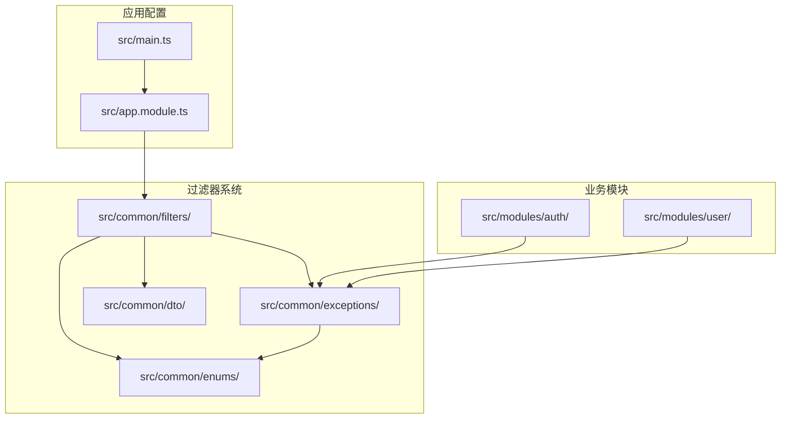
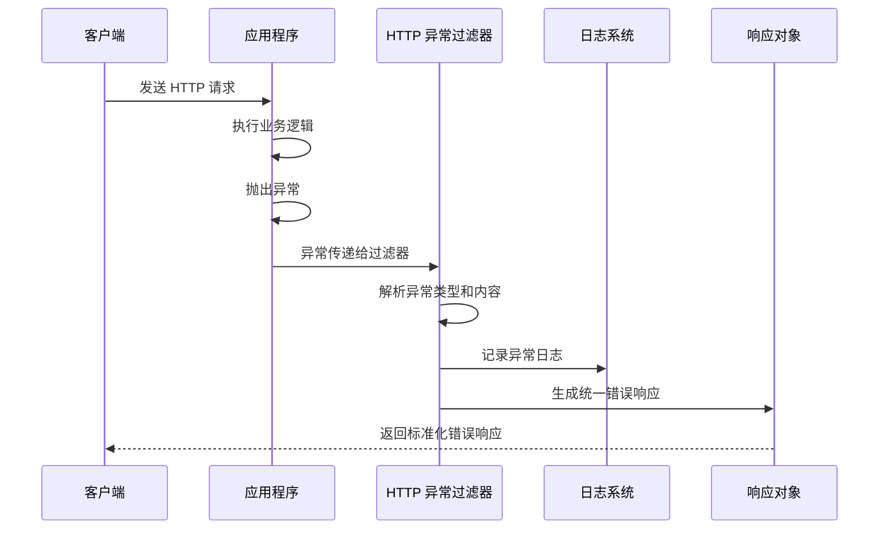
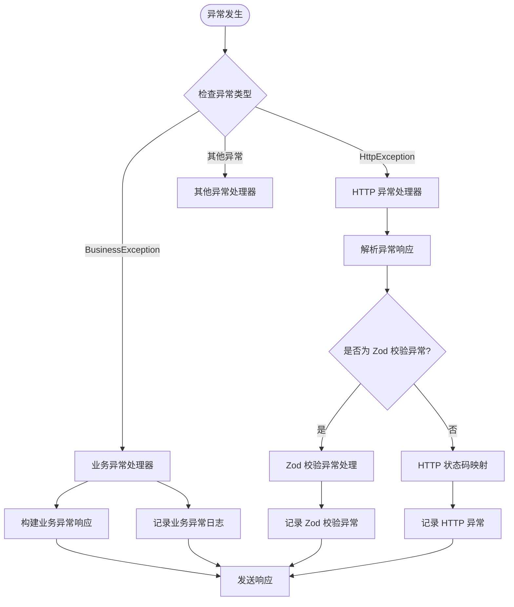
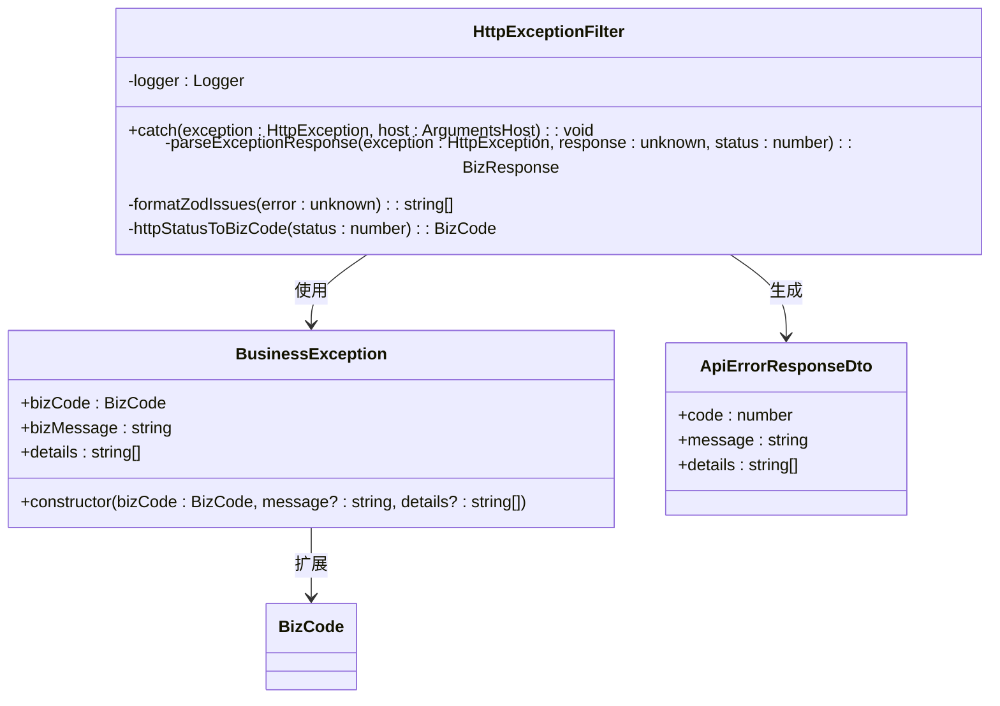
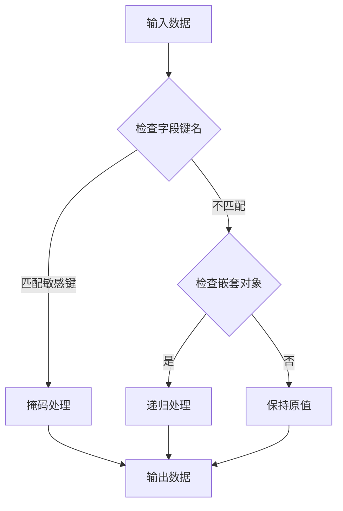
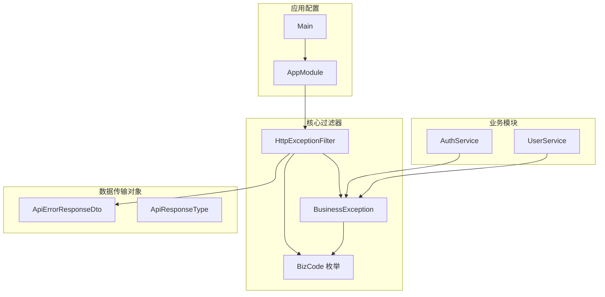

# 过滤器系统

<cite>
**本文引用的文件**
- [src/common/filters/http-exception.filter.ts](file://src/common/filters/http-exception.filter.ts)
- [src/common/dto/api-error-response.dto.ts](file://src/common/dto/api-error-response.dto.ts)
- [src/common/exceptions/business.exception.ts](file://src/common/exceptions/business.exception.ts)
- [src/common/enums/biz-code.enum.ts](file://src/common/enums/biz-code.enum.ts)
- [src/common/dto/api-response.dto.ts](file://src/common/dto/api-response.dto.ts)
- [src/common/filters/http-exception.filter.spec.ts](file://src/common/filters/http-exception.filter.spec.ts)
- [src/app.module.ts](file://src/app.module.ts)
- [src/main.ts](file://src/main.ts)
- [src/common/utils/sanitize.util.ts](file://src/common/utils/sanitize.util.ts)
- [src/modules/auth/auth.service.ts](file://src/modules/auth/auth.service.ts)
- [src/modules/user/user.service.ts](file://src/modules/user/user.service.ts)
- [src/modules/auth/auth.controller.ts](file://src/modules/auth/auth.controller.ts)
- [src/modules/user/user.controller.ts](file://src/modules/user/user.controller.ts)
</cite>

## 目录

1. [简介](#简介)
2. [项目结构](#项目结构)
3. [核心组件](#核心组件)
4. [架构概览](#架构概览)
5. [详细组件分析](#详细组件分析)
6. [依赖关系分析](#依赖关系分析)
7. [性能考虑](#性能考虑)
8. [故障排除指南](#故障排除指南)
9. [结论](#结论)
10. [附录](#附录)

## 简介

本项目实现了完整的 NestJS 过滤器系统，专注于统一的异常处理和错误响应格式。该系统通过全局 HTTP 异常过滤器实现了标准化的错误响应结构，支持业务异常的分类处理、国际化支持以及敏感信息过滤。

过滤器系统的核心目标是：

- 提供统一的错误响应格式
- 支持业务异常的分类和处理策略
- 实现错误码定义和国际化支持
- 处理敏感信息过滤
- 提供自定义过滤器开发指南

## 项目结构

过滤器系统主要分布在以下目录结构中：



**图表来源**

- [src/common/filters/http-exception.filter.ts:1-173](file://src/common/filters/http-exception.filter.ts#L1-L173)
- [src/app.module.ts:1-61](file://src/app.module.ts#L1-L61)

**章节来源**

- [src/common/filters/http-exception.filter.ts:1-173](file://src/common/filters/http-exception.filter.ts#L1-L173)
- [src/app.module.ts:1-61](file://src/app.module.ts#L1-L61)

## 核心组件

### HTTP 异常过滤器

HTTP 异常过滤器是整个过滤器系统的核心组件，负责捕获和处理所有 HTTP 异常。

#### 主要功能特性

1. **业务异常处理**：直接使用 BusinessException 携带的业务码信息
2. **通用 HTTP 异常映射**：将标准 HttpException 映射到业务码
3. **Zod 校验异常处理**：专门处理参数验证错误
4. **日志记录**：记录异常信息和请求上下文
5. **统一响应格式**：输出标准化的错误响应结构

#### 关键实现细节

- 使用 `@Catch(HttpException)` 装饰器捕获所有 HTTP 异常
- 支持多种异常响应格式的解析和转换
- 实现了详细的错误详情收集和格式化
- 提供了完整的测试覆盖

**章节来源**

- [src/common/filters/http-exception.filter.ts:24-78](file://src/common/filters/http-exception.filter.ts#L24-L78)

### 业务异常类

BusinessException 是自定义的业务异常类，扩展了 NestJS 的 HttpException。

#### 设计特点

- 统一携带业务码信息
- 自动映射到相应的 HTTP 状态码
- 支持自定义错误消息
- 可选的错误详情数组

#### 构造函数参数

- `bizCode`: 业务状态码（来自 BizCode 枚举）
- `message`: 自定义错误消息（可选）
- `details`: 错误详情数组（可选）

**章节来源**

- [src/common/exceptions/business.exception.ts:16-41](file://src/common/exceptions/business.exception.ts#L16-L41)

### 业务码枚举系统

业务码采用分层命名规范，便于模块化管理和扩展。

#### 分层结构

- **0**: 成功状态
- **1xxx**: 通用错误
- **10xxx**: 认证模块
- **20xxx**: 用户模块
- **30xxx**: 菜单模块
- **40xxx**: 角色模块
- **50xxx**: 字典模块

#### 默认消息支持

系统提供了完整的默认错误消息映射，支持多语言扩展。

**章节来源**

- [src/common/enums/biz-code.enum.ts:13-78](file://src/common/enums/biz-code.enum.ts#L13-L78)

## 架构概览

过滤器系统采用全局配置的方式，在应用启动时注册为全局异常处理器。



**图表来源**

- [src/app.module.ts:55-57](file://src/app.module.ts#L55-L57)
- [src/common/filters/http-exception.filter.ts:28-78](file://src/common/filters/http-exception.filter.ts#L28-L78)

### 异常处理流程



**图表来源**

- [src/common/filters/http-exception.filter.ts:36-134](file://src/common/filters/http-exception.filter.ts#L36-L134)

## 详细组件分析

### HTTP 异常过滤器实现

#### 类结构设计



**图表来源**

- [src/common/filters/http-exception.filter.ts:24-173](file://src/common/filters/http-exception.filter.ts#L24-L173)
- [src/common/exceptions/business.exception.ts:16-41](file://src/common/exceptions/business.exception.ts#L16-L41)
- [src/common/dto/api-error-response.dto.ts:1-14](file://src/common/dto/api-error-response.dto.ts#L1-L14)

#### 异常解析机制

过滤器实现了多层次的异常解析机制：

1. **业务异常识别**：通过 `instanceof BusinessException` 判断
2. **响应格式检测**：识别字符串、数组、对象等不同格式
3. **Zod 校验异常处理**：专门处理参数验证错误
4. **HTTP 状态码映射**：将标准 HTTP 状态码映射到业务码

**章节来源**

- [src/common/filters/http-exception.filter.ts:80-134](file://src/common/filters/http-exception.filter.ts#L80-L134)

### 业务异常处理策略

#### 错误码定义规范

业务异常采用统一的错误码定义规范，确保系统的一致性和可维护性。

##### 错误码层次结构

```mermaid
graph TD
Root[业务错误码根] --> Success[0 成功]
Root --> General[1xxx 通用错误]
General --> Unknown[1000 未知错误]
General --> Validation[1001 请求参数校验失败]
General --> Unauthorized[1002 未授权，请先登录]
General --> Forbidden[1003 权限不足]
General --> NotFound[1004 资源不存在]
General --> InternalError[1099 服务器内部错误]
Root --> Auth[10xxx 认证模块]
Auth --> InvalidCredentials[10001 凭证无效]
Auth --> EmailExists[10002 邮箱已注册]
Auth --> UsernameTaken[10003 用户名已被占用]
Auth --> InvalidRefreshToken[10004 刷新令牌无效]
Root --> User[20xxx 用户模块]
User --> UserNotFound[20001 用户不存在]
User --> UserEmailExists[20002 用户邮箱已存在]
Root --> Menu[30xxx 菜单模块]
Menu --> MenuNotFound[30001 菜单不存在]
Menu --> MenuExists[30002 菜单名称已存在]
Root --> Role[40xxx 角色模块]
Role --> RoleNotFound[40001 角色不存在]
Role --> RoleExists[40002 角色名称已存在]
Root --> Dict[50xxx 字典模块]
Dict --> DictTypeNotFound[50001 字典类型不存在]
Dict --> DictTypeExists[50002 字典类型编码已存在]
Dict --> DictValueNotFound[50003 字典值不存在]
Dict --> DictValueExists[50004 字典值编码已存在]
```



**图表来源**

- [src/common/enums/biz-code.enum.ts:13-78](file://src/common/enums/biz-code.enum.ts#L13-L78)

#### 国际化支持

系统提供了完善的国际化支持机制：

1. **默认消息映射**：每个业务码都有对应的默认中文消息
2. **自定义消息支持**：允许在抛出异常时提供自定义消息
3. **扩展性设计**：支持添加新的语言版本

**章节来源**

- [src/common/enums/biz-code.enum.ts:83-122](file://src/common/enums/biz-code.enum.ts#L83-L122)

### 敏感信息过滤

系统实现了多层次的敏感信息过滤机制，确保用户隐私和系统安全。

#### 敏感信息识别

敏感信息过滤器识别以下类型的敏感数据：

- 密码相关字段：password、passwordConfirm
- 令牌相关字段：token、accessToken、refreshToken
- 认证相关字段：authorization、cookie
- 个人身份信息：secret、creditCard、ssn

#### 过滤实现机制



**图表来源**

- [src/common/utils/sanitize.util.ts:1-44](file://src/common/utils/sanitize.util.ts#L1-L44)

**章节来源**

- [src/common/utils/sanitize.util.ts:18-43](file://src/common/utils/sanitize.util.ts#L18-L43)

### 自定义过滤器开发指南

#### 开发步骤

1. **创建过滤器类**：实现 ExceptionFilter 接口
2. **添加装饰器**：使用 @Catch 装饰器指定捕获的异常类型
3. **实现 catch 方法**：处理异常并生成响应
4. **注册过滤器**：在应用配置中注册为全局过滤器

#### 最佳实践

- **单一职责原则**：每个过滤器专注于特定类型的异常处理
- **日志记录**：确保重要的异常信息被记录
- **响应一致性**：保持错误响应格式的一致性
- **性能考虑**：避免在过滤器中执行耗时操作

**章节来源**

- [src/common/filters/http-exception.filter.ts:24-26](file://src/common/filters/http-exception.filter.ts#L24-L26)

## 依赖关系分析

过滤器系统与其他组件的依赖关系如下：



**图表来源**

- [src/app.module.ts:55-57](file://src/app.module.ts#L55-L57)
- [src/common/filters/http-exception.filter.ts:1-12](file://src/common/filters/http-exception.filter.ts#L1-L12)

### 关键依赖链

1. **过滤器依赖**：HttpExceptionFilter 依赖 BusinessException 和 BizCode 枚举
2. **业务依赖**：业务服务依赖 BusinessException 进行异常抛出
3. **配置依赖**：AppModule 将过滤器注册为全局处理器
4. **DTO 依赖**：过滤器使用 ApiErrorResponseDto 生成统一响应

**章节来源**

- [src/app.module.ts:55-57](file://src/app.module.ts#L55-L57)
- [src/modules/auth/auth.service.ts:38-61](file://src/modules/auth/auth.service.ts#L38-L61)
- [src/modules/user/user.service.ts:23-54](file://src/modules/user/user.service.ts#L23-L54)

## 性能考虑

### 过滤器性能优化

1. **避免重复计算**：缓存 BizCode 到 HTTP 状态码的映射结果
2. **延迟处理**：只在必要时进行敏感信息过滤
3. **内存管理**：及时释放异常对象引用
4. **日志级别**：合理设置日志级别以减少 I/O 操作

### 异常处理性能

1. **快速路径**：优先处理常见的异常类型
2. **短路返回**：在确定异常类型后立即返回
3. **批量处理**：对多个异常进行批量处理
4. **异步处理**：将耗时的日志记录操作异步化

## 故障排除指南

### 常见问题诊断

#### 异常未被捕获

**可能原因**：

- 过滤器未正确注册为全局过滤器
- 异常类型不在 @Catch 装饰器范围内
- 异常在过滤器之前被其他中间件处理

**解决方案**：

- 检查 AppModule 中的 APP_FILTER 配置
- 确认异常类型与 @Catch 装饰器匹配
- 调整中间件的执行顺序

#### 错误响应格式不正确

**可能原因**：

- ApiErrorResponseDto 验证失败
- 业务码映射错误
- 自定义消息为空

**解决方案**：

- 检查 ApiErrorResponseDto 的 Zod 验证规则
- 验证 BizCode 枚举的完整性
- 确保自定义消息的正确性

#### 敏感信息未被过滤

**可能原因**：

- 敏感字段名称不匹配
- 嵌套对象未被正确处理
- 过滤器未在正确的生命周期调用

**解决方案**：

- 更新敏感字段列表
- 检查嵌套对象的递归处理逻辑
- 确认过滤器的调用时机

**章节来源**

- [src/common/filters/http-exception.filter.spec.ts:1-136](file://src/common/filters/http-exception.filter.spec.ts#L1-L136)

### 调试方法

#### 日志分析

1. **启用详细日志**：在开发环境中启用更详细的日志记录
2. **异常堆栈跟踪**：查看完整的异常堆栈信息
3. **请求上下文**：分析请求方法、URL 和参数
4. **时间戳分析**：监控异常发生的时间模式

#### 单元测试

1. **覆盖率分析**：确保所有异常分支都被测试覆盖
2. **边界条件测试**：测试极端情况下的异常处理
3. **集成测试**：验证过滤器在整个请求生命周期中的行为
4. **性能测试**：评估过滤器的性能影响

**章节来源**

- [src/common/filters/http-exception.filter.spec.ts:27-134](file://src/common/filters/http-exception.filter.spec.ts#L27-L134)

## 结论

本项目的过滤器系统实现了高度标准化的异常处理机制，具有以下优势：

1. **统一性**：所有异常都通过统一的过滤器处理，确保响应格式的一致性
2. **可扩展性**：采用分层的业务码设计，便于功能模块的扩展
3. **安全性**：内置敏感信息过滤机制，保护用户隐私
4. **可观测性**：完整的日志记录和错误追踪能力
5. **易维护性**：清晰的代码结构和完善的测试覆盖

通过全局配置的方式，系统确保了异常处理的可靠性和一致性，为后续的功能扩展奠定了坚实的基础。

## 附录

### 使用示例

#### 抛出业务异常

```typescript
// 在业务逻辑中抛出业务异常
throw new BusinessException(BizCode.USER_NOT_FOUND);

// 抛出自定义消息的业务异常
throw new BusinessException(BizCode.VALIDATION_ERROR, '自定义验证错误消息');

// 抛出带有详细信息的业务异常
throw new BusinessException(BizCode.VALIDATION_ERROR, '参数验证失败', [
  '用户名不能为空',
  '邮箱格式不正确',
]);
```

#### 获取统一错误响应

```typescript
// 过滤器会自动将异常转换为统一格式
{
  code: 20001,
  message: '用户不存在',
  details: null
}

// 参数验证错误的详细格式
{
  code: 1001,
  message: '请求参数校验失败',
  details: [
    'email 必须是有效的邮箱地址',
    'password 必须至少 6 个字符'
  ]
}
```

### 配置选项

#### 全局过滤器配置

在 AppModule 中配置全局异常过滤器：

```typescript
providers: [
  {
    provide: APP_FILTER,
    useClass: HttpExceptionFilter,
  },
];
```

#### 自定义过滤器注册

如果需要注册多个过滤器：

```typescript
providers: [
  {
    provide: APP_FILTER,
    useClass: HttpExceptionFilter,
  },
  {
    provide: APP_FILTER,
    useClass: AnotherExceptionFilter,
  },
];
```
