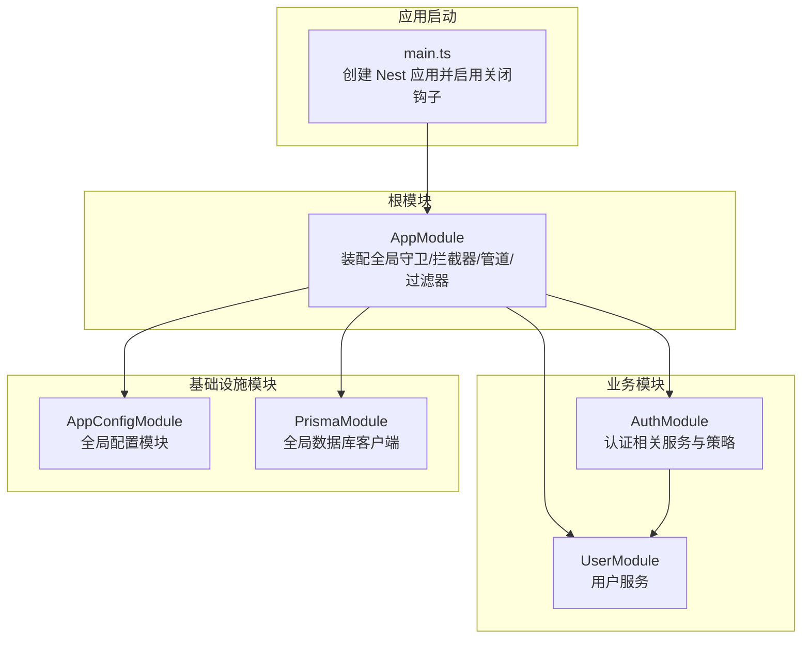
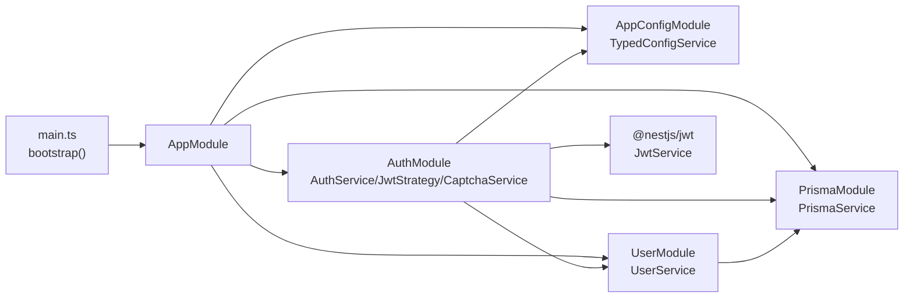
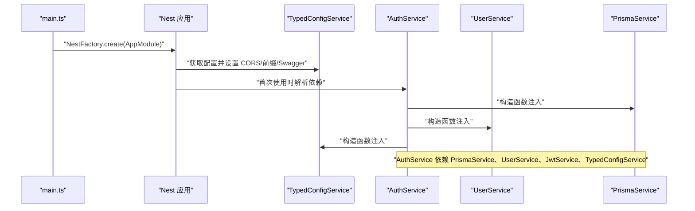
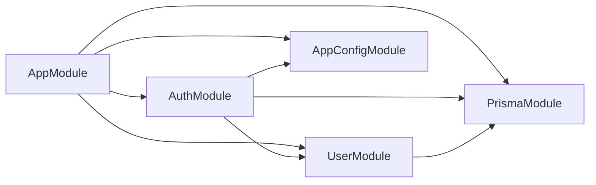

# 依赖注入机制

<cite>
**本文引用的文件**
- [src/app.module.ts](file://src/app.module.ts)
- [src/main.ts](file://src/main.ts)
- [src/modules/auth/auth.module.ts](file://src/modules/auth/auth.module.ts)
- [src/modules/auth/auth.service.ts](file://src/modules/auth/auth.service.ts)
- [src/modules/user/user.module.ts](file://src/modules/user/user.module.ts)
- [src/modules/user/user.service.ts](file://src/modules/user/user.service.ts)
- [src/prisma/prisma.module.ts](file://src/prisma/prisma.module.ts)
- [src/prisma/prisma.service.ts](file://src/prisma/prisma.service.ts)
- [src/config/config.module.ts](file://src/config/config.module.ts)
- [src/config/typed-config.service.ts](file://src/config/typed-config.service.ts)
- [src/common/guards/jwt-auth.guard.ts](file://src/common/guards/jwt-auth.guard.ts)
- [src/common/interceptors/logging.interceptor.ts](file://src/common/interceptors/logging.interceptor.ts)
- [src/common/interceptors/transform.interceptor.ts](file://src/common/interceptors/transform.interceptor.ts)
- [package.json](file://package.json)
</cite>

## 目录
1. [引言](#引言)
2. [项目结构](#项目结构)
3. [核心组件](#核心组件)
4. [架构总览](#架构总览)
5. [详细组件分析](#详细组件分析)
6. [依赖关系分析](#依赖关系分析)
7. [性能考量](#性能考量)
8. [故障排查指南](#故障排查指南)
9. [结论](#结论)
10. [附录](#附录)

## 引言
本文件系统性阐述本项目的依赖注入（DI）机制与最佳实践，围绕以下主题展开：
- 提供者（Providers）：如何声明、实例化与导出服务
- 注入器（Injectors）：如何在控制器、服务、守卫、拦截器中进行依赖注入
- 注入令牌（Injection Tokens）：应用层常量令牌与框架内置令牌的使用
- 模块级配置：@Module() 的 providers、exports、imports 的作用与边界
- 生命周期管理：OnModuleInit、OnModuleDestroy 等钩子的使用
- 循环依赖检测与解决：在本项目中的体现与建议
- 配置示例与最佳实践：结合现有代码给出可操作的指导

## 项目结构
本项目采用模块化组织，根模块负责装配全局中间件（守卫、拦截器、管道、过滤器），业务模块按功能拆分，基础设施模块（如数据库、配置）以全局模块形式提供。

图表来源
- [src/main.ts:8-36](file://src/main.ts#L8-L36)
- [src/app.module.ts:18-59](file://src/app.module.ts#L18-L59)
- [src/modules/auth/auth.module.ts:11-32](file://src/modules/auth/auth.module.ts#L11-L32)
- [src/modules/user/user.module.ts:5-10](file://src/modules/user/user.module.ts#L5-L10)
- [src/config/config.module.ts:6-19](file://src/config/config.module.ts#L6-L19)
- [src/prisma/prisma.module.ts:4-9](file://src/prisma/prisma.module.ts#L4-L9)

章节来源
- [src/main.ts:8-36](file://src/main.ts#L8-L36)
- [src/app.module.ts:18-59](file://src/app.module.ts#L18-L59)

## 核心组件
- 全局提供者（APP_* 令牌）
  - 守卫：JwtAuthGuard、自定义 ThrottlerGuard
  - 拦截器：LoggingInterceptor、TransformInterceptor
  - 管道：ZodValidationPipe
  - 过滤器：HttpExceptionFilter
- 业务服务
  - AuthService：依赖 PrismaService、UserService、JwtService、TypedConfigService
  - UserService：依赖 PrismaService
  - PrismaService：数据库客户端，实现 OnModuleInit/OnModuleDestroy
- 配置服务
  - TypedConfigService：对 ConfigService 的类型化封装，提供命名空间访问

章节来源
- [src/app.module.ts:33-58](file://src/app.module.ts#L33-L58)
- [src/modules/auth/auth.service.ts:14-21](file://src/modules/auth/auth.service.ts#L14-L21)
- [src/modules/user/user.service.ts:13-15](file://src/modules/user/user.service.ts#L13-L15)
- [src/prisma/prisma.service.ts:11-43](file://src/prisma/prisma.service.ts#L11-L43)
- [src/config/typed-config.service.ts:6-47](file://src/config/typed-config.service.ts#L6-L47)

## 架构总览
下图展示从应用启动到请求处理的关键依赖流向，以及模块间依赖关系。

图表来源
- [src/main.ts:8-36](file://src/main.ts#L8-L36)
- [src/app.module.ts:18-59](file://src/app.module.ts#L18-L59)
- [src/modules/auth/auth.module.ts:11-32](file://src/modules/auth/auth.module.ts#L11-L32)
- [src/modules/user/user.module.ts:5-10](file://src/modules/user/user.module.ts#L5-L10)
- [src/prisma/prisma.module.ts:4-9](file://src/prisma/prisma.module.ts#L4-L9)
- [src/config/config.module.ts:6-19](file://src/config/config.module.ts#L6-L19)

## 详细组件分析

### 模块与提供者（Providers）
- 根模块（AppModule）
  - imports：装配 AppConfigModule、ThrottlerModule、CacheModule、PrismaModule、AuthModule、UserModule、HealthModule、LoggerModule
  - providers：通过 APP_* 令牌注册全局中间件（守卫、拦截器、管道、过滤器）
- 业务模块
  - AuthModule：providers 导出 AuthService；imports 中通过异步工厂注册 JwtModule，并注入 TypedConfigService
  - UserModule：providers 导出 UserService
  - PrismaModule：@Global() 全局提供 PrismaService 并导出
  - AppConfigModule：@Global() 全局提供 TypedConfigService 并导出

章节来源
- [src/app.module.ts:18-59](file://src/app.module.ts#L18-L59)
- [src/modules/auth/auth.module.ts:11-32](file://src/modules/auth/auth.module.ts#L11-L32)
- [src/modules/user/user.module.ts:5-10](file://src/modules/user/user.module.ts#L5-L10)
- [src/prisma/prisma.module.ts:4-9](file://src/prisma/prisma.module.ts#L4-L9)
- [src/config/config.module.ts:6-19](file://src/config/config.module.ts#L6-L19)

### 注入令牌（Injection Tokens）
- 应用层常量令牌
  - 例如公共接口标记常量 IS_PUBLIC_KEY，配合 Reflector 在 JwtAuthGuard 中读取元数据
- 框架内置令牌
  - APP_GUARD、APP_INTERCEPTOR、APP_PIPE、APP_FILTER：在 AppModule 中以 provide: TOKEN 的形式注册为全局提供者

章节来源
- [src/common/guards/jwt-auth.guard.ts:17-45](file://src/common/guards/jwt-auth.guard.ts#L17-L45)
- [src/app.module.ts:33-58](file://src/app.module.ts#L33-L58)

### 注入器（Injectors）与生命周期
- 注入器
  - 控制器/服务/守卫/拦截器通过构造函数参数完成依赖注入
  - 示例：AuthService 构造函数注入 PrismaService、UserService、JwtService、TypedConfigService
- 生命周期
  - PrismaService 实现 OnModuleInit/OnModuleDestroy，在模块初始化时连接数据库、销毁时断开连接
  - main.ts 启动时调用 enableShutdownHooks()，确保进程退出时触发模块销毁钩子

图表来源
- [src/main.ts:8-36](file://src/main.ts#L8-L36)
- [src/modules/auth/auth.service.ts:14-21](file://src/modules/auth/auth.service.ts#L14-L21)
- [src/prisma/prisma.service.ts:11-43](file://src/prisma/prisma.service.ts#L11-L43)
- [src/modules/user/user.service.ts:13-15](file://src/modules/user/user.service.ts#L13-L15)

章节来源
- [src/modules/auth/auth.service.ts:14-21](file://src/modules/auth/auth.service.ts#L14-L21)
- [src/prisma/prisma.service.ts:36-42](file://src/prisma/prisma.service.ts#L36-L42)
- [src/main.ts:11](file://src/main.ts#L11)

### 模块级依赖注入配置
- imports
  - AppModule 导入多个业务与基础设施模块
  - AuthModule 通过异步工厂注册 JwtModule，并注入 TypedConfigService
- providers
  - AppModule 使用 provide: APP_* 将中间件注册为全局提供者
  - 各模块通过 provide: SomeClass 或 provide: 'TOKEN' 的形式声明提供者
- exports
  - AuthModule.exports: [AuthService]，使其他模块可直接注入 AuthService
  - UserModule.exports: [UserService]，使 AuthModule 可注入 UserService
  - PrismaModule.exports: [PrismaService]，使各模块可注入数据库客户端
  - AppConfigModule.exports: [TypedConfigService]，使各模块可注入类型化配置

章节来源
- [src/app.module.ts:18-59](file://src/app.module.ts#L18-L59)
- [src/modules/auth/auth.module.ts:11-32](file://src/modules/auth/auth.module.ts#L11-L32)
- [src/modules/user/user.module.ts:5-10](file://src/modules/user/user.module.ts#L5-L10)
- [src/prisma/prisma.module.ts:4-9](file://src/prisma/prisma.module.ts#L4-L9)
- [src/config/config.module.ts:6-19](file://src/config/config.module.ts#L6-L19)

### 循环依赖的检测与解决
- 现象与识别
  - 当两个模块互相 imports 或 exports 彼此的服务时，可能形成循环依赖
  - NestJS DI 容器会在启动阶段检测此类问题并抛出错误
- 本项目现状
  - AppModule 仅导入业务与基础设施模块，不互相导出自身服务，避免了根级循环
  - AuthModule 导入 UserModule，但 UserModule 不反向导入 AuthModule，无循环
- 解决建议
  - 使用 forwardRef（在需要时）延迟解析依赖
  - 将共享服务提升至更高层级模块或全局模块
  - 通过 exports 明确边界，避免双向依赖

章节来源
- [src/modules/auth/auth.module.ts:7](file://src/modules/auth/auth.module.ts#L7)
- [src/modules/user/user.module.ts:5](file://src/modules/user/user.module.ts#L5)

### 配置示例与最佳实践
- 使用全局模块统一提供配置与数据库客户端
  - AppConfigModule 与 PrismaModule 均标注 @Global()，减少跨模块导入复杂度
- 通过异步工厂注册第三方模块
  - AuthModule 使用 JwtModule.registerAsync 注入 TypedConfigService，避免硬编码配置
- 以令牌注册全局中间件
  - AppModule 使用 APP_GUARD/APP_INTERCEPTOR/APP_PIPE/APP_FILTER 统一注册
- 服务职责单一
  - AuthService 聚合业务逻辑，依赖 UserService、PrismaService、JwtService、TypedConfigService
- 生命周期钩子
  - PrismaService 在 OnModuleInit/OnModuleDestroy 中管理数据库连接，main.ts 启用关闭钩子保证资源释放

章节来源
- [src/config/config.module.ts:6-19](file://src/config/config.module.ts#L6-L19)
- [src/prisma/prisma.module.ts:4-9](file://src/prisma/prisma.module.ts#L4-L9)
- [src/modules/auth/auth.module.ts:15-27](file://src/modules/auth/auth.module.ts#L15-L27)
- [src/app.module.ts:33-58](file://src/app.module.ts#L33-L58)
- [src/modules/auth/auth.service.ts:14-21](file://src/modules/auth/auth.service.ts#L14-L21)
- [src/prisma/prisma.service.ts:36-42](file://src/prisma/prisma.service.ts#L36-L42)
- [src/main.ts:11](file://src/main.ts#L11)

## 依赖关系分析
- 模块依赖
  - AppModule 依赖所有业务与基础设施模块
  - AuthModule 依赖 UserModule、PassportModule、JwtModule、PrismaModule
  - UserModule 依赖 PrismaModule
  - PrismaModule 依赖 ConfigModule（通过 TypedConfigService）
- 提供者依赖
  - AuthService 依赖 PrismaService、UserService、JwtService、TypedConfigService
  - UserService 依赖 PrismaService
  - PrismaService 依赖 TypedConfigService

图表来源
- [src/app.module.ts:18-59](file://src/app.module.ts#L18-L59)
- [src/modules/auth/auth.module.ts:11-32](file://src/modules/auth/auth.module.ts#L11-L32)
- [src/modules/user/user.module.ts:5-10](file://src/modules/user/user.module.ts#L5-L10)
- [src/prisma/prisma.module.ts:4-9](file://src/prisma/prisma.module.ts#L4-L9)
- [src/config/config.module.ts:6-19](file://src/config/config.module.ts#L6-L19)

## 性能考量
- 异步工厂与懒加载
  - 使用 registerAsync 与 inject 在需要时才解析配置，避免启动时阻塞
- 全局模块减少重复注入
  - @Global() 的 PrismaModule 与 AppConfigModule 降低跨模块注入成本
- 数据库连接管理
  - PrismaService 在 OnModuleInit/OnModuleDestroy 中连接/断开，避免长连接泄漏
- 全局中间件的代价
  - APP_* 令牌注册的守卫/拦截器/管道/过滤器对每个请求生效，应保持实现轻量与高效

章节来源
- [src/modules/auth/auth.module.ts:15-27](file://src/modules/auth/auth.module.ts#L15-L27)
- [src/prisma/prisma.service.ts:36-42](file://src/prisma/prisma.service.ts#L36-L42)
- [src/app.module.ts:33-58](file://src/app.module.ts#L33-L58)

## 故障排查指南
- 启动时报“无法解析依赖”
  - 检查模块是否正确 imports/exports 对应提供者
  - 确认 @Global() 是否覆盖了模块作用域限制
- 数据库连接失败
  - 检查 TypedConfigService 的配置项是否存在且正确
  - 确认 PrismaService 的 OnModuleInit 是否执行
- 请求处理异常
  - 检查全局过滤器与拦截器链路是否正确
  - 关注 JwtAuthGuard 的元数据读取是否符合预期

章节来源
- [src/config/typed-config.service.ts:11-18](file://src/config/typed-config.service.ts#L11-L18)
- [src/prisma/prisma.service.ts:36-42](file://src/prisma/prisma.service.ts#L36-L42)
- [src/common/guards/jwt-auth.guard.ts:17-45](file://src/common/guards/jwt-auth.guard.ts#L17-L45)

## 结论
本项目通过模块化与全局模块设计，实现了清晰的依赖注入边界与高效的运行时依赖解析。根模块集中注册全局中间件，业务模块通过 exports 明确暴露能力，基础设施模块以全局形态提供通用能力。配合生命周期钩子与异步工厂，既保证了启动性能，也提升了运行期稳定性。遵循本文的最佳实践，可在更大规模项目中持续保持 DI 结构的可维护性与可扩展性。

## 附录
- 相关依赖版本与特性
  - @nestjs/common、@nestjs/core、@nestjs/config、@nestjs/jwt、@nestjs/passport、@nestjs/throttler、@prisma/client 等

章节来源
- [package.json:26-55](file://package.json#L26-L55)