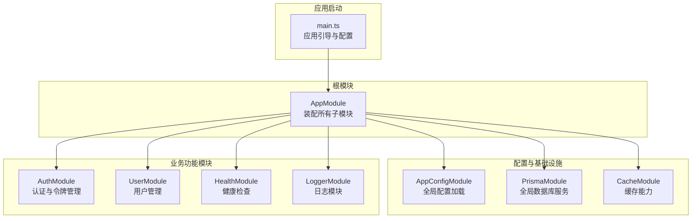
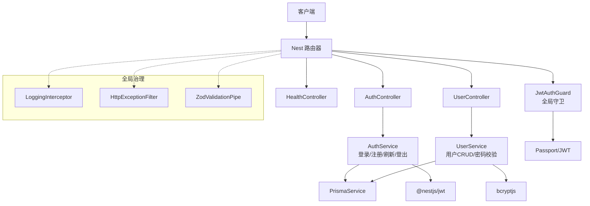
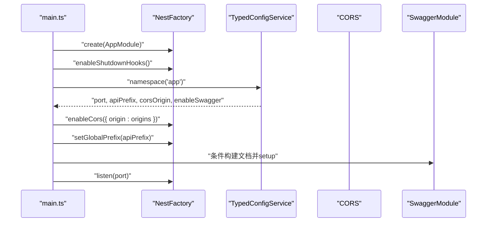
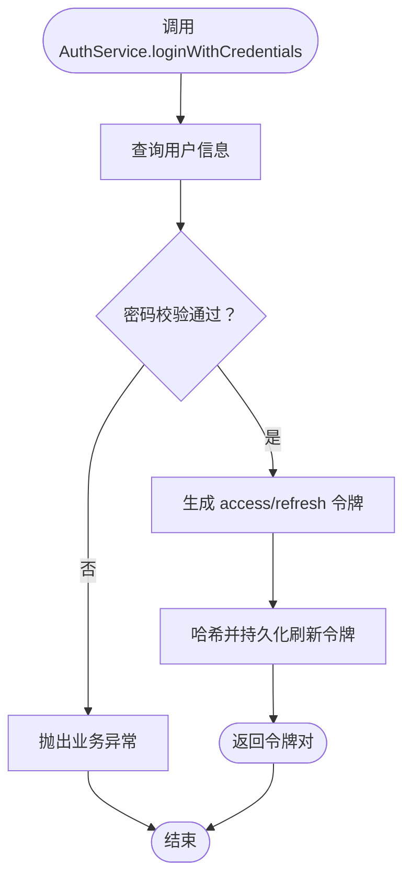
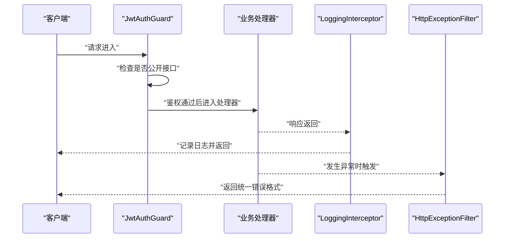
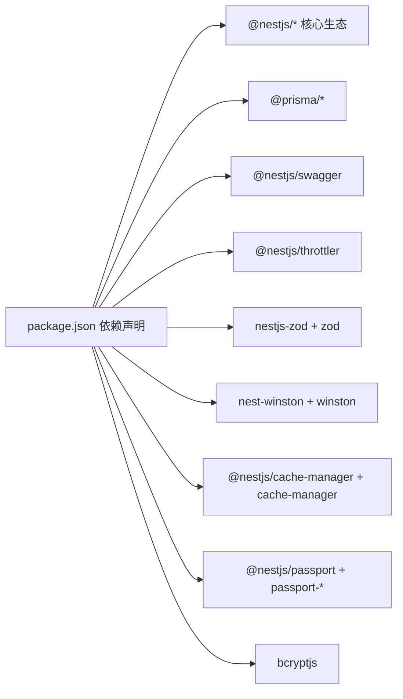

# 整体架构概览

<cite>
**本文档引用的文件**
- [src/app.module.ts](file://src/app.module.ts)
- [src/main.ts](file://src/main.ts)
- [package.json](file://package.json)
- [src/modules/auth/auth.module.ts](file://src/modules/auth/auth.module.ts)
- [src/modules/user/user.module.ts](file://src/modules/user/user.module.ts)
- [src/modules/health/health.module.ts](file://src/modules/health/health.module.ts)
- [src/config/config.module.ts](file://src/config/config.module.ts)
- [src/prisma/prisma.module.ts](file://src/prisma/prisma.module.ts)
- [src/modules/auth/auth.service.ts](file://src/modules/auth/auth.service.ts)
- [src/modules/user/user.service.ts](file://src/modules/user/user.service.ts)
- [src/common/guards/jwt-auth.guard.ts](file://src/common/guards/jwt-auth.guard.ts)
- [src/common/interceptors/logging.interceptor.ts](file://src/common/interceptors/logging.interceptor.ts)
- [src/common/filters/http-exception.filter.ts](file://src/common/filters/http-exception.filter.ts)
</cite>

## 目录

1. [引言](#引言)
2. [项目结构](#项目结构)
3. [核心组件](#核心组件)
4. [架构总览](#架构总览)
5. [详细组件分析](#详细组件分析)
6. [依赖分析](#依赖分析)
7. [性能考量](#性能考量)
8. [故障排查指南](#故障排查指南)
9. [结论](#结论)
10. [附录](#附录)

## 引言

本项目采用 NestJS 框架构建，遵循模块化与依赖注入的设计原则，通过清晰的分层与职责分离实现高内聚、低耦合的系统架构。根模块 AppModule 统一装配认证、用户管理、健康检查、缓存、日志、数据库等子模块，并通过全局守卫、拦截器、过滤器与验证管道统一治理横切关注点。本文档旨在帮助读者快速理解系统的整体架构、模块职责、组件交互与数据流。

## 项目结构

项目采用按功能域划分的模块化目录结构，核心模块包括认证模块、用户模块、健康检查模块、缓存模块、日志模块与配置模块；同时通过 Prisma 提供数据库访问能力。入口文件负责应用初始化、CORS 配置、Swagger 文档启用与全局前缀设置。

**图表来源**

- [src/main.ts:1-50](file://src/main.ts#L1-L50)
- [src/app.module.ts:18-60](file://src/app.module.ts#L18-L60)
- [src/config/config.module.ts:6-19](file://src/config/config.module.ts#L6-L19)
- [src/prisma/prisma.module.ts:4-9](file://src/prisma/prisma.module.ts#L4-L9)

**章节来源**

- [src/app.module.ts:18-60](file://src/app.module.ts#L18-L60)
- [src/main.ts:8-47](file://src/main.ts#L8-L47)
- [src/config/config.module.ts:6-19](file://src/config/config.module.ts#L6-L19)
- [src/prisma/prisma.module.ts:4-9](file://src/prisma/prisma.module.ts#L4-L9)

## 核心组件

- 根模块 AppModule：集中导入配置、缓存、数据库、认证、用户、健康检查、日志等模块，并注册全局守卫、拦截器、过滤器与验证管道。
- 应用引导 main.ts：创建 NestFactory 实例，启用关闭钩子、CORS、全局前缀与 Swagger 文档，读取环境配置并通过自定义工厂创建日志记录器。
- 配置模块 AppConfigModule：以全局模块形式加载配置，支持命名空间访问与类型化配置服务。
- 数据库模块 PrismaModule：全局提供 PrismaService，贯穿各业务模块的数据访问。
- 认证模块 AuthModule：集成 Passport/JWT，提供登录、注册、刷新令牌与验证码服务，并向外部导出 AuthService。
- 用户模块 UserModule：提供用户增删改查与密码校验等核心业务逻辑。
- 守卫/拦截器/过滤器：JwtAuthGuard、LoggingInterceptor、HttpExceptionFilter 构成统一的安全与可观测性治理层。

**章节来源**

- [src/app.module.ts:18-60](file://src/app.module.ts#L18-L60)
- [src/main.ts:8-47](file://src/main.ts#L8-L47)
- [src/config/config.module.ts:6-19](file://src/config/config.module.ts#L6-L19)
- [src/prisma/prisma.module.ts:4-9](file://src/prisma/prisma.module.ts#L4-L9)
- [src/modules/auth/auth.module.ts:11-33](file://src/modules/auth/auth.module.ts#L11-L33)
- [src/modules/user/user.module.ts:5-10](file://src/modules/user/user.module.ts#L5-L10)
- [src/common/guards/jwt-auth.guard.ts:17-45](file://src/common/guards/jwt-auth.guard.ts#L17-L45)
- [src/common/interceptors/logging.interceptor.ts:12-39](file://src/common/interceptors/logging.interceptor.ts#L12-L39)
- [src/common/filters/http-exception.filter.ts:24-78](file://src/common/filters/http-exception.filter.ts#L24-L78)

## 架构总览

系统采用“根模块装配 + 全局治理 + 功能模块”的分层架构。根模块负责装配与编排，全局守卫/拦截器/过滤器在请求生命周期中统一处理鉴权、日志与异常，业务模块通过服务层完成领域逻辑，数据库通过 Prisma 提供一致的数据访问抽象。

**图表来源**

- [src/app.module.ts:18-60](file://src/app.module.ts#L18-L60)
- [src/modules/auth/auth.module.ts:11-33](file://src/modules/auth/auth.module.ts#L11-L33)
- [src/modules/user/user.module.ts:5-10](file://src/modules/user/user.module.ts#L5-L10)
- [src/common/guards/jwt-auth.guard.ts:17-45](file://src/common/guards/jwt-auth.guard.ts#L17-L45)
- [src/common/interceptors/logging.interceptor.ts:12-39](file://src/common/interceptors/logging.interceptor.ts#L12-L39)
- [src/common/filters/http-exception.filter.ts:24-78](file://src/common/filters/http-exception.filter.ts#L24-L78)

## 详细组件分析

### 根模块 AppModule 组织结构

- 导入模块：配置、限流、缓存、数据库、认证、用户、健康检查、日志模块。
- 全局提供者：
  - 守卫：JwtAuthGuard、自定义 ThrottlerGuard。
  - 拦截器：LoggingInterceptor、TransformInterceptor。
  - 验证管道：ZodValidationPipe。
  - 过滤器：HttpExceptionFilter。
- 设计要点：通过全局注册实现横切能力对所有路由生效，避免重复配置；模块间通过导出/导入形成清晰的依赖边界。

**章节来源**

- [src/app.module.ts:18-60](file://src/app.module.ts#L18-L60)

### 应用引导 main.ts 控制流

- 创建应用实例并启用关闭钩子。
- 读取 TypedConfigService 获取端口、API 前缀、CORS 与 Swagger 开关。
- 设置全局 CORS 与前缀。
- 条件启用 Swagger 并暴露文档端点。
- 启动服务并输出运行日志。

**图表来源**

- [src/main.ts:8-47](file://src/main.ts#L8-L47)

**章节来源**

- [src/main.ts:8-47](file://src/main.ts#L8-L47)

### 认证模块 AuthModule 与 AuthService

- 模块装配：导入 UserModule、PassportModule、JwtModule（异步工厂从配置读取密钥与过期时间），导出 AuthService。
- 服务职责：登录凭据校验、注册用户、刷新令牌、撤销会话；内部使用 Prisma 存储刷新令牌、使用 bcrypt 哈希密码、使用 @nestjs/jwt 生成访问与刷新令牌。
- 安全策略：刷新令牌入库并进行哈希存储，过期与撤销状态校验，确保令牌安全生命周期管理。

**图表来源**

- [src/modules/auth/auth.service.ts:29-43](file://src/modules/auth/auth.service.ts#L29-L43)
- [src/modules/auth/auth.service.ts:117-153](file://src/modules/auth/auth.service.ts#L117-L153)

**章节来源**

- [src/modules/auth/auth.module.ts:11-33](file://src/modules/auth/auth.module.ts#L11-L33)
- [src/modules/auth/auth.service.ts:14-162](file://src/modules/auth/auth.service.ts#L14-L162)

### 用户模块 UserModule 与 UserService

- 模块装配：导出 UserService，控制器在用户模块中定义。
- 服务职责：用户创建（密码哈希）、查询列表/单个、按邮箱/用户名/账号查找、更新与删除；统一使用 PrismaService 与 Zod Schema 校验返回模型。
- 错误处理：通过业务异常与 DTO Schema 确保一致性。

**章节来源**

- [src/modules/user/user.module.ts:5-10](file://src/modules/user/user.module.ts#L5-L10)
- [src/modules/user/user.service.ts:13-125](file://src/modules/user/user.service.ts#L13-L125)

### 守卫、拦截器与过滤器

- JwtAuthGuard：继承 AuthGuard('jwt')，结合 Reflector 支持公开接口注解，统一在 handleRequest 中抛出业务异常。
- LoggingInterceptor：记录请求方法、URL、用户标识、IP、UA 与耗时，统一输出日志。
- HttpExceptionFilter：捕获 HttpException，区分业务异常与通用异常，映射到统一的业务码与消息格式，支持 Zod 校验细节输出。

**图表来源**

- [src/common/guards/jwt-auth.guard.ts:17-45](file://src/common/guards/jwt-auth.guard.ts#L17-L45)
- [src/common/interceptors/logging.interceptor.ts:12-39](file://src/common/interceptors/logging.interceptor.ts#L12-L39)
- [src/common/filters/http-exception.filter.ts:24-78](file://src/common/filters/http-exception.filter.ts#L24-L78)

**章节来源**

- [src/common/guards/jwt-auth.guard.ts:17-45](file://src/common/guards/jwt-auth.guard.ts#L17-L45)
- [src/common/interceptors/logging.interceptor.ts:12-39](file://src/common/interceptors/logging.interceptor.ts#L12-L39)
- [src/common/filters/http-exception.filter.ts:24-78](file://src/common/filters/http-exception.filter.ts#L24-L78)

## 依赖分析

- 技术栈选择：
  - NestJS 11：提供模块化、依赖注入与装饰器驱动的开发体验。
  - @nestjs/throttler：限流保护，支持多粒度限流策略。
  - nestjs-zod：强类型输入校验，提升 API 可靠性。
  - @nestjs/swagger：自动生成 API 文档，便于联调与测试。
  - @prisma/client：类型安全的数据库 ORM，配合 Prisma Migrate 与种子脚本。
  - winston：结构化日志，支持按日期轮转与多传输器。
- 外部依赖与集成点：
  - Passport/JWT：认证授权基础能力。
  - bcryptjs：密码哈希。
  - cache-manager：内存/分布式缓存抽象。
- 决策权衡：
  - 使用全局模块与全局提供者降低重复配置成本，但需注意作用域与可维护性。
  - 采用 Zod 进行输入校验，兼顾性能与类型安全，但需要额外的错误格式化。
  - Swagger 在开发环境开启，生产关闭，平衡文档可用性与安全性。

**图表来源**

- [package.json:26-54](file://package.json#L26-L54)

**章节来源**

- [package.json:26-54](file://package.json#L26-L54)

## 性能考量

- 请求链路优化：全局拦截器仅做必要日志记录，避免重 IO；过滤器与守卫应保持轻量判断逻辑。
- 数据访问：UserService 与 AuthService 使用 PrismaService，建议合理使用 select 字段与索引，避免 N+1 查询。
- 缓存策略：引入 CacheModule 后可在高频读场景使用缓存，减少数据库压力。
- 限流与安全：ThrottlerModule 已全局启用，建议根据路由细化限流策略，避免误伤正常流量。
- 日志开销：Winston 按天轮转，注意磁盘与 IO 压力，生产环境建议调整日志级别与采样。

## 故障排查指南

- 统一错误格式：HttpExceptionFilter 将业务异常与通用异常映射为统一响应，便于前端与监控系统消费。
- 鉴权失败：JwtAuthGuard 在鉴权失败时抛出业务异常，检查令牌格式、签名与过期时间。
- 输入校验失败：ZodValidationException 会将字段级错误以路径+消息的形式返回，定位具体字段问题。
- 日志定位：LoggingInterceptor 输出请求上下文与耗时，结合业务日志快速定位问题。

**章节来源**

- [src/common/filters/http-exception.filter.ts:24-173](file://src/common/filters/http-exception.filter.ts#L24-L173)
- [src/common/guards/jwt-auth.guard.ts:36-44](file://src/common/guards/jwt-auth.guard.ts#L36-L44)
- [src/common/interceptors/logging.interceptor.ts:16-37](file://src/common/interceptors/logging.interceptor.ts#L16-L37)

## 结论

本项目以 NestJS 为核心，通过模块化设计与全局治理实现了清晰的职责划分与一致的横切能力。根模块集中装配，业务模块边界明确，认证与用户服务解耦良好，配合 Prisma、Zod、Swagger 等工具形成高效、可维护、可扩展的后端架构。建议在生产环境中进一步完善缓存策略、限流规则与日志采样，并持续优化数据库索引与查询路径以提升整体性能。

## 附录

- 系统边界定义：
  - 外部系统：客户端浏览器/移动端、第三方服务（如短信/邮件服务，若存在）。
  - 内部系统：数据库（Prisma）、缓存（Redis/内存）、日志系统（Winston）。
  - 边界交互：通过控制器暴露 REST 接口，认证模块负责令牌发放与校验，用户模块承载核心业务逻辑，日志与过滤器提供统一可观测性与错误处理。
