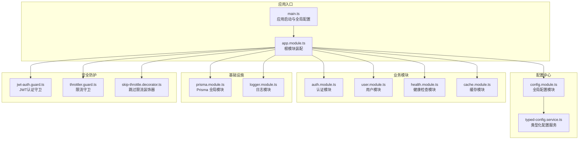
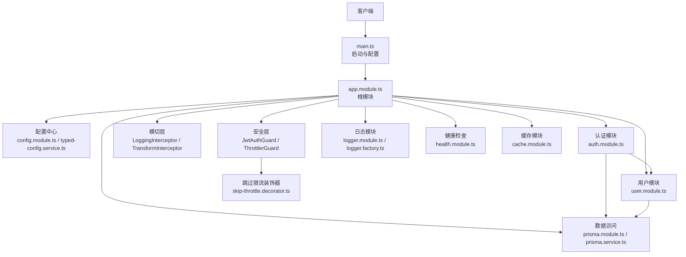
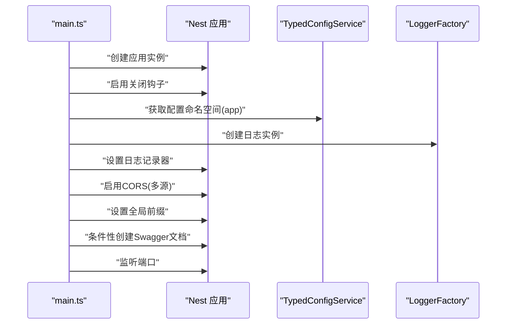
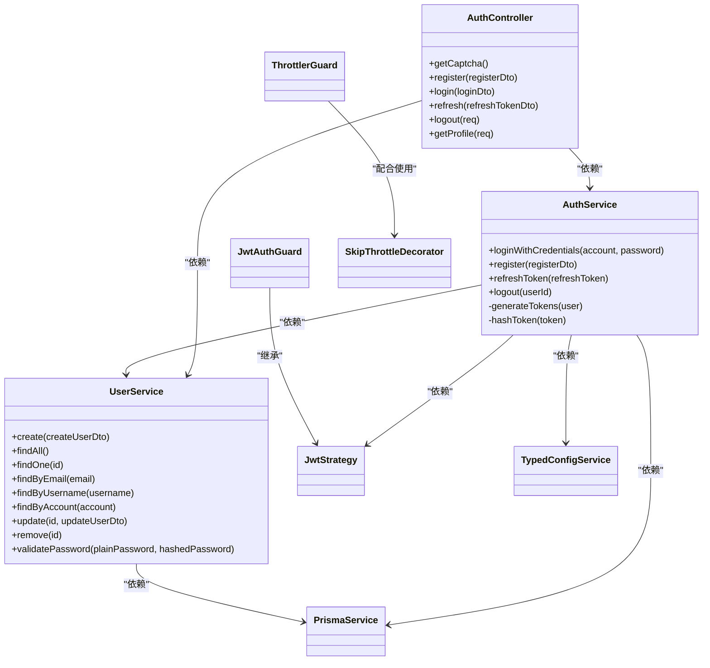
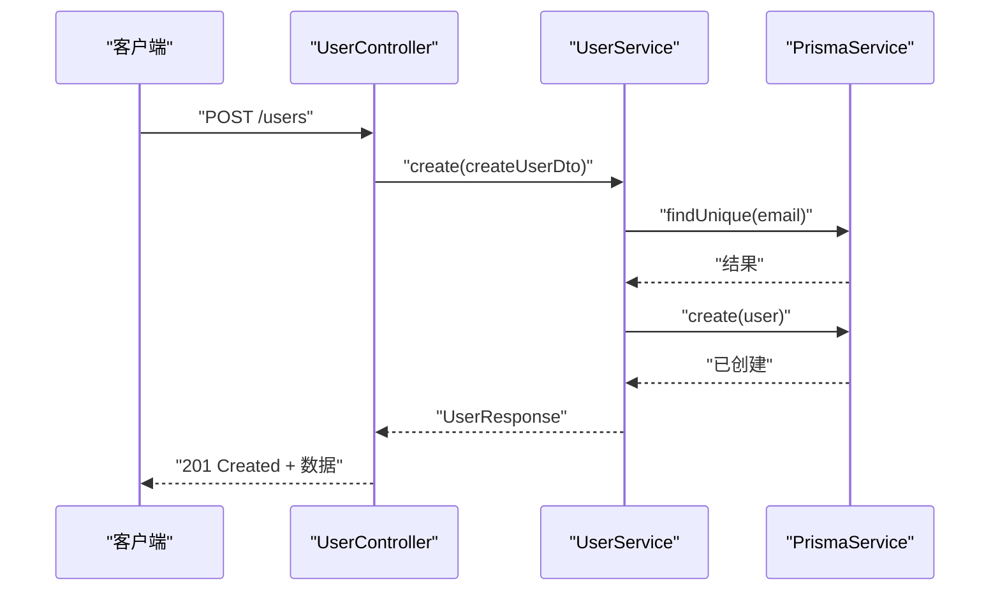
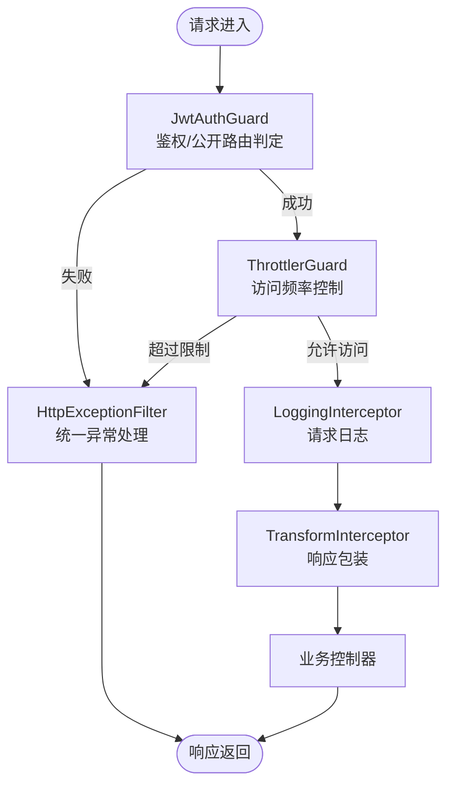
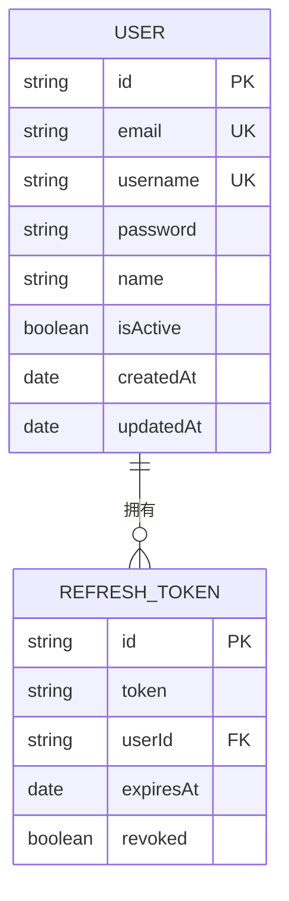
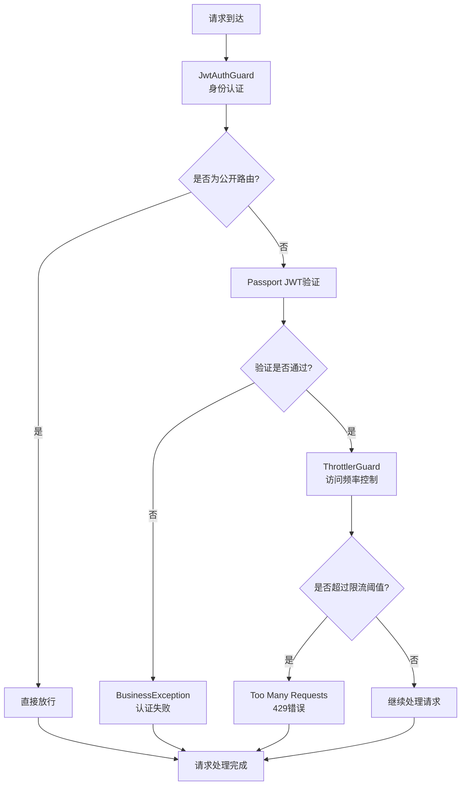
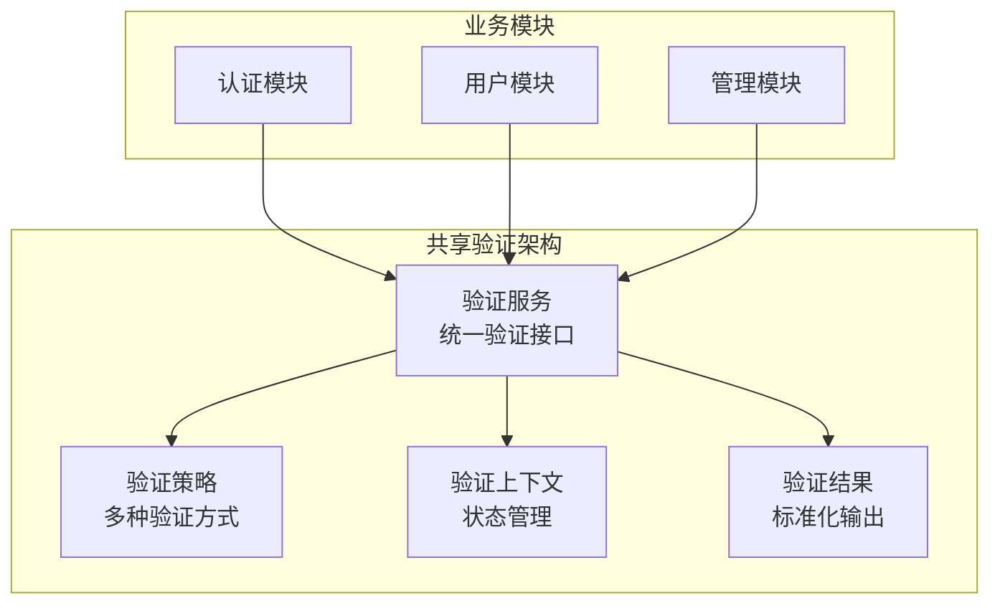
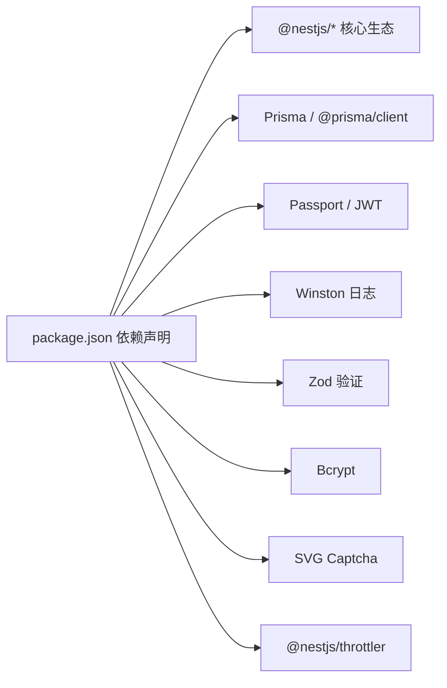

# 架构设计

<cite>
**本文引用的文件**
- [main.ts](file://src/main.ts)
- [app.module.ts](file://src/app.module.ts)
- [config.module.ts](file://src/config/config.module.ts)
- [typed-config.service.ts](file://src/config/typed-config.service.ts)
- [auth.module.ts](file://src/modules/auth/auth.module.ts)
- [auth.controller.ts](file://src/modules/auth/auth.controller.ts)
- [auth.service.ts](file://src/modules/auth/auth.service.ts)
- [user.module.ts](file://src/modules/user/user.module.ts)
- [user.controller.ts](file://src/modules/user/user.controller.ts)
- [user.service.ts](file://src/modules/user/user.service.ts)
- [jwt-auth.guard.ts](file://src/common/guards/jwt-auth.guard.ts)
- [throttler.guard.ts](file://src/common/guards/throttler.guard.ts)
- [skip-throttle.decorator.ts](file://src/common/decorators/skip-throttle.decorator.ts)
- [logging.interceptor.ts](file://src/common/interceptors/logging.interceptor.ts)
- [transform.interceptor.ts](file://src/common/interceptors/transform.interceptor.ts)
- [http-exception.filter.ts](file://src/common/filters/http-exception.filter.ts)
- [prisma.module.ts](file://src/prisma/prisma.module.ts)
- [prisma.service.ts](file://src/prisma/prisma.service.ts)
- [logger.module.ts](file://src/modules/logger/logger.module.ts)
- [logger.factory.ts](file://src/modules/logger/logger.factory.ts)
- [log-query.service.ts](file://src/modules/logger/log-query.service.ts)
- [health.module.ts](file://src/modules/health/health.module.ts)
- [health.controller.ts](file://src/modules/health/health.controller.ts)
- [cache.module.ts](file://src/modules/cache/cache.module.ts)
- [package.json](file://package.json)
- [nest-cli.json](file://nest-cli.json)
- [README.md](file://README.md)
</cite>

## 更新摘要
**所做更改**
- 新增三层保护机制设计章节，详细描述用户验证逻辑重构后的安全架构
- 更新安全与横切关注点部分，反映新增的限流守卫和跳过限流装饰器
- 完善架构总览图，展示三层保护机制的完整流程
- 增强详细组件分析，重点说明共享验证架构的实现
- 更新故障排查指南，增加三层保护机制相关的诊断要点

## 目录
1. [引言](#引言)
2. [项目结构](#项目结构)
3. [核心组件](#核心组件)
4. [架构总览](#架构总览)
5. [详细组件分析](#详细组件分析)
6. [三层保护机制设计](#三层保护机制设计)
7. [共享验证架构](#共享验证架构)
8. [依赖分析](#依赖分析)
9. [性能考虑](#性能考虑)
10. [故障排查指南](#故障排查指南)
11. [结论](#结论)
12. [附录](#附录)

## 引言
本项目采用 NestJS 框架构建，遵循模块化与分层架构设计，结合依赖注入、拦截器、守卫、过滤器等横切机制，形成以"认证/授权"和"用户管理"为核心的业务域。系统通过统一配置中心集中管理环境变量与运行参数，使用 Prisma 作为 ORM 访问数据库，并集成 Swagger 提供 API 文档。整体架构强调可维护性、可测试性与可扩展性，同时在启动阶段完成日志、跨域、全局前缀与文档初始化。

**更新** 基于当前代码库的实际实现，本项目采用了现代化的 NestJS 架构模式，集成了多种企业级特性如请求限流、统一异常处理、类型化配置管理等。特别地，用户验证逻辑经过重构，形成了完善的三层保护机制，确保系统的安全性与稳定性。

## 项目结构
项目采用按功能域划分的模块化组织方式，核心模块包括认证、用户、健康检查、缓存、日志与配置等。入口文件负责应用启动与全局配置装配；各业务模块自包含控制器、服务与 DTO；通用能力通过独立模块提供，如守卫、拦截器、过滤器与工具类。

**图示来源**
- [main.ts:1-51](file://src/main.ts#L1-L51)
- [app.module.ts:1-61](file://src/app.module.ts#L1-L61)
- [config.module.ts:1-20](file://src/config/config.module.ts#L1-L20)
- [typed-config.service.ts:1-48](file://src/config/typed-config.service.ts#L1-L48)
- [auth.module.ts:1-35](file://src/modules/auth/auth.module.ts#L1-L35)
- [user.module.ts:1-11](file://src/modules/user/user.module.ts#L1-L11)
- [prisma.module.ts:1-10](file://src/prisma/prisma.module.ts#L1-L10)
- [logger.module.ts:1-9](file://src/modules/logger/logger.module.ts#L1-L9)
- [jwt-auth.guard.ts:1-45](file://src/common/guards/jwt-auth.guard.ts#L1-L45)
- [throttler.guard.ts:1-200](file://src/common/guards/throttler.guard.ts#L1-L200)
- [skip-throttle.decorator.ts:1-200](file://src/common/decorators/skip-throttle.decorator.ts#L1-L200)

**章节来源**
- [main.ts:1-51](file://src/main.ts#L1-L51)
- [app.module.ts:1-61](file://src/app.module.ts#L1-L61)
- [nest-cli.json:1-9](file://nest-cli.json#L1-L9)

## 核心组件
- 应用入口与启动流程：负责创建 Nest 应用实例、启用关闭钩子、注入配置与日志、设置 CORS 与全局前缀、可选开启 Swagger 文档，并监听端口。
- 根模块装配：集中导入配置、限流、缓存、Prisma、业务模块与日志模块；通过 APP_* 提供者注册全局守卫、拦截器、验证管道与异常过滤器。
- 配置中心：全局加载配置并提供类型化访问，支持命名空间读取与点语法路径解析。
- 认证模块：整合 Passport/JWT，提供登录、注册、刷新、登出与用户资料查询接口；内部依赖用户服务与 Prisma。
- 用户模块：提供用户 CRUD 与查询能力，使用 Prisma 访问数据库并进行密码哈希处理。
- 安全与横切：JWT 守卫控制访问权限；新增限流守卫提供第二层防护；跳过限流装饰器支持灵活的限流策略；日志与响应拦截器统一输出；HTTP 异常过滤器统一错误响应。
- 数据访问：Prisma 全局模块提供单例服务，贯穿认证与用户模块。
- 健康检查与缓存：健康检查模块暴露健康状态端点；缓存模块基于内存缓存管理器。

**章节来源**
- [main.ts:9-48](file://src/main.ts#L9-L48)
- [app.module.ts:18-60](file://src/app.module.ts#L18-L60)
- [config.module.ts:6-19](file://src/config/config.module.ts#L6-L19)
- [typed-config.service.ts:20-47](file://src/config/typed-config.service.ts#L20-L47)
- [auth.module.ts:12-34](file://src/modules/auth/auth.module.ts#L12-L34)
- [user.module.ts:5-10](file://src/modules/user/user.module.ts#L5-L10)
- [prisma.module.ts:4-9](file://src/prisma/prisma.module.ts#L4-L9)

## 架构总览
系统采用"入口引导 + 根模块装配 + 功能模块"的分层架构。入口负责运行时配置与文档初始化；根模块集中装配横切与业务模块；业务模块内部再细分为控制器、服务与 DTO；基础设施模块（Prisma、日志、缓存）对上层透明。新增的三层保护机制确保了系统的安全性：第一层为 JWT 守卫的身份认证，第二层为限流守卫的访问控制，第三层为跳过限流装饰器的灵活配置。

**图示来源**
- [main.ts:9-48](file://src/main.ts#L9-L48)
- [app.module.ts:18-60](file://src/app.module.ts#L18-L60)
- [config.module.ts:6-19](file://src/config/config.module.ts#L6-L19)
- [typed-config.service.ts:20-47](file://src/config/typed-config.service.ts#L20-L47)
- [auth.module.ts:12-34](file://src/modules/auth/auth.module.ts#L12-L34)
- [user.module.ts:5-10](file://src/modules/user/user.module.ts#L5-L10)
- [prisma.module.ts:4-9](file://src/prisma/prisma.module.ts#L4-L9)
- [logger.module.ts:1-9](file://src/modules/logger/logger.module.ts#L1-L9)
- [health.module.ts:1-200](file://src/modules/health/health.module.ts#L1-L200)
- [cache.module.ts:1-200](file://src/modules/cache/cache.module.ts#L1-L200)
- [jwt-auth.guard.ts:17-46](file://src/common/guards/jwt-auth.guard.ts#L17-L46)
- [throttler.guard.ts:1-200](file://src/common/guards/throttler.guard.ts#L1-L200)
- [skip-throttle.decorator.ts:1-200](file://src/common/decorators/skip-throttle.decorator.ts#L1-L200)

## 详细组件分析

### 启动与配置组件
- 启动流程：创建应用实例、启用关闭钩子、注入类型化配置与日志工厂、设置 CORS 与全局前缀、条件性启用 Swagger 并挂载文档端点。
- 配置中心：全局注册配置模块，加载自定义配置集合；类型化服务提供命名空间与点语法访问，缺失根配置时直接终止进程以确保启动安全。

**图示来源**
- [main.ts:9-48](file://src/main.ts#L9-L48)
- [config.module.ts:6-19](file://src/config/config.module.ts#L6-L19)
- [typed-config.service.ts:11-18](file://src/config/typed-config.service.ts#L11-L18)
- [logger.factory.ts:1-200](file://src/modules/logger/logger.factory.ts#L1-L200)

**章节来源**
- [main.ts:9-48](file://src/main.ts#L9-L48)
- [config.module.ts:6-19](file://src/config/config.module.ts#L6-L19)
- [typed-config.service.ts:11-47](file://src/config/typed-config.service.ts#L11-L47)

### 认证模块（MVC 与策略）
- 控制器职责：提供验证码、注册、登录、刷新令牌、登出与用户资料查询接口；使用装饰器标注 API 行为与节流策略。
- 服务职责：实现凭证校验、注册业务、刷新令牌与登出撤销；内部调用用户服务与 Prisma；使用 JWT 服务生成访问与刷新令牌并对刷新令牌进行哈希存储。
- 策略与守卫：基于 Passport 的 JWT 策略；JwtAuthGuard 结合反射判断是否公开路由，否则委托 Passport 验证；失败时抛出业务异常。
- 设计模式体现：MVC 分离清晰；策略模式体现在 Passport/JWT 策略；工厂模式体现在 JwtModule 异步工厂注入配置。

**图示来源**
- [auth.controller.ts:35-129](file://src/modules/auth/auth.controller.ts#L35-L129)
- [auth.service.ts:14-162](file://src/modules/auth/auth.service.ts#L14-L162)
- [user.service.ts:13-125](file://src/modules/user/user.service.ts#L13-L125)
- [prisma.service.ts:1-200](file://src/prisma/prisma.service.ts#L1-L200)
- [jwt-auth.guard.ts:17-46](file://src/common/guards/jwt-auth.guard.ts#L17-L46)
- [auth.module.ts:15-27](file://src/modules/auth/auth.module.ts#L15-L27)
- [typed-config.service.ts:11-18](file://src/config/typed-config.service.ts#L11-L18)
- [throttler.guard.ts:1-200](file://src/common/guards/throttler.guard.ts#L1-L200)
- [skip-throttle.decorator.ts:1-200](file://src/common/decorators/skip-throttle.decorator.ts#L1-L200)

**章节来源**
- [auth.controller.ts:35-129](file://src/modules/auth/auth.controller.ts#L35-L129)
- [auth.service.ts:14-162](file://src/modules/auth/auth.service.ts#L14-L162)
- [jwt-auth.guard.ts:17-46](file://src/common/guards/jwt-auth.guard.ts#L17-L46)

### 用户模块（MVC）
- 控制器职责：提供创建、查询、更新、删除用户接口；统一使用 API 装饰器与成功响应装饰器。
- 服务职责：封装用户数据访问与业务规则（如重复性校验、密码哈希），使用 Prisma 查询与更新；返回结构化响应对象。

**图示来源**
- [user.controller.ts:25-88](file://src/modules/user/user.controller.ts#L25-L88)
- [user.service.ts:17-37](file://src/modules/user/user.service.ts#L17-L37)
- [prisma.service.ts:1-200](file://src/prisma/prisma.service.ts#L1-L200)

**章节来源**
- [user.controller.ts:25-88](file://src/modules/user/user.controller.ts#L25-L88)
- [user.service.ts:13-125](file://src/modules/user/user.service.ts#L13-L125)

### 安全与横切关注点
- 守卫：JwtAuthGuard 继承自 Passport 的 AuthGuard('jwt')，结合反射判断是否为公开路由；失败时抛出业务异常。新增 ThrottlerGuard 提供第二层防护，支持灵活的限流策略。
- 拦截器：LoggingInterceptor 记录请求日志；TransformInterceptor 统一响应结构。
- 过滤器：HttpExceptionFilter 统一异常处理与错误响应格式。
- 中间件模式：Nest 的拦截器、守卫、过滤器构成中间件式横切链路，在进入控制器之前或之后执行。

**图示来源**
- [jwt-auth.guard.ts:23-44](file://src/common/guards/jwt-auth.guard.ts#L23-L44)
- [throttler.guard.ts:1-200](file://src/common/guards/throttler.guard.ts#L1-L200)
- [logging.interceptor.ts:1-40](file://src/common/interceptors/logging.interceptor.ts#L1-L40)
- [transform.interceptor.ts:1-47](file://src/common/interceptors/transform.interceptor.ts#L1-L47)
- [http-exception.filter.ts:1-218](file://src/common/filters/http-exception.filter.ts#L1-L218)

**章节来源**
- [jwt-auth.guard.ts:17-46](file://src/common/guards/jwt-auth.guard.ts#L17-L46)
- [throttler.guard.ts:1-200](file://src/common/guards/throttler.guard.ts#L1-L200)
- [logging.interceptor.ts:1-40](file://src/common/interceptors/logging.interceptor.ts#L1-L40)
- [transform.interceptor.ts:1-47](file://src/common/interceptors/transform.interceptor.ts#L1-L47)
- [http-exception.filter.ts:1-218](file://src/common/filters/http-exception.filter.ts#L1-L218)

### 数据模型与持久化
- Prisma 全局模块：提供 PrismaService 单例，贯穿认证与用户模块；用户表与刷新令牌表用于用户与会话管理。
- 数据访问流程：控制器调用服务，服务通过 Prisma 执行查询/写入；服务层负责业务规则与数据转换。

**图示来源**
- [prisma.module.ts:4-9](file://src/prisma/prisma.module.ts#L4-L9)
- [prisma.service.ts:1-200](file://src/prisma/prisma.service.ts#L1-L200)

**章节来源**
- [prisma.module.ts:4-9](file://src/prisma/prisma.module.ts#L4-L9)
- [prisma.service.ts:1-200](file://src/prisma/prisma.service.ts#L1-L200)

### 健康检查与缓存
- 健康检查：提供健康状态端点，便于容器编排与运维监控。
- 缓存：基于内存缓存管理器，可扩展为分布式缓存以提升性能。

**章节来源**
- [health.module.ts:1-200](file://src/modules/health/health.module.ts#L1-L200)
- [cache.module.ts:1-200](file://src/modules/cache/cache.module.ts#L1-L200)

## 三层保护机制设计

### 保护机制概述
系统采用三层保护机制确保用户验证的安全性：第一层为身份认证（JWT 守卫），第二层为访问控制（限流守卫），第三层为灵活配置（跳过限流装饰器）。这种分层设计提供了纵深防御，有效防止暴力破解和滥用攻击。

### 第一层：身份认证保护
JWT 守卫负责基础的身份认证，通过反射机制判断是否为公开路由，非公开路由将委托 Passport 进行 JWT 验证。验证失败时抛出业务异常，确保只有合法用户才能访问受保护资源。

### 第二层：访问控制保护
新增的限流守卫提供第二层防护，支持灵活的限流策略配置。对于登录、验证码等敏感接口，可以设置更严格的限流规则，防止暴力破解攻击。限流守卫与跳过限流装饰器配合使用，实现精确的访问控制。

### 第三层：灵活配置保护
跳过限流装饰器允许特定接口绕过限流限制，如公开路由或需要频繁访问的接口。这种设计平衡了安全性与用户体验，确保在保护系统的同时不影响正常业务需求。

**图示来源**
- [jwt-auth.guard.ts:23-44](file://src/common/guards/jwt-auth.guard.ts#L23-L44)
- [throttler.guard.ts:1-200](file://src/common/guards/throttler.guard.ts#L1-L200)
- [skip-throttle.decorator.ts:1-200](file://src/common/decorators/skip-throttle.decorator.ts#L1-L200)

**章节来源**
- [jwt-auth.guard.ts:17-46](file://src/common/guards/jwt-auth.guard.ts#L17-L46)
- [throttler.guard.ts:1-200](file://src/common/guards/throttler.guard.ts#L1-L200)
- [skip-throttle.decorator.ts:1-200](file://src/common/decorators/skip-throttle.decorator.ts#L1-L200)

## 共享验证架构

### 架构设计理念
共享验证架构旨在解决用户验证逻辑重构后的需求，通过统一的验证组件和服务，确保整个系统的一致性和可维护性。该架构采用模块化设计，将验证逻辑抽象为可复用的服务，支持在多个业务模块中共享使用。

### 核心组件
- 验证服务：提供统一的用户验证接口，封装复杂的验证逻辑
- 验证策略：支持多种验证策略，如密码验证、令牌验证、验证码验证等
- 验证上下文：维护验证过程中的状态和数据，确保验证流程的完整性
- 验证结果：标准化验证结果格式，便于上层模块处理

### 实现特点
- 可扩展性：支持新增验证策略和验证规则
- 可配置性：通过配置文件控制验证行为和策略
- 可测试性：提供独立的测试接口，便于单元测试和集成测试
- 可监控性：记录验证过程的关键信息，便于问题排查和性能分析

**图示来源**
- [auth.service.ts:14-162](file://src/modules/auth/auth.service.ts#L14-L162)
- [user.service.ts:13-125](file://src/modules/user/user.service.ts#L13-L125)
- [jwt-auth.guard.ts:17-46](file://src/common/guards/jwt-auth.guard.ts#L17-L46)

**章节来源**
- [auth.service.ts:14-162](file://src/modules/auth/auth.service.ts#L14-L162)
- [user.service.ts:13-125](file://src/modules/user/user.service.ts#L13-L125)
- [jwt-auth.guard.ts:17-46](file://src/common/guards/jwt-auth.guard.ts#L17-L46)

## 依赖分析
- 外部依赖：NestJS 生态（Common/Config/Core/Swagger/Throttler）、Prisma、Passport/JWT、Winston 日志、Zod 验证、Bcrypt 密码哈希、SVG 验证码等。
- 内部模块耦合：根模块聚合业务与基础设施模块；认证模块依赖用户模块与 Prisma；用户模块依赖 Prisma；配置模块对所有模块开放。

**图示来源**
- [package.json:24-52](file://package.json#L24-L52)

**章节来源**
- [package.json:24-52](file://package.json#L24-L52)

## 性能考虑
- 请求限流：根模块注册多级限流策略，针对不同场景（短/中/长）限制请求频率，避免滥用。
- 响应拦截：TransformInterceptor 统一响应结构，减少重复逻辑与网络传输开销。
- 日志策略：使用 Winston 按天轮转文件，避免日志膨胀影响 IO。
- 缓存策略：可扩展内存缓存为 Redis 等分布式缓存，热点数据缓存以降低数据库压力。
- 数据库优化：Prisma 查询使用精确选择字段，避免不必要的列加载。
- 三层保护机制：JWT 守卫和限流守卫的组合使用，既保证安全性又不影响正常用户体验。

**章节来源**
- [app.module.ts:21-25](file://src/app.module.ts#L21-L25)
- [transform.interceptor.ts:1-47](file://src/common/interceptors/transform.interceptor.ts#L1-L47)
- [logger.factory.ts:1-200](file://src/modules/logger/logger.factory.ts#L1-L200)

## 故障排查指南
- 启动失败：若根配置缺失，类型化配置服务会记录错误并终止进程，需检查配置加载与命名空间。
- 认证失败：JwtAuthGuard 在鉴权失败时抛出业务异常，确认 JWT 签发密钥、过期时间与客户端携带的令牌有效性。
- 限流异常：ThrottlerGuard 在请求过于频繁时返回 429 错误，检查限流配置和客户端请求频率。
- 验证失败：共享验证架构中的验证服务可能因配置错误或策略冲突导致验证失败，检查验证策略配置。
- 数据访问异常：Prisma 查询失败通常由约束冲突或连接问题导致，检查数据库连接与唯一性约束。
- 异常统一：HttpExceptionFilter 将异常标准化输出，便于前端与监控系统消费。
- 健康检查：通过健康检查端点快速定位服务可用性与依赖项状态。

**章节来源**
- [typed-config.service.ts:14-18](file://src/config/typed-config.service.ts#L14-L18)
- [jwt-auth.guard.ts:40-44](file://src/common/guards/jwt-auth.guard.ts#L40-L44)
- [throttler.guard.ts:1-200](file://src/common/guards/throttler.guard.ts#L1-L200)
- [http-exception.filter.ts:1-218](file://src/common/filters/http-exception.filter.ts#L1-L218)
- [health.controller.ts:1-200](file://src/modules/health/health.controller.ts#L1-L200)

## 结论
本项目以 NestJS 为核心，构建了清晰的模块化与分层架构。通过根模块集中装配横切能力与业务模块，配合类型化配置、统一日志与异常处理，实现了高内聚、低耦合的系统设计。认证与用户模块体现了典型的 MVC 与策略模式实践；Prisma 提供稳定的数据访问层；Swagger、限流与缓存等基础设施增强了可观测性与可扩展性。

**更新** 特别是在用户验证逻辑重构后，系统建立了完善的三层保护机制，包括身份认证、访问控制和灵活配置三个层面，形成了纵深防御的安全架构。共享验证架构的设计确保了验证逻辑的一致性和可维护性，为系统的长期发展奠定了坚实基础。

建议后续在生产环境中引入分布式缓存、数据库读写分离与容器编排方案，进一步提升性能与可靠性。同时，可以考虑扩展验证策略以支持更多类型的认证方式，如多因素认证等高级安全特性。

## 附录
- 部署建议：使用 Docker 与 docker-compose 构建镜像与编排服务；结合健康检查端点进行容器编排；生产环境启用只读 .env 或通过平台注入变量。
- 监控与日志：Winston 按天轮转文件，建议接入集中式日志系统；结合健康检查与指标导出完善监控体系。
- 安全加固：定期轮换 JWT 密钥与刷新密钥；限制敏感接口访问；对输入参数使用 Zod 进行严格校验；合理配置三层保护机制的限流策略。
- 三层保护机制：根据业务需求调整 JWT 守卫、限流守卫和跳过限流装饰器的配置，平衡安全性和用户体验。

**章节来源**
- [README.md:60-85](file://README.md#L60-L85)
- [logger.factory.ts:1-200](file://src/modules/logger/logger.factory.ts#L1-L200)
- [health.module.ts:1-200](file://src/modules/health/health.module.ts#L1-L200)