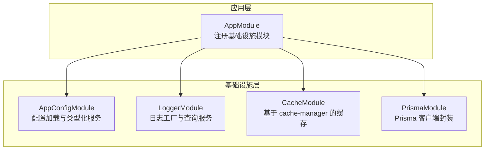
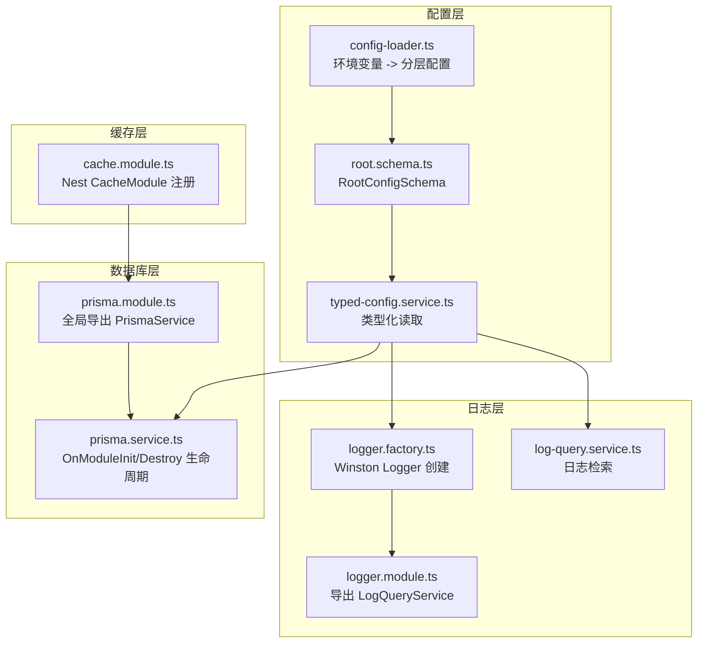
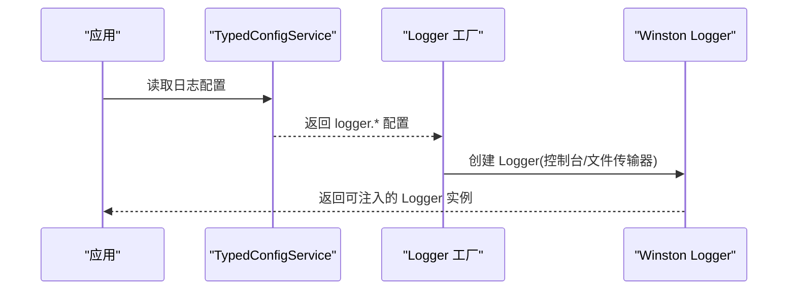
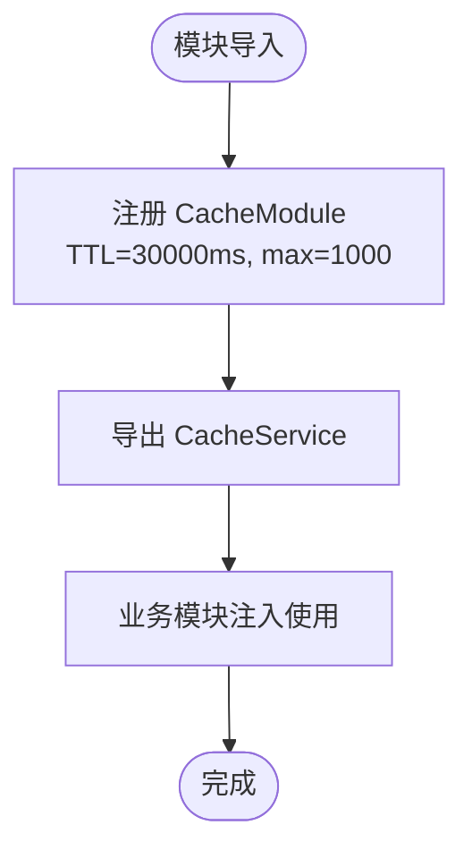
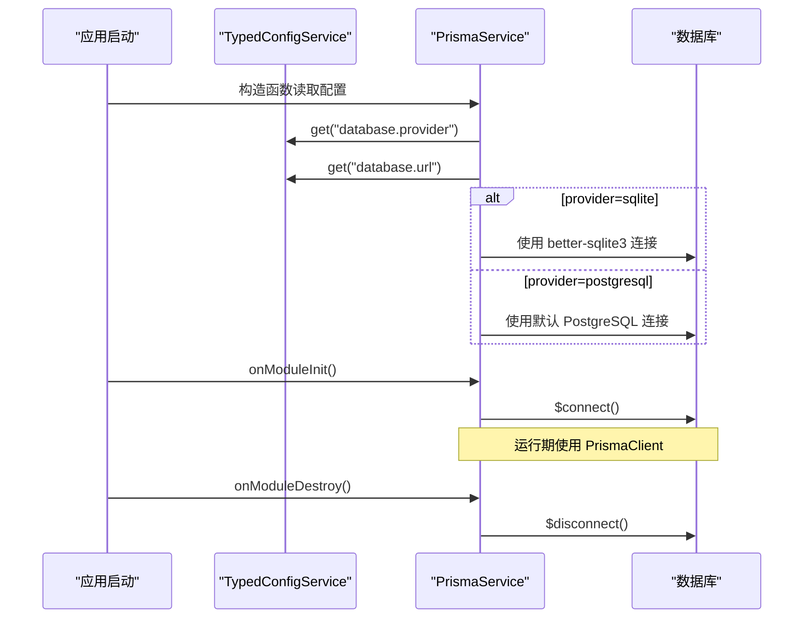
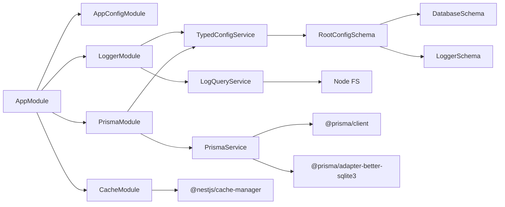

# 基础设施模块

<cite>
**本文引用的文件**
- [src/app.module.ts](file://src/app.module.ts)
- [src/config/config.module.ts](file://src/config/config.module.ts)
- [src/config/config-loader.ts](file://src/config/config-loader.ts)
- [src/config/schemas/root.schema.ts](file://src/config/schemas/root.schema.ts)
- [src/config/schemas/database.schema.ts](file://src/config/schemas/database.schema.ts)
- [src/config/schemas/logger.schema.ts](file://src/config/schemas/logger.schema.ts)
- [src/config/typed-config.service.ts](file://src/config/typed-config.service.ts)
- [src/common/constants/log-level.constants.ts](file://src/common/constants/log-level.constants.ts)
- [src/modules/cache/cache.module.ts](file://src/modules/cache/cache.module.ts)
- [src/modules/logger/logger.module.ts](file://src/modules/logger/logger.module.ts)
- [src/modules/logger/logger.factory.ts](file://src/modules/logger/logger.factory.ts)
- [src/modules/logger/log-query.service.ts](file://src/modules/logger/log-query.service.ts)
- [src/prisma/prisma.module.ts](file://src/prisma/prisma.module.ts)
- [src/prisma/prisma.service.ts](file://src/prisma/prisma.service.ts)
- [package.json](file://package.json)
</cite>

## 目录

1. [简介](#简介)
2. [项目结构](#项目结构)
3. [核心组件](#核心组件)
4. [架构总览](#架构总览)
5. [详细组件分析](#详细组件分析)
6. [依赖分析](#依赖分析)
7. [性能考虑](#性能考虑)
8. [故障排查指南](#故障排查指南)
9. [结论](#结论)
10. [附录](#附录)

## 简介

本文件系统性梳理并深入解析本项目的三大基础设施模块：日志模块（LoggerModule）、缓存模块（CacheModule）与数据库模块（PrismaModule）。内容涵盖设计原理、实现细节、配置项、性能特性、扩展能力、初始化流程、资源管理与故障恢复机制，并给出与其他模块的集成方式、依赖关系、配置示例、最佳实践与性能调优建议。

## 项目结构

基础设施模块在应用启动阶段被集中注册到根模块中，形成统一的基础设施层，供业务模块按需注入使用。整体结构如下：

图表来源

- [src/app.module.ts:18-32](file://src/app.module.ts#L18-L32)
- [src/config/config.module.ts:6-19](file://src/config/config.module.ts#L6-L19)
- [src/modules/logger/logger.module.ts:4-8](file://src/modules/logger/logger.module.ts#L4-L8)
- [src/modules/cache/cache.module.ts:4-13](file://src/modules/cache/cache.module.ts#L4-L13)
- [src/prisma/prisma.module.ts:4-9](file://src/prisma/prisma.module.ts#L4-L9)

章节来源

- [src/app.module.ts:18-32](file://src/app.module.ts#L18-L32)

## 核心组件

- 配置系统（AppConfigModule + TypedConfigService + RootConfigSchema）
  - 通过环境变量映射为分层命名空间，使用 Zod 在运行时进行严格校验与类型转换，提供类型安全的配置读取能力。
- 日志模块（LoggerModule + Logger 工厂 + LogQueryService）
  - 基于 Winston 的可插拔传输器，支持控制台彩色输出与文件轮转；内置敏感字段脱敏；提供日志检索与聚合能力。
- 缓存模块（CacheModule）
  - 基于 @nestjs/cache-manager，默认 TTL 与容量限制，便于在业务层快速启用缓存。
- 数据库模块（PrismaModule + PrismaService）
  - 统一封装 PrismaClient，支持 SQLite（better-sqlite3）与 PostgreSQL；自动连接/断开生命周期管理。

章节来源

- [src/config/config.module.ts:6-19](file://src/config/config.module.ts#L6-L19)
- [src/config/config-loader.ts:5-52](file://src/config/config-loader.ts#L5-L52)
- [src/config/schemas/root.schema.ts:10-21](file://src/config/schemas/root.schema.ts#L10-L21)
- [src/config/typed-config.service.ts:20-47](file://src/config/typed-config.service.ts#L20-L47)
- [src/modules/logger/logger.factory.ts:114-156](file://src/modules/logger/logger.factory.ts#L114-L156)
- [src/modules/logger/log-query.service.ts:31-129](file://src/modules/logger/log-query.service.ts#L31-L129)
- [src/modules/cache/cache.module.ts:4-13](file://src/modules/cache/cache.module.ts#L4-L13)
- [src/prisma/prisma.module.ts:4-9](file://src/prisma/prisma.module.ts#L4-L9)
- [src/prisma/prisma.service.ts:18-44](file://src/prisma/prisma.service.ts#L18-L44)

## 架构总览

下图展示基础设施模块之间的交互关系与数据流：

图表来源

- [src/config/config-loader.ts:5-52](file://src/config/config-loader.ts#L5-L52)
- [src/config/schemas/root.schema.ts:10-21](file://src/config/schemas/root.schema.ts#L10-L21)
- [src/config/typed-config.service.ts:20-47](file://src/config/typed-config.service.ts#L20-L47)
- [src/modules/logger/logger.factory.ts:114-156](file://src/modules/logger/logger.factory.ts#L114-L156)
- [src/modules/logger/log-query.service.ts:27-29](file://src/modules/logger/log-query.service.ts#L27-L29)
- [src/modules/cache/cache.module.ts:4-13](file://src/modules/cache/cache.module.ts#L4-L13)
- [src/prisma/prisma.module.ts:4-9](file://src/prisma/prisma.module.ts#L4-L9)
- [src/prisma/prisma.service.ts:18-44](file://src/prisma/prisma.service.ts#L18-L44)

## 详细组件分析

### 日志模块（LoggerModule）

- 设计目标
  - 提供统一、可配置、可扩展的日志记录能力；在开发与生产环境下分别采用控制台与文件输出策略；内置敏感信息脱敏；提供日志检索与聚合接口。
- 关键实现
  - Logger 工厂：根据配置动态创建 Winston Logger，支持控制台彩色输出与文件轮转（按日切割），并设置日志级别与保留策略。
  - 敏感字段脱敏：对包含特定关键词的元数据键进行掩码处理，避免敏感信息泄露。
  - 日志查询服务：扫描指定目录下的日志文件，支持按级别、关键字、时间范围、模块过滤与限制条数，提供最近日志与错误日志查询。
- 配置项
  - logger.loggerDir：日志目录
  - logger.loggerLevel：日志级别
  - logger.loggerEnableFile：是否启用文件输出
  - logger.loggerMaxFiles：文件保留天数
  - logger.loggerMaxSize：单文件最大大小
- 性能特性
  - 控制台输出开启彩色格式，提升可读性；文件输出采用每日轮转，避免单文件过大。
  - 查询服务限制每次扫描的文件数量与结果集上限，降低 IO 压力。
- 扩展能力
  - 可新增传输器（如远程上报、结构化日志等）；可自定义日志格式与脱敏规则。
- 初始化与资源管理
  - Logger 工厂在应用启动时按配置创建；日志查询服务仅在需要时实例化并读取文件。
- 故障恢复
  - 文件读取异常会跳过无效行；日志目录不存在时返回空列表，避免崩溃。
- 集成方式
  - LoggerModule 导出 LogQueryService，可在控制器或服务中注入使用；也可结合拦截器统一记录请求日志。

图表来源

- [src/modules/logger/logger.factory.ts:114-156](file://src/modules/logger/logger.factory.ts#L114-L156)
- [src/config/typed-config.service.ts:20-47](file://src/config/typed-config.service.ts#L20-L47)

章节来源

- [src/modules/logger/logger.module.ts:4-8](file://src/modules/logger/logger.module.ts#L4-L8)
- [src/modules/logger/logger.factory.ts:114-156](file://src/modules/logger/logger.factory.ts#L114-L156)
- [src/modules/logger/log-query.service.ts:31-129](file://src/modules/logger/log-query.service.ts#L31-L129)
- [src/config/schemas/logger.schema.ts:4-10](file://src/config/schemas/logger.schema.ts#L4-L10)
- [src/common/constants/log-level.constants.ts:1-10](file://src/common/constants/log-level.constants.ts#L1-L10)

### 缓存模块（CacheModule）

- 设计目标
  - 为业务层提供简单易用的缓存能力，统一 TTL 与容量管理。
- 关键实现
  - 基于 @nestjs/cache-manager，默认配置包含 TTL 与最大项数，便于快速启用缓存。
- 配置项
  - 通过 register 传入的配置对象控制 TTL 与容量上限。
- 性能特性
  - 内存级缓存，延迟低；可通过调整 TTL 与 max 控制内存占用与命中率。
- 扩展能力
  - 可替换为分布式缓存（如 Redis）以支持多实例共享缓存。
- 初始化与资源管理
  - 模块导入时完成注册；生命周期由 Nest 管理。
- 集成方式
  - 通过 CacheModule 导出的 CacheService 在业务逻辑中读写缓存。

图表来源

- [src/modules/cache/cache.module.ts:4-13](file://src/modules/cache/cache.module.ts#L4-L13)

章节来源

- [src/modules/cache/cache.module.ts:4-13](file://src/modules/cache/cache.module.ts#L4-L13)

### 数据库模块（PrismaModule）

- 设计目标
  - 统一数据库客户端接入，支持 SQLite 与 PostgreSQL；自动连接/断开生命周期管理；通过配置驱动不同 Provider。
- 关键实现
  - PrismaService 继承 PrismaClient，实现 OnModuleInit/OnModuleDestroy，在模块初始化时连接数据库，在销毁时断开连接。
  - 根据配置选择 SQLite（better-sqlite3）或 PostgreSQL；SQLite 默认使用本地文件路径。
- 配置项
  - database.provider：数据库提供商（sqlite 或 postgresql）
  - database.url：数据库连接 URL（PostgreSQL 由 Prisma 7 通过外部配置管理）
  - database.maxConnections：最大连接数（当前未在 PrismaService 中使用）
  - database.logging：是否开启底层日志（当前未在 PrismaService 中使用）
- 性能特性
  - SQLite 适合开发与轻量场景；PostgreSQL 适合生产高并发场景。
  - 连接池参数可通过 Prisma/驱动配置进一步优化。
- 扩展能力
  - 支持自定义适配器与连接参数；可引入连接池与重试策略。
- 初始化与资源管理
  - 应用启动时调用 onModuleInit 连接数据库；进程退出时 onModuleDestroy 断开连接。
- 故障恢复
  - 连接失败会在初始化阶段抛出错误；建议结合重试与降级策略。
- 集成方式
  - PrismaModule 全局导出 PrismaService，业务模块可直接注入使用。

图表来源

- [src/prisma/prisma.service.ts:18-44](file://src/prisma/prisma.service.ts#L18-L44)
- [src/config/typed-config.service.ts:20-47](file://src/config/typed-config.service.ts#L20-L47)

章节来源

- [src/prisma/prisma.module.ts:4-9](file://src/prisma/prisma.module.ts#L4-L9)
- [src/prisma/prisma.service.ts:18-44](file://src/prisma/prisma.service.ts#L18-L44)
- [src/config/schemas/database.schema.ts:3-8](file://src/config/schemas/database.schema.ts#L3-L8)

## 依赖分析

- 模块耦合
  - LoggerModule 依赖 TypedConfigService 读取日志配置；LogQueryService 依赖文件系统读取日志。
  - CacheModule 依赖 @nestjs/cache-manager；PrismaModule 依赖 @prisma/client 与 @prisma/adapter-better-sqlite3。
  - AppConfigModule 为全局模块，提供类型化配置读取能力，被其他模块广泛依赖。
- 外部依赖
  - Winston 与 daily rotate file：用于日志输出与轮转。
  - cache-manager：用于缓存抽象与存储后端。
  - Prisma 生态：client 与 adapter-better-sqlite3。
- 依赖可视化

图表来源

- [src/app.module.ts:18-32](file://src/app.module.ts#L18-L32)
- [src/config/config.module.ts:6-19](file://src/config/config.module.ts#L6-L19)
- [src/config/schemas/root.schema.ts:10-21](file://src/config/schemas/root.schema.ts#L10-L21)
- [src/modules/logger/log-query.service.ts:3-4](file://src/modules/logger/log-query.service.ts#L3-L4)
- [src/prisma/prisma.service.ts:7-8](file://src/prisma/prisma.service.ts#L7-L8)
- [package.json:26-54](file://package.json#L26-L54)

章节来源

- [src/app.module.ts:18-32](file://src/app.module.ts#L18-L32)
- [src/config/config.module.ts:6-19](file://src/config/config.module.ts#L6-L19)
- [src/config/schemas/root.schema.ts:10-21](file://src/config/schemas/root.schema.ts#L10-L21)
- [package.json:26-54](file://package.json#L26-L54)

## 性能考虑

- 日志模块
  - 控制台输出开启彩色格式，利于开发调试；生产环境建议关闭彩色并启用文件输出。
  - 文件轮转配置应结合磁盘空间与保留策略，避免日志膨胀。
  - 日志查询服务限制扫描文件数量与结果集上限，避免大体量日志查询造成阻塞。
- 缓存模块
  - 合理设置 TTL 与 max，平衡内存占用与命中率；对热点数据可适当提高 TTL。
  - 如需跨实例共享缓存，建议迁移到 Redis 等分布式缓存。
- 数据库模块
  - SQLite 适合开发与小规模数据；生产建议使用 PostgreSQL 并结合连接池与慢查询监控。
  - PrismaService 当前未使用 maxConnections 与 logging 配置，可在后续扩展中加入连接池与 SQL 日志开关。

## 故障排查指南

- 配置校验失败
  - 现象：启动时报错并终止。
  - 原因：环境变量不符合 RootConfigSchema 规范。
  - 处理：检查对应环境变量并修正，确保类型与约束满足要求。
- 日志目录不存在或权限不足
  - 现象：日志文件未生成或查询为空。
  - 处理：确认 logger.loggerDir 存在且具备读写权限。
- 数据库连接失败
  - 现象：应用启动阶段抛出连接错误。
  - 处理：检查 database.url 与 provider 配置；确保数据库服务可用；必要时增加重试与降级策略。
- 缓存不可用
  - 现象：缓存读写异常。
  - 处理：确认 CacheModule 已正确导入；检查 TTL 与 max 设置是否合理。

章节来源

- [src/config/config-loader.ts:39-46](file://src/config/config-loader.ts#L39-L46)
- [src/modules/logger/log-query.service.ts:92-103](file://src/modules/logger/log-query.service.ts#L92-L103)
- [src/prisma/prisma.service.ts:36-42](file://src/prisma/prisma.service.ts#L36-L42)

## 结论

本项目的基础设施模块以“配置即契约”的方式实现了日志、缓存与数据库的标准化接入。LoggerModule 提供灵活可控的日志输出与检索；CacheModule 以最小成本提供缓存能力；PrismaModule 则统一了数据库客户端的生命周期与配置驱动。通过类型化配置与严格的运行时校验，系统在保证可维护性的同时具备良好的扩展性与可运维性。

## 附录

### 配置示例与最佳实践

- 环境变量（示例）
  - NODE_ENV=development
  - DATABASE_PROVIDER=sqlite
  - DATABASE_URL=file:./dev.db
  - LOGGER_DIR=./logs
  - LOGGER_LEVEL=info
  - LOGGER_ENABLE_FILE=false
  - LOGGER_MAX_FILES=7
  - LOGGER_MAX_SIZE=20m
- 最佳实践
  - 开发环境：启用控制台彩色输出，关闭文件输出；生产环境：启用文件轮转与错误日志分离。
  - 缓存：对高频读取的数据设置合理 TTL；对写操作采用先更新再失效策略。
  - 数据库：生产使用 PostgreSQL 并开启连接池；对慢查询与错误日志进行监控与告警。

### 与其他模块的集成方式

- AppModule 统一导入基础设施模块，确保全局可用。
- 业务模块通过依赖注入使用 PrismaService、CacheService 与 Logger 实例。
- LoggerModule 导出 LogQueryService，便于在管理端或工具类中进行日志检索。

章节来源

- [src/app.module.ts:18-32](file://src/app.module.ts#L18-L32)
- [src/modules/logger/logger.module.ts:4-8](file://src/modules/logger/logger.module.ts#L4-L8)
- [src/modules/cache/cache.module.ts:4-13](file://src/modules/cache/cache.module.ts#L4-L13)
- [src/prisma/prisma.module.ts:4-9](file://src/prisma/prisma.module.ts#L4-L9)
