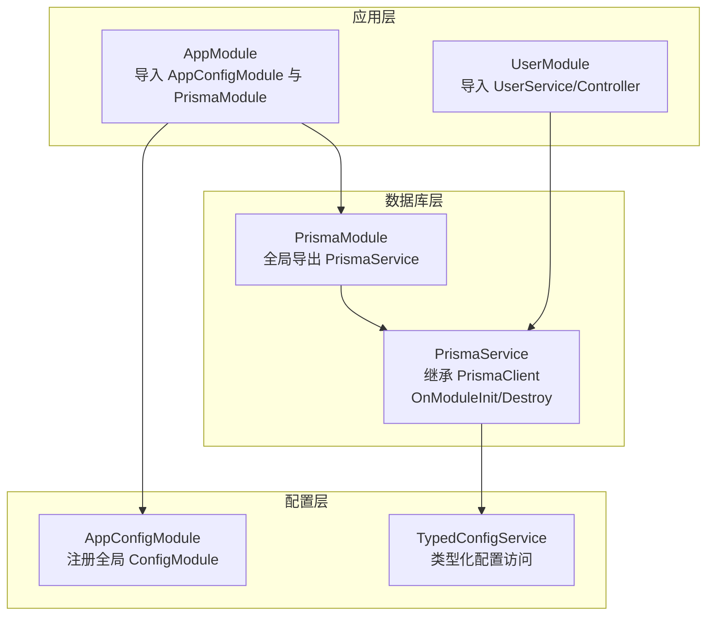
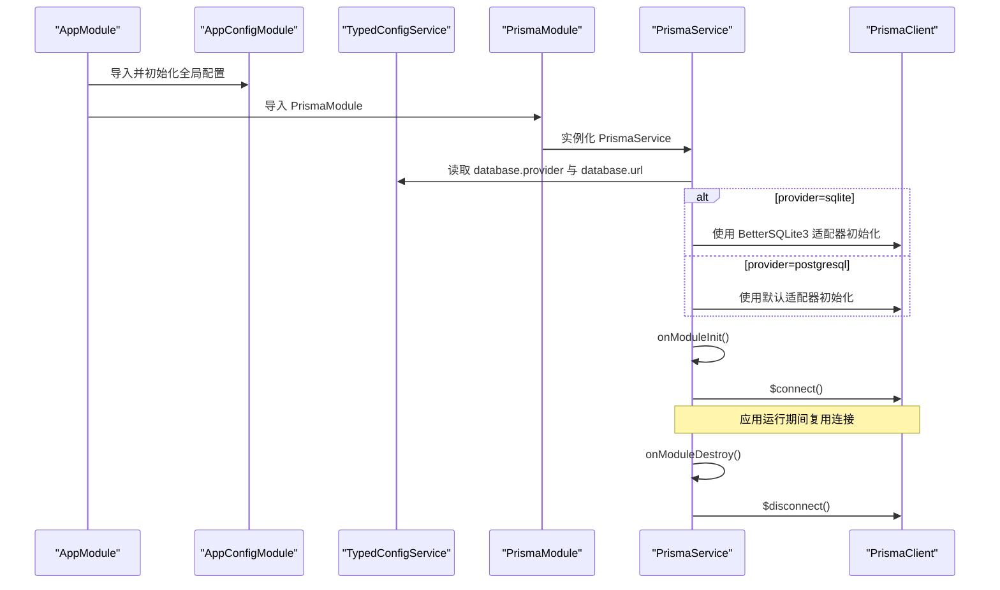
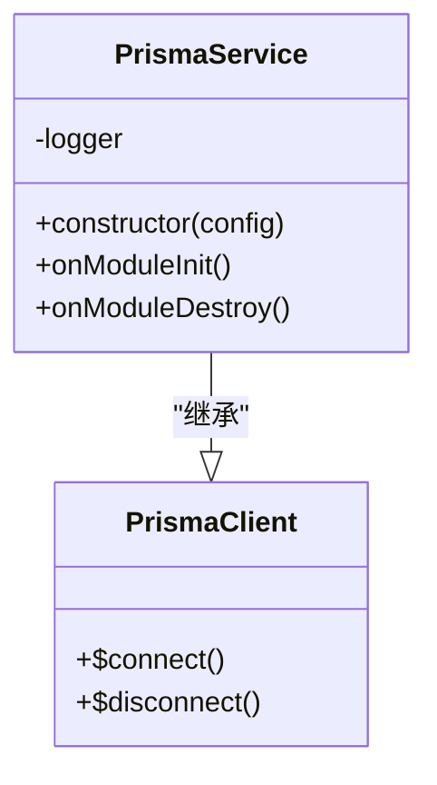
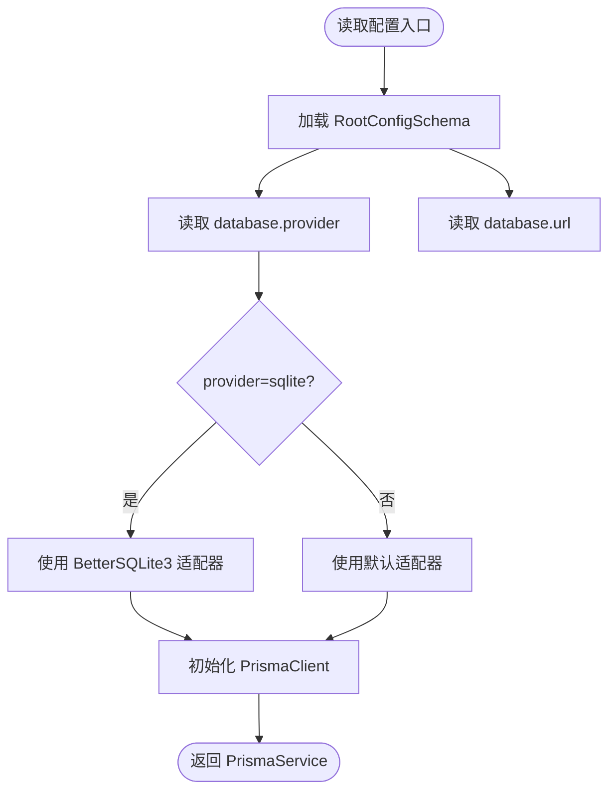
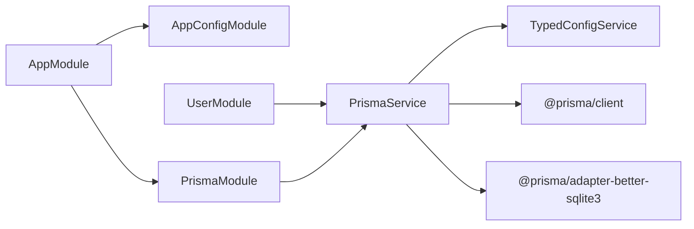
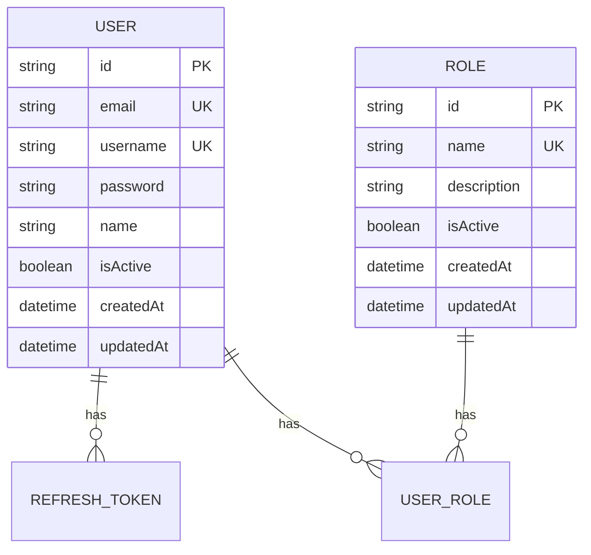

# 数据库模块

<cite>
**本文档引用的文件**
- [prisma.module.ts](file://src/prisma/prisma.module.ts)
- [prisma.service.ts](file://src/prisma/prisma.service.ts)
- [schema.prisma](file://prisma/schema.prisma)
- [prisma.config.ts](file://prisma.config.ts)
- [database.schema.ts](file://src/config/schemas/database.schema.ts)
- [typed-config.service.ts](file://src/config/typed-config.service.ts)
- [app.module.ts](file://src/app.module.ts)
- [user.service.ts](file://src/modules/user/user.service.ts)
- [config.module.ts](file://src/config/config.module.ts)
- [root.schema.ts](file://src/config/schemas/root.schema.ts)
- [seed.ts](file://prisma/seed.ts)
- [package.json](file://package.json)
- [User.prisma](file://prisma/schema/User.prisma)
- [Role.prisma](file://prisma/schema/Role.prisma)
</cite>

## 目录
1. [简介](#简介)
2. [项目结构](#项目结构)
3. [核心组件](#核心组件)
4. [架构总览](#架构总览)
5. [详细组件分析](#详细组件分析)
6. [依赖关系分析](#依赖关系分析)
7. [性能考虑](#性能考虑)
8. [故障排查指南](#故障排查指南)
9. [结论](#结论)
10. [附录](#附录)

## 简介
本文件系统性梳理数据库模块的设计与实现，重点围绕 PrismaModule 与 PrismaService 的职责边界、初始化流程、连接管理、事务处理能力、数据访问模式与查询优化策略展开。同时给出 Prisma 配置示例、性能优化建议、迁移与种子脚本管理方法，并提供与 TypeORM 的对比分析与选型建议。

## 项目结构
数据库模块采用“全局单例 + 懒加载”的设计：通过全局模块导出 PrismaService，供应用任意模块注入使用；PrismaService 继承 PrismaClient 并在模块生命周期内完成连接与断开，确保资源安全回收。

**图表来源**
- [app.module.ts:18-32](file://src/app.module.ts#L18-L32)
- [config.module.ts:6-19](file://src/config/config.module.ts#L6-L19)
- [prisma.module.ts:4-9](file://src/prisma/prisma.module.ts#L4-L9)
- [prisma.service.ts:11-34](file://src/prisma/prisma.service.ts#L11-L34)

**章节来源**
- [app.module.ts:18-32](file://src/app.module.ts#L18-L32)
- [prisma.module.ts:4-9](file://src/prisma/prisma.module.ts#L4-L9)
- [prisma.service.ts:11-34](file://src/prisma/prisma.service.ts#L11-L34)

## 核心组件
- PrismaModule：全局模块，仅提供并导出 PrismaService，避免重复实例化。
- PrismaService：继承 PrismaClient，负责按配置选择适配器（SQLite 或 PostgreSQL），并在模块初始化时建立连接、销毁时断开连接。
- TypedConfigService：提供类型化配置访问，支持点语法路径读取，用于从配置树中读取数据库 provider/url 等参数。
- 配置 Schema：定义数据库 provider、url、最大连接数、日志开关等字段，确保配置强类型与默认值。
- Prisma 配置：通过 prisma.config.ts 统一管理 schema、迁移目录、种子脚本与 datasource url（环境变量驱动）。

**章节来源**
- [prisma.module.ts:4-9](file://src/prisma/prisma.module.ts#L4-L9)
- [prisma.service.ts:11-44](file://src/prisma/prisma.service.ts#L11-L44)
- [typed-config.service.ts:23-38](file://src/config/typed-config.service.ts#L23-L38)
- [database.schema.ts:3-8](file://src/config/schemas/database.schema.ts#L3-L8)
- [prisma.config.ts:4-13](file://prisma.config.ts#L4-L13)

## 架构总览
下图展示从应用启动到数据库连接建立的关键交互：

**图表来源**
- [app.module.ts:18-32](file://src/app.module.ts#L18-L32)
- [prisma.module.ts:4-9](file://src/prisma/prisma.module.ts#L4-L9)
- [prisma.service.ts:18-42](file://src/prisma/prisma.service.ts#L18-L42)
- [typed-config.service.ts:23-38](file://src/config/typed-config.service.ts#L23-L38)

## 详细组件分析

### PrismaModule 设计与职责
- 全局导出：通过 @Global() 保证 PrismaService 在应用任意位置可注入，避免重复实例化带来的连接与状态问题。
- 单一职责：仅提供服务，不封装业务逻辑，保持与 PrismaClient 的直接映射，便于扩展与测试。

**章节来源**
- [prisma.module.ts:4-9](file://src/prisma/prisma.module.ts#L4-L9)

### PrismaService 初始化与连接管理
- 适配器选择：根据配置选择 SQLite（BetterSQLite3）或 PostgreSQL（默认）。SQLite 适配器允许自定义 url，默认指向本地开发数据库文件。
- 生命周期钩子：实现 OnModuleInit/OnModuleDestroy，在模块初始化阶段自动连接，在进程退出前断开连接，确保资源释放。
- 日志记录：构造函数中输出当前数据库 provider，便于诊断。

**图表来源**
- [prisma.service.ts:11-44](file://src/prisma/prisma.service.ts#L11-L44)

**章节来源**
- [prisma.service.ts:18-42](file://src/prisma/prisma.service.ts#L18-L42)

### 配置体系与类型化访问
- AppConfigModule：注册全局 ConfigModule，加载自定义配置加载器，生产环境忽略 .env 文件以避免污染。
- RootConfigSchema：聚合 app、database、jwt、logger 等命名空间，形成统一配置树。
- DatabaseSchema：定义数据库 provider（枚举）、url（非空）、最大连接数、日志开关等字段。
- TypedConfigService.get(namespace.path)：支持点语法读取，提供类型推断与默认值，避免魔法字符串。

**图表来源**
- [root.schema.ts:10-15](file://src/config/schemas/root.schema.ts#L10-L15)
- [database.schema.ts:3-8](file://src/config/schemas/database.schema.ts#L3-L8)
- [typed-config.service.ts:23-38](file://src/config/typed-config.service.ts#L23-L38)
- [prisma.service.ts:18-34](file://src/prisma/prisma.service.ts#L18-L34)

**章节来源**
- [config.module.ts:6-19](file://src/config/config.module.ts#L6-L19)
- [root.schema.ts:10-15](file://src/config/schemas/root.schema.ts#L10-L15)
- [database.schema.ts:3-8](file://src/config/schemas/database.schema.ts#L3-L8)
- [typed-config.service.ts:23-38](file://src/config/typed-config.service.ts#L23-L38)
- [prisma.service.ts:18-34](file://src/prisma/prisma.service.ts#L18-L34)

### 数据访问模式与查询优化
- 选择性投影：在用户服务中广泛使用 select 投影，仅返回必要字段，降低序列化成本与网络传输开销。
- 唯一性校验：创建前先查重，避免无效写入与异常传播。
- 关联查询：User 与 Role 通过多对多关联，配合关系名进行查询与更新。
- 查询优化建议：
  - 使用 select 精准投影，避免 *。
  - 合理使用 where 条件与索引字段（如唯一键 email/username）。
  - 批量场景优先使用事务包裹，减少往返与锁竞争。
  - 对高频查询开启数据库端缓存（如 Redis）与应用端缓存（如 Nest Cache Manager）。

**章节来源**
- [user.service.ts:17-37](file://src/modules/user/user.service.ts#L17-L37)
- [user.service.ts:39-44](file://src/modules/user/user.service.ts#L39-L44)
- [user.service.ts:46-57](file://src/modules/user/user.service.ts#L46-L57)
- [user.service.ts:85-98](file://src/modules/user/user.service.ts#L85-L98)
- [user.service.ts:100-106](file://src/modules/user/user.service.ts#L100-L106)
- [User.prisma:1-15](file://prisma/schema/User.prisma#L1-L15)
- [Role.prisma:1-13](file://prisma/schema/Role.prisma#L1-L13)

### 事务处理机制
- PrismaService 支持事务 API（例如 $transaction），可在单个回调中执行多个数据库操作，保证原子性与一致性。
- 建议在业务层（如 UserService）封装事务调用，结合幂等性与回滚策略，确保失败重试与补偿。
- 事务边界应尽量短小，避免长事务导致锁等待与性能下降。

**章节来源**
- [prisma.service.ts:11-14](file://src/prisma/prisma.service.ts#L11-L14)

### 批量操作处理
- 批量插入/更新/删除：使用 PrismaClient 提供的批量 API，减少网络往返与服务器压力。
- 分页与并发：结合 take/skip 与 where 条件，控制批次大小；在高并发场景下注意锁与冲突处理。
- 错误隔离：对每批操作独立捕获异常，避免整批失败影响其他批次。

**章节来源**
- [user.service.ts:17-37](file://src/modules/user/user.service.ts#L17-L37)
- [user.service.ts:85-98](file://src/modules/user/user.service.ts#L85-L98)

### 数据库迁移与种子管理
- 迁移目录：prisma/migrations，版本化管理数据库结构变更。
- 种子脚本：prisma/seed.ts，用于初始化基础数据（如管理员用户），支持 BetterSQLite3 适配器。
- 配置入口：prisma.config.ts 定义 schema 路径、迁移与种子脚本命令，datasource.url 由环境变量 DATABASE_URL 提供。

**章节来源**
- [prisma.config.ts:4-13](file://prisma.config.ts#L4-L13)
- [seed.ts:1-41](file://prisma/seed.ts#L1-L41)

### 与 TypeORM 的对比与选型建议
- 类型安全：Prisma 通过客户端与 Zod 类型生成，提供编译期类型检查；TypeORM 依赖装饰器与反射，类型推断较弱。
- 性能：Prisma 在复杂查询与批量操作上通常表现更优；TypeORM 在复杂实体关系映射上更灵活。
- 学习曲线：Prisma 更偏向声明式 DSL 与客户端 API；TypeORM 更贴近传统 ORM 思维。
- 选型建议：追求高性能、强类型与简洁 API 的项目优先考虑 Prisma；需要高度灵活的实体映射与复杂关系建模时可考虑 TypeORM。

**章节来源**
- [package.json:36-47](file://package.json#L36-L47)

## 依赖关系分析
- 模块耦合：AppModule 导入 AppConfigModule 与 PrismaModule；UserModule 通过依赖注入使用 PrismaService。
- 外部依赖：Prisma 客户端、适配器（BetterSQLite3）、Zod 类型生成器、Prisma CLI。
- 配置耦合：PrismaService 依赖 TypedConfigService 读取 database.provider 与 database.url；Prisma 配置依赖环境变量 DATABASE_URL。

**图表来源**
- [app.module.ts:18-32](file://src/app.module.ts#L18-L32)
- [prisma.module.ts:4-9](file://src/prisma/prisma.module.ts#L4-L9)
- [user.service.ts:3](file://src/modules/user/user.service.ts#L3)
- [prisma.service.ts:7-8](file://src/prisma/prisma.service.ts#L7-L8)
- [package.json:36-47](file://package.json#L36-L47)

**章节来源**
- [app.module.ts:18-32](file://src/app.module.ts#L18-L32)
- [prisma.module.ts:4-9](file://src/prisma/prisma.module.ts#L4-L9)
- [user.service.ts:3](file://src/modules/user/user.service.ts#L3)
- [prisma.service.ts:7-8](file://src/prisma/prisma.service.ts#L7-L8)
- [package.json:36-47](file://package.json#L36-L47)

## 性能考虑
- 连接池与并发：虽然当前实现为单实例，但 PrismaClient 内部具备连接池与并发控制；生产环境建议通过环境变量与 Prisma 配置合理设置连接上限。
- 查询优化：使用 select 投影、索引命中、避免 N+1 查询；对高频接口引入缓存中间件。
- 事务与批量：将多步写入放入事务，批量操作分批提交，减少锁持有时间。
- 监控与日志：启用数据库查询日志（谨慎使用）与慢查询监控，定位瓶颈。

**章节来源**
- [database.schema.ts:6](file://src/config/schemas/database.schema.ts#L6)
- [user.service.ts:115-123](file://src/modules/user/user.service.ts#L115-L123)

## 故障排查指南
- 连接失败：检查 DATABASE_URL 是否正确；确认 provider 与适配器匹配；查看 PrismaService 构造日志输出。
- 初始化异常：确认 onModuleInit 已触发且 $connect 成功；若失败，检查数据库可达性与凭据。
- 断开异常：确认 onModuleDestroy 已触发且 $disconnect 成功；避免在进程退出前仍有未完成的请求。
- 配置错误：使用 TypedConfigService.get 读取配置时，确保路径正确；生产环境忽略 .env 文件，需通过环境变量注入。

**章节来源**
- [prisma.service.ts:36-42](file://src/prisma/prisma.service.ts#L36-L42)
- [typed-config.service.ts:23-38](file://src/config/typed-config.service.ts#L23-L38)
- [config.module.ts:13](file://src/config/config.module.ts#L13)

## 结论
该数据库模块以 Prisma 为核心，通过全局模块与类型化配置实现简洁、可靠的连接管理与生命周期控制。配合合理的查询投影、事务与批量策略，可在保证类型安全的同时获得良好的性能表现。建议在生产环境中进一步完善连接池参数、监控与缓存策略，并持续通过迁移与种子脚本维护数据库演进。

## 附录

### Prisma 配置示例（要点）
- schema 路径：指向 prisma/ 目录
- 迁移目录：prisma/migrations
- 种子脚本：ts-node prisma/seed.ts
- datasource.url：从环境变量 DATABASE_URL 读取

**章节来源**
- [prisma.config.ts:4-13](file://prisma.config.ts#L4-L13)

### 数据模型概览

**图表来源**
- [User.prisma:1-15](file://prisma/schema/User.prisma#L1-L15)
- [Role.prisma:1-13](file://prisma/schema/Role.prisma#L1-L13)