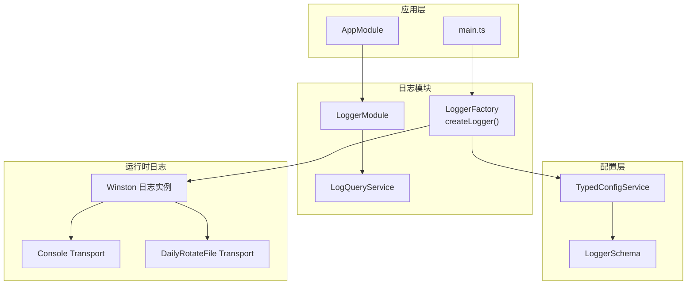
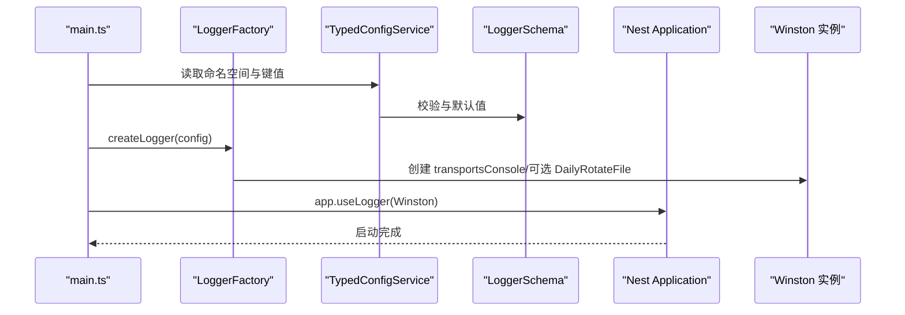
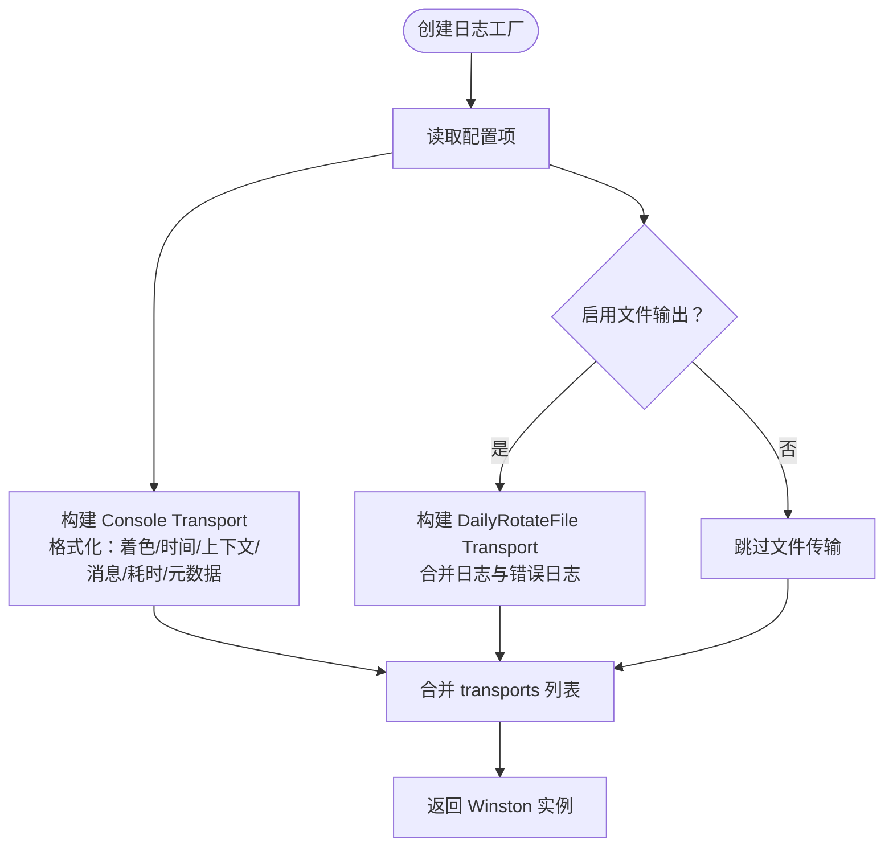
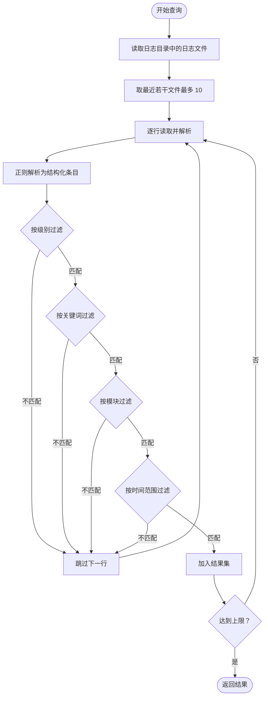
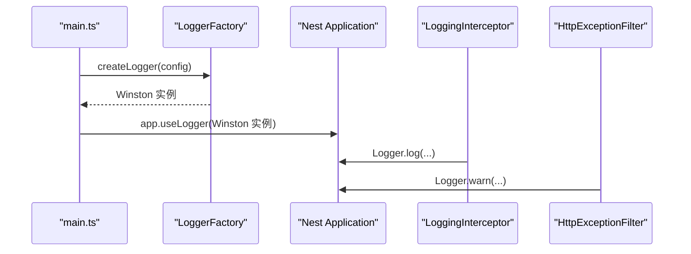
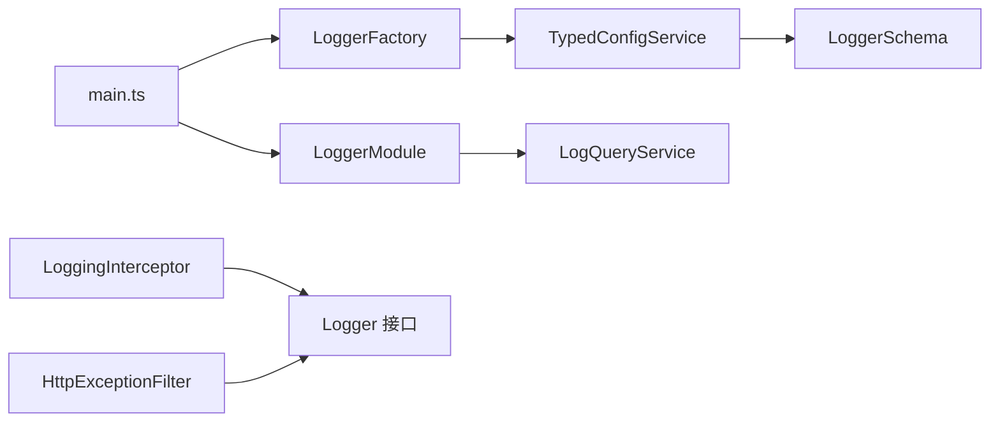

# 日志模块

<cite>
**本文引用的文件**
- [logger.module.ts](file://src/modules/logger/logger.module.ts)
- [logger.factory.ts](file://src/modules/logger/logger.factory.ts)
- [log-query.service.ts](file://src/modules/logger/log-query.service.ts)
- [log-level.constants.ts](file://src/common/constants/log-level.constants.ts)
- [logger.schema.ts](file://src/config/schemas/logger.schema.ts)
- [typed-config.service.ts](file://src/config/typed-config.service.ts)
- [app.module.ts](file://src/app.module.ts)
- [main.ts](file://src/main.ts)
- [logging.interceptor.ts](file://src/common/interceptors/logging.interceptor.ts)
- [http-exception.filter.ts](file://src/common/filters/http-exception.filter.ts)
</cite>

## 目录

1. [简介](#简介)
2. [项目结构](#项目结构)
3. [核心组件](#核心组件)
4. [架构总览](#架构总览)
5. [详细组件分析](#详细组件分析)
6. [依赖关系分析](#依赖关系分析)
7. [性能考量](#性能考量)
8. [故障排查指南](#故障排查指南)
9. [结论](#结论)
10. [附录](#附录)

## 简介

本文件系统性阐述日志模块的设计与实现，覆盖以下关键主题：

- LoggerModule 的设计与职责边界
- 日志工厂（LoggerFactory）的配置项、初始化流程与输出格式
- LogQueryService 的日志查询能力、过滤条件与性能特征
- 日志级别管理与结构化日志记录机制
- 与 Winston 日志系统的集成方式与可扩展点
- 自定义日志处理器的实现思路
- 配置示例、最佳实践与调试技巧

## 项目结构

日志模块位于 src/modules/logger，主要由三部分组成：

- LoggerModule：模块声明，导出 LogQueryService（当前未被任何控制器或服务注入）
- LoggerFactory：创建并配置 Winston 日志实例，负责控制台与可选文件输出
- LogQueryService：基于文件系统的日志检索与过滤工具（当前为“死代码”，无外部消费）

图表来源

- [app.module.ts:18-32](file://src/app.module.ts#L18-L32)
- [main.ts:9-18](file://src/main.ts#L9-L18)
- [logger.module.ts:4-7](file://src/modules/logger/logger.module.ts#L4-L7)
- [logger.factory.ts:114-155](file://src/modules/logger/logger.factory.ts#L114-L155)
- [logger.schema.ts:4-10](file://src/config/schemas/logger.schema.ts#L4-L10)
- [typed-config.service.ts:23-38](file://src/config/typed-config.service.ts#L23-L38)

章节来源

- [logger.module.ts:1-9](file://src/modules/logger/logger.module.ts#L1-L9)
- [logger.factory.ts:114-155](file://src/modules/logger/logger.factory.ts#L114-L155)
- [log-query.service.ts:23-29](file://src/modules/logger/log-query.service.ts#L23-L29)
- [logger.schema.ts:4-10](file://src/config/schemas/logger.schema.ts#L4-L10)
- [typed-config.service.ts:23-38](file://src/config/typed-config.service.ts#L23-L38)
- [app.module.ts:18-32](file://src/app.module.ts#L18-L32)
- [main.ts:9-18](file://src/main.ts#L9-L18)

## 核心组件

- LoggerModule：声明并导出 LogQueryService，供其他模块按需注入使用
- LoggerFactory：封装 Winston 初始化逻辑，根据配置动态启用文件输出与着色格式
- LogQueryService：从本地日志目录读取日志文件，按级别、关键词、时间范围、模块等条件过滤，返回结构化日志条目

章节来源

- [logger.module.ts:4-7](file://src/modules/logger/logger.module.ts#L4-L7)
- [logger.factory.ts:114-155](file://src/modules/logger/logger.factory.ts#L114-L155)
- [log-query.service.ts:31-90](file://src/modules/logger/log-query.service.ts#L31-L90)

## 架构总览

日志模块在启动阶段通过 LoggerFactory 创建 Winston 实例，并将其设置为全局 LoggerService。运行期各处可通过标准 Logger 接口输出日志；同时，LogQueryService 提供离线查询能力。

图表来源

- [main.ts:14-18](file://src/main.ts#L14-L18)
- [logger.factory.ts:114-155](file://src/modules/logger/logger.factory.ts#L114-L155)
- [typed-config.service.ts:23-38](file://src/config/typed-config.service.ts#L23-L38)
- [logger.schema.ts:4-10](file://src/config/schemas/logger.schema.ts#L4-L10)

## 详细组件分析

### LoggerModule

- 职责：声明日志模块，提供并导出 LogQueryService
- 导入：无外部依赖，仅注册服务
- 使用建议：若无控制器或服务注入 LogQueryService，则可考虑移除该模块以减少冗余

章节来源

- [logger.module.ts:4-7](file://src/modules/logger/logger.module.ts#L4-L7)

### LoggerFactory（日志工厂）

- 功能要点
  - 基于环境变量决定是否启用彩色输出
  - 支持控制台输出与可选的每日轮转文件输出
  - 统一日志格式：时间戳、级别、上下文、消息、耗时、结构化元数据
  - 敏感字段脱敏：对包含敏感词的键进行掩码处理
- 关键配置项
  - logger.loggerLevel：日志级别（枚举）
  - logger.loggerEnableFile：是否启用文件输出
  - logger.loggerDir：日志目录
  - logger.loggerMaxFiles：文件保留数量
  - logger.loggerMaxSize：单文件最大大小
- 输出格式
  - 控制台：彩色着色、包含耗时、上下文、结构化元数据
  - 文件：去色、统一格式、按日期轮转
- 性能特征
  - 控制台输出为同步 I/O，文件输出使用每日轮转适配器
  - 通过级别过滤减少不必要的格式化与写入

图表来源

- [logger.factory.ts:114-155](file://src/modules/logger/logger.factory.ts#L114-L155)
- [logger.schema.ts:4-10](file://src/config/schemas/logger.schema.ts#L4-L10)
- [typed-config.service.ts:23-38](file://src/config/typed-config.service.ts#L23-L38)

章节来源

- [logger.factory.ts:114-155](file://src/modules/logger/logger.factory.ts#L114-L155)
- [logger.schema.ts:4-10](file://src/config/schemas/logger.schema.ts#L4-L10)
- [typed-config.service.ts:23-38](file://src/config/typed-config.service.ts#L23-L38)

### LogQueryService（日志查询服务）

- 能力概述
  - 从日志目录读取最近的若干日志文件
  - 解析每行日志为结构化对象（时间、级别、模块、消息、原始行）
  - 支持按级别、关键词、时间范围、模块过滤
  - 支持限制返回条数
- 查询接口
  - queryLogs(query: LogQuery): LogEntry[]
  - getRecentLogs(limit?): LogEntry[]
  - getErrorLogs(limit?): LogEntry[]
- 解析规则
  - 正则匹配固定格式：时间戳、级别、可选模块、消息
  - 忽略空行与无法解析的行
- 性能与限制
  - 仅扫描最近若干文件（最多 10 个），避免全量扫描
  - 一旦达到上限立即返回
  - 适合小规模本地日志检索，不适合大规模生产级日志聚合

图表来源

- [log-query.service.ts:31-90](file://src/modules/logger/log-query.service.ts#L31-L90)
- [log-query.service.ts:92-103](file://src/modules/logger/log-query.service.ts#L92-L103)
- [log-query.service.ts:105-119](file://src/modules/logger/log-query.service.ts#L105-L119)

章节来源

- [log-query.service.ts:31-90](file://src/modules/logger/log-query.service.ts#L31-L90)
- [log-query.service.ts:92-103](file://src/modules/logger/log-query.service.ts#L92-L103)
- [log-query.service.ts:105-119](file://src/modules/logger/log-query.service.ts#L105-L119)

### 日志级别管理

- 可用级别：error、warn、info、debug、verbose
- 配置来源：LoggerSchema 定义枚举与默认值
- 使用方式：通过 TypedConfigService 读取 logger.loggerLevel 并传递给 LoggerFactory

章节来源

- [log-level.constants.ts:1-10](file://src/common/constants/log-level.constants.ts#L1-L10)
- [logger.schema.ts:6](file://src/config/schemas/logger.schema.ts#L6)
- [logger.factory.ts:116](file://src/modules/logger/logger.factory.ts#L116)

### 结构化日志记录机制

- 元数据脱敏：对包含敏感词的键进行掩码处理，递归处理嵌套对象
- 格式化：统一输出包含时间戳、级别、上下文、消息、耗时与结构化元数据
- 上下文：支持在日志中附加 context 字段，便于模块识别
- 耗时：结合 winston 的 ms 格式化，自动计算请求耗时

章节来源

- [logger.factory.ts:24-38](file://src/modules/logger/logger.factory.ts#L24-L38)
- [logger.factory.ts:40-112](file://src/modules/logger/logger.factory.ts#L40-L112)

### 与 Winston 的集成与自定义处理器

- 集成方式
  - 通过 WinstonModule.createLogger 创建实例
  - 控制台与文件传输器分别配置格式与级别
- 自定义处理器
  - 可新增 transport（如 HTTP、数据库、云日志服务）
  - 可扩展格式化器（如序列化错误堆栈、添加 traceId）
  - 可增加过滤器（按模块、用户、租户维度）

章节来源

- [logger.factory.ts:122-155](file://src/modules/logger/logger.factory.ts#L122-L155)

### 初始化流程与全局使用

- 启动阶段
  - main.ts 中创建 LoggerFactory 并设置为全局 LoggerService
  - 应用模块导入 LoggerModule，以便其他模块按需注入 LogQueryService
- 运行期使用
  - LoggingInterceptor 与 HttpExceptionFilter 使用 Logger 输出请求与异常信息
  - 业务代码可通过 @Inject(Logger) 或 LoggerService 接口输出日志

图表来源

- [main.ts:14-18](file://src/main.ts#L14-L18)
- [logging.interceptor.ts:25-35](file://src/common/interceptors/logging.interceptor.ts#L25-L35)
- [http-exception.filter.ts:40-67](file://src/common/filters/http-exception.filter.ts#L40-L67)

章节来源

- [main.ts:14-18](file://src/main.ts#L14-L18)
- [logging.interceptor.ts:14-39](file://src/common/interceptors/logging.interceptor.ts#L14-L39)
- [http-exception.filter.ts:25-78](file://src/common/filters/http-exception.filter.ts#L25-L78)

## 依赖关系分析

- LoggerModule 依赖 LogQueryService
- LoggerFactory 依赖 TypedConfigService 与 LoggerSchema
- main.ts 依赖 LoggerFactory 并设置全局 LoggerService
- LoggingInterceptor 与 HttpExceptionFilter 依赖 Logger 接口
- LogQueryService 依赖文件系统与配置服务

图表来源

- [main.ts:14-18](file://src/main.ts#L14-L18)
- [logger.factory.ts:114-155](file://src/modules/logger/logger.factory.ts#L114-L155)
- [typed-config.service.ts:23-38](file://src/config/typed-config.service.ts#L23-L38)
- [logger.schema.ts:4-10](file://src/config/schemas/logger.schema.ts#L4-L10)
- [logger.module.ts:4-7](file://src/modules/logger/logger.module.ts#L4-L7)
- [log-query.service.ts:27-29](file://src/modules/logger/log-query.service.ts#L27-L29)
- [logging.interceptor.ts:14](file://src/common/interceptors/logging.interceptor.ts#L14)
- [http-exception.filter.ts:26](file://src/common/filters/http-exception.filter.ts#L26)

章节来源

- [app.module.ts:18-32](file://src/app.module.ts#L18-L32)
- [main.ts:14-18](file://src/main.ts#L14-L18)
- [logger.factory.ts:114-155](file://src/modules/logger/logger.factory.ts#L114-L155)
- [typed-config.service.ts:23-38](file://src/config/typed-config.service.ts#L23-L38)
- [logger.schema.ts:4-10](file://src/config/schemas/logger.schema.ts#L4-L10)
- [logger.module.ts:4-7](file://src/modules/logger/logger.module.ts#L4-L7)
- [log-query.service.ts:27-29](file://src/modules/logger/log-query.service.ts#L27-L29)
- [logging.interceptor.ts:14](file://src/common/interceptors/logging.interceptor.ts#L14)
- [http-exception.filter.ts:26](file://src/common/filters/http-exception.filter.ts#L26)

## 性能考量

- 控制台输出：同步 I/O，建议在开发环境启用彩色输出，在生产环境谨慎使用
- 文件输出：每日轮转，避免单文件过大；合理设置 maxFiles 与 maxSize
- 查询性能：LogQueryService 仅扫描最近若干文件并提前终止，适合小规模检索
- 建议
  - 生产环境优先使用结构化日志与集中式日志平台（如 ELK、Cloud Logging）
  - 对高频日志采用采样或降级策略
  - 避免在热路径中进行大量字符串拼接与 JSON 序列化

## 故障排查指南

- 启动失败：检查根配置是否存在，确保 TypedConfigService 正常加载
- 日志不输出：确认 logger.loggerEnableFile 与 logger.loggerLevel 设置
- 文件未生成：检查 logger.loggerDir 是否存在且具备写权限
- 查询无结果：确认日志目录中存在 .log 文件，且格式符合解析规则
- 敏感信息泄露：确认敏感字段脱敏逻辑生效，必要时扩展敏感词列表

章节来源

- [typed-config.service.ts:14-18](file://src/config/typed-config.service.ts#L14-L18)
- [logger.factory.ts:116-119](file://src/modules/logger/logger.factory.ts#L116-L119)
- [log-query.service.ts:92-103](file://src/modules/logger/log-query.service.ts#L92-L103)
- [logger.factory.ts:24-38](file://src/modules/logger/logger.factory.ts#L24-L38)

## 结论

日志模块以 LoggerFactory 为核心，结合 Winston 实现了可控台与可文件输出的日志体系；LogQueryService 提供基础的本地日志检索能力。当前 LogQueryService 未被外部消费，建议评估其必要性。整体设计简洁清晰，易于扩展与维护。

## 附录

### 配置示例（基于 Schema）

- logger.loggerDir：日志目录，默认 logs
- logger.loggerLevel：日志级别，默认 info
- logger.loggerEnableFile：是否启用文件输出，默认 false
- logger.loggerMaxFiles：文件保留天数，默认 7
- logger.loggerMaxSize：单文件最大大小，默认 20m

章节来源

- [logger.schema.ts:4-10](file://src/config/schemas/logger.schema.ts#L4-L10)

### 最佳实践

- 开发环境启用彩色输出与文件输出，生产环境仅启用文件输出
- 使用上下文标识模块，便于检索与聚合
- 对敏感字段统一脱敏，避免泄露
- 在高并发场景下，优先使用结构化日志与集中式日志平台

### 调试技巧

- 使用 getRecentLogs(limit) 快速定位最新日志
- 使用 getErrorLogs(limit) 快速定位错误日志
- 在关键路径添加耗时日志，结合 ms 格式化分析性能瓶颈
- 通过关键词过滤快速缩小问题范围
