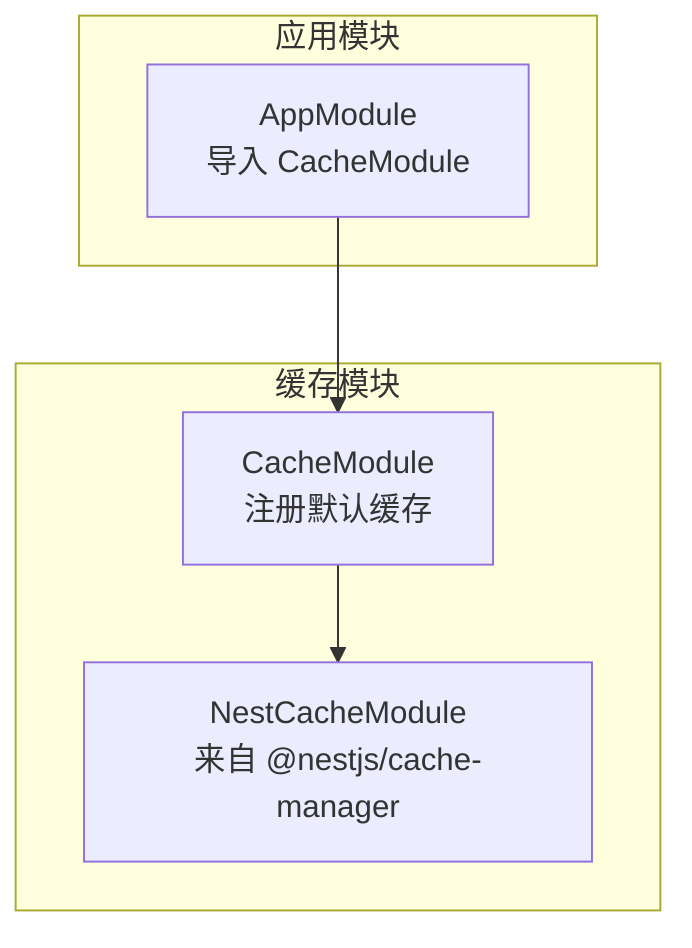
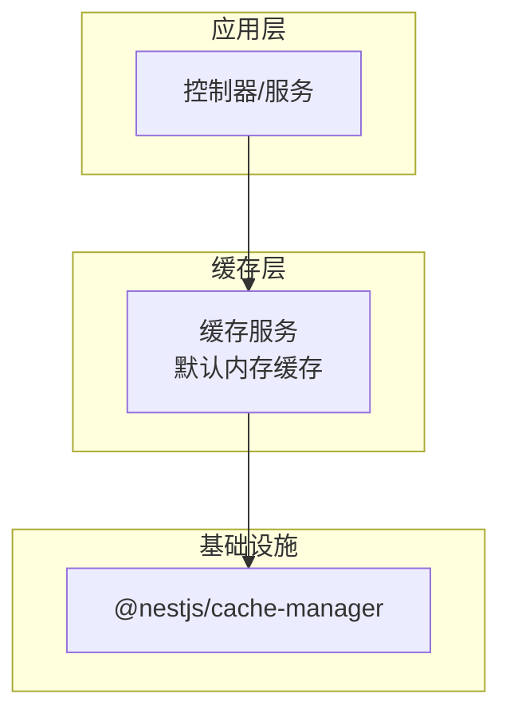
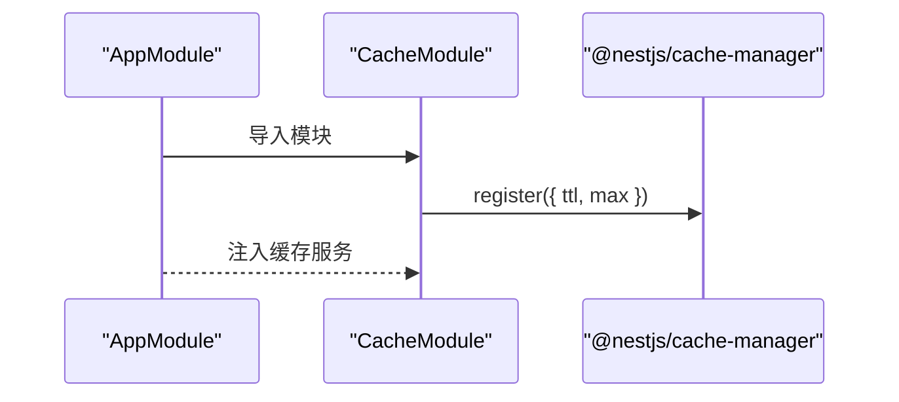
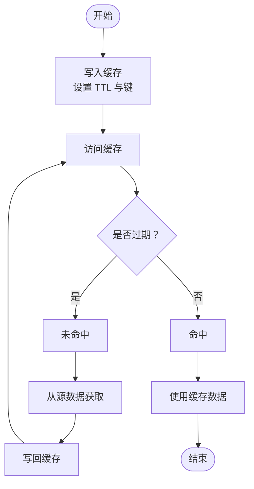

# 缓存模块

<cite>
**本文引用的文件**
- [cache.module.ts](file://src/modules/cache/cache.module.ts)
- [app.module.ts](file://src/app.module.ts)
</cite>

## 目录
1. [简介](#简介)
2. [项目结构](#项目结构)
3. [核心组件](#核心组件)
4. [架构总览](#架构总览)
5. [详细组件分析](#详细组件分析)
6. [依赖关系分析](#依赖关系分析)
7. [性能考虑](#性能考虑)
8. [故障排除指南](#故障排除指南)
9. [结论](#结论)
10. [附录](#附录)

## 简介
本文件系统性梳理并说明当前仓库中“缓存模块”的设计与实现现状，重点覆盖以下方面：
- 设计原则与实现要点：基于 @nestjs/cache-manager 的默认内存缓存实现，提供 TTL 与容量控制。
- 缓存策略与配置：ttl 与 max 参数的含义、适用场景与取值建议。
- 生命周期与失效机制：基于 TTL 的自动过期与 LRU 容量淘汰。
- 与应用的集成方式：在根模块中导入并作为全局可用的缓存服务。
- 键命名规范与序列化：当前未实现自定义键规则与序列化逻辑，建议遵循统一规范。
- 性能优化与监控：结合现有配置给出调优建议；当前未提供内置统计与监控能力。
- 故障排除：常见问题定位与修复思路。

## 项目结构
缓存模块位于 src/modules/cache/cache.module.ts，通过 @nestjs/cache-manager 注册默认内存缓存，并在根模块中集中导入。



**图表来源**
- [app.module.ts:18-32](file://src/app.module.ts#L18-L32)
- [cache.module.ts:4-12](file://src/modules/cache/cache.module.ts#L4-L12)

**章节来源**
- [app.module.ts:18-32](file://src/app.module.ts#L18-L32)
- [cache.module.ts:1-14](file://src/modules/cache/cache.module.ts#L1-L14)

## 核心组件
- CacheModule：对 @nestjs/cache-manager 的轻量封装，仅暴露默认内存缓存实例，便于在应用其他模块中注入使用。
- 默认配置项：
  - ttl：单条缓存记录的存活时间（毫秒）
  - max：缓存容器最大容量（LRU 淘汰阈值）

上述两个参数共同决定了缓存的命中率、内存占用与回收效率。当前实现未提供自定义序列化器、键前缀策略或持久化后端。

**章节来源**
- [cache.module.ts:6-9](file://src/modules/cache/cache.module.ts#L6-L9)

## 架构总览
下图展示缓存模块在应用中的位置与依赖关系：



**图表来源**
- [cache.module.ts:1-14](file://src/modules/cache/cache.module.ts#L1-L14)
- [app.module.ts:26](file://src/app.module.ts#L26)

## 详细组件分析

### 组件一：CacheModule 分析
- 角色定位：提供全局可用的默认内存缓存实例。
- 关键点：
  - 通过 NestCacheModule.register 注册缓存，传入 ttl 与 max。
  - 作为可选导出模块，供其他业务模块按需注入使用。
- 当前缺失：
  - 未实现自定义键命名空间前缀与统一序列化策略。
  - 未提供缓存统计、命中率、容量使用等可观测性指标。

```mermaid
classDiagram
class CacheModule {
+导入 "NestCacheModule.register({ ttl, max })"
+导出 "NestCacheModule"
}
class NestCacheModule {
+register(config)
+get(key)
+set(key, value, options?)
+del(key)
+reset()
}
CacheModule --> NestCacheModule : "注册并导出"
```

**图表来源**
- [cache.module.ts:4-12](file://src/modules/cache/cache.module.ts#L4-L12)

**章节来源**
- [cache.module.ts:1-14](file://src/modules/cache/cache.module.ts#L1-L14)

### 组件二：与应用的集成方式
- 在根模块 AppModule 中导入 CacheModule，使其成为全局可用的缓存服务。
- 业务模块可通过依赖注入获取缓存服务，在需要的地方进行读写操作。



**图表来源**
- [app.module.ts:26](file://src/app.module.ts#L26)
- [cache.module.ts:6-11](file://src/modules/cache/cache.module.ts#L6-L11)

**章节来源**
- [app.module.ts:18-32](file://src/app.module.ts#L18-L32)
- [cache.module.ts:4-12](file://src/modules/cache/cache.module.ts#L4-L12)

### 缓存策略与生命周期
- 策略选择：默认内存缓存，适合小规模、低延迟的读多写少场景。
- 生命周期管理：
  - TTL：每条缓存记录在 ttl 时间后自动过期。
  - LRU：当缓存数量达到 max 时触发淘汰。
- 失效机制：
  - 自动过期：读取时若已过期则视为未命中。
  - 手动删除：通过缓存服务的删除接口主动清理。
- 一致性保证：当前未实现分布式锁、版本号或写后失效策略，跨进程一致性需额外设计。



**图表来源**
- [cache.module.ts:6-9](file://src/modules/cache/cache.module.ts#L6-L9)

**章节来源**
- [cache.module.ts:6-9](file://src/modules/cache/cache.module.ts#L6-L9)

### 缓存键命名规范与序列化
- 当前现状：未实现自定义键前缀与统一序列化策略。
- 建议实践（概念性指导）：
  - 键命名：采用“模块名:实体类型:业务维度”的层级前缀，避免冲突。
  - 序列化：统一使用 JSON 或二进制序列化，确保跨语言/跨进程一致。
  - 版本化：为键增加版本号，升级时可平滑迁移。
- 注意：以上为通用最佳实践，当前仓库未实现相关代码。

### 缓存配置示例与调优建议
- 配置示例（概念性说明）：
  - ttl：根据热点数据访问频率与更新频次设定，如 5 分钟至 1 小时。
  - max：根据可用内存与对象大小估算，预留 20%~30%冗余。
- 调优建议（概念性说明）：
  - 读多写少场景：提高 ttl，降低 max，提升命中率。
  - 写多读少场景：缩短 ttl，避免脏读；必要时引入写后失效。
  - 高并发场景：评估单机内存上限，必要时引入分布式缓存（如 Redis）。
- 注意：以上为通用建议，具体数值需结合压测结果调整。

### 监控与统计
- 当前现状：未提供内置的缓存命中率、容量使用、请求量等统计指标。
- 建议方案（概念性说明）：
  - 包装缓存服务，埋点统计命中/未命中、耗时、容量使用。
  - 暴露健康检查端点或指标端点，便于运维观测。
- 注意：以上为扩展建议，当前仓库未实现相关代码。

## 依赖关系分析
- CacheModule 依赖 @nestjs/cache-manager 提供的默认内存缓存能力。
- AppModule 导入 CacheModule，使缓存服务在全应用范围内可用。
- 业务模块通过依赖注入使用缓存服务，无需感知底层实现。


**图表来源**
- [app.module.ts:26](file://src/app.module.ts#L26)
- [cache.module.ts:1-14](file://src/modules/cache/cache.module.ts#L1-L14)

**章节来源**
- [app.module.ts:18-32](file://src/app.module.ts#L18-L32)
- [cache.module.ts:1-14](file://src/modules/cache/cache.module.ts#L1-L14)

## 性能考虑
- 内存占用：max 控制缓存条目上限，建议结合对象大小与并发量评估。
- 访问延迟：默认内存缓存延迟极低，但需注意高并发下的 GC 压力。
- 数据一致性：在写多场景下，建议配合 TTL 与写后失效策略，避免脏读。
- 可扩展性：若业务增长导致单机内存不足或需要跨进程共享，建议迁移到分布式缓存。

## 故障排除指南
- 症状：缓存频繁未命中
  - 可能原因：ttl 设置过短、max 过小导致频繁淘汰。
  - 处理建议：延长 ttl 或增大 max，结合压测验证。
- 症状：内存占用持续上升
  - 可能原因：未及时清理过期键或缓存对象过大。
  - 处理建议：检查 TTL 设置与对象序列化体积，必要时拆分键或压缩数据。
- 症状：并发下出现脏读
  - 可能原因：写路径未同步失效或未采用写后失效策略。
  - 处理建议：在写操作后主动删除相关键，或引入版本号/锁机制。

## 结论
当前缓存模块以最小实现提供了默认内存缓存能力，满足基础读多写少场景。对于生产环境，建议补充：
- 自定义键命名与序列化策略
- 分布式缓存与一致性保障
- 缓存统计与可观测性
- 更精细的 TTL 与容量调优

## 附录
- 配置参数参考
  - ttl：单条缓存记录的存活时间（毫秒）
  - max：缓存容器最大容量（LRU 淘汰阈值）
- 集成入口
  - 在根模块导入 CacheModule，即可在任意模块注入使用