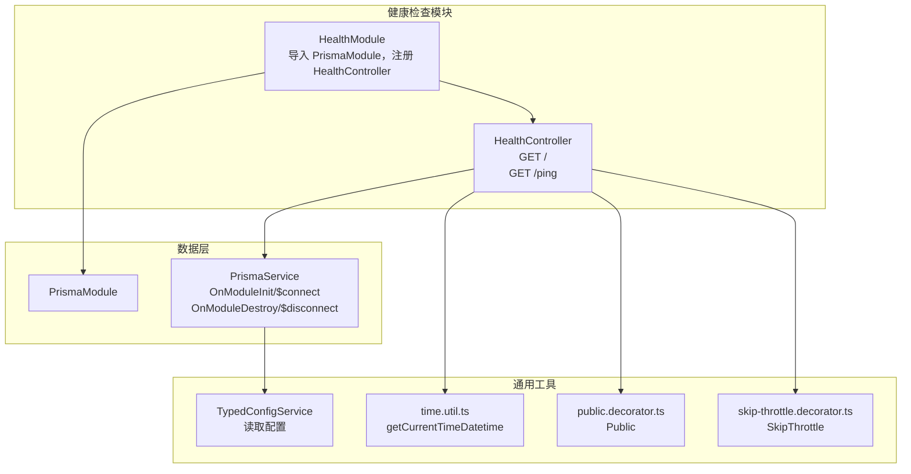
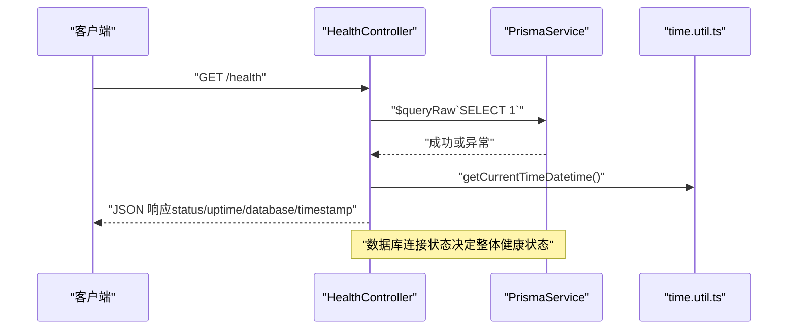
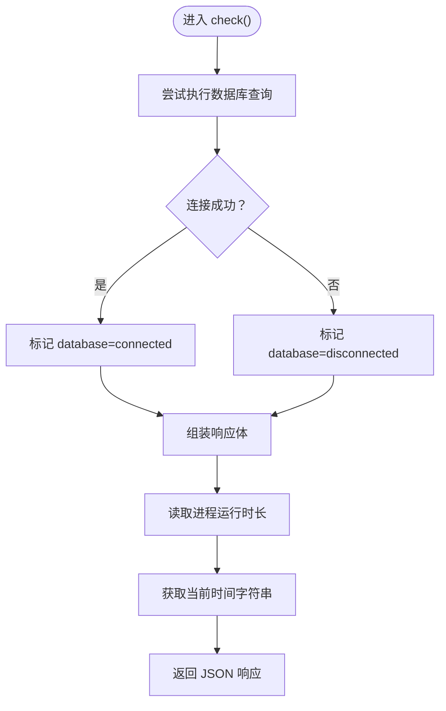
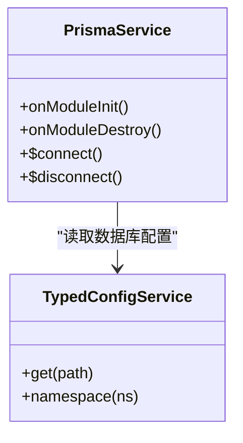
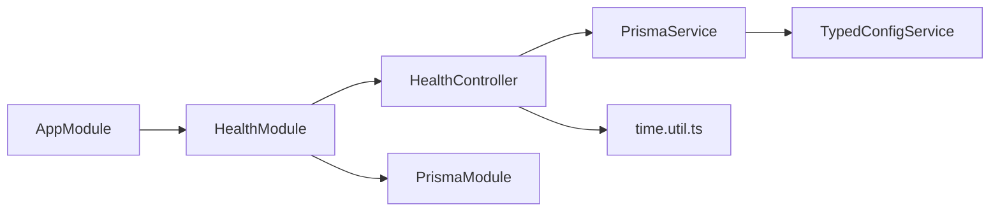

# 健康检查模块

<cite>
**本文引用的文件**
- [health.module.ts](file://src/modules/health/health.module.ts)
- [health.controller.ts](file://src/modules/health/health.controller.ts)
- [prisma.service.ts](file://src/prisma/prisma.service.ts)
- [typed-config.service.ts](file://src/config/typed-config.service.ts)
- [time.util.ts](file://src/common/utils/time.util.ts)
- [public.decorator.ts](file://src/common/decorators/public.decorator.ts)
- [skip-throttle.decorator.ts](file://src/common/decorators/skip-throttle.decorator.ts)
- [app.module.ts](file://src/app.module.ts)
- [cache.module.ts](file://src/modules/cache/cache.module.ts)
</cite>

## 目录
1. [简介](#简介)
2. [项目结构](#项目结构)
3. [核心组件](#核心组件)
4. [架构总览](#架构总览)
5. [详细组件分析](#详细组件分析)
6. [依赖关系分析](#依赖关系分析)
7. [性能与可用性考量](#性能与可用性考量)
8. [故障排查指南](#故障排查指南)
9. [结论](#结论)
10. [附录](#附录)

## 简介
本技术文档聚焦于健康检查模块（HealthModule），系统阐述其设计目的、实现原理与最佳实践。该模块提供两类健康检查能力：
- 应用健康检查：验证数据库连接状态、服务运行时长与当前时间戳，返回服务整体健康状态（ok 或 degraded）
- Ping 检查：快速返回“pong”响应，用于基础连通性探测

模块通过 Swagger 文档标注接口契约，采用公开访问与跳过速率限制策略，确保在微服务编排中可被外部系统稳定调用。

## 项目结构
健康检查模块位于 src/modules/health，由一个控制器与一个模块组成，并依赖 Prisma 数据库客户端进行连接校验。

图表来源
- [health.module.ts:1-9](file://src/modules/health/health.module.ts#L1-L9)
- [health.controller.ts:1-85](file://src/modules/health/health.controller.ts#L1-L85)
- [prisma.service.ts:1-43](file://src/prisma/prisma.service.ts#L1-L43)
- [typed-config.service.ts:1-48](file://src/config/typed-config.service.ts#L1-L48)
- [time.util.ts:65-67](file://src/common/utils/time.util.ts#L65-L67)
- [public.decorator.ts:1-5](file://src/common/decorators/public.decorator.ts#L1-L5)
- [skip-throttle.decorator.ts:1-12](file://src/common/decorators/skip-throttle.decorator.ts#L1-L12)

章节来源
- [health.module.ts:1-9](file://src/modules/health/health.module.ts#L1-L9)
- [health.controller.ts:1-85](file://src/modules/health/health.controller.ts#L1-L85)
- [prisma.service.ts:1-43](file://src/prisma/prisma.service.ts#L1-L43)
- [typed-config.service.ts:1-48](file://src/config/typed-config.service.ts#L1-L48)
- [time.util.ts:65-67](file://src/common/utils/time.util.ts#L65-L67)
- [public.decorator.ts:1-5](file://src/common/decorators/public.decorator.ts#L1-L5)
- [skip-throttle.decorator.ts:1-12](file://src/common/decorators/skip-throttle.decorator.ts#L1-L12)

## 核心组件
- HealthModule：声明式注册健康检查控制器，并引入 PrismaModule 以注入 PrismaService
- HealthController：提供两个端点
  - GET /：应用健康检查，返回状态码、时间戳、运行时长与数据库连接状态
  - GET /ping：基础连通性检查，返回固定消息
- PrismaService：负责数据库连接生命周期管理（初始化连接与销毁断开）
- 配置与工具：TypedConfigService 提供类型化配置读取；time.util.ts 提供时间格式化工具；公共访问与跳过限流装饰器保障健康检查的高可用性

章节来源
- [health.module.ts:1-9](file://src/modules/health/health.module.ts#L1-L9)
- [health.controller.ts:14-84](file://src/modules/health/health.controller.ts#L14-L84)
- [prisma.service.ts:36-42](file://src/prisma/prisma.service.ts#L36-L42)
- [typed-config.service.ts:23-38](file://src/config/typed-config.service.ts#L23-L38)
- [time.util.ts:65-67](file://src/common/utils/time.util.ts#L65-L67)
- [public.decorator.ts:1-5](file://src/common/decorators/public.decorator.ts#L1-L5)
- [skip-throttle.decorator.ts:1-12](file://src/common/decorators/skip-throttle.decorator.ts#L1-L12)

## 架构总览
健康检查模块在应用启动后即可对外提供服务，其关键路径如下：
- 控制器接收请求
- 执行数据库连接校验
- 组装响应体并返回

图表来源
- [health.controller.ts:48-63](file://src/modules/health/health.controller.ts#L48-L63)
- [prisma.service.ts:36-42](file://src/prisma/prisma.service.ts#L36-L42)
- [time.util.ts:65-67](file://src/common/utils/time.util.ts#L65-L67)

## 详细组件分析

### HealthModule 分析
- 依赖注入：通过 PrismaModule 注入 PrismaService，为健康检查提供数据库连接能力
- 控制器注册：HealthController 作为唯一控制器暴露健康检查端点
- 设计意图：最小化依赖、集中化健康检查逻辑，便于统一接入监控与编排系统

章节来源
- [health.module.ts:1-9](file://src/modules/health/health.module.ts#L1-L9)

### HealthController 分析
- 公开访问与跳过限流：使用 Public 与 SkipThrottle 装饰器，确保健康检查不被鉴权与限流影响
- 接口一：GET /
  - 功能：执行数据库连通性测试，计算服务运行时长与当前时间戳，返回整体健康状态
  - 响应字段：
    - status：枚举值 ok 或 degraded
    - timestamp：当前时间字符串
    - uptime：进程运行时长（秒）
    - database：枚举值 connected 或 disconnected
  - 评估标准：仅数据库连接状态决定整体健康状态；其他资源未纳入
- 接口二：GET /ping
  - 功能：快速连通性探测，返回固定消息
  - 用途：Kubernetes readiness/liveness 探针、负载均衡健康检查等

图表来源
- [health.controller.ts:48-63](file://src/modules/health/health.controller.ts#L48-L63)
- [time.util.ts:65-67](file://src/common/utils/time.util.ts#L65-L67)

章节来源
- [health.controller.ts:14-84](file://src/modules/health/health.controller.ts#L14-L84)
- [public.decorator.ts:1-5](file://src/common/decorators/public.decorator.ts#L1-L5)
- [skip-throttle.decorator.ts:1-12](file://src/common/decorators/skip-throttle.decorator.ts#L1-L12)

### PrismaService 与数据库连接
- 生命周期：在模块初始化阶段建立数据库连接，在销毁阶段断开连接
- 连接策略：根据配置选择 SQLite 或 PostgreSQL；SQLite 使用 Better-SQLite3 适配器
- 健康检查依赖：健康检查通过一次轻量查询验证连接有效性

图表来源
- [prisma.service.ts:18-34](file://src/prisma/prisma.service.ts#L18-L34)
- [typed-config.service.ts:23-38](file://src/config/typed-config.service.ts#L23-L38)

章节来源
- [prisma.service.ts:18-34](file://src/prisma/prisma.service.ts#L18-L34)
- [typed-config.service.ts:23-38](file://src/config/typed-config.service.ts#L23-L38)

### 时间与格式化工具
- getCurrentTimeDatetime：提供人类可读的时间字符串，用于响应中的 timestamp 字段
- 用途：保证时间格式一致性，便于日志与监控系统解析

章节来源
- [time.util.ts:65-67](file://src/common/utils/time.util.ts#L65-L67)

## 依赖关系分析
- 模块耦合：HealthModule 仅依赖 PrismaModule，耦合度低，职责单一
- 控制器依赖：HealthController 依赖 PrismaService 与时间工具，无外部第三方服务依赖
- 应用集成：AppModule 将 HealthModule 作为应用的一部分加载，确保健康检查随应用启动

图表来源
- [app.module.ts:27-30](file://src/app.module.ts#L27-L30)
- [health.module.ts:1-9](file://src/modules/health/health.module.ts#L1-L9)
- [health.controller.ts:11-12](file://src/modules/health/health.controller.ts#L11-L12)
- [prisma.service.ts:18-34](file://src/prisma/prisma.service.ts#L18-L34)
- [typed-config.service.ts:23-38](file://src/config/typed-config.service.ts#L23-L38)

章节来源
- [app.module.ts:27-30](file://src/app.module.ts#L27-L30)
- [health.module.ts:1-9](file://src/modules/health/health.module.ts#L1-L9)
- [health.controller.ts:11-12](file://src/modules/health/health.controller.ts#L11-L12)
- [prisma.service.ts:18-34](file://src/prisma/prisma.service.ts#L18-L34)
- [typed-config.service.ts:23-38](file://src/config/typed-config.service.ts#L23-L38)

## 性能与可用性考量
- 健康检查复杂度：O(1)，仅执行一次轻量查询，对生产环境影响极小
- 并发与限流：通过 SkipThrottle 装饰器跳过全局速率限制，避免健康检查被误判为攻击
- 可靠性：数据库连接失败即判定为降级（degraded），有助于快速暴露问题
- 扩展建议：
  - 引入缓存服务可用性检查（如 Redis/Memcached）与第三方服务依赖检查（如外部 API）
  - 增加系统资源指标（CPU、内存、磁盘、线程池）采集，丰富健康状态维度
  - 支持多数据库实例与主从切换检测，提升复杂拓扑下的健康判断准确性

[本节为通用指导，不直接分析具体文件]

## 故障排查指南
- 健康检查返回 degraded
  - 检查数据库连接配置与网络连通性
  - 查看 PrismaService 初始化日志，确认连接建立成功
  - 确认数据库服务可用且无连接池耗尽
- 响应字段缺失或格式异常
  - 检查时间工具是否正确返回字符串
  - 确认控制器响应注解与实际返回结构一致
- Ping 探测失败
  - 确认路由前缀与路径匹配
  - 检查中间件与守卫是否拦截了该端点

章节来源
- [health.controller.ts:48-63](file://src/modules/health/health.controller.ts#L48-L63)
- [prisma.service.ts:36-42](file://src/prisma/prisma.service.ts#L36-L42)
- [time.util.ts:65-67](file://src/common/utils/time.util.ts#L65-L67)

## 结论
健康检查模块以最小实现提供关键的运行时健康观测能力，通过数据库连通性与基础连通性探测，满足微服务编排与运维监控的基本需求。建议在后续版本中扩展缓存与第三方服务检查、系统资源指标采集，并完善健康状态分级与告警联动，以支撑更复杂的生产场景。

[本节为总结性内容，不直接分析具体文件]

## 附录

### 接口规范与响应格式
- GET /health
  - 访问控制：公开端点
  - 限流策略：跳过全局限流
  - 响应字段：
    - status：ok 或 degraded
    - timestamp：当前时间字符串
    - uptime：进程运行时长（秒）
    - database：connected 或 disconnected
- GET /health/ping
  - 访问控制：公开端点
  - 限流策略：跳过全局限流
  - 响应字段：
    - message：pong

章节来源
- [health.controller.ts:14-84](file://src/modules/health/health.controller.ts#L14-L84)
- [public.decorator.ts:1-5](file://src/common/decorators/public.decorator.ts#L1-L5)
- [skip-throttle.decorator.ts:1-12](file://src/common/decorators/skip-throttle.decorator.ts#L1-L12)

### 在微服务架构中的作用
- 服务发现集成：健康检查作为服务注册与发现的前置条件，确保仅向注册中心上报健康实例
- 负载均衡决策：LB/网关依据健康检查结果进行流量调度，避免将请求转发至不健康节点
- 故障恢复机制：结合自动重启与熔断策略，健康检查失败触发重试与隔离，加速故障恢复

[本节为概念性说明，不直接分析具体文件]

### 最佳实践与监控告警建议
- 健康检查端点应独立于业务端点，避免业务压力影响健康状态判断
- 告警阈值设置：连续多次失败触发告警；区分降级与故障级别
- 多维健康指标：除数据库外，增加缓存、消息队列、外部依赖与系统资源指标
- 日志与追踪：记录健康检查失败原因与上下文，便于定位根因

[本节为通用指导，不直接分析具体文件]