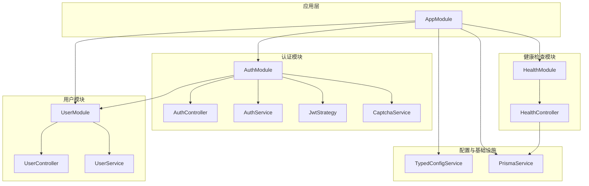
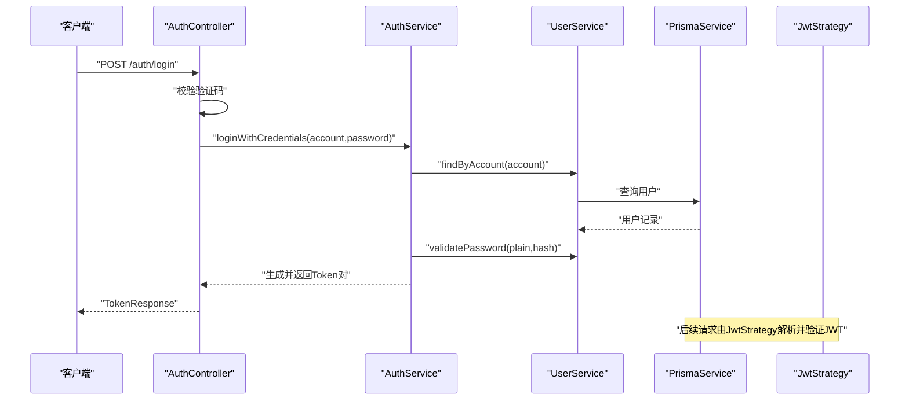
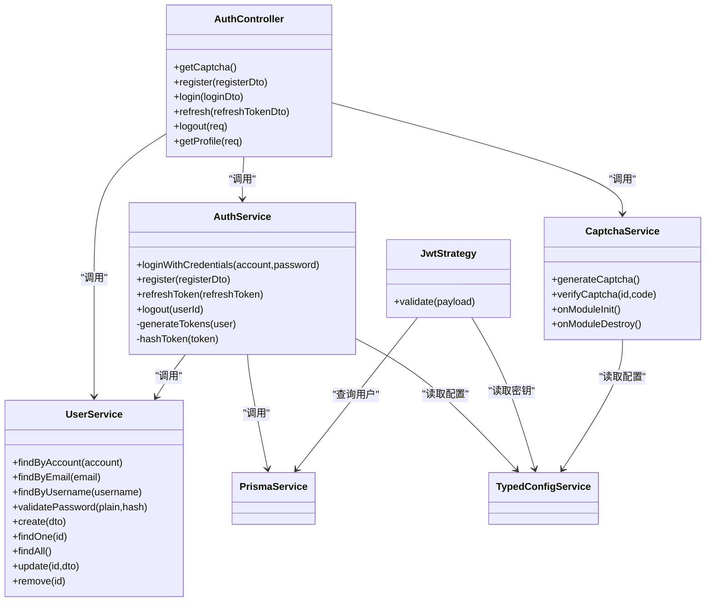
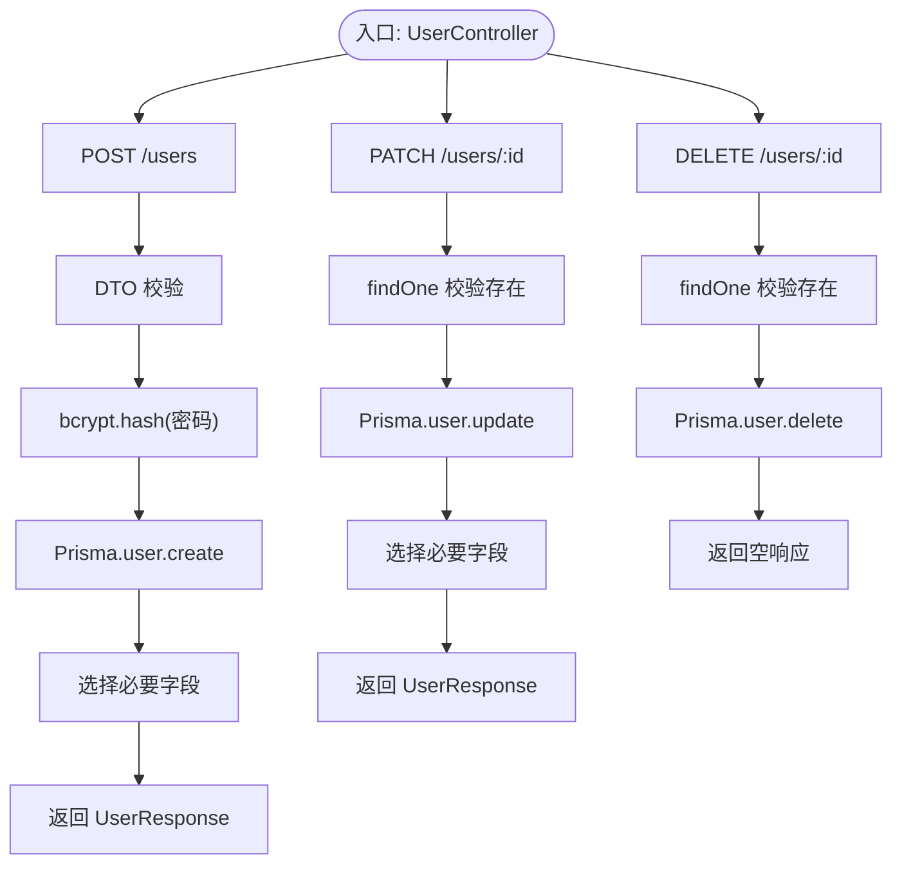
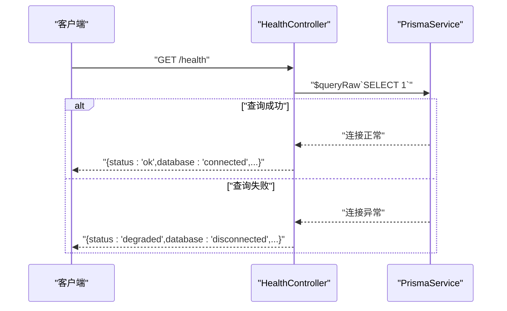
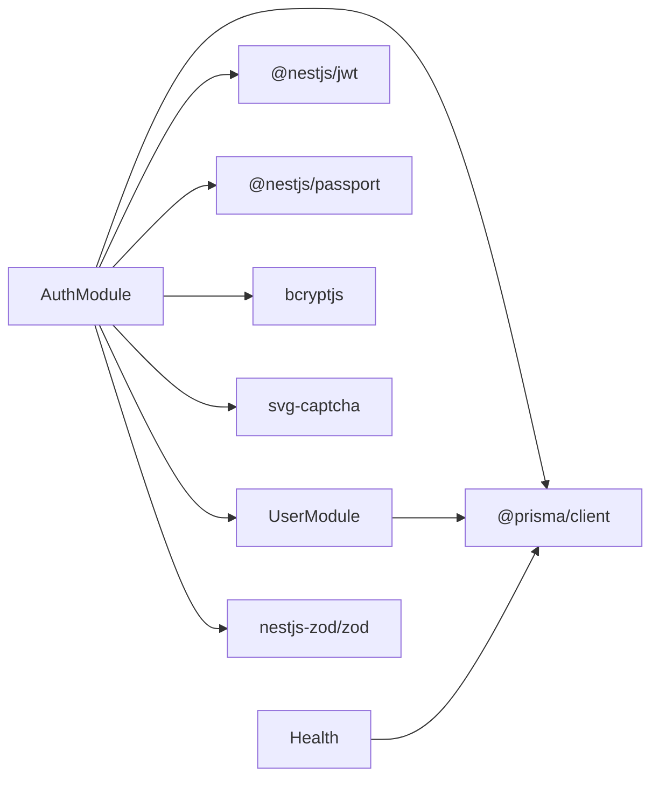

# 核心功能模块

<cite>
**本文引用的文件**
- [src/app.module.ts](file://src/app.module.ts)
- [src/modules/auth/auth.module.ts](file://src/modules/auth/auth.module.ts)
- [src/modules/auth/auth.controller.ts](file://src/modules/auth/auth.controller.ts)
- [src/modules/auth/auth.service.ts](file://src/modules/auth/auth.service.ts)
- [src/modules/auth/strategies/jwt.strategy.ts](file://src/modules/auth/strategies/jwt.strategy.ts)
- [src/modules/auth/captcha.service.ts](file://src/modules/auth/captcha.service.ts)
- [src/modules/auth/dto/auth.dto.ts](file://src/modules/auth/dto/auth.dto.ts)
- [src/modules/user/user.module.ts](file://src/modules/user/user.module.ts)
- [src/modules/user/user.controller.ts](file://src/modules/user/user.controller.ts)
- [src/modules/user/user.service.ts](file://src/modules/user/user.service.ts)
- [src/modules/user/dto/user.dto.ts](file://src/modules/user/dto/user.dto.ts)
- [src/modules/health/health.module.ts](file://src/modules/health/health.module.ts)
- [src/modules/health/health.controller.ts](file://src/modules/health/health.controller.ts)
- [src/prisma/prisma.service.ts](file://src/prisma/prisma.service.ts)
- [src/config/typed-config.service.ts](file://src/config/typed-config.service.ts)
- [src/common/interfaces/jwt.interface.ts](file://src/common/interfaces/jwt.interface.ts)
- [src/common/interfaces/user.interface.ts](file://src/common/interfaces/user.interface.ts)
- [src/common/enums/biz-code.enum.ts](file://src/common/enums/biz-code.enum.ts)
- [package.json](file://package.json)
</cite>

## 目录

1. [引言](#引言)
2. [项目结构](#项目结构)
3. [核心组件](#核心组件)
4. [架构总览](#架构总览)
5. [详细组件分析](#详细组件分析)
6. [依赖分析](#依赖分析)
7. [性能考虑](#性能考虑)
8. [故障排查指南](#故障排查指南)
9. [结论](#结论)
10. [附录](#附录)

## 引言

本文件聚焦于三个核心功能模块：认证模块（AuthModule）、用户模块（UserModule）与健康检查模块（HealthModule）。我们将从职责边界、内部组件结构、服务依赖关系、对外接口、模块协作机制、数据与事件流、错误传播、初始化与生命周期管理以及性能优化策略等方面进行系统化阐述，并提供可扩展与定制化的实践建议。

## 项目结构

应用采用标准的 NestJS 结构，核心模块位于 src/modules 下，全局配置与基础设施位于 src/config、src/prisma 等目录。AppModule 统一导入各功能模块与全局中间件（守卫、拦截器、过滤器、管道），形成统一的运行时环境。

**图表来源**

- [src/app.module.ts:18-61](file://src/app.module.ts#L18-L61)
- [src/modules/auth/auth.module.ts:11-32](file://src/modules/auth/auth.module.ts#L11-L32)
- [src/modules/user/user.module.ts:5-10](file://src/modules/user/user.module.ts#L5-L10)
- [src/modules/health/health.module.ts:5-9](file://src/modules/health/health.module.ts#L5-L9)

**章节来源**

- [src/app.module.ts:18-61](file://src/app.module.ts#L18-L61)
- [src/modules/auth/auth.module.ts:11-32](file://src/modules/auth/auth.module.ts#L11-L32)
- [src/modules/user/user.module.ts:5-10](file://src/modules/user/user.module.ts#L5-L10)
- [src/modules/health/health.module.ts:5-9](file://src/modules/health/health.module.ts#L5-L9)

## 核心组件

- 认证模块（AuthModule）
  - 职责：提供登录、注册、刷新令牌、退出登录、获取当前用户信息、图形验证码等能力；集成 Passport/JWT 与用户模块。
  - 关键组件：AuthController、AuthService、JwtStrategy、CaptchaService。
  - 外部接口：REST API（/auth/\*）。
- 用户模块（UserModule）
  - 职责：用户 CRUD、按账号查询、密码校验与哈希。
  - 关键组件：UserController、UserService。
  - 外部接口：REST API（/users/\*）。
- 健康检查模块（HealthModule）
  - 职责：提供服务健康状态与 Ping 接口，检测数据库连通性。
  - 关键组件：HealthController。
  - 外部接口：GET /health、GET /health/ping。

**章节来源**

- [src/modules/auth/auth.controller.ts:35-128](file://src/modules/auth/auth.controller.ts#L35-L128)
- [src/modules/auth/auth.service.ts:14-161](file://src/modules/auth/auth.service.ts#L14-L161)
- [src/modules/auth/strategies/jwt.strategy.ts:9-48](file://src/modules/auth/strategies/jwt.strategy.ts#L9-L48)
- [src/modules/auth/captcha.service.ts:20-97](file://src/modules/auth/captcha.service.ts#L20-L97)
- [src/modules/user/user.controller.ts:25-87](file://src/modules/user/user.controller.ts#L25-L87)
- [src/modules/user/user.service.ts:13-124](file://src/modules/user/user.service.ts#L13-L124)
- [src/modules/health/health.controller.ts:8-85](file://src/modules/health/health.controller.ts#L8-L85)

## 架构总览

认证模块通过 JwtStrategy 在请求进入时解码并验证 JWT，将用户身份注入到请求上下文；AuthService 负责令牌签发与刷新逻辑，并持久化刷新令牌；UserService 提供用户数据访问与密码处理；HealthController 通过 PrismaService 执行最小查询以判断数据库连通性。

**图表来源**

- [src/modules/auth/auth.controller.ts:70-86](file://src/modules/auth/auth.controller.ts#L70-L86)
- [src/modules/auth/auth.service.ts:29-43](file://src/modules/auth/auth.service.ts#L29-L43)
- [src/modules/auth/strategies/jwt.strategy.ts:22-47](file://src/modules/auth/strategies/jwt.strategy.ts#L22-L47)
- [src/modules/user/user.service.ts:76-83](file://src/modules/user/user.service.ts#L76-L83)
- [src/prisma/prisma.service.ts:36-42](file://src/prisma/prisma.service.ts#L36-L42)

## 详细组件分析

### 认证模块（AuthModule）

- 模块职责边界
  - 负责用户认证与授权相关流程：登录、注册、刷新、退出、获取当前用户信息、图形验证码。
  - 不直接处理业务数据，而是委托 UserService、PrismaService 完成数据读写。
- 内部组件结构
  - AuthController：暴露 /auth/\* 的 REST 接口，负责参数接收与响应封装。
  - AuthService：核心业务逻辑，包含登录凭据校验、注册、刷新令牌、登出、令牌生成与持久化。
  - JwtStrategy：Passport 策略，从 Authorization 头解析 JWT 并加载用户角色信息。
  - CaptchaService：生成与校验图形验证码，维护内存缓存与定时清理。
- 服务依赖关系
  - AuthController 依赖 AuthService、UserService、CaptchaService。
  - AuthService 依赖 PrismaService、UserService、JwtService、TypedConfigService。
  - JwtStrategy 依赖 PrismaService、TypedConfigService。
  - CaptchaService 为独立服务，依赖 BizCode 与 BusinessException。
- 对外接口
  - GET /auth/captcha：获取验证码（带节流）。
  - POST /auth/register：注册并返回 Token 对。
  - POST /auth/login：登录并返回 Token 对。
  - POST /auth/refresh：刷新 Token 对。
  - POST /auth/logout：退出登录（撤销用户所有刷新令牌）。
  - GET /auth/profile：获取当前用户信息。
- 数据与事件流
  - 登录流程：获取验证码 -> 校验验证码 -> 查询用户 -> 密码校验 -> 生成 Access/Refresh Token -> 持久化刷新令牌 -> 返回结果。
  - 刷新流程：校验刷新令牌哈希与有效期 -> 标记旧令牌为撤销 -> 生成新 Token -> 返回结果。
  - 退出流程：批量撤销用户所有未撤销的刷新令牌。
- 错误传播
  - 使用 BizCode 枚举与 BusinessException 抛出业务异常，配合全局 HttpExceptionFilter 统一转换为 HTTP 状态码。
- 初始化与生命周期
  - AuthModule 通过 JwtModule.registerAsync 注入配置；JwtStrategy 在构造函数中初始化；CaptchaService 在 onModuleInit 启动定时清理任务，在 onModuleDestroy 清理。
- 性能优化策略
  - 使用 Promise.all 并行生成 Access/Refresh Token，降低 RTT。
  - 刷新令牌采用哈希存储，查询基于哈希索引，避免明文匹配。
  - 验证码采用内存 Map 存储，定期清理过期项，防止内存膨胀。

**图表来源**

- [src/modules/auth/auth.controller.ts:35-128](file://src/modules/auth/auth.controller.ts#L35-L128)
- [src/modules/auth/auth.service.ts:14-161](file://src/modules/auth/auth.service.ts#L14-L161)
- [src/modules/auth/strategies/jwt.strategy.ts:9-48](file://src/modules/auth/strategies/jwt.strategy.ts#L9-L48)
- [src/modules/auth/captcha.service.ts:20-97](file://src/modules/auth/captcha.service.ts#L20-L97)
- [src/modules/user/user.service.ts:13-124](file://src/modules/user/user.service.ts#L13-L124)
- [src/prisma/prisma.service.ts:11-44](file://src/prisma/prisma.service.ts#L11-L44)
- [src/config/typed-config.service.ts:6-47](file://src/config/typed-config.service.ts#L6-L47)

**章节来源**

- [src/modules/auth/auth.module.ts:11-32](file://src/modules/auth/auth.module.ts#L11-L32)
- [src/modules/auth/auth.controller.ts:35-128](file://src/modules/auth/auth.controller.ts#L35-L128)
- [src/modules/auth/auth.service.ts:14-161](file://src/modules/auth/auth.service.ts#L14-L161)
- [src/modules/auth/strategies/jwt.strategy.ts:9-48](file://src/modules/auth/strategies/jwt.strategy.ts#L9-L48)
- [src/modules/auth/captcha.service.ts:20-97](file://src/modules/auth/captcha.service.ts#L20-L97)
- [src/modules/auth/dto/auth.dto.ts:1-74](file://src/modules/auth/dto/auth.dto.ts#L1-L74)
- [src/common/enums/biz-code.enum.ts:31-46](file://src/common/enums/biz-code.enum.ts#L31-L46)

### 用户模块（UserModule）

- 模块职责边界
  - 负责用户数据的增删改查、按账号检索、密码哈希与校验。
- 内部组件结构
  - UserController：暴露 /users/\* 的 REST 接口，负责参数接收与响应封装。
  - UserService：封装用户数据访问与业务规则，使用 PrismaService 进行数据库操作。
- 服务依赖关系
  - UserController 依赖 UserService。
  - UserService 依赖 PrismaService。
- 对外接口
  - POST /users：创建用户（密码自动哈希）。
  - GET /users：获取所有用户列表。
  - GET /users/:id：获取指定用户详情。
  - PATCH /users/:id：更新用户信息。
  - DELETE /users/:id：删除用户。
- 数据与事件流
  - 创建用户：校验邮箱唯一 -> 哈希密码 -> 写入数据库 -> 返回用户信息。
  - 更新/删除：先校验用户存在性，再执行更新/删除。
- 错误传播
  - 使用 BizCode.USER\_\* 与 BusinessException 抛出业务异常。
- 初始化与生命周期
  - 无特殊生命周期钩子，依赖 PrismaService 的连接管理。
- 性能优化策略
  - 使用 select 精简查询字段，避免传输敏感信息。
  - 密码哈希成本固定，保证安全性与性能平衡。

**图表来源**

- [src/modules/user/user.controller.ts:25-87](file://src/modules/user/user.controller.ts#L25-L87)
- [src/modules/user/user.service.ts:13-124](file://src/modules/user/user.service.ts#L13-L124)
- [src/modules/user/dto/user.dto.ts:1-32](file://src/modules/user/dto/user.dto.ts#L1-L32)

**章节来源**

- [src/modules/user/user.module.ts:5-10](file://src/modules/user/user.module.ts#L5-L10)
- [src/modules/user/user.controller.ts:25-87](file://src/modules/user/user.controller.ts#L25-L87)
- [src/modules/user/user.service.ts:13-124](file://src/modules/user/user.service.ts#L13-L124)
- [src/modules/user/dto/user.dto.ts:1-32](file://src/modules/user/dto/user.dto.ts#L1-L32)
- [src/common/enums/biz-code.enum.ts:47-52](file://src/common/enums/biz-code.enum.ts#L47-L52)

### 健康检查模块（HealthModule）

- 模块职责边界
  - 提供服务健康状态与 Ping 接口，检测数据库连通性。
- 内部组件结构
  - HealthController：暴露 /health 与 /health/ping。
- 服务依赖关系
  - HealthController 依赖 PrismaService 执行最小查询以判断数据库状态。
- 对外接口
  - GET /health：返回服务状态、时间戳、运行时长与数据库连接状态。
  - GET /health/ping：返回简单响应。
- 数据与事件流
  - /health：执行 SELECT 1，捕获异常以判定数据库断开；根据结果返回 ok 或 degraded。
- 错误传播
  - 无业务异常抛出，直接返回结构化 JSON。
- 初始化与生命周期
  - 无特殊生命周期钩子，依赖 PrismaService 的连接管理。
- 性能优化策略
  - 使用最小查询（SELECT 1）降低开销；跳过节流装饰器以避免误伤健康检查。

**图表来源**

- [src/modules/health/health.controller.ts:48-63](file://src/modules/health/health.controller.ts#L48-L63)
- [src/prisma/prisma.service.ts:36-42](file://src/prisma/prisma.service.ts#L36-L42)

**章节来源**

- [src/modules/health/health.module.ts:5-9](file://src/modules/health/health.module.ts#L5-L9)
- [src/modules/health/health.controller.ts:8-85](file://src/modules/health/health.controller.ts#L8-L85)

## 依赖分析

- 模块耦合
  - AuthModule 依赖 UserModule 与 JwtModule（Passport/JWT），并通过 JwtStrategy 间接依赖 PrismaService。
  - UserModule 仅依赖 PrismaService。
  - HealthModule 仅依赖 PrismaModule。
- 外部依赖
  - 认证：@nestjs/jwt、@nestjs/passport、passport-jwt、bcryptjs、svg-captcha。
  - 数据库：@prisma/client、@prisma/adapter-better-sqlite3。
  - 校验：nestjs-zod、zod。
  - 其他：dayjs、cache-manager、winston 等。

**图表来源**

- [package.json:26-55](file://package.json#L26-L55)
- [src/modules/auth/auth.module.ts:1-10](file://src/modules/auth/auth.module.ts#L1-L10)
- [src/modules/health/health.module.ts:1-9](file://src/modules/health/health.module.ts#L1-L9)

**章节来源**

- [package.json:26-55](file://package.json#L26-L55)
- [src/modules/auth/auth.module.ts:1-10](file://src/modules/auth/auth.module.ts#L1-L10)
- [src/modules/health/health.module.ts:1-9](file://src/modules/health/health.module.ts#L1-L9)

## 性能考虑

- 令牌生成并行化：AuthService 使用 Promise.all 同时生成 Access/Refresh Token，减少往返时间。
- 刷新令牌安全与高效：采用 SHA-256 哈希存储，查询基于哈希索引，避免明文比较。
- 验证码内存管理：CaptchaService 定时清理过期项，限制最大存储容量，避免内存泄漏。
- 最小查询：HealthController 使用 SELECT 1 快速检测数据库连通性。
- 密码哈希成本：UserService 固定成本，兼顾安全与性能。
- 全局节流：AppModule 配置了短/中/长三档节流策略，结合 @Throttle 装饰器对高频接口进行限流。

**章节来源**

- [src/modules/auth/auth.service.ts:127-136](file://src/modules/auth/auth.service.ts#L127-L136)
- [src/modules/auth/captcha.service.ts:27-39](file://src/modules/auth/captcha.service.ts#L27-L39)
- [src/modules/health/health.controller.ts:50-55](file://src/modules/health/health.controller.ts#L50-L55)
- [src/modules/user/user.service.ts:26-36](file://src/modules/user/user.service.ts#L26-L36)
- [src/app.module.ts:21-25](file://src/app.module.ts#L21-L25)

## 故障排查指南

- 认证相关
  - 凭证无效：检查账号是否存在、密码是否正确；确认 BizCode.AUTH_INVALID_CREDENTIALS 对应的 HTTP 状态码。
  - 邮箱/用户名冲突：注册时邮箱或用户名重复会触发相应业务码。
  - 刷新令牌无效：确认刷新令牌未过期且未被撤销；检查 Prisma 中 RefreshToken 是否存在且未 revoked。
  - 验证码问题：验证码不存在/过期/错误分别对应不同业务码，检查 CaptchaService 的存储与清理逻辑。
- 用户相关
  - 用户不存在：findOne 时抛出 BizCode.USER_NOT_FOUND；检查 ID 是否正确。
  - 邮箱已存在：创建用户时邮箱重复会触发 BizCode.USER_EMAIL_EXISTS。
- 健康检查
  - 数据库断开：/health 返回 degraded，检查 Prisma 连接配置与数据库可用性。
- 全局异常
  - 业务异常通过 BusinessException 抛出，BizCode 映射到 HTTP 状态码，配合全局 HttpExceptionFilter 统一处理。

**章节来源**

- [src/common/enums/biz-code.enum.ts:31-78](file://src/common/enums/biz-code.enum.ts#L31-L78)
- [src/modules/auth/auth.service.ts:34-85](file://src/modules/auth/auth.service.ts#L34-L85)
- [src/modules/auth/captcha.service.ts:72-87](file://src/modules/auth/captcha.service.ts#L72-L87)
- [src/modules/user/user.service.ts:52-54](file://src/modules/user/user.service.ts#L52-L54)
- [src/modules/health/health.controller.ts:48-63](file://src/modules/health/health.controller.ts#L48-L63)

## 结论

本项目通过清晰的模块划分与职责边界，实现了认证、用户与健康检查的核心能力。AuthModule 以 JwtStrategy 为核心，结合 AuthService 的令牌生命周期管理与 CaptchaService 的安全防护，构建了健壮的认证体系；UserModule 提供简洁的用户数据访问；HealthModule 以最小代价保障服务可观测性。全局中间件与配置服务进一步提升了系统的稳定性与可维护性。建议在生产环境中将验证码存储替换为共享缓存（如 Redis），并完善审计日志与监控告警。

## 附录

- 扩展建议
  - 认证模块：引入刷新令牌黑名单、双因子认证、登录设备追踪与风险控制。
  - 用户模块：引入角色/权限模型、用户状态管理、批量操作与导出。
  - 健康检查：增加更多子系统探测（缓存、消息队列等）、指标上报与告警联动。
- 定制化要点
  - 配置中心：通过 TypedConfigService 读取命名空间配置，便于多环境差异化。
  - DTO 校验：基于 zod/schema 的强类型校验，确保输入输出一致性。
  - 日志与拦截器：利用全局拦截器与过滤器统一处理响应与异常，提升可观测性。
