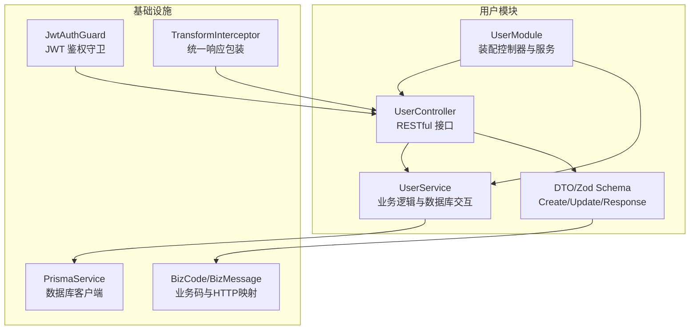
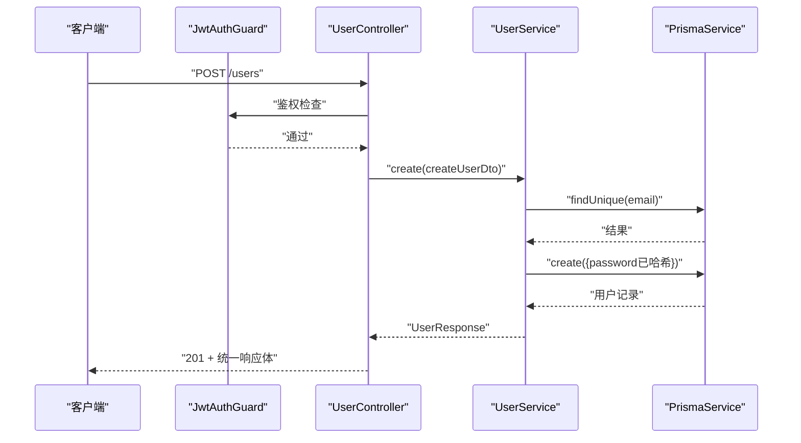
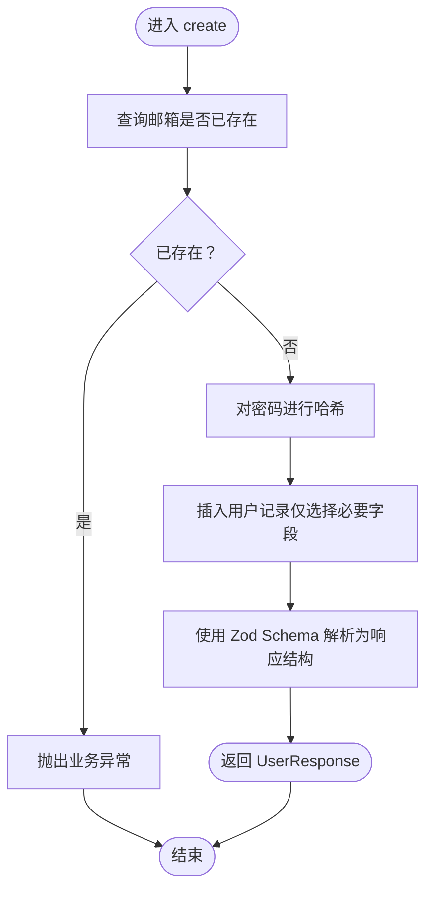
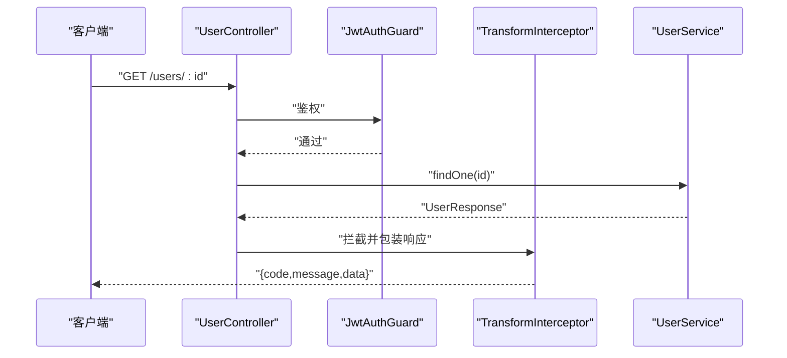
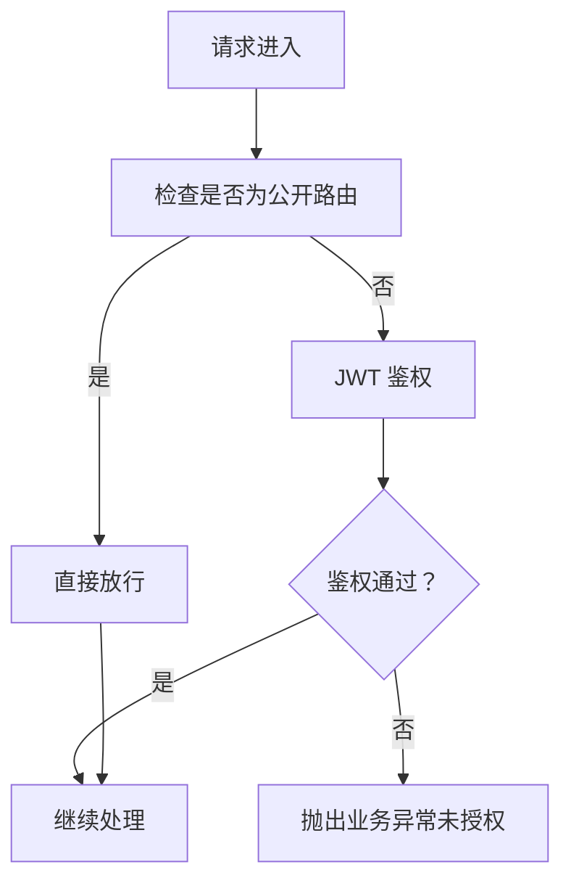
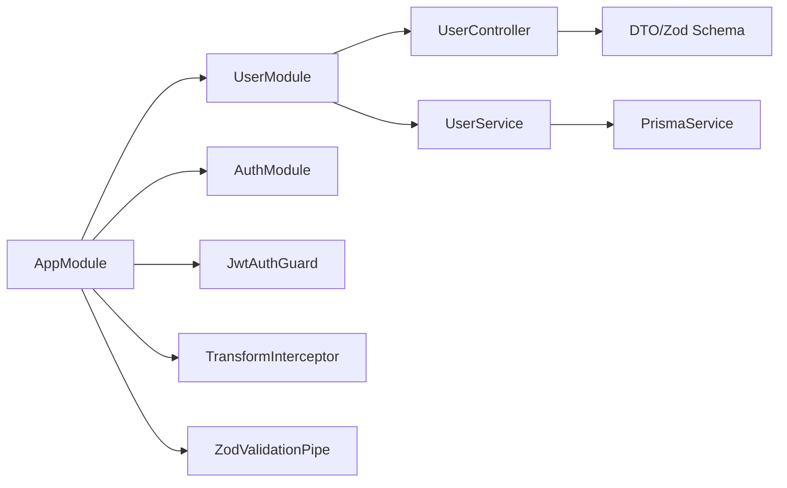

# 用户模块

<cite>
**本文引用的文件**
- [src/modules/user/user.module.ts](file://src/modules/user/user.module.ts)
- [src/modules/user/user.controller.ts](file://src/modules/user/user.controller.ts)
- [src/modules/user/user.service.ts](file://src/modules/user/user.service.ts)
- [src/modules/user/dto/user.dto.ts](file://src/modules/user/dto/user.dto.ts)
- [prisma/schema/User.prisma](file://prisma/schema/User.prisma)
- [src/common/schemas/user-fields.schema.ts](file://src/common/schemas/user-fields.schema.ts)
- [src/common/decorators/api-success-response.decorator.ts](file://src/common/decorators/api-success-response.decorator.ts)
- [src/common/enums/biz-code.enum.ts](file://src/common/enums/biz-code.enum.ts)
- [src/common/exceptions/business.exception.ts](file://src/common/exceptions/business.exception.ts)
- [src/common/guards/jwt-auth.guard.ts](file://src/common/guards/jwt-auth.guard.ts)
- [src/common/interceptors/transform.interceptor.ts](file://src/common/interceptors/transform.interceptor.ts)
- [src/common/decorators/public.decorator.ts](file://src/common/decorators/public.decorator.ts)
- [src/common/decorators/response-message.decorator.ts](file://src/common/decorators/response-message.decorator.ts)
- [src/prisma/prisma.service.ts](file://src/prisma/prisma.service.ts)
- [src/app.module.ts](file://src/app.module.ts)
- [src/modules/auth/auth.module.ts](file://src/modules/auth/auth.module.ts)
</cite>

## 目录
1. [简介](#简介)
2. [项目结构](#项目结构)
3. [核心组件](#核心组件)
4. [架构总览](#架构总览)
5. [详细组件分析](#详细组件分析)
6. [依赖关系分析](#依赖关系分析)
7. [性能考量](#性能考量)
8. [故障排查指南](#故障排查指南)
9. [结论](#结论)
10. [附录：接口文档与数据模型](#附录接口文档与数据模型)

## 简介
本文件为用户模块的完整技术文档，围绕 UserModule 的架构设计与业务逻辑展开，覆盖以下主题：
- 用户数据模型与 Prisma 定义
- CRUD 接口与业务规则
- UserService 服务层实现（查询、验证、业务处理、与数据库交互）
- UserController 控制器接口设计（RESTful API、Swagger 注解、响应包装）
- DTO 数据传输对象（Zod 校验、响应格式化、转换规则）
- 权限控制机制（JWT 鉴权、身份识别、访问控制）
- 完整接口文档、数据模型说明与错误处理策略

## 项目结构
用户模块位于 src/modules/user，采用典型的分层结构：
- user.module.ts：模块装配，导出 UserService
- user.controller.ts：RESTful 控制器，暴露用户管理接口
- user.service.ts：业务服务，封装用户相关逻辑与数据库交互
- dto/user.dto.ts：DTO 定义与 Zod Schema，统一输入/输出约束
- prisma/schema/User.prisma：数据库模型定义

图表来源
- [src/modules/user/user.module.ts:1-11](file://src/modules/user/user.module.ts#L1-L11)
- [src/modules/user/user.controller.ts:1-90](file://src/modules/user/user.controller.ts#L1-L90)
- [src/modules/user/user.service.ts:1-125](file://src/modules/user/user.service.ts#L1-L125)
- [src/modules/user/dto/user.dto.ts:1-32](file://src/modules/user/dto/user.dto.ts#L1-L32)
- [src/prisma/prisma.service.ts:1-44](file://src/prisma/prisma.service.ts#L1-L44)
- [src/common/guards/jwt-auth.guard.ts:1-46](file://src/common/guards/jwt-auth.guard.ts#L1-L46)
- [src/common/interceptors/transform.interceptor.ts:1-41](file://src/common/interceptors/transform.interceptor.ts#L1-L41)
- [src/common/enums/biz-code.enum.ts:1-171](file://src/common/enums/biz-code.enum.ts#L1-L171)

章节来源
- [src/modules/user/user.module.ts:1-11](file://src/modules/user/user.module.ts#L1-L11)
- [src/app.module.ts:1-61](file://src/app.module.ts#L1-L61)

## 核心组件
- UserModule：装配 UserController 与 UserService，并向外部导出 UserService，便于其他模块复用。
- UserController：提供创建、查询、更新、删除用户的标准 RESTful 接口；使用 Swagger 注解与统一响应装饰器。
- UserService：封装用户业务逻辑，包括邮箱唯一性校验、密码哈希、查询与更新、密码比对、账户查找等；通过 PrismaService 访问数据库。
- DTO 与 Zod Schema：CreateUserSchema、UpdateUserSchema、UserResponseSchema，确保输入输出一致性与可文档化。
- 数据模型：Prisma User 模型定义，包含唯一索引、布尔状态、时间戳与关联实体。

章节来源
- [src/modules/user/user.module.ts:1-11](file://src/modules/user/user.module.ts#L1-L11)
- [src/modules/user/user.controller.ts:1-90](file://src/modules/user/user.controller.ts#L1-L90)
- [src/modules/user/user.service.ts:1-125](file://src/modules/user/user.service.ts#L1-L125)
- [src/modules/user/dto/user.dto.ts:1-32](file://src/modules/user/dto/user.dto.ts#L1-L32)
- [prisma/schema/User.prisma:1-15](file://prisma/schema/User.prisma#L1-L15)

## 架构总览
用户模块遵循“控制器-服务-数据访问”的分层架构，配合全局守卫与拦截器实现统一鉴权与响应格式。

图表来源
- [src/modules/user/user.controller.ts:33-43](file://src/modules/user/user.controller.ts#L33-L43)
- [src/modules/user/user.service.ts:17-37](file://src/modules/user/user.service.ts#L17-L37)
- [src/common/guards/jwt-auth.guard.ts:23-44](file://src/common/guards/jwt-auth.guard.ts#L23-L44)
- [src/common/interceptors/transform.interceptor.ts:21-39](file://src/common/interceptors/transform.interceptor.ts#L21-L39)

## 详细组件分析

### 数据模型与字段约束
- Prisma 模型 User
  - 主键：字符串 UUID，默认生成
  - 唯一字段：email、username
  - 必填字段：password
  - 可选字段：name
  - 默认字段：isActive=true
  - 时间戳：createdAt 自动写入，updatedAt 自动更新
  - 关联：refreshTokens（刷新令牌）、roles（角色）

- 字段约束来源
  - 用户字段原子定义：邮箱、用户名、密码、显示名称的最小长度与格式约束
  - CreateUserSchema/UpdateUserSchema：基于原子字段组合，更新 Schema 对 password 进行排除

章节来源
- [prisma/schema/User.prisma:1-15](file://prisma/schema/User.prisma#L1-L15)
- [src/common/schemas/user-fields.schema.ts:8-22](file://src/common/schemas/user-fields.schema.ts#L8-L22)
- [src/modules/user/dto/user.dto.ts:6-25](file://src/modules/user/dto/user.dto.ts#L6-L25)

### DTO 设计与数据转换
- CreateUserDto：创建用户时的输入 DTO，包含 email、username、password、name
- UpdateUserDto：更新用户时的输入 DTO，允许部分字段更新且排除 password
- UserResponseDto：对外输出的用户响应 DTO，包含 id、email、username、name、isActive、createdAt、updatedAt
- 数据转换：服务层返回前使用 Zod Schema 解析与校验，保证输出结构一致

章节来源
- [src/modules/user/dto/user.dto.ts:1-32](file://src/modules/user/dto/user.dto.ts#L1-L32)

### 服务层实现（UserService）
- 创建用户
  - 校验邮箱唯一性，若已存在则抛出业务异常
  - 使用 bcrypt 对明文密码进行哈希
  - 仅选择必要字段返回，避免泄露敏感信息
- 查询用户
  - findAll：返回用户列表，逐条解析为响应结构
  - findOne：按 id 查询，不存在则抛出业务异常
  - findByEmail/findByUsername/findByAccount：多维度账户查找
- 更新与删除
  - update：先校验用户存在，再执行更新并返回解析后的响应
  - remove：先校验用户存在，再删除
- 密码校验
  - validatePassword：使用 bcrypt.compare 进行明文与哈希密码比对
- 数据访问
  - 通过 PrismaService 访问数据库，使用 select 精准投影字段

图表来源
- [src/modules/user/user.service.ts:17-37](file://src/modules/user/user.service.ts#L17-L37)

章节来源
- [src/modules/user/user.service.ts:1-125](file://src/modules/user/user.service.ts#L1-L125)
- [src/prisma/prisma.service.ts:1-44](file://src/prisma/prisma.service.ts#L1-L44)

### 控制器层实现（UserController）
- 接口清单
  - POST /users：创建用户（201）
  - GET /users：获取所有用户（200）
  - GET /users/:id：根据 ID 获取用户（200）
  - PATCH /users/:id：更新用户（200）
  - DELETE /users/:id：删除用户（200，无数据）
- 鉴权与文档
  - 使用 @ApiBearerAuth 与全局错误装饰器
  - 使用 @ApiSuccessResponse/@ApiSuccessNoDataResponse 统一响应结构
- 响应包装
  - 通过 TransformInterceptor 将业务返回值包装为统一响应体（code/message/data）

图表来源
- [src/modules/user/user.controller.ts:55-63](file://src/modules/user/user.controller.ts#L55-L63)
- [src/common/guards/jwt-auth.guard.ts:23-44](file://src/common/guards/jwt-auth.guard.ts#L23-L44)
- [src/common/interceptors/transform.interceptor.ts:21-39](file://src/common/interceptors/transform.interceptor.ts#L21-L39)

章节来源
- [src/modules/user/user.controller.ts:1-90](file://src/modules/user/user.controller.ts#L1-L90)
- [src/common/decorators/api-success-response.decorator.ts:90-130](file://src/common/decorators/api-success-response.decorator.ts#L90-L130)
- [src/common/interceptors/transform.interceptor.ts:1-41](file://src/common/interceptors/transform.interceptor.ts#L1-L41)

### 权限控制机制
- 全局守卫
  - JwtAuthGuard：继承 Passport 的 AuthGuard('jwt')，结合 Reflector 实现“非公开路由”豁免
  - 未通过鉴权时抛出业务异常（UNAUTHORIZED）
- 公开路由
  - 使用 @Public 装饰器标注，跳过 JwtAuthGuard
- 响应消息
  - 使用 @ResponseMessage 设置接口成功消息，由拦截器读取并写入统一响应体

图表来源
- [src/common/guards/jwt-auth.guard.ts:23-44](file://src/common/guards/jwt-auth.guard.ts#L23-L44)
- [src/common/decorators/public.decorator.ts:1-5](file://src/common/decorators/public.decorator.ts#L1-L5)
- [src/common/exceptions/business.exception.ts:16-41](file://src/common/exceptions/business.exception.ts#L16-L41)

章节来源
- [src/common/guards/jwt-auth.guard.ts:1-46](file://src/common/guards/jwt-auth.guard.ts#L1-L46)
- [src/common/decorators/public.decorator.ts:1-5](file://src/common/decorators/public.decorator.ts#L1-L5)
- [src/common/decorators/response-message.decorator.ts:1-6](file://src/common/decorators/response-message.decorator.ts#L1-L6)
- [src/common/exceptions/business.exception.ts:1-42](file://src/common/exceptions/business.exception.ts#L1-L42)

## 依赖关系分析
- 模块依赖
  - AppModule 导入 UserModule，并注册全局守卫、拦截器、管道与过滤器
  - AuthModule 依赖 UserModule 以使用用户模型与服务
- 控制器依赖
  - UserController 依赖 UserService
  - UserService 依赖 PrismaService
- 全局配置
  - ZodValidationPipe：自动对 DTO 进行校验
  - TransformInterceptor：统一响应包装
  - HttpExceptionFilter：统一错误响应（与业务异常配合）

图表来源
- [src/app.module.ts:18-60](file://src/app.module.ts#L18-L60)
- [src/modules/auth/auth.module.ts:11-33](file://src/modules/auth/auth.module.ts#L11-L33)
- [src/modules/user/user.module.ts:1-11](file://src/modules/user/user.module.ts#L1-L11)

章节来源
- [src/app.module.ts:1-61](file://src/app.module.ts#L1-L61)
- [src/modules/auth/auth.module.ts:1-34](file://src/modules/auth/auth.module.ts#L1-L34)

## 性能考量
- 查询投影：服务层通过 select 精准投影字段，减少不必要的列传输与序列化开销
- 哈希成本：密码哈希使用固定强度，建议在高并发场景评估 bcrypt 的 CPU 开销
- 缓存策略：可结合 CacheModule 对热点用户查询结果进行缓存（需在服务层扩展）
- 分页与限制：列表查询建议引入分页与数量限制，防止一次性返回过多数据

## 故障排查指南
- 常见业务异常
  - 用户不存在：USER_NOT_FOUND（404）
  - 邮箱已存在：USER_EMAIL_EXISTS（409）
- 异常抛出与映射
  - BusinessException：统一携带业务码、消息与 HTTP 状态码映射
  - 业务码到 HTTP 状态码映射：BizCode → getHttpStatus
- 验证异常
  - 输入 DTO 不符合 Zod Schema：由 ZodValidationPipe 抛出 400
- 鉴权异常
  - 未携带或无效 JWT：JwtAuthGuard 抛出 UNAUTHORIZED（401）

章节来源
- [src/common/enums/biz-code.enum.ts:47-52](file://src/common/enums/biz-code.enum.ts#L47-L52)
- [src/common/exceptions/business.exception.ts:16-41](file://src/common/exceptions/business.exception.ts#L16-L41)
- [src/common/guards/jwt-auth.guard.ts:40-44](file://src/common/guards/jwt-auth.guard.ts#L40-L44)

## 结论
用户模块通过清晰的分层设计、严格的输入输出约束与统一的鉴权与响应机制，提供了稳定可靠的用户管理能力。建议在后续迭代中补充头像上传、角色权限细化、以及缓存与分页优化，以进一步提升可用性与性能。

## 附录：接口文档与数据模型

### 接口一览（RESTful）
- 创建用户
  - 方法：POST
  - 路径：/users
  - 鉴权：需要
  - 请求体：CreateUserDto
  - 响应：201 + 统一响应体（data 为单个用户）
- 获取所有用户
  - 方法：GET
  - 路径：/users
  - 鉴权：需要
  - 响应：200 + 统一响应体（data 为用户数组）
- 获取单个用户
  - 方法：GET
  - 路径：/users/:id
  - 鉴权：需要
  - 响应：200 + 统一响应体（data 为单个用户）
- 更新用户
  - 方法：PATCH
  - 路径：/users/:id
  - 鉴权：需要
  - 请求体：UpdateUserDto（password 不可更新）
  - 响应：200 + 统一响应体（data 为更新后的用户）
- 删除用户
  - 方法：DELETE
  - 路径：/users/:id
  - 鉴权：需要
  - 响应：200 + 统一响应体（data 为 null）

章节来源
- [src/modules/user/user.controller.ts:33-88](file://src/modules/user/user.controller.ts#L33-L88)

### 数据模型与字段说明
- User 模型（Prisma）
  - id：字符串，主键（UUID）
  - email：字符串，唯一
  - username：字符串，唯一
  - password：字符串
  - name：字符串（可空）
  - isActive：布尔，默认 true
  - createdAt/updatedAt：时间戳

章节来源
- [prisma/schema/User.prisma:1-15](file://prisma/schema/User.prisma#L1-L15)

### DTO 字段定义
- CreateUserDto
  - email：邮箱格式，必填
  - username：最少 3 个字符，必填
  - password：最少 6 个字符，必填
  - name：可选
- UpdateUserDto
  - email/username/name：可选（部分更新）
  - password：不允许更新
- UserResponseDto
  - id、email、username、name、isActive、createdAt、updatedAt

章节来源
- [src/common/schemas/user-fields.schema.ts:8-22](file://src/common/schemas/user-fields.schema.ts#L8-L22)
- [src/modules/user/dto/user.dto.ts:6-29](file://src/modules/user/dto/user.dto.ts#L6-L29)

### 统一响应与错误处理
- 统一响应体结构
  - code：业务状态码（0 表示成功）
  - message：响应消息
  - data：实际数据（可能为 null）
- 业务码与 HTTP 映射
  - USER_NOT_FOUND → 404
  - USER_EMAIL_EXISTS → 409
  - UNAUTHORIZED → 401
- 验证错误
  - ZodValidationPipe 将不符合 Schema 的请求转为 400

章节来源
- [src/common/interceptors/transform.interceptor.ts:21-39](file://src/common/interceptors/transform.interceptor.ts#L21-L39)
- [src/common/enums/biz-code.enum.ts:127-169](file://src/common/enums/biz-code.enum.ts#L127-L169)
- [src/common/exceptions/business.exception.ts:16-41](file://src/common/exceptions/business.exception.ts#L16-L41)