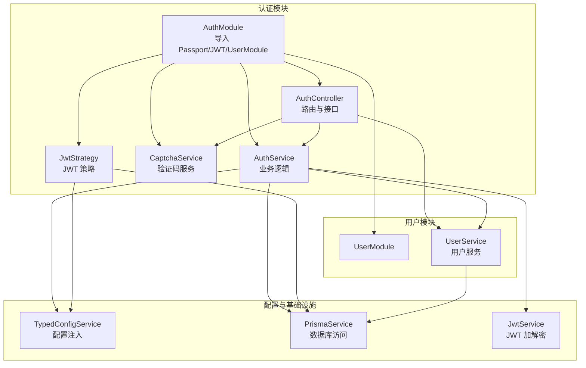
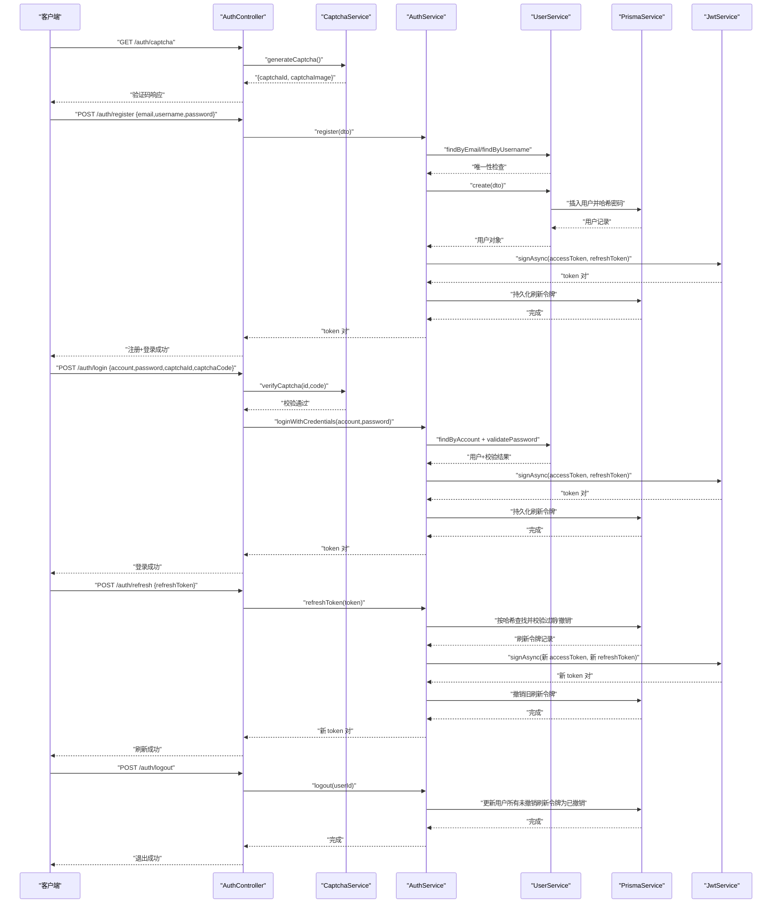
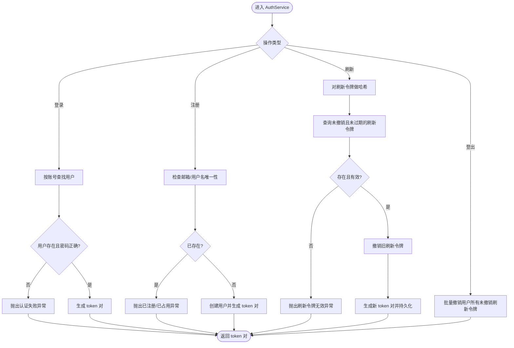
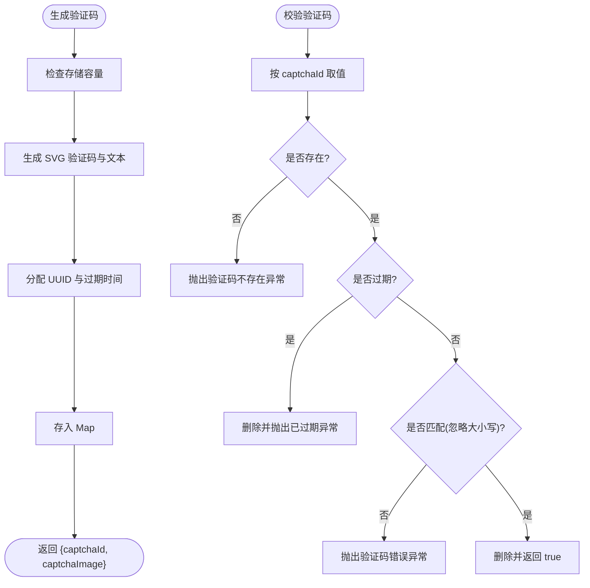
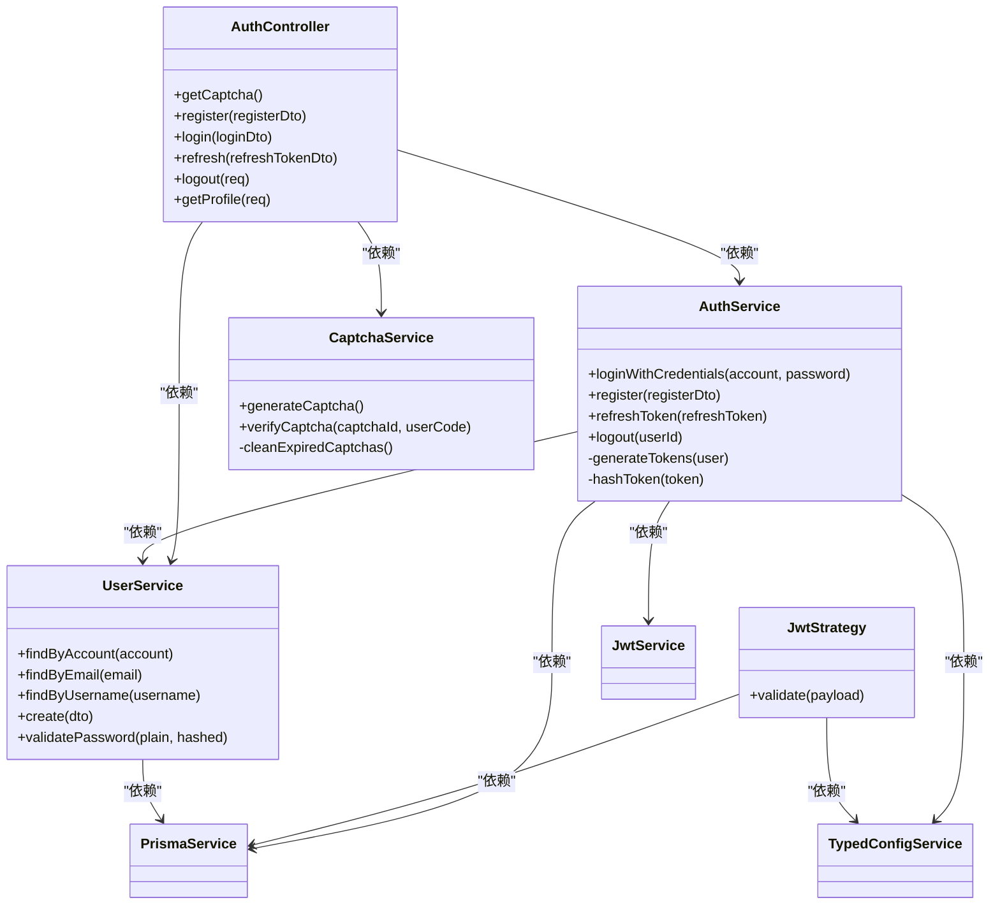

# 认证模块

<cite>
**本文引用的文件**
- [src/modules/auth/auth.module.ts](file://src/modules/auth/auth.module.ts)
- [src/modules/auth/auth.service.ts](file://src/modules/auth/auth.service.ts)
- [src/modules/auth/auth.controller.ts](file://src/modules/auth/auth.controller.ts)
- [src/modules/auth/captcha.service.ts](file://src/modules/auth/captcha.service.ts)
- [src/modules/auth/strategies/jwt.strategy.ts](file://src/modules/auth/strategies/jwt.strategy.ts)
- [src/modules/auth/dto/auth.dto.ts](file://src/modules/auth/dto/auth.dto.ts)
- [src/common/interfaces/jwt.interface.ts](file://src/common/interfaces/jwt.interface.ts)
- [src/common/interfaces/user.interface.ts](file://src/common/interfaces/user.interface.ts)
- [src/common/enums/biz-code.enum.ts](file://src/common/enums/biz-code.enum.ts)
- [src/config/schemas/jwt.schema.ts](file://src/config/schemas/jwt.schema.ts)
- [src/modules/user/user.service.ts](file://src/modules/user/user.service.ts)
- [src/modules/user/user.module.ts](file://src/modules/user/user.module.ts)
- [src/common/guards/jwt-auth.guard.ts](file://src/common/guards/jwt-auth.guard.ts)
- [prisma/schema/User.prisma](file://prisma/schema/User.prisma)
- [prisma/schema/RefreshToken.prisma](file://prisma/schema/RefreshToken.prisma)
</cite>

## 目录
1. [简介](#简介)
2. [项目结构](#项目结构)
3. [核心组件](#核心组件)
4. [架构总览](#架构总览)
5. [详细组件分析](#详细组件分析)
6. [依赖关系分析](#依赖关系分析)
7. [性能考量](#性能考量)
8. [故障排查指南](#故障排查指南)
9. [结论](#结论)
10. [附录：API 接口文档](#附录api-接口文档)

## 简介
本文件为认证模块的深度技术文档，围绕以下目标展开：整体架构设计（JWT 认证机制、Passport 策略、验证码服务、用户模块依赖）、AuthService 的核心业务逻辑（登录验证、密码加密、JWT 生成与刷新）、AuthController 的接口设计与路由映射、JwtStrategy 的认证策略、CaptchaService 的图形验证码能力，以及完整的 API 文档、错误处理与安全注意事项。

## 项目结构
认证模块位于 src/modules/auth，主要由以下部分组成：
- 模块装配：AuthModule 负责导入 Passport、JWT、UserModule，并导出 AuthService
- 控制器：AuthController 提供验证码、注册、登录、刷新、登出、获取个人资料等接口
- 服务层：
  - AuthService：负责登录、注册、令牌生成与刷新、登出
  - CaptchaService：生成与校验图形验证码
- 策略：JwtStrategy 基于 passport-jwt 实现 JWT 校验与用户身份解析
- DTO 与类型：统一的输入输出校验与类型定义
- 配置：JWT 秘钥、过期时间等通过配置服务注入
- 数据模型：Prisma 中的 User 与 RefreshToken 模型支撑持久化

图表来源
- [src/modules/auth/auth.module.ts:11-32](file://src/modules/auth/auth.module.ts#L11-L32)
- [src/modules/auth/auth.controller.ts:36-130](file://src/modules/auth/auth.controller.ts#L36-L130)
- [src/modules/auth/auth.service.ts:14-21](file://src/modules/auth/auth.service.ts#L14-L21)
- [src/modules/auth/captcha.service.ts:20-25](file://src/modules/auth/captcha.service.ts#L20-L25)
- [src/modules/auth/strategies/jwt.strategy.ts:9-20](file://src/modules/auth/strategies/jwt.strategy.ts#L9-L20)
- [src/modules/user/user.module.ts:5-10](file://src/modules/user/user.module.ts#L5-L10)

章节来源
- [src/modules/auth/auth.module.ts:1-34](file://src/modules/auth/auth.module.ts#L1-L34)
- [src/modules/auth/auth.controller.ts:1-131](file://src/modules/auth/auth.controller.ts#L1-L131)
- [src/modules/auth/auth.service.ts:1-164](file://src/modules/auth/auth.service.ts#L1-L164)
- [src/modules/auth/captcha.service.ts:1-98](file://src/modules/auth/captcha.service.ts#L1-L98)
- [src/modules/auth/strategies/jwt.strategy.ts:1-49](file://src/modules/auth/strategies/jwt.strategy.ts#L1-L49)
- [src/modules/user/user.module.ts:1-11](file://src/modules/user/user.module.ts#L1-L11)

## 核心组件
- AuthModule：装配 Passport、JWT、UserModule；通过异步工厂注入配置，注册 JwtModule 并导出 AuthService
- AuthController：提供验证码、注册、登录、刷新、登出、获取个人资料等接口，使用 Swagger 注解与节流保护
- AuthService：实现登录凭据校验、注册、令牌生成与刷新、登出撤销；使用 Prisma 持久化刷新令牌
- CaptchaService：生成 SVG 图形验证码，内存 Map 存储并定时清理过期项
- JwtStrategy：从 Authorization 头提取 Bearer 令牌，校验并解析用户角色信息
- UserService：提供用户查询、密码哈希与校验、注册创建等基础能力
- 配置与类型：JWT 配置校验、业务码枚举、JWT/Payload/User 接口

章节来源
- [src/modules/auth/auth.module.ts:11-32](file://src/modules/auth/auth.module.ts#L11-L32)
- [src/modules/auth/auth.controller.ts:36-130](file://src/modules/auth/auth.controller.ts#L36-L130)
- [src/modules/auth/auth.service.ts:14-164](file://src/modules/auth/auth.service.ts#L14-L164)
- [src/modules/auth/captcha.service.ts:20-98](file://src/modules/auth/captcha.service.ts#L20-L98)
- [src/modules/auth/strategies/jwt.strategy.ts:9-49](file://src/modules/auth/strategies/jwt.strategy.ts#L9-L49)
- [src/modules/user/user.service.ts:13-125](file://src/modules/user/user.service.ts#L13-L125)
- [src/common/enums/biz-code.enum.ts:31-46](file://src/common/enums/biz-code.enum.ts#L31-L46)
- [src/config/schemas/jwt.schema.ts:3-8](file://src/config/schemas/jwt.schema.ts#L3-L8)

## 架构总览
认证模块采用“控制器-服务-策略-用户模块-配置”的分层架构，结合 Prisma 实现用户与刷新令牌的持久化。JWT 作为无状态认证载体，配合刷新令牌实现安全的会话管理。

图表来源
- [src/modules/auth/auth.controller.ts:46-116](file://src/modules/auth/auth.controller.ts#L46-L116)
- [src/modules/auth/auth.service.ts:29-110](file://src/modules/auth/auth.service.ts#L29-L110)
- [src/modules/auth/captcha.service.ts:41-87](file://src/modules/auth/captcha.service.ts#L41-L87)
- [src/modules/user/user.service.ts:17-37](file://src/modules/user/user.service.ts#L17-L37)

## 详细组件分析

### AuthModule 模块装配
- 导入 PassportModule、JwtModule（异步工厂注入配置）、UserModule
- 注册 JwtModule 的 secret 与签发选项，从配置服务读取
- 导出 AuthService 供其他模块使用

章节来源
- [src/modules/auth/auth.module.ts:11-32](file://src/modules/auth/auth.module.ts#L11-L32)
- [src/config/schemas/jwt.schema.ts:3-8](file://src/config/schemas/jwt.schema.ts#L3-L8)

### AuthController 接口设计与路由映射
- 获取验证码：GET /auth/captcha，节流限制，返回 captchaId 与 SVG 图片
- 用户注册：POST /auth/register，创建用户并返回 token 对
- 用户登录：POST /auth/login，先校验验证码，再进行凭据校验，返回 token 对
- 刷新令牌：POST /auth/refresh，使用刷新令牌换取新 token 对
- 退出登录：POST /auth/logout，基于 JWT 认证，撤销该用户所有未撤销刷新令牌
- 获取个人资料：GET /auth/profile，返回用户基本信息

章节来源
- [src/modules/auth/auth.controller.ts:36-130](file://src/modules/auth/auth.controller.ts#L36-L130)

### AuthService 核心业务逻辑
- 登录凭据校验：根据账号（邮箱或用户名）查找用户，校验密码，剔除敏感字段后生成 token 对
- 注册：邮箱与用户名唯一性检查，创建用户并生成 token 对
- 刷新令牌：对传入刷新令牌做 SHA-256 哈希存储，查询未撤销且未过期的记录，撤销旧令牌并发放新 token 对
- 退出登录：批量撤销指定用户的所有未撤销刷新令牌
- 令牌生成：分别使用不同秘钥与过期时间签发访问与刷新令牌，持久化刷新令牌并计算过期时间

图表来源
- [src/modules/auth/auth.service.ts:29-110](file://src/modules/auth/auth.service.ts#L29-L110)

章节来源
- [src/modules/auth/auth.service.ts:14-164](file://src/modules/auth/auth.service.ts#L14-L164)

### JwtStrategy 认证策略
- 从 Authorization 头提取 Bearer 令牌
- 使用配置中的 secret 校验签名并解析 payload
- 查询用户角色信息并返回 UserPayload；若用户不存在则返回空角色列表

章节来源
- [src/modules/auth/strategies/jwt.strategy.ts:9-49](file://src/modules/auth/strategies/jwt.strategy.ts#L9-L49)
- [src/common/interfaces/user.interface.ts:6-9](file://src/common/interfaces/user.interface.ts#L6-L9)

### CaptchaService 图形验证码
- 生成：使用 svg-captcha 生成 4 位验证码，设置尺寸、噪声、颜色与背景，分配 UUID 作为 captchaId，5 分钟过期
- 存储：内存 Map 存储 {code, expiresAt}，最大容量 10000，定时每分钟清理过期项
- 校验：按 captchaId 取值，检查是否存在、是否过期、是否匹配，匹配成功即删除并返回 true
- 生产注意：多实例部署需替换为共享缓存（如 Redis）

图表来源
- [src/modules/auth/captcha.service.ts:41-87](file://src/modules/auth/captcha.service.ts#L41-L87)

章节来源
- [src/modules/auth/captcha.service.ts:20-98](file://src/modules/auth/captcha.service.ts#L20-L98)

### 用户模块依赖关系
- UserModule 导出 UserService，供 AuthModule 注入
- UserService 提供用户查询、密码哈希与校验、注册创建等
- AuthService 在注册与登录中调用 UserService 完成业务校验与持久化

章节来源
- [src/modules/user/user.module.ts:5-10](file://src/modules/user/user.module.ts#L5-L10)
- [src/modules/user/user.service.ts:13-125](file://src/modules/user/user.service.ts#L13-L125)
- [src/modules/auth/auth.service.ts:33-42](file://src/modules/auth/auth.service.ts#L33-L42)

## 依赖关系分析
- 组件耦合
  - AuthController 依赖 AuthService、CaptchaService、UserService
  - AuthService 依赖 UserService、PrismaService、JwtService、TypedConfigService
  - JwtStrategy 依赖 PrismaService、TypedConfigService
  - CaptchaService 为独立服务，依赖内存 Map 与定时器
- 外部依赖
  - passport-jwt、svg-captcha、bcryptjs、jsonwebtoken（通过 @nestjs/jwt）
- 数据模型
  - User 与 RefreshToken 关联，支持按用户索引与级联删除

图表来源
- [src/modules/auth/auth.controller.ts:36-130](file://src/modules/auth/auth.controller.ts#L36-L130)
- [src/modules/auth/auth.service.ts:14-21](file://src/modules/auth/auth.service.ts#L14-L21)
- [src/modules/auth/captcha.service.ts:20-25](file://src/modules/auth/captcha.service.ts#L20-L25)
- [src/modules/auth/strategies/jwt.strategy.ts:9-19](file://src/modules/auth/strategies/jwt.strategy.ts#L9-L19)
- [src/modules/user/user.service.ts:13-15](file://src/modules/user/user.service.ts#L13-L15)

章节来源
- [src/modules/auth/auth.controller.ts:36-130](file://src/modules/auth/auth.controller.ts#L36-L130)
- [src/modules/auth/auth.service.ts:14-21](file://src/modules/auth/auth.service.ts#L14-L21)
- [src/modules/auth/captcha.service.ts:20-25](file://src/modules/auth/captcha.service.ts#L20-L25)
- [src/modules/auth/strategies/jwt.strategy.ts:9-19](file://src/modules/auth/strategies/jwt.strategy.ts#L9-L19)
- [src/modules/user/user.service.ts:13-15](file://src/modules/user/user.service.ts#L13-L15)

## 性能考量
- 验证码存储：内存 Map 在高并发场景可能成为瓶颈，建议替换为 Redis 等共享缓存，避免多实例间不可见
- 刷新令牌持久化：每次登录都会写入一条刷新令牌记录，建议定期清理过期与已撤销记录，控制表规模
- 密码哈希：bcrypt 默认成本 10，兼顾安全性与性能；可根据硬件能力调整
- 令牌签发：访问与刷新令牌异步签发，减少串行等待
- 节流保护：登录与注册接口设置了节流，防止暴力破解与刷量

## 故障排查指南
- 业务异常码定位
  - 凭证无效、邮箱已注册、用户名被占用、刷新令牌无效、验证码不存在/过期/错误等
- 常见问题与处理
  - 登录失败：确认账号是否存在、密码是否正确、验证码是否匹配且未过期
  - 刷新失败：确认刷新令牌是否有效、是否已撤销、是否过期
  - 验证码异常：确认 captchaId 是否正确传递、是否在有效期内、是否区分大小写
  - 登出无效：确认当前会话使用的是否为旧刷新令牌，登出后需重新登录或使用刷新令牌获取新访问令牌
- 错误码与 HTTP 状态映射参考
  - 认证模块错误码对应 HTTP 状态码，便于前端统一处理

章节来源
- [src/common/enums/biz-code.enum.ts:31-46](file://src/common/enums/biz-code.enum.ts#L31-L46)
- [src/common/enums/biz-code.enum.ts:127-145](file://src/common/enums/biz-code.enum.ts#L127-L145)

## 结论
认证模块通过 JWT 与刷新令牌实现了安全、可扩展的无状态认证方案，结合验证码与节流策略提升了抗攻击能力。模块边界清晰、职责分离，易于维护与扩展。生产部署建议替换验证码存储为共享缓存，并完善权限守卫与审计日志。

## 附录：API 接口文档

- 获取验证码
  - 方法：GET
  - 路径：/auth/captcha
  - 节流：10 次/分钟
  - 响应：{ captchaId, captchaImage(SVG) }

- 用户注册
  - 方法：POST
  - 路径：/auth/register
  - 状态码：201
  - 请求体：{ email, username, password, name }
  - 响应：{ accessToken, refreshToken }

- 用户登录
  - 方法：POST
  - 路径：/auth/login
  - 节流：5 次/分钟
  - 请求体：{ account, password, captchaId, captchaCode }
  - 响应：{ accessToken, refreshToken }

- 刷新访问令牌
  - 方法：POST
  - 路径：/auth/refresh
  - 请求体：{ refreshToken }
  - 响应：{ accessToken, refreshToken }

- 退出登录
  - 方法：POST
  - 路径：/auth/logout
  - 鉴权：Bearer Token
  - 响应：无内容（200）

- 获取个人资料
  - 方法：GET
  - 路径：/auth/profile
  - 鉴权：Bearer Token
  - 响应：用户信息（不含密码）

章节来源
- [src/modules/auth/auth.controller.ts:46-130](file://src/modules/auth/auth.controller.ts#L46-L130)
- [src/modules/auth/dto/auth.dto.ts:29-77](file://src/modules/auth/dto/auth.dto.ts#L29-L77)