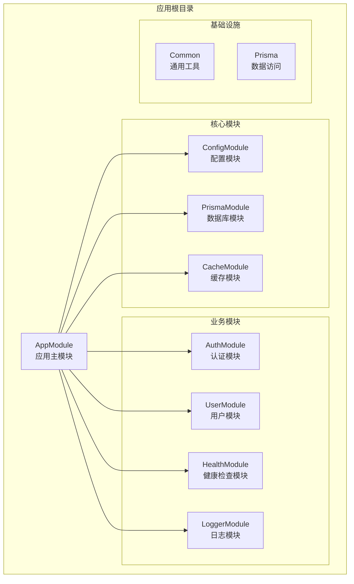
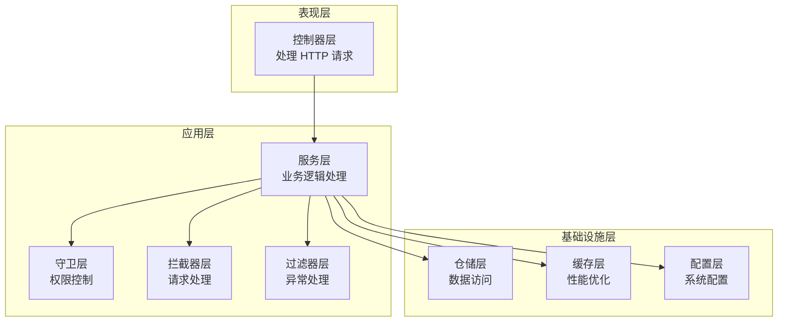
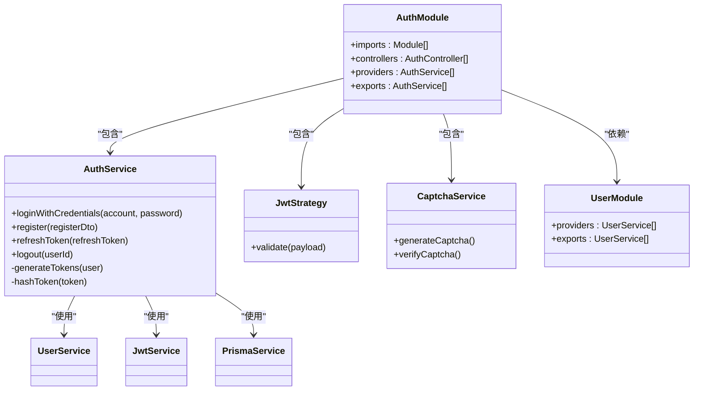
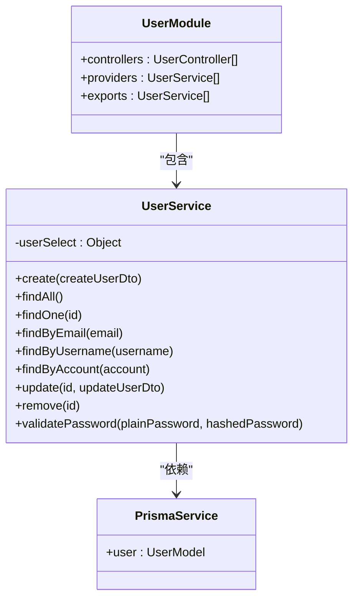
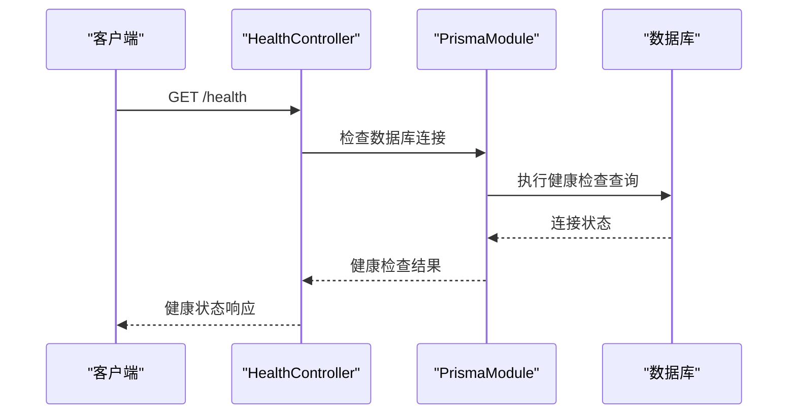
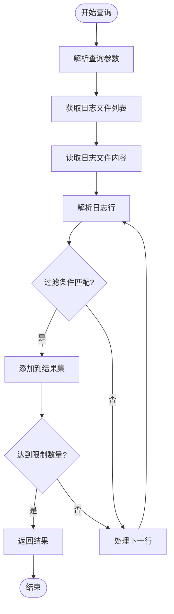
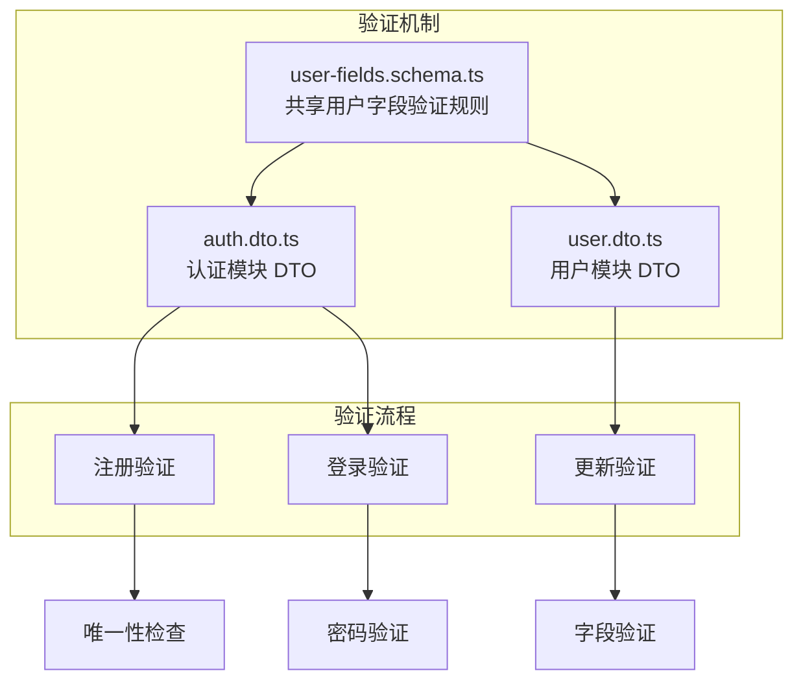
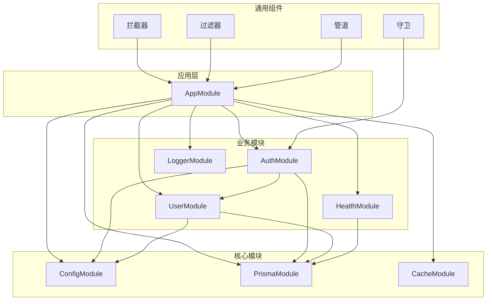
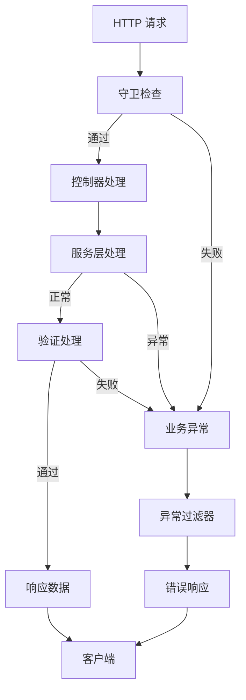

# 模块化系统设计

<cite>
**本文档引用的文件**
- [app.module.ts](file://src/app.module.ts)
- [main.ts](file://src/main.ts)
- [auth.module.ts](file://src/modules/auth/auth.module.ts)
- [user.module.ts](file://src/modules/user/user.module.ts)
- [health.module.ts](file://src/modules/health/health.module.ts)
- [logger.module.ts](file://src/modules/logger/logger.module.ts)
- [cache.module.ts](file://src/modules/cache/cache.module.ts)
- [prisma.module.ts](file://src/prisma/prisma.module.ts)
- [config.module.ts](file://src/config/config.module.ts)
- [jwt-auth.guard.ts](file://src/common/guards/jwt-auth.guard.ts)
- [logging.interceptor.ts](file://src/common/interceptors/logging.interceptor.ts)
- [http-exception.filter.ts](file://src/common/filters/http-exception.filter.ts)
- [auth.service.ts](file://src/modules/auth/auth.service.ts)
- [user.service.ts](file://src/modules/user/user.service.ts)
- [jwt.strategy.ts](file://src/modules/auth/strategies/jwt.strategy.ts)
- [log-query.service.ts](file://src/modules/logger/log-query.service.ts)
- [typed-config.service.ts](file://src/config/typed-config.service.ts)
- [biz-code.enum.ts](file://src/common/enums/biz-code.enum.ts)
- [user.interface.ts](file://src/common/interfaces/user.interface.ts)
- [jwt.interface.ts](file://src/common/interfaces/jwt.interface.ts)
- [user-fields.schema.ts](file://src/common/schemas/user-fields.schema.ts)
- [auth.controller.ts](file://src/modules/auth/auth.controller.ts)
- [auth.dto.ts](file://src/modules/auth/dto/auth.dto.ts)
- [user.dto.ts](file://src/modules/user/dto/user.dto.ts)
</cite>

## 目录
1. [引言](#引言)
2. [项目结构](#项目结构)
3. [核心组件](#核心组件)
4. [架构概览](#架构概览)
5. [详细组件分析](#详细组件分析)
6. [依赖分析](#依赖分析)
7. [性能考虑](#性能考虑)
8. [故障排除指南](#故障排除指南)
9. [结论](#结论)

## 引言

本项目采用 NestJS 模块化架构设计，通过功能域划分实现高内聚、低耦合的系统结构。模块化设计的核心原则包括：单一职责、依赖倒置、可测试性、可扩展性和可维护性。

系统采用分层架构模式，将业务逻辑按功能模块进行组织，每个模块都有明确的职责边界和清晰的接口定义。通过依赖注入机制实现模块间的松耦合，支持懒加载和循环依赖的避免策略。

**更新** 本次架构重构引入了共享用户字段验证机制，将用户注册验证逻辑从用户服务迁移到认证服务，增强了系统的验证一致性和可维护性。

## 项目结构

项目采用基于功能域的模块化组织方式，主要目录结构如下：

**图表来源**
- [app.module.ts:18-32](file://src/app.module.ts#L18-L32)
- [config.module.ts:6-18](file://src/config/config.module.ts#L6-L18)
- [prisma.module.ts:4-8](file://src/prisma/prisma.module.ts#L4-L8)

**章节来源**
- [app.module.ts:1-61](file://src/app.module.ts#L1-L61)
- [main.ts:8-36](file://src/main.ts#L8-L36)

## 核心组件

### 应用主模块 (AppModule)

AppModule 是整个应用的根模块，负责协调所有子模块的导入和全局配置。其设计体现了以下原则：

**导入模块顺序**：
1. 配置模块 (ConfigModule) - 提供全局配置服务
2. 缓存模块 (CacheModule) - 提供缓存服务
3. 数据库模块 (PrismaModule) - 提供数据访问层
4. 认证模块 (AuthModule) - 提供身份验证功能
5. 用户模块 (UserModule) - 提供用户管理功能
6. 健康检查模块 (HealthModule) - 提供系统监控
7. 日志模块 (LoggerModule) - 提供日志记录功能

**全局提供者配置**：
- 守卫 (Guards)：JWT 认证守卫、限流守卫
- 拦截器 (Interceptors)：日志拦截器、数据转换拦截器
- 管道 (Pipes)：Zod 验证管道
- 过滤器 (Filters)：HTTP 异常过滤器

**章节来源**
- [app.module.ts:18-58](file://src/app.module.ts#L18-L58)

### 配置模块 (ConfigModule)

配置模块采用全局注册模式，提供类型安全的配置访问服务：

**特性**：
- 全局可用性：通过 `@Global()` 装饰器实现
- 类型安全：TypedConfigService 提供编译时类型检查
- 命名空间访问：支持 `namespace()` 方法获取配置对象
- 点语法访问：支持 `get()` 方法的路径访问

**章节来源**
- [config.module.ts:6-18](file://src/config/config.module.ts#L6-L18)
- [typed-config.service.ts:23-46](file://src/config/typed-config.service.ts#L23-L46)

## 架构概览

系统采用分层模块化架构，各层职责清晰分离：

**图表来源**
- [app.module.ts:33-58](file://src/app.module.ts#L33-L58)
- [auth.module.ts:11-32](file://src/modules/auth/auth.module.ts#L11-L32)

## 详细组件分析

### 认证模块 (AuthModule)

AuthModule 是系统的核心业务模块，负责用户身份验证和授权管理：

**图表来源**
- [auth.module.ts:11-32](file://src/modules/auth/auth.module.ts#L11-L32)
- [auth.service.ts:14-21](file://src/modules/auth/auth.service.ts#L14-L21)
- [jwt.strategy.ts:9-20](file://src/modules/auth/strategies/jwt.strategy.ts#L9-L20)

**模块职责**：
- 用户认证：登录、注册、令牌刷新
- 权限验证：JWT 令牌验证和用户信息提取
- 会话管理：刷新令牌存储和撤销
- 验证码服务：图形验证码生成和验证

**依赖关系**：
- 依赖 UserModule 获取用户信息
- 依赖 PrismaModule 进行数据持久化
- 依赖 JwtModule 处理令牌相关操作

**更新** 用户注册验证逻辑已迁移到认证服务，通过共享的用户字段验证机制确保验证规则的一致性。

**章节来源**
- [auth.module.ts:11-34](file://src/modules/auth/auth.module.ts#L11-L34)
- [auth.service.ts:29-161](file://src/modules/auth/auth.service.ts#L29-L161)

### 用户模块 (UserModule)

UserModule 专注于用户数据管理和业务逻辑：

**图表来源**
- [user.module.ts:5-9](file://src/modules/user/user.module.ts#L5-L9)
- [user.service.ts:13-15](file://src/modules/user/user.service.ts#L13-L15)

**核心功能**：
- 用户 CRUD 操作
- 密码加密和验证
- 用户查询（邮箱、用户名、账号）
- 数据验证和业务规则

**安全特性**：
- 密码使用 bcrypt 加密存储
- 输入数据验证
- 业务异常处理

**更新** 用户服务现在专注于数据访问和业务逻辑，不再承担注册验证的职责，验证规则通过共享的用户字段验证机制统一管理。

**章节来源**
- [user.module.ts:5-11](file://src/modules/user/user.module.ts#L5-L11)
- [user.service.ts:17-125](file://src/modules/user/user.service.ts#L17-L125)

### 健康检查模块 (HealthModule)

HealthModule 提供系统健康状态监控：

**图表来源**
- [health.module.ts:5-8](file://src/modules/health/health.module.ts#L5-L8)

**模块特点**：
- 简洁的健康检查接口
- 依赖 PrismaModule 进行数据库连接验证
- 无状态设计，适合容器化部署

**章节来源**
- [health.module.ts:1-10](file://src/modules/health/health.module.ts#L1-L10)

### 日志模块 (LoggerModule)

LoggerModule 提供日志查询和管理系统：

**图表来源**
- [log-query.service.ts:31-90](file://src/modules/logger/log-query.service.ts#L31-L90)

**功能特性**：
- 多维度日志查询（级别、关键词、时间范围、模块）
- 实时日志查看
- 错误日志专门查询
- 文件格式解析

**章节来源**
- [logger.module.ts:4-7](file://src/modules/logger/logger.module.ts#L4-L7)
- [log-query.service.ts:24-129](file://src/modules/logger/log-query.service.ts#L24-L129)

### 缓存模块 (CacheModule)

缓存模块提供高性能的数据缓存能力：

**配置特性**：
- TTL (Time To Live)：30秒
- 最大缓存项：1000个
- 全局可用性：通过 `exports` 导出

**应用场景**：
- 频繁访问的数据缓存
- API 响应缓存
- 会话数据存储

**章节来源**
- [cache.module.ts:4-12](file://src/modules/cache/cache.module.ts#L4-L12)

### 共享验证机制

**新增** 系统引入了共享的用户字段验证机制，通过独立的验证模式文件实现跨模块的验证规则统一：

**图表来源**
- [user-fields.schema.ts:1-23](file://src/common/schemas/user-fields.schema.ts#L1-L23)
- [auth.dto.ts:1-77](file://src/modules/auth/dto/auth.dto.ts#L1-L77)
- [user.dto.ts:1-32](file://src/modules/user/dto/user.dto.ts#L1-L32)

**验证规则**：
- 邮箱：必须符合邮箱格式且不能为空
- 用户名：至少3个字符，不能为空
- 密码：至少6个字符，不能为空
- 显示名称：可选字段

**更新优势**：
- 避免重复定义验证规则
- 统一的验证错误消息
- 更好的代码可维护性
- 支持模块间验证规则共享

**章节来源**
- [user-fields.schema.ts:1-23](file://src/common/schemas/user-fields.schema.ts#L1-L23)
- [auth.dto.ts:1-77](file://src/modules/auth/dto/auth.dto.ts#L1-L77)
- [user.dto.ts:1-32](file://src/modules/user/dto/user.dto.ts#L1-L32)

## 依赖分析

### 模块依赖图

**图表来源**
- [app.module.ts:18-32](file://src/app.module.ts#L18-L32)
- [auth.module.ts:12-28](file://src/modules/auth/auth.module.ts#L12-L28)

### 循环依赖避免策略

系统通过以下策略避免循环依赖：

1. **依赖方向控制**：业务模块只依赖核心模块，不相互依赖
2. **接口抽象**：使用接口定义模块间契约
3. **延迟初始化**：通过工厂函数实现延迟依赖解析
4. **模块拆分**：将复杂功能拆分为多个小模块

**更新** 通过共享验证机制的引入，进一步减少了模块间的重复依赖，提高了代码的可维护性。

**章节来源**
- [auth.module.ts:7](file://src/modules/auth/auth.module.ts#L7)
- [user.module.ts:1-11](file://src/modules/user/user.module.ts#L1-L11)

## 性能考虑

### 模块懒加载策略

系统采用以下懒加载策略优化启动性能：

1. **按需导入**：非关键模块在需要时才加载
2. **异步配置**：JWT 配置通过工厂函数异步加载
3. **延迟实例化**：大型服务采用延迟初始化

### 缓存优化

- **数据库查询缓存**：频繁访问的数据缓存30秒
- **令牌缓存**：JWT 令牌验证结果缓存
- **静态资源缓存**：API 响应缓存策略

### 性能监控

- **请求日志**：记录请求耗时和状态码
- **异常监控**：业务异常统一处理和记录
- **健康检查**：定期系统健康状态检查

## 故障排除指南

### 常见问题及解决方案

**认证相关问题**：
- 凭证无效：检查用户名/密码是否正确
- 令牌过期：使用刷新令牌获取新令牌
- 权限不足：确认用户角色和权限设置

**数据库连接问题**：
- 连接超时：检查数据库服务状态
- 连接池耗尽：调整连接池配置
- 查询超时：优化查询语句和索引

**配置问题**：
- 配置缺失：检查环境变量和配置文件
- 类型不匹配：使用 TypedConfigService 进行类型检查

**更新** 验证相关问题：
- 字段验证失败：检查输入数据是否符合共享验证规则
- 唯一性冲突：确认邮箱和用户名的唯一性
- 验证规则不一致：确保使用共享的 userFields 验证机制

**章节来源**
- [http-exception.filter.ts:24-78](file://src/common/filters/http-exception.filter.ts#L24-L78)
- [biz-code.enum.ts:31-78](file://src/common/enums/biz-code.enum.ts#L31-L78)

### 错误处理流程

**图表来源**
- [jwt-auth.guard.ts:23-44](file://src/common/guards/jwt-auth.guard.ts#L23-L44)
- [http-exception.filter.ts:28-78](file://src/common/filters/http-exception.filter.ts#L28-L78)

## 结论

本项目通过精心设计的模块化架构实现了高度的可维护性和可扩展性。核心设计原则包括：

1. **清晰的职责分离**：每个模块都有明确的功能边界
2. **依赖管理**：通过依赖注入实现松耦合
3. **类型安全**：使用 TypeScript 和类型化配置
4. **可测试性**：模块化设计便于单元测试和集成测试
5. **性能优化**：缓存策略和懒加载机制

**更新** 本次架构重构进一步增强了系统的健壮性和可维护性：

- **统一验证机制**：通过共享的用户字段验证规则，确保跨模块验证的一致性
- **职责清晰分离**：认证服务专注于业务逻辑，用户服务专注于数据访问
- **代码复用增强**：减少重复代码，提高开发效率
- **维护成本降低**：统一的验证规则便于维护和扩展

这种架构设计为后续功能扩展提供了良好的基础，支持微服务化的演进需求。通过持续的模块重构和优化，系统能够适应不断变化的业务需求。