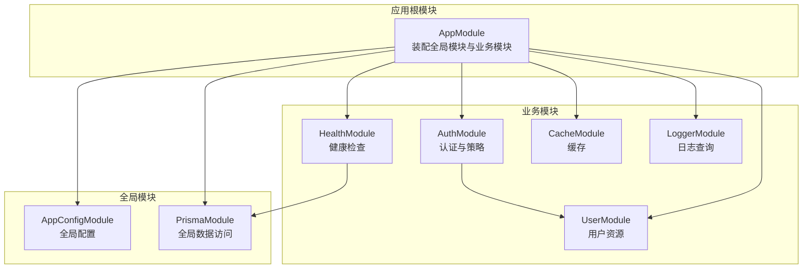
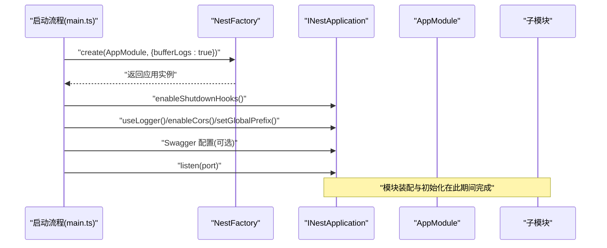
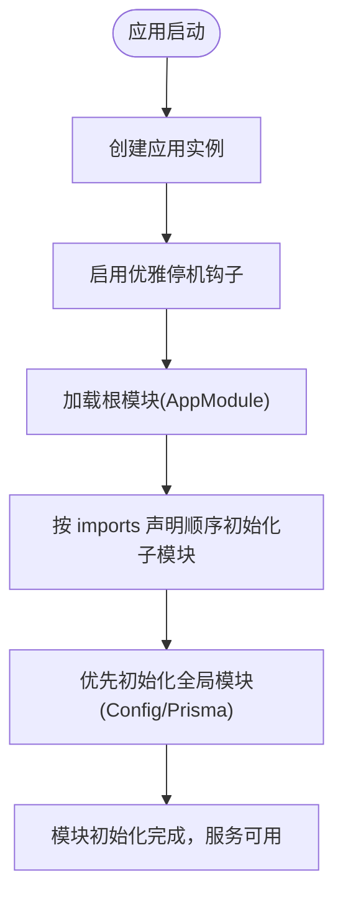
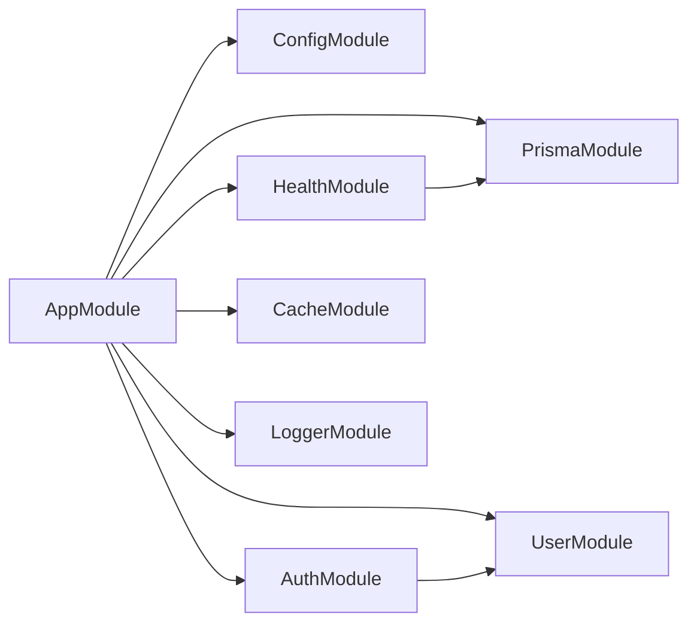

# 模块生命周期管理

<cite>
**本文引用的文件**
- [src/app.module.ts](file://src/app.module.ts)
- [src/main.ts](file://src/main.ts)
- [src/modules/auth/auth.module.ts](file://src/modules/auth/auth.module.ts)
- [src/modules/user/user.module.ts](file://src/modules/user/user.module.ts)
- [src/modules/cache/cache.module.ts](file://src/modules/cache/cache.module.ts)
- [src/modules/health/health.module.ts](file://src/modules/health/health.module.ts)
- [src/modules/logger/logger.module.ts](file://src/modules/logger/logger.module.ts)
- [src/prisma/prisma.module.ts](file://src/prisma/prisma.module.ts)
- [src/config/config.module.ts](file://src/config/config.module.ts)
</cite>

## 目录

1. [简介](#简介)
2. [项目结构](#项目结构)
3. [核心组件](#核心组件)
4. [架构总览](#架构总览)
5. [详细组件分析](#详细组件分析)
6. [依赖分析](#依赖分析)
7. [性能考虑](#性能考虑)
8. [故障排查指南](#故障排查指南)
9. [结论](#结论)
10. [附录](#附录)

## 简介

本文件系统性阐述 NestJS 模块生命周期管理，结合仓库现有实现，覆盖以下主题：

- 模块加载、初始化、运行与销毁的完整流程
- 模块构造函数执行顺序与 provider 注册时机
- 服务可用性保障与懒加载模块的触发与加载机制
- 生命周期钩子的使用方法、性能监控与故障排查
- 热重载与动态模块加载的支持现状与建议

## 项目结构

该仓库采用“按功能域分模块”的组织方式，顶层 AppModule 统一装配各子模块，并通过全局 provider 提供跨模块共享能力。主要模块包括认证、用户、健康检查、缓存、日志、Prisma 数据访问以及配置模块。

图表来源

- [src/app.module.ts:18-32](file://src/app.module.ts#L18-L32)
- [src/config/config.module.ts:6-18](file://src/config/config.module.ts#L6-L18)
- [src/prisma/prisma.module.ts:4-8](file://src/prisma/prisma.module.ts#L4-L8)
- [src/modules/auth/auth.module.ts:11-31](file://src/modules/auth/auth.module.ts#L11-L31)
- [src/modules/user/user.module.ts:5-9](file://src/modules/user/user.module.ts#L5-L9)
- [src/modules/health/health.module.ts:5-7](file://src/modules/health/health.module.ts#L5-L7)
- [src/modules/cache/cache.module.ts:4-11](file://src/modules/cache/cache.module.ts#L4-L11)
- [src/modules/logger/logger.module.ts:4-6](file://src/modules/logger/logger.module.ts#L4-L6)

章节来源

- [src/app.module.ts:18-32](file://src/app.module.ts#L18-L32)
- [src/main.ts:9-12](file://src/main.ts#L9-L12)

## 核心组件

- 应用入口与启动
  - 启动时通过工厂创建应用实例，启用优雅停机钩子，随后进行 CORS、全局前缀、Swagger 等配置，并监听端口。
  - 关键点：启用优雅停机钩子确保进程信号能触发模块销毁回调。
- 全局模块
  - 配置模块与 Prisma 模块声明为全局，便于任意模块直接注入。
- 业务模块
  - 认证模块依赖用户模块与 JWT/Passport；健康模块依赖 Prisma；缓存模块提供缓存能力并导出；日志模块提供查询服务并导出。

章节来源

- [src/main.ts:9-12](file://src/main.ts#L9-L12)
- [src/main.ts:14-23](file://src/main.ts#L14-L23)
- [src/config/config.module.ts:6-18](file://src/config/config.module.ts#L6-L18)
- [src/prisma/prisma.module.ts:4-8](file://src/prisma/prisma.module.ts#L4-L8)
- [src/modules/auth/auth.module.ts:11-31](file://src/modules/auth/auth.module.ts#L11-L31)
- [src/modules/health/health.module.ts:5-7](file://src/modules/health/health.module.ts#L5-L7)
- [src/modules/cache/cache.module.ts:4-11](file://src/modules/cache/cache.module.ts#L4-L11)
- [src/modules/logger/logger.module.ts:4-6](file://src/modules/logger/logger.module.ts#L4-L6)

## 架构总览

下图展示模块装配与依赖关系，以及启动阶段的关键步骤。

图表来源

- [src/main.ts:9-12](file://src/main.ts#L9-L12)
- [src/main.ts:14-23](file://src/main.ts#L14-L23)
- [src/app.module.ts:18-32](file://src/app.module.ts#L18-L32)

## 详细组件分析

### 模块装配与初始化顺序

- AppModule 作为根模块，其 imports 数组中的模块将按声明顺序进入初始化阶段。
- 子模块内部的 imports 也遵循同样的顺序原则。
- 全局模块（配置与 Prisma）在其他模块之前完成初始化，确保它们提供的服务对其他模块可用。

图表来源

- [src/main.ts:9-12](file://src/main.ts#L9-L12)
- [src/app.module.ts:18-32](file://src/app.module.ts#L18-L32)
- [src/config/config.module.ts:6-18](file://src/config/config.module.ts#L6-L18)
- [src/prisma/prisma.module.ts:4-8](file://src/prisma/prisma.module.ts#L4-L8)

章节来源

- [src/app.module.ts:18-32](file://src/app.module.ts#L18-L32)
- [src/config/config.module.ts:6-18](file://src/config/config.module.ts#L6-L18)
- [src/prisma/prisma.module.ts:4-8](file://src/prisma/prisma.module.ts#L4-L8)

### provider 注册时机与服务可用性

- provider 在模块初始化阶段注册到容器，随后可在同一模块或依赖它的模块中注入。
- 全局模块导出的服务可被任意模块直接注入，避免了循环依赖与重复注册。
- 认证模块通过异步注册方式注入配置服务，确保在模块初始化时即可获得所需配置。

章节来源

- [src/modules/auth/auth.module.ts:15-27](file://src/modules/auth/auth.module.ts#L15-L27)
- [src/config/config.module.ts:16-17](file://src/config/config.module.ts#L16-L17)
- [src/prisma/prisma.module.ts:6-7](file://src/prisma/prisma.module.ts#L6-L7)

### 懒加载模块（Lazy Modules）

- 当前仓库未显式使用惰性加载（例如动态导入或路由级延迟导入）。若需要懒加载，通常通过动态模块或路由级导入实现。
- 动态模块可通过 ModuleMetadata 的 imports/useFactory/inject 等组合，在运行时决定模块树，适合按需装配与条件装配。

章节来源

- [src/modules/auth/auth.module.ts:15-27](file://src/modules/auth/auth.module.ts#L15-L27)

### 生命周期钩子使用

- 仓库已启用优雅停机钩子，确保进程信号能触发 OnModuleDestroy 回调，从而在关闭时释放资源。
- 若需在模块销毁时执行清理逻辑，可在对应模块类中实现 OnModuleDestroy 钩子。

章节来源

- [src/main.ts:12](file://src/main.ts#L12)

### 性能监控与可观测性

- 启动阶段统一设置日志器与 CORS，有助于在运行期观察请求路径与跨域行为。
- Swagger 文档按配置开关，便于开发与联调阶段的接口观测。
- 健康检查模块依赖数据库连接，可作为运行期健康状态的参考指标之一。

章节来源

- [src/main.ts:17-18](file://src/main.ts#L17-L18)
- [src/main.ts:20-21](file://src/main.ts#L20-L21)
- [src/main.ts:25-34](file://src/main.ts#L25-L34)
- [src/modules/health/health.module.ts:5-7](file://src/modules/health/health.module.ts#L5-L7)

### 热重载与动态模块加载

- 仓库未包含热重载（HMR）配置或动态模块加载的示例。
- 如需支持热重载，可在开发模式下引入相应工具链；动态模块加载可通过 useFactory/inject 在运行时决定模块树。

章节来源

- [src/modules/auth/auth.module.ts:15-27](file://src/modules/auth/auth.module.ts#L15-L27)

## 依赖分析

模块间的依赖关系如下：

图表来源

- [src/app.module.ts:18-32](file://src/app.module.ts#L18-L32)
- [src/modules/auth/auth.module.ts:11-31](file://src/modules/auth/auth.module.ts#L11-L31)
- [src/modules/health/health.module.ts:5-7](file://src/modules/health/health.module.ts#L5-L7)

章节来源

- [src/app.module.ts:18-32](file://src/app.module.ts#L18-L32)

## 性能考虑

- 模块初始化顺序影响服务可用时间，建议将全局模块置于 imports 前部，减少后续模块等待。
- 异步注册（如认证模块的 JWT 配置）应在模块初始化早期完成，避免运行期阻塞。
- 缓存模块提供 TTL 与容量限制，建议在高频只读接口上配合缓存装饰器降低数据库压力。
- 健康检查模块应尽量轻量，避免在生产环境造成额外开销。

章节来源

- [src/modules/cache/cache.module.ts:6-9](file://src/modules/cache/cache.module.ts#L6-L9)
- [src/modules/health/health.module.ts:5-7](file://src/modules/health/health.module.ts#L5-L7)

## 故障排查指南

- 启动阶段
  - 若出现模块未初始化或服务不可用，检查 AppModule 的 imports 顺序与全局模块是否正确导出。
  - 确认已启用优雅停机钩子，以便在进程退出时触发 OnModuleDestroy。
- 运行阶段
  - 若 Swagger 在生产环境开启，检查配置项与环境变量，避免泄露敏感信息。
  - 健康检查接口可作为数据库连通性的快速验证点。
- 日志与可观测性
  - 统一日志器与 CORS 配置有助于定位跨域与请求路径问题。

章节来源

- [src/main.ts:12](file://src/main.ts#L12)
- [src/main.ts:25-34](file://src/main.ts#L25-L34)
- [src/modules/health/health.module.ts:5-7](file://src/modules/health/health.module.ts#L5-L7)

## 结论

本仓库通过全局模块与明确的模块装配顺序，实现了稳定的服务可用性与可维护性。结合优雅停机钩子与健康检查，整体生命周期管理具备良好的可观测性与可控性。若需进一步提升灵活性，可引入动态模块加载与热重载能力，以适配更复杂的运行时需求。

## 附录

- 模块生命周期关键节点
  - 加载：按 imports 声明顺序解析模块元数据
  - 初始化：构造函数与 provider 注册，异步注册在初始化阶段完成
  - 运行：服务可用，处理请求
  - 销毁：进程信号触发优雅停机，执行 OnModuleDestroy
