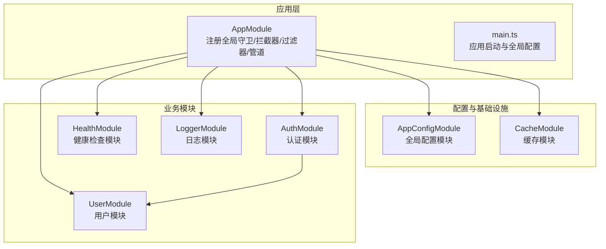
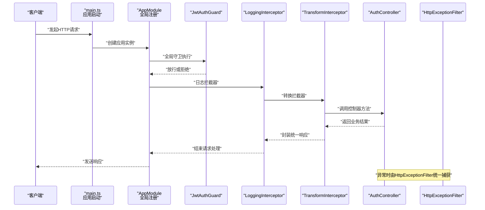
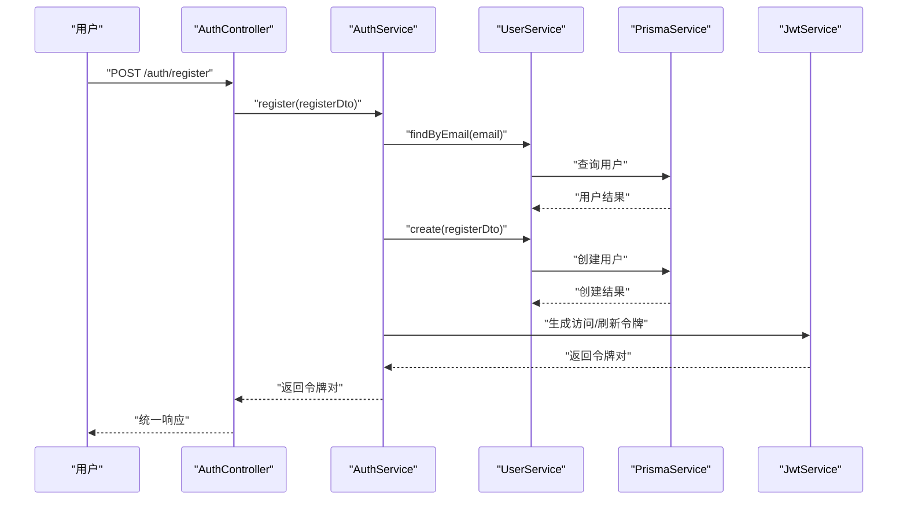
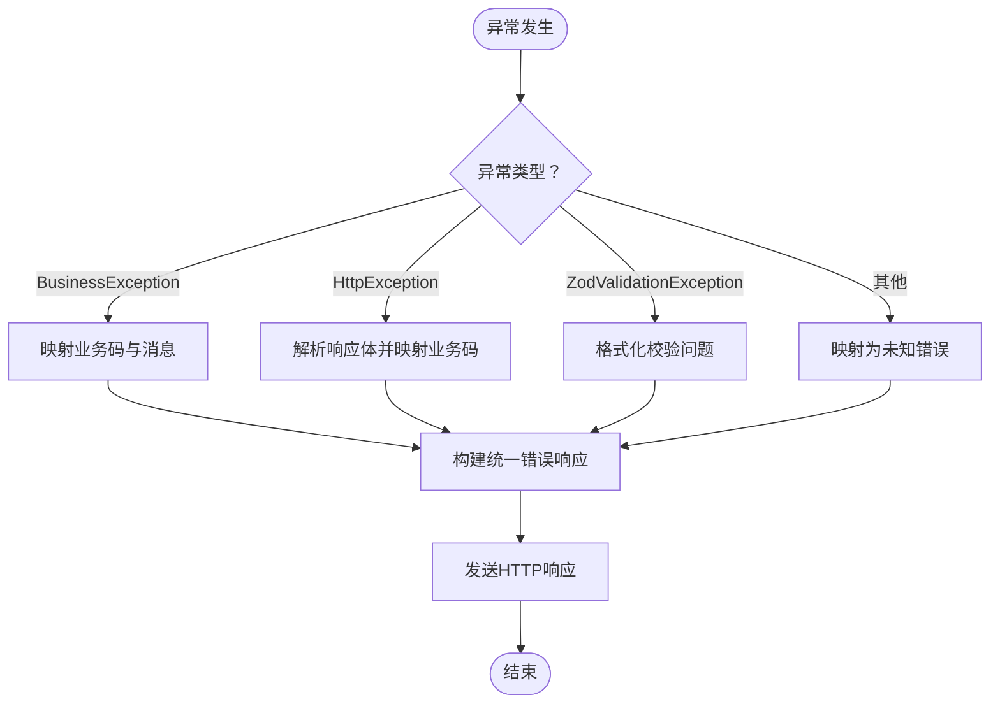
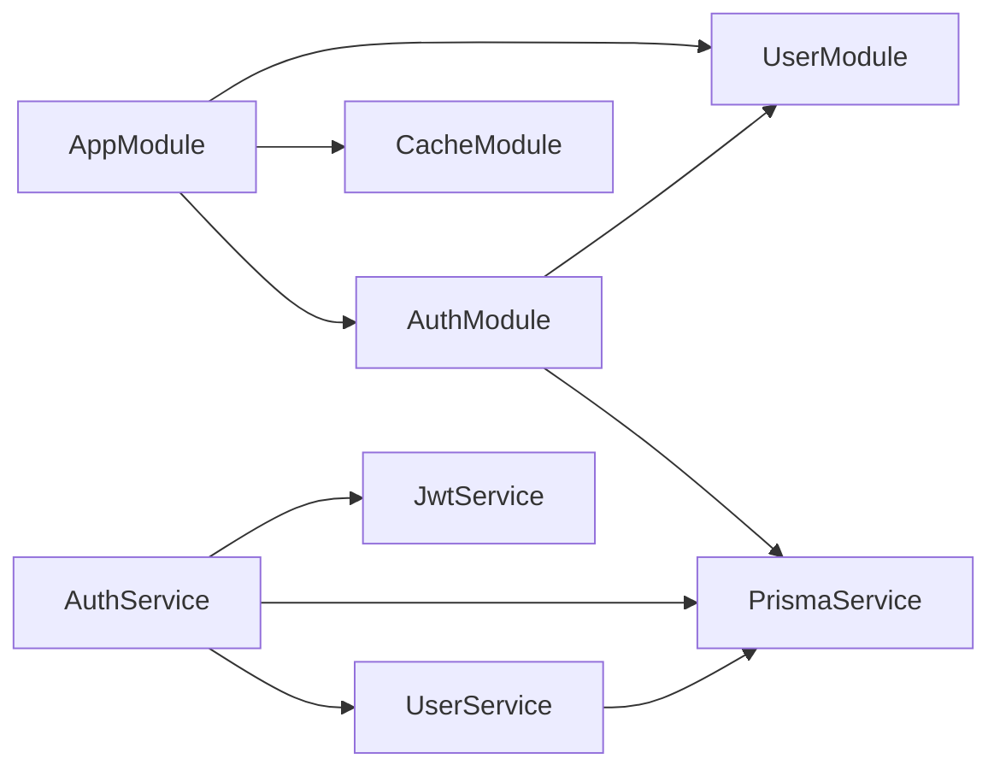

# 模块间通信机制

<cite>
**本文引用的文件**
- [src/app.module.ts](file://src/app.module.ts)
- [src/main.ts](file://src/main.ts)
- [src/modules/auth/auth.module.ts](file://src/modules/auth/auth.module.ts)
- [src/modules/auth/auth.service.ts](file://src/modules/auth/auth.service.ts)
- [src/modules/auth/auth.controller.ts](file://src/modules/auth/auth.controller.ts)
- [src/modules/user/user.module.ts](file://src/modules/user/user.module.ts)
- [src/modules/user/user.service.ts](file://src/modules/user/user.service.ts)
- [src/modules/cache/cache.module.ts](file://src/modules/cache/cache.module.ts)
- [src/common/guards/jwt-auth.guard.ts](file://src/common/guards/jwt-auth.guard.ts)
- [src/common/interceptors/logging.interceptor.ts](file://src/common/interceptors/logging.interceptor.ts)
- [src/common/interceptors/transform.interceptor.ts](file://src/common/interceptors/transform.interceptor.ts)
- [src/common/filters/http-exception.filter.ts](file://src/common/filters/http-exception.filter.ts)
- [src/common/decorators/public.decorator.ts](file://src/common/decorators/public.decorator.ts)
- [src/common/enums/biz-code.enum.ts](file://src/common/enums/biz-code.enum.ts)
- [src/config/config.module.ts](file://src/config/config.module.ts)
</cite>

## 目录
1. [引言](#引言)
2. [项目结构](#项目结构)
3. [核心组件](#核心组件)
4. [架构总览](#架构总览)
5. [详细组件分析](#详细组件分析)
6. [依赖关系分析](#依赖关系分析)
7. [性能考量](#性能考量)
8. [故障排查指南](#故障排查指南)
9. [结论](#结论)
10. [附录](#附录)

## 引言
本文件聚焦于NestJS模块系统的“模块间通信机制”，结合仓库现有实现，系统阐述以下主题：
- 依赖注入与跨模块服务共享
- 守卫、拦截器、过滤器的注册与执行顺序
- 模块导入/导出与循环依赖的检测与规避
- 事件传递与跨模块数据共享的实践路径
- 最佳实践、性能优化与调试技巧
- 实际配置示例与常见问题解决方案

## 项目结构
本项目采用按功能域划分的模块化组织方式，核心入口模块集中注册全局守卫、拦截器、过滤器与管道，并通过模块导入实现功能解耦。

图表来源
- [src/app.module.ts:18-32](file://src/app.module.ts#L18-L32)
- [src/main.ts:8-35](file://src/main.ts#L8-L35)
- [src/modules/auth/auth.module.ts:11-31](file://src/modules/auth/auth.module.ts#L11-L31)
- [src/modules/user/user.module.ts:5-9](file://src/modules/user/user.module.ts#L5-L9)
- [src/modules/cache/cache.module.ts:4-11](file://src/modules/cache/cache.module.ts#L4-L11)
- [src/config/config.module.ts:6-18](file://src/config/config.module.ts#L6-L18)

章节来源
- [src/app.module.ts:18-60](file://src/app.module.ts#L18-L60)
- [src/main.ts:8-47](file://src/main.ts#L8-L47)

## 核心组件
- 应用入口与全局注册
  - 在应用入口模块中集中注册全局守卫、拦截器、过滤器与验证管道，确保所有控制器统一生效。
  - 参考：[src/app.module.ts:33-58](file://src/app.module.ts#L33-L58)

- 模块导入与导出
  - 通过导入实现依赖注入与能力共享；通过导出实现能力对外暴露，供其他模块使用。
  - 参考：[src/modules/auth/auth.module.ts:11-31](file://src/modules/auth/auth.module.ts#L11-L31)，[src/modules/user/user.module.ts:5-9](file://src/modules/user/user.module.ts#L5-L9)，[src/modules/cache/cache.module.ts:4-11](file://src/modules/cache/cache.module.ts#L4-L11)

- 配置模块
  - 全局配置模块提供类型化配置服务，被其他模块以依赖注入方式使用。
  - 参考：[src/config/config.module.ts:6-18](file://src/config/config.module.ts#L6-L18)

章节来源
- [src/app.module.ts:33-58](file://src/app.module.ts#L33-L58)
- [src/modules/auth/auth.module.ts:11-31](file://src/modules/auth/auth.module.ts#L11-L31)
- [src/modules/user/user.module.ts:5-9](file://src/modules/user/user.module.ts#L5-L9)
- [src/modules/cache/cache.module.ts:4-11](file://src/modules/cache/cache.module.ts#L4-L11)
- [src/config/config.module.ts:6-18](file://src/config/config.module.ts#L6-L18)

## 架构总览
下图展示从请求进入至响应返回的关键处理链路，体现守卫、拦截器、控制器与过滤器的协作关系。

图表来源
- [src/main.ts:8-35](file://src/main.ts#L8-L35)
- [src/app.module.ts:33-58](file://src/app.module.ts#L33-L58)
- [src/common/guards/jwt-auth.guard.ts:17-45](file://src/common/guards/jwt-auth.guard.ts#L17-L45)
- [src/common/interceptors/logging.interceptor.ts:12-39](file://src/common/interceptors/logging.interceptor.ts#L12-L39)
- [src/common/interceptors/transform.interceptor.ts:14-40](file://src/common/interceptors/transform.interceptor.ts#L14-L40)
- [src/common/filters/http-exception.filter.ts:24-78](file://src/common/filters/http-exception.filter.ts#L24-L78)

## 详细组件分析

### 依赖注入与跨模块数据共享
- 服务共享
  - 认证模块通过导入用户模块，从而在认证服务中注入用户服务，实现跨模块数据访问。
  - 参考：[src/modules/auth/auth.module.ts:12-31](file://src/modules/auth/auth.module.ts#L12-L31)，[src/modules/auth/auth.service.ts:14-21](file://src/modules/auth/auth.service.ts#L14-L21)

- 配置共享
  - 全局配置模块提供类型化配置服务，认证模块通过异步注册JWT配置时注入该服务，实现配置跨模块共享。
  - 参考：[src/config/config.module.ts:6-18](file://src/config/config.module.ts#L6-L18)，[src/modules/auth/auth.module.ts:15-27](file://src/modules/auth/auth.module.ts#L15-L27)

- 缓存共享
  - 缓存模块注册并导出缓存管理器，其他模块可通过导入该模块使用缓存能力。
  - 参考：[src/modules/cache/cache.module.ts:4-11](file://src/modules/cache/cache.module.ts#L4-L11)

- 数据模型与枚举
  - 业务状态码与消息定义在公共枚举中，被守卫、拦截器与过滤器共同使用，保证响应一致性。
  - 参考：[src/common/enums/biz-code.enum.ts:13-78](file://src/common/enums/biz-code.enum.ts#L13-L78)，[src/common/enums/biz-code.enum.ts:83-122](file://src/common/enums/biz-code.enum.ts#L83-L122)

章节来源
- [src/modules/auth/auth.module.ts:12-31](file://src/modules/auth/auth.module.ts#L12-L31)
- [src/modules/auth/auth.service.ts:14-21](file://src/modules/auth/auth.service.ts#L14-L21)
- [src/config/config.module.ts:6-18](file://src/config/config.module.ts#L6-L18)
- [src/modules/auth/auth.module.ts:15-27](file://src/modules/auth/auth.module.ts#L15-L27)
- [src/modules/cache/cache.module.ts:4-11](file://src/modules/cache/cache.module.ts#L4-L11)
- [src/common/enums/biz-code.enum.ts:13-78](file://src/common/enums/biz-code.enum.ts#L13-L78)
- [src/common/enums/biz-code.enum.ts:83-122](file://src/common/enums/biz-code.enum.ts#L83-L122)

### 守卫、拦截器、过滤器的注册与执行顺序
- 注册位置
  - 全局守卫：在应用入口模块中通过提供者注册，覆盖所有路由。
  - 全局拦截器：在应用入口模块中注册，形成日志拦截器与响应转换拦截器的链式调用。
  - 全局过滤器：在应用入口模块中注册，统一捕获异常。
  - 全局管道：在应用入口模块中注册，统一进行输入验证。
  - 参考：[src/app.module.ts:33-58](file://src/app.module.ts#L33-L58)

- 执行顺序
  1) 全局守卫（如JWT鉴权）
  2) 全局拦截器链（日志拦截器 -> 响应转换拦截器）
  3) 控制器方法
  4) 全局过滤器（异常捕获与统一响应）

- 关键行为
  - JWT鉴权守卫支持“公开访问”元数据，通过反射判断是否跳过鉴权。
  - 日志拦截器记录请求与响应上下文信息。
  - 响应转换拦截器将控制器返回值包装为统一响应结构。
  - 异常过滤器根据异常类型与HTTP状态映射为统一业务响应。
  - 参考：[src/common/guards/jwt-auth.guard.ts:17-45](file://src/common/guards/jwt-auth.guard.ts#L17-L45)，[src/common/interceptors/logging.interceptor.ts:12-39](file://src/common/interceptors/logging.interceptor.ts#L12-L39)，[src/common/interceptors/transform.interceptor.ts:14-40](file://src/common/interceptors/transform.interceptor.ts#L14-L40)，[src/common/filters/http-exception.filter.ts:24-78](file://src/common/filters/http-exception.filter.ts#L24-L78)，[src/common/decorators/public.decorator.ts:3-4](file://src/common/decorators/public.decorator.ts#L3-L4)

章节来源
- [src/app.module.ts:33-58](file://src/app.module.ts#L33-L58)
- [src/common/guards/jwt-auth.guard.ts:17-45](file://src/common/guards/jwt-auth.guard.ts#L17-L45)
- [src/common/interceptors/logging.interceptor.ts:12-39](file://src/common/interceptors/logging.interceptor.ts#L12-L39)
- [src/common/interceptors/transform.interceptor.ts:14-40](file://src/common/interceptors/transform.interceptor.ts#L14-L40)
- [src/common/filters/http-exception.filter.ts:24-78](file://src/common/filters/http-exception.filter.ts#L24-L78)
- [src/common/decorators/public.decorator.ts:3-4](file://src/common/decorators/public.decorator.ts#L3-L4)

### 模块导入导出机制与循环依赖
- 导入导出
  - 认证模块导入用户模块以复用用户相关能力；用户模块未导入其他业务模块，保持低耦合。
  - 缓存模块仅导入Nest内置缓存管理器并导出，便于其他模块使用。
  - 参考：[src/modules/auth/auth.module.ts:12-31](file://src/modules/auth/auth.module.ts#L12-L31)，[src/modules/user/user.module.ts:5-9](file://src/modules/user/user.module.ts#L5-L9)，[src/modules/cache/cache.module.ts:4-11](file://src/modules/cache/cache.module.ts#L4-L11)

- 循环依赖检测与规避
  - 避免双向导入：用户模块不导入认证模块。
  - 使用惰性导入与延迟初始化：认证模块通过异步工厂注册JWT配置，避免早期依赖导致的初始化问题。
  - 通过导出服务或模块边界清晰化依赖方向，减少循环风险。
  - 参考：[src/modules/auth/auth.module.ts:15-27](file://src/modules/auth/auth.module.ts#L15-L27)

章节来源
- [src/modules/auth/auth.module.ts:12-31](file://src/modules/auth/auth.module.ts#L12-L31)
- [src/modules/user/user.module.ts:5-9](file://src/modules/user/user.module.ts#L5-L9)
- [src/modules/cache/cache.module.ts:4-11](file://src/modules/cache/cache.module.ts#L4-L11)
- [src/modules/auth/auth.module.ts:15-27](file://src/modules/auth/auth.module.ts#L15-L27)

### 事件传递与跨模块数据共享
- 事件传递
  - 当前实现未显式使用NestJS事件发射器（Events），若需跨模块松耦合通信，建议引入事件发射器并在模块间通过事件发布/订阅实现解耦。
  - 参考：[src/modules/auth/auth.service.ts:14-21](file://src/modules/auth/auth.service.ts#L14-L21)（服务间依赖通过构造函数注入）

- 跨模块数据共享
  - 通过模块导出共享服务或配置；在认证模块中通过配置服务读取JWT配置，实现跨模块配置共享。
  - 参考：[src/modules/auth/auth.module.ts:15-27](file://src/modules/auth/auth.module.ts#L15-L27)，[src/config/config.module.ts:6-18](file://src/config/config.module.ts#L6-L18)

章节来源
- [src/modules/auth/auth.service.ts:14-21](file://src/modules/auth/auth.service.ts#L14-L21)
- [src/modules/auth/auth.module.ts:15-27](file://src/modules/auth/auth.module.ts#L15-L27)
- [src/config/config.module.ts:6-18](file://src/config/config.module.ts#L6-L18)

### 控制器与服务协作流程（认证模块）

图表来源
- [src/modules/auth/auth.controller.ts:60-70](file://src/modules/auth/auth.controller.ts#L60-L70)
- [src/modules/auth/auth.service.ts:50-65](file://src/modules/auth/auth.service.ts#L50-L65)
- [src/modules/user/user.service.ts:17-37](file://src/modules/user/user.service.ts#L17-L37)

章节来源
- [src/modules/auth/auth.controller.ts:60-70](file://src/modules/auth/auth.controller.ts#L60-L70)
- [src/modules/auth/auth.service.ts:50-65](file://src/modules/auth/auth.service.ts#L50-L65)
- [src/modules/user/user.service.ts:17-37](file://src/modules/user/user.service.ts#L17-L37)

### 统一异常处理流程

图表来源
- [src/common/filters/http-exception.filter.ts:24-78](file://src/common/filters/http-exception.filter.ts#L24-L78)
- [src/common/filters/http-exception.filter.ts:80-134](file://src/common/filters/http-exception.filter.ts#L80-L134)
- [src/common/filters/http-exception.filter.ts:136-171](file://src/common/filters/http-exception.filter.ts#L136-L171)

章节来源
- [src/common/filters/http-exception.filter.ts:24-78](file://src/common/filters/http-exception.filter.ts#L24-L78)
- [src/common/filters/http-exception.filter.ts:80-134](file://src/common/filters/http-exception.filter.ts#L80-L134)
- [src/common/filters/http-exception.filter.ts:136-171](file://src/common/filters/http-exception.filter.ts#L136-L171)

## 依赖关系分析
- 模块依赖
  - AppModule导入多个业务模块与基础设施模块，作为全局装配中心。
  - AuthModule导入UserModule，形成“认证依赖用户”的单向依赖。
  - CacheModule导入Nest内置缓存模块并导出，供其他模块使用。
  - 参考：[src/app.module.ts:18-32](file://src/app.module.ts#L18-L32)，[src/modules/auth/auth.module.ts:12-31](file://src/modules/auth/auth.module.ts#L12-L31)，[src/modules/cache/cache.module.ts:4-11](file://src/modules/cache/cache.module.ts#L4-L11)

- 服务依赖
  - AuthService依赖UserService、PrismaService与JwtService；UserService依赖PrismaService。
  - 参考：[src/modules/auth/auth.service.ts:14-21](file://src/modules/auth/auth.service.ts#L14-L21)，[src/modules/user/user.service.ts:14-15](file://src/modules/user/user.service.ts#L14-L15)

图表来源
- [src/app.module.ts:18-32](file://src/app.module.ts#L18-L32)
- [src/modules/auth/auth.module.ts:12-31](file://src/modules/auth/auth.module.ts#L12-L31)
- [src/modules/auth/auth.service.ts:14-21](file://src/modules/auth/auth.service.ts#L14-L21)
- [src/modules/user/user.service.ts:14-15](file://src/modules/user/user.service.ts#L14-L15)

章节来源
- [src/app.module.ts:18-32](file://src/app.module.ts#L18-L32)
- [src/modules/auth/auth.module.ts:12-31](file://src/modules/auth/auth.module.ts#L12-L31)
- [src/modules/auth/auth.service.ts:14-21](file://src/modules/auth/auth.service.ts#L14-L21)
- [src/modules/user/user.service.ts:14-15](file://src/modules/user/user.service.ts#L14-L15)

## 性能考量
- 全局拦截器链
  - 日志与响应转换拦截器均为轻量处理，建议避免在拦截器中执行重IO或阻塞操作。
  - 参考：[src/common/interceptors/logging.interceptor.ts:12-39](file://src/common/interceptors/logging.interceptor.ts#L12-L39)，[src/common/interceptors/transform.interceptor.ts:14-40](file://src/common/interceptors/transform.interceptor.ts#L14-L40)

- 鉴权守卫
  - JWT鉴权守卫基于Passport策略，建议合理设置令牌有效期与刷新策略，降低频繁鉴权开销。
  - 参考：[src/common/guards/jwt-auth.guard.ts:17-45](file://src/common/guards/jwt-auth.guard.ts#L17-L45)

- 缓存模块
  - 合理设置缓存TTL与容量，避免内存压力；对热点数据进行缓存命中优化。
  - 参考：[src/modules/cache/cache.module.ts:6-10](file://src/modules/cache/cache.module.ts#L6-L10)

- 数据库访问
  - 使用选择性字段查询与分页，避免一次性加载大量数据。
  - 参考：[src/modules/user/user.service.ts:115-123](file://src/modules/user/user.service.ts#L115-L123)

## 故障排查指南
- 未授权访问
  - 现象：返回业务未授权错误。
  - 排查：确认请求头是否包含有效令牌；检查守卫是否正确识别公开接口元数据。
  - 参考：[src/common/guards/jwt-auth.guard.ts:17-45](file://src/common/guards/jwt-auth.guard.ts#L17-L45)，[src/common/decorators/public.decorator.ts:3-4](file://src/common/decorators/public.decorator.ts#L3-L4)，[src/common/enums/biz-code.enum.ts:22-29](file://src/common/enums/biz-code.enum.ts#L22-L29)

- 参数校验失败
  - 现象：统一返回校验错误。
  - 排查：查看过滤器对Zod与类验证器异常的映射与细节输出。
  - 参考：[src/common/filters/http-exception.filter.ts:106-134](file://src/common/filters/http-exception.filter.ts#L106-L134)

- 业务异常
  - 现象：根据业务码返回对应消息与状态。
  - 排查：核对业务异常抛出点与状态码映射。
  - 参考：[src/common/filters/http-exception.filter.ts:36-54](file://src/common/filters/http-exception.filter.ts#L36-L54)，[src/common/enums/biz-code.enum.ts:13-78](file://src/common/enums/biz-code.enum.ts#L13-L78)

- 启动与全局配置
  - 现象：应用启动失败或端口/CORS/Swagger未生效。
  - 排查：检查主程序中的全局前缀、CORS与Swagger配置读取逻辑。
  - 参考：[src/main.ts:8-47](file://src/main.ts#L8-L47)

章节来源
- [src/common/guards/jwt-auth.guard.ts:17-45](file://src/common/guards/jwt-auth.guard.ts#L17-L45)
- [src/common/decorators/public.decorator.ts:3-4](file://src/common/decorators/public.decorator.ts#L3-L4)
- [src/common/enums/biz-code.enum.ts:22-29](file://src/common/enums/biz-code.enum.ts#L22-L29)
- [src/common/filters/http-exception.filter.ts:106-134](file://src/common/filters/http-exception.filter.ts#L106-L134)
- [src/common/filters/http-exception.filter.ts:36-54](file://src/common/filters/http-exception.filter.ts#L36-L54)
- [src/common/enums/biz-code.enum.ts:13-78](file://src/common/enums/biz-code.enum.ts#L13-L78)
- [src/main.ts:8-47](file://src/main.ts#L8-L47)

## 结论
本项目通过“应用入口模块集中注册+模块导入导出”的方式，实现了清晰的模块间通信与职责分离。全局守卫、拦截器与过滤器在统一链路上协同工作，配合类型化配置与服务依赖注入，形成了高内聚、低耦合的模块体系。建议在后续扩展中引入事件发射器以进一步增强跨模块解耦，并持续关注拦截器与数据库访问的性能优化。

## 附录
- 实际配置示例（路径）
  - 全局守卫/拦截器/过滤器/管道注册：[src/app.module.ts:33-58](file://src/app.module.ts#L33-L58)
  - 应用启动与全局配置：[src/main.ts:8-47](file://src/main.ts#L8-L47)
  - 认证模块导入用户模块与JWT异步注册：[src/modules/auth/auth.module.ts:12-31](file://src/modules/auth/auth.module.ts#L12-L31)
  - 用户模块导出服务：[src/modules/user/user.module.ts:5-9](file://src/modules/user/user.module.ts#L5-L9)
  - 缓存模块注册与导出：[src/modules/cache/cache.module.ts:4-11](file://src/modules/cache/cache.module.ts#L4-L11)
  - 公开接口装饰器：[src/common/decorators/public.decorator.ts:3-4](file://src/common/decorators/public.decorator.ts#L3-L4)
  - 业务状态码与消息：[src/common/enums/biz-code.enum.ts:13-122](file://src/common/enums/biz-code.enum.ts#L13-L122)
  - 全局配置模块（全局+类型化配置）：[src/config/config.module.ts:6-18](file://src/config/config.module.ts#L6-L18)