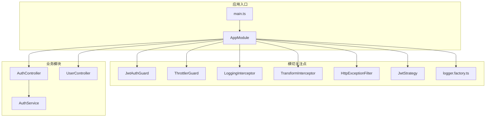
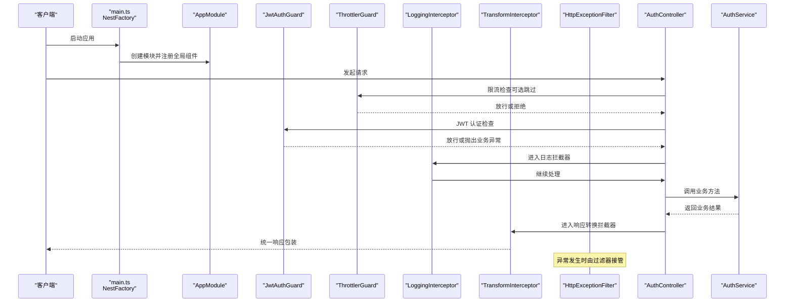
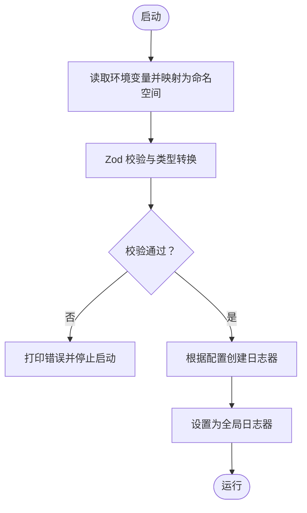
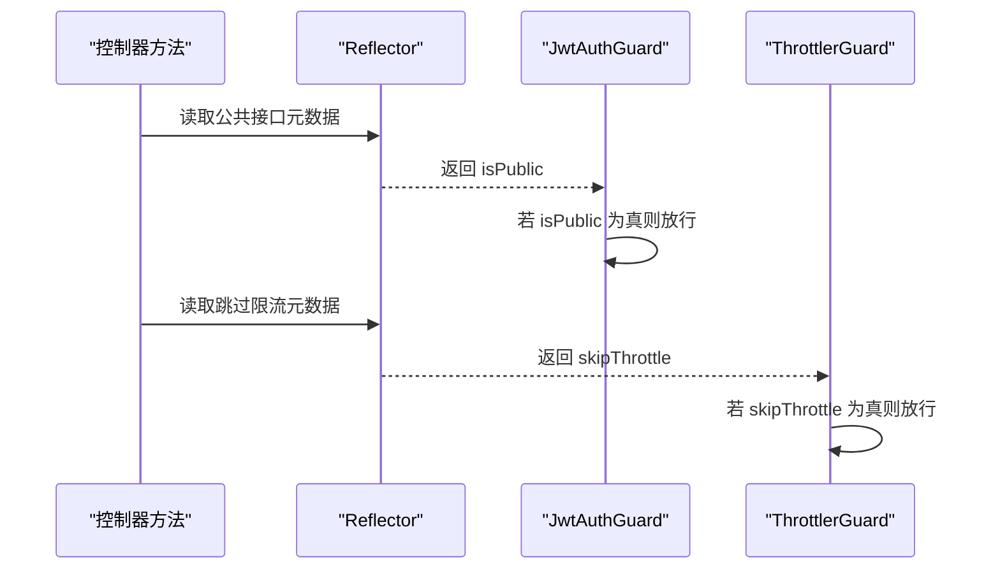
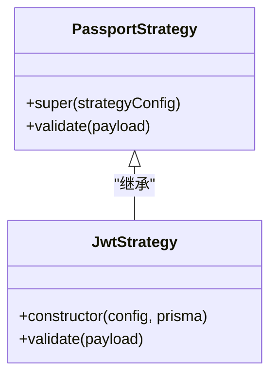
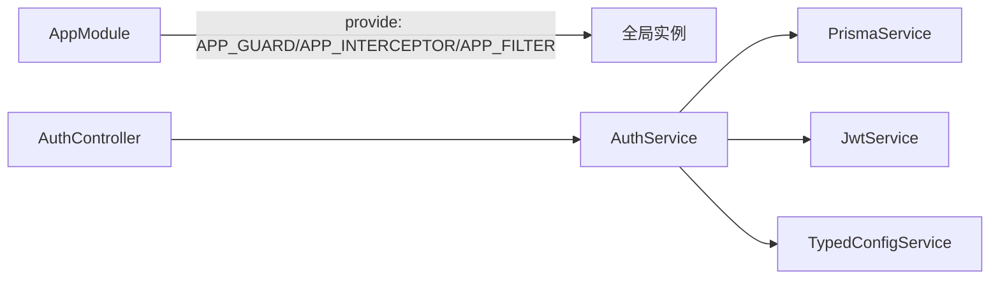
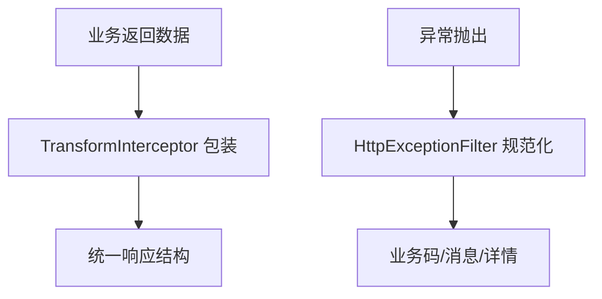
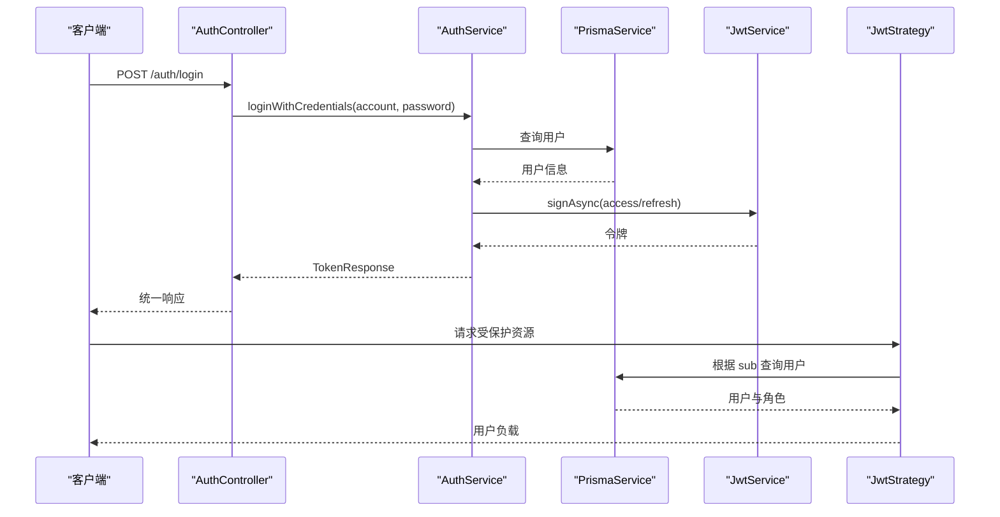
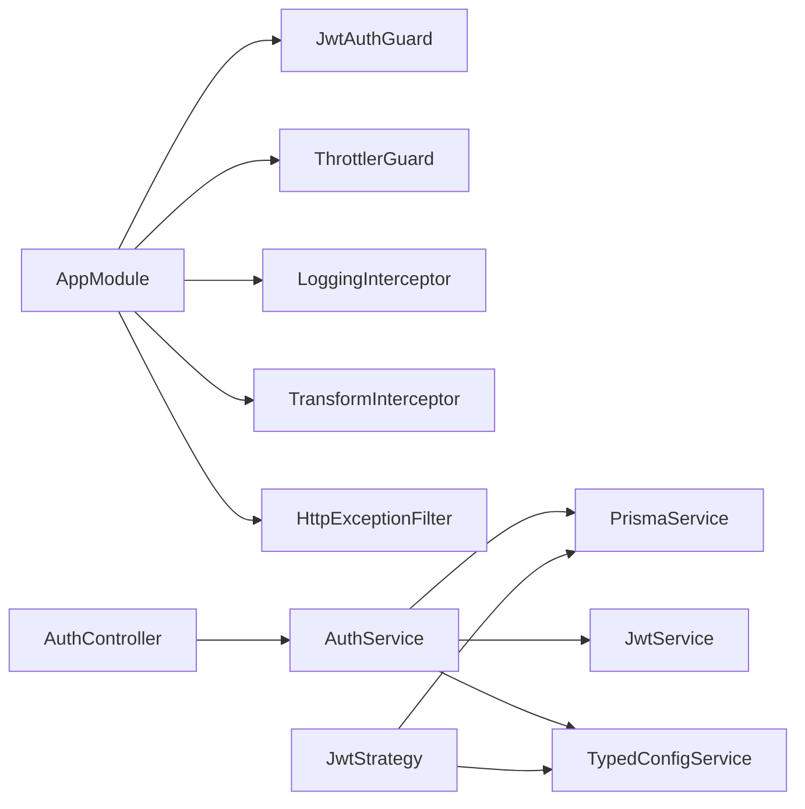

# 设计模式应用

<cite>
**本文引用的文件**
- [src/common/decorators/public.decorator.ts](file://src/common/decorators/public.decorator.ts)
- [src/common/decorators/skip-throttle.decorator.ts](file://src/common/decorators/skip-throttle.decorator.ts)
- [src/common/guards/jwt-auth.guard.ts](file://src/common/guards/jwt-auth.guard.ts)
- [src/common/guards/throttler.guard.ts](file://src/common/guards/throttler.guard.ts)
- [src/common/interceptors/logging.interceptor.ts](file://src/common/interceptors/logging.interceptor.ts)
- [src/common/interceptors/transform.interceptor.ts](file://src/common/interceptors/transform.interceptor.ts)
- [src/common/filters/http-exception.filter.ts](file://src/common/filters/http-exception.filter.ts)
- [src/modules/logger/logger.factory.ts](file://src/modules/logger/logger.factory.ts)
- [src/modules/auth/strategies/jwt.strategy.ts](file://src/modules/auth/strategies/jwt.strategy.ts)
- [src/modules/auth/auth.service.ts](file://src/modules/auth/auth.service.ts)
- [src/modules/auth/auth.controller.ts](file://src/modules/auth/auth.controller.ts)
- [src/app.module.ts](file://src/app.module.ts)
- [src/main.ts](file://src/main.ts)
- [src/config/config-loader.ts](file://src/config/config-loader.ts)
</cite>

## 目录
1. [引言](#引言)
2. [项目结构](#项目结构)
3. [核心组件](#核心组件)
4. [架构总览](#架构总览)
5. [详细组件分析](#详细组件分析)
6. [依赖关系分析](#依赖关系分析)
7. [性能考量](#性能考量)
8. [故障排查指南](#故障排查指南)
9. [结论](#结论)

## 引言
本文件聚焦于该项目在 NestJS 中对多种设计模式的实际应用与落地，包括但不限于：
- 工厂模式：配置加载与日志工厂
- 装饰器模式：公共路由装饰器与跳过限流装饰器
- 策略模式：认证策略（Passport Strategy）
- 单例模式：全局服务实例（通过 Nest 依赖注入）

我们将从架构视角出发，结合类图与序列图，解释每种模式的应用场景、实现方式与带来的收益，并给出最佳实践建议。

## 项目结构
项目采用按功能域划分的模块化组织方式，核心能力通过模块边界清晰地隔离，同时通过全局拦截器、守卫、过滤器与配置加载形成横切关注点的统一处理层。

图表来源
- [src/main.ts:1-50](file://src/main.ts#L1-L50)
- [src/app.module.ts:1-61](file://src/app.module.ts#L1-L61)
- [src/common/guards/jwt-auth.guard.ts:1-46](file://src/common/guards/jwt-auth.guard.ts#L1-L46)
- [src/common/guards/throttler.guard.ts:1-33](file://src/common/guards/throttler.guard.ts#L1-L33)
- [src/common/interceptors/logging.interceptor.ts:1-40](file://src/common/interceptors/logging.interceptor.ts#L1-L40)
- [src/common/interceptors/transform.interceptor.ts:1-41](file://src/common/interceptors/transform.interceptor.ts#L1-L41)
- [src/common/filters/http-exception.filter.ts:1-173](file://src/common/filters/http-exception.filter.ts#L1-L173)
- [src/modules/logger/logger.factory.ts:1-156](file://src/modules/logger/logger.factory.ts#L1-L156)
- [src/modules/auth/strategies/jwt.strategy.ts:1-49](file://src/modules/auth/strategies/jwt.strategy.ts#L1-L49)
- [src/modules/auth/auth.controller.ts:1-129](file://src/modules/auth/auth.controller.ts#L1-L129)
- [src/modules/auth/auth.service.ts:1-162](file://src/modules/auth/auth.service.ts#L1-L162)

章节来源
- [src/main.ts:1-50](file://src/main.ts#L1-L50)
- [src/app.module.ts:1-61](file://src/app.module.ts#L1-L61)

## 核心组件
- 配置加载与类型化配置服务：负责将环境变量映射为分层结构并通过 Zod 校验，提供类型安全的配置读取。
- 日志工厂：基于配置动态创建 Winston 日志器，支持控制台与文件输出、彩色/非彩色格式、敏感字段脱敏。
- 认证策略：基于 Passport 的 JWT 策略，从请求中提取令牌并验证，查询用户角色信息。
- 守卫与装饰器：JwtAuthGuard 与自定义 ThrottlerGuard 通过反射读取元数据，实现“公共接口”与“跳过限流”的声明式控制。
- 拦截器与过滤器：统一记录请求日志、统一封装响应体、规范化异常输出。
- 控制器与服务：控制器负责接口契约与装饰器声明，服务封装业务逻辑与令牌生成。

章节来源
- [src/config/config-loader.ts:1-53](file://src/config/config-loader.ts#L1-L53)
- [src/modules/logger/logger.factory.ts:1-156](file://src/modules/logger/logger.factory.ts#L1-L156)
- [src/modules/auth/strategies/jwt.strategy.ts:1-49](file://src/modules/auth/strategies/jwt.strategy.ts#L1-L49)
- [src/common/guards/jwt-auth.guard.ts:1-46](file://src/common/guards/jwt-auth.guard.ts#L1-L46)
- [src/common/guards/throttler.guard.ts:1-33](file://src/common/guards/throttler.guard.ts#L1-L33)
- [src/common/interceptors/logging.interceptor.ts:1-40](file://src/common/interceptors/logging.interceptor.ts#L1-L40)
- [src/common/interceptors/transform.interceptor.ts:1-41](file://src/common/interceptors/transform.interceptor.ts#L1-L41)
- [src/common/filters/http-exception.filter.ts:1-173](file://src/common/filters/http-exception.filter.ts#L1-L173)
- [src/modules/auth/auth.controller.ts:1-129](file://src/modules/auth/auth.controller.ts#L1-L129)
- [src/modules/auth/auth.service.ts:1-162](file://src/modules/auth/auth.service.ts#L1-L162)

## 架构总览
下图展示了请求在系统中的典型流转路径，以及横切关注点如何以装饰器、守卫、拦截器、过滤器的方式介入。

图表来源
- [src/main.ts:1-50](file://src/main.ts#L1-L50)
- [src/app.module.ts:1-61](file://src/app.module.ts#L1-L61)
- [src/common/guards/jwt-auth.guard.ts:1-46](file://src/common/guards/jwt-auth.guard.ts#L1-L46)
- [src/common/guards/throttler.guard.ts:1-33](file://src/common/guards/throttler.guard.ts#L1-L33)
- [src/common/interceptors/logging.interceptor.ts:1-40](file://src/common/interceptors/logging.interceptor.ts#L1-L40)
- [src/common/interceptors/transform.interceptor.ts:1-41](file://src/common/interceptors/transform.interceptor.ts#L1-L41)
- [src/common/filters/http-exception.filter.ts:1-173](file://src/common/filters/http-exception.filter.ts#L1-L173)
- [src/modules/auth/auth.controller.ts:1-129](file://src/modules/auth/auth.controller.ts#L1-L129)
- [src/modules/auth/auth.service.ts:1-162](file://src/modules/auth/auth.service.ts#L1-L162)

## 详细组件分析

### 工厂模式：配置加载与日志工厂
- 应用场景
  - 将扁平的环境变量映射为分层命名空间，进行严格运行时校验与类型转换，确保配置一致性与安全性。
  - 基于配置动态创建日志器，支持控制台与文件输出、彩色/非彩色格式、敏感字段脱敏。
- 实现方式
  - 配置工厂：将 process.env 映射为分层对象，使用 Zod Schema 校验并返回 root 对象；失败时阻断启动。
  - 日志工厂：读取配置决定是否启用文件输出、日志级别、轮转参数；构建 Console 与 DailyRotateFile 传输器；统一格式化与脱敏。
- 带来的好处
  - 统一的配置入口与强类型访问，降低配置错误风险。
  - 动态日志器创建，便于在不同环境切换输出策略。
- 关键路径
  - [配置加载:1-53](file://src/config/config-loader.ts#L1-L53)
  - [日志工厂:114-156](file://src/modules/logger/logger.factory.ts#L114-L156)

图表来源
- [src/config/config-loader.ts:5-52](file://src/config/config-loader.ts#L5-L52)
- [src/modules/logger/logger.factory.ts:114-156](file://src/modules/logger/logger.factory.ts#L114-L156)

章节来源
- [src/config/config-loader.ts:1-53](file://src/config/config-loader.ts#L1-L53)
- [src/modules/logger/logger.factory.ts:1-156](file://src/modules/logger/logger.factory.ts#L1-L156)

### 装饰器模式：公共路由装饰器与跳过限流装饰器
- 应用场景
  - 在控制器或方法上声明“公共接口”，绕过 JWT 认证。
  - 在高频但低风险接口上声明“跳过限流”，避免误伤健康检查等端点。
- 实现方式
  - 公共装饰器：通过 SetMetadata 写入元数据键值。
  - 限流装饰器：通过 SetMetadata 写入跳过键值。
  - 守卫与 Guard：通过 Reflector 读取元数据，决定放行或继续后续流程。
- 带来的好处
  - 声明式控制，减少重复逻辑，提升可读性与可维护性。
- 关键路径
  - [公共装饰器:1-5](file://src/common/decorators/public.decorator.ts#L1-L5)
  - [跳过限流装饰器:1-12](file://src/common/decorators/skip-throttle.decorator.ts#L1-L12)
  - [JwtAuthGuard:23-34](file://src/common/guards/jwt-auth.guard.ts#L23-L34)
  - [ThrottlerGuard:20-31](file://src/common/guards/throttler.guard.ts#L20-L31)

图表来源
- [src/common/decorators/public.decorator.ts:3-5](file://src/common/decorators/public.decorator.ts#L3-L5)
- [src/common/decorators/skip-throttle.decorator.ts:3-12](file://src/common/decorators/skip-throttle.decorator.ts#L3-L12)
- [src/common/guards/jwt-auth.guard.ts:23-34](file://src/common/guards/jwt-auth.guard.ts#L23-L34)
- [src/common/guards/throttler.guard.ts:20-31](file://src/common/guards/throttler.guard.ts#L20-L31)

章节来源
- [src/common/decorators/public.decorator.ts:1-5](file://src/common/decorators/public.decorator.ts#L1-L5)
- [src/common/decorators/skip-throttle.decorator.ts:1-12](file://src/common/decorators/skip-throttle.decorator.ts#L1-L12)
- [src/common/guards/jwt-auth.guard.ts:1-46](file://src/common/guards/jwt-auth.guard.ts#L1-L46)
- [src/common/guards/throttler.guard.ts:1-33](file://src/common/guards/throttler.guard.ts#L1-L33)

### 策略模式：认证策略（Passport Strategy）
- 应用场景
  - 将 JWT 解析与用户校验逻辑抽象为可插拔的策略，便于扩展与替换。
- 实现方式
  - 自定义 JwtStrategy 继承 PassportStrategy(Strategy)，在构造函数中配置提取方式与密钥。
  - validate 方法中通过用户 ID 查询用户信息并返回标准化的用户负载。
- 带来的好处
  - 将认证细节与控制器解耦，便于统一管理认证生命周期。
- 关键路径
  - [JwtStrategy:10-48](file://src/modules/auth/strategies/jwt.strategy.ts#L10-L48)

图表来源
- [src/modules/auth/strategies/jwt.strategy.ts:9-20](file://src/modules/auth/strategies/jwt.strategy.ts#L9-L20)
- [src/modules/auth/strategies/jwt.strategy.ts:22-47](file://src/modules/auth/strategies/jwt.strategy.ts#L22-L47)

章节来源
- [src/modules/auth/strategies/jwt.strategy.ts:1-49](file://src/modules/auth/strategies/jwt.strategy.ts#L1-L49)

### 单例模式：服务实例（全局注册与依赖注入）
- 应用场景
  - 在 NestJS 中，服务默认以单例形式注入，保证全局唯一实例与状态共享。
- 实现方式
  - AppModule 通过 provide: APP_* 注册全局守卫、拦截器、过滤器与管道，确保全局限流、日志、响应包装与异常处理的一致性。
  - 控制器与服务之间通过依赖注入传递实例，避免手动管理生命周期。
- 带来的好处
  - 减少重复初始化成本，统一横切逻辑，简化测试与替换。
- 关键路径
  - [AppModule 全局注册:33-58](file://src/app.module.ts#L33-L58)
  - [main.ts 设置全局日志器:16-17](file://src/main.ts#L16-L17)

图表来源
- [src/app.module.ts:33-58](file://src/app.module.ts#L33-L58)
- [src/main.ts:16-17](file://src/main.ts#L16-L17)

章节来源
- [src/app.module.ts:1-61](file://src/app.module.ts#L1-L61)
- [src/main.ts:1-50](file://src/main.ts#L1-L50)

### 统一响应与异常处理（拦截器与过滤器）
- 应用场景
  - 统一包装响应体，标准化错误输出，减少控制器侧样板代码。
- 实现方式
  - TransformInterceptor：读取方法级响应消息元数据，将任意数据包裹为统一结构。
  - HttpExceptionFilter：捕获 HttpException，区分业务异常与框架异常，映射为业务码与消息。
- 带来的好处
  - 前后端一致的响应契约，便于前端统一处理。
- 关键路径
  - [TransformInterceptor:21-39](file://src/common/interceptors/transform.interceptor.ts#L21-L39)
  - [HttpExceptionFilter:24-78](file://src/common/filters/http-exception.filter.ts#L24-L78)

图表来源
- [src/common/interceptors/transform.interceptor.ts:14-41](file://src/common/interceptors/transform.interceptor.ts#L14-L41)
- [src/common/filters/http-exception.filter.ts:24-78](file://src/common/filters/http-exception.filter.ts#L24-L78)

章节来源
- [src/common/interceptors/transform.interceptor.ts:1-41](file://src/common/interceptors/transform.interceptor.ts#L1-L41)
- [src/common/filters/http-exception.filter.ts:1-173](file://src/common/filters/http-exception.filter.ts#L1-L173)

### 认证流程（控制器—服务—策略）
- 应用场景
  - 登录、注册、刷新令牌、退出登录等完整认证生命周期。
- 实现方式
  - 控制器通过装饰器声明公共接口与限流策略，调用 AuthService 执行业务。
  - AuthService 生成与持久化刷新令牌，使用 JwtService 生成访问令牌。
  - JwtStrategy 作为认证策略，从请求中提取并验证 JWT。
- 带来的好处
  - 清晰的职责分离，易于扩展与替换认证机制。
- 关键路径
  - [AuthController:44-114](file://src/modules/auth/auth.controller.ts#L44-L114)
  - [AuthService:29-160](file://src/modules/auth/auth.service.ts#L29-L160)
  - [JwtStrategy:22-47](file://src/modules/auth/strategies/jwt.strategy.ts#L22-L47)

图表来源
- [src/modules/auth/auth.controller.ts:70-86](file://src/modules/auth/auth.controller.ts#L70-L86)
- [src/modules/auth/auth.service.ts:29-160](file://src/modules/auth/auth.service.ts#L29-L160)
- [src/modules/auth/strategies/jwt.strategy.ts:22-47](file://src/modules/auth/strategies/jwt.strategy.ts#L22-L47)

章节来源
- [src/modules/auth/auth.controller.ts:1-129](file://src/modules/auth/auth.controller.ts#L1-L129)
- [src/modules/auth/auth.service.ts:1-162](file://src/modules/auth/auth.service.ts#L1-L162)
- [src/modules/auth/strategies/jwt.strategy.ts:1-49](file://src/modules/auth/strategies/jwt.strategy.ts#L1-L49)

## 依赖关系分析
- 模块耦合
  - AppModule 作为装配中心，集中注册全局守卫、拦截器、过滤器与管道，降低各模块间的重复配置。
  - 控制器仅依赖服务接口，服务依赖基础设施（数据库、JWT、配置），形成清晰的依赖方向。
- 外部依赖
  - Passport 与 NestJS Throttler 提供认证与限流基础能力；Winston 提供日志能力；Swagger 提供文档能力。
- 循环依赖
  - 当前结构通过依赖注入避免显式循环依赖；若未来引入更复杂的模块交互，应保持接口隔离与懒加载。

图表来源
- [src/app.module.ts:18-61](file://src/app.module.ts#L18-L61)
- [src/modules/auth/auth.controller.ts:38-42](file://src/modules/auth/auth.controller.ts#L38-L42)
- [src/modules/auth/auth.service.ts:16-21](file://src/modules/auth/auth.service.ts#L16-L21)
- [src/modules/auth/strategies/jwt.strategy.ts:11-20](file://src/modules/auth/strategies/jwt.strategy.ts#L11-L20)

章节来源
- [src/app.module.ts:1-61](file://src/app.module.ts#L1-L61)
- [src/modules/auth/auth.controller.ts:1-129](file://src/modules/auth/auth.controller.ts#L1-L129)
- [src/modules/auth/auth.service.ts:1-162](file://src/modules/auth/auth.service.ts#L1-L162)
- [src/modules/auth/strategies/jwt.strategy.ts:1-49](file://src/modules/auth/strategies/jwt.strategy.ts#L1-L49)

## 性能考量
- 日志输出
  - 文件日志采用按日轮转与大小上限控制，避免磁盘膨胀；生产环境建议关闭彩色输出以减少 CPU 开销。
- 令牌生成
  - 访问令牌与刷新令牌并发签名，缩短响应时间；注意密钥长度与哈希算法选择。
- 限流策略
  - 不同场景使用不同限流组（短/中/长），高频公共接口可使用“跳过限流”装饰器。
- 异常处理
  - 过滤器对异常进行快速分类与映射，减少控制器侧分支判断。

## 故障排查指南
- 配置校验失败
  - 现象：启动时报错并终止。
  - 排查：检查环境变量是否符合 Zod Schema；查看详细错误信息定位字段。
  - 参考：[配置加载:39-46](file://src/config/config-loader.ts#L39-L46)
- 认证失败
  - 现象：JwtAuthGuard 抛出业务异常。
  - 排查：确认令牌格式、有效期与签发方；检查用户是否存在且未被禁用。
  - 参考：[JwtAuthGuard:36-44](file://src/common/guards/jwt-auth.guard.ts#L36-L44)、[JwtStrategy:22-47](file://src/modules/auth/strategies/jwt.strategy.ts#L22-L47)
- 响应未统一
  - 现象：部分接口未按统一结构返回。
  - 排查：确认是否缺少响应消息元数据；检查拦截器是否生效。
  - 参考：[TransformInterceptor:21-39](file://src/common/interceptors/transform.interceptor.ts#L21-L39)
- 异常未规范
  - 现象：异常未映射为业务码。
  - 排查：确认是否为 HttpException；检查过滤器是否捕获。
  - 参考：[HttpExceptionFilter:24-78](file://src/common/filters/http-exception.filter.ts#L24-L78)

章节来源
- [src/config/config-loader.ts:39-46](file://src/config/config-loader.ts#L39-L46)
- [src/common/guards/jwt-auth.guard.ts:36-44](file://src/common/guards/jwt-auth.guard.ts#L36-L44)
- [src/modules/auth/strategies/jwt.strategy.ts:22-47](file://src/modules/auth/strategies/jwt.strategy.ts#L22-L47)
- [src/common/interceptors/transform.interceptor.ts:21-39](file://src/common/interceptors/transform.interceptor.ts#L21-L39)
- [src/common/filters/http-exception.filter.ts:24-78](file://src/common/filters/http-exception.filter.ts#L24-L78)

## 结论
本项目通过在 NestJS 中系统性地应用工厂、装饰器、策略与单例等设计模式，实现了配置与日志的动态化、认证与限流的声明式控制、响应与异常的统一治理。这些模式不仅提升了代码的可读性与可维护性，也为后续扩展与演进提供了稳定的基础。