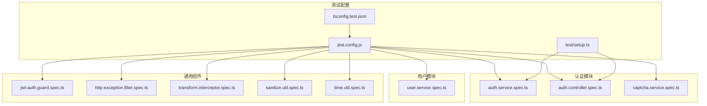
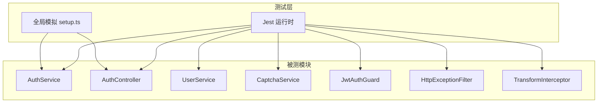
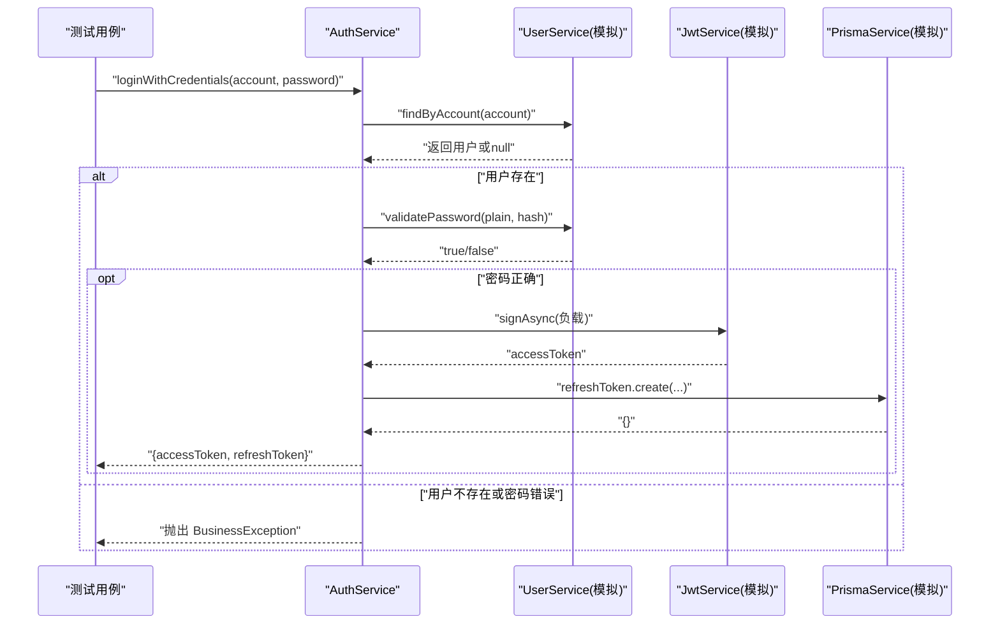
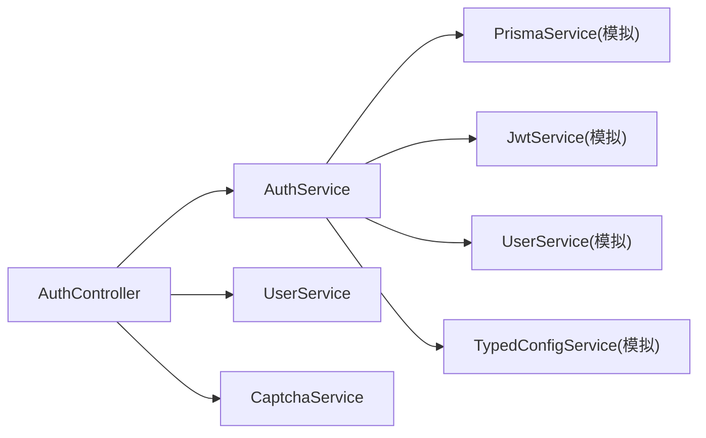

# 单元测试

<cite>
**本文引用的文件**
- [jest.config.js](file://jest.config.js)
- [setup.ts](file://test/setup.ts)
- [app.e2e-spec.ts](file://test/app.e2e-spec.ts)
- [auth.service.spec.ts](file://src/modules/auth/auth.service.spec.ts)
- [auth.controller.spec.ts](file://src/modules/auth/auth.controller.spec.ts)
- [jwt-auth.guard.spec.ts](file://src/common/guards/jwt-auth.guard.spec.ts)
- [user.service.spec.ts](file://src/modules/user/user.service.spec.ts)
- [http-exception.filter.spec.ts](file://src/common/filters/http-exception.filter.spec.ts)
- [transform.interceptor.spec.ts](file://src/common/interceptors/transform.interceptor.spec.ts)
- [sanitize.util.spec.ts](file://src/common/utils/sanitize.util.spec.ts)
- [time.util.spec.ts](file://src/common/utils/time.util.spec.ts)
- [captcha.service.spec.ts](file://src/modules/auth/captcha.service.spec.ts)
- [business.exception.ts](file://src/common/exceptions/business.exception.ts)
- [package.json](file://package.json)
- [tsconfig.test.json](file://tsconfig.test.json)
</cite>

## 目录
1. [简介](#简介)
2. [项目结构](#项目结构)
3. [核心组件](#核心组件)
4. [架构总览](#架构总览)
5. [详细组件分析](#详细组件分析)
6. [依赖关系分析](#依赖关系分析)
7. [性能与覆盖率](#性能与覆盖率)
8. [故障排查指南](#故障排查指南)
9. [结论](#结论)
10. [附录](#附录)

## 简介
本文件系统性梳理本项目的单元测试体系，覆盖服务层、控制器层与守卫层的测试实现方式，重点说明如何使用 Jest 进行模拟对象创建、异步测试处理与断言验证；并给出业务逻辑测试、错误处理测试与边界条件测试的实践指南。同时包含测试数据准备、测试环境配置、覆盖率要求以及模拟依赖注入、测试隔离与性能优化等最佳实践。

## 项目结构
本项目采用 NestJS 标准目录组织，测试文件以 .spec.ts 命名，位于对应模块的源代码目录下，便于就近维护与定位。测试运行由 Jest 驱动，通过 ts-jest 在 TypeScript 环境中执行。

图表来源
- [jest.config.js:1-34](file://jest.config.js#L1-L34)
- [tsconfig.test.json:1-8](file://tsconfig.test.json#L1-L8)
- [setup.ts:1-47](file://test/setup.ts#L1-L47)
- [auth.service.spec.ts:1-303](file://src/modules/auth/auth.service.spec.ts#L1-L303)
- [auth.controller.spec.ts:1-191](file://src/modules/auth/auth.controller.spec.ts#L1-L191)
- [user.service.spec.ts:1-437](file://src/modules/user/user.service.spec.ts#L1-L437)
- [jwt-auth.guard.spec.ts:1-97](file://src/common/guards/jwt-auth.guard.spec.ts#L1-L97)
- [http-exception.filter.spec.ts:1-136](file://src/common/filters/http-exception.filter.spec.ts#L1-L136)
- [transform.interceptor.spec.ts:1-109](file://src/common/interceptors/transform.interceptor.spec.ts#L1-L109)
- [sanitize.util.spec.ts:1-130](file://src/common/utils/sanitize.util.spec.ts#L1-L130)
- [time.util.spec.ts:1-162](file://src/common/utils/time.util.spec.ts#L1-L162)
- [captcha.service.spec.ts:1-132](file://src/modules/auth/captcha.service.spec.ts#L1-L132)

章节来源
- [jest.config.js:1-34](file://jest.config.js#L1-L34)
- [tsconfig.test.json:1-8](file://tsconfig.test.json#L1-L8)
- [setup.ts:1-47](file://test/setup.ts#L1-L47)

## 核心组件
- 测试框架与编译器
  - Jest 配置：根目录为 src，匹配 .spec.ts 文件，使用 ts-jest 并指定 tsconfig.test.json；开启覆盖率收集与阈值；设置测试环境为 node，并在初始化后加载 test/setup.ts。
  - TypeScript 测试配置：继承主 tsconfig，包含 src 与 test 下的 TypeScript 源文件。
- 全局模拟工具
  - 提供 PrismaService 与 JwtService 的全局模拟对象，便于在多个测试文件中复用。
  - 统一超时时间与 afterEach 清理，确保测试隔离与稳定。
- 异常与过滤器
  - BusinessException 定义统一业务异常结构，配合 HttpExceptionFilter 将其转换为标准化响应格式。
- 工具函数
  - sanitize.util 与 time.util 提供安全脱敏与时间格式化等纯函数测试，覆盖边界与递归场景。

章节来源
- [jest.config.js:1-34](file://jest.config.js#L1-L34)
- [tsconfig.test.json:1-8](file://tsconfig.test.json#L1-L8)
- [setup.ts:1-47](file://test/setup.ts#L1-L47)
- [business.exception.ts:1-42](file://src/common/exceptions/business.exception.ts#L1-L42)

## 架构总览
下图展示测试层与被测模块之间的交互关系，突出模拟注入与断言验证的关键路径。

图表来源
- [auth.service.spec.ts:1-303](file://src/modules/auth/auth.service.spec.ts#L1-L303)
- [auth.controller.spec.ts:1-191](file://src/modules/auth/auth.controller.spec.ts#L1-L191)
- [user.service.spec.ts:1-437](file://src/modules/user/user.service.spec.ts#L1-L437)
- [captcha.service.spec.ts:1-132](file://src/modules/auth/captcha.service.spec.ts#L1-L132)
- [jwt-auth.guard.spec.ts:1-97](file://src/common/guards/jwt-auth.guard.spec.ts#L1-L97)
- [http-exception.filter.spec.ts:1-136](file://src/common/filters/http-exception.filter.spec.ts#L1-L136)
- [transform.interceptor.spec.ts:1-109](file://src/common/interceptors/transform.interceptor.spec.ts#L1-L109)
- [setup.ts:1-47](file://test/setup.ts#L1-L47)

## 详细组件分析

### 服务层测试：AuthService
- 测试范围
  - 登录凭据校验、注册、刷新令牌、登出等核心流程。
  - 错误处理：用户不存在、密码错误、重复邮箱/用户名、刷新令牌不存在/已撤销/过期。
  - 边界条件：空输入、大小写敏感性、哈希一致性。
- 模拟注入
  - 使用 TestingModule 注入 PrismaService、JwtService、UserService、TypedConfigService 的模拟实现。
  - 使用 mockPrismaService 与 mockJwtService 提供一致的数据库与 JWT 行为。
- 异步测试与断言
  - 使用 Promise/async 断言返回值结构与属性存在性。
  - 使用 reject 与 toThrow 验证业务异常抛出。
- 关键流程示意

图表来源
- [auth.service.spec.ts:71-123](file://src/modules/auth/auth.service.spec.ts#L71-L123)
- [auth.service.spec.ts:125-188](file://src/modules/auth/auth.service.spec.ts#L125-L188)
- [auth.service.spec.ts:190-283](file://src/modules/auth/auth.service.spec.ts#L190-L283)
- [auth.service.spec.ts:285-301](file://src/modules/auth/auth.service.spec.ts#L285-L301)

章节来源
- [auth.service.spec.ts:1-303](file://src/modules/auth/auth.service.spec.ts#L1-L303)

### 服务层测试：UserService
- 测试范围
  - 用户创建、查询、更新、删除、按邮箱/用户名查找、账户合并查找、密码校验。
  - 错误处理：未找到用户时抛出业务异常。
  - 边界条件：空结果、选择字段、密码哈希与比较行为。
- 模拟注入
  - 使用 TestingModule 注入 PrismaService 模拟对象。
  - 对 bcryptjs 进行模块级 mock，控制哈希与比较行为。
- 断言策略
  - 验证 Prisma 调用次数与参数完整性。
  - 验证返回值结构与字段映射。

章节来源
- [user.service.spec.ts:1-437](file://src/modules/user/user.service.spec.ts#L1-L437)

### 控制器测试：AuthController
- 测试范围
  - 获取验证码、注册、登录（含验证码校验）、刷新令牌、登出、获取个人资料。
  - 与 AuthService、UserService、CaptchaService 的协作调用。
- 模拟注入
  - 使用 TestingModule 注入控制器与三个服务的模拟实现。
- 断言策略
  - 验证服务调用参数与返回值一致性。
  - 验证鉴权上下文中的用户信息传递。

章节来源
- [auth.controller.spec.ts:1-191](file://src/modules/auth/auth.controller.spec.ts#L1-L191)

### 守卫测试：JwtAuthGuard
- 测试范围
  - 公开路由与非公开路由的判定逻辑。
  - 通过 Reflector 查询是否标记为公开接口。
  - 依赖 @nestjs/passport 的 AuthGuard 行为通过 mock 返回 true。
- 断言策略
  - 验证反射调用参数与返回值。
  - 验证不同场景下的 canActivate 返回值。

章节来源
- [jwt-auth.guard.spec.ts:1-97](file://src/common/guards/jwt-auth.guard.spec.ts#L1-L97)

### 过滤器与拦截器测试
- HttpExceptionFilter
  - 验证 BusinessException、通用 HttpException、UnauthorizedException 的响应格式与状态码映射。
  - 验证数组形式的校验错误详情透传。
- TransformInterceptor
  - 验证响应包装为统一 ApiResponse 结构，支持 null/undefined 数据。
- 断言策略
  - 使用 ArgumentsHost 模拟响应与请求上下文。
  - 使用 Observable/subscribe 验证异步流输出。

章节来源
- [http-exception.filter.spec.ts:1-136](file://src/common/filters/http-exception.filter.spec.ts#L1-L136)
- [transform.interceptor.spec.ts:1-109](file://src/common/interceptors/transform.interceptor.spec.ts#L1-L109)

### 工具函数测试
- sanitize.util
  - 敏感字段掩码（password/token 等），支持嵌套对象与自定义掩码值。
- time.util
  - 时间解析与格式化（秒/分/时/天、ISO、日期/时间字符串等），边界值与默认值处理。
- 断言策略
  - 覆盖空对象、无敏感字段、null/undefined、自定义掩码等场景。

章节来源
- [sanitize.util.spec.ts:1-130](file://src/common/utils/sanitize.util.spec.ts#L1-L130)
- [time.util.spec.ts:1-162](file://src/common/utils/time.util.spec.ts#L1-L162)

### CaptchaService 测试
- 测试范围
  - 生成验证码的 ID 与图像有效性、唯一性。
  - 验证码校验：正确、大小写不敏感、不存在、错误、过期、成功后清理。
- 断言策略
  - 访问内部 captchaStore 并修改过期时间以触发过期场景。
  - 验证异常类型与存储清理行为。

章节来源
- [captcha.service.spec.ts:1-132](file://src/modules/auth/captcha.service.spec.ts#L1-L132)

## 依赖关系分析
- 测试配置对模块的依赖
  - jest.config.js 通过 moduleNameMapper 将 @/、@modules/、@common/、@config/ 映射到源码根目录，保证测试中可直接使用相对导入别名。
  - setup.ts 中导出的模拟对象在多处 spec 文件中复用，降低重复配置成本。
- 被测模块间的耦合
  - AuthController 依赖 AuthService、UserService、CaptchaService。
  - AuthService 依赖 PrismaService、JwtService、UserService、TypedConfigService。
  - 这些依赖通过 TestingModule 的 provide/useValue 注入，形成清晰的模拟边界。

图表来源
- [auth.controller.spec.ts:35-48](file://src/modules/auth/auth.controller.spec.ts#L35-L48)
- [auth.service.spec.ts:43-69](file://src/modules/auth/auth.service.spec.ts#L43-L69)
- [setup.ts:7-46](file://test/setup.ts#L7-L46)

章节来源
- [jest.config.js:27-32](file://jest.config.js#L27-L32)
- [auth.controller.spec.ts:35-48](file://src/modules/auth/auth.controller.spec.ts#L35-L48)
- [auth.service.spec.ts:43-69](file://src/modules/auth/auth.service.spec.ts#L43-L69)

## 性能与覆盖率
- 测试性能优化
  - 使用全局 afterEach 清理所有 mocks，避免跨用例污染。
  - 合理拆分 describe，减少不必要的 beforeEach 初始化成本。
  - 对纯函数与工具类使用独立测试文件，避免与复杂依赖耦合。
- 覆盖率要求
  - 全局覆盖率阈值：分支、函数、行、语句均为 80%。
  - 收集规则排除 .spec.ts、.e2e-spec.ts、main.ts 与 generated 目录，聚焦业务与工具代码。
- 建议
  - 优先保证核心业务逻辑与错误分支的覆盖率。
  - 对外部依赖（Prisma/JWT）保持稳定的模拟契约，减少真实 IO 导致的不稳定。

章节来源
- [jest.config.js:9-24](file://jest.config.js#L9-L24)
- [setup.ts:3-5](file://test/setup.ts#L3-L5)

## 故障排查指南
- 常见问题
  - 模拟对象未生效：检查 TestingModule 中 provide/useValue 是否正确注入，以及模块导入顺序。
  - 异步断言失败：确认使用 await/async 与 Promise 断言（rejects.toThrow）。
  - 反射守卫判定异常：检查 Reflector.getAllAndOverride 的返回值与装饰器键名。
  - 过滤器未捕获异常：确认异常类型与状态码映射是否符合 BusinessException 规范。
- 排查步骤
  - 在 beforeEach 中打印关键依赖的调用次数与最近一次调用参数。
  - 使用 Jest 的 --verbose 或单文件运行定位具体用例。
  - 对外部依赖（Prisma/JWT）增加日志桩（spy）以观察调用轨迹。

章节来源
- [jwt-auth.guard.spec.ts:20-38](file://src/common/guards/jwt-auth.guard.spec.ts#L20-L38)
- [http-exception.filter.spec.ts:48-77](file://src/common/filters/http-exception.filter.spec.ts#L48-L77)
- [business.exception.ts:16-41](file://src/common/exceptions/business.exception.ts#L16-L41)

## 结论
本项目的单元测试体系以 Jest 为核心，结合 TestingModule 实现了对服务层、控制器层与守卫层的全面覆盖。通过全局模拟对象与严格的断言策略，有效保障了业务逻辑、错误处理与边界条件的正确性。建议持续关注覆盖率阈值与测试隔离，确保测试的稳定性与可维护性。

## 附录

### 测试用例编写指南
- 测试数据准备
  - 使用 DTO 与实体对象构造最小可验证数据集，避免冗余字段。
  - 对需要哈希/加密的场景，使用确定性的模拟值或固定盐值。
- 测试环境配置
  - 使用 tsconfig.test.json 与 jest.config.js 保持编译与运行环境一致。
  - 在 setup.ts 中集中管理全局模拟对象与超时设置。
- 断言验证
  - 优先断言副作用（如数据库调用、JWT 签发）而非仅断言返回值。
  - 对异步流程使用 rejects.toThrow 验证异常类型与消息。
- 模拟依赖注入
  - 在 beforeEach 中通过 TestingModule 提供模拟依赖，避免在用例中直接实例化真实依赖。
- 测试隔离
  - 使用 afterEach 清理所有 mocks，避免跨用例共享状态。
- 性能优化
  - 减少不必要的数据库/网络调用，优先使用内存模拟。
  - 对纯函数与工具类进行独立测试，缩短回归时间。

章节来源
- [setup.ts:1-47](file://test/setup.ts#L1-L47)
- [jest.config.js:1-34](file://jest.config.js#L1-L34)
- [tsconfig.test.json:1-8](file://tsconfig.test.json#L1-L8)