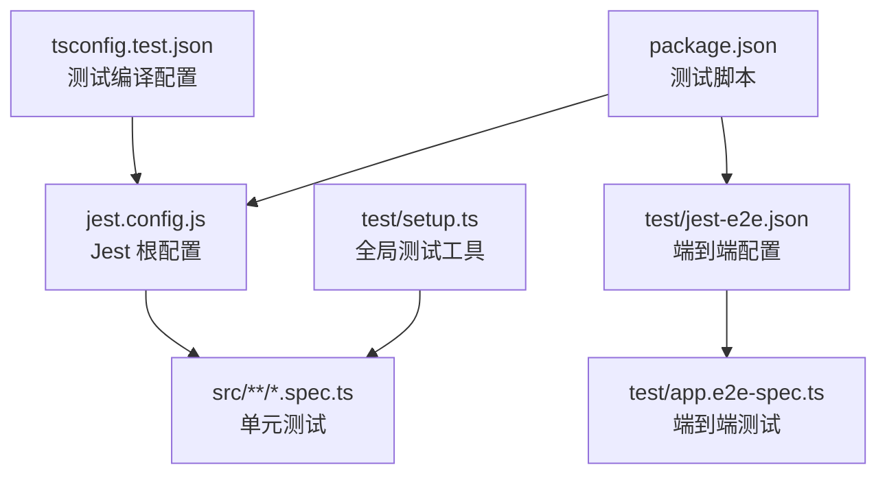
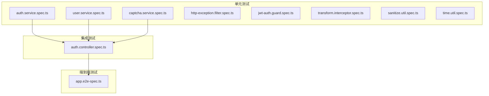
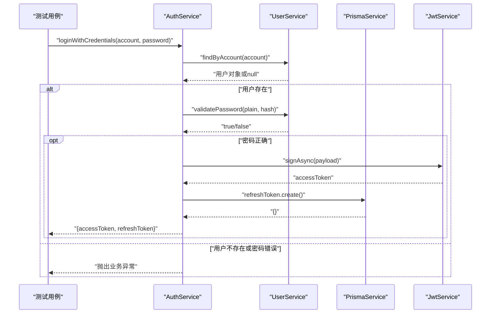
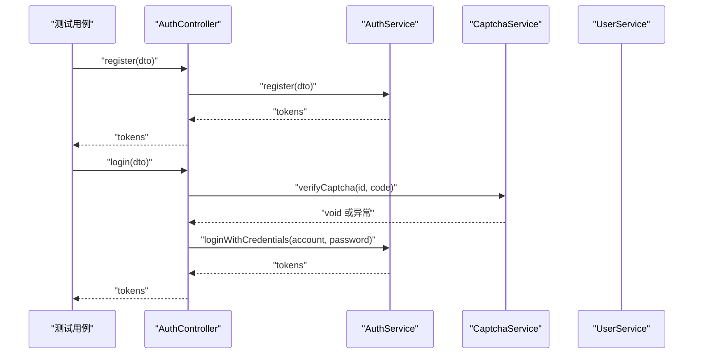
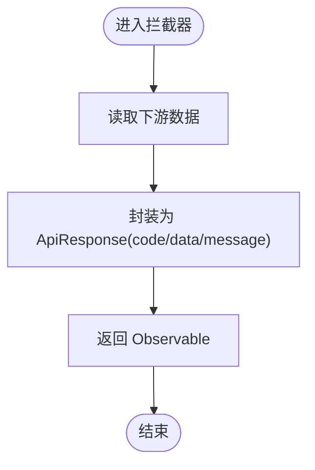
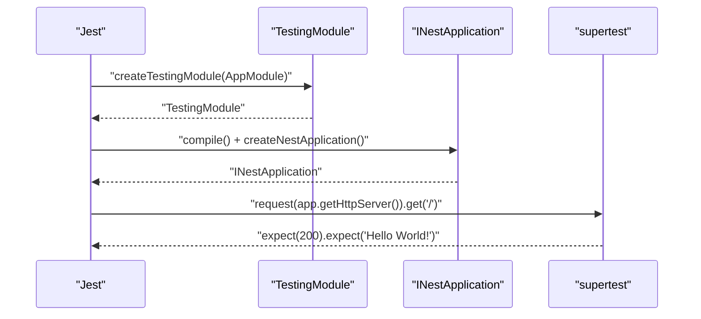
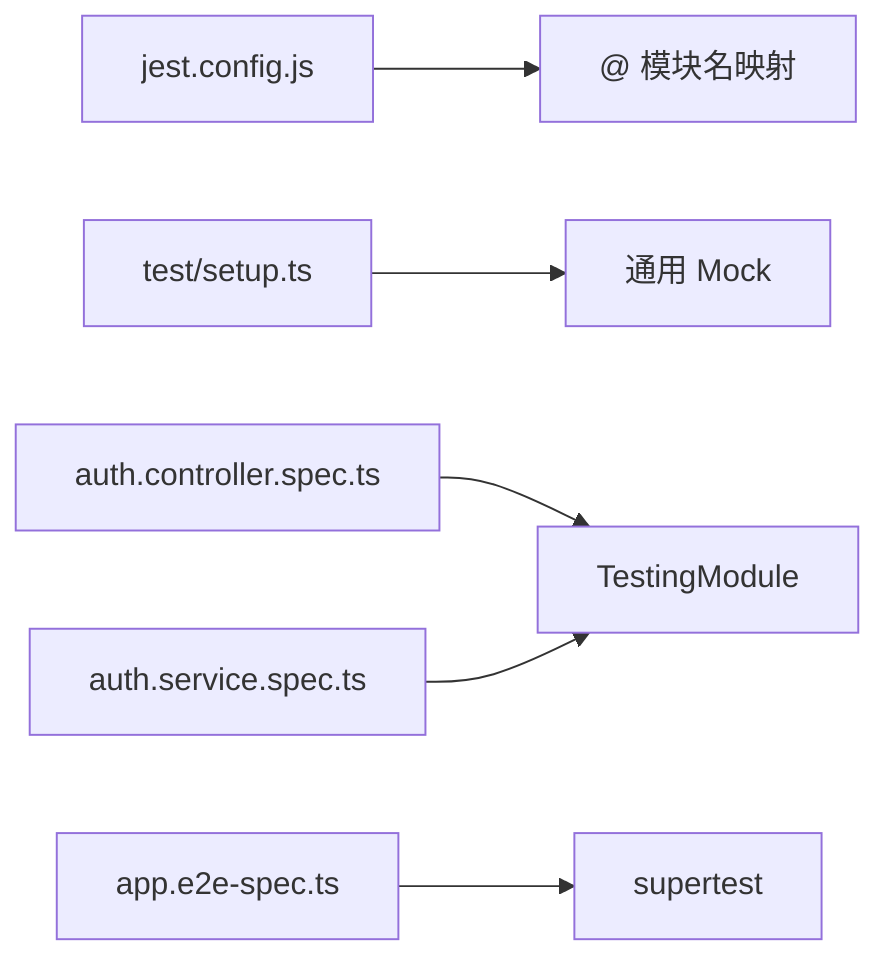

# 测试策略

<cite>
**本文引用的文件**
- [jest.config.js](file://jest.config.js)
- [test/jest-e2e.json](file://test/jest-e2e.json)
- [test/setup.ts](file://test/setup.ts)
- [package.json](file://package.json)
- [tsconfig.test.json](file://tsconfig.test.json)
- [test/app.e2e-spec.ts](file://test/app.e2e-spec.ts)
- [src/modules/auth/auth.controller.spec.ts](file://src/modules/auth/auth.controller.spec.ts)
- [src/modules/auth/auth.service.spec.ts](file://src/modules/auth/auth.service.spec.ts)
- [src/modules/user/user.service.spec.ts](file://src/modules/user/user.service.spec.ts)
- [src/modules/auth/captcha.service.spec.ts](file://src/modules/auth/captcha.service.spec.ts)
- [src/common/filters/http-exception.filter.spec.ts](file://src/common/filters/http-exception.filter.spec.ts)
- [src/common/guards/jwt-auth.guard.spec.ts](file://src/common/guards/jwt-auth.guard.spec.ts)
- [src/common/interceptors/transform.interceptor.spec.ts](file://src/common/interceptors/transform.interceptor.spec.ts)
- [src/common/utils/sanitize.util.spec.ts](file://src/common/utils/sanitize.util.spec.ts)
- [src/common/utils/time.util.spec.ts](file://src/common/utils/time.util.spec.ts)
</cite>

## 目录

1. [引言](#引言)
2. [项目结构](#项目结构)
3. [核心组件](#核心组件)
4. [架构总览](#架构总览)
5. [详细组件分析](#详细组件分析)
6. [依赖关系分析](#依赖关系分析)
7. [性能考量](#性能考量)
8. [故障排查指南](#故障排查指南)
9. [结论](#结论)
10. [附录](#附录)

## 引言

本文件系统化梳理本项目的测试策略与实现，覆盖单元测试、集成测试与端到端测试的设计与落地。重点说明 Jest 配置、测试环境设置、测试工具函数、服务层、控制器、过滤器、守卫与拦截器等关键组件的测试方法，以及测试数据管理、环境隔离与持续集成建议。同时总结模拟对象使用、异步测试处理与测试覆盖率要求的最佳实践。

## 项目结构

测试相关文件分布于以下位置：

- 单元测试：以 .spec.ts 结尾，位于各模块目录下，如 src/modules/auth/auth.service.spec.ts、src/common/filters/http-exception.filter.spec.ts 等
- 端到端测试：位于 test/app.e2e-spec.ts
- Jest 配置：根目录 jest.config.js；端到端专用配置 test/jest-e2e.json
- 全局测试工具：test/setup.ts，包含全局超时、清理与通用 Mock
- 测试编译配置：tsconfig.test.json
- 包脚本：package.json 中包含 test、test:watch、test:cov、test:e2e 等命令

图表来源

- [jest.config.js:1-34](file://jest.config.js#L1-L34)
- [test/jest-e2e.json:1-10](file://test/jest-e2e.json#L1-L10)
- [test/setup.ts:1-47](file://test/setup.ts#L1-L47)
- [tsconfig.test.json:1-8](file://tsconfig.test.json#L1-L8)
- [package.json:1-88](file://package.json#L1-L88)

章节来源

- [jest.config.js:1-34](file://jest.config.js#L1-L34)
- [test/jest-e2e.json:1-10](file://test/jest-e2e.json#L1-L10)
- [test/setup.ts:1-47](file://test/setup.ts#L1-L47)
- [tsconfig.test.json:1-8](file://tsconfig.test.json#L1-L8)
- [package.json:1-88](file://package.json#L1-L88)

## 核心组件

- Jest 配置与覆盖率
  - 使用 ts-jest 转换 TypeScript 源码，测试正则匹配 .spec.ts 文件
  - 收集覆盖率范围包含所有 .ts 文件，排除 spec/e2e 文件、main.ts 与 generated 目录
  - 全局覆盖率阈值：分支、函数、行、语句均为 80%
  - 测试环境为 Node，通过 setupFilesAfterEnv 引入 test/setup.ts
  - 模块名映射支持 @/、@modules/、@common/、@config/ 前缀
- 端到端测试
  - 使用 supertest 发起 HTTP 请求，基于 @nestjs/testing 的 TestingModule 构建应用实例
  - 默认配置在 test/jest-e2e.json 中
- 测试工具与 Mock
  - 全局超时 10 秒，每个用例后自动清理所有 Mock
  - 提供通用 Prisma 与 JWT 服务 Mock，便于服务层测试
  - bcryptjs 在用户服务测试中被整体 Mock，确保纯函数行为可预测

章节来源

- [jest.config.js:1-34](file://jest.config.js#L1-L34)
- [test/jest-e2e.json:1-10](file://test/jest-e2e.json#L1-L10)
- [test/setup.ts:1-47](file://test/setup.ts#L1-L47)
- [src/modules/user/user.service.spec.ts:1-437](file://src/modules/user/user.service.spec.ts#L1-L437)

## 架构总览

测试分层与职责：

- 单元测试：针对服务、工具、拦截器、过滤器、守卫等独立模块进行行为验证
- 集成测试：通过 @nestjs/testing 的 TestingModule 组合模块，验证服务间协作
- 端到端测试：启动完整应用，验证真实 HTTP 接口行为

图表来源

- [src/modules/auth/auth.service.spec.ts:1-303](file://src/modules/auth/auth.service.spec.ts#L1-L303)
- [src/modules/user/user.service.spec.ts:1-437](file://src/modules/user/user.service.spec.ts#L1-L437)
- [src/modules/auth/captcha.service.spec.ts:1-132](file://src/modules/auth/captcha.service.spec.ts#L1-L132)
- [src/common/filters/http-exception.filter.spec.ts:1-136](file://src/common/filters/http-exception.filter.spec.ts#L1-L136)
- [src/common/guards/jwt-auth.guard.spec.ts:1-97](file://src/common/guards/jwt-auth.guard.spec.ts#L1-L97)
- [src/common/interceptors/transform.interceptor.spec.ts:1-109](file://src/common/interceptors/transform.interceptor.spec.ts#L1-L109)
- [src/common/utils/sanitize.util.spec.ts:1-130](file://src/common/utils/sanitize.util.spec.ts#L1-L130)
- [src/common/utils/time.util.spec.ts:1-162](file://src/common/utils/time.util.spec.ts#L1-L162)
- [src/modules/auth/auth.controller.spec.ts:1-191](file://src/modules/auth/auth.controller.spec.ts#L1-L191)
- [test/app.e2e-spec.ts:1-30](file://test/app.e2e-spec.ts#L1-L30)

## 详细组件分析

### 单元测试：服务层

- 认证服务（AuthService）
  - 登录凭据校验：验证用户存在性、密码校验、JWT 签发、刷新令牌持久化
  - 注册流程：邮箱/用户名唯一性检查、用户创建、令牌签发与存储
  - 刷新令牌：哈希存储、撤销旧令牌、签发新令牌、异常场景（不存在、已撤销、已过期）
  - 登出：批量撤销用户活跃刷新令牌
- 用户服务（UserService）
  - 创建、查询列表、按 ID/邮箱/用户名查询、账户复合查询（OR 条件）、更新、删除
  - 密码校验：通过 bcrypt.compare 返回布尔值
  - 异常：未找到用户抛出业务异常
- 验证码服务（CaptchaService）
  - 生成验证码：返回 captchaId 与 SVG 图像字符串
  - 验证验证码：大小写不敏感、过期删除、错误与过期抛出业务异常

图表来源

- [src/modules/auth/auth.service.spec.ts:71-123](file://src/modules/auth/auth.service.spec.ts#L71-L123)
- [src/modules/auth/auth.service.spec.ts:125-188](file://src/modules/auth/auth.service.spec.ts#L125-L188)
- [src/modules/auth/auth.service.spec.ts:190-283](file://src/modules/auth/auth.service.spec.ts#L190-L283)
- [src/modules/auth/auth.service.spec.ts:285-301](file://src/modules/auth/auth.service.spec.ts#L285-L301)

章节来源

- [src/modules/auth/auth.service.spec.ts:1-303](file://src/modules/auth/auth.service.spec.ts#L1-L303)
- [src/modules/user/user.service.spec.ts:1-437](file://src/modules/user/user.service.spec.ts#L1-L437)
- [src/modules/auth/captcha.service.spec.ts:1-132](file://src/modules/auth/captcha.service.spec.ts#L1-L132)

### 单元测试：控制器

- 认证控制器（AuthController）
  - 获取验证码：调用 CaptchaService 并断言返回结构
  - 注册：调用 AuthService.register 并断言返回令牌
  - 登录：先校验验证码，再调用 AuthService.loginWithCredentials
  - 刷新：调用 AuthService.refreshToken
  - 登出：调用 AuthService.logout
  - 获取个人资料：调用 UserService.findOne 并断言字段裁剪

图表来源

- [src/modules/auth/auth.controller.spec.ts:65-85](file://src/modules/auth/auth.controller.spec.ts#L65-L85)
- [src/modules/auth/auth.controller.spec.ts:87-114](file://src/modules/auth/auth.controller.spec.ts#L87-L114)
- [src/modules/auth/auth.controller.spec.ts:116-135](file://src/modules/auth/auth.controller.spec.ts#L116-L135)
- [src/modules/auth/auth.controller.spec.ts:137-147](file://src/modules/auth/auth.controller.spec.ts#L137-L147)
- [src/modules/auth/auth.controller.spec.ts:149-189](file://src/modules/auth/auth.controller.spec.ts#L149-L189)

章节来源

- [src/modules/auth/auth.controller.spec.ts:1-191](file://src/modules/auth/auth.controller.spec.ts#L1-L191)

### 单元测试：过滤器、守卫与拦截器

- 异常过滤器（HttpExceptionFilter）
  - 处理 BusinessException：根据业务码映射 HTTP 状态码与响应体
  - 处理验证异常：数组消息转为 details 字段
  - 处理通用 HttpException 与 UnauthorizedException
- 守卫（JwtAuthGuard）
  - 通过 Reflector 判断是否公开路由（IS_PUBLIC_KEY），公开路由直接放行
  - 非公开路由委托父级 Passport 守卫
- 拦截器（TransformInterceptor）
  - 将下游返回包装为统一 ApiResponse 结构，支持 null/undefined 数据

图表来源

- [src/common/interceptors/transform.interceptor.spec.ts:22-50](file://src/common/interceptors/transform.interceptor.spec.ts#L22-L50)
- [src/common/interceptors/transform.interceptor.spec.ts:52-78](file://src/common/interceptors/transform.interceptor.spec.ts#L52-L78)
- [src/common/interceptors/transform.interceptor.spec.ts:80-106](file://src/common/interceptors/transform.interceptor.spec.ts#L80-L106)

章节来源

- [src/common/filters/http-exception.filter.spec.ts:1-136](file://src/common/filters/http-exception.filter.spec.ts#L1-L136)
- [src/common/guards/jwt-auth.guard.spec.ts:1-97](file://src/common/guards/jwt-auth.guard.spec.ts#L1-L97)
- [src/common/interceptors/transform.interceptor.spec.ts:1-109](file://src/common/interceptors/transform.interceptor.spec.ts#L1-L109)

### 单元测试：工具函数

- 数据净化（sanitize.util）
  - 对象与字符串中的敏感字段（如 password、token、refreshToken、accessToken）进行掩码
  - 支持递归处理嵌套对象与自定义掩码值
- 时间工具（time.util）
  - 解析过期时间字符串（秒/分/时/天）
  - 日期格式化与解析、当前时间获取（多种格式）

章节来源

- [src/common/utils/sanitize.util.spec.ts:1-130](file://src/common/utils/sanitize.util.spec.ts#L1-L130)
- [src/common/utils/time.util.spec.ts:1-162](file://src/common/utils/time.util.spec.ts#L1-L162)

### 集成测试：模块组合

- 使用 TestingModule 组合控制器与提供者，注入 Mock 服务，验证交互与返回值
- 典型模式：在 beforeEach 中构建 TestingModule，获取目标类实例，用 jest.clearAllMocks() 清理状态

章节来源

- [src/modules/auth/auth.controller.spec.ts:35-48](file://src/modules/auth/auth.controller.spec.ts#L35-L48)
- [src/modules/auth/auth.service.spec.ts:43-69](file://src/modules/auth/auth.service.spec.ts#L43-L69)
- [src/modules/user/user.service.spec.ts:30-44](file://src/modules/user/user.service.spec.ts#L30-L44)

### 端到端测试：HTTP 行为

- 基于 TestingModule 初始化应用，使用 supertest 发起 GET / 请求
- 断言状态码与响应体

图表来源

- [test/app.e2e-spec.ts:10-24](file://test/app.e2e-spec.ts#L10-L24)

章节来源

- [test/app.e2e-spec.ts:1-30](file://test/app.e2e-spec.ts#L1-L30)

## 依赖关系分析

- 测试配置对源码的依赖
  - jest.config.js 通过 moduleNameMapper 映射 @/、@modules/、@common/、@config/，确保测试中导入路径与生产一致
  - setup.ts 提供全局 Mock 与清理，减少重复代码
- 测试对 Nest 生态的依赖
  - @nestjs/testing 提供 TestingModule 与 TestingFactory
  - @nestjs/jwt、@prisma/client、bcryptjs 等作为外部依赖在测试中被 Mock 或注入
- 端到端测试对 supertest 的依赖

图表来源

- [jest.config.js:27-32](file://jest.config.js#L27-L32)
- [test/setup.ts:7-46](file://test/setup.ts#L7-L46)
- [src/modules/auth/auth.controller.spec.ts:36-43](file://src/modules/auth/auth.controller.spec.ts#L36-L43)
- [src/modules/auth/auth.service.spec.ts:44-64](file://src/modules/auth/auth.service.spec.ts#L44-L64)
- [test/app.e2e-spec.ts:1-5](file://test/app.e2e-spec.ts#L1-L5)

章节来源

- [jest.config.js:1-34](file://jest.config.js#L1-L34)
- [test/setup.ts:1-47](file://test/setup.ts#L1-L47)
- [src/modules/auth/auth.controller.spec.ts:1-191](file://src/modules/auth/auth.controller.spec.ts#L1-L191)
- [src/modules/auth/auth.service.spec.ts:1-303](file://src/modules/auth/auth.service.spec.ts#L1-L303)
- [test/app.e2e-spec.ts:1-30](file://test/app.e2e-spec.ts#L1-L30)

## 性能考量

- 测试执行性能
  - 使用 Jest 的缓存与并发能力，避免不必要的重载
  - 合理拆分测试文件，避免单文件过大导致加载缓慢
- Mock 策略
  - 对外部依赖（如 Prisma、JWT、bcrypt）进行 Mock，显著降低 IO 与加密开销
  - 对纯函数（如时间工具）保持直连，减少 Mock 层级
- 覆盖率与性能平衡
  - 当前覆盖率阈值较高，建议在保证关键路径覆盖的前提下，优先优化热点模块的测试效率

## 故障排查指南

- 超时问题
  - 全局超时已设为 10 秒，若个别用例仍超时，考虑拆分复杂用例或增加超时时间
- Mock 不生效
  - 确认模块名映射与导入路径一致（@/、@modules/、@common/、@config/）
  - 检查 provide/useValue 注入是否正确
- 覆盖率不足
  - 检查 collectCoverageFrom 是否包含目标文件
  - 确认未被 exclude 规则误排除
- 端到端失败
  - 确认应用初始化顺序与关闭逻辑
  - 使用 supertest 的 .expect() 进行精确断言

章节来源

- [test/setup.ts:1-5](file://test/setup.ts#L1-L5)
- [jest.config.js:9-24](file://jest.config.js#L9-L24)
- [test/app.e2e-spec.ts:26-28](file://test/app.e2e-spec.ts#L26-L28)

## 结论

本项目采用 Jest + @nestjs/testing 的测试体系，覆盖服务层、控制器、过滤器、守卫、拦截器与工具函数的单元测试，并通过 TestingModule 实现模块级集成测试，最终以端到端测试验证真实 HTTP 行为。通过统一的 Mock 工具与严格的覆盖率阈值，确保测试质量与可维护性。建议在持续集成中启用覆盖率报告与端到端测试，结合日志与断言细化定位问题。

## 附录

- 测试命令
  - 单元测试：jest
  - 监听模式：jest --watch
  - 覆盖率：jest --coverage
  - 端到端：jest --config ./test/jest-e2e.json
- 最佳实践清单
  - 使用 TestingModule 组合模块，注入 Mock 服务
  - 对外部依赖进行 Mock，对纯函数保持直连
  - 异步测试使用 async/await 与 Promise 断言
  - 使用 expect().toHaveBeenCalledWith 验证交互
  - 为异常场景编写明确断言
  - 保持覆盖率阈值稳定提升，关注关键路径

章节来源

- [package.json:8-24](file://package.json#L8-L24)
- [jest.config.js:17-24](file://jest.config.js#L17-L24)
