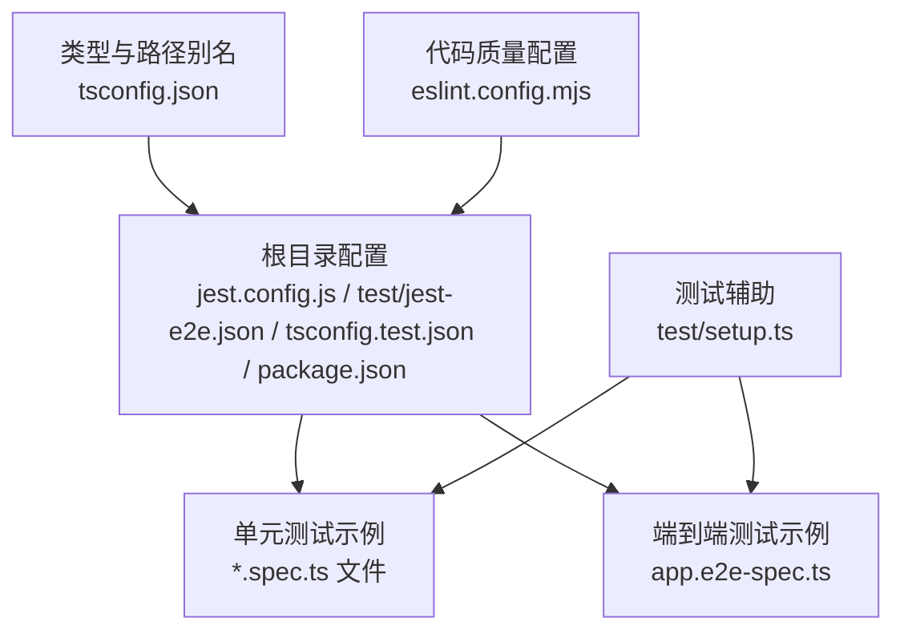
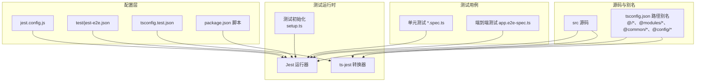
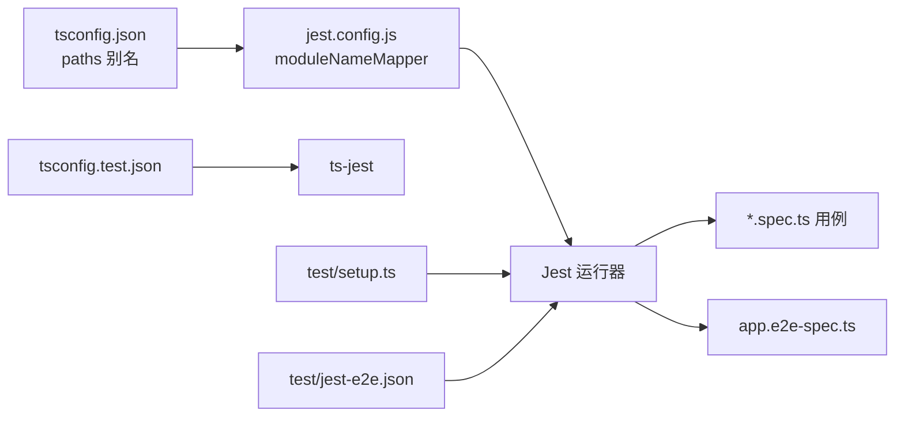

# 测试配置

<cite>
**本文引用的文件**
- [jest.config.js](file://jest.config.js)
- [test/jest-e2e.json](file://test/jest-e2e.json)
- [tsconfig.test.json](file://tsconfig.test.json)
- [package.json](file://package.json)
- [test/setup.ts](file://test/setup.ts)
- [src/common/filters/http-exception.filter.spec.ts](file://src/common/filters/http-exception.filter.spec.ts)
- [src/modules/auth/auth.controller.spec.ts](file://src/modules/auth/auth.controller.spec.ts)
- [src/modules/auth/auth.service.spec.ts](file://src/modules/auth/auth.service.spec.ts)
- [test/app.e2e-spec.ts](file://test/app.e2e-spec.ts)
- [tsconfig.json](file://tsconfig.json)
- [eslint.config.mjs](file://eslint.config.mjs)
</cite>

## 目录

1. [简介](#简介)
2. [项目结构](#项目结构)
3. [核心组件](#核心组件)
4. [架构总览](#架构总览)
5. [详细组件分析](#详细组件分析)
6. [依赖关系分析](#依赖关系分析)
7. [性能考量](#性能考量)
8. [故障排查指南](#故障排查指南)
9. [结论](#结论)
10. [附录](#附录)

## 简介

本文件系统性梳理本项目的测试配置与实践，重点覆盖：

- Jest 测试框架配置项与 TypeScript 测试配置
- 测试环境设置、模块路径映射与测试覆盖率配置
- 测试文件组织、测试运行器配置与测试报告生成
- 测试配置优化建议：并行测试执行、测试超时设置、内存管理
- 持续集成中的测试配置与自动化测试流水线设置

## 项目结构

本项目采用标准的 NestJS 结构，测试相关的关键目录与文件如下：

- 根目录配置：jest.config.js、test/jest-e2e.json、tsconfig.test.json、package.json
- 测试辅助：test/setup.ts
- 单元测试示例：src/common/filters/http-exception.filter.spec.ts、src/modules/auth/auth.controller.spec.ts、src/modules/auth/auth.service.spec.ts
- 端到端测试示例：test/app.e2e-spec.ts
- 类型与路径别名：tsconfig.json
- ESLint 配置：eslint.config.mjs

图表来源

- [jest.config.js:1-34](file://jest.config.js#L1-L34)
- [test/jest-e2e.json:1-10](file://test/jest-e2e.json#L1-L10)
- [tsconfig.test.json:1-8](file://tsconfig.test.json#L1-L8)
- [package.json:1-88](file://package.json#L1-L88)
- [test/setup.ts:1-47](file://test/setup.ts#L1-L47)
- [tsconfig.json:1-36](file://tsconfig.json#L1-L36)
- [eslint.config.mjs:1-42](file://eslint.config.mjs#L1-L42)

章节来源

- [jest.config.js:1-34](file://jest.config.js#L1-L34)
- [test/jest-e2e.json:1-10](file://test/jest-e2e.json#L1-L10)
- [tsconfig.test.json:1-8](file://tsconfig.test.json#L1-L8)
- [package.json:1-88](file://package.json#L1-L88)
- [test/setup.ts:1-47](file://test/setup.ts#L1-L47)
- [tsconfig.json:1-36](file://tsconfig.json#L1-L36)
- [eslint.config.mjs:1-42](file://eslint.config.mjs#L1-L42)

## 核心组件

- Jest 主配置（单元测试）
  - 模块扩展与根目录：moduleFileExtensions、rootDir
  - 测试正则匹配：testRegex
  - TypeScript 转换器与 tsconfig：transform、tsconfig.test.json
  - 覆盖率收集与阈值：collectCoverageFrom、coverageDirectory、coverageThreshold
  - 测试环境与初始化：testEnvironment、setupFilesAfterEnv
  - 模块路径映射：moduleNameMapper
- Jest E2E 配置
  - 根目录与环境：rootDir、testEnvironment
  - 测试正则匹配：testRegex
  - TypeScript 转换器：transform
- TypeScript 测试配置
  - 继承主 tsconfig 并限定 include：tsconfig.test.json
- 测试脚本与工具
  - package.json 中的测试脚本：test、test:watch、test:cov、test:debug、test:e2e
  - ESLint 对 Jest 的全局支持与忽略规则
- 测试辅助与模拟
  - 全局超时与清理：jest.setTimeout、afterEach 清理 mocks
  - Prisma/JWT 服务模拟：mockPrismaService、mockJwtService

章节来源

- [jest.config.js:1-34](file://jest.config.js#L1-L34)
- [test/jest-e2e.json:1-10](file://test/jest-e2e.json#L1-L10)
- [tsconfig.test.json:1-8](file://tsconfig.test.json#L1-L8)
- [package.json:1-88](file://package.json#L1-L88)
- [test/setup.ts:1-47](file://test/setup.ts#L1-L47)
- [eslint.config.mjs:1-42](file://eslint.config.mjs#L1-L42)

## 架构总览

下图展示测试配置在项目中的作用与交互关系。

图表来源

- [jest.config.js:1-34](file://jest.config.js#L1-L34)
- [test/jest-e2e.json:1-10](file://test/jest-e2e.json#L1-L10)
- [tsconfig.test.json:1-8](file://tsconfig.test.json#L1-L8)
- [package.json:1-88](file://package.json#L1-L88)
- [tsconfig.json:1-36](file://tsconfig.json#L1-L36)
- [test/setup.ts:1-47](file://test/setup.ts#L1-L47)

## 详细组件分析

### Jest 主配置（单元测试）

- 模块扩展与根目录
  - moduleFileExtensions：识别 js、json、ts 扩展
  - rootDir：测试扫描根目录为 src
- 测试匹配与转换
  - testRegex：仅匹配 \*.spec.ts 文件
  - transform：使用 ts-jest，并指定 tsconfig.test.json
- 覆盖率策略
  - collectCoverageFrom：包含所有 ts/js 文件，排除 spec/e2e 文件、main.ts、generated 目录
  - coverageDirectory：输出到 coverage 目录
  - coverageThreshold.global：分支、函数、行、语句均设为 80%
- 测试环境与初始化
  - testEnvironment：node 环境
  - setupFilesAfterEnv：加载 test/setup.ts，设置全局超时与 afterEach 清理
- 模块路径映射
  - moduleNameMapper：将 @/、@modules/、@common/、@config/ 映射到 src 下对应子目录，便于使用路径别名进行导入

章节来源

- [jest.config.js:1-34](file://jest.config.js#L1-L34)

### Jest E2E 配置

- 配置要点
  - moduleFileExtensions：js、json、ts
  - rootDir：根目录
  - testEnvironment：node
  - testRegex：匹配 .e2e-spec.ts
  - transform：ts-jest 转换

章节来源

- [test/jest-e2e.json:1-10](file://test/jest-e2e.json#L1-L10)

### TypeScript 测试配置

- 继承与包含
  - tsconfig.test.json 继承主 tsconfig.json，并通过 include 指定 src 与 test 下的 ts 文件
  - rootDir 在测试 tsconfig 中被重定向为当前目录，确保 ts-jest 正确解析相对路径

章节来源

- [tsconfig.test.json:1-8](file://tsconfig.test.json#L1-L8)
- [tsconfig.json:1-36](file://tsconfig.json#L1-L36)

### 测试脚本与工具

- npm/yarn/pnpm 脚本
  - test：运行 Jest 默认配置
  - test:watch：监听模式运行
  - test:cov：生成覆盖率报告
  - test:debug：启用断点调试
  - test:e2e：使用 test/jest-e2e.json 运行 E2E 测试
- ESLint 支持
  - eslint.config.mjs 声明 Jest 全局变量，避免规则误报；同时忽略 jest.config.js、dist、coverage 等目录

章节来源

- [package.json:1-88](file://package.json#L1-L88)
- [eslint.config.mjs:1-42](file://eslint.config.mjs#L1-L42)

### 测试辅助与模拟

- 全局超时与清理
  - jest.setTimeout 设置默认超时时间
  - afterEach 清理所有 mocks，避免跨用例污染
- Prisma/JWT 服务模拟
  - mockPrismaService：覆盖 PrismaService 的常用方法，如 user、refreshToken、role、menu 及 $transaction
  - mockJwtService：覆盖 signAsync、verifyAsync、decode 方法，返回可预测结果

章节来源

- [test/setup.ts:1-47](file://test/setup.ts#L1-L47)

### 测试文件组织与示例

- 单元测试组织
  - 使用 @nestjs/testing 创建 TestingModule，按需注入 provider 或替换为 mock
  - 使用 describe/it 组织测试场景，断言响应状态与 JSON 结构
- 示例用例
  - HttpExceptionFilter.spec.ts：验证异常过滤器对不同异常类型的处理
  - AuthController.spec.ts：验证控制器行为，依赖 mockAuthService、mockUserService、mockCaptchaService
  - AuthService.spec.ts：验证服务逻辑，依赖 PrismaService、UserService、JwtService、TypedConfigService 的 mock

章节来源

- [src/common/filters/http-exception.filter.spec.ts:1-136](file://src/common/filters/http-exception.filter.spec.ts#L1-L136)
- [src/modules/auth/auth.controller.spec.ts:1-191](file://src/modules/auth/auth.controller.spec.ts#L1-L191)
- [src/modules/auth/auth.service.spec.ts:1-303](file://src/modules/auth/auth.service.spec.ts#L1-L303)

### 端到端测试

- app.e2e-spec.ts
  - 使用 @nestjs/testing 创建应用实例，初始化后通过 supertest 发起 HTTP 请求
  - 断言 / 路由返回状态与内容
  - afterEach 关闭应用实例，释放资源

章节来源

- [test/app.e2e-spec.ts:1-30](file://test/app.e2e-spec.ts#L1-L30)

### 模块路径映射与别名

- tsconfig.json 中的 paths 定义了 @/_、@modules/_、@common/_、@config/_ 别名
- jest.config.js 的 moduleNameMapper 将这些别名映射到 src 下对应位置，保证测试中可以使用相同别名导入

章节来源

- [tsconfig.json:1-36](file://tsconfig.json#L1-L36)
- [jest.config.js:27-32](file://jest.config.js#L27-L32)

## 依赖关系分析

- 配置依赖
  - jest.config.js 依赖 tsconfig.test.json 提供 ts-jest 编译上下文
  - test/setup.ts 作为 setupFilesAfterEnv 被加载，影响所有测试用例
  - test/jest-e2e.json 独立于 jest.config.js，用于端到端测试
- 路径别名依赖
  - tsconfig.json 的 paths 与 jest.config.js 的 moduleNameMapper 必须保持一致，否则导入会失败
- 测试用例依赖
  - 单元测试通过 @nestjs/testing 注入 mock，减少对外部依赖的耦合
  - E2E 测试通过 TestingModule 初始化完整应用，验证真实路由与中间件链路

图表来源

- [tsconfig.json:1-36](file://tsconfig.json#L1-L36)
- [jest.config.js:1-34](file://jest.config.js#L1-L34)
- [tsconfig.test.json:1-8](file://tsconfig.test.json#L1-L8)
- [test/setup.ts:1-47](file://test/setup.ts#L1-L47)
- [test/jest-e2e.json:1-10](file://test/jest-e2e.json#L1-L10)

章节来源

- [tsconfig.json:1-36](file://tsconfig.json#L1-L36)
- [jest.config.js:1-34](file://jest.config.js#L1-L34)
- [tsconfig.test.json:1-8](file://tsconfig.test.json#L1-L8)
- [test/setup.ts:1-47](file://test/setup.ts#L1-L47)
- [test/jest-e2e.json:1-10](file://test/jest-e2e.json#L1-L10)

## 性能考量

- 并行测试执行
  - Jest 默认并发执行测试文件，可通过配置控制并发度与 worker 数量，以平衡 CPU 与内存占用
- 测试超时设置
  - 全局超时已通过 setup.ts 设置，可根据复杂用例适当调整
- 内存管理
  - afterEach 清理所有 mocks，避免内存泄漏
  - E2E 用例在 afterEach 关闭应用实例，释放连接与资源
- 覆盖率与性能权衡
  - coverageThreshold 设为 80%，在保证质量的同时兼顾构建时间
  - collectCoverageFrom 排除非业务文件与生成代码，减少不必要开销

章节来源

- [test/setup.ts:1-47](file://test/setup.ts#L1-L47)
- [test/app.e2e-spec.ts:1-30](file://test/app.e2e-spec.ts#L1-L30)
- [jest.config.js:17-24](file://jest.config.js#L17-L24)

## 故障排查指南

- 导入别名失效
  - 确认 tsconfig.json 的 paths 与 jest.config.js 的 moduleNameMapper 保持一致
- TypeScript 编译错误
  - 确保 tsconfig.test.json 包含 src 与 test 下的 ts 文件，并正确继承主 tsconfig
- 覆盖率不更新
  - 检查 collectCoverageFrom 是否排除了目标文件，确认 coverageDirectory 输出路径存在
- E2E 失败
  - 确认使用 test:e2e 脚本与 test/jest-e2e.json 配置，检查 supertest 请求与路由实现
- 调试困难
  - 使用 test:debug 脚本启用断点调试，结合 ts-node 与 tsconfig-paths

章节来源

- [tsconfig.json:1-36](file://tsconfig.json#L1-L36)
- [jest.config.js:1-34](file://jest.config.js#L1-L34)
- [tsconfig.test.json:1-8](file://tsconfig.test.json#L1-L8)
- [package.json:1-88](file://package.json#L1-L88)
- [test/jest-e2e.json:1-10](file://test/jest-e2e.json#L1-L10)

## 结论

本项目的测试配置遵循“配置集中、路径统一、覆盖率可控”的原则，通过 Jest + ts-jest 实现 TypeScript 测试，配合 @nestjs/testing 与自定义 mock，既保证了单元测试的稳定性，也提供了端到端验证能力。建议在 CI 中开启覆盖率报告与并行执行，结合合理的超时与内存管理策略，进一步提升测试效率与可靠性。

## 附录

- 持续集成建议
  - 使用 test 脚本运行单元测试，test:e2e 运行端到端测试
  - 在 CI 中缓存 node_modules 与 Jest 缓存目录，加速构建
  - 合理设置并发度与超时，避免资源不足导致的不稳定
- 自动化测试流水线
  - 触发条件：PR/MR 合并请求、主分支推送
  - 步骤：安装依赖、类型检查、单元测试、覆盖率上传、E2E 测试、静态分析
