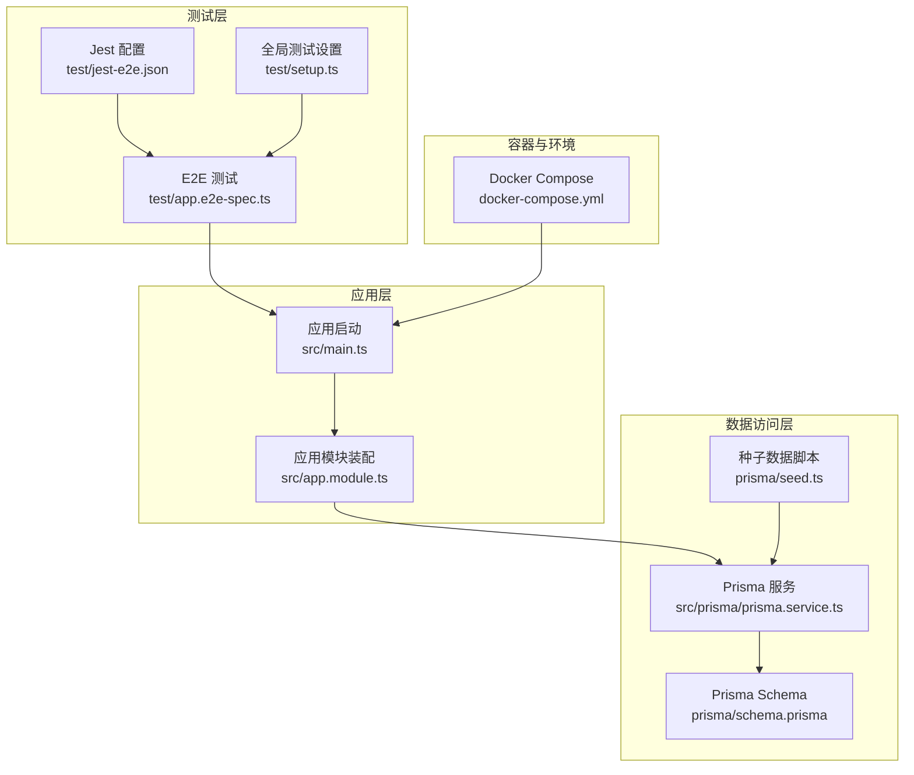
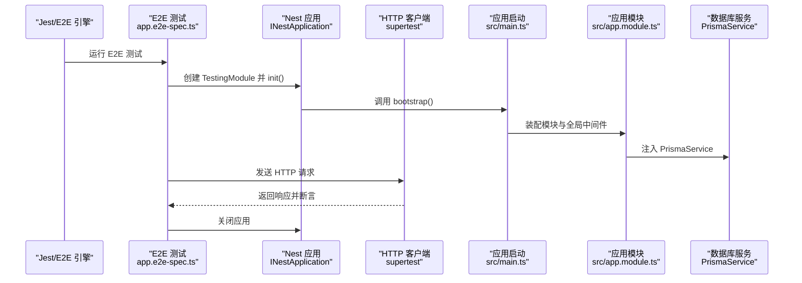
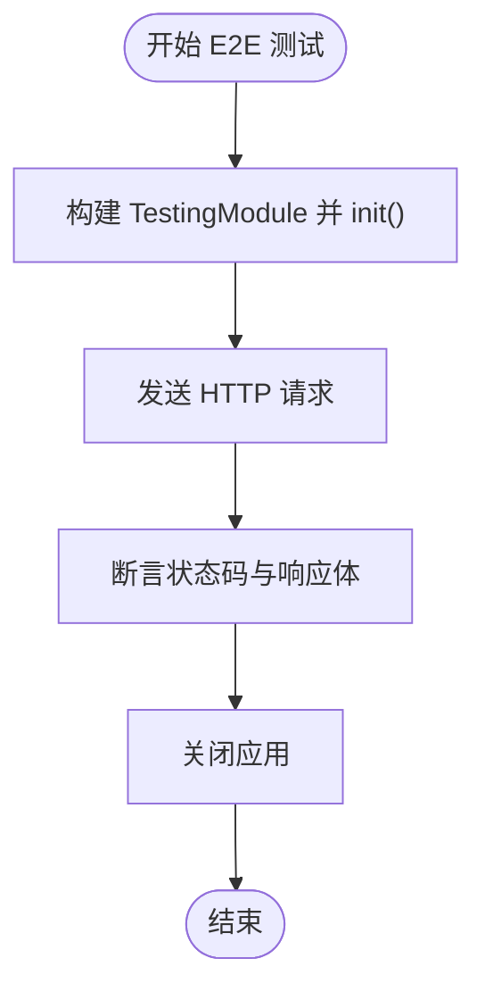
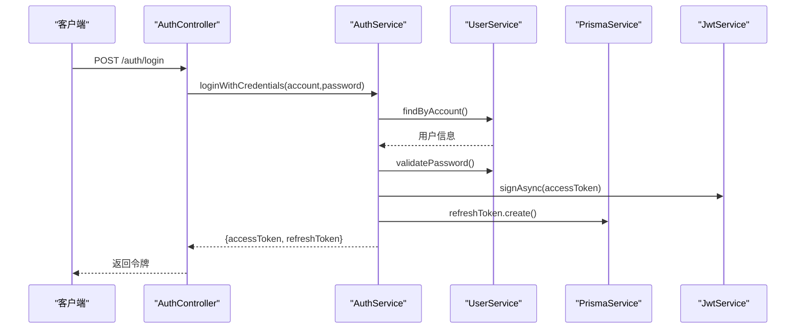
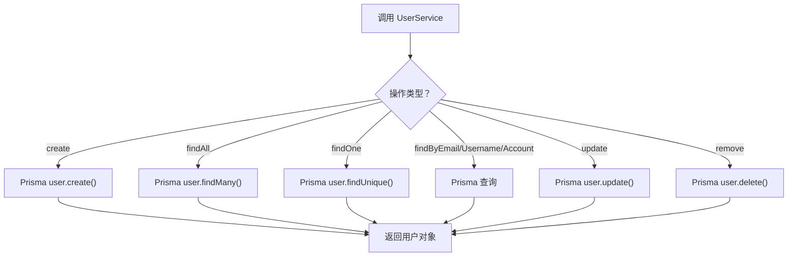
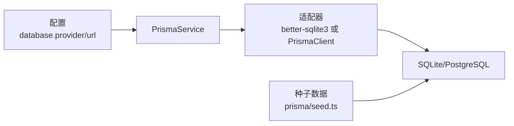
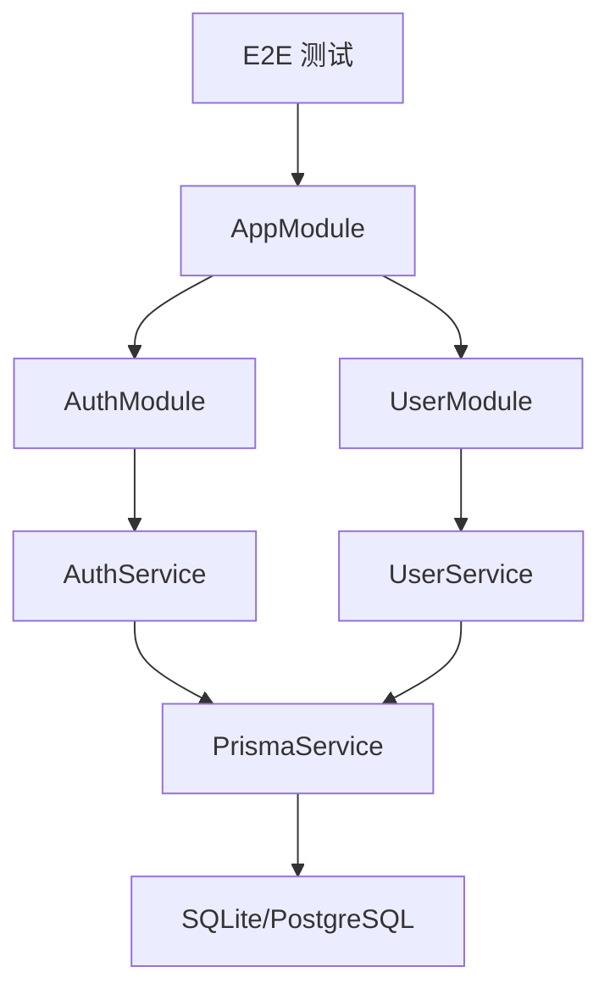

# 集成测试

<cite>
**本文引用的文件**
- [test/app.e2e-spec.ts](file://test/app.e2e-spec.ts)
- [test/setup.ts](file://test/setup.ts)
- [test/jest-e2e.json](file://test/jest-e2e.json)
- [jest.config.js](file://jest.config.js)
- [src/app.module.ts](file://src/app.module.ts)
- [src/main.ts](file://src/main.ts)
- [src/prisma/prisma.service.ts](file://src/prisma/prisma.service.ts)
- [prisma/schema.prisma](file://prisma/schema.prisma)
- [prisma/seed.ts](file://prisma/seed.ts)
- [docker-compose.yml](file://docker-compose.yml)
- [src/modules/auth/auth.controller.spec.ts](file://src/modules/auth/auth.controller.spec.ts)
- [src/modules/auth/auth.service.spec.ts](file://src/modules/auth/auth.service.spec.ts)
- [src/modules/user/user.service.spec.ts](file://src/modules/user/user.service.spec.ts)
- [package.json](file://package.json)
</cite>

## 目录

1. [简介](#简介)
2. [项目结构](#项目结构)
3. [核心组件](#核心组件)
4. [架构总览](#架构总览)
5. [详细组件分析](#详细组件分析)
6. [依赖关系分析](#依赖关系分析)
7. [性能考虑](#性能考虑)
8. [故障排查指南](#故障排查指南)
9. [结论](#结论)
10. [附录](#附录)

## 简介

本文件系统化阐述该 NestJS 项目的集成测试设计与实现方法，覆盖端到端测试（E2E）、数据库连接管理、API 接口测试策略、认证流程测试、用户操作测试与业务流程验证，并提供测试数据管理、测试环境隔离与测试自动化配置建议。同时包含测试失败排查、性能测试与负载测试方法，帮助团队建立稳定可靠的测试体系。

## 项目结构

该项目采用标准 NestJS 结构，测试相关目录与文件如下：

- 测试入口与配置：test 目录下的 E2E 示例与 Jest 配置
- 单元测试配置：根目录 jest.config.js
- 应用启动与模块装配：src/main.ts、src/app.module.ts
- 数据库适配与连接：src/prisma/prisma.service.ts、prisma/schema.prisma
- 初始化脚本：prisma/seed.ts
- 容器编排：docker-compose.yml
- 模块测试样例：auth、user 模块的控制器与服务测试

图表来源

- [test/app.e2e-spec.ts:1-30](file://test/app.e2e-spec.ts#L1-L30)
- [test/jest-e2e.json:1-10](file://test/jest-e2e.json#L1-L10)
- [test/setup.ts:1-47](file://test/setup.ts#L1-L47)
- [src/main.ts:1-50](file://src/main.ts#L1-L50)
- [src/app.module.ts:1-61](file://src/app.module.ts#L1-L61)
- [src/prisma/prisma.service.ts:1-44](file://src/prisma/prisma.service.ts#L1-L44)
- [prisma/schema.prisma:1-13](file://prisma/schema.prisma#L1-L13)
- [prisma/seed.ts:1-41](file://prisma/seed.ts#L1-L41)
- [docker-compose.yml:1-37](file://docker-compose.yml#L1-L37)

章节来源

- [test/app.e2e-spec.ts:1-30](file://test/app.e2e-spec.ts#L1-L30)
- [test/jest-e2e.json:1-10](file://test/jest-e2e.json#L1-L10)
- [test/setup.ts:1-47](file://test/setup.ts#L1-L47)
- [jest.config.js:1-34](file://jest.config.js#L1-L34)
- [src/main.ts:1-50](file://src/main.ts#L1-L50)
- [src/app.module.ts:1-61](file://src/app.module.ts#L1-L61)
- [src/prisma/prisma.service.ts:1-44](file://src/prisma/prisma.service.ts#L1-L44)
- [prisma/schema.prisma:1-13](file://prisma/schema.prisma#L1-L13)
- [prisma/seed.ts:1-41](file://prisma/seed.ts#L1-L41)
- [docker-compose.yml:1-37](file://docker-compose.yml#L1-L37)

## 核心组件

- E2E 测试框架与入口
  - 使用 @nestjs/testing 构建 TestingModule，初始化 INestApplication 并通过 supertest 发起 HTTP 请求
  - 典型断言包括状态码与响应体校验
- 测试环境与配置
  - Jest E2E 配置：test/jest-e2e.json 指定测试正则与转换规则
  - 全局设置：test/setup.ts 设置超时、清理 mocks、提供 Prisma 与 JWT 的模拟对象
  - 单元测试配置：jest.config.js 提供路径映射、覆盖率阈值与 setupFilesAfterEnv
- 数据库连接与适配
  - PrismaService 基于配置选择 sqlite 或 PostgreSQL 适配器，自动连接/断开
  - schema.prisma 指定 sqlite provider；生产环境可通过 docker-compose 使用 PostgreSQL
  - seed.ts 提供初始管理员用户，便于测试认证与权限场景
- 应用启动与模块装配
  - main.ts 启动应用、注册全局前缀、CORS、Swagger（可选）
  - app.module.ts 装配 Auth、User、Health、Cache、Logger 等模块及全局守卫/拦截器/过滤器

章节来源

- [test/app.e2e-spec.ts:1-30](file://test/app.e2e-spec.ts#L1-L30)
- [test/jest-e2e.json:1-10](file://test/jest-e2e.json#L1-L10)
- [test/setup.ts:1-47](file://test/setup.ts#L1-L47)
- [jest.config.js:1-34](file://jest.config.js#L1-L34)
- [src/prisma/prisma.service.ts:1-44](file://src/prisma/prisma.service.ts#L1-L44)
- [prisma/schema.prisma:1-13](file://prisma/schema.prisma#L1-L13)
- [prisma/seed.ts:1-41](file://prisma/seed.ts#L1-L41)
- [src/main.ts:1-50](file://src/main.ts#L1-L50)
- [src/app.module.ts:1-61](file://src/app.module.ts#L1-L61)

## 架构总览

下图展示从 E2E 测试到应用启动、数据库连接与模块装配的整体流程，以及测试期间的依赖注入与模拟对象使用。

图表来源

- [test/app.e2e-spec.ts:10-28](file://test/app.e2e-spec.ts#L10-L28)
- [src/main.ts:8-35](file://src/main.ts#L8-L35)
- [src/app.module.ts:18-60](file://src/app.module.ts#L18-L60)
- [src/prisma/prisma.service.ts:18-42](file://src/prisma/prisma.service.ts#L18-L42)

## 详细组件分析

### E2E 测试设计与实现

- 测试生命周期
  - beforeEach 中构建 TestingModule，创建 Nest 应用并 init
  - afterEach 中关闭应用，确保资源释放
- 请求与断言
  - 使用 supertest 对应用 HTTP 服务器发起请求
  - 断言状态码与响应体内容
- 可扩展性
  - 可在测试中注入真实服务或替换为模拟对象，以支持不同场景（认证、权限、事务等）

图表来源

- [test/app.e2e-spec.ts:10-28](file://test/app.e2e-spec.ts#L10-L28)

章节来源

- [test/app.e2e-spec.ts:1-30](file://test/app.e2e-spec.ts#L1-L30)

### 认证流程测试策略

- 测试目标
  - 验证登录、注册、刷新令牌、登出与获取用户资料等接口行为
  - 校验验证码生成与校验流程
- 测试要点
  - 登录：校验凭据正确性、密码验证、JWT 签发与刷新令牌持久化
  - 注册：邮箱/用户名唯一性约束、密码加密、返回令牌
  - 刷新：旧令牌哈希匹配、撤销旧令牌、签发新令牌
  - 登出：撤销用户所有未撤销的刷新令牌
  - 获取资料：鉴权后返回用户信息（含空名字段处理）
- 模拟对象
  - 使用 test/setup.ts 提供的 mockPrismaService 与 mockJwtService 控制数据库与 JWT 行为

图表来源

- [src/modules/auth/auth.controller.spec.ts:87-114](file://src/modules/auth/auth.controller.spec.ts#L87-L114)
- [src/modules/auth/auth.service.spec.ts:71-98](file://src/modules/auth/auth.service.spec.ts#L71-L98)
- [test/setup.ts:7-46](file://test/setup.ts#L7-L46)

章节来源

- [src/modules/auth/auth.controller.spec.ts:1-191](file://src/modules/auth/auth.controller.spec.ts#L1-L191)
- [src/modules/auth/auth.service.spec.ts:1-303](file://src/modules/auth/auth.service.spec.ts#L1-L303)
- [test/setup.ts:1-47](file://test/setup.ts#L1-L47)

### 用户操作测试策略

- 测试目标
  - 验证用户创建、查询列表、按 ID/账号查询、更新与删除等操作
  - 校验密码比较逻辑与业务异常抛出
- 测试要点
  - create：密码哈希、返回字段一致性
  - findAll：分页/筛选（如需）、字段选择
  - findOne/findByEmail/findByUsername：存在与不存在场景
  - findByAccount：邮箱或用户名任一命中
  - update/remove：存在性校验、业务异常
  - validatePassword：bcrypt 比较结果
- 模拟对象
  - 使用 mockPrismaService.user 的对应方法控制数据库行为

图表来源

- [src/modules/user/user.service.spec.ts:46-436](file://src/modules/user/user.service.spec.ts#L46-L436)
- [test/setup.ts:16-25](file://test/setup.ts#L16-L25)

章节来源

- [src/modules/user/user.service.spec.ts:1-437](file://src/modules/user/user.service.spec.ts#L1-L437)

### 数据库连接管理与测试数据

- 连接策略
  - PrismaService 根据配置选择 sqlite 或 PostgreSQL 适配器，自动 onModuleInit/onModuleDestroy
  - schema.prisma 默认 sqlite；生产环境通过 docker-compose 使用 PostgreSQL
- 测试数据
  - seed.ts 提供固定管理员账户，便于认证与权限测试
  - E2E 测试可在测试前执行 seed 或使用独立测试数据库，避免污染
- 隔离与回滚
  - 建议每个测试用例使用独立数据库实例或事务回滚（结合 Prisma 事务）

图表来源

- [src/prisma/prisma.service.ts:18-42](file://src/prisma/prisma.service.ts#L18-L42)
- [prisma/schema.prisma:10-12](file://prisma/schema.prisma#L10-L12)
- [prisma/seed.ts:11-31](file://prisma/seed.ts#L11-L31)

章节来源

- [src/prisma/prisma.service.ts:1-44](file://src/prisma/prisma.service.ts#L1-L44)
- [prisma/schema.prisma:1-13](file://prisma/schema.prisma#L1-L13)
- [prisma/seed.ts:1-41](file://prisma/seed.ts#L1-L41)

### API 接口测试策略

- 路由与前缀
  - main.ts 设置全局前缀与 CORS，E2E 测试应遵循该前缀
- 鉴权与拦截器
  - app.module.ts 注入 JwtAuthGuard、ThrottlerGuard、LoggingInterceptor、TransformInterceptor、HttpExceptionFilter
  - E2E 测试可直接访问受保护路由，或在测试中模拟用户上下文
- Swagger 文档
  - 可选启用 Swagger，便于手动验证与回归测试

章节来源

- [src/main.ts:14-33](file://src/main.ts#L14-L33)
- [src/app.module.ts:18-60](file://src/app.module.ts#L18-L60)

### 测试环境隔离与自动化配置

- 环境变量
  - 开发/测试使用 sqlite（schema.prisma），生产使用 PostgreSQL（docker-compose）
  - JWT 密钥与 TTL 在环境变量中配置，E2E 可复用相同密钥以简化令牌验证
- 自动化脚本
  - package.json 提供 test、test:e2e、test:watch、test:cov 等命令
  - jest.config.js 与 test/jest-e2e.json 分别管理单元测试与 E2E 测试的配置
- 全局设置
  - test/setup.ts 统一设置 Jest 超时、清理 mocks、提供模拟服务

章节来源

- [docker-compose.yml:6-14](file://docker-compose.yml#L6-L14)
- [prisma/schema.prisma:10-12](file://prisma/schema.prisma#L10-L12)
- [package.json:8-25](file://package.json#L8-L25)
- [jest.config.js:1-34](file://jest.config.js#L1-L34)
- [test/jest-e2e.json:1-10](file://test/jest-e2e.json#L1-L10)
- [test/setup.ts:1-5](file://test/setup.ts#L1-L5)

## 依赖关系分析

- 组件耦合
  - E2E 测试仅依赖 AppModule 的公共接口，通过 TestingModule 解耦具体实现
  - Auth/User 模块通过服务层与 PrismaService 交互，便于在测试中替换
- 外部依赖
  - supertest 用于 HTTP 请求模拟
  - Jest 与 ts-jest 用于测试运行与 TypeScript 支持
  - Prisma 适配器根据配置切换数据库

图表来源

- [src/app.module.ts:18-32](file://src/app.module.ts#L18-L32)
- [src/modules/auth/auth.controller.spec.ts:32-48](file://src/modules/auth/auth.controller.spec.ts#L32-L48)
- [src/modules/user/user.service.spec.ts:30-44](file://src/modules/user/user.service.spec.ts#L30-L44)
- [src/prisma/prisma.service.ts:18-42](file://src/prisma/prisma.service.ts#L18-L42)

章节来源

- [src/app.module.ts:1-61](file://src/app.module.ts#L1-L61)
- [src/modules/auth/auth.controller.spec.ts:1-191](file://src/modules/auth/auth.controller.spec.ts#L1-L191)
- [src/modules/user/user.service.spec.ts:1-437](file://src/modules/user/user.service.spec.ts#L1-L437)
- [src/prisma/prisma.service.ts:1-44](file://src/prisma/prisma.service.ts#L1-L44)

## 性能考虑

- 压力测试
  - 使用压测工具（如 k6、Artillery）对关键接口进行并发与吞吐测试
  - 关注数据库连接池上限、JWT 签发/校验耗时、缓存命中率
- 资源管理
  - E2E 测试中合理复用应用实例，避免频繁创建销毁带来的开销
  - 使用事务或临时表隔离测试数据，减少重复初始化成本
- 监控与日志
  - 启用 LoggingInterceptor 与日志模块，定位慢查询与异常路径
  - 在 CI 中记录测试覆盖率与关键指标，形成回归基线

## 故障排查指南

- 常见问题
  - 数据库连接失败：检查 PrismaService 配置与 docker-compose 健康检查
  - JWT 验证失败：确认环境变量中的密钥与 TTL，确保测试中使用一致的密钥
  - 路由 404：核对全局前缀与路由定义
  - Mock 不生效：确认 jest.config.js 的 moduleNameMapper 与 setupFilesAfterEnv
- 排查步骤
  - 启用 Swagger 查看接口文档与示例
  - 在测试中打印关键参数与返回值，定位断言失败点
  - 使用 --debug 参数调试单个测试用例

章节来源

- [src/prisma/prisma.service.ts:18-42](file://src/prisma/prisma.service.ts#L18-L42)
- [docker-compose.yml:29-33](file://docker-compose.yml#L29-L33)
- [jest.config.js:27-32](file://jest.config.js#L27-L32)
- [src/main.ts:22-33](file://src/main.ts#L22-L33)

## 结论

本项目已具备完善的测试基础设施：E2E 测试入口、Jest 配置、数据库适配与种子数据、模块化服务与模拟对象。通过本文档的方法论与最佳实践，团队可以进一步扩展认证、用户与业务流程的端到端测试，建立稳定、可维护且可自动化的测试体系。

## 附录

- 建议的测试数据管理
  - 使用 Prisma 事务或临时数据库隔离每条测试用例
  - 在 CI 中预热 seed 数据，减少冷启动时间
- 测试环境隔离
  - 开发使用 sqlite，CI 使用 PostgreSQL，确保与生产一致
  - 通过环境变量切换数据库 URL 与 JWT 密钥
- 测试自动化
  - 在 CI 中执行 test 与 test:e2e，收集覆盖率报告
  - 将 Swagger 作为回归测试辅助工具，定期验证核心接口
