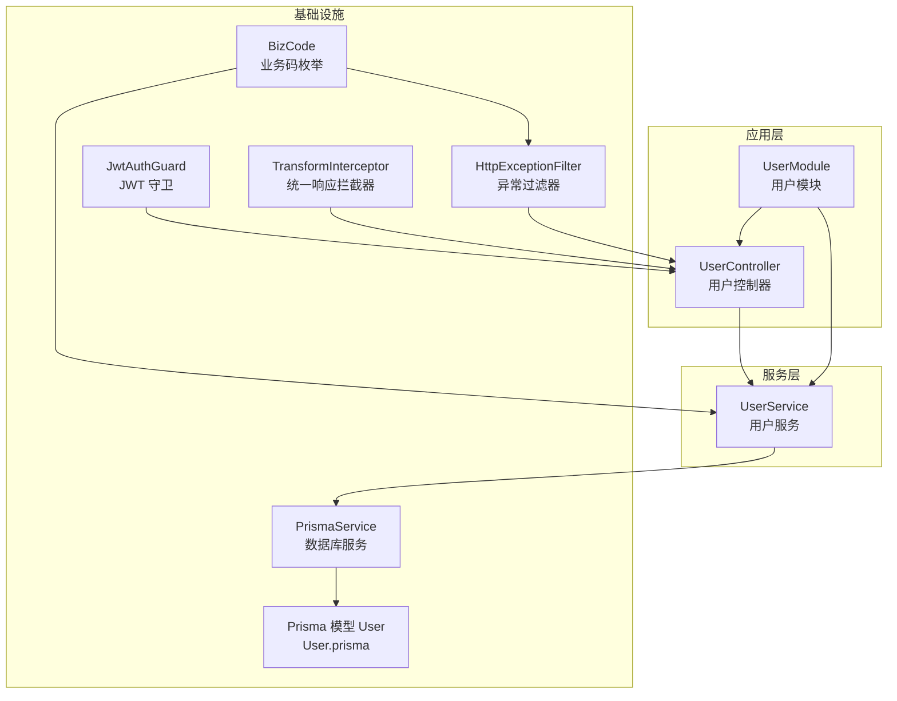
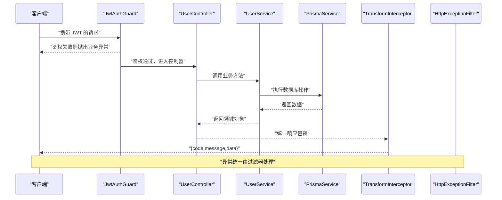
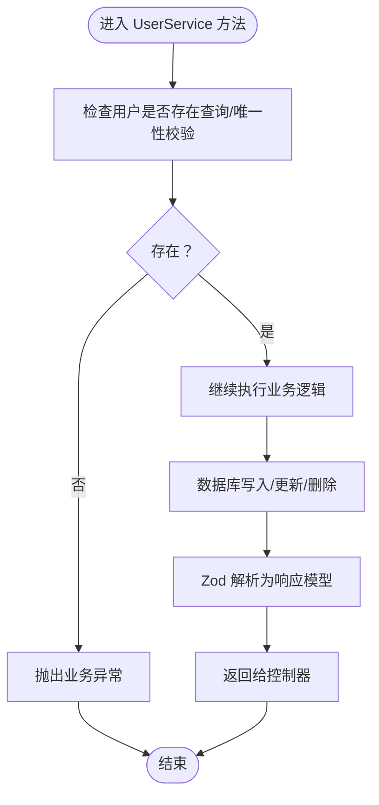
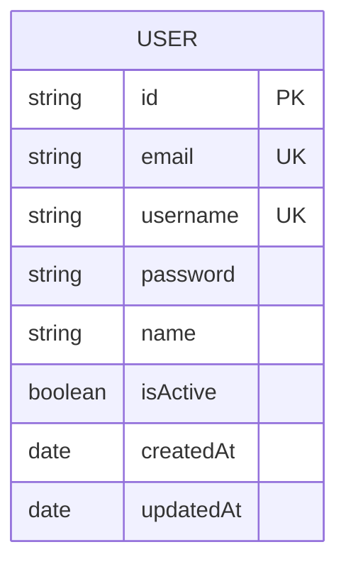
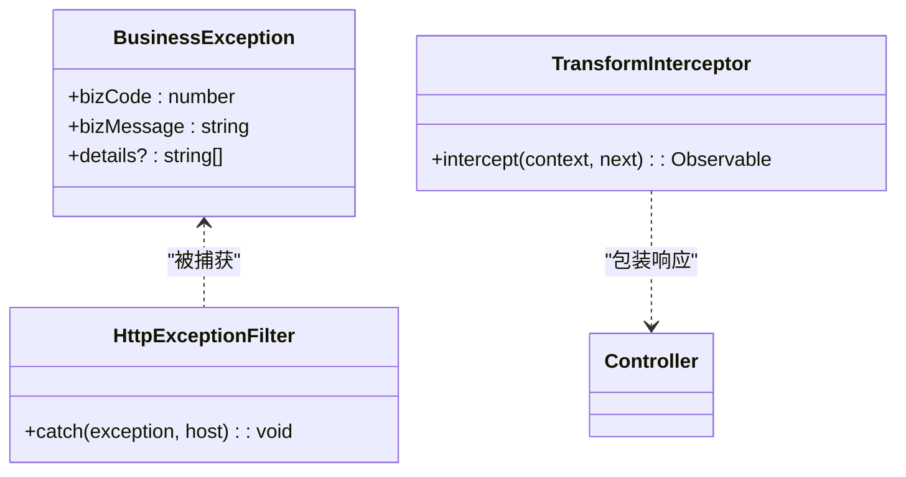
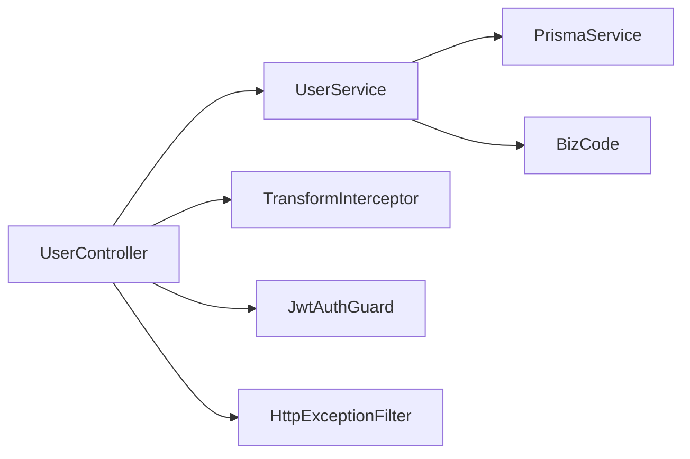

# 用户 CRUD 操作

<cite>
**本文引用的文件**
- [src/modules/user/user.controller.ts](file://src/modules/user/user.controller.ts)
- [src/modules/user/user.service.ts](file://src/modules/user/user.service.ts)
- [src/modules/user/dto/user.dto.ts](file://src/modules/user/dto/user.dto.ts)
- [src/modules/user/user.module.ts](file://src/modules/user/user.module.ts)
- [prisma/schema/User.prisma](file://prisma/schema/User.prisma)
- [src/common/decorators/api-success-response.decorator.ts](file://src/common/decorators/api-success-response.decorator.ts)
- [src/common/enums/biz-code.enum.ts](file://src/common/enums/biz-code.enum.ts)
- [src/common/exceptions/business.exception.ts](file://src/common/exceptions/business.exception.ts)
- [src/common/guards/jwt-auth.guard.ts](file://src/common/guards/jwt-auth.guard.ts)
- [src/common/interceptors/transform.interceptor.ts](file://src/common/interceptors/transform.interceptor.ts)
- [src/common/filters/http-exception.filter.ts](file://src/common/filters/http-exception.filter.ts)
- [src/common/decorators/public.decorator.ts](file://src/common/decorators/public.decorator.ts)
- [src/common/interfaces/user.interface.ts](file://src/common/interfaces/user.interface.ts)
- [src/app.module.ts](file://src/app.module.ts)
</cite>

## 目录

1. [简介](#简介)
2. [项目结构](#项目结构)
3. [核心组件](#核心组件)
4. [架构总览](#架构总览)
5. [详细组件分析](#详细组件分析)
6. [依赖关系分析](#依赖关系分析)
7. [性能考虑](#性能考虑)
8. [故障排查指南](#故障排查指南)
9. [结论](#结论)
10. [附录：API 接口文档](#附录api-接口文档)

## 简介

本文件面向“用户 CRUD 操作”的完整实现，覆盖控制器层的路由定义、参数处理与响应格式；服务层的业务逻辑、数据验证、事务与错误处理；以及统一的权限验证、数据访问控制与安全防护。文档同时提供可复用的 API 接口规范、错误码说明与常见使用场景。

## 项目结构

用户模块采用典型的分层设计：

- 控制器层：定义 REST 路由、接收请求参数、调用服务层并返回统一响应。
- 服务层：封装业务逻辑，进行数据校验、密码加密、数据库操作与结果转换。
- DTO 层：使用 Zod 定义请求/响应的数据结构与约束。
- 基础设施：Prisma 数据模型、全局守卫/拦截器/过滤器、业务码枚举与异常类。

图表来源

- [src/modules/user/user.controller.ts:28-87](file://src/modules/user/user.controller.ts#L28-L87)
- [src/modules/user/user.service.ts:14-124](file://src/modules/user/user.service.ts#L14-L124)
- [prisma/schema/User.prisma:1-15](file://prisma/schema/User.prisma#L1-L15)
- [src/common/guards/jwt-auth.guard.ts:17-45](file://src/common/guards/jwt-auth.guard.ts#L17-L45)
- [src/common/interceptors/transform.interceptor.ts:14-40](file://src/common/interceptors/transform.interceptor.ts#L14-L40)
- [src/common/filters/http-exception.filter.ts:24-78](file://src/common/filters/http-exception.filter.ts#L24-L78)
- [src/common/enums/biz-code.enum.ts:13-78](file://src/common/enums/biz-code.enum.ts#L13-L78)

章节来源

- [src/modules/user/user.controller.ts:28-87](file://src/modules/user/user.controller.ts#L28-L87)
- [src/modules/user/user.service.ts:14-124](file://src/modules/user/user.service.ts#L14-L124)
- [src/modules/user/user.module.ts:1-11](file://src/modules/user/user.module.ts#L1-L11)
- [src/app.module.ts:18-60](file://src/app.module.ts#L18-L60)

## 核心组件

- 用户控制器：暴露 /users 的 CRUD 路由，使用 Swagger 装饰器标注接口行为与响应结构。
- 用户服务：负责用户创建（密码加密）、查询、更新、删除，使用 Prisma 进行数据库访问，并通过 Zod Schema 校验与转换响应。
- DTO：定义创建、更新与响应的数据结构及约束。
- 安全与统一响应：全局 JWT 守卫保证鉴权，统一拦截器包装响应，异常过滤器统一错误输出。

章节来源

- [src/modules/user/user.controller.ts:28-87](file://src/modules/user/user.controller.ts#L28-L87)
- [src/modules/user/user.service.ts:17-106](file://src/modules/user/user.service.ts#L17-L106)
- [src/modules/user/dto/user.dto.ts:5-39](file://src/modules/user/dto/user.dto.ts#L5-L39)
- [src/common/interceptors/transform.interceptor.ts:14-40](file://src/common/interceptors/transform.interceptor.ts#L14-L40)
- [src/common/guards/jwt-auth.guard.ts:17-45](file://src/common/guards/jwt-auth.guard.ts#L17-L45)

## 架构总览

用户模块的调用链路如下：

图表来源

- [src/common/guards/jwt-auth.guard.ts:23-44](file://src/common/guards/jwt-auth.guard.ts#L23-L44)
- [src/modules/user/user.controller.ts:31-86](file://src/modules/user/user.controller.ts#L31-L86)
- [src/modules/user/user.service.ts:17-106](file://src/modules/user/user.service.ts#L17-L106)
- [src/common/interceptors/transform.interceptor.ts:21-39](file://src/common/interceptors/transform.interceptor.ts#L21-L39)
- [src/common/filters/http-exception.filter.ts:28-78](file://src/common/filters/http-exception.filter.ts#L28-L78)

## 详细组件分析

### 控制器层：路由与响应

- 路由定义
  - POST /users：创建用户，返回 201 与统一响应结构。
  - GET /users：获取用户列表。
  - GET /users/:id：按 ID 获取用户。
  - PATCH /users/:id：更新用户。
  - DELETE /users/:id：删除用户，返回空数据的统一响应。
- 参数处理
  - 使用 Zod DTO 自动校验请求体与路径参数。
  - Swagger 装饰器提供接口描述与响应模型。
- 响应格式
  - 统一为 { code, message, data } 结构，其中 data 可能为对象或数组。
  - 无数据的删除接口使用“无数据响应”装饰器。

章节来源

- [src/modules/user/user.controller.ts:28-87](file://src/modules/user/user.controller.ts#L28-L87)
- [src/common/decorators/api-success-response.decorator.ts:88-128](file://src/common/decorators/api-success-response.decorator.ts#L88-L128)

### 服务层：业务逻辑与数据访问

- 创建用户
  - 校验邮箱唯一性，抛出业务异常。
  - 密码使用 bcrypt 加密后写入数据库。
  - 使用 select 投影确保不返回敏感字段。
  - 返回 Zod 校验后的响应对象。
- 查询用户
  - findAll：返回用户列表，逐条解析。
  - findOne：按 ID 查询，不存在则抛出业务异常。
  - findByEmail/findByUsername/findByAccount：多入口查询辅助。
- 更新与删除
  - update：先校验用户存在，再更新并返回。
  - remove：先校验用户存在，再删除。
- 密码校验
  - validatePassword：使用 bcrypt 比较明文与哈希密码。

图表来源

- [src/modules/user/user.service.ts:17-106](file://src/modules/user/user.service.ts#L17-L106)
- [src/common/enums/biz-code.enum.ts:47-52](file://src/common/enums/biz-code.enum.ts#L47-L52)

章节来源

- [src/modules/user/user.service.ts:17-106](file://src/modules/user/user.service.ts#L17-L106)

### DTO 与数据模型

- CreateUserSchema：邮箱、用户名、密码、可选显示名称。
- UpdateUserSchema：基于部分创建模型且排除密码字段。
- UserResponseSchema：定义对外响应字段（不含密码）。
- Prisma 模型 User：包含唯一索引（email、username）、布尔启用字段、时间戳等。

图表来源

- [prisma/schema/User.prisma:1-15](file://prisma/schema/User.prisma#L1-L15)
- [src/modules/user/dto/user.dto.ts:5-39](file://src/modules/user/dto/user.dto.ts#L5-L39)

章节来源

- [src/modules/user/dto/user.dto.ts:5-39](file://src/modules/user/dto/user.dto.ts#L5-L39)
- [prisma/schema/User.prisma:1-15](file://prisma/schema/User.prisma#L1-L15)

### 安全与权限控制

- JWT 守卫：全局启用，拦截未携带有效令牌或令牌无效的请求，统一抛出业务异常。
- 公开接口：可通过公共装饰器豁免鉴权（仅对特定端点开放）。
- 用户载荷：守卫将用户信息注入请求上下文，供后续中间件/控制器使用。

章节来源

- [src/common/guards/jwt-auth.guard.ts:17-45](file://src/common/guards/jwt-auth.guard.ts#L17-L45)
- [src/common/decorators/public.decorator.ts:3-4](file://src/common/decorators/public.decorator.ts#L3-L4)
- [src/common/interfaces/user.interface.ts:6-9](file://src/common/interfaces/user.interface.ts#L6-L9)

### 统一响应与异常处理

- 统一响应拦截器：将控制器返回值包装为 { code, message, data }，并支持自定义 message 元数据。
- 异常过滤器：捕获 HttpException，区分业务异常与通用异常，映射为业务码与消息，支持 Zod 校验错误详情。
- 业务码枚举：定义用户模块的业务码范围与默认消息，提供 HTTP 状态码映射。

图表来源

- [src/common/exceptions/business.exception.ts:16-41](file://src/common/exceptions/business.exception.ts#L16-L41)
- [src/common/filters/http-exception.filter.ts:24-78](file://src/common/filters/http-exception.filter.ts#L24-L78)
- [src/common/interceptors/transform.interceptor.ts:14-40](file://src/common/interceptors/transform.interceptor.ts#L14-L40)

章节来源

- [src/common/interceptors/transform.interceptor.ts:21-39](file://src/common/interceptors/transform.interceptor.ts#L21-L39)
- [src/common/filters/http-exception.filter.ts:28-78](file://src/common/filters/http-exception.filter.ts#L28-L78)
- [src/common/enums/biz-code.enum.ts:127-170](file://src/common/enums/biz-code.enum.ts#L127-L170)

## 依赖关系分析

- 控制器依赖服务：控制器只负责编排，具体业务由服务实现。
- 服务依赖 Prisma：通过 PrismaService 访问数据库，使用 select 投影避免敏感字段泄露。
- 全局依赖：JWT 守卫、拦截器、过滤器在应用级注册，确保所有路由一致的安全与响应策略。

图表来源

- [src/modules/user/user.controller.ts:28-87](file://src/modules/user/user.controller.ts#L28-L87)
- [src/modules/user/user.service.ts:14-124](file://src/modules/user/user.service.ts#L14-L124)
- [src/app.module.ts:33-57](file://src/app.module.ts#L33-L57)

章节来源

- [src/app.module.ts:33-57](file://src/app.module.ts#L33-L57)

## 性能考虑

- 查询投影：服务层使用 select 投影，避免不必要的字段传输。
- 单条查询前置校验：在更新/删除前先查询以尽早发现资源不存在，减少无效写入。
- 密码加密成本：bcrypt 默认成本适中，可根据硬件能力调整；建议在批量导入场景异步处理。
- 缓存与限流：应用已集成限流模块，可在控制器层进一步细化限流策略。

## 故障排查指南

- 常见错误与定位
  - 401 未授权：检查 JWT 是否有效、是否被守卫拦截。
  - 404 用户不存在：确认 ID 是否正确，或查询条件是否匹配。
  - 409 邮箱已存在：创建时邮箱重复，需更换邮箱。
  - 400 参数校验失败：查看异常过滤器返回的 details 字段，定位具体字段问题。
- 日志与可观测性
  - 异常过滤器会记录请求方法、URL 与业务码，便于快速定位问题。
- 快速修复建议
  - 对于 400 错误，优先修正请求体字段与格式。
  - 对于 409 冲突，先查询现有资源，再决定是否更新或改名。
  - 对于 404，确认前端传参与后端路由是否一致。

章节来源

- [src/common/filters/http-exception.filter.ts:36-78](file://src/common/filters/http-exception.filter.ts#L36-L78)
- [src/common/guards/jwt-auth.guard.ts:36-44](file://src/common/guards/jwt-auth.guard.ts#L36-L44)
- [src/common/enums/biz-code.enum.ts:127-170](file://src/common/enums/biz-code.enum.ts#L127-L170)

## 结论

本实现以清晰的分层架构、严格的参数校验与统一的响应/异常处理，提供了稳定可靠的用户 CRUD 能力。结合 JWT 守卫与业务码体系，既保障了安全性，也提升了可维护性与可观测性。建议在生产环境中配合缓存、限流与更细粒度的权限控制进一步增强。

## 附录：API 接口文档

### 通用响应结构

- 成功响应：{ code: number, message: string, data: any }
- 失败响应：{ code: number, message: string, details?: string[] }

章节来源

- [src/common/decorators/api-success-response.decorator.ts:18-68](file://src/common/decorators/api-success-response.decorator.ts#L18-L68)
- [src/common/interceptors/transform.interceptor.ts:32-36](file://src/common/interceptors/transform.interceptor.ts#L32-L36)
- [src/common/filters/http-exception.filter.ts:14-171](file://src/common/filters/http-exception.filter.ts#L14-L171)

### 用户模块接口

- 创建用户
  - 方法与路径：POST /users
  - 鉴权：需要 JWT
  - 请求体：CreateUserDto
    - email: string（必填，邮箱格式）
    - username: string（必填，最少 3 个字符）
    - password: string（必填，最少 6 个字符）
    - name: string（可选）
  - 成功响应：201 Created，返回 UserResponse
  - 失败响应：
    - 400 参数校验失败（details 显示字段级错误）
    - 409 邮箱已存在
    - 500 服务器内部错误

- 获取所有用户
  - 方法与路径：GET /users
  - 鉴权：需要 JWT
  - 成功响应：200 OK，返回 UserResponse[]

- 根据 ID 获取用户
  - 方法与路径：GET /users/:id
  - 鉴权：需要 JWT
  - 成功响应：200 OK，返回 UserResponse
  - 失败响应：404 用户不存在

- 更新用户
  - 方法与路径：PATCH /users/:id
  - 鉴权：需要 JWT
  - 请求体：UpdateUserDto（password 不可更新）
    - email: string（可选）
    - username: string（可选）
    - name: string（可选）
  - 成功响应：200 OK，返回 UserResponse
  - 失败响应：404 用户不存在

- 删除用户
  - 方法与路径：DELETE /users/:id
  - 鉴权：需要 JWT
  - 成功响应：200 OK，无 data
  - 失败响应：404 用户不存在

- 响应模型 UserResponse
  - id: string（UUID）
  - email: string
  - username: string
  - name: string|null
  - isActive: boolean
  - createdAt: string（日期时间字符串）
  - updatedAt: string（日期时间字符串）

章节来源

- [src/modules/user/user.controller.ts:31-86](file://src/modules/user/user.controller.ts#L31-L86)
- [src/modules/user/dto/user.dto.ts:5-39](file://src/modules/user/dto/user.dto.ts#L5-L39)
- [src/common/decorators/api-success-response.decorator.ts:88-128](file://src/common/decorators/api-success-response.decorator.ts#L88-L128)

### 错误码与消息

- 用户模块业务码范围：20xxx
  - 20001：用户不存在
  - 20002：用户邮箱已存在
- 通用业务码（参考）
  - 1001：请求参数校验失败
  - 1002：未授权，请先登录
  - 1003：权限不足
  - 1004：资源不存在
  - 1099：服务器内部错误

章节来源

- [src/common/enums/biz-code.enum.ts:47-78](file://src/common/enums/biz-code.enum.ts#L47-L78)
- [src/common/enums/biz-code.enum.ts:127-170](file://src/common/enums/biz-code.enum.ts#L127-L170)
