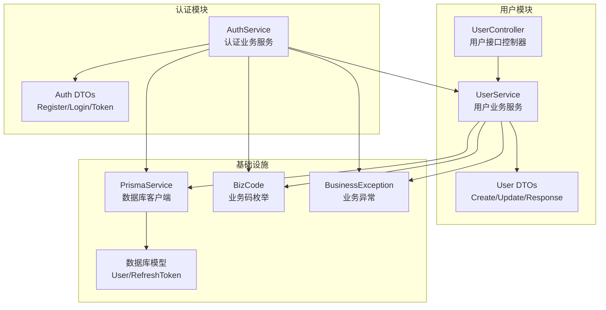
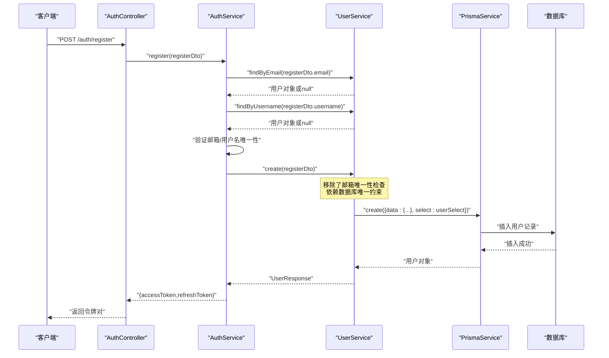
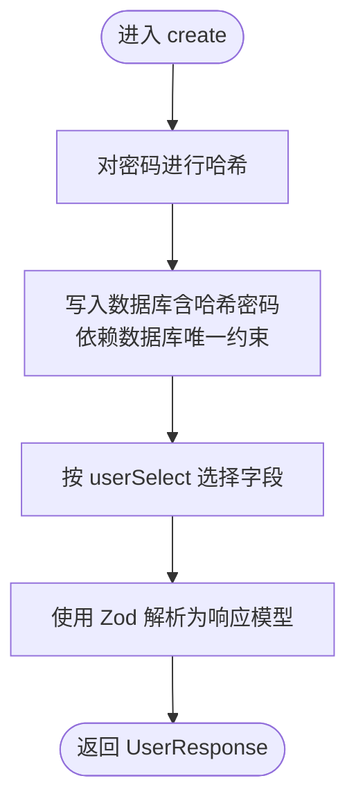
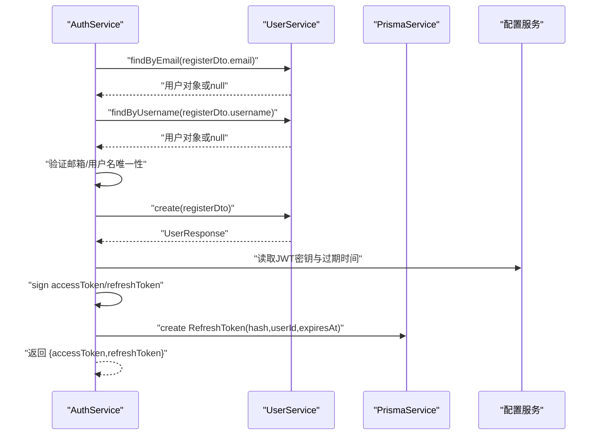
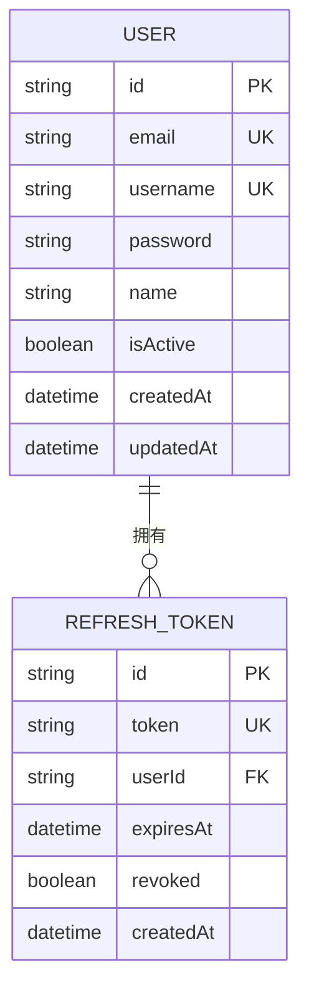
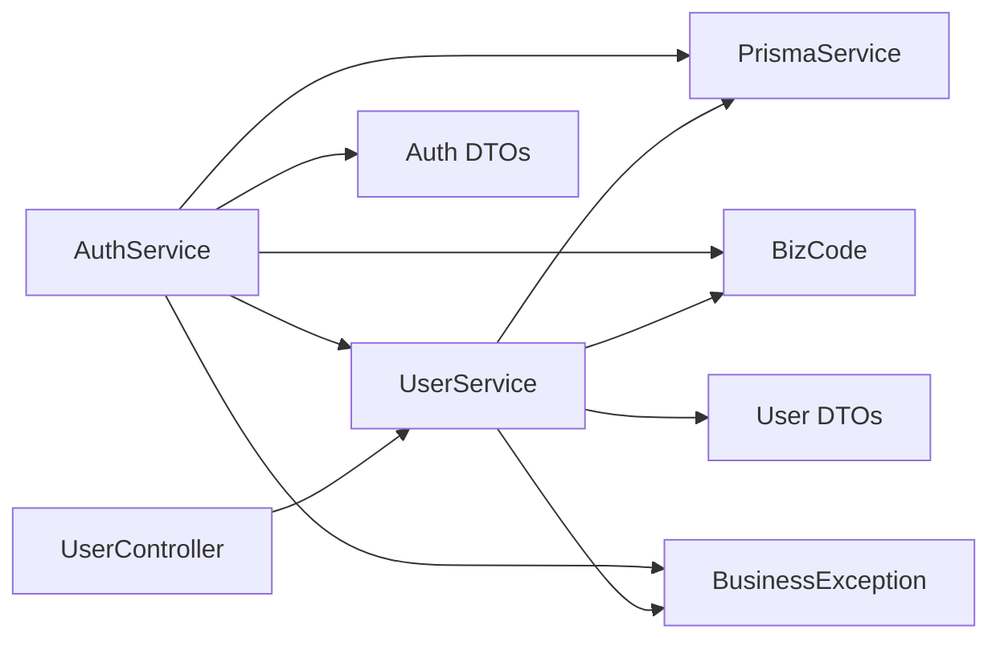

# 用户业务逻辑

<cite>
**本文引用的文件**
- [src/modules/user/user.service.ts](file://src/modules/user/user.service.ts)
- [src/modules/user/user.controller.ts](file://src/modules/user/user.controller.ts)
- [src/modules/user/dto/user.dto.ts](file://src/modules/user/dto/user.dto.ts)
- [src/modules/user/user.module.ts](file://src/modules/user/user.module.ts)
- [src/modules/auth/auth.service.ts](file://src/modules/auth/auth.service.ts)
- [src/modules/auth/dto/auth.dto.ts](file://src/modules/auth/dto/auth.dto.ts)
- [src/common/enums/biz-code.enum.ts](file://src/common/enums/biz-code.enum.ts)
- [src/common/exceptions/business.exception.ts](file://src/common/exceptions/business.exception.ts)
- [src/common/guards/jwt-auth.guard.ts](file://src/common/guards/jwt-auth.guard.ts)
- [src/common/schemas/datetime.schema.ts](file://src/common/schemas/datetime.schema.ts)
- [src/common/decorators/api-success-response.decorator.ts](file://src/common/decorators/api-success-response.decorator.ts)
- [src/prisma/prisma.service.ts](file://src/prisma/prisma.service.ts)
- [prisma/schema/User.prisma](file://prisma/schema/User.prisma)
- [prisma/schema/RefreshToken.prisma](file://prisma/schema/RefreshToken.prisma)
</cite>

## 更新摘要

**变更内容**

- 更新了用户服务的职责边界，移除了冗余的邮箱唯一性检查
- 简化了用户创建流程，将唯一性验证前置到认证服务
- 优化了邮箱唯一性验证的实现位置，提升了系统架构的一致性

## 目录

1. [简介](#简介)
2. [项目结构](#项目结构)
3. [核心组件](#核心组件)
4. [架构总览](#架构总览)
5. [详细组件分析](#详细组件分析)
6. [依赖关系分析](#依赖关系分析)
7. [性能考虑](#性能考虑)
8. [故障排查指南](#故障排查指南)
9. [结论](#结论)
10. [附录](#附录)

## 简介

本文件聚焦于用户业务逻辑，系统性阐述用户服务中的核心业务规则、数据处理流程、状态管理与生命周期控制，并给出与认证模块的集成方式、异常处理策略、事务管理建议以及性能优化要点。目标是帮助开发者与产品、测试人员快速理解用户模块的职责边界与行为特征。

**更新** 本次更新反映了邮箱唯一性验证优化：用户服务的职责边界得到明确，移除了冗余的邮箱唯一性检查，简化了用户创建流程，使系统架构更加清晰和高效。

## 项目结构

用户模块采用典型的分层设计：控制器负责接口暴露与文档标注；服务层承载业务规则与数据处理；DTO 定义输入输出结构；Prisma 提供数据库访问；认证模块通过用户服务完成登录与注册流程。

**图表来源**

- [src/modules/user/user.controller.ts:25-87](file://src/modules/user/user.controller.ts#L25-L87)
- [src/modules/user/user.service.ts:14-124](file://src/modules/user/user.service.ts#L14-L124)
- [src/modules/user/dto/user.dto.ts:1-40](file://src/modules/user/dto/user.dto.ts#L1-L40)
- [src/modules/auth/auth.service.ts:14-161](file://src/modules/auth/auth.service.ts#L14-L161)
- [src/modules/auth/dto/auth.dto.ts:1-89](file://src/modules/auth/dto/auth.dto.ts#L1-L89)
- [src/prisma/prisma.service.ts:11-43](file://src/prisma/prisma.service.ts#L11-L43)
- [prisma/schema/User.prisma:1-15](file://prisma/schema/User.prisma#L1-L15)
- [prisma/schema/RefreshToken.prisma:1-12](file://prisma/schema/RefreshToken.prisma#L1-L12)
- [src/common/enums/biz-code.enum.ts:13-78](file://src/common/enums/biz-code.enum.ts#L13-L78)
- [src/common/exceptions/business.exception.ts:16-41](file://src/common/exceptions/business.exception.ts#L16-L41)

**章节来源**

- [src/modules/user/user.module.ts:1-11](file://src/modules/user/user.module.ts#L1-L11)
- [src/modules/user/user.controller.ts:25-87](file://src/modules/user/user.controller.ts#L25-L87)
- [src/modules/user/user.service.ts:14-124](file://src/modules/user/user.service.ts#L14-L124)
- [src/modules/auth/auth.service.ts:14-161](file://src/modules/auth/auth.service.ts#L14-L161)
- [src/prisma/prisma.service.ts:11-43](file://src/prisma/prisma.service.ts#L11-L43)

## 核心组件

- 用户控制器：提供创建、查询、更新、删除用户的标准 REST 接口，并通过装饰器统一输出格式与文档。
- 用户服务：封装用户业务规则，包括密码哈希、数据选择与返回、密码验证等。**更新** 现已移除邮箱唯一性检查，专注于核心业务逻辑。
- DTO 层：使用 Zod 定义输入校验与输出模型，确保数据一致性与可文档化。
- 认证服务：基于用户服务完成登录、注册、刷新令牌与登出，涉及密码校验与令牌生成。**更新** 现在负责前置的邮箱唯一性验证。
- 异常与业务码：统一的业务异常与业务码体系，保证错误语义清晰、HTTP 映射一致。
- 数据模型：User 与 RefreshToken 模型定义用户基础信息与刷新令牌持久化。

**章节来源**

- [src/modules/user/user.controller.ts:25-87](file://src/modules/user/user.controller.ts#L25-L87)
- [src/modules/user/user.service.ts:14-124](file://src/modules/user/user.service.ts#L14-L124)
- [src/modules/user/dto/user.dto.ts:1-40](file://src/modules/user/dto/user.dto.ts#L1-L40)
- [src/modules/auth/auth.service.ts:14-161](file://src/modules/auth/auth.service.ts#L14-L161)
- [src/common/enums/biz-code.enum.ts:13-78](file://src/common/enums/biz-code.enum.ts#L13-L78)
- [src/common/exceptions/business.exception.ts:16-41](file://src/common/exceptions/business.exception.ts#L16-L41)
- [prisma/schema/User.prisma:1-15](file://prisma/schema/User.prisma#L1-L15)
- [prisma/schema/RefreshToken.prisma:1-12](file://prisma/schema/RefreshToken.prisma#L1-L12)

## 架构总览

用户模块与认证模块的交互以"用户服务"为中心：认证模块调用用户服务进行账号查询与密码校验，用户服务通过 Prisma 访问数据库；用户服务返回标准化的用户信息给认证模块，后者生成 JWT 并持久化刷新令牌。

**更新** 现在邮箱唯一性验证前置到认证服务，用户服务专注于核心业务逻辑，提升了系统的职责分离和架构清晰度。

**图表来源**

- [src/modules/auth/auth.service.ts:50-65](file://src/modules/auth/auth.service.ts#L50-L65)
- [src/modules/user/user.service.ts:17-31](file://src/modules/user/user.service.ts#L17-L31)
- [src/modules/user/user.service.ts:53-63](file://src/modules/user/user.service.ts#L53-L63)

## 详细组件分析

### 用户服务（UserService）

- 职责边界
  - 创建用户：**更新** 移除了邮箱唯一性检查，仅进行密码哈希后入库，返回标准化用户响应。
  - 查询用户：支持按 ID、邮箱、用户名、账号（邮箱或用户名）查询；提供全量列表查询。
  - 更新用户：先校验用户存在性，再执行部分字段更新。
  - 删除用户：先校验用户存在性，再删除。
  - 密码校验：使用 bcrypt 比较明文与哈希密码。
  - 数据选择：仅返回必要字段，避免敏感信息泄露。
- 关键业务规则
  - 唯一性约束：邮箱与用户名在数据库层面唯一，创建时依赖数据库唯一约束作为最终防线。
  - 密码安全：创建时必须进行哈希处理；登录时进行比对。
  - 返回模型：统一使用 Zod Schema 校验与序列化，确保对外输出一致。
- 复杂度与性能
  - 单条查询为 O(1)（基于唯一索引），批量查询受分页与索引影响。
  - 密码哈希成本较高，建议在创建与更新场景中避免重复计算。
- 错误处理
  - 用户不存在与邮箱已存在等场景抛出业务异常，由统一过滤器转换为标准响应。

**更新** 用户服务现在更加专注核心业务逻辑，移除了重复的邮箱唯一性检查，简化了创建流程，提升了代码复用性和系统效率。

**图表来源**

- [src/modules/user/user.service.ts:17-31](file://src/modules/user/user.service.ts#L17-L31)
- [src/modules/user/dto/user.dto.ts:25-33](file://src/modules/user/dto/user.dto.ts#L25-L33)
- [src/common/enums/biz-code.enum.ts:47-52](file://src/common/enums/biz-code.enum.ts#L47-L52)

**章节来源**

- [src/modules/user/user.service.ts:14-124](file://src/modules/user/user.service.ts#L14-L124)
- [src/modules/user/dto/user.dto.ts:1-40](file://src/modules/user/dto/user.dto.ts#L1-L40)
- [src/common/enums/biz-code.enum.ts:47-52](file://src/common/enums/biz-code.enum.ts#L47-L52)

### 用户控制器（UserController）

- 接口能力
  - POST users：创建用户（返回 201 与 UserResponse）。
  - GET users：获取全部用户列表（数组形式）。
  - GET users/:id：按 ID 获取用户详情。
  - PATCH users/:id：更新用户信息。
  - DELETE users/:id：删除用户。
- 文档与响应
  - 使用 Swagger 装饰器标注接口摘要、描述与成功响应格式。
  - 统一的成功响应结构与错误响应结构，便于前端与测试对接。
- 参数与验证
  - 输入参数通过 DTO 的 Zod Schema 自动校验，非法参数直接返回 400。

**章节来源**

- [src/modules/user/user.controller.ts:25-87](file://src/modules/user/user.controller.ts#L25-L87)
- [src/common/decorators/api-success-response.decorator.ts:70-128](file://src/common/decorators/api-success-response.decorator.ts#L70-L128)

### 认证服务与用户服务的协作

- 登录流程
  - 通过账号（邮箱或用户名）查询用户，若不存在或密码不匹配则抛出业务异常。
  - 成功后生成访问令牌与刷新令牌，并持久化刷新令牌。
- 注册流程
  - **更新** 现在负责前置的邮箱与用户名唯一性验证，然后委托用户服务创建用户。
- 刷新令牌
  - 对刷新令牌进行哈希存储，校验有效期与撤销状态后重新签发并撤销旧令牌。
- 登出
  - 撤销当前用户的所有未撤销刷新令牌。

**更新** 认证服务现在承担了邮箱唯一性验证的责任，确保用户服务专注于核心业务逻辑，提升了系统的职责分离。

**图表来源**

- [src/modules/auth/auth.service.ts:50-65](file://src/modules/auth/auth.service.ts#L50-L65)
- [src/modules/auth/auth.service.ts:63](file://src/modules/auth/auth.service.ts#L63)
- [src/modules/user/user.service.ts:17-31](file://src/modules/user/user.service.ts#L17-L31)

**章节来源**

- [src/modules/auth/auth.service.ts:14-161](file://src/modules/auth/auth.service.ts#L14-L161)
- [src/modules/user/user.service.ts:76-83](file://src/modules/user/user.service.ts#L76-L83)
- [src/modules/user/user.service.ts:108-113](file://src/modules/user/user.service.ts#L108-L113)

### 数据模型与状态管理

- 用户模型
  - 主键：UUID。
  - 唯一性：邮箱、用户名唯一。
  - 默认状态：isActive 默认为 true。
  - 时间戳：createdAt、updatedAt。
  - 关联：与 RefreshToken、Role 的关系。
- 刷新令牌模型
  - 唯一性：token 字段唯一（存储哈希）。
  - 索引：按 userId 建立索引，便于批量撤销。
  - 状态：revoked 标记撤销状态。
- 生命周期控制
  - 用户创建即激活；删除用户会级联删除其刷新令牌。
  - 刷新令牌有过期时间与撤销状态，支持主动登出。

**图表来源**

- [prisma/schema/User.prisma:1-15](file://prisma/schema/User.prisma#L1-L15)
- [prisma/schema/RefreshToken.prisma:1-12](file://prisma/schema/RefreshToken.prisma#L1-L12)

**章节来源**

- [prisma/schema/User.prisma:1-15](file://prisma/schema/User.prisma#L1-L15)
- [prisma/schema/RefreshToken.prisma:1-12](file://prisma/schema/RefreshToken.prisma#L1-L12)

### DTO 与数据转换

- 输入 DTO
  - CreateUserDto：邮箱、用户名、密码、可选姓名。
  - UpdateUserDto：Create 的部分字段，排除密码。
- 输出 DTO
  - UserResponseDto：标准化用户输出，包含 id、email、username、name、isActive、createdAt、updatedAt。
- 数据转换
  - 控制器接收输入 DTO，服务层返回 Zod 解析后的响应对象，确保字段类型与格式一致。
  - 日期时间使用 DateTimeStringSchema，支持 Date 对象与字符串两种输入，统一输出为 "YYYY-MM-DD HH:mm:ss" 字符串。

**章节来源**

- [src/modules/user/dto/user.dto.ts:1-40](file://src/modules/user/dto/user.dto.ts#L1-L40)
- [src/common/schemas/datetime.schema.ts:13-25](file://src/common/schemas/datetime.schema.ts#L13-L25)

### 业务异常与状态码

- 业务异常 BusinessException
  - 统一封装业务码、消息与细节，自动映射为对应 HTTP 状态码。
- 业务码（用户模块）
  - USER_NOT_FOUND：用户不存在。
  - USER_EMAIL_EXISTS：邮箱已存在。
- 与认证模块的协同
  - 认证模块在登录凭据无效、邮箱/用户名冲突、刷新令牌无效等场景使用相应业务码。

**章节来源**

- [src/common/exceptions/business.exception.ts:16-41](file://src/common/exceptions/business.exception.ts#L16-L41)
- [src/common/enums/biz-code.enum.ts:47-52](file://src/common/enums/biz-code.enum.ts#L47-L52)
- [src/common/enums/biz-code.enum.ts:94-101](file://src/common/enums/biz-code.enum.ts#L94-L101)

### 与认证模块的集成与数据共享

- 集成点
  - 登录：AuthService 调用 UserService.findByAccount 与 validatePassword。
  - 注册：**更新** 现在由 AuthService 先校验唯一性，再调用 UserService.create。
  - 令牌生成：AuthService 基于用户 ID 生成 JWT，并持久化刷新令牌。
- 数据共享
  - 用户服务返回不含密码的用户信息给认证服务，避免敏感信息泄露。
  - 刷新令牌以哈希形式存储，提升安全性。

**更新** 认证服务现在承担了邮箱唯一性验证的职责，确保用户服务专注于核心业务逻辑，提升了系统的职责分离和架构清晰度。

**章节来源**

- [src/modules/auth/auth.service.ts:29-43](file://src/modules/auth/auth.service.ts#L29-L43)
- [src/modules/auth/auth.service.ts:50-65](file://src/modules/auth/auth.service.ts#L50-L65)
- [src/modules/auth/auth.service.ts:117-153](file://src/modules/auth/auth.service.ts#L117-L153)
- [src/modules/user/user.service.ts:76-83](file://src/modules/user/user.service.ts#L76-L83)
- [src/modules/user/user.service.ts:108-113](file://src/modules/user/user.service.ts#L108-L113)

## 依赖关系分析

- 模块内聚
  - UserModule 将控制器与服务导出，便于其他模块按需注入。
- 外部依赖
  - PrismaService 提供数据库访问能力，User 与 RefreshToken 模型定义数据结构。
  - bcrypt 用于密码哈希与校验。
  - Zod 用于 DTO 的输入校验与输出解析。
  - Swagger 装饰器用于接口文档与统一响应结构。
- 耦合与风险
  - 用户服务与 Prisma 存在直接耦合，建议在复杂场景引入仓储模式以增强可测试性。
  - 业务码集中管理，降低跨模块沟通成本。

**更新** 通过将邮箱唯一性验证从用户服务移除，降低了模块间的耦合度，提升了系统的内聚性和可维护性。

**图表来源**

- [src/modules/user/user.controller.ts:25-87](file://src/modules/user/user.controller.ts#L25-L87)
- [src/modules/user/user.service.ts:14-124](file://src/modules/user/user.service.ts#L14-L124)
- [src/modules/auth/auth.service.ts:14-161](file://src/modules/auth/auth.service.ts#L14-L161)
- [src/common/enums/biz-code.enum.ts:13-78](file://src/common/enums/biz-code.enum.ts#L13-L78)
- [src/common/exceptions/business.exception.ts:16-41](file://src/common/exceptions/business.exception.ts#L16-L41)

**章节来源**

- [src/modules/user/user.module.ts:1-11](file://src/modules/user/user.module.ts#L1-L11)
- [src/modules/user/user.controller.ts:25-87](file://src/modules/user/user.controller.ts#L25-L87)
- [src/modules/user/user.service.ts:14-124](file://src/modules/user/user.service.ts#L14-L124)
- [src/modules/auth/auth.service.ts:14-161](file://src/modules/auth/auth.service.ts#L14-L161)

## 性能考虑

- 查询优化
  - 使用 select 精准投影，避免不必要的字段传输。
  - 对高频查询建立合适索引（如邮箱、用户名唯一索引）。
- 密码处理
  - 哈希成本较高，建议在批量导入或后台任务中异步处理，避免阻塞主流程。
- 令牌持久化
  - 刷新令牌以哈希存储，减少明文泄露风险；定期清理过期与撤销令牌。
- 并发与事务
  - 创建用户时的唯一性检查现在由数据库唯一约束保障，减少了重复的查询开销。
  - 若引入更复杂的业务流程（如角色分配），建议使用数据库事务包裹，确保原子性。

**更新** 通过移除重复的邮箱唯一性检查，减少了数据库查询次数，提升了用户创建的性能表现。

## 故障排查指南

- 常见问题与定位
  - 用户不存在：检查 ID 是否正确、是否被删除。
  - 邮箱已存在：**更新** 现在由认证服务负责前置验证，检查注册流程。
  - 登录失败：核对账号是否存在、密码是否正确、是否被锁定。
  - 刷新令牌无效：检查是否过期、是否已被撤销。
- 日志与监控
  - 使用拦截器与日志模块记录请求与响应，定位异常链路。
  - 结合业务码与 HTTP 状态码快速判断错误类型。
- 事务与一致性
  - 在多步骤业务中使用事务，确保数据一致性；失败时回滚并抛出业务异常。

**更新** 现在邮箱唯一性验证集中在认证服务，便于定位和调试注册相关的业务异常。

**章节来源**

- [src/common/enums/biz-code.enum.ts:47-52](file://src/common/enums/biz-code.enum.ts#L47-L52)
- [src/common/enums/biz-code.enum.ts:94-101](file://src/common/enums/biz-code.enum.ts#L94-L101)
- [src/common/exceptions/business.exception.ts:16-41](file://src/common/exceptions/business.exception.ts#L16-L41)

## 结论

用户模块通过清晰的分层与强约束的 DTO，实现了稳定的数据输入输出与一致的业务行为。**更新** 通过优化邮箱唯一性验证的位置，明确了用户服务的职责边界，移除了冗余逻辑，提升了系统的架构清晰度和性能表现。与认证模块的紧密协作确保了登录、注册与令牌管理的安全与可靠。建议在后续演进中关注事务管理、仓储抽象与缓存策略，以进一步提升可维护性与性能。

## 附录

### 用户服务接口说明

- 创建用户
  - 方法：POST /users
  - 参数：CreateUserDto（邮箱、用户名、密码、可选姓名）
  - 返回：UserResponse（201 Created）
  - 校验：**更新** 移除了邮箱唯一性检查，依赖数据库唯一约束
- 获取用户列表
  - 方法：GET /users
  - 返回：UserResponse[]（200 OK）
- 获取用户详情
  - 方法：GET /users/:id
  - 参数：id（字符串）
  - 返回：UserResponse（200 OK）
- 更新用户
  - 方法：PATCH /users/:id
  - 参数：UpdateUserDto（部分字段）
  - 返回：UserResponse（200 OK）
- 删除用户
  - 方法：DELETE /users/:id
  - 返回：无数据（200 OK）

**更新** 用户创建接口现在更加简洁，专注于核心业务逻辑，减少了重复的唯一性检查，提升了系统效率。

**章节来源**

- [src/modules/user/user.controller.ts:31-86](file://src/modules/user/user.controller.ts#L31-L86)
- [src/modules/user/dto/user.dto.ts:1-40](file://src/modules/user/dto/user.dto.ts#L1-L40)
- [src/common/decorators/api-success-response.decorator.ts:70-128](file://src/common/decorators/api-success-response.decorator.ts#L70-L128)
