# 用户数据模型

<cite>
**本文档引用的文件**
- [User.prisma](file://prisma/schema/User.prisma)
- [Role.prisma](file://prisma/schema/Role.prisma)
- [RefreshToken.prisma](file://prisma/schema/RefreshToken.prisma)
- [Menu.prisma](file://prisma/schema/Menu.prisma)
- [user.dto.ts](file://src/modules/user/dto/user.dto.ts)
- [user.service.ts](file://src/modules/user/user.service.ts)
- [user.controller.ts](file://src/modules/user/user.controller.ts)
- [user.interface.ts](file://src/common/interfaces/user.interface.ts)
- [datetime.schema.ts](file://src/common/schemas/datetime.schema.ts)
- [biz-code.enum.ts](file://src/common/enums/biz-code.enum.ts)
- [business.exception.ts](file://src/common/exceptions/business.exception.ts)
- [api-success-response.decorator.ts](file://src/common/decorators/api-success-response.decorator.ts)
</cite>

## 目录

1. [简介](#简介)
2. [项目结构](#项目结构)
3. [核心组件](#核心组件)
4. [架构概览](#架构概览)
5. [详细组件分析](#详细组件分析)
6. [依赖关系分析](#依赖关系分析)
7. [性能考虑](#性能考虑)
8. [故障排除指南](#故障排除指南)
9. [结论](#结论)

## 简介

本文档详细介绍了用户数据模型的设计与实现，包括用户实体的字段定义、数据类型和约束规则。文档涵盖了用户 DTO（数据传输对象）的设计，包括请求参数验证、响应数据格式和数据转换逻辑。同时，文档还解释了用户模型的主键、外键关系、索引设计和数据库约束，并提供了用户数据的序列化和反序列化示例，包括嵌套对象处理和数据校验规则。最后，文档解释了用户模型与其他实体的关系，如角色、权限和刷新令牌的关联。

## 项目结构

用户数据模型位于项目的以下关键位置：

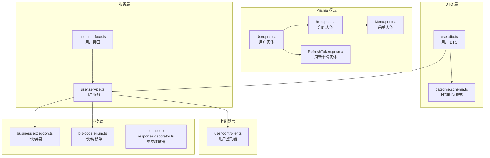

**图表来源**

- [User.prisma:1-15](file://prisma/schema/User.prisma#L1-L15)
- [Role.prisma:1-13](file://prisma/schema/Role.prisma#L1-L13)
- [RefreshToken.prisma:1-12](file://prisma/schema/RefreshToken.prisma#L1-L12)
- [Menu.prisma:1-28](file://prisma/schema/Menu.prisma#L1-L28)

**章节来源**

- [User.prisma:1-15](file://prisma/schema/User.prisma#L1-L15)
- [user.dto.ts:1-40](file://src/modules/user/dto/user.dto.ts#L1-L40)
- [user.service.ts:1-125](file://src/modules/user/user.service.ts#L1-L125)

## 核心组件

### 用户实体模型

用户实体是整个用户系统的中心，具有以下核心字段：

| 字段名    | 类型     | 约束       | 描述                   |
| --------- | -------- | ---------- | ---------------------- |
| id        | String   | 主键, UUID | 用户唯一标识符         |
| email     | String   | 唯一索引   | 用户邮箱地址，用于登录 |
| username  | String   | 唯一索引   | 用户名，用于系统标识   |
| password  | String   | 必填       | 用户密码（加密存储）   |
| name      | String   | 可选       | 用户显示名称           |
| isActive  | Boolean  | 默认true   | 用户账户状态           |
| createdAt | DateTime | 默认now()  | 创建时间戳             |
| updatedAt | DateTime | 自动更新   | 最后更新时间戳         |

### 角色关联模型

用户与角色之间存在多对多关系，通过中间表实现：

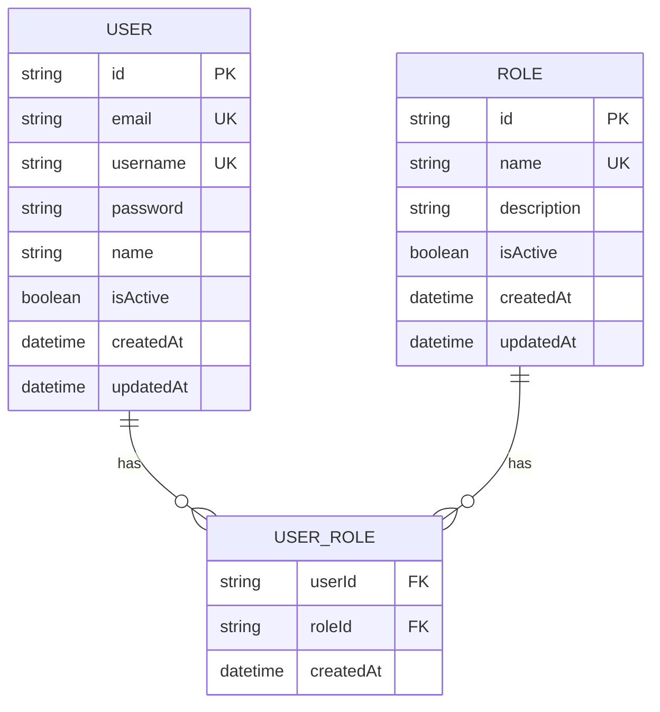

**图表来源**

- [User.prisma:1-15](file://prisma/schema/User.prisma#L1-L15)
- [Role.prisma:1-13](file://prisma/schema/Role.prisma#L1-L13)

### 刷新令牌模型

用户与刷新令牌之间存在一对多关系：

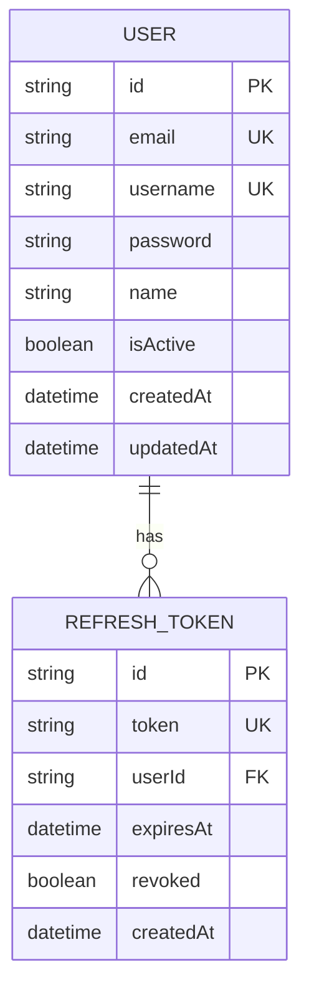

**图表来源**

- [User.prisma:1-15](file://prisma/schema/User.prisma#L1-L15)
- [RefreshToken.prisma:1-12](file://prisma/schema/RefreshToken.prisma#L1-L12)

**章节来源**

- [User.prisma:1-15](file://prisma/schema/User.prisma#L1-L15)
- [Role.prisma:1-13](file://prisma/schema/Role.prisma#L1-L13)
- [RefreshToken.prisma:1-12](file://prisma/schema/RefreshToken.prisma#L1-L12)

## 架构概览

用户系统的整体架构采用分层设计，确保关注点分离和可维护性：

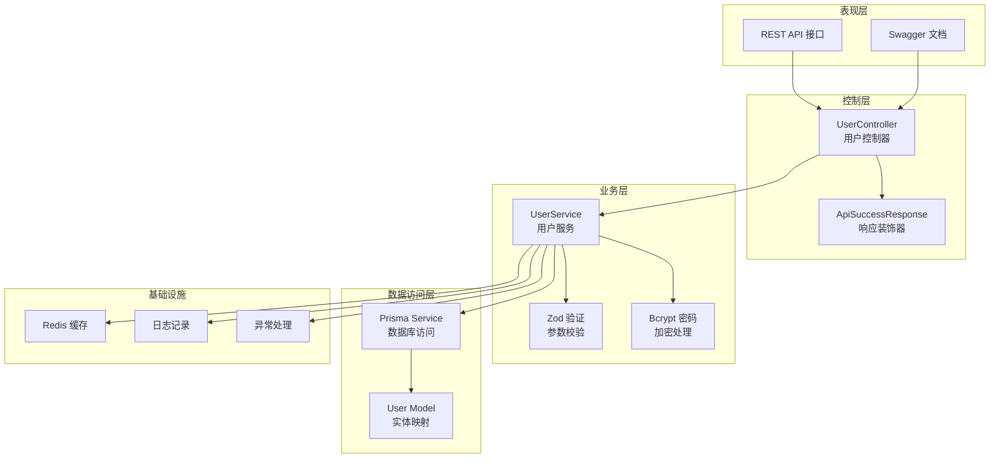

**图表来源**

- [user.controller.ts:1-88](file://src/modules/user/user.controller.ts#L1-L88)
- [user.service.ts:1-125](file://src/modules/user/user.service.ts#L1-L125)
- [user.dto.ts:1-40](file://src/modules/user/dto/user.dto.ts#L1-L40)

## 详细组件分析

### 用户 DTO 设计

用户 DTO 使用 Zod 进行类型安全的参数验证，确保数据在进入业务逻辑之前就得到验证。

#### 创建用户 DTO

创建用户 DTO 定义了严格的验证规则：

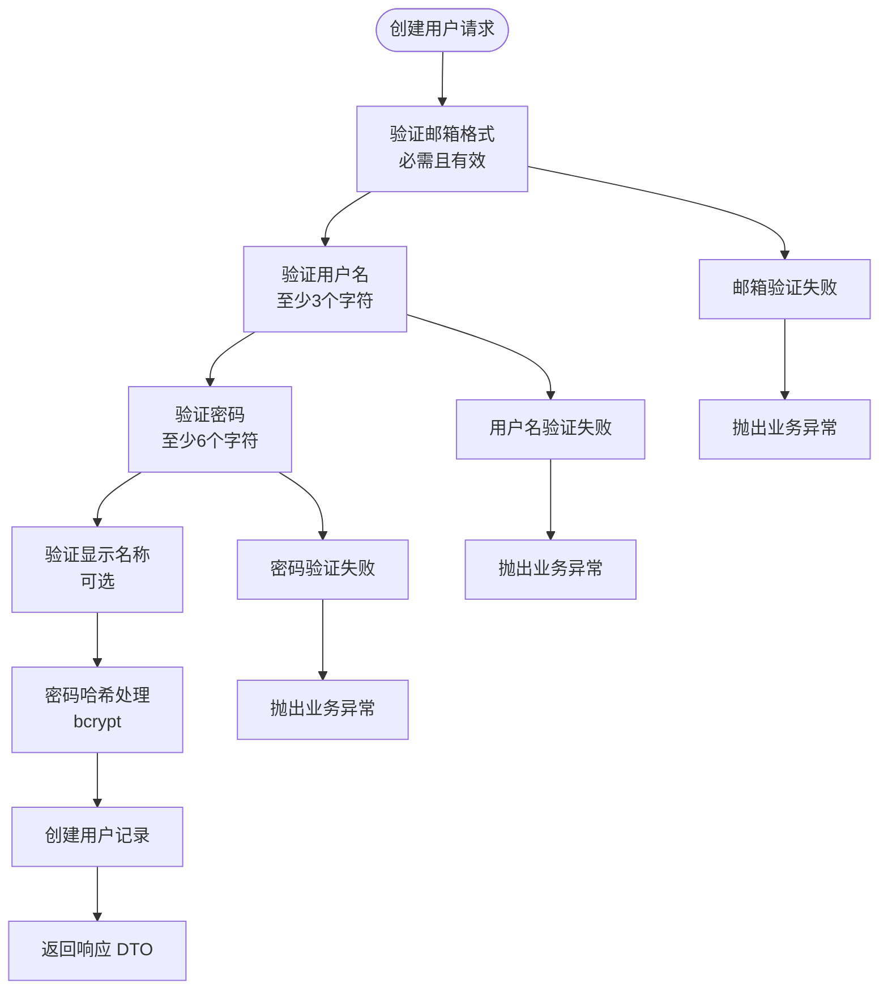

**图表来源**

- [user.dto.ts:5-19](file://src/modules/user/dto/user.dto.ts#L5-L19)
- [user.service.ts:17-37](file://src/modules/user/user.service.ts#L17-L37)

#### 更新用户 DTO

更新用户 DTO 继承了创建 DTO 的验证规则，但移除了密码字段的必填要求：

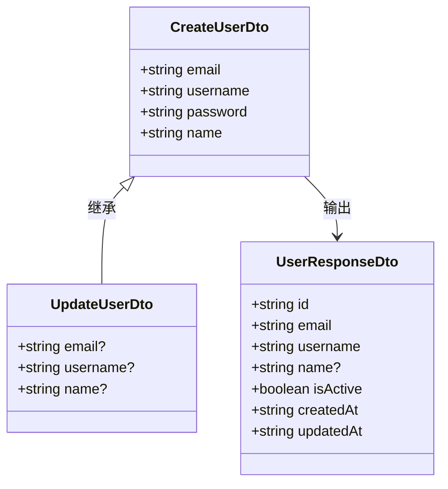

**图表来源**

- [user.dto.ts:21-39](file://src/modules/user/dto/user.dto.ts#L21-L39)

#### 响应 DTO 设计

响应 DTO 确保对外暴露的数据格式统一且安全：

| 字段      | 类型    | 是否可空 | 描述                            |
| --------- | ------- | -------- | ------------------------------- |
| id        | string  | 否       | 用户唯一标识符（UUID）          |
| email     | string  | 否       | 用户邮箱地址                    |
| username  | string  | 否       | 用户名                          |
| name      | string  | 是       | 用户显示名称                    |
| isActive  | boolean | 否       | 是否启用                        |
| createdAt | string  | 否       | 创建时间（YYYY-MM-DD HH:mm:ss） |
| updatedAt | string  | 否       | 更新时间（YYYY-MM-DD HH:mm:ss） |

**章节来源**

- [user.dto.ts:1-40](file://src/modules/user/dto/user.dto.ts#L1-L40)
- [datetime.schema.ts:1-26](file://src/common/schemas/datetime.schema.ts#L1-L26)

### 用户服务实现

用户服务层实现了完整的用户生命周期管理：

#### 用户创建流程

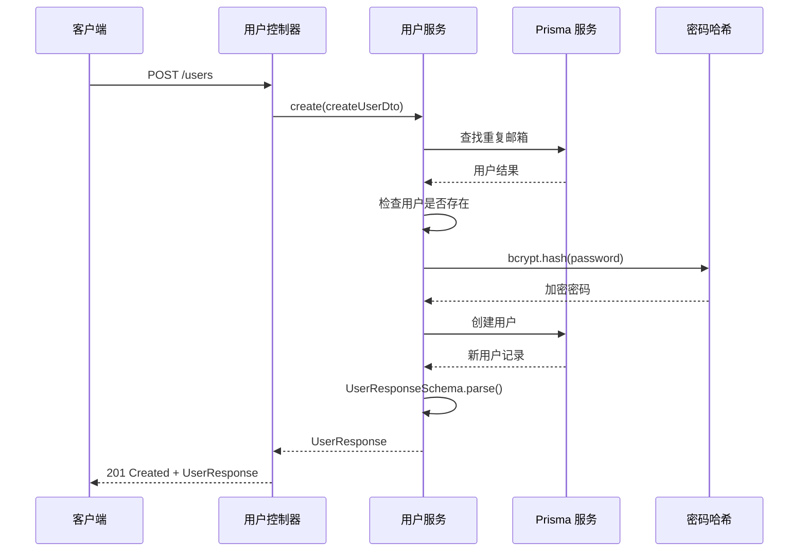

**图表来源**

- [user.controller.ts:31-41](file://src/modules/user/user.controller.ts#L31-L41)
- [user.service.ts:17-37](file://src/modules/user/user.service.ts#L17-L37)

#### 用户查询流程

用户服务提供了多种查询方式：

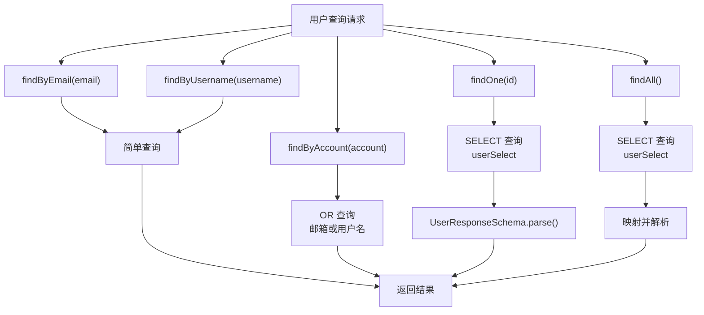

**图表来源**

- [user.service.ts:39-83](file://src/modules/user/user.service.ts#L39-L83)

**章节来源**

- [user.service.ts:1-125](file://src/modules/user/user.service.ts#L1-L125)

### 数据验证机制

系统采用了多层次的数据验证机制：

#### 参数验证流程

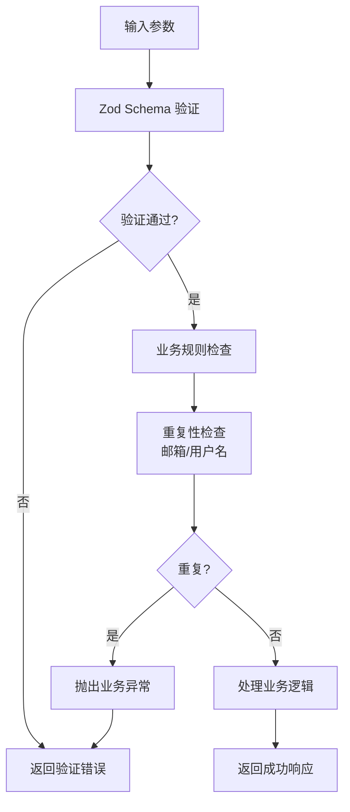

**图表来源**

- [user.dto.ts:5-19](file://src/modules/user/dto/user.dto.ts#L5-L19)
- [user.service.ts:17-24](file://src/modules/user/user.service.ts#L17-L24)

#### 业务异常处理

系统使用统一的业务异常处理机制：

| 异常类型     | 业务码 | HTTP 状态码 | 描述               |
| ------------ | ------ | ----------- | ------------------ |
| 用户不存在   | 20001  | 404         | 用户查询不到       |
| 邮箱已存在   | 20002  | 409         | 创建用户时邮箱重复 |
| 密码验证失败 | 10001  | 401         | 登录凭证无效       |

**章节来源**

- [biz-code.enum.ts:47-52](file://src/common/enums/biz-code.enum.ts#L47-L52)
- [business.exception.ts:1-42](file://src/common/exceptions/business.exception.ts#L1-L42)

### 序列化和反序列化

系统实现了严格的数据序列化和反序列化机制：

#### 日期时间序列化

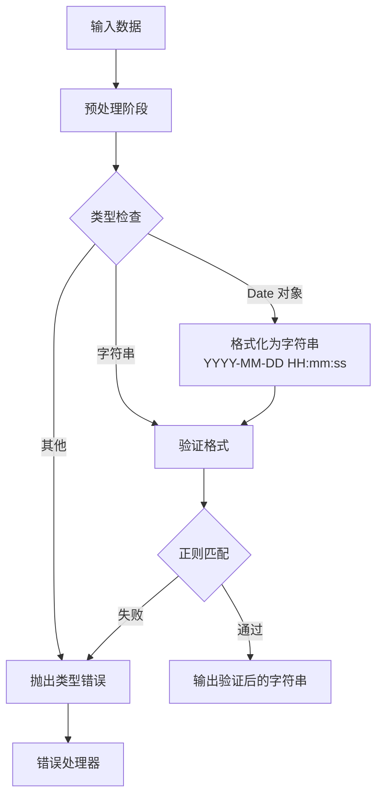

**图表来源**

- [datetime.schema.ts:13-25](file://src/common/schemas/datetime.schema.ts#L13-L25)

#### 响应数据转换

用户服务使用 Zod Schema 进行数据转换：

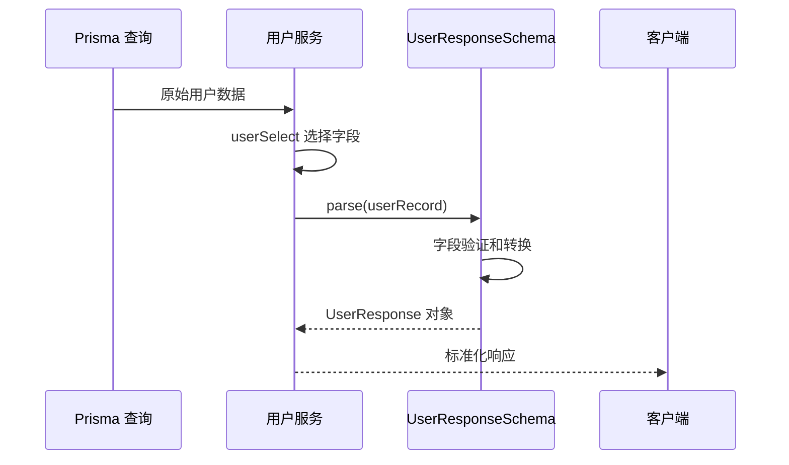

**图表来源**

- [user.service.ts:36-43](file://src/modules/user/user.service.ts#L36-L43)
- [user.dto.ts:25-33](file://src/modules/user/dto/user.dto.ts#L25-L33)

**章节来源**

- [datetime.schema.ts:1-26](file://src/common/schemas/datetime.schema.ts#L1-L26)
- [user.service.ts:115-123](file://src/modules/user/user.service.ts#L115-L123)

## 依赖关系分析

用户数据模型的依赖关系体现了清晰的关注点分离：

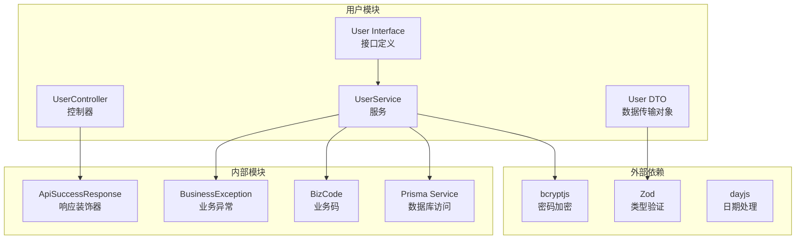

**图表来源**

- [user.controller.ts:1-88](file://src/modules/user/user.controller.ts#L1-L88)
- [user.service.ts:1-125](file://src/modules/user/user.service.ts#L1-L125)
- [user.dto.ts:1-40](file://src/modules/user/dto/user.dto.ts#L1-L40)

### 关键依赖特性

1. **类型安全**: 使用 Zod 确保编译时和运行时的类型安全
2. **数据一致性**: 通过 Prisma 的关系映射保证数据完整性
3. **错误处理**: 统一的业务异常处理机制
4. **API 文档**: 自动生成的 Swagger 文档

**章节来源**

- [user.controller.ts:1-88](file://src/modules/user/user.controller.ts#L1-L88)
- [user.service.ts:1-125](file://src/modules/user/user.service.ts#L1-L125)

## 性能考虑

### 查询优化

用户服务使用了精确的选择字段查询，避免不必要的数据传输：

```typescript
private readonly userSelect = {
  id: true,
  email: true,
  username: true,
  name: true,
  isActive: true,
  createdAt: true,
  updatedAt: true,
} as const;
```

### 缓存策略

建议在用户查询中实现缓存机制：

1. **用户详情缓存**: 对常用用户查询结果进行缓存
2. **用户列表缓存**: 对用户列表查询结果进行缓存
3. **角色权限缓存**: 对用户角色和权限信息进行缓存

### 数据库索引

当前数据库设计已经包含了必要的索引：

- 用户邮箱和用户名的唯一索引
- 刷新令牌的用户 ID 索引
- 菜单的父节点索引

## 故障排除指南

### 常见问题及解决方案

#### 用户创建失败

**问题**: 创建用户时报错"用户邮箱已存在"

**原因**: 邮箱地址已被其他用户使用

**解决方案**:

1. 检查邮箱地址是否唯一
2. 提供不同的邮箱地址
3. 验证邮箱格式是否正确

#### 用户查询异常

**问题**: 查询用户时报错"用户不存在"

**原因**: 用户 ID 无效或用户已被删除

**解决方案**:

1. 验证用户 ID 格式
2. 确认用户存在性
3. 检查用户状态

#### 密码验证失败

**问题**: 登录时提示"凭证无效"

**原因**: 密码不正确或用户不存在

**解决方案**:

1. 验证用户名或邮箱
2. 检查密码强度
3. 确认用户账户状态

**章节来源**

- [biz-code.enum.ts:47-52](file://src/common/enums/biz-code.enum.ts#L47-L52)
- [business.exception.ts:1-42](file://src/common/exceptions/business.exception.ts#L1-L42)

## 结论

用户数据模型设计遵循了现代 Web 应用的最佳实践，具有以下特点：

1. **类型安全**: 使用 Zod 实现编译时和运行时的类型验证
2. **数据完整性**: 通过 Prisma 的关系映射和约束保证数据一致性
3. **安全性**: 密码使用 bcrypt 进行安全存储，支持刷新令牌机制
4. **可扩展性**: 清晰的分层架构便于功能扩展和维护
5. **可观测性**: 完善的 API 文档和错误处理机制

该设计为用户管理系统提供了坚实的基础，能够支持复杂的业务需求和高并发场景。通过合理的数据模型设计和严格的验证机制，确保了系统的稳定性和可靠性。
